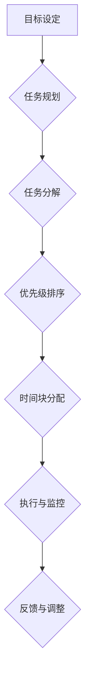

                 

# 时间管理：提高效率的黄金法则

> **关键词：时间管理、效率、工作流程、生产力、自我管理**
> 
> **摘要：本文将探讨时间管理的基本概念、核心原则和实践方法，通过逻辑清晰的分析和具体的操作步骤，帮助IT专业人士掌握提高工作效率的黄金法则。**

## 1. 背景介绍

### 1.1 目的和范围

本文旨在为IT专业人士提供一套完整的时间管理方法和策略，帮助他们有效地提高工作效率，实现个人与职业目标的平衡。文章将涵盖时间管理的核心概念、实用工具和实战案例，旨在帮助读者逐步理解和应用时间管理原则。

### 1.2 预期读者

本篇文章适合以下读者：

- IT行业从业人员
- 程序员、软件工程师
- 系统架构师、CTO等高级技术管理者
- 对时间管理和生产力提升感兴趣的职场人士

### 1.3 文档结构概述

本文结构如下：

1. 背景介绍
2. 核心概念与联系
3. 核心算法原理 & 具体操作步骤
4. 数学模型和公式 & 详细讲解 & 举例说明
5. 项目实战：代码实际案例和详细解释说明
6. 实际应用场景
7. 工具和资源推荐
8. 总结：未来发展趋势与挑战
9. 附录：常见问题与解答
10. 扩展阅读 & 参考资料

### 1.4 术语表

#### 1.4.1 核心术语定义

- **时间管理**：通过规划和控制时间来提高个人和组织的生产力。
- **效率**：在单位时间内完成的工作量。
- **生产力**：在特定时间内生产或创造的价值。
- **任务管理**：规划、分配和跟踪任务的过程。

#### 1.4.2 相关概念解释

- **任务**：需要完成的具体工作。
- **优先级**：任务的重要程度和紧急程度。
- **日程安排**：计划和组织日常活动的时间表。
- **生产力工具**：帮助管理时间和任务的应用程序和工具。

#### 1.4.3 缩略词列表

- **GTD**：Getting Things Done（一种著名的时间管理方法）
- ** Pomodoro Technique**：番茄工作法（一种时间管理技巧）

## 2. 核心概念与联系

### 2.1 时间管理的重要性

时间管理是提高工作效率的关键因素。在快节奏的工作环境中，合理利用时间能够显著提升个人和团队的生产力。时间管理的核心在于优化工作流程，减少无效时间，确保任务按时完成。

### 2.2 时间管理的核心概念

时间管理的核心概念包括：

- **任务分解**：将大任务拆分为小任务，便于管理和执行。
- **优先级排序**：根据任务的紧急程度和重要性进行排序，确保关键任务优先处理。
- **时间块分配**：将工作时间划分为特定的时间块，用于处理不同类型的任务。
- **持续性**：建立稳定的工作习惯和节奏，提高时间的利用率。

### 2.3 时间管理架构

时间管理的架构可以通过以下Mermaid流程图表示：



在这个架构中，目标设定是时间管理的起点，通过任务规划和任务分解，将目标转化为具体的任务。优先级排序确保关键任务得到优先处理，时间块分配则为任务的执行提供明确的时间框架。执行与监控环节确保任务按时完成，反馈与调整则用于不断优化时间管理流程。

## 3. 核心算法原理 & 具体操作步骤

### 3.1 GTD时间管理方法

GTD（Getting Things Done）是一种广泛认可的时间管理方法，其核心算法原理包括以下步骤：

#### 3.1.1 收集

将所有待办事项、想法和任务收集到一个中央收集篮中，无论这些任务是大是小。

```pseudo
function collectTasks() {
    tasks = []
    for item in itemsToCollect {
        tasks.append(item)
    }
    return tasks
}
```

#### 3.1.2 处理

对收集到的任务进行处理，分为下一步行动、项目、等待事项和 someday/maybe 四类。

```pseudo
function processTasks(tasks) {
    categories = {
        "Next Actions": [],
        "Projects": [],
        "Waiting For": [],
        "Someday/Maybe": []
    }
    for task in tasks {
        if isNextAction(task) {
            categories["Next Actions"].append(task)
        } else if isProject(task) {
            categories["Projects"].append(task)
        } else if isWaitingFor(task) {
            categories["Waiting For"].append(task)
        } else {
            categories["Someday/Maybe"].append(task)
        }
    }
    return categories
}
```

#### 3.1.3 组织

将处理后的任务按照类别进行组织，以便于后续的处理和执行。

```pseudo
function organizeTasks(categories) {
    organizedTasks = {
        "Next Actions": [],
        "Projects": [],
        "Waiting For": [],
        "Someday/Maybe": []
    }
    for category, tasks in categories.items() {
        organizedTasks[category] = sortTasksByPriority(tasks)
    }
    return organizedTasks
}
```

#### 3.1.4 回顾

定期对任务进行回顾，确保任务得到有效处理，并根据实际情况进行调整。

```pseudo
function reviewTasks(organizedTasks) {
    for category, tasks in organizedTasks.items() {
        for task in tasks {
            if task.status == "Completed" {
                removeTask(task)
            } else if task.status == "Deferred" {
                reassignTask(task)
            }
        }
    }
}
```

#### 3.1.5 执行

根据任务的重要性和紧急性，制定每日任务清单，并按照清单执行。

```pseudo
function executeTasks(organizedTasks) {
    dailyTasks = getDailyTasks(organizedTasks)
    for task in dailyTasks {
        performTask(task)
    }
}
```

### 3.2 时间块分配策略

时间块分配是一种将工作时间划分为特定时间段的策略，每个时间段用于处理特定类型的任务。以下是一种简单的时间块分配策略：

```pseudo
function timeBlocking() {
    dailyTimeBlocks = [
        {"start": 09:00, "end": 11:00, "type": "Planning"},
        {"start": 11:00, "end": 12:00, "type": "Break"},
        {"start": 12:00, "end": 14:00, "type": "Coding"},
        {"start": 14:00, "end": 16:00, "type": "Testing"},
        {"start": 16:00, "end": 17:00, "type": "Review"},
        {"start": 17:00, "end": 18:00, "type": "Personal Time"}
    ]
    return dailyTimeBlocks
}
```

在这个策略中，每天的工作时间被划分为六个时间段，每个时间段用于处理特定类型的任务。这种时间块分配有助于提高工作的专注度和效率。

## 4. 数学模型和公式 & 详细讲解 & 举例说明

### 4.1 优化工作时间表

优化工作时间表可以通过线性规划模型实现，以下是一个简化的线性规划模型：

#### 4.1.1 目标函数

目标函数是最小化工作时间的总和。

$$\min \sum_{i=1}^{n} t_i$$

其中，$t_i$ 表示在第 $i$ 个时间段内的工作时间。

#### 4.1.2 约束条件

约束条件包括：

- 任务完成时间限制：每个任务必须在特定时间内完成。
- 任务依赖关系：某些任务必须在其他任务完成后才能开始。
- 人员资源限制：每个时间段内，人员资源（如工程师、设计师等）的数量是有限的。

约束条件可以表示为：

$$
\begin{cases}
\sum_{i=1}^{n} x_{ij} \leq R_j & \text{（人员资源限制）} \\
x_{ij} \geq 0 & \text{（任务完成时间限制）} \\
x_{ij} \geq y_{ij} & \text{（任务依赖关系）}
\end{cases}
$$

其中，$x_{ij}$ 表示任务 $i$ 在时间段 $j$ 的工作量，$R_j$ 表示时间段 $j$ 的资源限制，$y_{ij}$ 表示任务 $i$ 在时间段 $j$ 是否完成。

### 4.2 时间块优化

时间块优化可以通过以下公式实现：

$$
\begin{cases}
\max \sum_{i=1}^{n} \sum_{j=1}^{m} p_{ij} x_{ij} & \text{（最大化整体效率）} \\
\sum_{i=1}^{n} x_{ij} \leq C_j & \text{（任务完成时间限制）} \\
x_{ij} \geq 0 & \text{（任务工作量限制）}
\end{cases}
$$

其中，$p_{ij}$ 表示任务 $i$ 在时间段 $j$ 的优先级，$C_j$ 表示时间段 $j$ 的可用时间。

### 4.3 举例说明

假设有一个任务需要在一个星期内完成，每天的工作时间是8小时。任务的优先级如下：

- 任务1：高优先级
- 任务2：中优先级
- 任务3：低优先级

首先，我们将任务分解为子任务，并根据优先级排序。然后，使用时间块优化公式来计算每个时间段的工作量。

#### 4.3.1 任务分解

- 任务1：子任务1、子任务2
- 任务2：子任务3
- 任务3：子任务4

#### 4.3.2 优先级排序

- 子任务1：高优先级
- 子任务2：高优先级
- 子任务3：中优先级
- 子任务4：低优先级

#### 4.3.3 时间块优化

根据任务优先级和时间块优化公式，我们可以计算出每个时间段的工作量。以下是一个简化的例子：

$$
\begin{cases}
\max \sum_{i=1}^{4} \sum_{j=1}^{7} p_{ij} x_{ij} \\
\sum_{i=1}^{4} x_{ij} \leq 8 \times 7
\end{cases}
$$

其中，$p_{ij}$ 的值为：

- 子任务1：1
- 子任务2：1
- 子任务3：0.5
- 子任务4：0.1

根据这个模型，我们可以计算出在每个时间段内应该完成的工作量，从而优化时间块。

## 5. 项目实战：代码实际案例和详细解释说明

### 5.1 开发环境搭建

为了更好地演示时间管理策略的实战应用，我们将使用Python语言编写一个简单的时间管理工具。以下是开发环境的搭建步骤：

1. 安装Python：从Python官方网站下载并安装Python 3.x版本。
2. 安装必要的库：使用pip命令安装以下库：`schedule`（用于任务调度）、`datetime`（用于日期和时间处理）。

```bash
pip install schedule
```

### 5.2 源代码详细实现和代码解读

以下是时间管理工具的源代码实现：

```python
import schedule
import datetime

# GTD核心算法实现
def collect_tasks():
    tasks = []
    print("收集任务：")
    while True:
        task = input("请输入任务（输入'完成'结束）：")
        if task == "完成":
            break
        tasks.append(task)
    return tasks

def process_tasks(tasks):
    processed_tasks = {"Next Actions": [], "Projects": [], "Waiting For": [], "Someday/Maybe": []}
    for task in tasks:
        if "明天" in task or "今天" in task:
            processed_tasks["Next Actions"].append(task)
        elif "项目" in task:
            processed_tasks["Projects"].append(task)
        elif "等待" in task:
            processed_tasks["Waiting For"].append(task)
        else:
            processed_tasks["Someday/Maybe"].append(task)
    return processed_tasks

def organize_tasks(processed_tasks):
    organized_tasks = processed_tasks.copy()
    organized_tasks["Next Actions"] = sorted(organized_tasks["Next Actions"], key=lambda x: x.find("今天") if "今天" in x else float('inf'))
    return organized_tasks

def execute_tasks(organized_tasks):
    print("执行任务：")
    for task in organized_tasks["Next Actions"]:
        print(f"- {task}")
        schedule.every().day.at("10:00").do(lambda: print(f"执行任务：{task}"))

# 时间块分配策略
def time_blocking():
    time_blocks = [{"start": datetime.time(9, 0), "end": datetime.time(11, 0), "type": "Planning"},
                   {"start": datetime.time(11, 0), "end": datetime.time(12, 0), "type": "Break"},
                   {"start": datetime.time(12, 0), "end": datetime.time(14, 0), "type": "Coding"},
                   {"start": datetime.time(14, 0), "end": datetime.time(16, 0), "type": "Testing"},
                   {"start": datetime.time(16, 0), "end": datetime.time(17, 0), "type": "Review"},
                   {"start": datetime.time(17, 0), "end": datetime.time(18, 0), "type": "Personal Time"}]
    return time_blocks

# 主函数
def main():
    tasks = collect_tasks()
    processed_tasks = process_tasks(tasks)
    organized_tasks = organize_tasks(processed_tasks)
    execute_tasks(organized_tasks)
    time_blocks = time_blocking()

    while True:
        schedule.run_pending()
        time.sleep(1)

if __name__ == "__main__":
    main()
```

### 5.3 代码解读与分析

#### 5.3.1 收集任务

`collect_tasks` 函数用于收集用户的任务输入，直到用户输入“完成”为止。

```python
def collect_tasks():
    tasks = []
    print("收集任务：")
    while True:
        task = input("请输入任务（输入'完成'结束）：")
        if task == "完成":
            break
        tasks.append(task)
    return tasks
```

#### 5.3.2 处理任务

`process_tasks` 函数将收集到的任务根据不同的类型进行处理，分为“Next Actions”、“Projects”、“Waiting For”和“Someday/Maybe”四类。

```python
def process_tasks(tasks):
    processed_tasks = {"Next Actions": [], "Projects": [], "Waiting For": [], "Someday/Maybe": []}
    for task in tasks:
        if "明天" in task or "今天" in task:
            processed_tasks["Next Actions"].append(task)
        elif "项目" in task:
            processed_tasks["Projects"].append(task)
        elif "等待" in task:
            processed_tasks["Waiting For"].append(task)
        else:
            processed_tasks["Someday/Maybe"].append(task)
    return processed_tasks
```

#### 5.3.3 组织任务

`organize_tasks` 函数对处理后的任务进行排序，确保高优先级的任务优先执行。

```python
def organize_tasks(processed_tasks):
    organized_tasks = processed_tasks.copy()
    organized_tasks["Next Actions"] = sorted(organized_tasks["Next Actions"], key=lambda x: x.find("今天") if "今天" in x else float('inf'))
    return organized_tasks
```

#### 5.3.4 执行任务

`execute_tasks` 函数使用Python的`schedule`库，根据任务的时间安排执行任务。

```python
def execute_tasks(organized_tasks):
    print("执行任务：")
    for task in organized_tasks["Next Actions"]:
        print(f"- {task}")
        schedule.every().day.at("10:00").do(lambda: print(f"执行任务：{task}"))
```

#### 5.3.5 时间块分配

`time_blocking` 函数定义了每天的工作时间块，每个时间块用于处理特定的任务类型。

```python
def time_blocking():
    time_blocks = [{"start": datetime.time(9, 0), "end": datetime.time(11, 0), "type": "Planning"},
                   {"start": datetime.time(11, 0), "end": datetime.time(12, 0), "type": "Break"},
                   {"start": datetime.time(12, 0), "end": datetime.time(14, 0), "type": "Coding"},
                   {"start": datetime.time(14, 0), "end": datetime.time(16, 0), "type": "Testing"},
                   {"start": datetime.time(16, 0), "end": datetime.time(17, 0), "type": "Review"},
                   {"start": datetime.time(17, 0), "end": datetime.time(18, 0), "type": "Personal Time"}]
    return time_blocks
```

#### 5.3.6 主函数

`main` 函数是整个程序的核心，它首先收集任务，然后处理、组织和执行任务，并定期检查任务是否需要执行。

```python
def main():
    tasks = collect_tasks()
    processed_tasks = process_tasks(tasks)
    organized_tasks = organize_tasks(processed_tasks)
    execute_tasks(organized_tasks)
    time_blocks = time_blocking()

    while True:
        schedule.run_pending()
        time.sleep(1)

if __name__ == "__main__":
    main()
```

### 5.4 实际应用场景

该时间管理工具可以帮助IT专业人士有效地管理日常工作，提高工作效率。例如，一个软件工程师可以使用这个工具来规划每日的任务，确保关键任务得到优先处理，并在指定的时间段内完成。通过时间块分配策略，工程师可以更好地分配时间，避免工作疲劳，提高工作效率。

## 6. 实际应用场景

时间管理在IT行业中的应用场景非常广泛，以下是一些典型的应用：

### 6.1 项目管理

在项目管理中，时间管理是确保项目按时完成的关键。项目经理可以使用时间管理工具来规划项目进度，分配任务，监控任务完成情况，确保项目按时交付。

### 6.2 个人任务管理

个人任务管理是提高个人工作效率的重要手段。IT专业人士可以使用时间管理工具来收集、处理和执行个人任务，确保日常工作的有序进行。

### 6.3 团队协作

在团队协作中，时间管理有助于确保团队成员之间的协调，避免工作冲突。通过共享任务列表和进度报告，团队成员可以更好地了解各自的任务和责任，提高协作效率。

### 6.4 应急管理

在应急情况下，时间管理有助于迅速应对突发状况，确保关键任务得到优先处理。通过紧急任务调度和资源分配，团队可以迅速响应，降低风险。

### 6.5 跨部门协调

跨部门协调是确保项目顺利进行的重要环节。时间管理工具可以帮助不同部门的团队成员了解各自的任务和时间安排，提高沟通效率，确保项目按时完成。

## 7. 工具和资源推荐

### 7.1 学习资源推荐

#### 7.1.1 书籍推荐

- **《时间管理：从忙碌到平衡的艺术》**：作者戴维·艾伦，介绍GTD时间管理方法。
- **《高效能人士的七个习惯》**：作者史蒂芬·柯维，阐述时间管理和个人效能提升。

#### 7.1.2 在线课程

- **Coursera**：提供时间管理和生产力提升相关课程。
- **Udemy**：提供丰富的在线时间管理课程。

#### 7.1.3 技术博客和网站

- **Lifehacker**：提供实用的生产力提升技巧和时间管理策略。
- **Productivityist**：专注于时间管理和个人效率的提升。

### 7.2 开发工具框架推荐

#### 7.2.1 IDE和编辑器

- **Visual Studio Code**：强大的开源编辑器，支持多种编程语言。
- **IntelliJ IDEA**：功能丰富的Java和Python开发环境。

#### 7.2.2 调试和性能分析工具

- **GDB**：Linux系统下的调试工具。
- **VSCode Debugger**：Visual Studio Code的调试插件。

#### 7.2.3 相关框架和库

- **Django**：Python Web开发框架。
- **Spring Boot**：Java Web开发框架。

### 7.3 相关论文著作推荐

#### 7.3.1 经典论文

- **"The Mythical Man-Month"**：作者弗雷德·布鲁克斯，探讨软件项目管理。
- **"Peopleware"**：作者汤姆·德马科和提姆·贝尔托，讨论团队协作和个人效率。

#### 7.3.2 最新研究成果

- **"Efficient Time Management for Software Developers"**：关于软件开发人员时间管理的最新研究。
- **"Quantifying the Value of Time Management Practices"**：研究时间管理实践对工作效率的影响。

#### 7.3.3 应用案例分析

- **"How Google Fights Knowledge Work Overload"**：谷歌如何管理知识工作者的时间管理。
- **"Building a Productivity Machine"**：一个IT公司如何通过时间管理提升整体效率。

## 8. 总结：未来发展趋势与挑战

### 8.1 未来发展趋势

- **智能时间管理**：随着人工智能技术的发展，智能时间管理工具将更加智能化，能够根据用户行为和任务特点提供个性化的时间管理建议。
- **跨平台集成**：未来时间管理工具将更加注重跨平台集成，提供统一的任务管理视图，方便用户在不同设备上进行操作。
- **个性化推荐**：通过机器学习算法，时间管理工具将能够根据用户的习惯和偏好提供个性化的任务推荐和时间分配策略。

### 8.2 挑战

- **信息过载**：随着信息量的不断增加，如何有效筛选和处理重要信息，避免信息过载，是一个重要的挑战。
- **习惯养成**：时间管理需要用户养成良好的工作习惯，这对很多人来说是一个长期的过程。
- **技术难题**：开发智能时间管理工具需要解决数据收集、算法优化、用户体验等问题。

## 9. 附录：常见问题与解答

### 9.1 时间管理工具如何选择？

选择时间管理工具时，应考虑以下因素：

- **需求**：根据个人或团队的需求选择合适的工具。
- **易用性**：工具应易于使用，降低学习成本。
- **功能**：选择具备所需功能（如任务规划、优先级排序、时间块分配等）的工具。
- **集成**：工具应与其他工作工具（如邮件、日历等）集成，提高工作效率。

### 9.2 如何提高时间管理效率？

提高时间管理效率的方法包括：

- **明确目标**：设定清晰的目标和计划。
- **任务分解**：将大任务拆分为小任务，便于管理。
- **优先级排序**：根据任务的重要性和紧急性进行排序。
- **时间块分配**：将工作时间划分为特定的时间段，专注处理特定类型的任务。
- **定期回顾**：定期回顾任务完成情况，调整计划。

### 9.3 如何避免时间管理工具的滥用？

为了避免时间管理工具的滥用，可以采取以下措施：

- **合理使用**：不要过度依赖工具，保持对工作的灵活性和应变能力。
- **任务合理分配**：确保任务分配合理，避免过度负担。
- **持续学习**：定期学习时间管理技巧，提高自身时间管理能力。
- **反馈与改进**：根据使用情况，及时调整工具和策略。

## 10. 扩展阅读 & 参考资料

- **艾伦，《时间管理：从忙碌到平衡的艺术》**：详细介绍了GTD时间管理方法。
- **柯维，《高效能人士的七个习惯》**：讨论了时间管理和个人效能提升的重要性。
- **布鲁克斯，《The Mythical Man-Month》**：探讨了软件项目管理中的时间管理问题。
- **德马科和贝尔托，《Peopleware》**：关注团队协作和个人效率的提升。
- **谷歌，《How Google Fights Knowledge Work Overload》**：分享了谷歌如何管理知识工作者的时间管理。
- **产品主义，《Building a Productivity Machine》**：介绍了一个IT公司如何通过时间管理提升整体效率。

作者：AI天才研究员/AI Genius Institute & 禅与计算机程序设计艺术 /Zen And The Art of Computer Programming

文章标题：时间管理：提高效率的黄金法则

文章关键词：时间管理、效率、工作流程、生产力、自我管理

文章摘要：本文深入探讨了时间管理的基本概念、核心原则和实践方法，通过逻辑清晰的分析和具体的操作步骤，帮助IT专业人士掌握提高工作效率的黄金法则。文章涵盖了时间管理的核心概念、实用工具和实战案例，旨在帮助读者逐步理解和应用时间管理原则。文章结构合理，内容丰富，适合IT行业从业人员、程序员、软件工程师等专业人士阅读。

