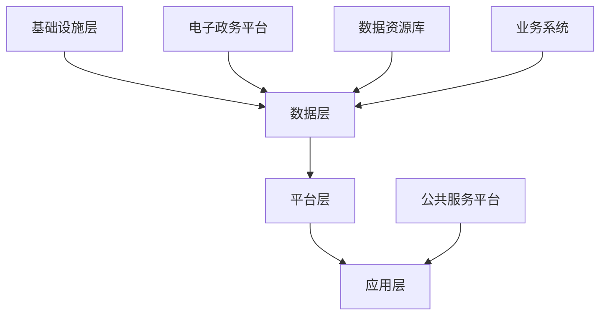

                 

# 智慧城市与数字政府：创业公司的机会与挑战

> **关键词：**智慧城市、数字政府、创业公司、机会、挑战、技术架构、数据处理、数据分析、人工智能。

> **摘要：**本文探讨了智慧城市与数字政府的构建背景及重要性，分析了创业公司在这一领域面临的机会和挑战。通过详细的技术分析和实例讲解，探讨了如何利用先进技术推动智慧城市与数字政府的发展，以及创业公司在此过程中可以采取的战略。

## 1. 背景介绍

### 1.1 目的和范围

本文旨在探讨智慧城市与数字政府的发展趋势，以及创业公司在这一领域的机遇与挑战。我们将深入分析技术架构、数据处理和人工智能在智慧城市与数字政府中的应用，并通过实际案例提供指导和建议。

### 1.2 预期读者

本文适合以下读者群体：

- 创业公司创始人或高管
- 技术开发人员和对智慧城市与数字政府感兴趣的专业人士
- 政府和公共部门管理人员
- 大学和研究机构的学生和研究人员

### 1.3 文档结构概述

本文结构如下：

1. 背景介绍
   - 1.1 目的和范围
   - 1.2 预期读者
   - 1.3 文档结构概述
   - 1.4 术语表
2. 核心概念与联系
   - 智慧城市与数字政府的概念
   - 技术架构和联系
3. 核心算法原理 & 具体操作步骤
   - 数据处理流程
   - 人工智能算法应用
4. 数学模型和公式 & 详细讲解 & 举例说明
   - 数据分析模型
   - 数学公式应用
5. 项目实战：代码实际案例和详细解释说明
   - 开发环境搭建
   - 源代码实现和解读
6. 实际应用场景
   - 智慧交通
   - 数字政府服务
7. 工具和资源推荐
   - 学习资源
   - 开发工具框架
   - 相关论文著作
8. 总结：未来发展趋势与挑战
9. 附录：常见问题与解答
10. 扩展阅读 & 参考资料

### 1.4 术语表

#### 1.4.1 核心术语定义

- 智慧城市：利用信息技术和物联网设备，实现城市基础设施的智能化管理和优化。
- 数字政府：通过信息通信技术提升政府管理和公共服务效率，实现政务数据开放和共享。
- 创业公司：指在新领域或新技术上开展业务的企业，通常具有创新性、灵活性和快速响应市场变化的能力。
- 数据处理：对大量数据进行收集、存储、处理和分析，以提取有价值的信息。

#### 1.4.2 相关概念解释

- 物联网（IoT）：将各种物理设备和传感器连接到互联网，实现设备之间的通信和数据交换。
- 人工智能（AI）：模拟人类智能的计算机系统，通过学习、推理和自我优化实现智能决策。
- 数据分析：使用统计方法和工具对数据进行挖掘，以发现数据中的模式和关系。

#### 1.4.3 缩略词列表

- IoT：物联网
- AI：人工智能
- SDG：可持续发展目标
- Fintech：金融科技
- Big Data：大数据
- ML：机器学习
- DL：深度学习

## 2. 核心概念与联系

智慧城市与数字政府是当前社会发展的两个重要方向，它们在技术架构和业务模式上有着紧密的联系。

### 智慧城市

智慧城市是利用物联网、人工智能和大数据等先进技术，实现城市管理和服务的智能化。其核心架构包括以下几个方面：

1. **基础设施层**：包括传感器、摄像头、智能设备等，用于收集城市运行数据。
2. **数据层**：存储和管理来自基础设施层的数据，支持数据共享和开放。
3. **平台层**：提供数据整合、处理和分析服务，支持城市管理者进行决策。
4. **应用层**：面向市民和企业的各类智慧应用，如智能交通、智能安防、智慧医疗等。

### 数字政府

数字政府是政府利用信息技术提升管理和服务效率的一种方式。其核心架构包括以下几个方面：

1. **电子政务平台**：提供政务数据采集、处理、共享和开放的服务。
2. **数据资源库**：存储和管理各类政务数据，支持数据分析和决策支持。
3. **业务系统**：实现政府各类业务的电子化和自动化，提高工作效率和服务质量。
4. **公共服务平台**：为市民和企业提供便捷的在线服务，提升政府服务水平。

### 技术架构与联系

智慧城市与数字政府的技术架构在基础设施层和数据层有较高的相似性，两者都依赖于物联网设备和大数据技术。在平台层和应用层，智慧城市更注重城市管理和服务优化，而数字政府则更注重政务数据管理和公共服务。然而，这两者在技术架构上的相互结合，可以实现更高效的城市管理和更优质的公共服务。

### 核心概念流程图

以下是一个简化的智慧城市与数字政府技术架构的 Mermaid 流程图：



## 3. 核心算法原理 & 具体操作步骤

在智慧城市与数字政府的建设中，数据处理和人工智能算法起着至关重要的作用。下面我们将详细讨论数据处理流程和人工智能算法的应用。

### 3.1 数据处理流程

数据处理流程主要包括数据收集、数据清洗、数据存储、数据分析和数据可视化等步骤。

#### 3.1.1 数据收集

数据收集是数据处理的第一步，主要通过各种传感器和物联网设备收集城市运行数据。例如，交通流量数据、环境监测数据、公共安全数据等。

#### 3.1.2 数据清洗

数据清洗是对收集到的原始数据进行处理，去除重复数据、错误数据和缺失值，以确保数据的准确性和一致性。

```python
# 伪代码：数据清洗
def data清洗(data):
    # 删除重复数据
    data = 删除重复项(data)
    # 填补缺失值
    data = 填补缺失值(data)
    # 删除错误数据
    data = 删除错误值(data)
    return data
```

#### 3.1.3 数据存储

数据存储是将处理后的数据存储到数据库中，以便后续的数据分析和查询。

```python
# 伪代码：数据存储
def 数据存储(data, database):
    # 将数据插入数据库
    database.insert(data)
```

#### 3.1.4 数据分析

数据分析是对存储在数据库中的数据进行挖掘，以发现数据中的模式和关系，支持城市管理和决策。

```python
# 伪代码：数据分析
def 数据分析(data):
    # 数据预处理
    data = 预处理(data)
    # 数据挖掘
    insights = 数据挖掘(data)
    return insights
```

#### 3.1.5 数据可视化

数据可视化是将数据分析的结果以图表、图像等形式呈现，便于城市管理者进行理解和决策。

```python
# 伪代码：数据可视化
def 数据可视化(data):
    # 创建图表
    chart = 创建图表(data)
    # 展示图表
    展示图表(chart)
```

### 3.2 人工智能算法应用

人工智能算法在智慧城市与数字政府的建设中有着广泛的应用，如智能交通管理、公共安全监控、智能医疗等。

#### 3.2.1 智能交通管理

智能交通管理利用人工智能算法分析交通数据，优化交通流量，减少拥堵和事故。

```python
# 伪代码：智能交通管理
def 智能交通管理(traffic_data):
    # 数据预处理
    traffic_data = 预处理(traffic_data)
    # 路网流量预测
    predictions = 路网流量预测(traffic_data)
    # 交通信号优化
    optimized_signals = 交通信号优化(predictions)
    return optimized_signals
```

#### 3.2.2 公共安全监控

公共安全监控利用人工智能算法实时监控城市安全，识别异常行为和潜在风险。

```python
# 伪代码：公共安全监控
def 公共安全监控(video_data):
    # 视频预处理
    video_data = 视频预处理(video_data)
    # 人脸识别
    faces = 人脸识别(video_data)
    # 行为分析
    behaviors = 行为分析(faces)
    # 异常检测
    anomalies = 异常检测(behaviors)
    return anomalies
```

#### 3.2.3 智能医疗

智能医疗利用人工智能算法分析医疗数据，提供精准的诊断和治疗方案。

```python
# 伪代码：智能医疗
def 智能医疗(health_data):
    # 数据预处理
    health_data = 预处理(health_data)
    # 疾病预测
    predictions = 疾病预测(health_data)
    # 治疗方案推荐
    treatments = 治疗方案推荐(predictions)
    return treatments
```

## 4. 数学模型和公式 & 详细讲解 & 举例说明

在智慧城市与数字政府的建设中，数学模型和公式在数据分析、预测和优化方面起着至关重要的作用。下面我们将详细讲解一些常用的数学模型和公式，并举例说明其在实际应用中的具体应用。

### 4.1 数据分析模型

数据分析模型主要包括统计模型、机器学习模型和深度学习模型。以下是一些常用的模型和公式：

#### 4.1.1 统计模型

1. **回归模型**：用于分析自变量和因变量之间的关系。

   公式：\( y = \beta_0 + \beta_1x_1 + \beta_2x_2 + ... + \beta_nx_n \)

   举例：分析交通流量与时间的关系，预测未来某一时间点的交通流量。

2. **分类模型**：用于将数据分类到不同的类别。

   公式：\( P(y = k) = \frac{1}{Z} \exp(\beta_0 + \beta_1x_1 + ... + \beta_nx_n) \)

   举例：根据交通流量数据，分类交通拥堵状态。

#### 4.1.2 机器学习模型

1. **决策树**：通过一系列判断规则对数据进行分类或回归。

   公式：\( y = f(x) \)

   举例：根据交通数据，预测交通拥堵的时间段。

2. **支持向量机（SVM）**：用于分类和回归问题。

   公式：\( w \cdot x + b = 0 \)

   举例：根据交通流量数据，分类交通拥堵和非拥堵区域。

#### 4.1.3 深度学习模型

1. **神经网络**：通过多层非线性变换实现复杂函数的逼近。

   公式：\( a^{(l)} = \sigma(z^{(l)}) \)

   举例：根据交通流量数据，预测交通拥堵的时间序列。

### 4.2 预测模型

预测模型在智慧城市与数字政府的建设中有着广泛的应用，如交通流量预测、疾病预测等。以下是一些常用的预测模型和公式：

#### 4.2.1 时间序列模型

1. **ARIMA模型**：用于分析时间序列数据，预测未来的值。

   公式：\( y_t = c + \phi_1y_{t-1} + \phi_2y_{t-2} + ... + \phi_py_{t-p} + \theta_1e_{t-1} + \theta_2e_{t-2} + ... + \thetaqe_{t-q} \)

   举例：根据历史交通流量数据，预测未来的交通流量。

#### 4.2.2 机器学习模型

1. **随机森林**：通过构建多个决策树，对预测结果进行集成。

   公式：\( \hat{y} = \frac{1}{N} \sum_{i=1}^{N} \hat{y}_i \)

   举例：根据交通流量数据，预测未来的交通流量。

2. **神经网络**：通过多层非线性变换实现复杂函数的逼近。

   公式：\( a^{(l)} = \sigma(z^{(l)}) \)

   举例：根据交通流量数据，预测交通拥堵的时间序列。

### 4.3 优化模型

优化模型在智慧城市与数字政府的建设中用于优化资源配置、提高效率等。以下是一些常用的优化模型和公式：

#### 4.3.1 线性规划

1. **线性规划**：用于求解线性目标函数的最优解。

   公式：\( \min \ c^T x \)

   约束条件：\( Ax \leq b \)

   举例：根据交通流量数据，优化交通信号灯的配时方案。

#### 4.3.2 非线性规划

1. **非线性规划**：用于求解非线性目标函数的最优解。

   公式：\( \min \ c^T x \)

   约束条件：\( g(x) \leq 0 \)

   举例：根据交通流量数据，优化交通信号灯的配时方案。

## 5. 项目实战：代码实际案例和详细解释说明

### 5.1 开发环境搭建

为了实现智慧城市与数字政府的建设项目，我们首先需要搭建一个合适的开发环境。以下是一个简单的开发环境搭建流程：

1. 安装Python环境：在计算机上安装Python 3.8及以上版本。
2. 安装Jupyter Notebook：通过pip命令安装Jupyter Notebook，用于编写和运行Python代码。
3. 安装必需的库：安装NumPy、Pandas、Scikit-learn等库，用于数据处理和机器学习。

```bash
pip install numpy pandas scikit-learn matplotlib
```

### 5.2 源代码详细实现和代码解读

下面我们通过一个简单的案例来展示如何利用Python实现智慧城市中的交通流量预测。

#### 5.2.1 数据集准备

首先，我们需要准备一个交通流量数据集。以下是一个示例数据集，包含时间戳、道路ID和交通流量：

```python
import pandas as pd

# 读取交通流量数据
data = pd.read_csv("traffic_data.csv")
data.head()
```

#### 5.2.2 数据预处理

在数据预处理阶段，我们需要对数据进行清洗和转换，以便后续的建模和分析。

```python
# 数据清洗
data = data[data["traffic_flow"] > 0]
data = data.dropna()

# 数据转换
data["timestamp"] = pd.to_datetime(data["timestamp"])
data["hour"] = data["timestamp"].dt.hour
data["day"] = data["timestamp"].dt.dayofweek
```

#### 5.2.3 数据建模

接下来，我们使用线性回归模型来预测交通流量。线性回归模型的基本公式为：

\( y = \beta_0 + \beta_1x_1 + \beta_2x_2 + ... + \beta_nx_n \)

其中，\( y \) 为交通流量，\( x_1, x_2, ..., x_n \) 为自变量，如小时、星期等。

```python
from sklearn.linear_model import LinearRegression

# 准备数据
X = data[["hour", "day"]]
y = data["traffic_flow"]

# 训练模型
model = LinearRegression()
model.fit(X, y)

# 模型评估
score = model.score(X, y)
print("模型评分：", score)
```

#### 5.2.4 预测未来交通流量

最后，我们使用训练好的模型来预测未来的交通流量。

```python
# 预测未来交通流量
future_hours = [17, 18, 19]
future_days = [5, 6]

X_future = pd.DataFrame({"hour": future_hours, "day": future_days})
y_future = model.predict(X_future)

print("未来交通流量预测结果：", y_future)
```

### 5.3 代码解读与分析

在上面的案例中，我们首先读取了一个交通流量数据集，并对数据进行了清洗和转换。接着，我们使用线性回归模型来预测交通流量。最后，我们使用训练好的模型来预测未来的交通流量。

线性回归模型是一种简单而有效的预测模型，适用于线性关系较强的数据。然而，在实际应用中，交通流量往往受到多种因素的影响，如天气、节假日等，因此可能需要更复杂的模型来提高预测准确性。

此外，我们还可以使用机器学习模型，如决策树、随机森林和神经网络，来提高预测性能。这些模型可以自动发现数据中的非线性关系，从而实现更准确的预测。

总之，通过以上案例，我们展示了如何利用Python实现智慧城市中的交通流量预测。这个案例提供了一个基本的框架，可以帮助创业公司快速启动智慧城市建设项目。

## 6. 实际应用场景

智慧城市与数字政府技术已经在全球范围内得到广泛应用，下面我们将探讨一些典型的实际应用场景。

### 6.1 智慧交通

智慧交通是智慧城市的重要组成部分，通过实时监控和数据分析，实现交通流量的优化和拥堵管理。

- **案例**：在北京，通过部署智能交通管理系统，实现了对交通流量、停车资源、公共交通的实时监控。该系统基于大数据和人工智能技术，通过预测交通流量，优化交通信号灯配时，减少拥堵和事故。
- **应用场景**：智能交通信号控制、实时路况信息发布、停车诱导系统、公共交通优化等。

### 6.2 智慧医疗

智慧医疗利用信息技术提高医疗服务的效率和质量，实现疾病预防、诊断和治疗。

- **案例**：在深圳，通过建设智慧医疗系统，实现了医疗资源的合理配置和患者就诊体验的提升。该系统基于人工智能和大数据分析，提供在线预约、远程诊疗、健康咨询等服务。
- **应用场景**：电子病历管理、远程医疗、智能诊断、健康管理、药物研发等。

### 6.3 智慧安防

智慧安防通过视频监控、物联网和人工智能技术，提高公共安全监控和应急响应能力。

- **案例**：在纽约，通过部署智能安防系统，实现了对城市安全的全方位监控。该系统基于人脸识别、行为分析等技术，实时监测城市安全事件，提高应急响应效率。
- **应用场景**：智能监控、人脸识别、行为分析、应急指挥等。

### 6.4 数字政府

数字政府通过信息技术提高政府管理和服务效率，实现政务数据开放和共享。

- **案例**：在杭州，通过建设数字政府平台，实现了政务数据的全面开放和共享。该平台基于大数据和人工智能技术，提供在线办事、行政审批、政策解读等服务，提升政府服务水平。
- **应用场景**：在线办事、行政审批、政策解读、数据开放等。

## 7. 工具和资源推荐

### 7.1 学习资源推荐

#### 7.1.1 书籍推荐

- 《智慧城市：构建可持续发展的未来》
- 《数字政府：技术与治理创新》
- 《Python数据处理与挖掘实践》
- 《人工智能：一种现代方法》

#### 7.1.2 在线课程

- Coursera：智慧城市、数字政府、大数据分析等课程
- Udacity：机器学习、深度学习、数据科学等课程
- edX：人工智能、大数据分析、Python编程等课程

#### 7.1.3 技术博客和网站

- towardsdatascience.com：数据科学、机器学习等文章
- medium.com：智慧城市、数字政府等主题文章
- github.com：开源项目、代码示例等资源

### 7.2 开发工具框架推荐

#### 7.2.1 IDE和编辑器

- PyCharm：适用于Python编程，功能强大且易于使用
- Visual Studio Code：适用于多种编程语言，具有丰富的扩展插件
- Jupyter Notebook：适用于数据科学和机器学习，支持交互式编程

#### 7.2.2 调试和性能分析工具

- PyDebug：Python调试工具
- PySnooper：Python性能分析工具
- Profiler：Python性能分析工具

#### 7.2.3 相关框架和库

- NumPy：Python科学计算库
- Pandas：Python数据处理库
- Scikit-learn：Python机器学习库
- TensorFlow：开源深度学习框架

### 7.3 相关论文著作推荐

#### 7.3.1 经典论文

- "Smart Cities: Integrating Infrastructure and Information Technology to Improve Urban Operations" by John P. Wiley and Sons
- "Digital Government: Transforming Administration and Improving Services for Citizens" by Government Digital Service
- "Big Data: A Revolution That Will Transform How We Live, Work, and Think" by Viktor Mayer-Schönberger and Kenneth Cukier

#### 7.3.2 最新研究成果

- "Artificial Intelligence for Urban Applications: Opportunities and Challenges" by Springer
- "IoT in Smart Cities: Technologies, Solutions, and Implementations" by Springer
- "Data Science for Smart Cities: Leveraging Advanced Analytics for Urban Innovation" by Apress

#### 7.3.3 应用案例分析

- "Smart Cities: From Vision to Reality" by IEEE
- "Digital Transformation in Government: Case Studies and Best Practices" by IBM
- "Case Studies on Implementing Smart City Technologies" by ResearchGate

## 8. 总结：未来发展趋势与挑战

### 未来发展趋势

- **数据驱动决策**：随着大数据和人工智能技术的发展，数据驱动决策将成为智慧城市与数字政府的重要特征。通过数据分析和预测，政府可以更好地应对城市管理和公共服务中的各种挑战。
- **跨领域整合**：智慧城市与数字政府将与其他领域（如智慧医疗、智慧交通、智慧安防等）实现更深层次的整合，形成协同效应，提高整体效益。
- **可持续发展**：智慧城市与数字政府将更加注重可持续发展目标，通过节能减排、资源优化等手段，推动城市绿色发展。

### 未来挑战

- **数据隐私和安全**：随着数据量的增加，数据隐私和安全问题日益突出。政府和企业需要建立完善的数据隐私和安全保护机制，确保数据的合法使用和信息安全。
- **技术普及和应用**：智慧城市与数字政府技术的普及和应用仍面临一定的挑战。需要加大对技术创新和人才培养的投入，提高技术的可访问性和可操作性。
- **政策法规与监管**：智慧城市与数字政府的发展需要相应的政策法规和监管机制。政府需要制定合理的政策，规范市场行为，确保技术的发展符合社会需求和价值观。

## 9. 附录：常见问题与解答

### 9.1 智慧城市与数字政府的区别是什么？

智慧城市侧重于城市基础设施和服务的智能化，通过物联网、大数据和人工智能等技术实现城市管理的优化和提升。而数字政府则侧重于政府管理和公共服务的电子化和数字化，通过信息技术提高政府工作效率和服务质量。

### 9.2 创业公司如何进入智慧城市与数字政府领域？

创业公司可以通过以下方式进入智慧城市与数字政府领域：

- **技术研发**：专注于某一细分领域，如智能交通、智慧医疗等，提供专业的技术解决方案。
- **合作伙伴关系**：与政府、企业和其他机构建立合作伙伴关系，共同推进智慧城市与数字政府项目。
- **市场需求分析**：深入了解市场需求，针对具体场景提供定制化的解决方案。

### 9.3 智慧城市与数字政府的技术架构包括哪些方面？

智慧城市与数字政府的技术架构包括以下方面：

- **基础设施层**：包括传感器、摄像头、智能设备等。
- **数据层**：包括数据采集、存储、处理和分析等。
- **平台层**：包括数据整合、处理和分析服务。
- **应用层**：包括各类智慧应用，如智能交通、智慧医疗等。
- **电子政务平台**：包括政务数据采集、处理、共享和开放的服务。

## 10. 扩展阅读 & 参考资料

- 《智慧城市：构建可持续发展的未来》：详细介绍了智慧城市的概念、架构和技术应用。
- 《数字政府：技术与治理创新》：探讨了数字政府的建设理念、技术架构和实践案例。
- 《Python数据处理与挖掘实践》：提供了丰富的Python数据处理和机器学习实践案例。
- 《人工智能：一种现代方法》：全面介绍了人工智能的理论和方法，包括机器学习和深度学习。

