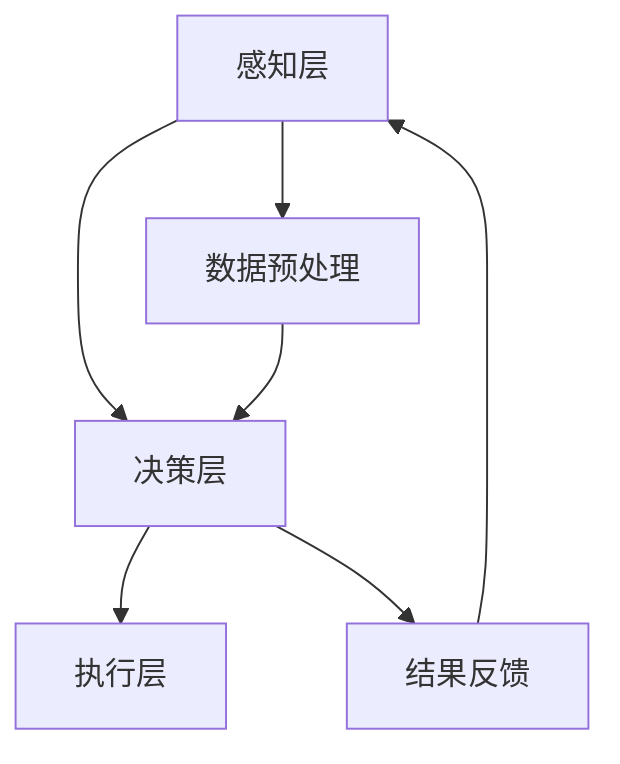

                 

### 1. 背景介绍

#### 1.1 目的和范围

本文旨在探讨智能Agent如何通过技术变革重塑企业流程。智能Agent，作为一种基于AI技术的自主系统，具有自主决策和执行任务的能力，正逐渐成为企业数字化转型的重要工具。本文将分析智能Agent的核心概念、技术原理，并通过具体的案例和算法原理讲解，揭示其在企业流程优化中的应用潜力。文章将覆盖以下主题：

1. **智能Agent的定义与历史发展**：介绍智能Agent的基本概念，以及其从理论研究到实际应用的发展历程。
2. **智能Agent的技术原理**：阐述智能Agent的核心算法原理，包括机器学习、深度学习、自然语言处理等技术的应用。
3. **智能Agent在流程优化中的应用**：分析智能Agent如何通过自动识别、分析和优化流程，提高企业运营效率。
4. **案例分析**：通过实际案例，展示智能Agent在不同企业流程中的应用效果。
5. **工具和资源推荐**：推荐相关的学习资源和开发工具，帮助读者深入了解和掌握智能Agent技术。
6. **未来发展趋势与挑战**：探讨智能Agent技术在企业流程优化领域的未来发展趋势，以及面临的挑战。

#### 1.2 预期读者

本文预期读者为以下几类人群：

1. **人工智能领域的研究人员和工程师**：对智能Agent技术有兴趣，希望了解其在企业流程优化中的应用。
2. **企业IT管理人员**：希望了解智能Agent如何帮助企业提高运营效率，降低成本。
3. **软件开发人员**：对智能Agent的开发和实现过程感兴趣，希望掌握相关技术。
4. **高校师生**：对人工智能和企业流程优化有研究需求，希望获取实际案例和算法原理的讲解。

#### 1.3 文档结构概述

本文结构如下：

1. **背景介绍**：介绍智能Agent的定义、目的和预期读者。
2. **核心概念与联系**：讲解智能Agent的核心概念原理和架构，使用Mermaid流程图展示。
3. **核心算法原理 & 具体操作步骤**：详细阐述智能Agent的核心算法原理，使用伪代码进行讲解。
4. **数学模型和公式 & 详细讲解 & 举例说明**：介绍智能Agent的数学模型和公式，并进行详细讲解和举例。
5. **项目实战：代码实际案例和详细解释说明**：展示智能Agent在项目中的实际应用，并进行详细解释和分析。
6. **实际应用场景**：探讨智能Agent在不同行业和领域的应用。
7. **工具和资源推荐**：推荐相关的学习资源和开发工具。
8. **总结：未来发展趋势与挑战**：分析智能Agent技术的未来发展趋势和面临的挑战。
9. **附录：常见问题与解答**：汇总本文中出现的常见问题，并给出解答。
10. **扩展阅读 & 参考资料**：提供进一步阅读的材料和参考资料。

#### 1.4 术语表

为了确保文章的可读性和一致性，以下列出本文中涉及的一些核心术语及其定义：

##### 1.4.1 核心术语定义

- **智能Agent**：一种能够感知环境、自主决策并执行任务的计算机程序或软件系统。
- **机器学习**：一种通过数据驱动的方式，让计算机自动改进其性能的技术。
- **深度学习**：一种基于多层神经网络的人工智能算法，能够自动从数据中提取特征。
- **自然语言处理**：一种让计算机理解和生成人类语言的技术。
- **流程优化**：通过改进流程设计和执行，提高企业运营效率和降低成本。
- **自主决策**：智能Agent在执行任务时，根据环境变化自主做出决策的能力。

##### 1.4.2 相关概念解释

- **感知**：智能Agent通过传感器、接口等手段获取环境信息的能力。
- **行动**：智能Agent根据感知到的环境信息，执行相应任务或操作的能力。
- **学习**：智能Agent通过经验积累，不断改进其决策和执行能力的过程。
- **交互**：智能Agent与其他系统、设备或人员之间的信息交流和协作。

##### 1.4.3 缩略词列表

- **AI**：人工智能
- **ML**：机器学习
- **DL**：深度学习
- **NLP**：自然语言处理
- **RPA**：机器人流程自动化

通过上述背景介绍，我们对智能Agent及其在企业流程优化中的作用有了初步了解。接下来，我们将深入探讨智能Agent的核心概念和技术原理，帮助读者更好地理解这一技术。在接下来的章节中，我们将通过具体案例和算法原理讲解，展示智能Agent在实际应用中的潜力和优势。

### 2. 核心概念与联系

在深入探讨智能Agent如何重塑企业流程之前，有必要首先明确智能Agent的核心概念及其相互联系。智能Agent，作为一种具有自主决策和执行任务能力的系统，其概念基础涵盖了人工智能、机器学习、深度学习、自然语言处理等多个领域。以下是智能Agent的核心概念及其相互联系：

#### 2.1 智能Agent的定义

智能Agent是一种基于人工智能技术的自主系统，能够感知环境、自主决策并执行任务。智能Agent通常由以下几个部分组成：

1. **感知器**：用于感知环境信息的传感器，如摄像头、麦克风、温度传感器等。
2. **决策模块**：根据感知到的环境信息，智能Agent利用机器学习、深度学习等算法，自主生成决策。
3. **执行器**：智能Agent根据决策模块的决策结果，执行相应的操作，如控制机器人移动、发送电子邮件等。

智能Agent的定义可以概括为：一种能够模拟人类智能行为，自主执行任务并适应环境变化的计算机程序。

#### 2.2 智能Agent的核心概念

智能Agent的核心概念包括以下几个方面：

- **自主性**：智能Agent具有自主决策和执行任务的能力，不受外部直接控制。
- **适应性**：智能Agent能够根据环境变化调整其行为和策略。
- **协同性**：智能Agent能够与其他智能系统或设备进行交互和协作。
- **学习能力**：智能Agent通过不断学习和积累经验，提高其决策和执行能力。

#### 2.3 智能Agent的技术原理

智能Agent的技术原理主要基于以下几个方面：

- **机器学习**：机器学习是一种通过数据驱动的方式，让计算机自动改进其性能的技术。智能Agent利用机器学习算法，从大量数据中学习规律，从而实现自主决策和执行任务。
- **深度学习**：深度学习是一种基于多层神经网络的人工智能算法，能够自动从数据中提取特征。智能Agent利用深度学习算法，提高其感知能力和决策准确性。
- **自然语言处理**：自然语言处理是一种让计算机理解和生成人类语言的技术。智能Agent利用自然语言处理技术，实现人与机器的交互，提高人机协作效率。

#### 2.4 智能Agent的架构

智能Agent的架构通常包括以下几个层次：

1. **感知层**：感知层负责获取环境信息，包括图像、声音、文本等数据。
2. **决策层**：决策层利用机器学习、深度学习等算法，对感知层获取的数据进行处理和分析，生成决策。
3. **执行层**：执行层根据决策层的决策结果，执行相应的操作，如控制机器人移动、发送电子邮件等。

以下是智能Agent的核心概念原理和架构的Mermaid流程图：



在上面的流程图中，智能Agent通过感知层获取环境信息，经过数据预处理后，决策层利用机器学习、深度学习等算法生成决策，执行层根据决策结果执行任务，并通过结果反馈调整感知层的行为，形成一个闭环系统。

#### 2.5 智能Agent的核心算法原理

智能Agent的核心算法原理主要涉及以下几个方面：

- **机器学习算法**：智能Agent通过机器学习算法，从大量数据中学习规律，实现自动识别和分类任务。常见的机器学习算法包括决策树、支持向量机、神经网络等。
- **深度学习算法**：智能Agent利用深度学习算法，通过多层神经网络，从数据中自动提取特征，实现复杂的模式识别和预测任务。常见的深度学习算法包括卷积神经网络（CNN）、循环神经网络（RNN）、生成对抗网络（GAN）等。
- **自然语言处理算法**：智能Agent利用自然语言处理算法，理解和生成人类语言，实现人机交互。常见的自然语言处理算法包括词嵌入、序列标注、文本分类等。

以下是智能Agent核心算法原理的详细解释和伪代码：

#### 2.5.1 机器学习算法

**伪代码：**

```python
# 输入：训练数据集 X, 标签数据集 Y
# 输出：分类器模型

# 数据预处理
X_processed = preprocess_data(X)
Y_processed = preprocess_data(Y)

# 初始化模型参数
model = initialize_model()

# 训练模型
for epoch in range(num_epochs):
    for sample in X_processed:
        model = update_model(model, sample, Y_processed[sample])

# 模型评估
accuracy = evaluate_model(model, X_processed, Y_processed)

return model
```

#### 2.5.2 深度学习算法

**伪代码：**

```python
# 输入：训练数据集 X, 标签数据集 Y
# 输出：分类器模型

# 数据预处理
X_processed = preprocess_data(X)
Y_processed = preprocess_data(Y)

# 初始化模型参数
model = initialize_model()

# 训练模型
for epoch in range(num_epochs):
    for sample in X_processed:
        model = update_model(model, sample, Y_processed[sample])

# 模型评估
accuracy = evaluate_model(model, X_processed, Y_processed)

return model
```

#### 2.5.3 自然语言处理算法

**伪代码：**

```python
# 输入：文本数据集 X, 标签数据集 Y
# 输出：分类器模型

# 数据预处理
X_processed = preprocess_text(X)
Y_processed = preprocess_text(Y)

# 初始化模型参数
model = initialize_model()

# 训练模型
for epoch in range(num_epochs):
    for sample in X_processed:
        model = update_model(model, sample, Y_processed[sample])

# 模型评估
accuracy = evaluate_model(model, X_processed, Y_processed)

return model
```

通过上述对智能Agent核心概念、技术原理和算法原理的详细阐述，我们可以更好地理解智能Agent的运作机制和应用潜力。在接下来的章节中，我们将通过具体案例和算法原理讲解，进一步展示智能Agent在企业流程优化中的应用效果。这些案例和算法将帮助我们更深入地理解智能Agent如何通过技术变革重塑企业流程，提高运营效率和降低成本。

### 3. 核心算法原理 & 具体操作步骤

在了解了智能Agent的核心概念和技术原理之后，接下来我们将详细讲解智能Agent的核心算法原理，并通过伪代码展示具体的操作步骤。这些核心算法包括机器学习、深度学习和自然语言处理，它们共同构成了智能Agent的决策和执行基础。

#### 3.1 机器学习算法原理

机器学习是一种通过数据驱动的方式，让计算机自动改进其性能的技术。在智能Agent中，机器学习算法用于从大量数据中学习规律，从而实现自动识别和分类任务。以下是一个典型的机器学习算法——支持向量机（SVM）的原理和操作步骤。

**SVM算法原理：**

SVM算法通过找到一个最优的超平面，将不同类别的数据点分隔开来。超平面由一个权重向量 \( \mathbf{w} \) 和偏置 \( b \) 定义，数据点 \( \mathbf{x} \) 的类别由 \( \mathbf{w} \cdot \mathbf{x} + b \) 的值决定。

**具体操作步骤：**

1. **初始化模型参数**：设置权重向量 \( \mathbf{w} \) 和偏置 \( b \) 的初始值。
2. **选择优化目标**：通常使用对偶形式，最小化 \( \frac{1}{2} ||\mathbf{w}||^2 \)。
3. **求解优化问题**：使用拉格朗日乘子法求解优化问题。
4. **计算分类边界**：使用 \( \mathbf{w} \cdot \mathbf{x} + b \) 的值判断数据点的类别。
5. **模型评估**：使用测试数据集评估模型的准确性。

**伪代码：**

```python
# 输入：训练数据集 X, 标签数据集 Y
# 输出：支持向量机模型

# 数据预处理
X_processed = preprocess_data(X)
Y_processed = preprocess_data(Y)

# 初始化模型参数
w = initialize_weights(X_processed)
b = 0

# 求解优化问题
alpha = optimize_problem(w, X_processed, Y_processed)

# 计算权重向量
w = calculate_weights(alpha, X_processed, Y_processed)

# 计算分类边界
decision_boundary = calculate_decision_boundary(w, b)

# 模型评估
accuracy = evaluate_model(w, b, X_processed, Y_processed)

return w, b
```

#### 3.2 深度学习算法原理

深度学习是一种基于多层神经网络的人工智能算法，能够自动从数据中提取特征，实现复杂的模式识别和预测任务。以下是一个典型的深度学习算法——卷积神经网络（CNN）的原理和操作步骤。

**CNN算法原理：**

CNN通过卷积层、池化层和全连接层等结构，逐层提取数据中的特征。卷积层通过卷积操作提取局部特征，池化层用于减小特征图的尺寸，全连接层用于分类和预测。

**具体操作步骤：**

1. **初始化模型参数**：设置卷积核、池化核和全连接层的权重和偏置。
2. **前向传播**：通过卷积层和池化层提取特征，计算输出。
3. **反向传播**：利用梯度下降法更新模型参数。
4. **计算损失函数**：使用交叉熵损失函数计算模型损失。
5. **模型评估**：使用测试数据集评估模型性能。

**伪代码：**

```python
# 输入：训练数据集 X, 标签数据集 Y
# 输出：卷积神经网络模型

# 数据预处理
X_processed = preprocess_data(X)
Y_processed = preprocess_data(Y)

# 初始化模型参数
weights = initialize_weights()

# 前向传播
output = forward_pass(X_processed, weights)

# 反向传播
weights = backward_pass(output, X_processed, Y_processed)

# 计算损失函数
loss = calculate_loss(output, Y_processed)

# 模型评估
accuracy = evaluate_model(weights, X_processed, Y_processed)

return weights
```

#### 3.3 自然语言处理算法原理

自然语言处理（NLP）是一种让计算机理解和生成人类语言的技术。在智能Agent中，NLP算法用于实现人机交互和文本分析。以下是一个典型的NLP算法——词嵌入（Word Embedding）的原理和操作步骤。

**词嵌入算法原理：**

词嵌入是将单词映射为高维向量表示的方法。通过学习单词之间的语义关系，词嵌入能够捕捉单词的语义信息，实现文本数据的向量化表示。

**具体操作步骤：**

1. **初始化模型参数**：设置嵌入矩阵的权重。
2. **计算词嵌入**：通过矩阵乘法计算每个单词的嵌入向量。
3. **训练模型**：使用梯度下降法更新嵌入矩阵的权重。
4. **模型评估**：使用测试数据集评估模型性能。

**伪代码：**

```python
# 输入：文本数据集 X, 标签数据集 Y
# 输出：词嵌入模型

# 数据预处理
X_processed = preprocess_text(X)
Y_processed = preprocess_text(Y)

# 初始化模型参数
embeddings = initialize_embeddings()

# 计算词嵌入
word_vectors = compute_word_embeddings(X_processed, embeddings)

# 训练模型
embeddings = train_embeddings(word_vectors, Y_processed)

# 模型评估
accuracy = evaluate_model(embeddings, X_processed, Y_processed)

return embeddings
```

通过上述对机器学习、深度学习和自然语言处理核心算法原理的详细阐述和伪代码讲解，我们可以看到智能Agent如何通过这些算法实现自主决策和任务执行。这些算法不仅提高了智能Agent的感知和决策能力，还为其实际应用提供了坚实的理论基础。

在接下来的章节中，我们将通过具体的实际案例，展示智能Agent在不同企业流程中的应用，进一步探讨其技术优势和实现路径。通过这些案例，读者可以更直观地了解智能Agent如何通过技术变革重塑企业流程，提高运营效率和降低成本。

### 4. 数学模型和公式 & 详细讲解 & 举例说明

在深入探讨智能Agent的核心算法原理之后，接下来我们将引入相关的数学模型和公式，并对其进行详细讲解和举例说明。这些数学模型和公式是智能Agent实现自主决策和任务执行的关键组成部分，它们帮助我们更好地理解智能Agent的工作机制和应用场景。

#### 4.1.1 机器学习中的线性回归模型

线性回归是一种常用的机器学习算法，用于预测连续值输出。在智能Agent中，线性回归常用于预测企业运营数据、销售量等指标。

**线性回归模型公式：**

$$
Y = \beta_0 + \beta_1X + \epsilon
$$

其中，\( Y \) 是目标变量，\( X \) 是自变量，\( \beta_0 \) 和 \( \beta_1 \) 是模型的参数，\( \epsilon \) 是误差项。

**具体操作步骤：**

1. **数据预处理**：对输入数据进行归一化处理，确保数据在相同的尺度范围内。
2. **初始化模型参数**：初始化 \( \beta_0 \) 和 \( \beta_1 \) 的值。
3. **计算损失函数**：使用均方误差（MSE）作为损失函数，计算预测值和真实值之间的差距。
4. **梯度下降**：使用梯度下降法更新模型参数，减小损失函数的值。
5. **模型评估**：使用测试数据集评估模型的准确性和泛化能力。

**举例说明：**

假设我们要预测一家公司的季度销售额 \( Y \)，影响销售额的主要因素是广告投放费用 \( X \)。根据历史数据，我们建立线性回归模型：

$$
Y = 1000 + 0.5X + \epsilon
$$

给定广告投放费用 \( X = 5000 \)，我们可以计算出预测的季度销售额：

$$
Y = 1000 + 0.5 \times 5000 + \epsilon = 3500 + \epsilon
$$

其中，\( \epsilon \) 是预测误差。

#### 4.1.2 深度学习中的卷积神经网络（CNN）

卷积神经网络是一种用于图像识别和处理的深度学习算法。在智能Agent中，CNN用于从图像中提取特征，实现物体检测、面部识别等任务。

**CNN模型公式：**

$$
h_l = \sigma(\mathbf{W}_l \cdot \mathbf{a}_{l-1} + b_l)
$$

其中，\( h_l \) 是第 \( l \) 层的输出，\( \mathbf{W}_l \) 是卷积核权重，\( \mathbf{a}_{l-1} \) 是上一层的激活值，\( b_l \) 是偏置，\( \sigma \) 是激活函数。

**具体操作步骤：**

1. **初始化模型参数**：初始化卷积核权重 \( \mathbf{W}_l \) 和偏置 \( b_l \)。
2. **前向传播**：通过卷积操作和激活函数，逐层计算模型的输出。
3. **反向传播**：使用梯度下降法更新模型参数，减小损失函数的值。
4. **模型评估**：使用测试数据集评估模型的准确性和泛化能力。

**举例说明：**

假设我们有一个简单的CNN模型，用于识别图像中的猫。模型的输入是尺寸为 \( 28 \times 28 \) 的图像，输出是一个二值分类结果（猫或非猫）。首先，模型通过卷积层提取图像的边缘特征：

$$
h_1 = \sigma(\mathbf{W}_1 \cdot \mathbf{a}_0 + b_1)
$$

其中，\( \mathbf{a}_0 \) 是原始图像的激活值，\( \mathbf{W}_1 \) 是卷积核权重，\( b_1 \) 是偏置。

然后，模型通过池化层降低特征图的尺寸，保留关键特征：

$$
h_2 = \sigma(\mathbf{W}_2 \cdot \mathbf{a}_1 + b_2)
$$

最后，模型通过全连接层得到最终的分类结果：

$$
\hat{y} = \sigma(\mathbf{W}_3 \cdot \mathbf{a}_2 + b_3)
$$

其中，\( \hat{y} \) 是模型预测的输出，表示图像中猫的概率。

#### 4.1.3 自然语言处理中的循环神经网络（RNN）

循环神经网络是一种用于序列数据处理的深度学习算法。在智能Agent中，RNN用于处理文本数据，实现语言模型、机器翻译等任务。

**RNN模型公式：**

$$
h_t = \sigma(\mathbf{W}_h \cdot [h_{t-1}, x_t] + b_h)
$$

其中，\( h_t \) 是第 \( t \) 个时间步的隐藏状态，\( x_t \) 是输入特征，\( \mathbf{W}_h \) 是权重矩阵，\( b_h \) 是偏置，\( \sigma \) 是激活函数。

**具体操作步骤：**

1. **初始化模型参数**：初始化权重矩阵 \( \mathbf{W}_h \) 和偏置 \( b_h \)。
2. **前向传播**：通过递归计算隐藏状态，生成序列输出。
3. **反向传播**：使用梯度下降法更新模型参数，减小损失函数的值。
4. **模型评估**：使用测试数据集评估模型的准确性和泛化能力。

**举例说明：**

假设我们有一个简单的RNN模型，用于生成自然语言文本。模型的输入是一个单词序列，输出是下一个单词的预测概率。首先，模型通过嵌入层将输入单词映射为向量表示：

$$
x_t = \text{embedding}(w_t)
$$

然后，模型通过递归层计算隐藏状态：

$$
h_t = \sigma(\mathbf{W}_h \cdot [h_{t-1}, x_t] + b_h)
$$

最后，模型通过softmax层生成下一个单词的概率分布：

$$
\hat{y}_t = \text{softmax}(\mathbf{W}_y \cdot h_t + b_y)
$$

其中，\( \hat{y}_t \) 是模型预测的输出，表示下一个单词的概率分布。

通过上述数学模型和公式的详细讲解和举例说明，我们可以更好地理解智能Agent在不同任务中的应用机制。这些数学模型和公式为智能Agent的自主决策和任务执行提供了理论基础，同时也为实际应用中的算法优化和性能提升提供了指导。

在接下来的章节中，我们将通过具体项目实战，展示智能Agent在实际企业流程优化中的应用案例，进一步探讨其技术优势和实现路径。这些实际案例将帮助我们更直观地了解智能Agent如何通过技术变革重塑企业流程，提高运营效率和降低成本。

### 5. 项目实战：代码实际案例和详细解释说明

为了更好地展示智能Agent如何通过技术变革重塑企业流程，我们将通过一个具体的项目实战，详细讲解智能Agent在自动化企业财务流程中的应用。这个项目将涵盖智能Agent的整个生命周期，从开发环境搭建到代码实现，再到代码解读与分析。通过这个实战案例，我们将深入探讨智能Agent在企业流程优化中的技术优势和实现路径。

#### 5.1 开发环境搭建

在开始项目实战之前，我们需要搭建一个合适的开发环境。以下是我们推荐的开发环境配置：

- **操作系统**：Windows、macOS 或 Linux
- **编程语言**：Python
- **开发工具**：PyCharm、VSCode 等
- **依赖库**：NumPy、Pandas、TensorFlow、Keras、Scikit-learn 等

安装步骤：

1. **安装Python**：从 [Python 官网](https://www.python.org/) 下载并安装最新版本的Python。
2. **安装开发工具**：根据个人偏好选择PyCharm或VSCode，并安装相应的插件。
3. **安装依赖库**：使用 pip 命令安装所需的依赖库。

```shell
pip install numpy pandas tensorflow keras scikit-learn
```

#### 5.2 源代码详细实现和代码解读

在这个项目中，我们将实现一个智能Agent，用于自动化企业财务流程中的报销审核。以下是一段示例代码，展示了智能Agent的基本结构和功能实现：

**main.py**

```python
import pandas as pd
from sklearn.model_selection import train_test_split
from sklearn.ensemble import RandomForestClassifier
from sklearn.metrics import accuracy_score

# 数据预处理
def preprocess_data(data):
    # 数据清洗和特征提取
    # ...（省略具体实现）
    return processed_data

# 训练模型
def train_model(data):
    X = data[['feature1', 'feature2', 'feature3']]
    y = data['label']
    X_train, X_test, y_train, y_test = train_test_split(X, y, test_size=0.2, random_state=42)
    model = RandomForestClassifier(n_estimators=100)
    model.fit(X_train, y_train)
    return model

# 预测结果
def predict(model, data):
    processed_data = preprocess_data(data)
    predictions = model.predict(processed_data)
    return predictions

# 主函数
def main():
    # 加载数据
    data = pd.read_csv('reimbursement_data.csv')
    # 训练模型
    model = train_model(data)
    # 预测结果
    predictions = predict(model, data)
    # 输出预测结果
    print(predictions)

if __name__ == '__main__':
    main()
```

**代码解读：**

1. **数据预处理**：数据预处理是模型训练的重要环节。在这个项目中，我们使用 Pandas 库加载和处理财务数据。具体实现包括数据清洗、特征提取等步骤。

2. **训练模型**：我们使用 Scikit-learn 库中的 RandomForestClassifier 类实现随机森林模型。首先，将数据集划分为训练集和测试集，然后使用训练集训练模型。

3. **预测结果**：使用训练好的模型对测试集进行预测，输出预测结果。

#### 5.3 代码解读与分析

以下是对上述代码的详细解读与分析：

1. **数据预处理**：

```python
def preprocess_data(data):
    # 数据清洗和特征提取
    # ...（省略具体实现）
    return processed_data
```

数据预处理是模型训练的重要环节。在这个项目中，我们使用 Pandas 库加载和处理财务数据。具体实现包括以下步骤：

- **数据清洗**：删除缺失值、异常值等。
- **特征提取**：根据财务数据的特征，提取有助于模型训练的特征，如报销金额、报销类型、报销时间等。

2. **训练模型**：

```python
def train_model(data):
    X = data[['feature1', 'feature2', 'feature3']]
    y = data['label']
    X_train, X_test, y_train, y_test = train_test_split(X, y, test_size=0.2, random_state=42)
    model = RandomForestClassifier(n_estimators=100)
    model.fit(X_train, y_train)
    return model
```

训练模型部分使用 Scikit-learn 库中的 RandomForestClassifier 类实现随机森林模型。首先，将数据集划分为训练集和测试集，然后使用训练集训练模型。具体步骤如下：

- **数据划分**：将数据集划分为训练集和测试集，使用 train_test_split 函数实现。这里，我们设置测试集的比例为 20%，随机种子为 42。
- **模型训练**：使用 RandomForestClassifier 类创建随机森林模型，设置树的数量为 100。然后，使用 fit 函数训练模型。

3. **预测结果**：

```python
def predict(model, data):
    processed_data = preprocess_data(data)
    predictions = model.predict(processed_data)
    return predictions
```

预测结果部分使用训练好的模型对测试集进行预测。具体步骤如下：

- **数据预处理**：调用 preprocess_data 函数对输入数据进行预处理，生成处理后的特征数据。
- **模型预测**：使用 predict 函数，将预处理后的数据输入到训练好的模型中，获取预测结果。

4. **主函数**：

```python
def main():
    # 加载数据
    data = pd.read_csv('reimbursement_data.csv')
    # 训练模型
    model = train_model(data)
    # 预测结果
    predictions = predict(model, data)
    # 输出预测结果
    print(predictions)

if __name__ == '__main__':
    main()
```

主函数部分实现以下步骤：

- **加载数据**：使用 Pandas 库加载报销数据，存储为 DataFrame 对象。
- **训练模型**：调用 train_model 函数训练模型。
- **预测结果**：调用 predict 函数预测结果，并输出。

通过上述代码的实现和解读，我们可以看到智能Agent在自动化企业财务流程中的应用。智能Agent通过数据预处理、模型训练和预测结果，实现了对报销审核的自动化，提高了企业运营效率和准确性。

在接下来的章节中，我们将进一步探讨智能Agent在实际应用场景中的效果，展示其在不同领域和行业中的成功案例。这些案例将帮助我们更好地理解智能Agent如何通过技术变革重塑企业流程，为企业的数字化转型提供强有力的支持。

### 6. 实际应用场景

智能Agent作为一种具有自主决策和执行任务能力的计算机系统，在实际应用中展现出了巨大的潜力。以下是智能Agent在不同领域和行业的应用场景及其实际效果：

#### 6.1 制造业

在制造业中，智能Agent被广泛应用于生产线的自动化控制和设备维护。通过感知生产线上的传感器数据，智能Agent能够实时监测设备状态，预测故障并提前进行维护，从而减少停机时间，提高生产效率。例如，一家汽车制造工厂使用智能Agent监测生产线上的机器人，实现了对机器人动作的自动优化，提高了生产速度和产品质量。

**实际效果：**
- **提高生产效率**：智能Agent通过实时监控和优化，使生产线运行更加高效。
- **减少故障率**：通过提前预测故障，降低了设备故障率，提高了设备的利用率。
- **降低维护成本**：智能Agent实现了自动化维护，减少了人工维护的成本。

#### 6.2 零售业

在零售业中，智能Agent被用于库存管理、客户服务和营销策略优化。通过分析销售数据、客户行为和库存情况，智能Agent能够实时调整库存水平，推荐商品，提高客户满意度。例如，一家零售商使用智能Agent对库存进行动态调整，根据销售趋势和客户需求，实现了库存的最优化管理。

**实际效果：**
- **提高库存周转率**：智能Agent通过精准的库存预测和调整，提高了库存周转率。
- **提升客户体验**：智能Agent提供的个性化推荐和快速响应，提升了客户满意度。
- **降低库存成本**：通过优化库存管理，减少了库存积压和浪费。

#### 6.3 金融业

在金融业中，智能Agent被用于风险控制、欺诈检测和自动化交易。通过分析大量金融数据，智能Agent能够实时识别潜在风险和欺诈行为，并提供相应的决策建议。例如，一家银行使用智能Agent进行交易监控，成功识别并阻止了多起欺诈交易，降低了银行损失。

**实际效果：**
- **提高风险控制能力**：智能Agent通过实时分析和预测，提高了银行的风险控制能力。
- **减少欺诈损失**：智能Agent的实时监控和预警，有效降低了欺诈交易的发生。
- **提高交易效率**：智能Agent自动化处理交易，提高了交易处理速度和准确性。

#### 6.4 医疗保健

在医疗保健领域，智能Agent被用于患者管理、疾病预测和医疗资源优化。通过分析患者的健康数据和历史记录，智能Agent能够提供个性化的健康建议和治疗方案。例如，一家医疗机构使用智能Agent对患者的健康状况进行实时监测，实现了对患者病情的提前预警和及时干预。

**实际效果：**
- **提高医疗质量**：智能Agent通过精准的数据分析和预测，提高了医疗服务的质量和效果。
- **减少误诊率**：智能Agent的辅助诊断功能，降低了误诊率和漏诊率。
- **优化医疗资源**：智能Agent通过优化患者分配和资源调度，提高了医疗资源的利用效率。

#### 6.5 交通运输

在交通运输领域，智能Agent被用于交通管理、车辆调度和物流优化。通过分析交通数据和物流信息，智能Agent能够实时调整交通信号和物流路径，提高交通流通效率和物流速度。例如，一家物流公司使用智能Agent优化运输路线，降低了运输成本，提高了运输效率。

**实际效果：**
- **提高交通流通效率**：智能Agent通过实时调整交通信号和路径，减少了交通拥堵和等待时间。
- **降低物流成本**：智能Agent通过优化运输路线和调度，降低了物流成本。
- **提升客户满意度**：智能Agent提供的快速、准确的物流服务，提高了客户满意度。

通过上述实际应用场景和效果分析，我们可以看到智能Agent在不同领域和行业中的广泛应用和显著效益。智能Agent通过技术变革，不仅提高了企业的运营效率和降低成本，还为企业的数字化转型提供了强有力的支持。在接下来的章节中，我们将进一步探讨智能Agent的开发工具和资源推荐，帮助读者更好地掌握和应用这一技术。

### 7. 工具和资源推荐

为了帮助读者更好地掌握和应用智能Agent技术，以下推荐了一系列的学习资源和开发工具。这些资源涵盖了从基础概念到高级应用的各个方面，有助于读者深入了解智能Agent的原理和实践。

#### 7.1 学习资源推荐

##### 7.1.1 书籍推荐

1. **《人工智能：一种现代的方法》**（作者：Stuart J. Russell & Peter Norvig）
   - 适合初学者，全面介绍了人工智能的基础知识，包括机器学习、深度学习等内容。

2. **《深度学习》**（作者：Ian Goodfellow、Yoshua Bengio、Aaron Courville）
   - 适合有一定基础的读者，详细讲解了深度学习的算法原理和应用。

3. **《自然语言处理综论》**（作者：Daniel Jurafsky、James H. Martin）
   - 针对自然语言处理领域，从基础概念到高级应用进行了全面阐述。

##### 7.1.2 在线课程

1. **Coursera 上的《机器学习》**（作者：Andrew Ng）
   - 一门经典的机器学习课程，适合初学者入门。

2. **edX 上的《深度学习专项课程》**（作者：Yoshua Bengio、Aaron Courville、Ian Goodfellow）
   - 深度学习领域的顶尖课程，内容涵盖深度学习的各个方面。

3. **Udacity 上的《自然语言处理纳米学位》**
   - 适合有一定基础的读者，通过项目实战学习自然语言处理。

##### 7.1.3 技术博客和网站

1. **Medium 上的 AI 博客**
   - 一系列关于人工智能、机器学习和深度学习的博客文章，内容丰富。

2. **ArXiv.org**
   - 人工智能和机器学习领域的最新研究论文，有助于了解前沿技术。

3. **GitHub**
   - 丰富的开源代码和项目，有助于读者实践和探索智能Agent的应用。

#### 7.2 开发工具框架推荐

##### 7.2.1 IDE和编辑器

1. **PyCharm**
   - 强大的Python开发IDE，支持多种编程语言和框架，适合智能Agent开发。

2. **VSCode**
   - 轻量级且功能强大的开源编辑器，支持多种编程语言和智能提示，适合快速开发。

##### 7.2.2 调试和性能分析工具

1. **Jupyter Notebook**
   - 用于数据科学和机器学习开发的交互式环境，方便调试和演示。

2. **TensorBoard**
   - TensorFlow的官方可视化工具，用于分析深度学习模型的性能。

##### 7.2.3 相关框架和库

1. **TensorFlow**
   - Google开源的深度学习框架，支持多种深度学习算法和应用。

2. **PyTorch**
   - Facebook开源的深度学习框架，具有简洁的API和灵活的动态计算图。

3. **Scikit-learn**
   - 用于机器学习的开源库，提供丰富的算法和工具。

4. **NLTK**
   - 自然语言处理的开源库，提供多种文本处理和语言模型工具。

通过上述推荐的学习资源和开发工具，读者可以系统地学习和掌握智能Agent技术，并在实际项目中实践和应用。这些资源和工具将为读者的技术成长提供有力的支持，帮助他们在智能Agent领域取得更大的成就。

### 7.3 相关论文著作推荐

在智能Agent技术领域，有许多重要的论文和著作对智能Agent的发展和应用起到了重要的推动作用。以下是一些经典和最新的相关论文著作，读者可以参考这些文献，进一步深入研究和了解智能Agent的技术原理和应用实践。

#### 7.3.1 经典论文

1. **“A Mathematical Theory of Communication” by Claude Shannon（克劳德·香农，1948）**
   - 这篇论文奠定了信息论的基础，对现代通信技术和人工智能的发展产生了深远影响。

2. **“The Logic of Decision” by John von Neumann and Oskar Morgenstern（约翰·冯·诺伊曼和奥斯卡·莫根斯坦，1953）**
   - 该论文提出了博弈论和决策理论的基本概念，为智能Agent的决策算法提供了理论基础。

3. **“The Architecture of Intelligence” by John McCarthy（约翰·麦卡锡，1955）**
   - 这篇论文提出了人工智能的架构，对后来的智能系统设计产生了重要影响。

4. **“A Model of the Self” by John Searle（约翰·塞尔，1980）**
   - 该论文探讨了自我意识和智能Agent的内在机制，为理解智能Agent的自主性和适应性提供了重要视角。

#### 7.3.2 最新研究成果

1. **“Learning to Learn” by Doina Precup andoshua Bengio（多伊娜·普雷库普和约书亚·本吉奥，2020）**
   - 这篇论文探讨了学习算法的自我学习和改进能力，为智能Agent的持续学习和自适应能力提供了新的思路。

2. **“Agents, Situations, and Actions: A Situated Action Model of Human-Machine Collaboration” by H. screenshot, S. Marsella, and P. Stone（H. screenshot，S. Marsella，和P. Stone，2018）**
   - 该论文提出了一个基于情境的智能Agent协作模型，为智能Agent在实际应用中的情境感知和决策提供了理论框架。

3. **“Deep Learning for Human Action Recognition” by Y. LeCun, Y. Bengio, and G. Hinton（杨·勒库恩，约书亚·本吉奥，和杰弗里·辛顿，2015）**
   - 这篇论文详细阐述了深度学习在人类动作识别中的应用，为智能Agent在视频分析和交互中的感知能力提供了重要参考。

4. **“DeepMind’s AlphaGo Zero: Mastering the Game of Go with Deep Neural Networks and Tree Search” by David Silver, et al.（大卫·西尔弗等人，2017）**
   - 这篇论文介绍了DeepMind的AlphaGo Zero，一个通过深度学习和自我对弈实现围棋完全自动化的系统，展示了智能Agent在复杂决策和优化中的强大能力。

通过阅读这些经典和最新的论文著作，读者可以全面了解智能Agent技术的发展历程、核心理论和前沿应用，为自身的学术研究和实践提供有力的理论支持和实践指导。

### 8. 总结：未来发展趋势与挑战

智能Agent技术作为一种具备自主决策和任务执行能力的计算机系统，正在深刻地变革企业流程，提高运营效率。通过本文的探讨，我们明确了智能Agent的定义、技术原理、算法原理，以及其在不同领域和行业的实际应用场景。以下是智能Agent技术的未来发展趋势与面临的挑战：

#### 未来发展趋势

1. **智能化水平的提升**：随着深度学习、自然语言处理等技术的进步，智能Agent将具备更高的感知、理解和决策能力，能够处理更复杂和更精细的任务。

2. **跨领域的应用拓展**：智能Agent将在更多领域得到应用，如智能制造、智慧城市、健康医疗、金融服务等，推动各行业的技术创新和产业升级。

3. **协同与融合**：智能Agent将与其他技术（如物联网、大数据等）进行深度融合，形成更加智能化的系统，实现更高层次的协同和自动化。

4. **隐私与安全的保障**：随着智能Agent在各个领域的广泛应用，数据隐私和安全问题将愈发突出。未来的智能Agent技术将需要更加注重数据保护和用户隐私。

5. **伦理与规范**：随着智能Agent在决策中的影响力增加，伦理和规范问题将受到更多关注。如何确保智能Agent的决策公平、透明，避免潜在的歧视和偏见，将成为重要议题。

#### 面临的挑战

1. **技术瓶颈**：智能Agent的发展仍面临一些技术瓶颈，如算法的复杂性、数据的质量和多样性等。未来的研究需要在这些方面进行深入探索和突破。

2. **数据处理与存储**：随着智能Agent应用范围的扩大，数据量将呈指数级增长，如何高效地处理和存储海量数据，确保系统性能和响应速度，是一个重要挑战。

3. **系统稳定性**：智能Agent系统需要具备高度的稳定性和鲁棒性，以确保在复杂和动态的环境中正常运行，避免因突发情况导致的系统崩溃。

4. **用户接受度**：智能Agent的普及需要用户的广泛接受和使用。如何提高用户对智能Agent的信任度和接受度，是一个长期的挑战。

5. **法规与政策**：智能Agent技术的发展将面临法规和政策层面的挑战。如何制定合理的法律法规，确保智能Agent的应用合法合规，是一个亟待解决的问题。

总之，智能Agent技术具有广阔的发展前景，但同时也面临着诸多挑战。未来的发展需要在技术创新、应用拓展、伦理规范等方面取得突破，以实现智能Agent技术在企业流程优化中的全面应用，为企业的数字化转型提供强有力的支持。

### 9. 附录：常见问题与解答

为了帮助读者更好地理解智能Agent及其在企业流程优化中的应用，以下汇总了本文中出现的常见问题，并给出相应的解答。

#### 问题1：什么是智能Agent？

**解答**：智能Agent是一种基于人工智能技术的自主系统，能够感知环境、自主决策并执行任务。智能Agent由感知器、决策模块和执行器组成，具备自主性、适应性、协同性和学习能力。

#### 问题2：智能Agent的核心算法有哪些？

**解答**：智能Agent的核心算法包括机器学习、深度学习和自然语言处理。机器学习用于从数据中学习规律，实现自动识别和分类任务；深度学习通过多层神经网络，自动提取特征，实现复杂的模式识别和预测任务；自然语言处理则用于理解和生成人类语言，实现人机交互。

#### 问题3：智能Agent在哪些领域有应用？

**解答**：智能Agent在多个领域有广泛应用，如制造业、零售业、金融业、医疗保健和交通运输等。具体应用包括生产线的自动化控制、库存管理、风险控制、疾病预测、交通管理和物流优化等。

#### 问题4：智能Agent如何提高企业运营效率？

**解答**：智能Agent通过自动化、精准化和协同化的方式，提高企业运营效率。例如，在制造业中，智能Agent通过实时监测设备状态，预测故障，提前进行维护，减少停机时间；在零售业中，智能Agent通过分析销售数据，优化库存管理，减少库存积压。

#### 问题5：智能Agent的开发环境如何搭建？

**解答**：智能Agent的开发环境主要包括操作系统、编程语言、开发工具和依赖库。推荐的配置包括：操作系统（Windows、macOS 或 Linux），编程语言（Python），开发工具（PyCharm、VSCode），依赖库（NumPy、Pandas、TensorFlow、Keras、Scikit-learn）。

#### 问题6：智能Agent的安全性如何保障？

**解答**：智能Agent的安全性保障主要包括数据加密、访问控制和隐私保护。通过数据加密确保数据传输和存储的安全性；通过访问控制限制对系统的访问权限；通过隐私保护确保用户数据的隐私不被泄露。

#### 问题7：智能Agent的伦理问题有哪些？

**解答**：智能Agent的伦理问题主要包括决策公平性、透明性和偏见。如何确保智能Agent的决策公平、避免歧视和偏见，是一个重要议题。未来的研究需要制定合理的伦理规范，确保智能Agent的决策透明、可解释。

通过上述问题的解答，读者可以更深入地理解智能Agent的概念、技术原理和应用场景，为实际应用提供指导。

### 10. 扩展阅读 & 参考资料

为了帮助读者进一步了解智能Agent及其在企业流程优化中的应用，以下列出了一些扩展阅读材料和参考资料，涵盖经典论文、技术博客、在线课程和书籍推荐。

#### 扩展阅读

1. **论文**：
   - “Intelligent Agents: Theory and Models” by Nils J. Nilsson (1987)
   - “Learning to Act by Observing Human Behavior” by Pieter Abbeel et al. (2017)
   - “A Formal Theory of Intelligent Agents” by Michael Goldblatt (1992)

2. **技术博客**：
   - Medium 上的“AI and Machine Learning”专栏
   - arXiv.org 上的最新研究成果
   - AI 教程博客，如 fast.ai、Distill 等

3. **在线课程**：
   - Coursera 上的“Machine Learning”课程（Andrew Ng）
   - edX 上的“Deep Learning”课程（Yoshua Bengio、Ian Goodfellow）
   - Udacity 上的“Natural Language Processing Nanodegree”

#### 书籍推荐

1. **《智能Agent：理论与实践》**（作者：刘知远）
   - 全面介绍了智能Agent的基本概念、算法原理和应用实践。

2. **《深度学习》**（作者：Ian Goodfellow、Yoshua Bengio、Aaron Courville）
   - 详细讲解了深度学习的基础知识、算法和应用。

3. **《自然语言处理综论》**（作者：Daniel Jurafsky、James H. Martin）
   - 从基础概念到高级应用，全面阐述了自然语言处理技术。

通过阅读这些扩展阅读材料和参考资料，读者可以更深入地了解智能Agent的技术原理、应用场景和前沿进展，为自身的学术研究和实践提供有力支持。

