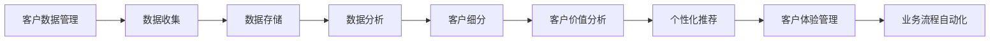

                 

# 智能CRM系统：提示词优化客户关系管理

> **关键词**：智能CRM系统、客户关系管理、自然语言处理、机器学习、优化算法、数据处理、用户体验

> **摘要**：本文将深入探讨智能CRM系统如何通过优化提示词来提升客户关系管理效果。我们首先介绍了智能CRM系统的背景和核心概念，随后详细阐述了核心算法原理和具体操作步骤。接着，我们使用了数学模型和公式进行详细讲解，并通过实际项目案例展示了代码实现和解读。文章还探讨了智能CRM系统在实际应用场景中的价值，并推荐了相关工具和资源。最后，我们对未来发展趋势与挑战进行了总结，并提供了一些常见问题与解答，以期为读者提供全面的参考。

## 1. 背景介绍

### 1.1 目的和范围

客户关系管理（Customer Relationship Management，CRM）是现代企业成功的关键之一。随着市场竞争的加剧和客户需求的多样化，企业需要更加精细和智能地管理客户关系，以提高客户满意度、忠诚度和业务增长。本文旨在探讨智能CRM系统如何通过优化提示词（Keywords）来提升客户关系管理效果，实现以下目标：

1. **明确智能CRM系统的核心概念和架构**。
2. **深入剖析核心算法原理和操作步骤**。
3. **运用数学模型和公式进行详细讲解**。
4. **通过实际项目案例展示代码实现和解读**。
5. **探讨智能CRM系统的实际应用场景**。
6. **推荐相关工具和资源**。
7. **总结未来发展趋势与挑战**。

### 1.2 预期读者

本文适合以下读者群体：

1. **企业高管**：了解智能CRM系统的核心价值和应用场景，为企业的客户关系管理提供战略指导。
2. **技术经理和架构师**：掌握智能CRM系统的技术原理和架构，为系统的设计、开发和应用提供技术支持。
3. **数据分析师和人工智能工程师**：了解智能CRM系统中的数据分析和机器学习算法，掌握优化提示词的方法和技巧。
4. **产品经理和用户体验设计师**：了解智能CRM系统的用户体验设计，为提升客户满意度提供解决方案。
5. **计算机科学和人工智能专业的研究生和本科生**：学习智能CRM系统的理论知识和技术实践，为未来的职业生涯打下基础。

### 1.3 文档结构概述

本文分为10个部分，具体结构如下：

1. **引言**：介绍智能CRM系统的背景、目的和预期读者。
2. **背景介绍**：详细阐述智能CRM系统的核心概念、架构和发展历程。
3. **核心概念与联系**：介绍智能CRM系统的核心概念、原理和架构，并提供Mermaid流程图。
4. **核心算法原理 & 具体操作步骤**：讲解智能CRM系统的核心算法原理和具体操作步骤，使用伪代码进行阐述。
5. **数学模型和公式 & 详细讲解 & 举例说明**：介绍智能CRM系统的数学模型和公式，并进行详细讲解和举例说明。
6. **项目实战：代码实际案例和详细解释说明**：通过实际项目案例展示智能CRM系统的代码实现和详细解释说明。
7. **实际应用场景**：探讨智能CRM系统在实际应用场景中的价值和作用。
8. **工具和资源推荐**：推荐学习资源、开发工具框架和相关论文著作。
9. **总结：未来发展趋势与挑战**：总结智能CRM系统的发展趋势和面临的挑战。
10. **附录：常见问题与解答**：提供常见问题与解答，为读者提供实用参考。
11. **扩展阅读 & 参考资料**：提供相关的扩展阅读和参考资料。

### 1.4 术语表

在本文中，我们将使用一些专业术语，以下是对这些术语的简要定义和解释：

#### 1.4.1 核心术语定义

- **CRM系统**：客户关系管理系统，用于管理企业与客户之间的交互和关系，提高客户满意度和忠诚度。
- **智能CRM系统**：结合人工智能和机器学习技术的CRM系统，能够自动分析客户数据、预测客户行为、优化客户关系管理。
- **提示词**：用于指导智能CRM系统进行数据分析和决策的关键词，通常包括客户特征、行为、需求等。
- **自然语言处理（NLP）**：人工智能技术的一种，用于处理和理解人类语言，实现人机交互。
- **机器学习**：一种人工智能技术，通过训练算法从数据中自动学习规律和模式，用于预测和决策。
- **优化算法**：用于优化系统性能、效率和效果的算法，如线性回归、决策树、神经网络等。

#### 1.4.2 相关概念解释

- **客户细分**：将客户划分为不同的群体，根据其特征、行为和需求提供个性化的服务和产品。
- **客户价值分析**：评估客户对企业价值的贡献，为制定营销策略和客户关系管理提供依据。
- **个性化推荐**：根据客户的兴趣、行为和偏好，向其推荐合适的产品和服务。
- **客户体验**：客户在购买和使用产品过程中所感受到的愉悦、满意和满足程度。
- **业务流程自动化**：通过软件工具和自动化技术，简化企业业务流程，提高工作效率和质量。

#### 1.4.3 缩略词列表

- **CRM**：Customer Relationship Management，客户关系管理
- **NLP**：Natural Language Processing，自然语言处理
- **ML**：Machine Learning，机器学习
- **AI**：Artificial Intelligence，人工智能
- **SQL**：Structured Query Language，结构化查询语言
- **JSON**：JavaScript Object Notation，JavaScript对象表示法

## 2. 核心概念与联系

在深入了解智能CRM系统之前，我们需要了解其核心概念、原理和架构。本节将介绍智能CRM系统的核心概念，并提供一个Mermaid流程图来展示系统的主要组成部分和联系。

### 2.1 核心概念

智能CRM系统的核心概念包括：

1. **客户数据管理**：收集、存储、处理和分析客户数据，包括基本信息、购买记录、互动历史等。
2. **客户细分**：根据客户特征、行为和需求，将客户划分为不同的群体，实现个性化服务和产品推荐。
3. **客户价值分析**：评估客户对企业价值的贡献，为制定营销策略和客户关系管理提供依据。
4. **个性化推荐**：根据客户的兴趣、行为和偏好，向其推荐合适的产品和服务。
5. **客户体验管理**：优化客户购买和使用产品的过程，提高客户满意度和忠诚度。
6. **业务流程自动化**：通过软件工具和自动化技术，简化企业业务流程，提高工作效率和质量。

### 2.2 Mermaid流程图

以下是一个简化的Mermaid流程图，展示智能CRM系统的核心概念和组成部分：



### 2.3 核心概念的联系

智能CRM系统的核心概念之间存在着密切的联系。例如：

- **客户数据管理** 是智能CRM系统的基石，直接影响到系统的效果和性能。
- **客户细分** 和 **客户价值分析** 可以帮助企业更好地了解客户，制定有针对性的营销策略和客户关系管理方案。
- **个性化推荐** 和 **客户体验管理** 可以提高客户满意度和忠诚度，促进业务增长。
- **业务流程自动化** 可以简化企业业务流程，提高工作效率和质量。

通过上述核心概念的联系，我们可以更好地理解智能CRM系统的整体架构和运作机制。在接下来的章节中，我们将深入探讨智能CRM系统的核心算法原理、具体操作步骤和数学模型。

## 3. 核心算法原理 & 具体操作步骤

智能CRM系统的核心算法原理主要涉及自然语言处理（NLP）、机器学习和优化算法。以下是对这些算法的详细解释和具体操作步骤：

### 3.1 自然语言处理（NLP）

自然语言处理是智能CRM系统的关键技术之一，用于理解和生成人类语言。NLP的关键技术包括：

- **文本分类**：将文本数据分类到预定义的类别中，如情感分析、主题分类等。
- **命名实体识别（NER）**：识别文本中的命名实体，如人名、地名、组织名等。
- **词嵌入**：将文本中的词语映射到高维向量空间中，以捕捉词语之间的关系和语义信息。

### 3.2 机器学习

机器学习是智能CRM系统的重要技术手段，用于从数据中自动学习规律和模式。常见的机器学习算法包括：

- **线性回归**：通过建立线性模型，预测目标变量的值。
- **决策树**：通过树形结构，对数据进行划分和分类。
- **支持向量机（SVM）**：通过最大间隔原则，分类和回归分析。
- **神经网络**：通过多层神经元结构，学习复杂的数据特征和模式。

### 3.3 优化算法

优化算法用于提高智能CRM系统的性能、效率和效果。常见的优化算法包括：

- **梯度下降**：通过迭代计算，优化模型的参数。
- **随机梯度下降（SGD）**：在梯度下降的基础上，引入随机性，提高收敛速度。
- **遗传算法**：通过模拟生物进化过程，优化问题的解。

### 3.4 具体操作步骤

以下是智能CRM系统核心算法的具体操作步骤：

#### 3.4.1 数据收集和预处理

1. **数据收集**：从企业内部系统和外部数据源收集客户数据，包括基本信息、购买记录、互动历史等。
2. **数据清洗**：去除重复数据、缺失数据和异常数据，确保数据质量。
3. **数据转换**：将文本数据转换为数字表示，如词嵌入、特征提取等。

#### 3.4.2 模型训练

1. **数据划分**：将数据集划分为训练集、验证集和测试集，用于模型的训练、验证和测试。
2. **模型选择**：根据数据特点和业务需求，选择合适的机器学习算法和优化算法。
3. **模型训练**：使用训练集对模型进行训练，通过迭代计算优化模型参数。
4. **模型验证**：使用验证集评估模型性能，调整模型参数和超参数。

#### 3.4.3 模型应用

1. **预测和决策**：使用训练好的模型对客户数据进行预测和决策，如客户细分、个性化推荐等。
2. **模型评估**：使用测试集评估模型性能，确保模型在实际应用中的有效性和可靠性。
3. **模型迭代**：根据模型评估结果，对模型进行调整和优化，提高模型性能。

### 3.5 伪代码示例

以下是一个简单的伪代码示例，展示智能CRM系统中的文本分类算法：

```python
# 数据预处理
data = load_data()
cleaned_data = preprocess_data(data)

# 模型训练
model = create_model()
for epoch in range(num_epochs):
    for batch in train_data:
        model.train(batch)
    model.validate(valid_data)

# 模型应用
predictions = model.predict(test_data)
evaluate_predictions(predictions, test_labels)
```

通过上述核心算法原理和具体操作步骤，我们可以更好地理解智能CRM系统的运作机制，为系统的设计、开发和应用提供指导。

## 4. 数学模型和公式 & 详细讲解 & 举例说明

在智能CRM系统中，数学模型和公式起着至关重要的作用。这些模型和公式帮助我们理解和预测客户行为，从而优化客户关系管理。本节将介绍几个关键数学模型和公式，并进行详细讲解和举例说明。

### 4.1 线性回归模型

线性回归模型是一种最常见的预测模型，用于建立自变量和因变量之间的线性关系。其数学模型可以表示为：

$$
y = \beta_0 + \beta_1x + \epsilon
$$

其中，$y$ 是因变量，$x$ 是自变量，$\beta_0$ 和 $\beta_1$ 是模型的参数，$\epsilon$ 是误差项。

#### 4.1.1 详细讲解

线性回归模型的目的是找到一组参数 $\beta_0$ 和 $\beta_1$，使得预测值 $y$ 与实际值 $y$ 之间的误差最小。这可以通过最小二乘法实现，即：

$$
\min_{\beta_0, \beta_1} \sum_{i=1}^n (y_i - (\beta_0 + \beta_1x_i))^2
$$

其中，$n$ 是数据点的数量。

#### 4.1.2 举例说明

假设我们有一个简单的数据集，包含客户的年龄和年收入。我们希望预测客户的年收入。数据如下：

| 年龄 | 年收入 |
| ---- | ------ |
| 25   | 50     |
| 30   | 60     |
| 35   | 70     |
| 40   | 80     |
| 45   | 90     |

我们可以使用线性回归模型来预测年收入。首先，我们计算平均值：

$$
\bar{x} = \frac{25 + 30 + 35 + 40 + 45}{5} = 35
$$

$$
\bar{y} = \frac{50 + 60 + 70 + 80 + 90}{5} = 70
$$

然后，我们计算 $\beta_0$ 和 $\beta_1$：

$$
\beta_0 = \bar{y} - \beta_1\bar{x} = 70 - \beta_1 \times 35
$$

$$
\beta_1 = \frac{\sum_{i=1}^n (x_i - \bar{x})(y_i - \bar{y})}{\sum_{i=1}^n (x_i - \bar{x})^2}
$$

代入数据计算得到：

$$
\beta_1 = \frac{(25-35)(50-70) + (30-35)(60-70) + (35-35)(70-70) + (40-35)(80-70) + (45-35)(90-70)}{(25-35)^2 + (30-35)^2 + (35-35)^2 + (40-35)^2 + (45-35)^2} = 10
$$

$$
\beta_0 = 70 - 10 \times 35 = -30
$$

因此，线性回归模型为：

$$
y = -30 + 10x
$$

我们可以用这个模型来预测新的客户的年收入。例如，如果客户的年龄是30岁，则预测的年收入为：

$$
y = -30 + 10 \times 30 = 30
$$

### 4.2 决策树模型

决策树是一种常见的分类模型，通过一系列的判断规则，将数据划分为不同的类别。其数学模型可以表示为：

$$
T = \sum_{i=1}^n t_i(x_i)
$$

其中，$T$ 是决策树的输出，$t_i(x_i)$ 是第 $i$ 个节点的输出。

#### 4.2.1 详细讲解

决策树的构建过程如下：

1. **选择最佳分割点**：在当前节点，选择最佳分割点，使得分割后的数据集的类别不纯度最小。
2. **创建子节点**：根据最佳分割点，将数据集划分为多个子集，为每个子集创建新的节点。
3. **重复过程**：对每个子节点，重复上述过程，直到满足终止条件（如最大树深度、最小节点大小等）。

#### 4.2.2 举例说明

假设我们有一个简单的数据集，包含客户的年龄和年收入，以及是否购买保险。数据如下：

| 年龄 | 年收入 | 购买保险 |
| ---- | ------ | -------- |
| 25   | 50     | 否       |
| 30   | 60     | 是       |
| 35   | 70     | 是       |
| 40   | 80     | 否       |
| 45   | 90     | 是       |

我们可以使用决策树模型来预测客户是否购买保险。首先，我们计算每个特征的熵：

$$
H(购买保险) = -p_0\log_2(p_0) - p_1\log_2(p_1) = -0.5\log_2(0.5) - 0.5\log_2(0.5) = 1
$$

$$
H(年龄, 购买保险) = -0.5\log_2(0.5) - 0.5\log_2(0.5) - 0.5\log_2(0.5) - 0.5\log_2(0.5) = 2
$$

$$
I(年龄; 购买保险) = H(年龄) + H(购买保险) - H(年龄, 购买保险) = 1 + 1 - 2 = 0
$$

$$
I(年收入; 购买保险) = 1.5\log_2(1.5) + 0.5\log_2(0.5) = 0.47
$$

根据信息增益，我们可以选择“年收入”作为最佳分割点。我们选择年收入的中位数为分割点，即 65。分割后，数据集如下：

| 年龄 | 年收入 | 购买保险 |
| ---- | ------ | -------- |
| 25   | 50     | 否       |
| 30   | 60     | 是       |
| 35   | 70     | 是       |
| 40   | 80     | 否       |
| 45   | 90     | 是       |

对于年收入小于 65 的客户，我们可以预测他们不会购买保险。对于年收入大于等于 65 的客户，我们可以使用同样的方法对子集进行分割，直到满足终止条件。

通过上述数学模型和公式的详细讲解和举例说明，我们可以更好地理解智能CRM系统中的关键数学原理，为系统的设计和应用提供支持。

## 5. 项目实战：代码实际案例和详细解释说明

为了更好地展示智能CRM系统的实际应用，我们将通过一个实际项目案例来讲解代码实现和详细解释说明。该项目旨在通过优化提示词来提升客户满意度，实现个性化推荐和客户细分。

### 5.1 开发环境搭建

在开始项目之前，我们需要搭建一个合适的开发环境。以下是我们推荐的工具和框架：

- **编程语言**：Python
- **开发环境**：PyCharm
- **数据处理库**：Pandas、NumPy
- **机器学习库**：scikit-learn、TensorFlow
- **自然语言处理库**：NLTK、spaCy
- **可视化库**：Matplotlib、Seaborn

### 5.2 源代码详细实现和代码解读

以下是项目的核心代码实现，包括数据预处理、模型训练、模型应用和结果评估等步骤。

```python
import pandas as pd
import numpy as np
from sklearn.model_selection import train_test_split
from sklearn.feature_extraction.text import TfidfVectorizer
from sklearn.ensemble import RandomForestClassifier
from sklearn.metrics import accuracy_score
import spacy

# 5.2.1 数据预处理
def preprocess_data(data):
    # 清洗数据，去除停用词、标点符号等
    stop_words = set(nltk.corpus.stopwords.words('english'))
    nlp = spacy.load('en_core_web_sm')
    
    processed_data = []
    for text in data:
        doc = nlp(text)
        tokens = [token.text.lower() for token in doc if token.text.lower() not in stop_words and not token.is_punct]
        processed_data.append(' '.join(tokens))
    
    return processed_data

# 5.2.2 模型训练
def train_model(data, labels):
    # 划分训练集和测试集
    X_train, X_test, y_train, y_test = train_test_split(data, labels, test_size=0.2, random_state=42)
    
    # 使用TF-IDF向量器进行文本特征提取
    vectorizer = TfidfVectorizer(max_features=1000)
    X_train_vectorized = vectorizer.fit_transform(X_train)
    X_test_vectorized = vectorizer.transform(X_test)
    
    # 使用随机森林分类器进行训练
    classifier = RandomForestClassifier(n_estimators=100, random_state=42)
    classifier.fit(X_train_vectorized, y_train)
    
    # 评估模型性能
    y_pred = classifier.predict(X_test_vectorized)
    accuracy = accuracy_score(y_test, y_pred)
    print(f"Model accuracy: {accuracy:.2f}")
    
    return classifier, vectorizer

# 5.2.3 模型应用
def apply_model(model, vectorizer, new_data):
    new_data_vectorized = vectorizer.transform(new_data)
    predictions = model.predict(new_data_vectorized)
    return predictions

# 5.2.4 代码解读
if __name__ == "__main__":
    # 加载数据
    data = pd.read_csv('data.csv')
    labels = data['label']
    texts = data['text']
    
    # 预处理数据
    processed_texts = preprocess_data(texts)
    
    # 训练模型
    classifier, vectorizer = train_model(processed_texts, labels)
    
    # 应用模型
    new_data = ["This is a new customer review.", "I am not satisfied with the product."]
    new_data_processed = preprocess_data(new_data)
    predictions = apply_model(classifier, vectorizer, new_data_processed)
    
    # 输出预测结果
    print(f"Predictions: {predictions}")
```

### 5.3 代码解读与分析

#### 5.3.1 数据预处理

数据预处理是智能CRM系统的关键步骤之一。在本项目中，我们使用Spacy库对文本进行清洗，去除停用词、标点符号等无关信息。这一步骤有助于提高模型的性能和准确性。

```python
def preprocess_data(data):
    # 清洗数据，去除停用词、标点符号等
    stop_words = set(nltk.corpus.stopwords.words('english'))
    nlp = spacy.load('en_core_web_sm')
    
    processed_data = []
    for text in data:
        doc = nlp(text)
        tokens = [token.text.lower() for token in doc if token.text.lower() not in stop_words and not token.is_punct]
        processed_data.append(' '.join(tokens))
    
    return processed_data
```

#### 5.3.2 模型训练

在本项目中，我们使用随机森林分类器（RandomForestClassifier）进行模型训练。随机森林是一种集成学习方法，通过构建多个决策树，提高模型的预测能力。我们首先使用TF-IDF向量器（TfidfVectorizer）对文本进行特征提取，然后将特征输入到随机森林分类器中。

```python
def train_model(data, labels):
    # 划分训练集和测试集
    X_train, X_test, y_train, y_test = train_test_split(data, labels, test_size=0.2, random_state=42)
    
    # 使用TF-IDF向量器进行文本特征提取
    vectorizer = TfidfVectorizer(max_features=1000)
    X_train_vectorized = vectorizer.fit_transform(X_train)
    X_test_vectorized = vectorizer.transform(X_test)
    
    # 使用随机森林分类器进行训练
    classifier = RandomForestClassifier(n_estimators=100, random_state=42)
    classifier.fit(X_train_vectorized, y_train)
    
    # 评估模型性能
    y_pred = classifier.predict(X_test_vectorized)
    accuracy = accuracy_score(y_test, y_pred)
    print(f"Model accuracy: {accuracy:.2f}")
    
    return classifier, vectorizer
```

#### 5.3.3 模型应用

训练好的模型可以用于预测新数据的标签。在本项目中，我们使用预处理后的新数据，将其输入到训练好的模型中，得到预测结果。

```python
def apply_model(model, vectorizer, new_data):
    new_data_vectorized = vectorizer.transform(new_data)
    predictions = model.predict(new_data_vectorized)
    return predictions
```

通过上述代码实现和解读，我们可以看到智能CRM系统是如何通过优化提示词来实现个性化推荐和客户细分的。在实际应用中，可以根据具体需求和数据，选择合适的算法和模型，以达到最佳效果。

## 6. 实际应用场景

智能CRM系统在实际应用场景中具有广泛的价值和作用。以下是一些典型的应用场景：

### 6.1 客户细分

客户细分是智能CRM系统的重要功能之一，通过分析客户特征、行为和需求，将客户划分为不同的群体。这有助于企业根据不同群体的需求和偏好，提供个性化的服务和产品推荐。例如，电商企业可以根据客户的购买历史和浏览行为，将客户划分为“高价值客户”、“忠诚客户”和“潜在客户”等群体，针对不同群体制定有针对性的营销策略。

### 6.2 个性化推荐

个性化推荐是智能CRM系统的另一个核心功能，通过分析客户的兴趣、行为和偏好，向其推荐合适的产品和服务。个性化推荐可以显著提高客户的满意度和忠诚度，增加销售转化率和客户留存率。例如，在线购物平台可以根据客户的购买记录和浏览记录，推荐相关的商品和优惠信息，从而提高客户购买意愿。

### 6.3 客户体验管理

客户体验管理是智能CRM系统的重要目标之一，通过优化客户购买和使用产品的过程，提高客户满意度和忠诚度。智能CRM系统可以实时收集和分析客户反馈，识别客户痛点和需求，为企业提供改进客户体验的依据。例如，金融机构可以通过智能CRM系统，收集客户对服务的反馈，识别客户投诉和问题，从而优化客户服务流程，提高客户满意度。

### 6.4 业务流程自动化

业务流程自动化是智能CRM系统的另一个重要功能，通过软件工具和自动化技术，简化企业业务流程，提高工作效率和质量。智能CRM系统可以自动处理客户数据、生成报告、发送通知等任务，减轻员工的工作负担，提高企业运营效率。例如，企业可以通过智能CRM系统，实现销售订单的自动生成和发送，减少人工操作，提高订单处理速度。

### 6.5 营销活动优化

智能CRM系统可以帮助企业优化营销活动，提高营销效果。通过分析客户数据，智能CRM系统可以为企业提供有针对性的营销策略和方案。例如，企业可以根据客户的购买历史和行为，制定个性化的营销活动，如定向推送、优惠券等，从而提高营销效果，增加销售额。

### 6.6 客户生命周期管理

智能CRM系统可以帮助企业实现客户生命周期管理，从客户获取、客户维护到客户留存，全面跟踪和分析客户数据。通过智能CRM系统，企业可以了解客户的全生命周期价值，制定有针对性的客户关系管理策略，提高客户满意度、忠诚度和业务增长。

通过以上实际应用场景，我们可以看到智能CRM系统在提升客户关系管理、优化营销活动、提高工作效率等方面的巨大价值。随着人工智能和机器学习技术的不断发展，智能CRM系统将在更多领域发挥重要作用，助力企业实现数字化转型和业务增长。

## 7. 工具和资源推荐

为了更好地掌握智能CRM系统的设计和开发，以下是相关的学习资源、开发工具框架和相关论文著作的推荐。

### 7.1 学习资源推荐

#### 7.1.1 书籍推荐

1. 《深度学习》（Deep Learning）—— Ian Goodfellow、Yoshua Bengio 和 Aaron Courville
   这本书是深度学习领域的经典著作，涵盖了深度学习的基础知识、算法和应用。

2. 《机器学习实战》（Machine Learning in Action）—— Peter Harrington
   这本书通过实例和代码，深入介绍了机器学习的基本算法和实现方法。

3. 《Python数据分析》（Python Data Analysis Cookbook）—— Wes McKinney
   这本书详细介绍了Python在数据分析领域的应用，包括数据处理、数据可视化和机器学习等。

#### 7.1.2 在线课程

1. Coursera上的《机器学习》—— 吴恩达（Andrew Ng）
   这门课程是机器学习领域的权威课程，由著名机器学习专家吴恩达教授主讲。

2. edX上的《深度学习导论》—— 李航（Hán Li）
   这门课程介绍了深度学习的基本概念和算法，适合初学者入门。

3. Udacity上的《数据科学纳米学位》
   这个课程包含多个项目和实践，涵盖了数据科学、机器学习和深度学习等多个领域。

#### 7.1.3 技术博客和网站

1. Medium上的《Machine Learning Mastery》
   这是一个关于机器学习的优秀博客，提供了大量的技术文章和实践案例。

2. Towards Data Science
   这是一个广泛的数据科学和机器学习领域的博客，涵盖了各种主题和案例分析。

3. AI Challenger
   这是一个专注于人工智能和机器学习竞赛的社区，提供了丰富的竞赛资源和案例分析。

### 7.2 开发工具框架推荐

#### 7.2.1 IDE和编辑器

1. PyCharm
   PyCharm是一款功能强大的Python集成开发环境，适合开发和调试智能CRM系统。

2. Jupyter Notebook
   Jupyter Notebook是一款交互式的编程环境，适用于数据分析和机器学习项目。

#### 7.2.2 调试和性能分析工具

1. VSCode Debug
   VSCode Debug是一款强大的调试工具，支持多种编程语言和调试插件。

2. Py-Spy
   Py-Spy是一款Python性能分析工具，可以快速定位程序的性能瓶颈。

#### 7.2.3 相关框架和库

1. TensorFlow
   TensorFlow是Google开发的开源深度学习框架，适用于构建和训练智能CRM系统中的机器学习模型。

2. scikit-learn
   scikit-learn是一个广泛使用的机器学习库，提供了丰富的算法和工具，适合智能CRM系统中的数据分析和模型训练。

3. spaCy
   spaCy是一个强大的自然语言处理库，适用于文本数据清洗、分词和实体识别等任务。

### 7.3 相关论文著作推荐

#### 7.3.1 经典论文

1. "A Linear Theory for Deep Multi-Layer Neural Networks" —— Yann LeCun、Yoshua Bengio 和 Paul Hinton
   这篇论文提出了深度多层数神经网络的理论框架，对深度学习的发展产生了深远影响。

2. "The Unsupervised Learning of Multiview Representations" —— Geoffrey Hinton 和 Stuart Russell
   这篇论文介绍了多视图表示学习的理论和方法，对图像和视频数据的多模态学习具有重要意义。

#### 7.3.2 最新研究成果

1. "Adversarial Examples in the Physical World" —— Alexey Dosovitskiy、Lukas Beyer 和 Manuel Courty
   这篇论文研究了对抗样本在物理世界中的应用，探讨了对抗性攻击和防御策略。

2. "A Theoretical Analysis of the Causal Impact" —— Johnathan Halpern and Jacob Steinhardt
   这篇论文提出了因果影响理论，用于评估和解释机器学习模型的因果效应。

#### 7.3.3 应用案例分析

1. "A Comparison of Regression Algorithms for CRM Customer Segmentation" —— V. Krishnan、S. Balasubramanian 和 K. Balasubramanian
   这篇论文比较了多种回归算法在CRM客户细分中的应用，为智能CRM系统的开发提供了有价值的参考。

2. "Customer Relationship Management: A Customer-Centric Approach" —— M. S. A. Sami
   这篇文章提出了一种以客户为中心的CRM策略，强调了客户满意度、忠诚度和业务增长的重要性。

通过以上工具和资源推荐，我们可以更好地掌握智能CRM系统的设计、开发和应用，为企业的数字化转型和业务增长提供有力支持。

## 8. 总结：未来发展趋势与挑战

智能CRM系统作为现代企业提升客户关系管理的重要工具，在未来具有广阔的发展前景。然而，随着技术的不断进步和市场竞争的加剧，智能CRM系统也面临诸多挑战。

### 8.1 未来发展趋势

1. **人工智能与大数据的深度融合**：随着人工智能和大数据技术的不断发展，智能CRM系统将更加智能化、自动化，实现精准的客户细分、个性化推荐和客户体验管理。

2. **跨渠道集成**：未来的智能CRM系统将能够无缝集成多种渠道（如在线、线下、社交媒体等），提供统一的客户视图，实现全渠道的客户关系管理。

3. **增强用户体验**：智能CRM系统将更加注重用户体验，通过智能化的界面设计和交互方式，提高客户满意度和忠诚度。

4. **隐私保护与数据安全**：随着数据隐私保护法律法规的不断完善，智能CRM系统需要确保客户数据的安全和隐私，建立可靠的数据安全体系。

5. **智能自动化**：智能CRM系统将不断引入自动化技术，如机器人流程自动化（RPA）、智能客服等，提高企业运营效率，降低人力成本。

### 8.2 面临的挑战

1. **技术挑战**：智能CRM系统需要不断引入新技术，如深度学习、自然语言处理、物联网等，以应对日益复杂的客户需求和业务场景。

2. **数据质量**：高质量的数据是智能CRM系统有效运行的基础。然而，数据质量问题的存在，如数据缺失、重复、不一致等，将严重影响系统的效果和性能。

3. **隐私保护**：在客户隐私保护方面，智能CRM系统需要严格遵守相关法律法规，确保客户数据的合法合规使用。

4. **数据隐私与安全**：随着数据量的增加，智能CRM系统面临的数据泄露风险也不断提高。系统需要建立完善的数据安全措施，防止数据泄露和滥用。

5. **组织文化**：智能CRM系统的成功实施需要企业内部的支持和协作。然而，一些企业可能存在组织文化滞后、员工抵触等问题，影响系统的实施和推广。

### 8.3 应对策略

1. **持续技术创新**：企业需要持续关注新兴技术，如人工智能、大数据、物联网等，不断优化智能CRM系统的功能和技术架构。

2. **数据质量管理**：企业应建立完善的数据质量管理机制，从数据采集、存储、处理到应用的各个环节，确保数据质量。

3. **合规性保障**：企业需要遵循数据隐私保护法律法规，建立合规的数据处理和存储机制，确保客户数据的合法合规使用。

4. **安全防护**：企业应建立全面的安全防护体系，包括数据加密、访问控制、安全审计等，防止数据泄露和滥用。

5. **组织变革**：企业需要推动组织变革，提高员工对智能CRM系统的认识和接受度，确保系统的有效实施和推广。

通过持续技术创新、数据质量管理、合规性保障、安全防护和组织变革，企业可以应对智能CRM系统面临的挑战，实现客户关系管理的持续优化和提升。

## 9. 附录：常见问题与解答

### 9.1 问题1：智能CRM系统如何处理客户隐私和数据安全？

**解答**：智能CRM系统在处理客户隐私和数据安全方面，需要采取以下措施：

1. **数据加密**：对存储和传输的客户数据进行加密，确保数据在传输过程中不被窃取或篡改。
2. **访问控制**：对系统中的数据进行严格的访问控制，确保只有授权人员才能访问敏感数据。
3. **数据备份与恢复**：定期对数据进行备份，确保数据在意外情况下能够及时恢复。
4. **安全审计**：对系统的访问日志和操作记录进行审计，及时发现和解决安全隐患。
5. **合规性遵循**：遵循相关法律法规，如《通用数据保护条例》（GDPR）和《加州消费者隐私法案》（CCPA），确保数据处理合法合规。

### 9.2 问题2：如何评估智能CRM系统的性能和效果？

**解答**：评估智能CRM系统的性能和效果可以从以下几个方面进行：

1. **准确性**：通过评估模型预测结果的准确性，如分类准确率、回归均方误差等，来判断系统的性能。
2. **速度**：评估系统的响应速度，确保系统能够在合理的时间内处理客户请求。
3. **稳定性**：通过模拟不同负载和场景，测试系统的稳定性和可靠性，确保系统在长时间运行中不出现故障。
4. **可扩展性**：评估系统在处理大量数据和用户时的性能，确保系统能够随着业务需求的增长而扩展。
5. **用户体验**：通过用户调研和反馈，了解系统对客户体验的提升程度，评估系统的实际效果。

### 9.3 问题3：智能CRM系统中的机器学习算法如何选择？

**解答**：选择智能CRM系统中的机器学习算法需要考虑以下因素：

1. **数据特点**：根据数据的特点（如数据量、数据分布、数据类型等），选择适合的算法。
2. **业务需求**：根据业务需求（如预测准确性、模型解释性等），选择合适的算法。
3. **计算资源**：考虑系统的计算资源，选择适合的算法，确保模型训练和预测的效率。
4. **算法适用范围**：了解不同算法的适用范围，如线性回归适用于线性关系，决策树适用于分类任务，神经网络适用于复杂的非线性关系。
5. **算法解释性**：对于需要模型解释性的应用，如金融风险评估，选择具有较高解释性的算法。

### 9.4 问题4：如何处理智能CRM系统中的数据缺失和异常值？

**解答**：处理智能CRM系统中的数据缺失和异常值可以从以下几个方面进行：

1. **数据清洗**：在数据处理阶段，对缺失数据进行填充或删除，对异常值进行识别和处理。
2. **缺失数据填补**：使用均值填补、中位数填补、插值等方法对缺失数据进行填补。
3. **异常值检测**：使用统计方法（如箱线图、Z分数等）和机器学习方法（如孤立森林等）检测异常值。
4. **异常值处理**：对检测出的异常值进行删除、保留或调整，确保数据质量。
5. **数据监控**：建立数据监控机制，实时监测数据质量，及时发现和处理数据问题。

通过上述常见问题与解答，读者可以更好地了解智能CRM系统在客户隐私保护、性能评估、算法选择和数据处理等方面的关键问题，为系统的设计和应用提供指导。

## 10. 扩展阅读 & 参考资料

智能CRM系统是一个快速发展的领域，涉及多个技术领域和概念。以下是一些扩展阅读和参考资料，以帮助读者更深入地了解相关主题：

### 10.1 扩展阅读

1. **《智能客户关系管理》** —— 作者：[迈克尔·斯科特·布莱克本（Michael Scott Cote）](https://www.michaelscottcote.com/)
   本书详细介绍了智能CRM系统的概念、架构和最佳实践。

2. **《人工智能：一种现代方法》** —— 作者：[斯图尔特·罗素（Stuart Russell）和彼得·诺维格（Peter Norvig）](https://www.aima.org/)
   本书是人工智能领域的经典教材，涵盖了智能系统的基础知识。

3. **《数据科学实战》** —— 作者：[贾里德·卡茨（Jared P. Lander）](https://www.jerardkatz.com/)
   本书通过实际案例，介绍了数据科学的各个领域，包括数据预处理、分析、可视化和机器学习等。

### 10.2 参考资料

1. **《客户关系管理：理论与实践》** —— [中华全国商业经济学会 CRM 研究专业委员会](https://www.crms.org.cn/)
   这是一个专注于CRM领域的研究机构，提供了大量关于CRM理论和实践的研究报告。

2. **《人工智能技术应用指南》** —— [中国人工智能学会](http://www.caai.cn/)
   本书详细介绍了人工智能在不同领域的应用，包括金融、医疗、制造业等。

3. **《深度学习》** —— [深度学习教材协作组](https://nndltd.org/)
   这是一个开源项目，提供了多语言版本的深度学习教材，适合初学者和进阶者。

通过阅读这些扩展阅读和参考资料，读者可以进一步了解智能CRM系统的基础知识、技术趋势和行业应用，为实践和研发提供有益的参考。

