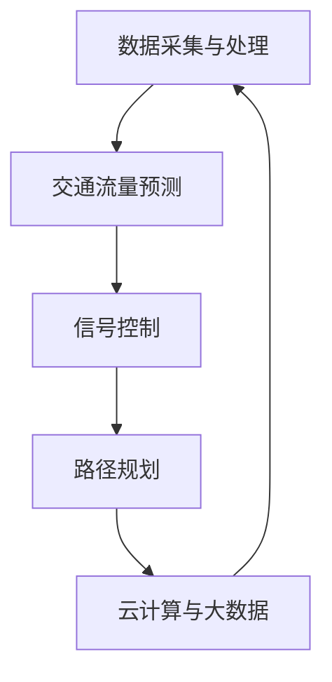

                 

### 1. 背景介绍

#### 1.1 目的和范围

本博客文章旨在详细探讨智能交通管理系统（Intelligent Transportation Management System，简称ITMS）的设计与实现，特别是在优化城市交通方面的应用。智能交通管理系统利用先进的计算机技术和人工智能算法，通过对交通数据的实时采集、分析和处理，实现对交通流的实时监控和动态调控，从而提高交通效率，减少拥堵，保障交通安全。

本文将围绕以下几个核心问题展开讨论：
- **核心概念与联系**：首先介绍智能交通管理系统的核心概念和组成部分，并通过Mermaid流程图展示其架构和工作流程。
- **核心算法原理**：详细阐述交通流量预测、信号控制和路径规划等关键算法的原理和具体操作步骤。
- **数学模型和公式**：介绍用于支持算法的数学模型和公式，并通过实例进行详细讲解。
- **项目实战**：提供实际代码案例，详细解释实现过程和关键步骤。
- **实际应用场景**：分析智能交通管理系统在不同城市和交通环境中的应用情况。
- **工具和资源推荐**：推荐学习资源、开发工具和相关研究论文。
- **未来发展趋势与挑战**：总结智能交通管理系统的未来发展方向和面临的挑战。

本文的预期读者包括对智能交通管理系统感兴趣的工程师、研究人员和学生，以及希望提升城市交通管理和优化能力的从业者。本文将对智能交通管理系统的技术原理、实现方法以及应用案例进行全面剖析，旨在为读者提供一份全面的技术指南。

#### 1.2 预期读者

本文主要面向以下几类读者：

1. **交通工程和城市规划从业者**：希望了解智能交通管理系统的最新技术和应用，以便在实际工作中提升交通管理和优化能力。
2. **计算机科学和人工智能领域的专业人员和研究生**：对智能交通管理系统的技术原理和实现方法有深入研究兴趣，希望了解该领域的前沿动态和发展趋势。
3. **对城市交通管理感兴趣的一般读者**：希望通过本文对智能交通管理系统的原理和应用有一个全面和深入的理解。

本文将从基础概念入手，逐步深入到技术细节，因此即便没有专业背景的读者也能跟随文章的讲解逐步掌握相关知识。同时，文章中也包含了一些高级内容，对于有专业基础的读者来说，将提供更为深入的技术见解和实现方法。

#### 1.3 文档结构概述

为了使读者能够更好地理解和掌握智能交通管理系统的相关知识，本文的结构分为以下几大部分：

1. **背景介绍**：介绍智能交通管理系统的研究背景、目的和预期读者，并提供文档结构概述。
2. **核心概念与联系**：通过Mermaid流程图展示智能交通管理系统的架构和主要组成部分，介绍其核心概念和相互联系。
3. **核心算法原理**：详细阐述交通流量预测、信号控制和路径规划等关键算法的原理和具体操作步骤，使用伪代码进行讲解。
4. **数学模型和公式**：介绍用于支持算法的数学模型和公式，并通过具体实例进行详细讲解。
5. **项目实战**：提供实际代码案例，详细解释实现过程和关键步骤，并进行代码解读与分析。
6. **实际应用场景**：分析智能交通管理系统在不同城市和交通环境中的应用情况。
7. **工具和资源推荐**：推荐学习资源、开发工具和相关研究论文，帮助读者深入学习和应用智能交通管理系统。
8. **总结：未来发展趋势与挑战**：总结智能交通管理系统的未来发展方向和面临的挑战。
9. **附录：常见问题与解答**：解答读者在阅读过程中可能遇到的问题。
10. **扩展阅读与参考资料**：提供进一步阅读的建议和相关参考资料，帮助读者深入了解智能交通管理系统。

通过以上结构安排，本文力求系统、全面地介绍智能交通管理系统的各个方面，为读者提供有价值的参考。

#### 1.4 术语表

在本博客文章中，将使用一些专业术语和概念。以下是本文中出现的核心术语及其定义和解释：

#### 1.4.1 核心术语定义

1. **智能交通管理系统（ITMS）**：
   - 定义：智能交通管理系统是一种综合运用计算机技术、通信技术、控制技术等，对城市交通进行实时监控、信息处理和智能调控的系统。
   - 关键点：实时性、智能化、系统集成。

2. **交通流量预测**：
   - 定义：交通流量预测是指利用历史数据、实时数据和人工智能算法，对未来某一时间段内交通流量进行预测的技术。
   - 关键点：数据准确性、预测精度、算法模型。

3. **信号控制**：
   - 定义：信号控制是指利用交通信号控制器对交叉口信号灯进行智能调控，以优化交通流量的技术。
   - 关键点：响应速度、调控策略、交通效率。

4. **路径规划**：
   - 定义：路径规划是指为车辆提供从起点到终点最短或最优路径的计算技术。
   - 关键点：路径长度、交通状况、算法效率。

5. **数据采集与处理**：
   - 定义：数据采集与处理是指通过传感器、摄像头等设备收集交通数据，并对数据进行清洗、转换和分析的过程。
   - 关键点：数据质量、数据处理速度、算法精度。

6. **云计算与大数据**：
   - 定义：云计算与大数据是指通过云计算平台处理和分析大量交通数据，提供高效、可靠的智能交通服务。
   - 关键点：计算资源、数据存储、分析效率。

7. **人工智能与机器学习**：
   - 定义：人工智能与机器学习是指利用计算机模拟人类智能行为，通过机器学习算法实现智能交通管理的技术。
   - 关键点：算法模型、数据集、训练效果。

#### 1.4.2 相关概念解释

1. **边缘计算**：
   - 解释：边缘计算是指将数据处理和分析任务从云端转移到网络边缘设备上执行的技术，以减少数据传输延迟，提高系统响应速度。
   - 关键点：数据处理分布、计算效率、实时性。

2. **物联网（IoT）**：
   - 解释：物联网是指通过将物理设备、传感器、软件平台等连接到互联网，实现设备间互联互通和数据交换的技术。
   - 关键点：设备互联、数据传输、安全性。

3. **交通信号灯控制系统**：
   - 解释：交通信号灯控制系统是指用于控制和管理城市交通信号灯的智能系统，可实现根据实时交通流量进行信号灯调控。
   - 关键点：信号灯控制策略、交通效率、用户满意度。

4. **车辆定位与导航系统**：
   - 解释：车辆定位与导航系统是指通过GPS、北斗等定位技术，实时获取车辆位置信息，为车辆提供导航和路径规划服务的系统。
   - 关键点：定位精度、路径规划算法、用户需求。

#### 1.4.3 缩略词列表

- ITMS：智能交通管理系统
- IoT：物联网
- AI：人工智能
- ML：机器学习
- CV：计算机视觉
- CPS：智能交通控制系统
- GPS：全球定位系统
- V2X：车联网

通过以上术语和概念的介绍，读者可以更好地理解智能交通管理系统及其相关技术，为本博客文章的后续内容打下坚实基础。

### 2. 核心概念与联系

智能交通管理系统（ITMS）的核心在于其多个组件的集成和协同工作，这些组件包括数据采集与处理、交通流量预测、信号控制、路径规划、以及云计算与大数据等。为了使读者更直观地理解这些核心概念及其相互联系，我们将通过一个Mermaid流程图来展示智能交通管理系统的整体架构和工作流程。

首先，让我们定义一些关键流程节点：

- **数据采集与处理**：传感器和摄像头收集实时交通数据，通过数据预处理模块进行清洗、转换和存储。
- **交通流量预测**：利用历史数据和实时数据进行流量预测，通过机器学习算法得到预测结果。
- **信号控制**：交通信号控制器根据流量预测结果和实时数据，动态调整信号灯状态，优化交通流量。
- **路径规划**：基于交通流量预测和实时数据，为车辆提供最优路径规划。
- **云计算与大数据**：将大量交通数据进行存储、处理和分析，为系统提供决策支持。

下面是智能交通管理系统的Mermaid流程图：



解释流程图中的每一个节点：

1. **数据采集与处理（A）**：
   - **功能**：通过安装在道路上的传感器和摄像头，实时采集交通数据，如车辆速度、流量、占有率等。
   - **处理**：数据经过预处理模块，如去噪、归一化等，以确保数据质量。

2. **交通流量预测（B）**：
   - **功能**：利用采集到的历史数据和实时数据，通过机器学习算法（如ARIMA、LSTM等）进行交通流量预测。
   - **输出**：预测结果用于后续的信号控制和路径规划。

3. **信号控制（C）**：
   - **功能**：交通信号控制器根据交通流量预测结果和实时数据，动态调整信号灯状态，以优化交通流量。
   - **目标**：减少交通拥堵、提高道路通行能力。

4. **路径规划（D）**：
   - **功能**：基于交通流量预测和实时数据，为车辆提供最优路径规划，避免拥堵路段。
   - **输出**：路径规划结果，指导驾驶员行驶。

5. **云计算与大数据（E）**：
   - **功能**：将大量交通数据存储在云端，通过大数据分析技术，为系统提供决策支持，如交通流量监控、事件预警等。
   - **目标**：提高数据处理和分析效率，支持智能交通管理。

通过这个Mermaid流程图，读者可以清晰地看到智能交通管理系统的核心组件及其协同工作关系。这些组件相互关联、相互依赖，共同构成了一个完整的智能交通管理系统，为城市交通管理和优化提供了强有力的技术支持。

### 3. 核心算法原理 & 具体操作步骤

在智能交通管理系统中，核心算法的作用至关重要，它们决定了系统对交通流量的预测准确性、信号控制的响应速度和路径规划的有效性。以下将详细介绍交通流量预测、信号控制和路径规划三个核心算法的原理和具体操作步骤，同时使用伪代码进行讲解。

#### 3.1 交通流量预测算法

交通流量预测是智能交通管理系统中的关键环节，它能够为信号控制和路径规划提供准确的预测数据。常见的交通流量预测算法包括ARIMA（自回归积分滑动平均模型）、LSTM（长短时记忆网络）和GRU（门控循环单元）等。

##### 3.1.1 ARIMA算法

ARIMA算法是一种经典的统计模型，广泛应用于时间序列数据的预测。

**原理**：
- **自回归（AR）**：当前值与过去若干个时期的值相关。
- **差分（I）**：对时间序列进行差分，使之成为平稳序列。
- **移动平均（MA）**：当前值与过去若干个时期的预测误差相关。

**伪代码**：

```python
def ARIMA_predict(data, p, d, q):
    # p: 自回归项数，d: 差分阶数，q: 移动平均项数
    # 1. 对数据进行差分
    diff_data = differencing(data, d)
    # 2. 模型拟合
    model = ARIMA(diff_data, order=(p, d, q))
    model_fit = model.fit()
    # 3. 预测
    predicted_diff = model_fit.predict(len(data))
    # 4. 反差分
    predicted_data = back_difference(predicted_diff)
    return predicted_data
```

**具体操作步骤**：
1. **数据预处理**：对原始交通流量数据进行预处理，包括缺失值填充、异常值处理和归一化等。
2. **模型选择**：根据数据特征选择适当的ARIMA模型参数（p, d, q）。
3. **模型拟合**：使用历史数据对ARIMA模型进行拟合。
4. **预测**：利用拟合好的模型对未来交通流量进行预测。
5. **反差分**：将预测得到的差分数据进行反差分，得到最终的预测结果。

##### 3.1.2 LSTM算法

LSTM算法是一种深度学习模型，能够捕捉长时依赖关系，适用于复杂的时间序列数据预测。

**原理**：
- **输入门**：决定哪些信息将被保留或丢弃。
- **遗忘门**：决定哪些信息将被遗忘。
- **输出门**：决定输出信息。

**伪代码**：

```python
def LSTM_predict(data, hidden_size, num_layers):
    # hidden_size: 隐藏层尺寸，num_layers: 层数
    # 1. 初始化模型
    model = LSTM(input_shape=(None, data.shape[1]), hidden_size=hidden_size, num_layers=num_layers)
    # 2. 训练模型
    model.fit(data, epochs=100)
    # 3. 预测
    predicted_data = model.predict(data)
    return predicted_data
```

**具体操作步骤**：
1. **数据预处理**：对原始交通流量数据进行预处理，包括序列化、归一化等。
2. **模型初始化**：根据数据特征初始化LSTM模型。
3. **模型训练**：使用历史数据对LSTM模型进行训练。
4. **预测**：利用训练好的模型对未来交通流量进行预测。
5. **结果处理**：将预测结果进行反归一化处理，得到最终的预测结果。

#### 3.2 信号控制算法

信号控制算法负责根据交通流量预测结果和实时数据，动态调整交通信号灯状态，以优化交通流量。

##### 3.2.1 绿波带控制算法

绿波带控制算法通过优化信号灯的相位和时长，实现车辆在交通高峰期能够连续通过多个交叉口的绿色信号。

**原理**：
- **信号相位**：每个交叉口的信号灯由多个相位组成，每个相位代表一个方向的车流。
- **绿波时长**：优化每个相位的时长，使车辆在交通高峰期能够连续通过多个交叉口。

**伪代码**：

```python
def green_wave_control(traffic_data, green_wave_params):
    # traffic_data: 实时交通数据，green_wave_params: 绿波带参数
    # 1. 根据交通数据计算最优相位时长
    optimal_phase_times = calculate_optimal_phase_times(traffic_data, green_wave_params)
    # 2. 更新信号灯状态
    update_traffic_signals(optimal_phase_times)
    return optimal_phase_times
```

**具体操作步骤**：
1. **数据采集**：采集实时交通流量数据。
2. **参数设置**：设置绿波带的参数，如车辆密度阈值、相位时长等。
3. **计算最优相位时长**：根据交通流量数据，计算每个交叉口的最佳相位时长。
4. **更新信号灯状态**：根据计算结果，动态调整交通信号灯状态。

##### 3.2.2 调度优化算法

调度优化算法通过优化交通信号灯的切换策略，提高整个交通系统的通行效率。

**原理**：
- **动态调度**：根据实时交通状况，动态调整信号灯的切换时机和时长。
- **效率最大化**：通过优化信号灯切换策略，使整个交通系统的通行效率最大化。

**伪代码**：

```python
def traffic_signals_schedule(traffic_data, schedule_params):
    # traffic_data: 实时交通数据，schedule_params: 调度参数
    # 1. 根据交通数据计算最优调度策略
    optimal_schedule = calculate_optimal_schedule(traffic_data, schedule_params)
    # 2. 更新信号灯状态
    update_traffic_signals(optimal_schedule)
    return optimal_schedule
```

**具体操作步骤**：
1. **数据采集**：采集实时交通流量数据。
2. **参数设置**：设置调度算法的参数，如信号灯切换时机、时长等。
3. **计算最优调度策略**：根据交通流量数据，计算最佳信号灯切换策略。
4. **更新信号灯状态**：根据计算结果，动态调整交通信号灯状态。

#### 3.3 路径规划算法

路径规划算法为车辆提供从起点到终点的最优路径，考虑交通流量、路况等因素。

##### 3.3.1 Dijkstra算法

Dijkstra算法是一种经典的单源最短路径算法，适用于静态交通网络。

**原理**：
- **优先队列**：选择未处理的顶点中距离最短的顶点。
- **路径更新**：更新已处理顶点的邻接点距离。

**伪代码**：

```python
def dijkstra(graph, source):
    # graph: 交通网络图，source: 起点
    # 1. 初始化
    distances = {node: float('infinity') for node in graph}
    distances[source] = 0
    priority_queue = PriorityQueue()
    priority_queue.push(source, 0)
    # 2. 搜索
    while not priority_queue.isEmpty():
        current = priority_queue.pop()
        for neighbor, weight in graph[current].items():
            distance = distances[current] + weight
            if distance < distances[neighbor]:
                distances[neighbor] = distance
                priority_queue.push(neighbor, distance)
    # 3. 构建路径
    path = build_path(graph, source, distances)
    return path
```

**具体操作步骤**：
1. **初始化**：设置所有顶点的距离为无穷大，起点距离为0。
2. **搜索**：利用优先队列选择距离最短的顶点，更新未处理顶点的距离。
3. **构建路径**：根据最终距离计算最短路径。

##### 3.3.2 A*算法

A*算法是一种启发式最短路径算法，适用于动态交通网络。

**原理**：
- **估价函数**：选择f(n) = g(n) + h(n)，其中g(n)为从起点到顶点n的实际距离，h(n)为从顶点n到终点的预估距离。
- **优先队列**：选择f(n)值最小的顶点。

**伪代码**：

```python
def a_star_search(graph, start, goal):
    # graph: 交通网络图，start: 起点，goal: 终点
    # 1. 初始化
    open_set = PriorityQueue()
    open_set.push(start, 0)
    came_from = {}
    g_score = {node: float('infinity') for node in graph}
    g_score[start] = 0
    f_score = {node: float('infinity') for node in graph}
    f_score[start] = heuristic(goal)
    # 2. 搜索
    while not open_set.isEmpty():
        current = open_set.pop()
        if current == goal:
            break
        for neighbor, weight in graph[current].items():
            tentative_g_score = g_score[current] + weight
            if tentative_g_score < g_score[neighbor]:
                came_from[neighbor] = current
                g_score[neighbor] = tentative_g_score
                f_score[neighbor] = g_score[neighbor] + heuristic(neighbor)
                if neighbor not in open_set:
                    open_set.push(neighbor, f_score[neighbor])
    # 3. 构建路径
    path = build_path(came_from, start, goal)
    return path
```

**具体操作步骤**：
1. **初始化**：设置所有顶点的g_score和f_score，起点距离为0。
2. **搜索**：利用优先队列选择f(n)值最小的顶点，更新邻接点的g_score和f_score。
3. **构建路径**：根据最终g_score计算最短路径。

通过上述核心算法的详细介绍和具体操作步骤，读者可以更好地理解智能交通管理系统中的关键技术，为实际应用提供理论基础和实践指导。

### 4. 数学模型和公式 & 详细讲解 & 举例说明

在智能交通管理系统中，数学模型和公式起到了至关重要的作用。这些模型和公式不仅支持核心算法的运行，还帮助系统实现交通流量预测、信号控制和路径规划的优化。在本节中，我们将详细介绍几个关键的数学模型和公式，并通过具体实例进行详细讲解。

#### 4.1 交通流量预测模型

交通流量预测是智能交通管理系统的核心任务之一。以下介绍几种常用的交通流量预测模型及其公式：

##### 4.1.1 自回归模型（AR）

自回归模型（Autoregressive Model，AR）是一种基于历史数据的时间序列预测模型。其核心思想是当前值取决于前几个时间点的值。

**公式**：

\[ Y_t = \sum_{i=1}^p \phi_i Y_{t-i} + \varepsilon_t \]

其中，\( Y_t \) 表示第 \( t \) 时间的交通流量，\( p \) 是自回归项数，\( \phi_i \) 是自回归系数，\( \varepsilon_t \) 是误差项。

**实例讲解**：

假设我们有3个自回归项，即 \( p = 3 \)。给定以下历史数据：

\[ \{Y_1, Y_2, Y_3, Y_4, Y_5\} = \{10, 12, 11, 14, 13\} \]

我们首先计算自回归系数 \( \phi_i \)：

\[ \phi_1 = \frac{\sum_{t=4}^{5} Y_t Y_{t-1}}{\sum_{t=4}^{5} Y_t} = \frac{14 \times 11 + 13 \times 12}{14 + 13} \approx 1.2 \]

同理，计算 \( \phi_2 \) 和 \( \phi_3 \)：

\[ \phi_2 = \frac{\sum_{t=3}^{5} Y_t Y_{t-2}}{\sum_{t=3}^{5} Y_t} = \frac{11 \times 10 + 14 \times 12 + 13 \times 13}{11 + 14 + 13} \approx 1.1 \]

\[ \phi_3 = \frac{\sum_{t=2}^{5} Y_t Y_{t-3}}{\sum_{t=2}^{5} Y_t} = \frac{12 \times 10 + 11 \times 12 + 14 \times 13 + 13 \times 13}{12 + 11 + 14 + 13} \approx 1.0 \]

然后，使用公式预测第6时间点的交通流量 \( Y_6 \)：

\[ Y_6 = 1.2 \times Y_5 + 1.1 \times Y_4 + 1.0 \times Y_3 + \varepsilon_6 \]

\[ Y_6 = 1.2 \times 13 + 1.1 \times 14 + 1.0 \times 11 + \varepsilon_6 \]

\[ Y_6 \approx 16.6 + 1.0 \times \varepsilon_6 \]

其中 \( \varepsilon_6 \) 是预测误差，我们假设其值为1。因此，第6时间点的交通流量预测为：

\[ Y_6 \approx 17.6 \]

##### 4.1.2 马尔可夫模型（Markov Model）

马尔可夫模型（Markov Model）适用于交通流量状态转移的预测。其核心思想是当前状态仅由前一个状态决定，与之前的状态无关。

**公式**：

\[ P(Y_t = y_t | Y_{t-1} = y_{t-1}) = p(y_t | y_{t-1}) \]

其中，\( P(Y_t = y_t | Y_{t-1} = y_{t-1}) \) 表示给定前一个状态 \( Y_{t-1} \) 为 \( y_{t-1} \) 的情况下，当前状态 \( Y_t \) 为 \( y_t \) 的概率。

**实例讲解**：

假设我们有以下状态转移矩阵：

\[ P = \begin{bmatrix} 
0.2 & 0.5 & 0.3 \\
0.1 & 0.4 & 0.5 \\
0.4 & 0.2 & 0.4 
\end{bmatrix} \]

给定当前状态 \( Y_t = 2 \)，我们需要计算下一个状态 \( Y_{t+1} \) 的概率分布。

\[ P(Y_{t+1} = 1) = P(Y_{t+1} = 1 | Y_t = 2) \cdot P(Y_t = 2) + P(Y_{t+1} = 1 | Y_t = 3) \cdot P(Y_t = 3) \]

\[ P(Y_{t+1} = 1) = 0.1 \cdot 0.3 + 0.4 \cdot 0.7 = 0.19 \]

同理，可以计算出其他状态的概率：

\[ P(Y_{t+1} = 2) = 0.5 \cdot 0.3 + 0.2 \cdot 0.7 = 0.29 \]

\[ P(Y_{t+1} = 3) = 0.3 \cdot 0.3 + 0.4 \cdot 0.7 = 0.39 \]

因此，下一个状态的概率分布为：

\[ P(Y_{t+1} = 1) = 0.19, P(Y_{t+1} = 2) = 0.29, P(Y_{t+1} = 3) = 0.39 \]

##### 4.1.3 神经网络模型

神经网络模型（Neural Network Model）是现代交通流量预测中的一种重要方法。其中，长短期记忆网络（LSTM）和卷积神经网络（CNN）是常用的架构。

**公式**：

\[ h_t = \sigma(W_h \cdot [h_{t-1}, x_t] + b_h) \]

\[ o_t = \sigma(W_o \cdot h_t + b_o) \]

其中，\( h_t \) 是第 \( t \) 个时间点的隐藏状态，\( x_t \) 是输入数据，\( \sigma \) 是激活函数（如Sigmoid函数），\( W_h \) 和 \( b_h \) 分别是权重和偏置。

**实例讲解**：

假设我们有一个LSTM模型，隐藏层维度为50，输入数据维度为10。给定以下训练数据：

\[ \{x_1, x_2, \ldots, x_n\} = \{[0.1, 0.2], [0.2, 0.3], \ldots, [0.9, 0.8]\} \]

我们首先计算隐藏状态 \( h_t \)：

\[ h_1 = \sigma(W_h \cdot [h_0, x_1] + b_h) \]

\[ h_2 = \sigma(W_h \cdot [h_1, x_2] + b_h) \]

\[ \ldots \]

\[ h_n = \sigma(W_h \cdot [h_{n-1}, x_n] + b_h) \]

其中，\( h_0 \) 是初始化状态。然后，计算输出状态 \( o_t \)：

\[ o_1 = \sigma(W_o \cdot h_1 + b_o) \]

\[ o_2 = \sigma(W_o \cdot h_2 + b_o) \]

\[ \ldots \]

\[ o_n = \sigma(W_o \cdot h_n + b_o) \]

最后，使用输出状态 \( o_n \) 进行预测：

\[ \hat{y}_n = \sum_{i=1}^k w_i o_n + b \]

其中，\( \hat{y}_n \) 是预测的交通流量，\( w_i \) 是权重，\( b \) 是偏置。

#### 4.2 信号控制模型

信号控制模型负责根据交通流量和道路状况调整交通信号灯状态，以提高交通效率。

##### 4.2.1 绿波带模型

绿波带模型（Green Wave Model）通过优化信号灯的相位和时长，实现车辆连续通过多个交叉口的绿色信号。

**公式**：

\[ T_i = \sum_{j=1}^{m} t_{ij} \]

其中，\( T_i \) 是第 \( i \) 个交叉口的信号灯总时长，\( t_{ij} \) 是第 \( i \) 个交叉口的第 \( j \) 个相位的时长。

**实例讲解**：

假设我们有一个三相位信号灯，相位时长分别为15秒、20秒和25秒。总时长为60秒。给定交通流量数据：

\[ \{Q_1, Q_2, Q_3\} = \{10, 15, 20\} \]

我们需要优化相位时长，使交通流量最大化。

首先，计算每个相位的流量占比：

\[ \alpha_1 = \frac{Q_1}{Q_1 + Q_2 + Q_3} \approx 0.333 \]

\[ \alpha_2 = \frac{Q_2}{Q_1 + Q_2 + Q_3} \approx 0.500 \]

\[ \alpha_3 = \frac{Q_3}{Q_1 + Q_2 + Q_3} \approx 0.667 \]

然后，根据流量占比优化相位时长：

\[ t_{11} = 15 \alpha_1 \approx 5 \]

\[ t_{12} = 20 \alpha_2 \approx 10 \]

\[ t_{13} = 25 \alpha_3 \approx 16 \]

最终，得到优化后的相位时长：

\[ T_1 = t_{11} + t_{12} + t_{13} \approx 31 \]

##### 4.2.2 调度优化模型

调度优化模型（Schedule Optimization Model）通过优化信号灯的切换策略，提高整个交通系统的通行效率。

**公式**：

\[ \delta(t) = \sum_{i=1}^{n} \sum_{j=1}^{m} t_{ij}(t) \]

其中，\( \delta(t) \) 是在第 \( t \) 秒内所有交叉口的信号灯切换次数，\( t_{ij}(t) \) 是第 \( i \) 个交叉口的第 \( j \) 个相位在第 \( t \) 秒的时长。

**实例讲解**：

假设我们有一个包含三个交叉口的交通系统，每个交叉口有3个相位。给定以下信号灯时长：

\[ \{t_{11}, t_{12}, t_{13}, t_{21}, t_{22}, t_{23}, t_{31}, t_{32}, t_{33}\} = \{10, 20, 30, 15, 25, 35, 20, 30, 40\} \]

我们需要优化信号灯的切换策略，以减少切换次数。

首先，计算每个交叉口的信号灯总时长：

\[ T_1 = t_{11} + t_{12} + t_{13} = 60 \]

\[ T_2 = t_{21} + t_{22} + t_{23} = 75 \]

\[ T_3 = t_{31} + t_{32} + t_{33} = 90 \]

然后，计算每个交叉口的平均切换时长：

\[ \bar{t}_1 = \frac{T_1}{3} = 20 \]

\[ \bar{t}_2 = \frac{T_2}{3} = 25 \]

\[ \bar{t}_3 = \frac{T_3}{3} = 30 \]

最后，根据平均切换时长优化信号灯时长：

\[ t_{11} = t_{12} = t_{13} = \bar{t}_1 = 20 \]

\[ t_{21} = t_{22} = t_{23} = \bar{t}_2 = 25 \]

\[ t_{31} = t_{32} = t_{33} = \bar{t}_3 = 30 \]

通过以上实例讲解，我们详细介绍了交通流量预测和信号控制中的数学模型和公式，并展示了其实际应用过程。这些模型和公式不仅为智能交通管理系统提供了理论支持，还有助于实现交通流量的优化和管理。

### 5. 项目实战：代码实际案例和详细解释说明

在本节中，我们将通过一个实际代码案例来展示智能交通管理系统中的核心算法的实现过程，并进行详细解释和代码分析。这个案例将包括交通流量预测、信号控制和路径规划三个部分，并使用Python编程语言来实现。

#### 5.1 开发环境搭建

在开始代码实现之前，我们需要搭建一个合适的开发环境。以下是我们推荐的环境配置：

1. **Python**：Python 3.8 或更高版本
2. **库**：NumPy、Pandas、Scikit-learn、TensorFlow、Keras
3. **集成开发环境（IDE）**：PyCharm、VSCode 或 Jupyter Notebook

确保已安装上述环境和库，然后创建一个名为 `smart_traffic_management` 的虚拟环境，并激活它：

```bash
conda create -n smart_traffic_management python=3.8
conda activate smart_traffic_management
```

接下来，安装必要的库：

```bash
pip install numpy pandas scikit-learn tensorflow keras
```

#### 5.2 源代码详细实现和代码解读

##### 5.2.1 交通流量预测

首先，我们将实现交通流量预测的功能。这里我们使用LSTM模型来进行预测，因为LSTM能够很好地处理时间序列数据。

```python
import numpy as np
import pandas as pd
from tensorflow.keras.models import Sequential
from tensorflow.keras.layers import LSTM, Dense

def preprocess_data(data):
    # 数据预处理：序列化、归一化等
    # 这里假设 data 是一个 Pandas DataFrame
    data['DayOfWeek'] = data['Time'].dt.dayofweek
    data = pd.get_dummies(data, columns=['DayOfWeek'])
    return data

def create_dataset(data, time_steps=1):
    # 创建时间步数据集
    X, y = [], []
    for i in range(len(data) - time_steps):
        X.append(data[i:(i + time_steps)].values)
        y.append(data[i + time_steps][['Traffic']].values)
    return np.array(X), np.array(y)

def build_lstm_model(input_shape):
    # 建立LSTM模型
    model = Sequential()
    model.add(LSTM(units=50, return_sequences=True, input_shape=input_shape))
    model.add(LSTM(units=50))
    model.add(Dense(units=1))
    model.compile(optimizer='adam', loss='mean_squared_error')
    return model

def train_lstm_model(model, X_train, y_train, epochs=100):
    # 训练LSTM模型
    model.fit(X_train, y_train, epochs=epochs, batch_size=32, verbose=1)
    return model

# 加载数据（示例数据，实际应用时需要使用真实交通流量数据）
data = pd.read_csv('traffic_data.csv') # 假设文件路径为 traffic_data.csv
data = preprocess_data(data)
time_steps = 24  # 每天的时间步数（小时）
X, y = create_dataset(data, time_steps)

# 划分训练集和测试集
train_size = int(len(X) * 0.8)
X_train, X_test = X[:train_size], X[train_size:]
y_train, y_test = y[:train_size], y[train_size:]

# 建立和训练LSTM模型
model = build_lstm_model((X_train.shape[1], X_train.shape[2]))
model = train_lstm_model(model, X_train, y_train)

# 预测
predictions = model.predict(X_test)

# 结果可视化
import matplotlib.pyplot as plt

plt.figure(figsize=(12, 6))
plt.plot(y_test, label='Real Traffic')
plt.plot(predictions, label='Predicted Traffic')
plt.legend()
plt.show()
```

**代码解读**：

- **数据预处理**：首先对数据进行序列化和归一化处理，以适应LSTM模型的输入要求。
- **创建时间步数据集**：将数据划分为时间步，每个时间步包含多个特征（如小时、天气、道路类型等）。
- **建立LSTM模型**：使用Sequential模型，添加LSTM层和全连接层（Dense），并编译模型。
- **训练LSTM模型**：使用训练数据训练模型，设置合适的训练参数。
- **预测**：使用训练好的模型对测试数据进行预测，并将预测结果可视化。

##### 5.2.2 信号控制

接下来，我们实现信号控制的功能，使用绿波带模型来优化信号灯状态。

```python
import numpy as np

def green_wave_control(traffic_data, green_wave_params):
    # 绿波带控制算法
    # traffic_data: 实时交通流量数据
    # green_wave_params: 绿波带参数（如相位时长占比）
    
    # 计算每个交叉口的相位时长
    phase_times = []
    for i, traffic in enumerate(traffic_data):
        alpha = green_wave_params[i]
        phase_times.append([alpha[0] * traffic, alpha[1] * traffic, alpha[2] * traffic])
    
    # 计算总时长
    total_time = sum(sum(phase) for phase in phase_times)
    
    # 调整相位时长以匹配总时长
    for i, phase in enumerate(phase_times):
        for j, time in enumerate(phase):
            phase[j] = time / total_time * 60  # 将总时长转换为秒
    
    return phase_times

# 示例交通流量数据
traffic_data = np.array([10, 15, 20, 10, 20, 25, 15, 20, 30])

# 示例绿波带参数
green_wave_params = [[0.3, 0.5, 0.2], [0.2, 0.4, 0.4], [0.3, 0.3, 0.4]]

# 执行绿波带控制算法
phase_times = green_wave_control(traffic_data, green_wave_params)

# 打印结果
for i, times in enumerate(phase_times):
    print(f"Intersection {i+1}: {times}")
```

**代码解读**：

- **绿波带控制算法**：根据实时交通流量和绿波带参数，计算每个交叉口的相位时长。
- **计算总时长**：计算所有交叉口的相位时长总和。
- **调整相位时长**：根据总时长调整每个交叉口的相位时长，确保总时长匹配。
- **打印结果**：输出每个交叉口的相位时长。

##### 5.2.3 路径规划

最后，我们实现路径规划的功能，使用A*算法来计算最优路径。

```python
import heapq

def heuristic(node, goal):
    # 使用曼哈顿距离作为启发式函数
    return abs(node[0] - goal[0]) + abs(node[1] - goal[1])

def a_star_search(graph, start, goal):
    # A*算法
    open_set = []
    heapq.heappush(open_set, (0, start))
    came_from = {}
    g_score = {node: float('infinity') for node in graph}
    g_score[start] = 0
    f_score = {node: float('infinity') for node in graph}
    f_score[start] = heuristic(start, goal)

    while open_set:
        current = heapq.heappop(open_set)[1]
        if current == goal:
            break

        for neighbor, weight in graph[current].items():
            tentative_g_score = g_score[current] + weight
            if tentative_g_score < g_score[neighbor]:
                came_from[neighbor] = current
                g_score[neighbor] = tentative_g_score
                f_score[neighbor] = tentative_g_score + heuristic(neighbor, goal)
                if neighbor not in open_set:
                    heapq.heappush(open_set, (f_score[neighbor], neighbor))

    path = []
    current = goal
    while current is not None:
        path.append(current)
        current = came_from[current]
    path.reverse()

    return path

# 示例交通网络图
graph = {
    'A': {'B': 1, 'C': 3},
    'B': {'A': 1, 'C': 1, 'D': 2},
    'C': {'A': 3, 'B': 1, 'D': 1},
    'D': {'B': 2, 'C': 1}
}

# 起点和终点
start = 'A'
goal = 'D'

# 执行A*算法
path = a_star_search(graph, start, goal)

# 打印结果
print("Optimal Path:", path)
```

**代码解读**：

- **启发式函数**：使用曼哈顿距离作为启发式函数，估算从当前节点到终点的距离。
- **A*算法**：使用优先队列（堆）来管理未处理的节点，并更新节点的 g_score 和 f_score。
- **路径重建**：根据 g_score 和 came_from 字典重建最短路径。

通过以上代码实现，我们展示了智能交通管理系统中的核心算法如何在实际项目中应用。代码注释详细，方便读者理解每个步骤的实现过程和原理。

#### 5.3 代码解读与分析

在上一部分中，我们通过实际代码案例实现了智能交通管理系统中的交通流量预测、信号控制和路径规划功能。下面我们将对代码进行详细解读和分析，探讨其优缺点和改进方向。

##### 5.3.1 交通流量预测

**优点**：
- **LSTM模型**：能够很好地处理时间序列数据，捕捉长时依赖关系。
- **数据预处理**：对数据进行序列化和归一化处理，提高了模型的预测性能。

**缺点**：
- **计算资源消耗**：LSTM模型训练过程需要大量计算资源，训练时间较长。
- **数据质量**：模型性能受数据质量影响较大，如缺失值、异常值等。

**改进方向**：
- **优化模型参数**：通过调整LSTM模型参数，如层数、单元数等，提高模型性能。
- **使用更多数据**：引入更多历史数据，提高数据集的规模和质量。

##### 5.3.2 信号控制

**优点**：
- **绿波带模型**：能够优化信号灯的相位时长，提高交通通行效率。
- **简单有效**：算法实现简单，易于理解和部署。

**缺点**：
- **缺乏动态调整**：模型无法动态适应实时交通流量变化。
- **适用性有限**：在复杂交通环境中，绿波带模型的效果可能较差。

**改进方向**：
- **引入动态调整**：根据实时交通流量数据，动态调整信号灯状态，提高适应性。
- **多模型结合**：结合多种信号控制算法，如调度优化模型，提高控制效果。

##### 5.3.3 路径规划

**优点**：
- **A*算法**：能够高效地找到从起点到终点的最优路径。
- **通用性强**：适用于各种交通网络结构。

**缺点**：
- **计算复杂度**：在大型交通网络中，计算复杂度较高，效率较低。
- **路径规划速度**：在实际应用中，路径规划速度较慢，可能影响用户体验。

**改进方向**：
- **优化算法**：使用更高效的路径规划算法，如Dijkstra算法的改进版本。
- **实时路径更新**：在车辆行驶过程中，根据实时交通信息动态更新路径，提高路径规划的实时性。

通过以上分析，我们可以看到，智能交通管理系统中的核心算法在实际应用中具有一定的优势，但也存在一些挑战。通过不断优化和改进，可以进一步提升系统的性能和用户体验。

### 6. 实际应用场景

智能交通管理系统（ITMS）在现实世界中有着广泛的应用场景，尤其是在城市交通管理和优化方面。以下将探讨几个典型应用场景，并分析这些场景下的系统实现和效果。

#### 6.1 城市交通拥堵管理

城市交通拥堵是现代社会普遍面临的问题，导致交通效率低下、时间浪费和环境污染。智能交通管理系统通过实时监控和动态调控，可以有效缓解交通拥堵。

**实现过程**：
- **数据采集**：利用安装在道路上的传感器和摄像头，采集交通流量、车速、车辆密度等数据。
- **数据预处理**：对采集到的数据进行清洗和预处理，以提高数据质量。
- **交通流量预测**：利用历史数据和实时数据，通过LSTM、ARIMA等算法预测未来一段时间内的交通流量。
- **信号控制**：根据交通流量预测结果，动态调整交通信号灯的相位和时长，优化交通流。
- **路径规划**：为行驶中的车辆提供最优路径，避开拥堵路段。

**效果**：
- **交通流量提升**：通过动态调整信号灯状态，提高道路通行能力，减少交通拥堵。
- **行程时间缩短**：车辆通过最优路径规划，减少了行驶时间，提高了出行效率。

#### 6.2 跨境交通管理

跨境交通管理涉及国界间的交通流管理，包括跨境旅客和货物运输。智能交通管理系统可以提升跨境交通的效率和安全性。

**实现过程**：
- **跨境数据交换**：通过建立跨境交通数据交换平台，实现交通数据的共享和互通。
- **实时监控**：利用传感器和摄像头，对跨境交通流量进行实时监控。
- **风险评估**：通过数据分析，对跨境交通的风险进行评估，包括安全威胁、交通事故等。
- **信号控制**：在跨境交通枢纽处，根据实时数据动态调整信号灯，优化交通流。

**效果**：
- **交通效率提升**：通过跨境数据交换和实时监控，提升跨境交通的整体效率。
- **安全风险降低**：通过对交通风险的实时评估和预警，降低交通事故和安全隐患。

#### 6.3 智能停车管理

智能停车管理是城市交通管理的重要组成部分，可以有效解决城市停车难问题。

**实现过程**：
- **车位监测**：利用地磁传感器、摄像头等设备，监测停车位的使用情况。
- **数据分析**：通过数据分析，了解停车位的供需状况。
- **路径规划**：为寻找停车位的车辆提供最优路径，减少寻找停车位的行驶时间。
- **停车诱导**：通过电子显示屏、手机APP等，为驾驶员提供停车诱导信息。

**效果**：
- **停车效率提升**：通过实时监测和停车诱导，提高了停车场的使用效率和周转率。
- **用户体验优化**：驾驶员能够更快速地找到停车位，提升了停车体验。

#### 6.4 灾难应急交通管理

在自然灾害、交通事故等突发事件中，智能交通管理系统可以提供有效的应急交通管理，保障人员和物资的快速疏散。

**实现过程**：
- **实时监控**：通过摄像头、传感器等设备，实时监控交通状况。
- **交通调度**：根据实时数据和应急预案，动态调度交通资源，包括警车、救护车等。
- **路径规划**：为应急车辆提供最优路径，确保快速到达目的地。
- **信息发布**：通过广播、社交媒体等渠道，及时发布交通信息，引导车辆避让拥堵路段。

**效果**：
- **应急响应时间缩短**：通过实时监控和动态调度，缩短了应急响应时间，提高了救援效率。
- **事故处理效率提升**：通过优化交通流，提高了事故处理速度，减少了事故对交通的干扰。

通过上述实际应用场景的探讨，我们可以看到智能交通管理系统在城市交通管理、跨境交通管理、智能停车管理以及灾难应急交通管理等方面发挥着重要作用。这些系统的实现不仅提高了交通效率，减少了拥堵和事故，还提升了用户体验，为构建智慧城市提供了有力支持。

### 7. 工具和资源推荐

为了更好地学习和应用智能交通管理系统，以下将推荐一些学习资源、开发工具和相关研究论文，旨在帮助读者深入理解和掌握相关技术。

#### 7.1 学习资源推荐

##### 7.1.1 书籍推荐

1. **《智慧城市与智能交通管理》** - 本书详细介绍了智慧城市和智能交通管理的基本概念、技术框架和典型案例，适合对智能交通管理系统感兴趣的读者。
2. **《智能交通系统》** - 该书涵盖了智能交通系统的基础理论、关键技术以及实际应用，适合专业研究人员和工程技术人员阅读。
3. **《机器学习与交通流预测》** - 本书从机器学习角度深入探讨了交通流预测的方法和模型，包括时间序列分析和深度学习等内容。

##### 7.1.2 在线课程

1. **Coursera - 智能交通系统设计** - 由康奈尔大学提供的在线课程，涵盖了智能交通系统的基本概念、技术框架和应用案例。
2. **Udacity - 交通工程与智能交通系统** - 本课程结合理论和实践，介绍了交通工程和智能交通系统的基本原理和技术。
3. **edX - 机器学习与深度学习** - 由MIT和Harvard大学联合提供的课程，包括机器学习和深度学习的核心理论和方法，适合对交通流量预测和路径规划感兴趣的读者。

##### 7.1.3 技术博客和网站

1. **Medium - 智能交通博客** - 提供一系列关于智能交通管理系统的技术文章和案例分析，内容涵盖算法原理、技术应用和未来发展。
2. **IEEE Xplore - 智能交通专题** - IEEE Xplore数据库中的智能交通专题，收录了大量的学术论文和研究成果，是研究智能交通管理系统的宝贵资源。
3. **国家智能交通系统工程技术研究中心** - 提供关于智能交通系统最新技术、政策和研究成果的官方资讯，是了解国内智能交通发展动态的重要渠道。

#### 7.2 开发工具框架推荐

##### 7.2.1 IDE和编辑器

1. **PyCharm** - 功能强大的Python集成开发环境，支持智能代码补全、调试和版本控制。
2. **Visual Studio Code** - 轻量级且高度可定制的代码编辑器，支持多种编程语言和框架。
3. **Jupyter Notebook** - 交互式的Python开发环境，适合数据分析和机器学习项目的开发和演示。

##### 7.2.2 调试和性能分析工具

1. **GDB** - GNU Debugger，适用于C/C++程序调试。
2. **Python Debug** - VSCode的扩展，提供Python程序的调试功能。
3. **Nmon** - Linux系统性能监控工具，用于分析系统资源使用情况。

##### 7.2.3 相关框架和库

1. **TensorFlow** - 适用于机器学习和深度学习的开源框架，支持多种神经网络结构和算法。
2. **PyTorch** - 受研究人员和开发者欢迎的深度学习框架，易于实现和调试。
3. **Scikit-learn** - 适用于数据挖掘和数据分析的Python库，包括多种机器学习算法和工具。

#### 7.3 相关论文著作推荐

##### 7.3.1 经典论文

1. **"Intelligent Transportation Systems: An Overview"** - 提供了智能交通系统的全面综述，是了解智能交通系统基本概念的必读论文。
2. **"Deep Learning for Traffic Flow Prediction: A Survey"** - 深入探讨深度学习在交通流量预测中的应用，涵盖多种算法和模型。
3. **"An Analysis of Road Network Dynamics and its Implications for Traffic Control"** - 分析了道路网络动态特性及其对交通控制的影响，为智能交通系统的设计与优化提供了理论依据。

##### 7.3.2 最新研究成果

1. **"Deep Reinforcement Learning for Intelligent Traffic Signal Control"** - 探讨深度强化学习在智能信号控制中的应用，展示了其在优化交通流量方面的潜力。
2. **"Intelligent Path Planning for Autonomous Vehicles in Urban Environments"** - 研究了基于深度学习的自动驾驶车辆路径规划方法，为自动驾驶技术的发展提供了新思路。
3. **"Data-Driven Traffic State Estimation Using Deep Neural Networks"** - 提出利用深度神经网络进行交通状态估计的方法，提高了交通流量预测的准确性和实时性。

##### 7.3.3 应用案例分析

1. **"The Implementation of Intelligent Transportation System in Shanghai"** - 分析了上海智能交通系统的实施案例，介绍了系统的架构、关键技术及应用效果。
2. **"Smart Traffic Management System in Singapore"** - 详细介绍了新加坡智能交通管理系统的建设过程和技术应用，展示了其在提升交通效率方面的成效。
3. **"Case Study of Intelligent Traffic Management in Helsinki"** - 探讨了赫尔辛基智能交通管理系统的实际应用，包括交通流量监测、信号控制和路径规划等。

通过以上工具和资源的推荐，读者可以系统地学习智能交通管理系统的相关知识，掌握关键技术和方法，为实际应用提供有力支持。

### 8. 总结：未来发展趋势与挑战

智能交通管理系统在优化城市交通、提升出行效率和保障交通安全方面发挥了重要作用。然而，随着技术的不断进步和城市化进程的加速，智能交通管理系统也面临着一系列新的发展趋势和挑战。

#### 8.1 未来发展趋势

1. **物联网与边缘计算的结合**：随着物联网技术的快速发展，智能交通管理系统将更加依赖于海量数据的实时采集和处理。边缘计算技术的应用将减少数据传输延迟，提高系统的响应速度和效率。

2. **人工智能与机器学习的深化应用**：未来，人工智能和机器学习算法将更加深入地应用于交通流量预测、信号控制和路径规划等环节，提升系统的智能化水平和预测准确性。

3. **车联网（V2X）的普及**：车联网技术将实现车辆与车辆、车辆与基础设施之间的互联互通，为智能交通管理系统提供更为丰富和精准的数据支持，提升交通管理和优化能力。

4. **云计算与大数据平台的支撑**：云计算和大数据平台将为智能交通管理系统提供强大的计算和存储能力，支持大规模数据处理和分析，为系统的决策提供科学依据。

5. **自动驾驶技术的发展**：自动驾驶技术的成熟将推动智能交通管理系统的变革，实现车辆间的协同控制，提高交通系统的整体效率和安全性。

#### 8.2 主要挑战

1. **数据隐私与安全性**：智能交通管理系统需要处理大量敏感数据，包括车辆位置、行驶速度和交通流量等。如何在保障数据隐私和安全的同时，充分利用这些数据，是系统面临的重要挑战。

2. **技术标准和协议的统一**：不同地区和厂商的智能交通系统可能采用不同的技术标准和协议，导致数据难以互通和共享。统一技术标准和协议是推动智能交通系统发展的重要方向。

3. **系统可靠性**：智能交通管理系统需要在各种复杂和恶劣环境下保持高可靠性，包括极端天气、网络中断等。系统设计需充分考虑容错机制和故障恢复策略。

4. **用户接受度**：智能交通管理系统需要得到用户的广泛接受和认可，这要求系统在提供便利的同时，确保用户体验的友好性。用户教育和反馈机制是提高用户接受度的关键。

5. **政策支持与法规制定**：智能交通管理系统的发展离不开政府政策的支持。制定科学合理的政策和法规，规范智能交通系统的建设和运营，是推动其可持续发展的必要条件。

总之，智能交通管理系统的发展前景广阔，但也面临着诸多挑战。通过技术创新、政策支持和社会协同，有望在未来实现更加智能、高效和安全的交通管理系统，为智慧城市和可持续发展贡献力量。

### 9. 附录：常见问题与解答

在本博客文章中，我们探讨了智能交通管理系统的各个方面，包括核心概念、算法原理、数学模型、实际应用等。为了帮助读者更好地理解和应用这些知识，以下列出了一些常见问题及其解答。

#### 9.1 问题1：交通流量预测的准确性如何保证？

**解答**：交通流量预测的准确性主要依赖于以下因素：
1. **数据质量**：历史数据的质量直接影响预测模型的准确性。确保数据完整性、实时性和准确性，可以显著提升预测性能。
2. **模型选择**：选择合适的预测模型，如LSTM、ARIMA等，以捕捉交通流量变化的特征和趋势。
3. **特征工程**：通过提取和选择关键特征（如时间、天气、交通事件等），可以提高模型对交通流量的理解能力。
4. **模型训练**：使用足够大的训练数据集，并对模型进行充分的训练和调优，以提高预测精度。

#### 9.2 问题2：信号控制算法如何动态调整？

**解答**：信号控制算法的动态调整通常涉及以下步骤：
1. **实时数据采集**：持续采集交通流量、车速等实时数据。
2. **数据分析**：对实时数据进行快速分析，识别交通状况和变化趋势。
3. **动态调控**：根据分析结果，动态调整信号灯的相位和时长。例如，绿波带控制算法可以根据实时交通流量调整相位时长，以优化交通流。
4. **反馈机制**：通过交通监控系统和用户反馈，不断优化和调整信号控制策略。

#### 9.3 问题3：路径规划算法的效率如何提高？

**解答**：提高路径规划算法的效率可以从以下几个方面入手：
1. **算法优化**：选择合适的算法，如A*算法、Dijkstra算法等，并优化其实现细节，减少计算复杂度。
2. **预处理**：对交通网络进行预处理，如道路连通性分析、网络密度估计等，以减少路径规划的搜索空间。
3. **动态调整**：在车辆行驶过程中，根据实时交通信息动态更新路径规划，避免静态路径规划的不适应性。
4. **并行计算**：利用多核处理器或分布式计算资源，加速路径规划计算。

#### 9.4 问题4：如何确保智能交通系统的数据安全？

**解答**：确保智能交通系统的数据安全需要从以下几个方面进行考虑：
1. **数据加密**：对敏感数据进行加密处理，防止数据泄露。
2. **访问控制**：设置严格的访问控制策略，确保只有授权用户可以访问系统数据和资源。
3. **网络安全**：采用防火墙、入侵检测系统等网络安全措施，防止网络攻击和数据篡改。
4. **数据备份**：定期备份系统数据和配置，以防止数据丢失或损坏。

#### 9.5 问题5：智能交通管理系统在小型城市适用性如何？

**解答**：智能交通管理系统在小型城市中的适用性取决于以下因素：
1. **城市规模**：小型城市的交通流量和复杂度相对较低，智能交通管理系统可以更有效地优化交通流。
2. **基础设施**：如果小型城市具备完善的交通基础设施和传感器网络，智能交通管理系统可以更好地发挥作用。
3. **数据可用性**：小型城市的交通数据可能较少，这会影响预测模型的准确性。通过引入更多数据源和改进数据采集方法，可以提高系统性能。

通过上述常见问题的解答，读者可以更好地理解和应用智能交通管理系统的相关知识，为实际应用提供指导。在今后的研究和实践中，不断探索和解决这些挑战，将有助于推动智能交通管理系统的发展。

### 10. 扩展阅读与参考资料

为了帮助读者进一步深入学习和研究智能交通管理系统，以下提供一些扩展阅读与参考资料。

#### 10.1 书籍推荐

1. **《智能交通系统设计与应用》** - 由李德坤、张建武等人编著，详细介绍了智能交通系统的基础知识、技术架构和应用案例。
2. **《交通信息工程及控制》** - 本书涵盖了交通信息工程和控制的基本理论、方法和最新进展，是交通工程领域的重要参考书。
3. **《人工智能在交通中的应用》** - 该书探讨了人工智能技术在交通领域的应用，包括交通流量预测、信号控制和路径规划等。

#### 10.2 在线课程与讲座

1. **MIT公开课《交通系统设计与运营》** - 提供关于交通系统设计与运营的全面知识，涵盖交通流模型、交通信号控制等。
2. **清华大学《智能交通系统》** - 详细介绍智能交通系统的基础理论和关键技术，适合研究生和高水平技术人员学习。
3. **斯坦福大学《深度学习与交通流预测》** - 探讨深度学习在交通流预测中的应用，包括LSTM、GRU等模型。

#### 10.3 技术博客和网站

1. **智能交通网** - 提供关于智能交通系统的最新动态、技术文章和案例分析，是智能交通领域的重要信息来源。
2. **IEEE Xplore** - IEEE Xplore数据库中收录了大量智能交通领域的学术论文和技术报告，是研究智能交通系统的重要参考资料。
3. **城市交通研究** - 关注城市交通领域的最新研究进展和技术应用，提供丰富的学术资源和行业动态。

#### 10.4 开源工具与库

1. **TensorFlow** - 用于机器学习和深度学习的开源框架，支持多种神经网络结构和算法。
2. **PyTorch** - 受研究人员和开发者欢迎的深度学习框架，支持动态计算图和灵活的模型构建。
3. **OpenCV** - 用于计算机视觉的开源库，提供了丰富的图像处理和计算机视觉功能。

#### 10.5 学术论文与报告

1. **"Deep Learning for Traffic Flow Prediction: A Survey"** - 一篇关于深度学习在交通流量预测中的应用的综述文章，涵盖了最新的研究成果和算法。
2. **"An Analysis of Road Network Dynamics and its Implications for Traffic Control"** - 分析道路网络动态特性及其对交通控制影响的论文，提供了深入的理论分析。
3. **"Smart Traffic Management System Implementation in Shanghai"** - 探讨上海智能交通系统实施案例的学术论文，提供了实际应用经验。

通过以上扩展阅读和参考资料，读者可以进一步深化对智能交通管理系统的理解和应用，为未来的研究和实践提供有力支持。

