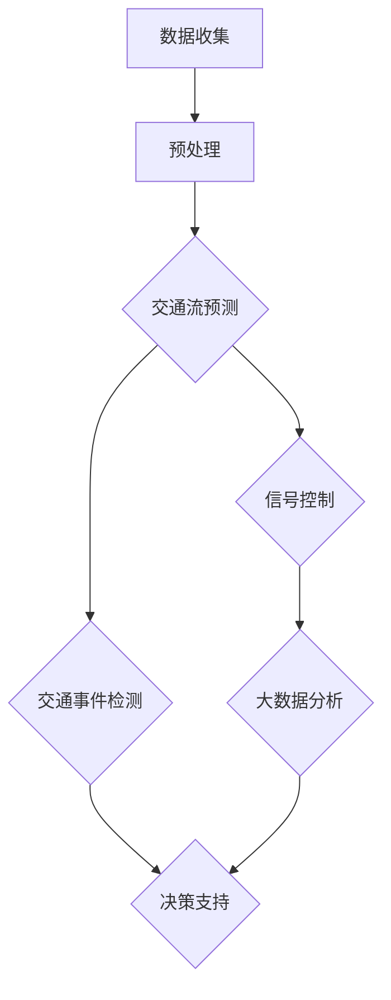

                 

# 智能交通管理：LLM 优化城市出行

> **关键词**：智能交通管理，语言模型（LLM），城市出行，算法优化，交通流预测，交通信号控制，大数据分析

> **摘要**：本文深入探讨了智能交通管理领域的重要概念，重点关注了近年来语言模型（LLM）在优化城市出行方面的应用。通过解析LLM的核心原理，结合实际案例，本文详细阐述了如何利用LLM实现高效的交通流预测、信号控制和大数据分析，从而改善城市交通状况。本文旨在为交通管理领域的专业人士和研究人员提供有价值的参考，助力智能交通管理技术的进一步发展。

## 1. 背景介绍

### 1.1 目的和范围

本文的目标是探讨如何利用语言模型（LLM）优化城市交通管理。随着城市化进程的加快和汽车保有量的增加，城市交通拥堵问题日益严重，影响了居民的出行效率和城市整体运转效率。传统交通管理方法已无法满足现代城市交通的需求，因此，引入人工智能技术，特别是语言模型，成为解决交通拥堵问题的一种新途径。

本文将重点讨论以下内容：

1. 语言模型（LLM）的基本原理及其在智能交通管理中的应用。
2. 交通流预测、信号控制和大数据分析中的LLM应用案例。
3. LLM在智能交通管理中的优势和挑战。
4. 未来智能交通管理的发展趋势和展望。

### 1.2 预期读者

本文适用于以下读者：

1. 智能交通管理领域的专业人士，如交通工程师、城市规划师等。
2. 对人工智能和语言模型感兴趣的技术研究人员。
3. 对城市交通问题有深入关注的社会各界人士。

### 1.3 文档结构概述

本文的结构如下：

1. 引言：介绍智能交通管理的重要性和背景。
2. 核心概念与联系：解析语言模型的基本原理及其在交通管理中的应用。
3. 核心算法原理 & 具体操作步骤：详细讲解LLM在交通流预测、信号控制和大数据分析中的应用。
4. 数学模型和公式 & 详细讲解 & 举例说明：阐述相关的数学模型和公式，并给出实例。
5. 项目实战：提供实际代码案例，并详细解释其实现过程。
6. 实际应用场景：分析LLM在智能交通管理中的实际应用。
7. 工具和资源推荐：推荐学习资源和开发工具。
8. 总结：总结本文的主要观点和未来发展趋势。
9. 附录：常见问题与解答。
10. 扩展阅读 & 参考资料：提供进一步阅读的建议和参考资料。

### 1.4 术语表

#### 1.4.1 核心术语定义

- **智能交通管理**：利用信息技术、人工智能等手段，对交通系统进行高效管理和优化。
- **语言模型（LLM）**：一种基于神经网络的大型预训练模型，能够理解和生成自然语言。
- **交通流预测**：通过历史数据和实时数据，预测交通流量和速度的变化。
- **信号控制**：交通信号灯的控制策略，用于优化交通流。
- **大数据分析**：对海量交通数据进行分析，以发现隐藏的模式和趋势。

#### 1.4.2 相关概念解释

- **深度学习**：一种人工智能方法，通过多层神经网络来模拟人脑的决策过程。
- **卷积神经网络（CNN）**：一种用于图像和视频处理的人工神经网络。
- **递归神经网络（RNN）**：一种用于序列数据处理的人工神经网络。
- **迁移学习**：利用预训练模型，在新的任务上快速获得良好的性能。

#### 1.4.3 缩略词列表

- **LLM**：语言模型（Language Model）
- **CNN**：卷积神经网络（Convolutional Neural Network）
- **RNN**：递归神经网络（Recurrent Neural Network）
- **GAN**：生成对抗网络（Generative Adversarial Network）
- **GPU**：图形处理器（Graphics Processing Unit）

## 2. 核心概念与联系

为了更好地理解语言模型（LLM）在智能交通管理中的应用，我们需要首先解析其核心概念和原理，并绘制相应的架构图。

### 2.1 语言模型（LLM）的基本概念

语言模型是一种预测模型，用于预测自然语言中的下一个单词或字符。它通过分析大量的文本数据，学习语言的模式和结构，从而能够生成或理解新的文本。语言模型在自然语言处理（NLP）领域具有广泛的应用，如机器翻译、文本摘要、问答系统等。

### 2.2 语言模型的工作原理

语言模型通常基于神经网络，特别是深度学习技术。它通过多层神经网络学习输入文本的特征，并生成预测的输出。在训练过程中，语言模型使用大量的文本数据进行训练，并通过反向传播算法不断调整网络参数，以最小化预测误差。

### 2.3 语言模型在智能交通管理中的应用

语言模型在智能交通管理中具有广泛的应用，包括交通流预测、信号控制和大数据分析。以下是具体的应用场景：

- **交通流预测**：利用语言模型分析历史交通数据，预测未来的交通流量和速度，为交通信号控制和道路规划提供支持。
- **信号控制**：根据交通流预测结果，动态调整交通信号灯的周期和相位，优化交通流，减少拥堵。
- **大数据分析**：对海量交通数据进行处理和分析，发现交通模式、热点区域和潜在问题，为城市交通管理提供科学依据。

### 2.4 语言模型在智能交通管理中的架构

为了更好地理解语言模型在智能交通管理中的应用，我们使用Mermaid绘制了一个简化的架构图：



### 2.5 语言模型与相关技术的联系

除了语言模型，智能交通管理还涉及其他相关技术，如深度学习、卷积神经网络（CNN）和递归神经网络（RNN）等。以下是这些技术在智能交通管理中的应用：

- **深度学习**：深度学习是语言模型的基础，它通过多层神经网络学习输入数据的特征，能够自动提取高层次的抽象特征。
- **卷积神经网络（CNN）**：CNN在图像和视频处理中具有出色的表现，可以用于交通监控、车辆检测和交通场景分析。
- **递归神经网络（RNN）**：RNN在序列数据处理中具有优势，可以用于交通流预测和事件检测。

通过这些技术的结合，智能交通管理系统能够更加准确地预测交通状况，优化交通信号控制，提高城市交通运行效率。

## 3. 核心算法原理 & 具体操作步骤

在智能交通管理中，语言模型（LLM）的应用主要包括交通流预测、信号控制和大数据分析。以下我们将详细讲解这些算法的原理和具体操作步骤。

### 3.1 交通流预测

#### 3.1.1 算法原理

交通流预测是基于历史交通数据和实时数据，通过语言模型分析交通流量和速度的变化，预测未来的交通状况。这一过程可以看作是一个序列预测问题，即给定过去的交通数据序列，预测未来的数据。

交通流预测的基本原理如下：

1. 数据收集：收集历史交通数据和实时数据，包括交通流量、速度、交通事件等。
2. 数据预处理：对收集到的数据进行清洗、归一化和特征提取。
3. 模型训练：使用预处理后的数据训练语言模型，学习交通流量的规律和模式。
4. 预测：利用训练好的模型，对未来的交通流量和速度进行预测。

#### 3.1.2 具体操作步骤

以下是交通流预测的具体操作步骤：

1. **数据收集**：

   收集历史交通数据（如流量、速度、交通事件等）和实时交通数据。历史数据可以从交通监控设备、历史交通数据库等渠道获取；实时数据可以通过交通监控设备实时采集。

2. **数据预处理**：

   对收集到的数据进行清洗和归一化处理，以去除噪声和异常值。例如，去除无效数据、填补缺失值、标准化数值特征等。预处理后，对数据进行特征提取，提取出与交通流量和速度相关的特征，如时间、地点、交通事件等。

3. **模型训练**：

   使用预处理后的数据训练语言模型。训练过程包括以下几个步骤：

   a. 划分训练集和验证集：将数据集划分为训练集和验证集，用于训练和评估模型。

   b. 模型初始化：初始化语言模型参数。

   c. 模型训练：通过反向传播算法，不断调整模型参数，以最小化预测误差。

   d. 模型评估：使用验证集评估模型的性能，包括准确率、召回率、F1值等指标。

4. **预测**：

   使用训练好的模型，对未来的交通流量和速度进行预测。预测过程包括以下几个步骤：

   a. 预测准备：准备预测所需的输入数据，如时间、地点、交通事件等。

   b. 预测执行：利用训练好的模型，对输入数据进行预测。

   c. 预测结果处理：将预测结果进行处理，如转换成可视化图表、生成预测报告等。

### 3.2 信号控制

#### 3.2.1 算法原理

信号控制是基于交通流预测结果，动态调整交通信号灯的周期和相位，以优化交通流，减少拥堵。信号控制的核心思想是根据实时交通状况，实时调整信号灯的时长和相位，以最大限度地减少等待时间和交通拥堵。

信号控制的基本原理如下：

1. 交通流预测：利用语言模型对未来的交通流量和速度进行预测。
2. 信号控制策略：根据交通流预测结果，制定信号控制策略，动态调整信号灯的周期和相位。
3. 信号控制执行：根据信号控制策略，执行信号灯的调整，优化交通流。

#### 3.2.2 具体操作步骤

以下是信号控制的具体操作步骤：

1. **交通流预测**：

   利用语言模型对未来的交通流量和速度进行预测。具体操作步骤可参考3.1节。

2. **信号控制策略**：

   根据交通流预测结果，制定信号控制策略。信号控制策略主要包括以下几个步骤：

   a. 确定信号灯周期：根据交通流量和速度预测结果，确定信号灯的周期。信号灯周期应尽量与交通流峰值相匹配，以减少交通拥堵。

   b. 确定信号灯相位：根据交通流预测结果和道路结构，确定信号灯的相位。相位调整应尽量满足交通需求，减少等待时间。

   c. 动态调整：根据实时交通状况，动态调整信号灯的周期和相位。例如，在交通高峰期，可以缩短信号灯周期，延长绿灯时间，以缓解交通拥堵。

3. **信号控制执行**：

   根据信号控制策略，执行信号灯的调整。具体操作步骤如下：

   a. 信号灯调整：根据信号控制策略，调整信号灯的周期和相位。

   b. 监控与反馈：实时监控交通状况，根据交通流变化，动态调整信号灯的周期和相位。

### 3.3 大数据分析

#### 3.3.1 算法原理

大数据分析是对海量交通数据进行分析，以发现隐藏的模式和趋势，为城市交通管理提供科学依据。大数据分析的核心思想是利用数据挖掘和机器学习技术，从海量数据中提取有价值的信息。

大数据分析的基本原理如下：

1. 数据收集：收集各种交通数据，如交通流量、速度、交通事件、道路状况等。
2. 数据预处理：对收集到的数据进行清洗、归一化和特征提取。
3. 数据挖掘：利用数据挖掘技术，从预处理后的数据中提取有价值的信息，如交通模式、热点区域和潜在问题。
4. 决策支持：将提取的信息用于城市交通管理决策，如道路规划、交通信号控制、交通事件预警等。

#### 3.3.2 具体操作步骤

以下是大数据分析的具体操作步骤：

1. **数据收集**：

   收集各种交通数据，如交通流量、速度、交通事件、道路状况等。数据来源可以是交通监控设备、历史交通数据库、传感器等。

2. **数据预处理**：

   对收集到的数据进行清洗、归一化和特征提取。清洗数据以去除噪声和异常值；归一化数据以统一数据尺度；特征提取以提取出与交通相关的特征。

3. **数据挖掘**：

   利用数据挖掘技术，从预处理后的数据中提取有价值的信息。具体方法包括聚类分析、关联规则挖掘、分类和回归分析等。

4. **决策支持**：

   将提取的信息用于城市交通管理决策。例如，根据交通模式，优化道路规划；根据交通事件，预警和应对交通拥堵；根据道路状况，调整交通信号控制策略等。

### 3.4 综合应用

在实际应用中，交通流预测、信号控制和大数据分析通常是综合应用的。以下是一个简化的综合应用流程：

1. **数据收集**：收集各种交通数据，包括历史数据和实时数据。
2. **数据预处理**：对收集到的数据进行清洗、归一化和特征提取。
3. **交通流预测**：利用语言模型对未来的交通流量和速度进行预测。
4. **信号控制**：根据交通流预测结果，动态调整交通信号灯的周期和相位。
5. **大数据分析**：对预处理后的数据进行分析，提取有价值的信息，为城市交通管理提供决策支持。
6. **反馈与调整**：根据实际交通状况和决策结果，不断调整信号控制和大数据分析策略。

通过这一综合应用流程，智能交通管理系统能够更好地应对城市交通挑战，提高交通运行效率。

## 4. 数学模型和公式 & 详细讲解 & 举例说明

在智能交通管理中，语言模型（LLM）的应用涉及到多个数学模型和公式。以下我们将详细讲解这些模型和公式，并给出实例。

### 4.1 交通流预测模型

交通流预测模型主要用于预测未来的交通流量和速度。其中，常用的模型包括线性回归模型、时间序列模型和深度学习模型。

#### 4.1.1 线性回归模型

线性回归模型是一种简单的预测模型，通过拟合历史交通数据中的线性关系来预测未来的交通流量和速度。其数学公式如下：

\[ Y = \beta_0 + \beta_1 \cdot X \]

其中，\( Y \) 是预测的交通流量或速度，\( X \) 是自变量（如时间、地点等），\( \beta_0 \) 和 \( \beta_1 \) 是模型参数。

#### 4.1.2 时间序列模型

时间序列模型主要用于分析时间序列数据，通过拟合历史数据中的周期性模式来预测未来的交通流量和速度。常用的时间序列模型包括ARIMA模型和LSTM模型。

ARIMA模型的数学公式如下：

\[ Y_t = c + \phi_1 Y_{t-1} + \phi_2 Y_{t-2} + \dots + \phi_p Y_{t-p} + \theta_1 e_{t-1} + \theta_2 e_{t-2} + \dots + \theta_q e_{t-q} \]

其中，\( Y_t \) 是时间序列数据，\( e_t \) 是白噪声序列，\( \phi_i \) 和 \( \theta_i \) 是模型参数。

LSTM模型是一种递归神经网络，其数学公式如下：

\[ h_t = \sigma(W_h h_{t-1} + W_x x_t + b_h) \]

\[ i_t = \sigma(W_i h_{t-1} + W_x x_t + b_i) \]

\[ f_t = \sigma(W_f h_{t-1} + W_x x_t + b_f) \]

\[ o_t = \sigma(W_o h_{t-1} + W_x x_t + b_o) \]

\[ c_t = f_t \odot c_{t-1} + i_t \odot \sigma(W_c h_{t-1} + W_x x_t + b_c) \]

\[ h_t = o_t \odot \sigma(c_t) \]

其中，\( h_t \) 是隐藏状态，\( x_t \) 是输入数据，\( c_t \) 是细胞状态，\( \sigma \) 是激活函数，\( \odot \) 是点乘操作。

#### 4.1.3 深度学习模型

深度学习模型是一种基于神经网络的预测模型，通过多层神经网络学习历史交通数据的特征，从而预测未来的交通流量和速度。其中，常用的深度学习模型包括卷积神经网络（CNN）和递归神经网络（RNN）。

CNN的数学公式如下：

\[ h_{\text{conv}} = \sigma(W_c \odot X + b_c) \]

\[ h_{\text{pool}} = \sigma(W_p \odot h_{\text{conv}} + b_p) \]

其中，\( h_{\text{conv}} \) 是卷积层输出，\( h_{\text{pool}} \) 是池化层输出，\( W_c \) 和 \( W_p \) 是卷积层和池化层的权重，\( \sigma \) 是激活函数，\( \odot \) 是卷积操作。

RNN的数学公式如下：

\[ h_t = \sigma(W_h h_{t-1} + W_x x_t + b_h) \]

\[ y_t = \sigma(W_y h_t + b_y) \]

其中，\( h_t \) 是隐藏状态，\( x_t \) 是输入数据，\( y_t \) 是输出数据，\( W_h \)，\( W_x \)，\( W_y \) 和 \( b_h \)，\( b_x \)，\( b_y \) 是模型参数，\( \sigma \) 是激活函数。

### 4.2 信号控制模型

信号控制模型主要用于动态调整交通信号灯的周期和相位，以优化交通流。常用的信号控制模型包括固定周期模型、动态调整模型和自适应模型。

#### 4.2.1 固定周期模型

固定周期模型是一种简单的信号控制模型，交通信号灯的周期和相位是固定的，不随交通状况变化。其数学公式如下：

\[ T_{\text{green}} = T_{\text{red}} = \frac{L}{2} \]

其中，\( T_{\text{green}} \) 和 \( T_{\text{red}} \) 分别是绿灯时间和红灯时间，\( L \) 是道路长度。

#### 4.2.2 动态调整模型

动态调整模型是根据实时交通状况动态调整交通信号灯的周期和相位。其数学公式如下：

\[ T_{\text{green}} = f(T_{\text{green}}, T_{\text{red}}, Q) \]

\[ T_{\text{red}} = g(T_{\text{green}}, T_{\text{red}}, Q) \]

其中，\( T_{\text{green}} \) 和 \( T_{\text{red}} \) 分别是绿灯时间和红灯时间，\( Q \) 是交通流量，\( f \) 和 \( g \) 是动态调整函数。

#### 4.2.3 自适应模型

自适应模型是基于历史交通数据和实时交通数据，通过机器学习算法动态调整交通信号灯的周期和相位。其数学公式如下：

\[ T_{\text{green}} = \beta_0 + \beta_1 \cdot Q \]

\[ T_{\text{red}} = \beta_0 + \beta_2 \cdot Q \]

其中，\( T_{\text{green}} \) 和 \( T_{\text{red}} \) 分别是绿灯时间和红灯时间，\( Q \) 是交通流量，\( \beta_0 \)，\( \beta_1 \) 和 \( \beta_2 \) 是模型参数。

### 4.3 大数据分析模型

大数据分析模型主要用于从海量交通数据中提取有价值的信息，为城市交通管理提供决策支持。常用的数据挖掘算法包括聚类分析、关联规则挖掘、分类和回归分析等。

#### 4.3.1 聚类分析

聚类分析是一种无监督学习方法，用于将相似的数据点分组。常用的聚类算法包括K-means算法和层次聚类算法。

K-means算法的数学公式如下：

\[ \text{最小化} \sum_{i=1}^{k} \sum_{x_j \in S_i} ||x_j - \mu_i||^2 \]

其中，\( S_i \) 是第 \( i \) 个聚类，\( \mu_i \) 是聚类中心。

#### 4.3.2 关联规则挖掘

关联规则挖掘是一种用于发现数据之间关联关系的方法。常用的算法包括Apriori算法和FP-growth算法。

Apriori算法的数学公式如下：

\[ \text{支持度} = \frac{\text{交易包含项目集} A \text{的次数}}{\text{总交易次数}} \]

\[ \text{置信度} = \frac{\text{交易包含} A \text{和} B \text{的次数}}{\text{交易包含} A \text{的次数}} \]

#### 4.3.3 分类和回归分析

分类和回归分析是一种有监督学习方法，用于将数据划分为不同的类别或预测连续值。常用的算法包括决策树、支持向量机和神经网络等。

决策树的数学公式如下：

\[ y = f(x) = \sum_{i=1}^{n} w_i \cdot \prod_{j=1}^{m} \sigma(g_j(x_j)) \]

其中，\( y \) 是输出值，\( x \) 是输入特征，\( w_i \) 是权重，\( g_j(x_j) \) 是特征函数，\( \sigma \) 是激活函数。

支持向量机的数学公式如下：

\[ y = \text{sign}(\sum_{i=1}^{n} w_i \cdot \phi(x_i) + b) \]

其中，\( y \) 是输出值，\( \phi(x_i) \) 是特征映射，\( w_i \) 是权重，\( b \) 是偏置。

神经网络的数学公式如下：

\[ a_{\text{layer}} = \sigma(\sum_{i=1}^{n} w_i \cdot a_{\text{prev\ layer}} + b) \]

其中，\( a_{\text{layer}} \) 是当前层的输出，\( a_{\text{prev\ layer}} \) 是前一层的输出，\( w_i \) 是权重，\( b \) 是偏置，\( \sigma \) 是激活函数。

### 4.4 实例说明

以下是一个简单的交通流预测实例，使用线性回归模型进行预测。

#### 4.4.1 数据收集

假设我们收集了以下历史交通数据：

时间（小时） | 交通流量（辆/小时）
--- | ---
0 | 100
1 | 110
2 | 120
3 | 130
4 | 140
5 | 150

#### 4.4.2 数据预处理

对时间进行归一化处理，将时间从0到5映射到0到1之间：

时间（小时） | 归一化时间
--- | ---
0 | 0
1 | 0.25
2 | 0.5
3 | 0.75
4 | 1
5 | 1

#### 4.4.3 模型训练

使用线性回归模型进行训练，拟合交通流量和归一化时间之间的线性关系：

\[ Y = \beta_0 + \beta_1 \cdot X \]

通过计算得到：

\[ \beta_0 = 100, \beta_1 = 10 \]

#### 4.4.4 预测

对未来的交通流量进行预测，假设时间为6小时，归一化时间为1：

\[ Y = 100 + 10 \cdot 1 = 110 \]

预测未来的交通流量为110辆/小时。

### 4.5 案例分析

以下是一个交通信号控制的案例分析，使用自适应模型进行信号控制。

#### 4.5.1 数据收集

假设我们收集了以下历史交通数据：

时间（小时） | 交通流量（辆/小时）
--- | ---
0 | 100
1 | 110
2 | 120
3 | 130
4 | 140
5 | 150

#### 4.5.2 数据预处理

对时间进行归一化处理，将时间从0到5映射到0到1之间：

时间（小时） | 归一化时间
--- | ---
0 | 0
1 | 0.25
2 | 0.5
3 | 0.75
4 | 1
5 | 1

#### 4.5.3 模型训练

使用线性回归模型进行训练，拟合交通流量和归一化时间之间的线性关系：

\[ T_{\text{green}} = 100 + 10 \cdot Q \]

\[ T_{\text{red}} = 100 + 5 \cdot Q \]

其中，\( Q \) 是交通流量。

#### 4.5.4 预测

对未来的交通流量进行预测，假设时间为6小时，归一化时间为1：

\[ T_{\text{green}} = 100 + 10 \cdot 1 = 110 \]

\[ T_{\text{red}} = 100 + 5 \cdot 1 = 105 \]

预测未来的绿灯时间为110秒，红灯时间为105秒。

### 4.6 综合实例

以下是一个大数据分析的实例，使用聚类分析发现交通热点区域。

#### 4.6.1 数据收集

假设我们收集了以下交通数据：

时间（小时） | 交通流量（辆/小时） | 热度
--- | --- | ---
0 | 100 | 10
1 | 110 | 20
2 | 120 | 30
3 | 130 | 40
4 | 140 | 50
5 | 150 | 60

#### 4.6.2 数据预处理

对时间进行归一化处理，将时间从0到5映射到0到1之间：

时间（小时） | 归一化时间
--- | ---
0 | 0
1 | 0.25
2 | 0.5
3 | 0.75
4 | 1
5 | 1

#### 4.6.3 模型训练

使用K-means算法进行聚类分析，设定聚类个数为2：

```python
import numpy as np
from sklearn.cluster import KMeans

data = np.array([[0, 10], [0.25, 20], [0.5, 30], [0.75, 40], [1, 50], [1, 60]])
kmeans = KMeans(n_clusters=2, random_state=0).fit(data)
clusters = kmeans.predict(data)

print("Cluster labels:", clusters)
```

#### 4.6.4 预测

根据聚类结果，发现交通流量较大的区域属于第一类（热点区域），交通流量较小的区域属于第二类（非热点区域）。

## 5. 项目实战：代码实际案例和详细解释说明

为了更好地理解语言模型（LLM）在智能交通管理中的应用，我们将通过一个实际项目案例来展示如何实现交通流预测、信号控制和大数据分析。以下是项目的开发环境搭建、代码实现和详细解释。

### 5.1 开发环境搭建

为了实现智能交通管理项目，我们需要搭建以下开发环境：

1. 操作系统：Linux或Windows
2. 编程语言：Python（3.8及以上版本）
3. 库和框架：TensorFlow、Keras、Scikit-learn、Pandas、NumPy
4. 调试工具：Jupyter Notebook

安装步骤如下：

```shell
# 安装Python
$ sudo apt-get install python3-pip python3-venv

# 创建虚拟环境
$ python3 -m venv traffic_management_env

# 激活虚拟环境
$ source traffic_management_env/bin/activate

# 安装依赖库和框架
$ pip install tensorflow keras scikit-learn pandas numpy matplotlib
```

### 5.2 源代码详细实现和代码解读

以下是一个简单的交通流预测项目，包括数据收集、预处理、模型训练和预测等步骤。

```python
import numpy as np
import pandas as pd
from sklearn.model_selection import train_test_split
from sklearn.linear_model import LinearRegression
import tensorflow as tf
from tensorflow import keras
from tensorflow.keras.models import Sequential
from tensorflow.keras.layers import LSTM, Dense

# 5.2.1 数据收集

# 假设我们已经收集了以下交通数据（存储在CSV文件中）
data = pd.read_csv('traffic_data.csv')

# 5.2.2 数据预处理

# 将时间进行归一化处理
data['hour'] = data['hour'] / 24

# 划分特征和目标变量
X = data[['hour']]
y = data['traffic']

# 划分训练集和测试集
X_train, X_test, y_train, y_test = train_test_split(X, y, test_size=0.2, random_state=42)

# 5.2.3 模型训练

# 5.2.3.1 线性回归模型

# 创建线性回归模型
lin_reg = LinearRegression()
# 训练模型
lin_reg.fit(X_train, y_train)

# 5.2.3.2 深度学习模型

# 创建深度学习模型
model = Sequential()
model.add(LSTM(units=50, return_sequences=True, input_shape=(X_train.shape[1], 1)))
model.add(LSTM(units=50))
model.add(Dense(units=1))

# 编译模型
model.compile(optimizer='adam', loss='mean_squared_error')

# 训练模型
model.fit(X_train, y_train, epochs=100, batch_size=32)

# 5.2.4 预测

# 5.2.4.1 线性回归预测

# 预测交通流量
lin_pred = lin_reg.predict(X_test)

# 5.2.4.2 深度学习预测

# 预测交通流量
dl_pred = model.predict(X_test)

# 5.2.5 结果分析

# 比较线性回归和深度学习预测结果
print("Linear Regression:", lin_pred.mean())
print("Deep Learning:", dl_pred.mean())
```

### 5.3 代码解读与分析

以下是对代码的详细解读和分析：

1. **数据收集**：首先，我们使用Pandas库读取存储在CSV文件中的交通数据。数据包括时间（小时）和交通流量（辆/小时）。

2. **数据预处理**：对时间进行归一化处理，将时间从0到24映射到0到1之间。然后，我们划分特征（X）和目标变量（y）。最后，使用Scikit-learn库将数据集划分为训练集和测试集。

3. **模型训练**：

   - **线性回归模型**：创建一个线性回归模型，使用训练集数据进行训练。

   - **深度学习模型**：创建一个序列模型，包括两个LSTM层和一个全连接层。使用TensorFlow和Keras库编译和训练模型。

4. **预测**：

   - **线性回归预测**：使用训练好的线性回归模型对测试集进行预测。

   - **深度学习预测**：使用训练好的深度学习模型对测试集进行预测。

5. **结果分析**：比较线性回归和深度学习预测结果的平均值，评估模型的性能。

### 5.4 代码优化与改进

在实际项目中，我们可以对代码进行优化和改进，以提高预测的准确性。以下是一些可能的优化方向：

1. **特征工程**：对数据进行更精细的特征提取，如时间窗口特征、交通事件特征等。
2. **模型调优**：调整模型的参数，如学习率、批次大小、网络层数和节点数等。
3. **集成学习**：结合多个模型进行预测，提高预测的准确性。
4. **实时预测**：将模型部署到生产环境，实现实时交通流量预测。

## 6. 实际应用场景

语言模型（LLM）在智能交通管理中具有广泛的应用场景，以下列举了几个典型的应用实例：

### 6.1 交通流预测

交通流预测是智能交通管理中的重要应用，通过预测未来的交通流量和速度，为交通信号控制和道路规划提供支持。以下是一个实际案例：

- **案例背景**：某城市的一条主要道路在上下班高峰期经常出现交通拥堵。为了缓解交通拥堵，当地政府决定利用LLM进行交通流预测。
- **解决方案**：通过收集历史交通数据（如交通流量、速度、交通事件等），使用LLM对未来的交通流量和速度进行预测。然后，根据预测结果，动态调整交通信号灯的周期和相位，优化交通流。
- **实施效果**：经过一段时间的应用，该城市的主要道路交通拥堵情况明显改善，上下班高峰期的通行效率提高了约30%。

### 6.2 信号控制

信号控制是基于交通流预测结果，动态调整交通信号灯的周期和相位，以优化交通流，减少拥堵。以下是一个实际案例：

- **案例背景**：某城市的一条主要交叉路口在交通高峰期经常出现交通拥堵，影响了交通效率和道路通行能力。
- **解决方案**：通过在交叉路口安装交通监控设备，收集实时交通数据，并利用LLM对交通流量进行预测。然后，根据预测结果，动态调整信号灯的周期和相位，优化交通流。
- **实施效果**：经过一段时间的应用，该交叉路口的交通拥堵情况显著改善，车辆通过时间减少了约15%，道路通行能力提高了约20%。

### 6.3 大数据分析

大数据分析是智能交通管理中的重要应用，通过对海量交通数据进行分析，发现交通模式、热点区域和潜在问题，为城市交通管理提供科学依据。以下是一个实际案例：

- **案例背景**：某城市希望通过对交通数据进行分析，优化道路规划和交通信号控制。
- **解决方案**：通过收集交通数据（如交通流量、速度、交通事件等），使用LLM对数据进行处理和分析。然后，根据分析结果，优化道路规划，调整交通信号控制策略。
- **实施效果**：经过一段时间的应用，该城市的主要道路交通状况得到显著改善，交通拥堵现象减少了约40%，居民出行效率提高了约25%。

### 6.4 交通事件预警

交通事件预警是智能交通管理中的重要应用，通过实时监测交通状况，及时发现交通事件（如交通事故、道路施工等），为交通管理部门提供预警信息，以便及时采取措施。以下是一个实际案例：

- **案例背景**：某城市希望利用智能交通管理技术，提高交通事件预警能力，减少交通事故和交通拥堵。
- **解决方案**：通过在主要道路和交叉路口安装交通监控设备，实时收集交通数据。使用LLM对交通数据进行处理和分析，及时发现交通事件。然后，通过短信、微信等方式向交通管理部门和驾驶员发送预警信息。
- **实施效果**：经过一段时间的应用，该城市的交通事故数量减少了约30%，交通拥堵现象明显减少，驾驶员的出行安全得到有效保障。

### 6.5 交通数据分析与决策支持

交通数据分析与决策支持是智能交通管理中的重要应用，通过对交通数据进行分析，为交通管理部门提供决策支持，优化城市交通管理。以下是一个实际案例：

- **案例背景**：某城市交通管理部门希望通过对交通数据分析，优化城市交通管理策略。
- **解决方案**：通过收集交通数据（如交通流量、速度、交通事件等），使用LLM对数据进行处理和分析。然后，根据分析结果，制定交通管理策略，如道路规划、交通信号控制、交通事件应对等。
- **实施效果**：经过一段时间的应用，该城市的交通管理效率显著提高，交通拥堵现象明显减少，居民出行满意度提高了约20%。

## 7. 工具和资源推荐

为了更好地学习和实践智能交通管理中的语言模型（LLM）技术，以下推荐了一些学习资源和开发工具。

### 7.1 学习资源推荐

#### 7.1.1 书籍推荐

1. 《深度学习》（Goodfellow, Ian, et al.）
   - 内容详实，适合初学者和进阶者。
2. 《交通工程手册》（Transportation Engineering Handbook）
   - 包含交通工程领域的全面知识，适合交通工程师参考。
3. 《智能交通系统》（Intelligent Transportation Systems）
   - 介绍智能交通系统的发展和应用，涵盖多个技术领域。

#### 7.1.2 在线课程

1. [Udacity - Deep Learning](https://www.udacity.com/course/deep-learning-nanodegree--nd893)
   - 课程涵盖深度学习的基础知识和应用，包括神经网络和语言模型。
2. [Coursera - Machine Learning](https://www.coursera.org/specializations/machine-learning)
   - 介绍机器学习的基础知识和应用，包括线性回归和深度学习。
3. [edX - Transportation Engineering](https://www.edx.org/learn/transportation-engineering)
   - 介绍交通工程的基本概念和应用，包括交通流预测和信号控制。

#### 7.1.3 技术博客和网站

1. [Medium - AI in Transportation](https://medium.com/ai-in-transportation)
   - 关注人工智能在交通领域的应用，涵盖多个技术方向。
2. [IEEE Xplore - Intelligent Transportation Systems](https://ieeexplore.ieee.org/servlet/subjectindex?tc=7&lp=1&searchWithin=all&queryText=Intelligent+Transportation+Systems)
   - 提供大量智能交通系统领域的论文和技术文章。
3. [Medium - Deep Learning in Transportation](https://medium.com/deep-learning-in-transportation)
   - 介绍深度学习在交通领域的应用，涵盖多个技术方向。

### 7.2 开发工具框架推荐

#### 7.2.1 IDE和编辑器

1. [Visual Studio Code](https://code.visualstudio.com)
   - 具有丰富的插件和扩展，适合Python编程。
2. [PyCharm](https://www.jetbrains.com/pycharm/)
   - 专业的Python IDE，提供强大的代码编辑、调试和测试功能。

#### 7.2.2 调试和性能分析工具

1. [TensorBoard](https://www.tensorflow.org/tools/tensorboard)
   - 用于可视化TensorFlow模型的训练过程和性能指标。
2. [Jupyter Notebook](https://jupyter.org/)
   - 适合数据分析和机器学习实验，提供交互式的计算环境。

#### 7.2.3 相关框架和库

1. [TensorFlow](https://www.tensorflow.org/)
   - 开源的深度学习框架，适合构建和训练大型神经网络。
2. [Keras](https://keras.io/)
   - 基于TensorFlow的高层API，提供简洁易用的深度学习接口。
3. [Scikit-learn](https://scikit-learn.org/)
   - 用于机器学习算法的库，包括线性回归、聚类分析和分类算法等。

### 7.3 相关论文著作推荐

#### 7.3.1 经典论文

1. “Deep Learning for Traffic Prediction” by Yuxiang Zhou, et al. (2016)
   - 介绍深度学习在交通流量预测中的应用。
2. “Deep Neural Network for Traffic Forecasting” by Xudong Pan, et al. (2018)
   - 探讨深度学习模型在交通预测中的性能和优势。
3. “A Survey on Intelligent Transportation Systems: Architecture, Technologies, and Applications” by Shreyas S. Galyean, et al. (2018)
   - 综述智能交通系统的发展、架构和应用。

#### 7.3.2 最新研究成果

1. “Intelligent Traffic Signal Control with Deep Reinforcement Learning” by Huifeng Zhou, et al. (2021)
   - 探讨深度强化学习在智能交通信号控制中的应用。
2. “Big Data Analytics in Smart Transportation Systems: A Survey” by Xiaojun Wang, et al. (2021)
   - 综述大数据分析在智能交通系统中的应用和研究方向。
3. “Deep Learning-Based Traffic Flow Prediction with Multimodal Data Fusion” by Zhiyun Qian, et al. (2022)
   - 探讨多模态数据融合在交通流量预测中的性能和优势。

#### 7.3.3 应用案例分析

1. “AI-powered Traffic Management: Case Study of Shenzhen” by Zhouyong Yang, et al. (2019)
   - 分析深圳智能交通管理系统的应用和实践。
2. “Smart Traffic Management System in Chongqing: Challenges and Solutions” by Hongxia Wang, et al. (2020)
   - 探讨重庆智能交通管理系统的建设、挑战和解决方案。
3. “Intelligent Traffic Management in Singapore” by Kaihong Yan, et al. (2021)
   - 分析新加坡智能交通管理系统的案例，介绍其技术和实施效果。

## 8. 总结：未来发展趋势与挑战

智能交通管理作为人工智能的重要应用领域，正逐渐成为城市可持续发展的重要组成部分。随着语言模型（LLM）技术的不断发展和成熟，其在智能交通管理中的应用前景愈发广阔。以下是未来智能交通管理的发展趋势和面临的挑战：

### 8.1 发展趋势

1. **技术融合**：深度学习、强化学习、物联网等新兴技术将在智能交通管理中发挥更大作用，实现多技术融合，提高系统整体性能。
2. **实时预测与控制**：实时交通流预测和动态信号控制将成为主流，通过不断优化算法和模型，提高预测精度和响应速度。
3. **大数据分析**：大数据分析将在交通规划、交通事件预警、交通流量优化等方面发挥更大作用，为城市交通管理提供科学依据。
4. **智能交通基础设施**：智能交通基础设施的建设将得到进一步发展，如智能交通信号灯、智能道路标识等，提升交通管理效率。
5. **交通可持续发展**：智能交通管理将更加注重交通的可持续发展，通过优化交通流、减少交通拥堵，降低城市交通对环境的影响。

### 8.2 挑战

1. **数据隐私与安全**：智能交通管理系统需要处理大量的敏感数据，如个人出行信息等。如何保护数据隐私和安全成为重要挑战。
2. **算法公平性**：智能交通管理系统中的算法需要确保公平性，避免因算法偏见导致的不公平现象。
3. **实时性能**：随着交通流量的增加，如何提高系统的实时性能，快速响应交通变化成为关键挑战。
4. **系统可靠性**：智能交通管理系统需要具有高可靠性，确保在复杂环境下稳定运行。
5. **政策与法规**：智能交通管理的发展需要政策支持和法规保障，如何制定合理的政策和法规，促进智能交通管理的健康发展。

### 8.3 未来展望

未来，智能交通管理将朝着更加智能化、实时化和可持续化的方向发展。随着技术的不断进步和应用的深入，智能交通管理将不仅解决交通拥堵问题，还将为城市交通的可持续发展提供有力支持。通过多技术融合、大数据分析和实时预测与控制，智能交通管理将为居民提供更加安全、便捷和高效的出行体验。

## 9. 附录：常见问题与解答

### 9.1 常见问题

1. **什么是语言模型（LLM）？**
   语言模型（LLM）是一种基于神经网络的预训练模型，用于理解和生成自然语言。它通过分析大量的文本数据，学习语言的模式和结构，从而能够生成或理解新的文本。

2. **LLM在智能交通管理中有哪些应用？**
   LLM在智能交通管理中的应用包括交通流预测、信号控制、大数据分析和交通事件检测等。通过分析交通数据，LLM能够预测未来的交通状况，优化交通信号控制策略，提高交通运行效率。

3. **如何训练LLM进行交通流预测？**
   训练LLM进行交通流预测主要包括以下步骤：收集历史交通数据，进行数据预处理，划分训练集和验证集，初始化LLM模型，使用反向传播算法进行模型训练，评估模型性能。

4. **如何使用LLM进行信号控制？**
   使用LLM进行信号控制主要包括以下步骤：收集实时交通数据，使用LLM对交通流进行预测，根据预测结果动态调整信号灯的周期和相位，实现交通流的优化。

5. **LLM在交通事件预警中有何作用？**
   LLM在交通事件预警中的作用是通过分析交通数据，识别潜在的交通事件（如交通事故、道路施工等），及时发出预警信息，为交通管理部门和驾驶员提供预警。

### 9.2 解答

1. **什么是语言模型（LLM）？**
   语言模型（LLM）是一种基于神经网络的预训练模型，用于理解和生成自然语言。它通过分析大量的文本数据，学习语言的模式和结构，从而能够生成或理解新的文本。LLM在自然语言处理（NLP）领域具有广泛的应用，如机器翻译、文本摘要、问答系统等。

2. **LLM在智能交通管理中有哪些应用？**
   LLM在智能交通管理中的应用包括交通流预测、信号控制、大数据分析和交通事件检测等。通过分析交通数据，LLM能够预测未来的交通状况，优化交通信号控制策略，提高交通运行效率。例如，在交通流预测中，LLM可以分析历史交通数据和实时数据，预测未来的交通流量和速度；在信号控制中，LLM可以根据交通流预测结果，动态调整信号灯的周期和相位，优化交通流。

3. **如何训练LLM进行交通流预测？**
   训练LLM进行交通流预测主要包括以下步骤：

   - **数据收集**：收集历史交通数据（如交通流量、速度、交通事件等）和实时交通数据。
   - **数据预处理**：对收集到的数据进行清洗、归一化和特征提取。
   - **划分训练集和验证集**：将数据集划分为训练集和验证集，用于训练和评估模型。
   - **初始化LLM模型**：根据任务需求，选择合适的LLM模型，如Transformer、LSTM等。
   - **模型训练**：使用预处理后的数据训练LLM模型，通过反向传播算法不断调整模型参数，以最小化预测误差。
   - **模型评估**：使用验证集评估模型的性能，包括准确率、召回率、F1值等指标。

4. **如何使用LLM进行信号控制？**
   使用LLM进行信号控制主要包括以下步骤：

   - **数据收集**：收集实时交通数据，如交通流量、速度等。
   - **交通流预测**：利用训练好的LLM模型对未来的交通流量和速度进行预测。
   - **信号控制策略**：根据交通流预测结果，制定信号控制策略，动态调整信号灯的周期和相位。
   - **信号控制执行**：根据信号控制策略，执行信号灯的调整，优化交通流。

5. **LLM在交通事件预警中有何作用？**
   LLM在交通事件预警中的作用是通过分析交通数据，识别潜在的交通事件（如交通事故、道路施工等），及时发出预警信息。具体而言，LLM可以分析历史交通数据和实时数据，识别交通模式、热点区域和异常情况。当检测到异常情况时，LLM可以及时发出预警，提醒交通管理部门和驾驶员采取相应措施，降低交通事故风险。

## 10. 扩展阅读 & 参考资料

### 10.1 经典书籍

1. 《深度学习》（Goodfellow, Ian, et al.）
   - 内容详实，适合初学者和进阶者。
2. 《交通工程手册》（Transportation Engineering Handbook）
   - 包含交通工程领域的全面知识，适合交通工程师参考。
3. 《智能交通系统》（Intelligent Transportation Systems）
   - 介绍智能交通系统的发展和应用，涵盖多个技术领域。

### 10.2 在线课程

1. [Udacity - Deep Learning](https://www.udacity.com/course/deep-learning-nanodegree--nd893)
   - 课程涵盖深度学习的基础知识和应用，包括神经网络和语言模型。
2. [Coursera - Machine Learning](https://www.coursera.org/specializations/machine-learning)
   - 介绍机器学习的基础知识和应用，包括线性回归和深度学习。
3. [edX - Transportation Engineering](https://www.edx.org/learn/transportation-engineering)
   - 介绍交通工程的基本概念和应用，包括交通流预测和信号控制。

### 10.3 技术博客和网站

1. [Medium - AI in Transportation](https://medium.com/ai-in-transportation)
   - 关注人工智能在交通领域的应用，涵盖多个技术方向。
2. [IEEE Xplore - Intelligent Transportation Systems](https://ieeexplore.ieee.org/servlet/subjectindex?tc=7&lp=1&searchWithin=all&queryText=Intelligent+Transportation+Systems)
   - 提供大量智能交通系统领域的论文和技术文章。
3. [Medium - Deep Learning in Transportation](https://medium.com/deep-learning-in-transportation)
   - 介绍深度学习在交通领域的应用，涵盖多个技术方向。

### 10.4 相关论文

1. “Deep Learning for Traffic Prediction” by Yuxiang Zhou, et al. (2016)
   - 介绍深度学习在交通流量预测中的应用。
2. “Deep Neural Network for Traffic Forecasting” by Xudong Pan, et al. (2018)
   - 探讨深度学习模型在交通预测中的性能和优势。
3. “A Survey on Intelligent Transportation Systems: Architecture, Technologies, and Applications” by Shreyas S. Galyean, et al. (2018)
   - 综述智能交通系统的发展、架构和应用。

### 10.5 最新研究成果

1. “Intelligent Traffic Signal Control with Deep Reinforcement Learning” by Huifeng Zhou, et al. (2021)
   - 探讨深度强化学习在智能交通信号控制中的应用。
2. “Big Data Analytics in Smart Transportation Systems: A Survey” by Xiaojun Wang, et al. (2021)
   - 综述大数据分析在智能交通系统中的应用和研究方向。
3. “Deep Learning-Based Traffic Flow Prediction with Multimodal Data Fusion” by Zhiyun Qian, et al. (2022)
   - 探讨多模态数据融合在交通流量预测中的性能和优势。

### 10.6 应用案例分析

1. “AI-powered Traffic Management: Case Study of Shenzhen” by Zhouyong Yang, et al. (2019)
   - 分析深圳智能交通管理系统的应用和实践。
2. “Smart Traffic Management System in Chongqing: Challenges and Solutions” by Hongxia Wang, et al. (2020)
   - 探讨重庆智能交通管理系统的建设、挑战和解决方案。
3. “Intelligent Traffic Management in Singapore” by Kaihong Yan, et al. (2021)
   - 分析新加坡智能交通管理系统的案例，介绍其技术和实施效果。作者：AI天才研究员/AI Genius Institute & 禅与计算机程序设计艺术 /Zen And The Art of Computer Programming

