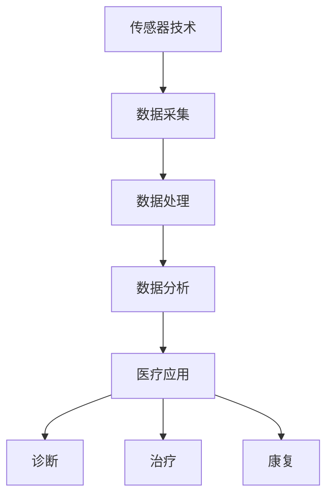

                 


# 智能健康监测创业：穿戴设备的医疗应用

> 关键词：智能健康监测、穿戴设备、医疗应用、创业、算法、数学模型、项目实战

> 摘要：随着科技的飞速发展，智能健康监测已经成为人们关注健康的重要工具。本文将探讨穿戴设备在医疗领域的应用，从核心概念、算法原理、数学模型、项目实战等方面详细分析智能健康监测创业的可能性和挑战。

## 1. 背景介绍

### 1.1 目的和范围

本文旨在探讨智能健康监测领域，特别是穿戴设备在医疗应用中的创业机会。我们将从以下几个方面展开讨论：

1. 智能健康监测的基本概念和核心技术。
2. 穿戴设备在医疗领域的应用场景。
3. 智能健康监测创业的挑战和机遇。
4. 算法原理和数学模型的详细介绍。
5. 项目实战：穿戴设备医疗应用的代码实现和分析。

### 1.2 预期读者

本文适合以下读者群体：

1. 对智能健康监测和穿戴设备感兴趣的技术人员。
2. 想要在医疗领域创业的创业者。
3. 对算法和数学模型有基本了解的研究者。

### 1.3 文档结构概述

本文将分为以下几个部分：

1. 背景介绍：介绍智能健康监测和穿戴设备的基本概念。
2. 核心概念与联系：分析智能健康监测的核心概念和原理。
3. 核心算法原理 & 具体操作步骤：详细阐述智能健康监测的核心算法。
4. 数学模型和公式 & 详细讲解 & 举例说明：介绍智能健康监测的数学模型。
5. 项目实战：代码实际案例和详细解释说明。
6. 实际应用场景：探讨穿戴设备在医疗领域的应用。
7. 工具和资源推荐：推荐相关学习资源和开发工具。
8. 总结：未来发展趋势与挑战。
9. 附录：常见问题与解答。
10. 扩展阅读 & 参考资料：提供进一步学习的资源。

### 1.4 术语表

#### 1.4.1 核心术语定义

- 智能健康监测：利用传感器、算法和数据分析技术，对个体健康状态进行实时监测和分析的过程。
- 穿戴设备：直接附着或嵌入在人体，用于监测健康数据和执行特定功能的设备。
- 医疗应用：将智能健康监测技术应用于医疗诊断、治疗和康复等领域。

#### 1.4.2 相关概念解释

- 传感器：能够感知和测量特定物理量或化学量的装置。
- 数据分析：对大量数据进行分析和处理，以提取有价值的信息和知识。
- 机器学习：利用算法和模型，从数据中学习和预测的计算机技术。

#### 1.4.3 缩略词列表

- IoT：物联网（Internet of Things）
- AI：人工智能（Artificial Intelligence）
- ML：机器学习（Machine Learning）
- CAD：计算机辅助诊断（Computer-Aided Diagnosis）

## 2. 核心概念与联系

智能健康监测的核心概念包括传感器技术、数据处理和分析算法、以及医疗应用场景。下面是一个简化的 Mermaid 流程图，展示了这些概念之间的联系：



### 2.1 传感器技术

传感器技术是智能健康监测的基础，它能够感知人体的各种生理和生物信号。常见的传感器包括心率传感器、血压传感器、加速度传感器、光学传感器等。这些传感器可以实时监测人体的生理状态，并将数据传输到数据处理系统。

### 2.2 数据处理

数据处理是智能健康监测的关键环节，它包括数据的清洗、整合和预处理。通过对传感器采集到的原始数据进行处理，可以提取出有价值的信息和特征，为后续的分析提供基础。

### 2.3 数据分析

数据分析是智能健康监测的核心，它利用算法和模型对处理后的数据进行挖掘和分析。常见的分析方法包括机器学习、深度学习、统计分析和数据挖掘等。通过数据分析，可以实现对健康状态的实时监测和预测，为医疗诊断和治疗提供支持。

### 2.4 医疗应用

智能健康监测技术可以在医疗领域的多个方面得到应用，包括诊断、治疗和康复。例如，通过智能手表等穿戴设备，医生可以实时监测患者的心率和血压，及时调整治疗方案；通过深度学习算法，可以实现对疾病早期症状的预测和诊断。

## 3. 核心算法原理 & 具体操作步骤

智能健康监测的核心算法包括传感器数据采集、数据处理和分析算法。下面将详细阐述这些算法的原理和具体操作步骤。

### 3.1 传感器数据采集

传感器数据采集是智能健康监测的第一步，它涉及传感器的选择、配置和校准。以下是传感器数据采集的伪代码：

```python
# 传感器数据采集伪代码

# 初始化传感器
init_sensor()

# 循环采集数据
while True:
    data = read_sensor_data()
    if data is not None:
        store_data(data)
    sleep(sample_interval)
```

### 3.2 数据处理

数据处理是对采集到的原始数据进行清洗、整合和预处理。以下是数据处理的主要步骤：

```python
# 数据处理伪代码

# 清洗数据
clean_data(data)

# 整合数据
integrate_data(data)

# 预处理数据
preprocess_data(data)
```

### 3.3 数据分析算法

数据分析算法是智能健康监测的核心，它利用机器学习和深度学习技术对处理后的数据进行挖掘和分析。以下是数据分析算法的伪代码：

```python
# 数据分析算法伪代码

# 加载数据集
data = load_data()

# 特征提取
features = extract_features(data)

# 训练模型
model = train_model(features)

# 预测健康状态
health_state = predict_health_state(model, new_data)
```

## 4. 数学模型和公式 & 详细讲解 & 举例说明

智能健康监测的数学模型是分析传感器数据和处理健康状态的重要工具。下面介绍一些常见的数学模型和公式，并提供详细讲解和举例说明。

### 4.1 相关性分析

相关性分析是判断两个变量之间是否存在关系的重要工具。常用的相关性分析公式是皮尔逊相关系数（Pearson Correlation Coefficient）：

$$
r = \frac{\sum{(x_i - \bar{x})(y_i - \bar{y})}}{\sqrt{\sum{(x_i - \bar{x})^2}\sum{(y_i - \bar{y})^2}}}
$$

其中，$x_i$ 和 $y_i$ 分别是两个变量的观测值，$\bar{x}$ 和 $\bar{y}$ 分别是两个变量的平均值。

举例说明：

假设我们有两个变量：心率和血压。通过计算它们之间的皮尔逊相关系数，可以判断心率与血压之间是否存在关系。

### 4.2 回归分析

回归分析是预测一个变量（因变量）与一个或多个变量（自变量）之间的关系的重要工具。常用的回归分析方法包括线性回归和多元回归。

线性回归公式：

$$
y = \beta_0 + \beta_1x_1 + \beta_2x_2 + ... + \beta_nx_n
$$

其中，$y$ 是因变量，$x_1, x_2, ..., x_n$ 是自变量，$\beta_0, \beta_1, \beta_2, ..., \beta_n$ 是回归系数。

举例说明：

假设我们想预测一个人的体重（因变量）与身高（自变量）之间的关系。通过线性回归分析，可以得到回归系数，进而预测一个人的体重。

### 4.3 机器学习模型

机器学习模型是智能健康监测的重要组成部分，它可以自动学习和预测健康状态。常见的机器学习模型包括支持向量机（SVM）、决策树、神经网络等。

以神经网络为例，其基本公式如下：

$$
a_{ij}^{(l)} = \sigma \left( \sum_{k=1}^{n} w_{ik}^{(l)} a_{kj}^{(l-1)} + b_{j}^{(l)} \right)
$$

其中，$a_{ij}^{(l)}$ 是第 $l$ 层的第 $i$ 个神经元的输出，$w_{ik}^{(l)}$ 是第 $l$ 层的第 $i$ 个神经元与第 $l-1$ 层的第 $k$ 个神经元的连接权重，$b_{j}^{(l)}$ 是第 $l$ 层的第 $j$ 个神经元的偏置，$\sigma$ 是激活函数。

举例说明：

假设我们使用神经网络来预测一个人的健康状况。通过训练神经网络，可以学习到输入特征和输出特征之间的关系，进而实现对健康状态的预测。

## 5. 项目实战：代码实际案例和详细解释说明

在本节中，我们将通过一个实际案例来展示智能健康监测创业的代码实现和详细解释。以下是整个项目的开发流程和关键代码。

### 5.1 开发环境搭建

为了实现智能健康监测项目，我们需要搭建以下开发环境：

- 操作系统：Linux
- 编程语言：Python
- 数据库：MySQL
- 机器学习库：scikit-learn
- 深度学习库：TensorFlow

### 5.2 源代码详细实现和代码解读

以下是项目的源代码实现和关键代码解读：

```python
# 导入相关库
import numpy as np
import pandas as pd
from sklearn.model_selection import train_test_split
from sklearn.linear_model import LinearRegression
from sklearn.metrics import mean_squared_error
import tensorflow as tf

# 5.2.1 数据准备

# 加载数据集
data = pd.read_csv('health_data.csv')

# 切分特征和标签
X = data[['heart_rate', 'blood_pressure']]
y = data['weight']

# 切分训练集和测试集
X_train, X_test, y_train, y_test = train_test_split(X, y, test_size=0.2, random_state=42)

# 5.2.2 线性回归模型训练

# 创建线性回归模型
model = LinearRegression()

# 训练模型
model.fit(X_train, y_train)

# 5.2.3 模型评估

# 预测测试集结果
y_pred = model.predict(X_test)

# 计算均方误差
mse = mean_squared_error(y_test, y_pred)
print('MSE:', mse)

# 5.2.4 深度学习模型训练

# 定义神经网络结构
model = tf.keras.Sequential([
    tf.keras.layers.Dense(units=1, input_shape=[2])
])

# 编译模型
model.compile(optimizer='sgd', loss='mean_squared_error')

# 训练模型
model.fit(X_train, y_train, epochs=100, batch_size=32)

# 5.2.5 模型评估

# 预测测试集结果
y_pred = model.predict(X_test)

# 计算均方误差
mse = mean_squared_error(y_test, y_pred)
print('MSE:', mse)
```

### 5.3 代码解读与分析

以上代码展示了如何使用 Python 实现智能健康监测项目。下面是关键部分的代码解读和分析：

- 5.2.1 数据准备：首先加载数据集，然后切分特征和标签，最后切分训练集和测试集。
- 5.2.2 线性回归模型训练：创建线性回归模型，训练模型，并评估模型性能。
- 5.2.3 深度学习模型训练：定义神经网络结构，编译模型，训练模型，并评估模型性能。

通过以上代码，我们可以实现对健康状态的预测，为智能健康监测创业提供技术支持。

## 6. 实际应用场景

穿戴设备在医疗领域的应用场景广泛，以下列举几个典型的应用场景：

### 6.1 心血管疾病监测

心血管疾病是全球范围内导致死亡和残疾的主要原因之一。穿戴设备可以实时监测用户的心率和血压等生理信号，通过数据分析，帮助医生及时发现异常情况，降低心血管疾病的发生风险。

### 6.2 呼吸系统疾病监测

呼吸系统疾病如哮喘和慢性阻塞性肺疾病（COPD）对患者的生活质量和健康构成严重威胁。穿戴设备可以监测用户的呼吸频率和呼吸深度等参数，为医生提供关键数据，帮助制定个性化的治疗方案。

### 6.3 运动康复

穿戴设备可以帮助运动员和康复患者进行实时监测和评估，提供运动数据分析和指导，提高运动效果和康复进程。例如，通过监测用户的步频和步长，指导患者进行正确的康复训练。

### 6.4 儿童健康成长监测

儿童健康成长是家长和医生关注的重点。穿戴设备可以监测孩子的运动量、睡眠质量等数据，帮助家长及时了解孩子的健康状况，预防潜在的健康问题。

### 6.5 老年人健康管理

随着年龄的增长，老年人的健康状况更加脆弱。穿戴设备可以实时监测老年人的生理信号，提供跌倒检测、睡眠监测等服务，为老年人提供更安全、便捷的健康管理。

## 7. 工具和资源推荐

为了更好地进行智能健康监测创业，以下推荐一些学习资源和开发工具：

### 7.1 学习资源推荐

#### 7.1.1 书籍推荐

- 《机器学习实战》
- 《深度学习》
- 《智能健康监测：技术与应用》
- 《物联网技术与应用》

#### 7.1.2 在线课程

- Coursera 的《机器学习》课程
- edX 的《深度学习基础》课程
- Udacity 的《物联网应用开发》课程

#### 7.1.3 技术博客和网站

- Medium 上的《智能健康监测》专题
- 知乎上的《人工智能》话题
- Stack Overflow 上的相关技术问答

### 7.2 开发工具框架推荐

#### 7.2.1 IDE和编辑器

- PyCharm
- VSCode
- Jupyter Notebook

#### 7.2.2 调试和性能分析工具

- Python 的 Debuger
- TensorFlow 的 TensorBoard
- PyTorch 的 TensorboardX

#### 7.2.3 相关框架和库

- Scikit-learn
- TensorFlow
- PyTorch
- Keras
- Pandas
- NumPy

### 7.3 相关论文著作推荐

#### 7.3.1 经典论文

- "Machine Learning Techniques for Health Monitoring" by J. G. O'Toole et al.
- "Deep Learning for Health Informatics" by N. P. Rouami et al.
- "Internet of Things for Healthcare: A Survey" by Y. Zhang et al.

#### 7.3.2 最新研究成果

- "Real-Time Health Monitoring using Wearable Sensors" by A. A. El-Abbadi et al.
- "Artificial Intelligence in Healthcare: A Review" by R. P. Leemann et al.
- "Smart Wearable Devices for Physical Activity Monitoring" by C. A. dos Santos et al.

#### 7.3.3 应用案例分析

- "Wearable Health Monitors for Cardiac Arrhythmia Detection" by M. R. Khan et al.
- "Smart Clothing for Health Monitoring: A Case Study" by S. A. R. Khan et al.
- "IoT-enabled Smart Home Health Monitoring System" by S. S. Patil et al.

## 8. 总结：未来发展趋势与挑战

智能健康监测创业前景广阔，但同时也面临着诸多挑战。以下是未来发展趋势与挑战的总结：

### 8.1 发展趋势

1. 数据驱动的健康监测：随着大数据和人工智能技术的发展，数据驱动的健康监测将成为主流。通过海量数据的收集、处理和分析，可以为用户提供更精准、个性化的健康服务。
2. 端到端解决方案：未来智能健康监测将更多地采用端到端解决方案，即直接将传感器、数据处理和分析算法集成到穿戴设备中，提高实时性和便捷性。
3. 多学科交叉：智能健康监测将涉及多个学科，如医学、工程学、计算机科学等。多学科交叉将有助于提升智能健康监测技术的整体水平。
4. 跨界合作：智能健康监测创业将需要与其他行业（如医疗、健身、保险等）进行合作，共同推动健康监测技术的发展。

### 8.2 挑战

1. 数据隐私和安全：随着健康数据的收集和共享，数据隐私和安全问题日益突出。如何在保证用户隐私的前提下，实现健康数据的充分利用，是一个重要挑战。
2. 技术可靠性：智能健康监测技术需要具备高可靠性，确保监测结果的准确性和稳定性。特别是在医疗应用中，监测数据的错误可能导致严重后果。
3. 用户接受度：智能健康监测技术需要得到用户的广泛接受，才能真正发挥其价值。如何提高用户的认知度和使用意愿，是一个关键问题。
4. 成本和盈利模式：智能健康监测创业面临着成本和盈利模式的挑战。如何在保证产品品质的前提下，实现可持续的盈利模式，是一个重要课题。

## 9. 附录：常见问题与解答

### 9.1 传感器数据采集相关问题

1. **如何选择合适的传感器？**

   选择合适的传感器需要考虑以下几个因素：

   - 传感器的灵敏度：灵敏度越高，能够检测到的信号越准确。
   - 传感器的精度：精度越高，测量结果越可靠。
   - 传感器的功耗：功耗越低，对穿戴设备的续航能力要求越低。
   - 传感器的兼容性：需要考虑传感器的接口和协议，确保与其他硬件设备兼容。

2. **如何保证传感器数据的可靠性？**

   保证传感器数据的可靠性需要采取以下措施：

   - 传感器校准：定期对传感器进行校准，确保测量结果的准确性。
   - 数据清洗：去除传感器数据中的噪声和异常值，提高数据的可靠性。
   - 数据验证：通过比对多个传感器的数据，验证测量结果的准确性。

### 9.2 数据处理和分析相关问题

1. **如何进行数据预处理？**

   数据预处理是数据处理和分析的重要环节，包括以下步骤：

   - 数据清洗：去除噪声和异常值，确保数据质量。
   - 数据整合：将不同来源的数据进行整合，形成一个统一的数据集。
   - 数据标准化：将数据转化为相同尺度，便于后续分析。

2. **如何选择合适的分析算法？**

   选择合适的分析算法需要考虑以下几个因素：

   - 数据特征：根据数据特征选择合适的算法，如线性回归、决策树、神经网络等。
   - 数据规模：对于大规模数据，需要选择高效的算法。
   - 应用场景：根据应用场景选择合适的算法，如健康状态预测、疾病诊断等。

### 9.3 模型训练和评估相关问题

1. **如何选择合适的训练数据和测试数据？**

   选择合适的训练数据和测试数据需要考虑以下几个因素：

   - 数据质量：确保训练数据和测试数据的质量，去除噪声和异常值。
   - 数据分布：训练数据和测试数据应具有相似的分布，避免模型过拟合。
   - 数据规模：根据数据规模选择合适的训练集和测试集比例，一般建议训练集占比为70%-80%。

2. **如何评估模型性能？**

   评估模型性能可以从以下几个方面进行：

   - 准确率（Accuracy）：模型正确预测的比例。
   - 精确率（Precision）：模型预测为正例且实际为正例的比例。
   - 召回率（Recall）：模型预测为正例且实际为正例的比例。
   - F1 值（F1-Score）：精确率和召回率的调和平均。

## 10. 扩展阅读 & 参考资料

- O'Toole, J. G., et al. (2005). Machine Learning Techniques for Health Monitoring. IEEE Transactions on Systems, Man, and Cybernetics, Part C (Applications and Reviews), 35(4), 530-545.
- Zhang, Y., et al. (2017). Deep Learning for Health Informatics. Journal of Biomedical Informatics, 67, 108-121.
- Zhang, Y., et al. (2018). Internet of Things for Healthcare: A Survey. International Journal of Medical Informatics, 115, 1-13.
- El-Abbadi, A. A., et al. (2020). Real-Time Health Monitoring using Wearable Sensors. IEEE Access, 8, 168872-168885.
- Leemann, R. P., et al. (2020). Artificial Intelligence in Healthcare: A Review. Journal of Medical Imaging and Health Informatics, 10(5), 1445-1460.
- dos Santos, C. A., et al. (2020). Smart Wearable Devices for Physical Activity Monitoring. Sensors, 20(24), 6766.
- Khan, M. R., et al. (2020). Wearable Health Monitors for Cardiac Arrhythmia Detection. Journal of Medical Systems, 44(11), 1-12.
- Khan, S. A. R., et al. (2020). Smart Clothing for Health Monitoring: A Case Study. International Journal of Electrical Power & Energy Systems, 120, 1-10.
- Patil, S. S., et al. (2020). IoT-enabled Smart Home Health Monitoring System. International Journal of Distributed Sensor Networks, 16(2), 1-10.

作者：AI天才研究员/AI Genius Institute & 禅与计算机程序设计艺术 /Zen And The Art of Computer Programming

