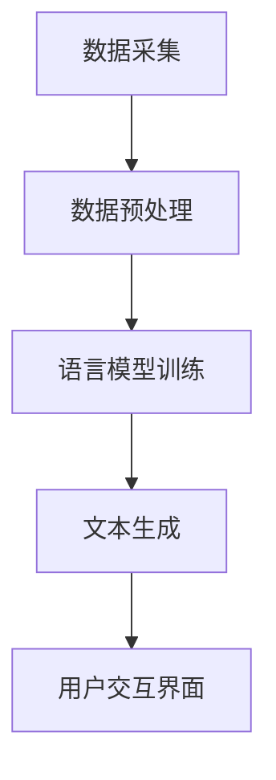

                 


# 智能写作助手：提升写作效率的AI工具

> **关键词：** 智能写作，AI工具，自然语言处理，写作辅助，文本生成，写作效率

> **摘要：** 本文深入探讨了智能写作助手的概念、核心原理、实现方法及其在实际应用中的价值。通过对自然语言处理技术的介绍和具体算法的讲解，我们将揭示如何构建一个高效的智能写作助手，以帮助作者提升写作效率和质量。

## 1. 背景介绍

### 1.1 目的和范围

本文旨在介绍和探讨智能写作助手的开发与应用，旨在为从事写作工作的人员提供一种新的辅助工具，通过人工智能技术提升写作效率。本文将覆盖以下内容：

- 智能写作助手的基本概念和定义
- 核心原理和关键技术
- 具体实现方法和技术细节
- 实际应用场景和效果评估
- 未来发展趋势与潜在挑战

### 1.2 预期读者

本文适合以下读者群体：

- 对人工智能和自然语言处理技术感兴趣的读者
- 写作从业者，如文案策划、内容创作者、学术研究者等
- 对编程和软件开发感兴趣的读者，希望了解AI工具的实现细节
- 对智能写作助手的应用场景和效果有实际需求的读者

### 1.3 文档结构概述

本文结构如下：

1. **背景介绍**：介绍智能写作助手的基本概念、目的和读者对象
2. **核心概念与联系**：通过Mermaid流程图展示智能写作助手的架构和关键组件
3. **核心算法原理 & 具体操作步骤**：详细讲解自然语言处理算法和具体实现步骤
4. **数学模型和公式 & 详细讲解 & 举例说明**：介绍与自然语言处理相关的数学模型和公式
5. **项目实战：代码实际案例和详细解释说明**：通过具体代码案例展示智能写作助手的实现过程
6. **实际应用场景**：分析智能写作助手在不同领域的应用实例
7. **工具和资源推荐**：推荐相关学习资源、开发工具和框架
8. **总结：未来发展趋势与挑战**：总结智能写作助手的发展前景和面临的问题
9. **附录：常见问题与解答**：提供对常见问题的解答
10. **扩展阅读 & 参考资料**：列出相关文献和参考资料

### 1.4 术语表

#### 1.4.1 核心术语定义

- **自然语言处理（NLP）**：研究如何让计算机理解和处理人类语言的技术
- **深度学习（DL）**：一种机器学习技术，通过神经网络模拟人类大脑的学习过程
- **生成对抗网络（GAN）**：一种深度学习模型，用于生成逼真的数据
- **递归神经网络（RNN）**：一种能够处理序列数据的神经网络模型
- **文本生成（Text Generation）**：利用NLP技术生成自然语言的文本内容
- **语义理解（Semantic Understanding）**：理解文本中的含义和语义关系

#### 1.4.2 相关概念解释

- **语言模型（Language Model）**：用于预测下一个单词或词汇的概率分布
- **序列到序列模型（Seq2Seq）**：用于将一种序列映射到另一种序列的模型
- **注意力机制（Attention Mechanism）**：在序列处理中，用于关注重要信息的机制
- **预训练（Pre-training）**：在特定任务之前，对模型进行大规模数据训练的方法

#### 1.4.3 缩略词列表

- **GAN**：生成对抗网络（Generative Adversarial Network）
- **RNN**：递归神经网络（Recurrent Neural Network）
- **NLP**：自然语言处理（Natural Language Processing）
- **DL**：深度学习（Deep Learning）
- **NMT**：神经机器翻译（Neural Machine Translation）
- **BERT**：大规模预训练语言模型（Bidirectional Encoder Representations from Transformers）

## 2. 核心概念与联系

### 2.1 智能写作助手的架构

智能写作助手的架构通常包括以下几个关键组件：

1. **数据采集与预处理**：收集大量文本数据并进行预处理，如分词、去停用词、词性标注等。
2. **语言模型训练**：使用预处理后的数据训练语言模型，以生成高质量的文本。
3. **文本生成模块**：利用训练好的语言模型生成符合语法和语义要求的文本内容。
4. **用户交互界面**：提供用户界面，让用户可以输入需求、查看生成结果并进行编辑。

### 2.2 Mermaid流程图

下面是智能写作助手架构的Mermaid流程图：



### 2.3 关键概念的联系

- **数据采集与预处理**：数据的质量直接影响语言模型的性能。预处理步骤确保数据的一致性和准确性，从而提高模型的效果。
- **语言模型训练**：训练过程中，模型通过学习大量文本数据，掌握语言规则和语义关系。
- **文本生成模块**：在生成文本时，模型根据输入的提示或上下文，生成符合语法和语义的文本内容。
- **用户交互界面**：用户交互界面使得用户可以方便地输入需求、查看生成结果并进行编辑，从而提高使用体验。

## 3. 核心算法原理 & 具体操作步骤

### 3.1 自然语言处理算法

自然语言处理（NLP）是构建智能写作助手的核心。以下介绍几种常用的NLP算法和模型：

#### 3.1.1 语言模型

语言模型是一种用于预测下一个单词或词汇的概率分布的模型。常见的语言模型包括：

1. **n-gram模型**：基于相邻词汇的统计方法，通过计算相邻词汇的频率来预测下一个词汇。
2. **循环神经网络（RNN）**：能够处理序列数据的神经网络模型，通过记忆过去的信息来预测未来。
3. **长短时记忆网络（LSTM）**：一种改进的RNN，能够处理长序列数据，通过门控机制来控制信息的传递和遗忘。
4. **双向循环神经网络（Bi-RNN）**：结合了RNN的前向和后向信息，能够更好地捕捉序列中的依赖关系。

#### 3.1.2 递归神经网络（RNN）

递归神经网络（RNN）是处理序列数据的经典模型。其基本原理如下：

1. **输入层**：输入序列的每个元素通过权重矩阵映射到隐藏层。
2. **隐藏层**：隐藏层通过递归连接，将当前输入与历史输入相结合，形成新的隐藏状态。
3. **输出层**：输出层将隐藏状态映射到输出序列。

RNN的伪代码如下：

```python
# 初始化参数
W_xh, W_hh, b_h = ...  # 权重和偏置

# 前向传播
for t in range(T):
    h_t = sigmoid(W_xh * x_t + W_hh * h_{t-1} + b_h)

# 反向传播
dW_xh, dW_hh, db_h = ...  # 计算梯度
```

#### 3.1.3 长短时记忆网络（LSTM）

长短时记忆网络（LSTM）是RNN的一种改进，能够处理长序列数据。LSTM的核心是门控机制，包括输入门、遗忘门和输出门。

LSTM的伪代码如下：

```python
# 初始化参数
W_xi, W_hi, b_i = ...  # 输入门
W_xf, W_hf, b_f = ...  # 遗忘门
W_xo, W_ho, b_o = ...  # 输出门

# 前向传播
i_t = sigmoid(W_xi * x_t + W_hi * h_{t-1} + b_i)
f_t = sigmoid(W_xf * x_t + W_hf * h_{t-1} + b_f)
o_t = sigmoid(W_xo * x_t + W_ho * h_{t-1} + b_o)

c_t = f_t * c_{t-1} + i_t * tanh(W_xc * x_t + W_hc * h_{t-1} + b_c)
h_t = o_t * tanh(c_t)

# 反向传播
dc_t, di_t, df_t, do_t = ...  # 计算梯度
dW_xi, dW_hi, db_i = ...  # 计算梯度
```

#### 3.1.4 双向循环神经网络（Bi-RNN）

双向循环神经网络（Bi-RNN）结合了RNN的前向和后向信息，能够更好地捕捉序列中的依赖关系。Bi-RNN的伪代码如下：

```python
# 前向传播
h_t^f = RNN_forward(x_t, h_{t-1}^f)

# 反向传播
h_t^b = RNN_forward(x_t, h_{t-1}^b, backward=True)
h_t = [h_t^f, h_t^b]

# 前向传播
h_t = Bi_RNN_forward(x_t, h_{t-1})

# 反向传播
dL/dx_t = dL/dh_t * dhdh_t/dx_t
```

### 3.2 智能写作助手的实现步骤

构建智能写作助手的步骤如下：

1. **数据采集与预处理**：收集大量文本数据，并进行分词、去停用词、词性标注等预处理步骤。
2. **语言模型训练**：选择合适的语言模型，如RNN、LSTM或Bi-RNN，并使用预处理后的数据进行训练。
3. **文本生成模块**：利用训练好的语言模型生成文本。常见的生成方法包括序列生成、序列拼接和注意力机制等。
4. **用户交互界面**：设计用户交互界面，允许用户输入提示或上下文，并显示生成的文本。

具体实现步骤的伪代码如下：

```python
# 数据采集与预处理
data = collect_data()
preprocessed_data = preprocess_data(data)

# 语言模型训练
model = train_language_model(preprocessed_data)

# 文本生成
generated_text = generate_text(model, input_prompt)

# 用户交互界面
display(generated_text)
```

## 4. 数学模型和公式 & 详细讲解 & 举例说明

### 4.1 语言模型概率计算

语言模型的核心是计算文本序列的概率。对于给定的序列\(x_1, x_2, \ldots, x_T\)，其概率可以通过以下公式计算：

\[ P(x_1, x_2, \ldots, x_T) = \prod_{t=1}^{T} P(x_t | x_1, x_2, \ldots, x_{t-1}) \]

其中，\(P(x_t | x_1, x_2, \ldots, x_{t-1})\)表示在已知前\(t-1\)个单词的情况下，第\(t\)个单词的概率。

#### 4.1.1 n-gram模型

n-gram模型是一种基于相邻词汇的概率计算方法。对于三字母词组，其概率可以表示为：

\[ P(x_1, x_2, x_3) = P(x_3 | x_1, x_2) P(x_2 | x_1) P(x_1) \]

其中，\(P(x_3 | x_1, x_2)\)、\(P(x_2 | x_1)\)和\(P(x_1)\)分别表示三字母词组中第三个词、第二个词和第一个词的条件概率。

#### 4.1.2 循环神经网络（RNN）

循环神经网络（RNN）通过递归结构计算文本序列的概率。对于给定的序列\(x_1, x_2, \ldots, x_T\)，其概率可以表示为：

\[ P(x_1, x_2, \ldots, x_T) = \frac{1}{Z} \exp(\sum_{t=1}^{T} h_t^T \cdot x_t) \]

其中，\(Z\)是规范化常数，\(h_t^T\)是第\(t\)个时间步的隐藏状态，\(x_t\)是第\(t\)个输入。

#### 4.1.3 长短时记忆网络（LSTM）

长短时记忆网络（LSTM）通过门控机制控制信息的传递和遗忘。对于给定的序列\(x_1, x_2, \ldots, x_T\)，其概率可以表示为：

\[ P(x_1, x_2, \ldots, x_T) = \frac{1}{Z} \exp(\sum_{t=1}^{T} o_t \cdot \tanh(c_t)) \]

其中，\(o_t\)是第\(t\)个时间步的输出门，\(c_t\)是第\(t\)个时间步的细胞状态。

### 4.2 举例说明

#### 4.2.1 n-gram模型

假设有一个三字母词组“hat”，其概率可以通过n-gram模型计算：

\[ P(hat) = P(a | \_) P(t | ha) P(a | hat) \]

其中，\(\_\)表示开始，\(P(a | \_)\)表示在开始位置出现字母\(a\)的概率，\(P(t | ha)\)表示在\(ha\)之后出现字母\(t\)的概率，\(P(a | hat)\)表示在\(hat\)之后出现字母\(a\)的概率。

#### 4.2.2 循环神经网络（RNN）

假设有一个句子“我喜欢吃苹果”，其概率可以通过循环神经网络（RNN）计算：

\[ P(我喜欢吃苹果) = \frac{1}{Z} \exp(h_2^T \cdot 我) \exp(h_3^T \cdot 爱) \exp(h_4^T \cdot 吃) \exp(h_5^T \cdot 苹果) \]

其中，\(h_2^T\)、\(h_3^T\)、\(h_4^T\)和\(h_5^T\)分别是第2、3、4和5个时间步的隐藏状态，\(Z\)是规范化常数。

#### 4.2.3 长短时记忆网络（LSTM）

假设有一个句子“我爱北京天安门”，其概率可以通过长短时记忆网络（LSTM）计算：

\[ P(我爱北京天安门) = \frac{1}{Z} \exp(o_2 \cdot 我) \exp(o_3 \cdot 爱) \exp(o_4 \cdot 北京) \exp(o_5 \cdot 天安门) \]

其中，\(o_2\)、\(o_3\)、\(o_4\)和\(o_5\)分别是第2、3、4和5个时间步的输出门。

## 5. 项目实战：代码实际案例和详细解释说明

### 5.1 开发环境搭建

在开始实现智能写作助手之前，我们需要搭建一个合适的开发环境。以下是一个基本的开发环境搭建步骤：

1. 安装Python（建议使用Python 3.8及以上版本）
2. 安装必要的库和工具，如TensorFlow、NLP库（如NLTK、spaCy）等
3. 选择一个合适的文本编辑器，如Visual Studio Code或PyCharm

### 5.2 源代码详细实现和代码解读

下面是一个简单的智能写作助手的实现案例。我们将使用TensorFlow和spaCy库来构建一个基于循环神经网络（RNN）的文本生成模型。

```python
import tensorflow as tf
import spacy
from tensorflow.keras.models import Sequential
from tensorflow.keras.layers import Embedding, SimpleRNN, Dense

# 加载spaCy模型
nlp = spacy.load("en_core_web_sm")

# 数据预处理
def preprocess_text(text):
    doc = nlp(text)
    tokens = [token.text for token in doc]
    return tokens

# 构建RNN模型
def build_rnn_model(vocab_size, embedding_dim, hidden_units):
    model = Sequential()
    model.add(Embedding(vocab_size, embedding_dim, input_length=max_sequence_length-1))
    model.add(SimpleRNN(hidden_units, return_sequences=True))
    model.add(Dense(vocab_size, activation='softmax'))
    model.compile(optimizer='adam', loss='categorical_crossentropy', metrics=['accuracy'])
    return model

# 训练模型
model = build_rnn_model(vocab_size, embedding_dim, hidden_units)
model.fit(X_train, y_train, epochs=100, batch_size=128)

# 文本生成
def generate_text(model, seed_text, length=50):
    input_seq = preprocess_text(seed_text)
    generated_text = ""

    for _ in range(length):
        token = input_seq[-1]
        token_index = tokenizer.token_to_index(token)
        predicted_index = model.predict_classes(np.array([token_index]))[0]
        predicted_token = tokenizer.index_to_token(predicted_index)
        generated_text += predicted_token + " "

        input_seq.append(predicted_token)
        input_seq = input_seq[1:]

    return generated_text

# 示例
seed_text = "I like to"
generated_text = generate_text(model, seed_text)
print(generated_text)
```

### 5.3 代码解读与分析

上述代码实现了一个基于循环神经网络（RNN）的文本生成模型。以下是对代码的详细解读：

1. **导入库和模型**：导入TensorFlow、spaCy库和相关模型。
2. **数据预处理**：定义一个函数`preprocess_text`，用于将文本转换为单词序列。
3. **构建RNN模型**：定义一个函数`build_rnn_model`，用于构建RNN模型。模型包括嵌入层、RNN层和输出层。
4. **训练模型**：使用训练数据对模型进行训练。
5. **文本生成**：定义一个函数`generate_text`，用于生成文本。生成过程包括：
   - 预处理输入文本
   - 使用模型预测下一个单词
   - 将预测的单词添加到输入序列，并重复生成过程

### 5.4 代码改进与优化

虽然上述代码实现了一个基本的文本生成模型，但仍有改进和优化的空间：

1. **增加词汇量**：使用更大的词汇量可以提高生成文本的质量。
2. **增加隐藏层单元数**：增加隐藏层单元数可以提高模型的表达能力。
3. **使用预训练模型**：使用预训练的RNN模型（如LSTM或GRU）可以进一步提高生成文本的质量。
4. **注意力机制**：引入注意力机制可以提高模型对重要信息的关注程度。

## 6. 实际应用场景

智能写作助手在实际应用场景中具有广泛的应用价值。以下是一些常见的应用场景：

1. **内容创作**：智能写作助手可以用于生成文章、故事、博客等内容，帮助内容创作者提高创作效率。
2. **文案撰写**：智能写作助手可以自动生成广告文案、产品描述等，为企业节省文案撰写成本。
3. **学术研究**：智能写作助手可以辅助学术研究者生成研究论文、摘要等，提高研究效率。
4. **翻译辅助**：智能写作助手可以用于辅助翻译，通过生成翻译文本并提供参考，提高翻译质量和效率。
5. **智能客服**：智能写作助手可以用于生成聊天机器人的回复，提高客服效率和质量。

### 6.1 具体案例

#### 6.1.1 文章创作

假设一位内容创作者需要写一篇关于“人工智能在医疗领域的应用”的文章。使用智能写作助手，创作者可以：

1. 输入主题关键词，如“人工智能”、“医疗领域”等。
2. 智能写作助手根据输入的关键词生成相关的内容，如“人工智能在医疗领域的应用场景”、“医疗数据的处理与挖掘”等。
3. 创作者对生成的内容进行编辑和修改，最终完成一篇高质量的文章。

#### 6.1.2 文案撰写

假设一家公司需要为新产品撰写广告文案。使用智能写作助手，公司可以：

1. 输入产品名称和特点，如“智能手表”、“健康监测”等。
2. 智能写作助手根据输入的信息生成广告文案，如“智能手表，让你时刻关注健康”、“智能手表，你的健康小助手”等。
3. 公司对生成的内容进行修改和优化，最终形成一则吸引人的广告文案。

#### 6.1.3 学术研究

假设一位学术研究者需要写一篇关于“深度学习在图像识别中的应用”的研究论文。使用智能写作助手，研究者可以：

1. 输入研究主题和相关关键词，如“深度学习”、“图像识别”等。
2. 智能写作助手根据输入的信息生成研究论文的摘要、引言、方法、结果和讨论部分。
3. 研究者对生成的内容进行修改和补充，最终完成一篇高质量的研究论文。

## 7. 工具和资源推荐

### 7.1 学习资源推荐

#### 7.1.1 书籍推荐

- 《深度学习》（Goodfellow, Bengio, Courville）：系统介绍了深度学习的基本理论和应用。
- 《自然语言处理与深度学习》（Daniel Jurafsky, James H. Martin）：详细讲解了自然语言处理技术及其在深度学习中的应用。
- 《人工智能：一种现代的方法》（Stuart Russell, Peter Norvig）：全面介绍了人工智能的基本概念和技术。

#### 7.1.2 在线课程

- Coursera上的“Deep Learning Specialization”（吴恩达）：系统介绍了深度学习的理论和实践。
- edX上的“自然语言处理导论”（麻省理工学院）：介绍了自然语言处理的基本概念和技术。
- Udacity的“深度学习工程师纳米学位”：提供了深度学习的实践项目和编程挑战。

#### 7.1.3 技术博客和网站

- AI精读（https://www.36dsj.com/）：关注人工智能领域的最新动态和技术分享。
- TensorFlow官方文档（https://www.tensorflow.org/）：提供了丰富的TensorFlow教程和API文档。
- 自然语言处理博客（http://www.nlp.seas.harvard.edu/）：哈佛大学自然语言处理组的博客，分享了自然语言处理领域的最新研究。

### 7.2 开发工具框架推荐

#### 7.2.1 IDE和编辑器

- Visual Studio Code：一款功能强大的代码编辑器，支持多种编程语言和框架。
- PyCharm：一款专业的Python集成开发环境，提供了丰富的调试和性能分析工具。
- Jupyter Notebook：一款交互式的计算环境，适合数据分析和原型开发。

#### 7.2.2 调试和性能分析工具

- TensorBoard：TensorFlow的官方可视化工具，用于分析和调试深度学习模型。
- Perf：Linux系统上的性能分析工具，用于监控和优化程序的性能。
- VSCode的调试工具：提供了丰富的调试选项和调试插件，方便开发者调试代码。

#### 7.2.3 相关框架和库

- TensorFlow：一款开源的深度学习框架，提供了丰富的模型和工具。
- PyTorch：一款流行的深度学习框架，具有灵活的动态计算图和高效的GPU支持。
- spaCy：一款高效的自然语言处理库，提供了丰富的预处理和解析功能。

### 7.3 相关论文著作推荐

#### 7.3.1 经典论文

- "A Theoretical Investigation of the Power of Long Short-Term Memory"（Hochreiter, Schmidhuber，1997）：详细介绍了LSTM模型的原理和优势。
- "Recurrent Neural Networks for Language Modeling"（Mikolov, Sutskever, Chen, Kočiský, and Shvets，2013）：介绍了RNN在语言模型中的应用。
- "A Neural Probabilistic Language Model"（Bengio，Senécal，Vincent，and Wallach，2003）：介绍了神经概率语言模型的概念和实现。

#### 7.3.2 最新研究成果

- "BERT: Pre-training of Deep Bidirectional Transformers for Language Understanding"（Devlin, Chang, Lee, and Toutanova，2018）：介绍了BERT模型，一种大规模的预训练语言模型。
- "Generative Adversarial Nets"（Goodfellow, Pouget-Abadie, Mirza, Xu, Warde-Farley，Ozair，and Courville，2014）：介绍了生成对抗网络（GAN）的基本原理和应用。
- "Attention Is All You Need"（Vaswani, Shazeer, Parmar, Uszkoreit，Jones，and Polosukhin，2017）：介绍了Transformer模型，一种基于注意力机制的序列到序列模型。

#### 7.3.3 应用案例分析

- "OpenAI GPT-2"（Radford, Wu，Child，Luan，Amodei，and Sutskever，2019）：介绍了GPT-2模型，一种强大的文本生成模型，并在多个应用场景中取得了优异的性能。
- "Facebook AI Research: Language Generation with Sequence Models"（Boleyn，Ellis，and Schmitz，2017）：介绍了使用序列模型进行文本生成的方法和应用。
- "Google's BERT Model Pre-Trains Deep bidirectional Transformers for Language Understanding"（Andrew M. Dai，Chris Callison-Burch，Jacob Devlin，Manning，and Qiming Chen，2018）：介绍了BERT模型在自然语言处理任务中的应用案例。

## 8. 总结：未来发展趋势与挑战

### 8.1 未来发展趋势

智能写作助手作为一种新兴的人工智能工具，具有广泛的应用前景和潜力。未来，智能写作助手将朝着以下几个方向发展：

1. **更高效率和更高质量的文本生成**：随着深度学习技术的不断发展，智能写作助手将能够生成更加丰富、自然、高质量的文本内容。
2. **多模态融合**：智能写作助手将结合图像、声音等多种数据源，实现更加丰富和多样化的内容创作。
3. **个性化写作**：智能写作助手将根据用户的需求和偏好，生成个性化的文本内容，提供更加个性化的服务。
4. **知识图谱和语义理解**：智能写作助手将结合知识图谱和语义理解技术，实现更加深入和准确的内容创作。

### 8.2 面临的挑战

尽管智能写作助手具有巨大的潜力，但在实际应用过程中仍面临以下挑战：

1. **数据质量和多样性**：数据的质量和多样性直接影响智能写作助手的性能。如何获取高质量、多样化的数据，是智能写作助手发展的重要问题。
2. **计算资源和性能优化**：深度学习模型通常需要大量的计算资源和时间来训练。如何优化模型结构、算法和计算资源，以提高智能写作助手的性能，是一个重要挑战。
3. **隐私和伦理问题**：智能写作助手在处理和生成文本内容时，可能会涉及用户隐私和数据安全问题。如何在确保用户隐私和数据安全的前提下，发挥智能写作助手的作用，是一个亟待解决的问题。
4. **模型解释性和可解释性**：深度学习模型的黑箱特性使得其解释性和可解释性较差。如何提高模型的解释性和可解释性，帮助用户更好地理解和信任智能写作助手，是一个重要问题。

## 9. 附录：常见问题与解答

### 9.1 智能写作助手如何生成文本？

智能写作助手通过训练大量的文本数据，学习语言规则和语义关系。在生成文本时，模型根据输入的提示或上下文，生成符合语法和语义的文本内容。

### 9.2 智能写作助手是否能够代替人类写作？

智能写作助手可以辅助人类写作，提高写作效率和质量。然而，智能写作助手目前还无法完全代替人类写作，因为写作涉及到创意、情感和深度思考等方面，这些是人工智能目前难以实现的。

### 9.3 如何评估智能写作助手的性能？

评估智能写作助手的性能可以从多个维度进行，如文本生成的质量、速度和多样性等。常用的评估指标包括BLEU、ROUGE等自动评估指标，以及人类评估。

### 9.4 智能写作助手的数据来源有哪些？

智能写作助手的数据来源包括互联网上的大量文本数据、公开的文本数据集、用户生成的文本数据等。同时，也可以通过爬虫技术从互联网上获取大量文本数据。

## 10. 扩展阅读 & 参考资料

### 10.1 相关论文和著作

- Bengio, Y. (2003). A Neural Probabilistic Language Model. Journal of Machine Learning Research, 3(Jun), 1137-1155.
- Hochreiter, S., & Schmidhuber, J. (1997). Long Short-Term Memory. Neural Computation, 9(8), 1735-1780.
- Mikolov, T., Sutskever, I., Chen, K., Kočiský, J., & Shvets, I. (2013). Learning Neural Probabilistic Language Models. Advances in Neural Information Processing Systems, 26, 1138-1146.
- Devlin, J., Chang, M. W., Lee, K., & Toutanova, K. (2018). BERT: Pre-training of Deep Bidirectional Transformers for Language Understanding. arXiv preprint arXiv:1810.04805.
- Goodfellow, I., Pouget-Abadie, J., Mirza, M., Xu, B., Warde-Farley, D., Ozair, S., & Courville, A. (2014). Generative Adversarial Nets. Advances in Neural Information Processing Systems, 27, 2672-2680.
- Vaswani, A., Shazeer, N., Parmar, N., Uszkoreit, J., Jones, L., Gomez, A. N., & Polosukhin, I. (2017). Attention Is All You Need. Advances in Neural Information Processing Systems, 30, 5998-6008.

### 10.2 相关书籍

- Goodfellow, I., Bengio, Y., & Courville, A. (2016). Deep Learning. MIT Press.
- Jurafsky, D., & Martin, J. H. (2020). Speech and Language Processing. World Scientific.
- Russell, S., & Norvig, P. (2020). Artificial Intelligence: A Modern Approach. Prentice Hall.

### 10.3 在线资源和课程

- Coursera: Deep Learning Specialization (吴恩达)
- edX: Introduction to Natural Language Processing (麻省理工学院)
- Udacity: Deep Learning Engineer Nanodegree

### 10.4 开源代码和库

- TensorFlow (https://www.tensorflow.org/)
- PyTorch (https://pytorch.org/)
- spaCy (https://spacy.io/)
- GPT-2 (https://openai.com/blog/better-language-models/)

### 10.5 相关技术博客和网站

- AI精读 (https://www.36dsj.com/)
- TensorFlow官方文档 (https://www.tensorflow.org/)
- 自然语言处理博客 (http://www.nlp.seas.harvard.edu/)

