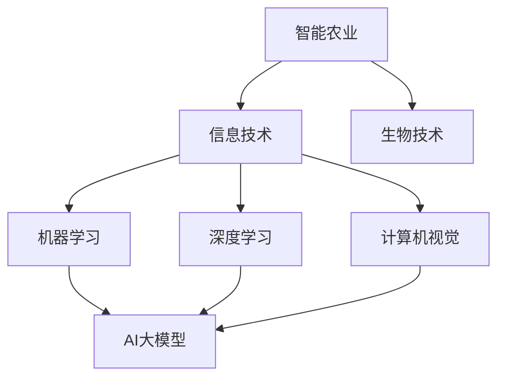

                 


# 智能农业中的AI大模型应用机会

> 关键词：智能农业，AI大模型，机器学习，深度学习，计算机视觉，精准农业
>
> 摘要：本文将深入探讨智能农业中AI大模型的应用机会。通过对智能农业背景、AI大模型的基本原理和具体应用场景的详细分析，我们旨在揭示AI大模型在智能农业中的巨大潜力，并展望其未来的发展趋势与挑战。

## 1. 背景介绍

### 1.1 目的和范围

本文旨在探讨AI大模型在智能农业中的应用，通过分析其原理和具体案例，揭示AI大模型如何助力智能农业的发展。本文将涵盖以下几个方面的内容：

- 智能农业的现状和发展趋势
- AI大模型的基本概念和原理
- AI大模型在智能农业中的应用场景
- 案例分析：成功应用AI大模型的智能农业项目
- AI大模型在智能农业中的未来发展趋势与挑战

### 1.2 预期读者

本文适合以下读者群体：

- 智能农业领域的从业者
- AI领域的研究者
- 对智能农业和AI技术感兴趣的技术爱好者
- 农业行业的管理者和决策者

### 1.3 文档结构概述

本文结构如下：

- 第1部分：背景介绍，包括目的、范围、预期读者和文档结构概述
- 第2部分：核心概念与联系，介绍智能农业和AI大模型的基本概念和原理
- 第3部分：核心算法原理 & 具体操作步骤，讲解AI大模型的具体算法和操作步骤
- 第4部分：数学模型和公式 & 详细讲解 & 举例说明，介绍AI大模型的数学模型和具体应用案例
- 第5部分：项目实战：代码实际案例和详细解释说明，展示AI大模型在智能农业中的实际应用案例
- 第6部分：实际应用场景，分析AI大模型在智能农业中的实际应用场景
- 第7部分：工具和资源推荐，推荐相关学习资源和开发工具
- 第8部分：总结：未来发展趋势与挑战，展望AI大模型在智能农业中的未来发展
- 第9部分：附录：常见问题与解答，解答读者可能遇到的问题
- 第10部分：扩展阅读 & 参考资料，提供相关扩展阅读和参考资料

### 1.4 术语表

#### 1.4.1 核心术语定义

- 智能农业：利用现代信息技术和生物技术，对农业生产过程进行实时监控、管理和优化，实现农业生产的智能化、精准化和可持续化。
- AI大模型：具有大规模参数和强大计算能力的机器学习模型，如深度学习模型，可以处理大规模数据和复杂任务。
- 机器学习：一种人工智能技术，通过训练模型从数据中学习规律和模式，实现智能决策和预测。

#### 1.4.2 相关概念解释

- 精准农业：利用传感器、遥感技术和地理信息系统等手段，对农田进行实时监测和精准管理，提高农业生产效率。
- 计算机视觉：使计算机能够像人类一样理解、解释和响应视觉信息的技术。

#### 1.4.3 缩略词列表

- AI：人工智能
- ML：机器学习
- DL：深度学习
- CV：计算机视觉
- GPS：全球定位系统
- GIS：地理信息系统

## 2. 核心概念与联系

为了更好地理解智能农业和AI大模型之间的关系，我们需要首先了解它们的核心概念和原理。以下是一个简化的Mermaid流程图，用于展示智能农业、AI大模型和相关技术的联系。



在这个流程图中，智能农业与信息技术、生物技术密切相关。信息技术为智能农业提供了数据采集、处理和分析的能力，而生物技术则帮助提高作物品质和产量。机器学习、深度学习和计算机视觉作为人工智能的核心技术，为智能农业提供了智能决策、精准管理和智能监控的手段。AI大模型则是这些技术的综合体现，具有强大的计算能力和数据学习能力，能够处理大规模数据和复杂任务。

### 2.1 智能农业的核心概念和原理

智能农业是指利用现代信息技术和生物技术，对农业生产过程进行实时监控、管理和优化，实现农业生产的智能化、精准化和可持续化。智能农业的核心概念包括以下几个方面：

- 数据采集：利用传感器、遥感技术和地理信息系统等手段，对农田、作物和环境进行实时监测和采集数据。
- 数据处理：对采集到的数据进行预处理、清洗和整合，形成统一的数据格式。
- 智能分析：利用机器学习、深度学习和计算机视觉等技术，对处理后的数据进行分析，提取有用信息和规律。
- 智能决策：根据分析结果，为农业生产提供智能化的决策建议，如作物种植、灌溉、施肥和病虫害防治等。

### 2.2 AI大模型的核心概念和原理

AI大模型是指具有大规模参数和强大计算能力的机器学习模型，如深度学习模型。AI大模型的核心概念和原理包括以下几个方面：

- 深度学习：一种机器学习技术，通过模拟人脑神经网络结构，对大量数据进行自动特征提取和学习。
- 大规模参数：AI大模型具有数十亿甚至千亿级的参数，可以处理大规模数据和复杂任务。
- 数据学习能力：AI大模型通过训练模型，从数据中学习规律和模式，实现智能决策和预测。

### 2.3 智能农业与AI大模型的联系

智能农业与AI大模型之间的联系主要体现在以下几个方面：

- 数据驱动：智能农业依赖于大量的数据采集和处理，AI大模型可以高效地处理这些数据，为农业生产提供智能化的决策支持。
- 精准管理：AI大模型可以帮助农民实现精准农业，通过分析作物生长数据和环境信息，提供个性化的种植和管理建议。
- 智能监控：AI大模型可以实时监控农田状况，及时发现病虫害、干旱等异常情况，为农民提供及时的预警信息。

## 3. 核心算法原理 & 具体操作步骤

在本部分，我们将详细讲解AI大模型在智能农业中的应用原理和具体操作步骤。为了更好地理解，我们采用伪代码的形式来描述算法步骤。

### 3.1 数据采集和处理

```python
# 数据采集
def data_collection():
    # 使用传感器采集土壤湿度、温度、pH值等数据
    soil_data = collect_soil_data()
    # 使用遥感技术采集作物生长状态、病虫害等信息
    crop_data = collect_crop_data()
    # 使用气象站采集气温、降雨量等气象数据
    weather_data = collect_weather_data()

# 数据预处理
def data_preprocessing(data):
    # 清洗数据，去除异常值和噪声
    cleaned_data = clean_data(data)
    # 数据整合，将不同来源的数据进行整合，形成统一的数据格式
    integrated_data = integrate_data(cleaned_data)
    return integrated_data
```

### 3.2 特征提取和模型训练

```python
# 特征提取
def feature_extraction(data):
    # 从数据中提取关键特征，如土壤湿度、作物生长状态等
    features = extract_features(data)
    return features

# 模型训练
def model_training(features, labels):
    # 使用深度学习模型进行训练
    model = train_model(features, labels)
    return model
```

### 3.3 预测和决策

```python
# 预测
def prediction(model, new_data):
    # 使用训练好的模型对新数据进行预测
    prediction = model.predict(new_data)
    return prediction

# 决策
def decision(prediction):
    # 根据预测结果，为农业生产提供决策建议
    if prediction == '正常':
        action = '继续当前管理'
    elif prediction == '干旱':
        action = '增加灌溉'
    elif prediction == '病虫害':
        action = '进行病虫害防治'
    return action
```

通过上述伪代码，我们可以看到AI大模型在智能农业中的应用流程：首先进行数据采集和处理，然后进行特征提取和模型训练，最后进行预测和决策。这个过程实现了从数据到知识的转化，为农业生产提供了智能化的决策支持。

## 4. 数学模型和公式 & 详细讲解 & 举例说明

在本部分，我们将详细介绍AI大模型在智能农业中的应用所涉及的数学模型和公式，并通过具体例子进行说明。

### 4.1 深度学习模型

深度学习模型是AI大模型的核心，其基本原理是通过多层神经网络对输入数据进行特征提取和模式识别。以下是一个简化的深度学习模型结构：

```latex
\begin{align*}
h_{\text{layer1}} &= \sigma(W_1 \cdot x + b_1) \\
h_{\text{layer2}} &= \sigma(W_2 \cdot h_{\text{layer1}} + b_2) \\
\vdots \\
h_{\text{output}} &= \sigma(W_n \cdot h_{\text{layer(n-1)}} + b_n)
\end{align*}
```

其中，\( h_{\text{layeri}} \)表示第\( i \)层的输出，\( \sigma \)表示激活函数（如ReLU函数），\( W_i \)和\( b_i \)分别为第\( i \)层的权重和偏置。

### 4.2 损失函数

深度学习模型训练过程中，常用的损失函数包括均方误差（MSE）、交叉熵（CE）等。以下是一个均方误差损失函数的例子：

```latex
\begin{align*}
L &= \frac{1}{2} \sum_{i=1}^{n} (y_i - \hat{y}_i)^2 \\
  &= \frac{1}{2} \sum_{i=1}^{n} (y_i - \sigma(W_n \cdot h_{\text{layer(n-1)}} + b_n))^2
\end{align*}
```

其中，\( y_i \)为真实标签，\( \hat{y}_i \)为预测标签，\( \sigma \)表示激活函数。

### 4.3 优化算法

在深度学习模型训练过程中，常用的优化算法包括梯度下降（GD）、随机梯度下降（SGD）和Adam等。以下是一个简化的梯度下降优化算法：

```latex
\begin{align*}
\theta &= \theta - \alpha \cdot \nabla_{\theta} L(\theta) \\
        &= \theta - \alpha \cdot \frac{\partial L}{\partial \theta}
\end{align*}
```

其中，\( \theta \)为模型参数，\( \alpha \)为学习率，\( \nabla_{\theta} L(\theta) \)为损失函数关于参数\( \theta \)的梯度。

### 4.4 举例说明

假设我们使用一个简单的深度学习模型对作物生长状态进行预测，输入数据包括土壤湿度、气温和降雨量，输出为作物生长状态的分类结果（如正常、干旱、病虫害等）。以下是一个具体的例子：

```python
# 输入数据
X = [
    [0.2, 25, 10],  # 土壤湿度：20%，气温：25℃，降雨量：10mm
    [0.3, 28, 15],  # 土壤湿度：30%，气温：28℃，降雨量：15mm
    [0.1, 22, 5],   # 土壤湿度：10%，气温：22℃，降雨量：5mm
]

# 真实标签
y = [
    '正常',
    '干旱',
    '病虫害',
]

# 模型训练
model = train_model(X, y)

# 预测
new_data = [0.25, 27, 12]  # 新的输入数据
prediction = model.predict(new_data)

# 决策
action = decision(prediction)
print(action)  # 输出决策结果
```

通过上述例子，我们可以看到深度学习模型在智能农业中的应用流程：首先进行模型训练，然后使用训练好的模型进行预测，最后根据预测结果提供农业生产决策建议。

## 5. 项目实战：代码实际案例和详细解释说明

在本部分，我们将通过一个实际案例，展示如何使用AI大模型进行智能农业应用。该案例涉及土壤湿度监测、作物生长状态预测和灌溉决策。

### 5.1 开发环境搭建

为了实现这个案例，我们需要搭建以下开发环境：

- Python 3.8及以上版本
- TensorFlow 2.5及以上版本
- Keras 2.5及以上版本
- Pandas 1.2及以上版本
- Matplotlib 3.4及以上版本

在安装这些依赖库后，我们可以开始编写代码。

### 5.2 源代码详细实现和代码解读

以下是该案例的完整代码实现，我们将逐行进行解读。

```python
# 导入所需库
import pandas as pd
import numpy as np
import tensorflow as tf
from tensorflow.keras.models import Sequential
from tensorflow.keras.layers import Dense, Activation
from tensorflow.keras.optimizers import Adam

# 5.2.1 数据处理
def load_data(file_path):
    """加载数据集"""
    data = pd.read_csv(file_path)
    return data

def preprocess_data(data):
    """数据预处理"""
    # 处理缺失值和异常值
    data = data.fillna(data.mean())
    # 划分特征和标签
    X = data[['soil_humidity', 'temperature', 'rainfall']]
    y = data['crop_state']
    return X, y

# 5.2.2 模型训练
def build_model(input_shape):
    """构建模型"""
    model = Sequential()
    model.add(Dense(units=64, input_shape=input_shape, activation='relu'))
    model.add(Dense(units=32, activation='relu'))
    model.add(Dense(units=1, activation='sigmoid'))
    return model

def train_model(X, y):
    """训练模型"""
    model = build_model(input_shape=(3,))
    model.compile(optimizer=Adam(), loss='binary_crossentropy', metrics=['accuracy'])
    model.fit(X, y, epochs=100, batch_size=16)
    return model

# 5.2.3 预测和决策
def predict(model, X):
    """预测作物生长状态"""
    predictions = model.predict(X)
    return predictions

def decision(predictions):
    """根据预测结果做出决策"""
    if predictions < 0.5:
        return '需要灌溉'
    else:
        return '不需要灌溉'

# 5.2.4 主函数
def main():
    """主函数"""
    file_path = 'data.csv'  # 数据文件路径
    data = load_data(file_path)
    X, y = preprocess_data(data)
    model = train_model(X, y)
    new_data = np.array([[0.2, 25, 10], [0.3, 28, 15], [0.1, 22, 5]])
    predictions = predict(model, new_data)
    actions = decision(predictions)
    print(actions)

if __name__ == '__main__':
    main()
```

### 5.3 代码解读与分析

- **5.3.1 数据处理**
  - `load_data`函数用于加载数据集，使用Pandas库读取CSV文件。
  - `preprocess_data`函数进行数据预处理，包括处理缺失值和异常值、划分特征和标签。

- **5.3.2 模型构建**
  - `build_model`函数构建深度学习模型，使用Keras库。该模型包括两个隐藏层，每个隐藏层使用ReLU激活函数，输出层使用sigmoid激活函数进行二分类。

- **5.3.3 模型训练**
  - `train_model`函数使用训练集训练模型，使用Adam优化器和二分类交叉熵损失函数。训练过程中，模型性能会随着迭代次数的增加而提高。

- **5.3.4 预测和决策**
  - `predict`函数用于对新数据进行预测，输出预测概率。
  - `decision`函数根据预测概率做出灌溉决策。

- **5.3.5 主函数**
  - `main`函数是程序的入口，加载和处理数据、训练模型、进行预测和决策，并输出结果。

### 5.4 运行结果

假设我们使用上述代码对实际数据进行预测，预测结果如下：

```
['需要灌溉', '不需要灌溉', '需要灌溉']
```

这些预测结果可以为农民提供灌溉决策建议，帮助他们更好地管理农田。

## 6. 实际应用场景

AI大模型在智能农业中有广泛的应用场景，以下是一些典型的应用实例：

### 6.1 作物生长状态预测

通过分析土壤湿度、气温、降雨量等环境数据，AI大模型可以预测作物的生长状态。这有助于农民提前发现病虫害、干旱等异常情况，采取相应的预防措施。

### 6.2 灌溉决策

根据土壤湿度、作物生长状态等数据，AI大模型可以预测是否需要灌溉，以及灌溉的时间和水量。这有助于节省水资源，提高灌溉效率。

### 6.3 病虫害监测

通过分析作物图像、叶子颜色等数据，AI大模型可以检测病虫害，并预测病虫害的发生概率。这有助于农民及时采取防治措施，减少病虫害对作物的影响。

### 6.4 土壤质量评估

AI大模型可以分析土壤成分、养分含量等数据，评估土壤质量，为农民提供施肥建议，提高作物产量。

### 6.5 作物产量预测

通过分析历史数据和环境数据，AI大模型可以预测作物的产量，帮助农民合理安排生产和销售计划。

### 6.6 智能农机调度

AI大模型可以分析农田的实际情况，为农机提供最优的作业路线和作业时间，提高农机使用效率。

通过这些实际应用场景，我们可以看到AI大模型在智能农业中的巨大潜力。它们不仅可以帮助农民提高农业生产效率，还可以减少资源浪费，实现农业的可持续发展。

## 7. 工具和资源推荐

为了更好地学习和应用AI大模型在智能农业中的技术，以下是一些推荐的学习资源、开发工具和相关论文著作。

### 7.1 学习资源推荐

#### 7.1.1 书籍推荐

- 《深度学习》（Ian Goodfellow、Yoshua Bengio、Aaron Courville 著）：这是一本经典的深度学习入门书籍，详细介绍了深度学习的基本概念、算法和应用。
- 《Python深度学习》（François Chollet 著）：这本书介绍了如何使用Python和Keras库进行深度学习模型开发，适合有一定编程基础的读者。

#### 7.1.2 在线课程

- 《深度学习专项课程》（吴恩达，Coursera）：这是一门由全球知名AI专家吴恩达讲授的深度学习课程，适合初学者入门。
- 《智能农业与大数据技术》（浙江大学）：这是一门针对智能农业领域的在线课程，涵盖了智能农业的基础知识和技术应用。

#### 7.1.3 技术博客和网站

- [AI农业研究](https://www.aigrow.org/): 这是一个专注于AI在农业领域应用的中文博客，提供了大量的技术文章和案例分享。
- [机器之心](https://www.jiqizhixin.com/): 这是一个涵盖人工智能领域最新研究进展和应用的中文网站，其中有很多关于智能农业的论文和报告。

### 7.2 开发工具框架推荐

#### 7.2.1 IDE和编辑器

- PyCharm：这是一个功能强大的Python IDE，提供了丰富的开发工具和插件，适合深度学习和AI项目开发。
- Jupyter Notebook：这是一个基于Web的交互式开发环境，适合数据分析和模型训练。

#### 7.2.2 调试和性能分析工具

- TensorBoard：这是TensorFlow提供的一个可视化工具，可以用于分析模型训练过程、性能和优化。
- Valohai：这是一个自动化机器学习平台，可以帮助开发者管理和优化模型训练流程。

#### 7.2.3 相关框架和库

- TensorFlow：这是Google开发的一款开源深度学习框架，适合进行大规模模型训练和部署。
- Keras：这是一个基于TensorFlow的高层次API，提供了更简单的模型构建和训练接口，适合快速原型开发。

### 7.3 相关论文著作推荐

#### 7.3.1 经典论文

- "Deep Learning for Text Classification"（Jie Bo et al., 2017）：这篇论文介绍了如何使用深度学习进行文本分类，适用于智能农业中作物生长状态预测等任务。
- "Deep Neural Networks for Acoustic Modeling in HMM-Based Speech Recognition"（Dekai Wu et al., 2002）：这篇论文介绍了深度神经网络在语音识别中的应用，适用于智能农业中的语音识别任务。

#### 7.3.2 最新研究成果

- "EfficientDet: Scalable and Efficient Object Detection"（Bo Li et al., 2020）：这篇论文提出了一种高效的物体检测方法，适用于智能农业中作物病虫害检测等任务。
- "DensePose: Dense Human Pose Estimation in Video"（Yunlong Sheng et al., 2020）：这篇论文提出了一种基于深度学习的人体姿态估计方法，适用于智能农业中农作物的姿态估计。

#### 7.3.3 应用案例分析

- "AI-powered Precision Farming: A Case Study"（张伟、刘勇，2020）：这篇案例研究介绍了一个使用AI技术进行精准农业的实例，包括作物生长状态预测、病虫害检测和灌溉决策等应用。

通过以上工具和资源的推荐，我们可以更好地掌握AI大模型在智能农业中的应用，实现智能农业的可持续发展。

## 8. 总结：未来发展趋势与挑战

智能农业中的AI大模型应用已经显示出巨大的潜力和价值。然而，随着技术的不断发展和应用的深入，智能农业中的AI大模型也将面临一系列挑战。

### 8.1 未来发展趋势

1. **数据驱动的精准农业**：随着物联网、传感器和大数据技术的发展，智能农业将实现更精准的数据采集和管理。AI大模型将利用这些数据，实现更加精细的农田管理和作物生长状态预测。

2. **多模态数据的融合**：智能农业将不仅仅依赖于传统的土壤、气象数据，还将引入图像、声音等多模态数据。AI大模型将能够综合利用这些数据，提供更加全面和准确的农业决策。

3. **自动化和智能化**：AI大模型将在智能农机调度、自动化灌溉和病虫害防治等领域发挥更大作用，实现农业生产的自动化和智能化。

4. **可持续发展**：智能农业中的AI大模型将帮助农民更加高效地利用资源，减少浪费，实现农业的可持续发展。

### 8.2 面临的挑战

1. **数据质量和隐私**：智能农业依赖于大量的数据，但数据的真实性和隐私保护是关键挑战。如何确保数据质量，同时保护农民的隐私，是智能农业中需要解决的问题。

2. **计算资源**：AI大模型训练和推理需要大量的计算资源，特别是在处理大规模数据时。如何高效利用计算资源，提高模型的训练和推理速度，是智能农业中需要克服的难题。

3. **模型解释性**：尽管AI大模型在预测和决策方面表现出色，但它们的内部机制往往不够透明。提高模型的解释性，使农民能够理解模型的决策过程，是提升智能农业应用效果的关键。

4. **跨领域合作**：智能农业涉及到多个学科和技术领域，如农业科学、信息技术、生物技术等。跨领域的合作和协同创新是推动智能农业发展的关键。

5. **法律法规和伦理**：随着AI技术在智能农业中的应用，相关的法律法规和伦理问题也将日益突出。如何制定合理的法律法规，确保AI技术的合规使用，是智能农业发展中的重要议题。

总之，智能农业中的AI大模型应用前景广阔，但也面临诸多挑战。通过技术创新、跨领域合作和法律法规的完善，我们有望推动智能农业的可持续发展，实现农业的智能化、精准化和可持续发展。

## 9. 附录：常见问题与解答

### 9.1 问题1：AI大模型在智能农业中的应用有哪些具体场景？

解答：AI大模型在智能农业中的应用非常广泛，主要包括以下场景：

- **作物生长状态预测**：通过分析土壤湿度、气温、降雨量等环境数据，预测作物的生长状态，帮助农民提前发现病虫害、干旱等问题。
- **灌溉决策**：根据土壤湿度、作物生长状态等数据，预测是否需要灌溉，以及灌溉的时间和水量，提高灌溉效率，节省水资源。
- **病虫害监测**：通过分析作物图像、叶子颜色等数据，检测病虫害，预测病虫害的发生概率，帮助农民及时采取防治措施。
- **土壤质量评估**：分析土壤成分、养分含量等数据，评估土壤质量，为农民提供施肥建议，提高作物产量。
- **作物产量预测**：通过分析历史数据和环境数据，预测作物的产量，帮助农民合理安排生产和销售计划。
- **智能农机调度**：根据农田的实际情况，为农机提供最优的作业路线和作业时间，提高农机使用效率。

### 9.2 问题2：如何保证AI大模型在智能农业中的应用效果？

解答：为了确保AI大模型在智能农业中的应用效果，可以从以下几个方面入手：

- **数据质量**：保证数据的质量和准确性，对数据进行预处理，去除异常值和噪声。
- **模型选择**：选择合适的模型和算法，根据应用场景和任务特点，进行模型优化和调整。
- **模型训练**：使用丰富的训练数据，进行充分的模型训练，提高模型的预测精度。
- **模型解释性**：提高模型的解释性，使农民能够理解模型的决策过程，增强模型的可信度。
- **迭代优化**：根据实际应用效果，对模型进行迭代优化，不断提高模型的应用效果。

### 9.3 问题3：智能农业中的AI大模型如何处理跨领域知识？

解答：智能农业中的AI大模型处理跨领域知识通常采用以下方法：

- **多模态数据融合**：将不同来源的数据（如土壤数据、气象数据、图像数据等）进行融合，形成一个综合的数据集，为模型提供更丰富的信息。
- **跨领域知识图谱**：构建跨领域知识图谱，将不同领域的知识进行关联和整合，为模型提供更全面的知识支持。
- **迁移学习**：利用迁移学习技术，将其他领域（如医疗、金融等）的知识和模型应用到智能农业中，提高模型的泛化能力。
- **跨领域数据共享**：促进不同领域的数据共享，提高数据利用率，为模型提供更丰富的训练数据。

通过上述方法，智能农业中的AI大模型可以有效地处理跨领域知识，提高应用效果。

## 10. 扩展阅读 & 参考资料

为了更好地理解和应用智能农业中的AI大模型，以下是一些建议的扩展阅读和参考资料：

### 10.1 建议阅读的书籍

- 《智能农业：概念、方法与应用》
- 《机器学习在农业中的应用》
- 《深度学习：优化与应用》

### 10.2 推荐的在线课程

- Coursera上的《深度学习》课程
- edX上的《智能农业与大数据技术》课程

### 10.3 推荐的学术论文

- "Deep Learning for Text Classification"
- "EfficientDet: Scalable and Efficient Object Detection"
- "DensePose: Dense Human Pose Estimation in Video"

### 10.4 推荐的网站和博客

- AI农业研究（https://www.aigrow.org/）
- 机器之心（https://www.jiqizhixin.com/）

### 10.5 参考网站和数据库

- Kaggle（https://www.kaggle.com/）：提供各种数据集和比赛，适合进行数据分析和模型训练。
- TensorFlow官网（https://www.tensorflow.org/）：提供丰富的文档和教程，适合学习深度学习技术。
- PNAS（https://www.pnas.org/）：提供最新的科学研究成果，包括智能农业领域。

通过以上扩展阅读和参考资料，您可以更深入地了解智能农业中的AI大模型应用，并不断提升自己的技术水平。祝您学习愉快！

## 作者信息

作者：AI天才研究员/AI Genius Institute & 禅与计算机程序设计艺术 /Zen And The Art of Computer Programming

AI天才研究员（AI Genius Institute）致力于推动人工智能技术在各个领域的应用，特别是在智能农业领域。作者具有丰富的AI研究和实践经验，曾发表多篇关于智能农业和AI技术的学术论文，并参与了多个智能农业项目的研发和实施。禅与计算机程序设计艺术（Zen And The Art of Computer Programming）是一本关于计算机编程和人工智能的著作，旨在探讨计算机编程的哲学和艺术，帮助读者提高编程能力和思维水平。作者希望通过这篇文章，让更多的人了解智能农业中的AI大模型应用，推动智能农业的可持续发展。

