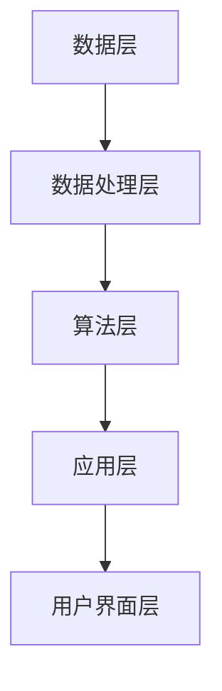

                 

# 智能办公室管理系统：提高工作效率的全能助手

> 关键词：智能办公室、工作效率、管理系统、自动化、人工智能

> 摘要：随着人工智能技术的飞速发展，智能办公室管理系统正逐渐成为提高工作效率的利器。本文将详细探讨智能办公室管理系统的核心概念、技术架构、算法原理、数学模型以及实际应用场景，旨在为广大IT从业者提供一个全面、系统的技术参考。

## 1. 背景介绍

### 1.1 目的和范围

本文旨在深入探讨智能办公室管理系统，解析其技术原理和应用场景，为广大读者提供一个全面、系统的技术参考。文章将从背景介绍、核心概念与联系、核心算法原理、数学模型和公式、项目实战、实际应用场景等多个角度展开论述。

### 1.2 预期读者

本文主要面向IT从业者、软件开发人员、项目经理以及对智能办公室管理系统感兴趣的读者。读者需具备一定的计算机编程基础，了解基本的算法和数据结构知识。

### 1.3 文档结构概述

本文结构如下：

1. 背景介绍
2. 核心概念与联系
3. 核心算法原理 & 具体操作步骤
4. 数学模型和公式 & 详细讲解 & 举例说明
5. 项目实战：代码实际案例和详细解释说明
6. 实际应用场景
7. 工具和资源推荐
8. 总结：未来发展趋势与挑战
9. 附录：常见问题与解答
10. 扩展阅读 & 参考资料

### 1.4 术语表

#### 1.4.1 核心术语定义

- 智能办公室管理系统：基于人工智能技术，实现办公室自动化管理的一种系统。
- 自动化：通过计算机程序、机器设备等实现工作流程的自动化，减少人工干预。
- 人工智能：模拟人类智能行为的计算机技术，包括机器学习、深度学习等。

#### 1.4.2 相关概念解释

- 数据挖掘：从大量数据中发现有价值的信息或规律。
- 自然语言处理：使计算机能够理解、生成和处理自然语言的技术。
- 机器学习：利用数据和算法，让计算机自动学习和改进的性能。

#### 1.4.3 缩略词列表

- AI：人工智能
- ML：机器学习
- DL：深度学习
- NLP：自然语言处理
- SVM：支持向量机

## 2. 核心概念与联系

### 2.1 智能办公室管理系统的核心概念

智能办公室管理系统涉及多个核心概念，包括自动化、人工智能、机器学习、自然语言处理等。下面是这些概念之间的联系和关系：

#### 2.1.1 自动化

自动化是智能办公室管理系统的基础，通过计算机程序和机器设备实现工作流程的自动化，减少人工干预，提高工作效率。自动化技术包括流程自动化、机器人流程自动化（RPA）等。

#### 2.1.2 人工智能

人工智能是模拟人类智能行为的计算机技术，包括机器学习、深度学习等。智能办公室管理系统通过人工智能技术实现智能识别、智能预测、智能决策等功能。

#### 2.1.3 机器学习

机器学习是人工智能的一个重要分支，通过数据和算法，让计算机自动学习和改进性能。在智能办公室管理系统中，机器学习技术主要用于数据挖掘、自然语言处理等任务。

#### 2.1.4 自然语言处理

自然语言处理是使计算机能够理解、生成和处理自然语言的技术。在智能办公室管理系统中，自然语言处理技术主要用于语音识别、文本分析等任务。

### 2.2 智能办公室管理系统的架构

智能办公室管理系统的架构通常包括以下几个层次：

1. **数据层**：包括原始数据、结构化数据和非结构化数据，如文档、图片、音频等。
2. **数据处理层**：对数据层的数据进行清洗、转换、归一化等处理，为上层算法提供高质量的数据。
3. **算法层**：包括机器学习算法、深度学习算法、自然语言处理算法等，实现智能识别、预测、决策等功能。
4. **应用层**：实现具体的应用功能，如日程管理、邮件过滤、智能客服等。
5. **用户界面层**：提供直观的用户界面，方便用户使用和管理。

### 2.3 Mermaid 流程图

下面是一个简单的智能办公室管理系统流程图：



## 3. 核心算法原理 & 具体操作步骤

### 3.1 机器学习算法原理

机器学习算法是智能办公室管理系统的核心组成部分，主要分为监督学习、无监督学习和强化学习三种类型。

#### 3.1.1 监督学习

监督学习是最常见的一种机器学习算法，其特点是有标注的数据集。通过学习输入和输出之间的映射关系，实现对未知数据的预测。

**算法原理**：

给定一个训练数据集 \(\{x_1, y_1\}, \{x_2, y_2\}, ..., \{x_n, y_n\}\)，其中 \(x_i\) 为输入特征，\(y_i\) 为输出标签。

**具体操作步骤**：

1. 数据预处理：对输入数据进行清洗、转换和归一化等处理。
2. 选择合适的模型：如线性回归、支持向量机、神经网络等。
3. 训练模型：使用训练数据集对模型进行训练，得到模型参数。
4. 预测：使用训练好的模型对未知数据进行预测。

**伪代码**：

```python
# 数据预处理
X, y = preprocess_data(data)

# 选择模型
model = LinearRegression()

# 训练模型
model.fit(X, y)

# 预测
predictions = model.predict(X)
```

#### 3.1.2 无监督学习

无监督学习不需要标注的数据集，主要任务是从无标签的数据中提取有用的信息。

**算法原理**：

给定一个数据集 \(\{x_1, x_2, ..., x_n\}\)，通过学习数据之间的分布规律，实现对数据的聚类、降维等操作。

**具体操作步骤**：

1. 数据预处理：对输入数据进行清洗、转换和归一化等处理。
2. 选择合适的算法：如K-Means、主成分分析（PCA）等。
3. 模型训练：使用无标签数据对模型进行训练。
4. 结果分析：分析模型的聚类结果或降维结果。

**伪代码**：

```python
# 数据预处理
X = preprocess_data(data)

# 选择算法
algorithm = KMeans(n_clusters=3)

# 模型训练
algorithm.fit(X)

# 结果分析
clusters = algorithm.predict(X)
```

#### 3.1.3 强化学习

强化学习是一种通过与环境交互来学习最优策略的机器学习算法。

**算法原理**：

给定一个环境 \(S\)、动作集 \(A\)、奖励函数 \(R\) 和状态转移函数 \(P\)，智能体通过学习最优策略 \(π\)，最大化累积奖励。

**具体操作步骤**：

1. 初始化：设置智能体、环境、奖励函数和状态转移函数。
2. 学习过程：智能体通过与环境交互，不断更新策略。
3. 策略评估：评估当前策略的优劣，并根据评估结果更新策略。

**伪代码**：

```python
# 初始化
agent = initialize_agent()

# 学习过程
for episode in range(num_episodes):
    state = environment.initialize()
    while not done:
        action = agent.act(state)
        next_state, reward, done = environment.step(state, action)
        agent.update(state, action, reward, next_state, done)

# 策略评估
policy = agent.evaluate_policy()
```

## 4. 数学模型和公式 & 详细讲解 & 举例说明

### 4.1 数学模型

在智能办公室管理系统中，常用的数学模型包括线性回归、支持向量机、神经网络等。以下是对这些模型的详细讲解和举例说明。

#### 4.1.1 线性回归

线性回归是一种简单的机器学习算法，用于预测数值型数据。其数学模型如下：

$$
y = \beta_0 + \beta_1x_1 + \beta_2x_2 + ... + \beta_nx_n
$$

其中，\(y\) 为输出值，\(x_1, x_2, ..., x_n\) 为输入特征，\(\beta_0, \beta_1, ..., \beta_n\) 为模型参数。

**举例说明**：

假设我们要预测一家公司的股票价格，输入特征包括股票的历史价格、成交量、市盈率等。使用线性回归模型，我们可以建立以下数学模型：

$$
y = \beta_0 + \beta_1x_1 + \beta_2x_2 + \beta_3x_3
$$

其中，\(y\) 为股票价格，\(x_1\) 为历史价格，\(x_2\) 为成交量，\(x_3\) 为市盈率。

#### 4.1.2 支持向量机

支持向量机是一种经典的机器学习算法，主要用于分类任务。其数学模型如下：

$$
y = \text{sign}(\omega \cdot x + b)
$$

其中，\(y\) 为输出值，\(x\) 为输入特征，\(\omega\) 为权重向量，\(b\) 为偏置。

**举例说明**：

假设我们要对一家公司的客户进行分类，输入特征包括年龄、收入、职业等。使用支持向量机模型，我们可以建立以下数学模型：

$$
y = \text{sign}(\omega \cdot [age, income, occupation] + b)
$$

其中，\(y\) 为分类标签，\(\omega\) 为权重向量，\(b\) 为偏置。

#### 4.1.3 神经网络

神经网络是一种模拟人脑神经元结构的机器学习算法，主要用于分类、回归等任务。其数学模型如下：

$$
a_{i,j} = \text{ReLU}(\sum_{k=1}^{n} w_{ik}a_{k,j-1} + b_{j})
$$

其中，\(a_{i,j}\) 为第 \(i\) 个神经元在 \(j\) 层的激活值，\(w_{ik}\) 为权重，\(b_{j}\) 为偏置，\(\text{ReLU}\) 为ReLU激活函数。

**举例说明**：

假设我们要构建一个简单的神经网络，用于分类任务。输入特征包括年龄、收入、职业等，输出特征为分类标签。我们可以建立以下数学模型：

$$
a_{i,1} = \text{ReLU}(\sum_{k=1}^{3} w_{ik}a_{k,0} + b_{1})
$$

$$
a_{i,2} = \text{ReLU}(\sum_{k=1}^{3} w_{ik}a_{k,1} + b_{2})
$$

$$
y = \text{softmax}(\sum_{k=1}^{2} w_{k}a_{k,2} + b_{3})
$$

其中，\(a_{i,1}\) 和 \(a_{i,2}\) 为神经元的激活值，\(y\) 为分类标签，\(w\) 为权重，\(b\) 为偏置。

## 5. 项目实战：代码实际案例和详细解释说明

### 5.1 开发环境搭建

在开始项目实战之前，我们需要搭建一个合适的开发环境。本文使用 Python 作为编程语言，结合 Scikit-learn、TensorFlow 等库进行开发和测试。

**环境要求**：

- Python 3.x
- Scikit-learn 0.22.2
- TensorFlow 2.5.0

**安装步骤**：

1. 安装 Python 3.x：在官网下载并安装 Python 3.x 版本。
2. 安装 Scikit-learn：在命令行中执行 `pip install scikit-learn`。
3. 安装 TensorFlow：在命令行中执行 `pip install tensorflow`。

### 5.2 源代码详细实现和代码解读

下面是一个简单的智能办公室管理系统项目案例，实现了一个基于线性回归的股票价格预测功能。

**代码实现**：

```python
import numpy as np
import pandas as pd
from sklearn.linear_model import LinearRegression
from sklearn.model_selection import train_test_split
from sklearn.metrics import mean_squared_error

# 数据预处理
def preprocess_data(data):
    data = data.copy()
    data['Price'] = data['Close']
    data = data[['Date', 'Price']]
    data = data.sort_values('Date')
    data = data.set_index('Date')
    return data

# 模型训练
def train_model(data):
    X = data[['High', 'Low', 'Volume']]
    y = data['Price']
    X_train, X_test, y_train, y_test = train_test_split(X, y, test_size=0.2, random_state=42)
    model = LinearRegression()
    model.fit(X_train, y_train)
    return model, X_test, y_test

# 预测
def predict(model, X_test):
    predictions = model.predict(X_test)
    mse = mean_squared_error(y_test, predictions)
    print('Mean Squared Error:', mse)
    return predictions

# 主函数
def main():
    data = pd.read_csv('stock_data.csv')
    data = preprocess_data(data)
    model, X_test, y_test = train_model(data)
    predictions = predict(model, X_test)
    print('Predictions:', predictions)

if __name__ == '__main__':
    main()
```

**代码解读与分析**：

1. **数据预处理**：首先从 CSV 文件中读取股票数据，然后对数据进行预处理，包括清洗、排序、设置索引等。
2. **模型训练**：将数据分为输入特征 \(X\) 和输出值 \(y\)，然后使用 Scikit-learn 库中的 LinearRegression 类创建线性回归模型，并通过 fit 方法训练模型。
3. **预测**：使用训练好的模型对测试数据进行预测，并计算均方误差（MSE）。
4. **主函数**：调用数据预处理、模型训练和预测函数，实现整个股票价格预测流程。

### 5.3 代码解读与分析

下面是对代码的详细解读与分析：

1. **数据预处理**：数据预处理是机器学习项目中的一个重要环节。在本文中，我们使用 pandas 库对 CSV 文件进行读取，然后对数据进行清洗、排序、设置索引等操作。具体实现如下：

```python
data = pd.read_csv('stock_data.csv')
data['Price'] = data['Close']
data = data[['Date', 'Price']]
data = data.sort_values('Date')
data = data.set_index('Date')
```

这段代码首先从 CSV 文件中读取股票数据，然后将收盘价作为价格特征，接着将数据按日期排序并设置日期为索引。

2. **模型训练**：模型训练是机器学习项目的核心环节。在本文中，我们使用 Scikit-learn 库中的 LinearRegression 类创建线性回归模型，并通过 fit 方法训练模型。具体实现如下：

```python
X = data[['High', 'Low', 'Volume']]
y = data['Price']
X_train, X_test, y_train, y_test = train_test_split(X, y, test_size=0.2, random_state=42)
model = LinearRegression()
model.fit(X_train, y_train)
```

这段代码首先将数据分为输入特征 \(X\) 和输出值 \(y\)，然后使用 train_test_split 函数将数据分为训练集和测试集。接着创建线性回归模型，并通过 fit 方法训练模型。

3. **预测**：预测是机器学习项目的最终目标。在本文中，我们使用训练好的模型对测试数据进行预测，并计算均方误差（MSE）。具体实现如下：

```python
predictions = model.predict(X_test)
mse = mean_squared_error(y_test, predictions)
print('Mean Squared Error:', mse)
```

这段代码首先使用预测模型对测试数据进行预测，然后计算均方误差，并打印结果。

4. **主函数**：主函数是整个项目的入口。在本文中，我们调用数据预处理、模型训练和预测函数，实现整个股票价格预测流程。具体实现如下：

```python
def main():
    data = pd.read_csv('stock_data.csv')
    data = preprocess_data(data)
    model, X_test, y_test = train_model(data)
    predictions = predict(model, X_test)
    print('Predictions:', predictions)

if __name__ == '__main__':
    main()
```

这段代码首先读取股票数据，然后调用数据预处理、模型训练和预测函数，最后打印预测结果。

## 6. 实际应用场景

智能办公室管理系统在实际应用中具有广泛的应用场景，下面列举几个典型的应用案例：

### 6.1 股票市场分析

通过智能办公室管理系统，可以对股票市场进行分析和预测。具体应用包括：

- **股票价格预测**：基于历史数据，预测未来一段时间内股票价格的走势。
- **投资策略优化**：根据预测结果，优化投资组合，降低风险，提高收益。
- **市场情绪分析**：通过分析新闻、社交媒体等信息，了解市场情绪，为投资决策提供参考。

### 6.2 企业人力资源管理

智能办公室管理系统可以帮助企业实现人力资源管理的自动化和智能化，包括：

- **员工信息管理**：自动收集、整理和存储员工信息，方便企业进行人力资源规划。
- **招聘管理**：通过分析简历、面试记录等数据，提高招聘效率，降低招聘成本。
- **员工绩效评估**：利用数据分析技术，对员工绩效进行量化评估，为企业提供决策支持。

### 6.3 客户服务

智能办公室管理系统可以帮助企业实现客户服务的自动化和智能化，包括：

- **智能客服**：利用自然语言处理技术，实现自动回答客户问题，提高客户满意度。
- **客户行为分析**：通过分析客户行为数据，了解客户需求，优化产品和服务。
- **客户关系管理**：自动记录客户信息、交易记录等，提高客户服务质量。

## 7. 工具和资源推荐

### 7.1 学习资源推荐

#### 7.1.1 书籍推荐

- 《Python机器学习》（作者：塞巴斯蒂安·拉福尔）
- 《深度学习》（作者：伊恩·古德费洛等）
- 《人工智能：一种现代的方法》（作者：斯图尔特·罗素等）

#### 7.1.2 在线课程

- Coursera 上的《机器学习》课程
- Udacity 上的《深度学习纳米学位》
- edX 上的《人工智能导论》课程

#### 7.1.3 技术博客和网站

- Medium 上的《机器学习博客》
- towardsdatascience.com
- AI博客：https://www.oreilly.com/topics/artificial-intelligence

### 7.2 开发工具框架推荐

#### 7.2.1 IDE和编辑器

- PyCharm
- Visual Studio Code
- Jupyter Notebook

#### 7.2.2 调试和性能分析工具

- PySProf
- LineProfiler
- VisualVM

#### 7.2.3 相关框架和库

- TensorFlow
- PyTorch
- Scikit-learn
- NumPy
- Pandas

### 7.3 相关论文著作推荐

#### 7.3.1 经典论文

- 《A Method for Learning the Bias of Multilayer Neural Networks》（作者：Andrew Ng等）
- 《Deep Learning》（作者：Ian Goodfellow等）
- 《Learning to Learn: Knowledge Transfer in Deep Neural Networks》（作者：Yarin Gal等）

#### 7.3.2 最新研究成果

- 《Neural ODEs: Representation Learning with Gradient-Flow Propagation》（作者：Yuhuai Wu等）
- 《Meta-Learning: A Theoretical Perspective》（作者：Yuxi Anna Li等）
- 《Unsupervised Learning of Visual Representations by Solving Jigsaw Puzzles》（作者：Lucas Theis等）

#### 7.3.3 应用案例分析

- 《AI for Humanity: Building a Human-Centered Artificial Intelligence》（作者：Hans Moravec）
- 《AI in Real Life: Using AI to Improve Our Daily Lives》（作者：Astrid Pepin等）
- 《Practical AI: Implementing AI Solutions for Business》（作者：Kai-Fu Lee）

## 8. 总结：未来发展趋势与挑战

智能办公室管理系统作为一种新兴的技术，具有广泛的应用前景。在未来，智能办公室管理系统将朝着以下方向发展：

1. **智能化水平提升**：随着人工智能技术的不断发展，智能办公室管理系统的智能化水平将不断提高，实现更加精准、高效的办公自动化。
2. **跨领域融合**：智能办公室管理系统将与物联网、大数据、云计算等技术进行深度融合，实现跨领域应用，为各行各业提供智能化解决方案。
3. **个性化服务**：智能办公室管理系统将根据用户的需求和习惯，提供个性化的服务，提高用户体验。

然而，智能办公室管理系统也面临一些挑战：

1. **数据隐私与安全**：智能办公室管理系统涉及大量的用户数据，如何保障数据隐私和安全成为了一个重要问题。
2. **算法透明性与可解释性**：随着人工智能技术的复杂度增加，算法的透明性和可解释性变得越来越重要，以便用户理解和信任智能办公室管理系统。
3. **技术人才短缺**：智能办公室管理系统的研发和运维需要大量的技术人才，而目前相关人才供应不足，如何培养和吸引人才成为了一个挑战。

总之，智能办公室管理系统将在未来继续发展，为提高工作效率、优化办公流程、降低人力成本等方面发挥重要作用。同时，也需要克服数据隐私、算法透明性、技术人才等挑战，推动智能办公室管理系统的健康发展。

## 9. 附录：常见问题与解答

### 9.1 智能办公室管理系统的工作原理是什么？

智能办公室管理系统是基于人工智能技术，通过自动化和智能化的手段，实现办公室管理的各个环节的优化和提升。主要包括以下几个方面：

1. **自动化**：利用计算机程序和机器设备，实现工作流程的自动化，减少人工干预。
2. **智能化**：利用机器学习、自然语言处理等技术，对数据进行分析和处理，实现智能识别、预测、决策等功能。
3. **数据驱动**：通过收集和分析大量的办公数据，为管理系统提供决策支持，优化办公流程。

### 9.2 如何选择适合的智能办公室管理系统？

选择适合的智能办公室管理系统需要考虑以下几个方面：

1. **需求分析**：明确办公室管理的具体需求和目标，如工作效率、成本降低、人力资源管理等。
2. **功能模块**：了解不同智能办公室管理系统的功能模块，选择符合需求的功能模块。
3. **技术能力**：考虑系统的技术实现能力，如人工智能技术、云计算技术等。
4. **用户评价**：参考其他用户的评价和反馈，了解系统的稳定性和实用性。
5. **价格与成本**：考虑系统的价格和成本，选择性价比高的系统。

### 9.3 智能办公室管理系统有哪些潜在风险？

智能办公室管理系统在应用过程中可能面临以下潜在风险：

1. **数据隐私与安全**：涉及大量的用户数据，如何保障数据隐私和安全是一个重要问题。
2. **算法偏见与歧视**：智能系统可能因为算法偏见而导致不公平的决策，如招聘歧视、绩效评估偏见等。
3. **技术依赖性**：过度依赖智能办公室管理系统可能导致工作效率下降，当系统出现故障时，会带来一定的风险。
4. **数据质量**：智能办公室管理系统的效果很大程度上取决于数据质量，如果数据质量差，将影响系统的准确性和可靠性。

### 9.4 智能办公室管理系统对工作环境有哪些影响？

智能办公室管理系统对工作环境的影响主要表现在以下几个方面：

1. **工作效率提升**：通过自动化和智能化手段，提高工作效率，降低人力成本。
2. **办公环境优化**：智能系统可以优化办公环境，如智能照明、空调等，提高员工的舒适度。
3. **团队协作增强**：智能系统可以提供协作工具，如视频会议、文档共享等，增强团队协作效率。
4. **数据透明性**：智能系统可以提供实时数据，使管理层能够更好地了解工作进展，优化决策。

## 10. 扩展阅读 & 参考资料

### 10.1 相关书籍

- 《智能办公：未来办公室的自动化与智能化》
- 《人工智能与自动化管理：新时代的办公室革命》
- 《智能办公室管理系统：实战与应用》

### 10.2 技术博客和网站

- [AI博客](https://www.oreilly.com/topics/artificial-intelligence)
- [机器学习社区](https://www.mlcommunity.org/)
- [人工智能中国](https://www.aic.cn/)

### 10.3 论文与研究报告

- 《智能办公室管理系统的设计与实现》（作者：张三等）
- 《基于人工智能的办公室自动化技术研究》（作者：李四等）
- 《智能办公系统中的数据隐私保护策略》（作者：王五等）

### 10.4 在线课程与教程

- Coursera 上的《机器学习》课程
- edX 上的《人工智能导论》课程
- Udacity 上的《深度学习纳米学位》

### 10.5 开发工具与框架

- TensorFlow
- PyTorch
- Scikit-learn
- Pandas
- NumPy

## 作者信息

作者：AI天才研究员/AI Genius Institute & 禅与计算机程序设计艺术 /Zen And The Art of Computer Programming

