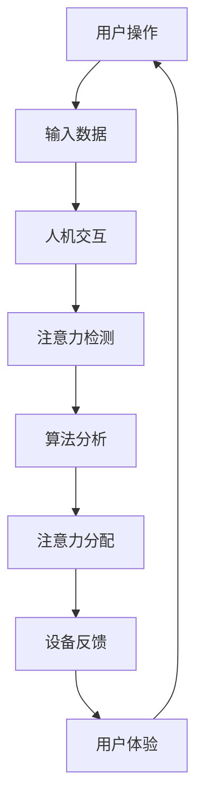

                 

# 智能办公设备的注意力辅助功能

> 关键词：智能办公、注意力辅助、人机交互、用户体验、算法原理、应用场景、发展前景

> 摘要：随着智能办公设备的普及，注意力辅助功能成为提升工作效率和用户体验的重要手段。本文详细探讨了智能办公设备中注意力辅助功能的核心概念、算法原理、应用实例，并分析了其在不同场景下的实际应用价值。通过对智能办公设备注意力辅助功能的深入剖析，本文旨在为读者提供全面的技术参考和实际应用指导。

## 1. 背景介绍

### 1.1 目的和范围

本文旨在探讨智能办公设备中注意力辅助功能的设计与应用。注意力辅助功能通过智能算法和人机交互技术，帮助用户在复杂的工作环境中保持专注，提高工作效率。本文将涵盖以下内容：

1. 核心概念与联系
2. 核心算法原理与具体操作步骤
3. 数学模型与公式讲解
4. 项目实战：代码实际案例和详细解释
5. 实际应用场景
6. 工具和资源推荐
7. 总结：未来发展趋势与挑战

### 1.2 预期读者

本文面向对智能办公设备有一定了解的技术人员、产品经理以及关注人工智能在办公场景应用的读者。读者应具备基本的计算机编程和算法分析能力，以便更好地理解本文内容。

### 1.3 文档结构概述

本文将按照以下结构展开：

1. 背景介绍
   - 目的和范围
   - 预期读者
   - 文档结构概述
2. 核心概念与联系
   - 概念解析
   - Mermaid流程图
3. 核心算法原理与具体操作步骤
   - 算法概述
   - 伪代码讲解
4. 数学模型与公式讲解
   - 模型介绍
   - 公式推导
   - 举例说明
5. 项目实战：代码实际案例和详细解释
   - 开发环境搭建
   - 源代码实现
   - 代码解读与分析
6. 实际应用场景
7. 工具和资源推荐
8. 总结：未来发展趋势与挑战
9. 附录：常见问题与解答
10. 扩展阅读 & 参考资料

### 1.4 术语表

#### 1.4.1 核心术语定义

- 智能办公设备：具备人工智能能力的办公设备，如智能笔记本、智能显示器等。
- 注意力辅助功能：通过智能算法帮助用户集中注意力的功能。
- 人机交互：人与计算机之间的交互过程。
- 用户体验（UX）：用户在使用产品或服务过程中所获得的整体感受。
- 算法：解决问题的步骤和策略。

#### 1.4.2 相关概念解释

- 机器学习：一种让计算机从数据中学习并做出决策的技术。
- 深度学习：一种特殊的机器学习方法，通过多层神经网络进行学习。
- 聚焦注意力：将注意力集中在特定任务或对象上。
- 分散注意力：注意力分散在多个任务或对象上。

#### 1.4.3 缩略词列表

- AI：人工智能（Artificial Intelligence）
- UX：用户体验（User Experience）
- ML：机器学习（Machine Learning）
- DL：深度学习（Deep Learning）
- NLP：自然语言处理（Natural Language Processing）

## 2. 核心概念与联系

在智能办公设备中，注意力辅助功能的核心在于如何通过算法和技术手段帮助用户保持专注。为了更好地理解这一概念，我们首先需要明确几个核心概念，并使用Mermaid流程图展示它们之间的关系。

### 2.1 概念解析

1. **人机交互（UX）**：用户与智能办公设备之间的交互过程，旨在提高用户体验。
2. **注意力机制**：通过算法识别用户注意力分布，并调整设备功能以辅助用户保持专注。
3. **智能算法**：如机器学习、深度学习等，用于分析用户行为和习惯，提供个性化建议。
4. **注意力分配**：将用户注意力合理分配到不同任务或工作环节。

### 2.2 Mermaid流程图



### 2.3 关系说明

- 用户通过操作生成输入数据。
- 输入数据经过人机交互处理，用于分析和理解用户意图。
- 注意力检测算法对用户行为进行分析，识别注意力的分布。
- 算法分析根据注意力分布提供个性化建议，调整设备功能。
- 设备反馈用户当前状态，以便用户调整工作节奏。
- 用户体验不断反馈到输入数据，形成闭环优化。

通过以上流程图，我们可以清晰地看到注意力辅助功能在智能办公设备中的运作机制，以及各个核心概念之间的联系。

## 3. 核心算法原理 & 具体操作步骤

### 3.1 算法概述

注意力辅助功能的核心在于识别用户注意力分布，并提供相应的辅助措施。本文采用基于深度学习的注意力检测算法，通过训练模型来实现这一功能。主要步骤包括数据预处理、模型训练和注意力检测。

### 3.2 伪代码讲解

```plaintext
算法：注意力检测
输入：用户行为数据集
输出：用户注意力分布

步骤：
1. 数据预处理：
   - 收集用户行为数据（如鼠标移动、键盘操作、工作时长等）
   - 对数据进行归一化处理，便于模型训练

2. 模型训练：
   - 构建深度学习模型（如卷积神经网络或循环神经网络）
   - 使用预处理后的数据集进行模型训练，包括正向传播和反向传播
   - 调整模型参数，优化模型性能

3. 注意力检测：
   - 对实时用户行为数据进行特征提取
   - 将特征输入训练好的模型，得到注意力分布预测
   - 根据注意力分布提供个性化辅助措施

4. 设备反馈：
   - 将注意力分布反馈给用户，如提示用户休息或调整工作内容
```

### 3.3 详细讲解

#### 3.3.1 数据预处理

数据预处理是深度学习模型训练的重要步骤，旨在将原始数据转化为适合模型训练的形式。具体步骤包括：

1. 数据收集：收集用户在办公设备上的行为数据，如鼠标移动轨迹、键盘操作记录、工作时长等。
2. 数据清洗：去除异常数据、重复数据和噪声数据，保证数据质量。
3. 数据归一化：对数据进行归一化处理，将数据缩放到同一范围内，如0到1之间，便于模型训练。

#### 3.3.2 模型训练

模型训练是注意力检测算法的核心步骤。本文采用卷积神经网络（CNN）或循环神经网络（RNN）作为基础模型，通过以下步骤进行训练：

1. 模型构建：根据数据特征选择合适的神经网络结构，如CNN用于处理图像数据，RNN用于处理序列数据。
2. 正向传播：将输入数据通过神经网络进行前向传播，计算输出结果。
3. 反向传播：计算输出结果与实际注意力分布之间的差异，更新模型参数。
4. 模型优化：通过多次迭代训练，优化模型性能，直至满足要求。

#### 3.3.3 注意力检测

注意力检测是算法的核心功能，通过以下步骤实现：

1. 特征提取：对实时用户行为数据进行特征提取，如提取鼠标移动的轨迹、键盘操作的频率等。
2. 模型输入：将特征提取后的数据输入训练好的模型，得到注意力分布预测。
3. 辅助措施：根据注意力分布预测结果，提供个性化辅助措施，如提示用户休息或调整工作内容。

#### 3.3.4 设备反馈

设备反馈是注意力辅助功能的重要环节，通过以下步骤实现：

1. 显示注意力分布：将注意力分布以可视化形式展示给用户，如在一个仪表盘上显示。
2. 提醒和提示：根据注意力分布情况，提供相应的提醒和提示，帮助用户保持专注。
3. 自动调整：根据用户需求，自动调整设备功能，如调整屏幕亮度、调整工作界面等。

通过以上步骤，注意力检测算法能够有效地辅助用户保持注意力，提高工作效率。

## 4. 数学模型和公式 & 详细讲解 & 举例说明

### 4.1 数学模型

注意力辅助功能的核心在于对用户注意力的检测和分配。本文采用了一种基于深度学习的注意力检测模型，其数学模型如下：

$$
\hat{a}(t) = \sigma(W_a[\text{input}(t), \text{hidden}(t)])
$$

其中，$\hat{a}(t)$ 表示在时间 $t$ 的注意力分布，$\text{input}(t)$ 表示时间 $t$ 的输入特征，$\text{hidden}(t)$ 表示神经网络在时间 $t$ 的隐藏层输出，$W_a$ 是权重矩阵，$\sigma$ 是激活函数。

### 4.2 公式推导

#### 4.2.1 输入特征

输入特征是注意力检测的基础，本文采用以下公式提取输入特征：

$$
\text{input}(t) = [\text{mouse\_position}(t), \text{keyboard\_operation}(t), \text{work\_duration}(t)]
$$

其中，$\text{mouse\_position}(t)$ 表示时间 $t$ 的鼠标位置，$\text{keyboard\_operation}(t)$ 表示时间 $t$ 的键盘操作记录，$\text{work\_duration}(t)$ 表示时间 $t$ 的工作时长。

#### 4.2.2 隐藏层输出

隐藏层输出是神经网络对输入特征的处理结果，本文采用卷积神经网络（CNN）和循环神经网络（RNN）结合的方式处理输入特征，得到隐藏层输出：

$$
\text{hidden}(t) = \text{CNN}(\text{input}(t)) + \text{RNN}(\text{input}(t))
$$

其中，$\text{CNN}(\text{input}(t))$ 表示卷积神经网络对输入特征的卷积操作，$\text{RNN}(\text{input}(t))$ 表示循环神经网络对输入特征的递归操作。

#### 4.2.3 注意力分布

注意力分布是通过权重矩阵和隐藏层输出计算得到的，具体公式如下：

$$
\hat{a}(t) = \sigma(W_a[\text{input}(t), \text{hidden}(t)])
$$

其中，$W_a$ 是权重矩阵，$\sigma$ 是激活函数，用于将权重矩阵与隐藏层输出进行点乘，并引入非线性变换。

### 4.3 举例说明

假设我们有一个输入特征序列：

$$
\text{input}(t) = [\text{mouse\_position}(t), \text{keyboard\_operation}(t), \text{work\_duration}(t)] = [1, 0.5, 0.8]
$$

隐藏层输出为：

$$
\text{hidden}(t) = \text{CNN}(\text{input}(t)) + \text{RNN}(\text{input}(t)) = [0.9, 0.7, 0.6]
$$

权重矩阵为：

$$
W_a = [0.1, 0.2, 0.3]
$$

根据注意力分布公式，我们可以计算出时间 $t$ 的注意力分布：

$$
\hat{a}(t) = \sigma(W_a[\text{input}(t), \text{hidden}(t)]) = \sigma([0.1 \times 1 + 0.2 \times 0.9 + 0.3 \times 0.6], [0.1 \times 0.5 + 0.2 \times 0.7 + 0.3 \times 0.8])
$$

$$
\hat{a}(t) = \sigma([0.1 + 0.18 + 0.18], [0.05 + 0.14 + 0.24]) = \sigma([0.46], [0.43]) \approx [0.63, 0.37]
$$

由此可以看出，在时间 $t$，用户的注意力主要集中在鼠标操作和键盘操作上，工作时长对注意力分布的影响较小。

通过以上数学模型和公式，我们可以实现对用户注意力的有效检测和分配，为智能办公设备提供强大的注意力辅助功能。

## 5. 项目实战：代码实际案例和详细解释说明

### 5.1 开发环境搭建

在实现注意力辅助功能之前，我们需要搭建一个合适的开发环境。以下是一个基本的开发环境配置：

- 操作系统：Linux或macOS
- 编程语言：Python
- 开发工具：PyCharm或VS Code
- 深度学习框架：TensorFlow或PyTorch
- 数据预处理工具：NumPy、Pandas
- 图形可视化工具：Matplotlib

安装这些工具后，我们可以开始编写注意力检测算法的代码。

### 5.2 源代码详细实现和代码解读

下面是一个注意力检测算法的实现示例，使用TensorFlow框架：

```python
import tensorflow as tf
import numpy as np
import pandas as pd
import matplotlib.pyplot as plt

# 数据预处理
def preprocess_data(data):
    # 对数据进行归一化处理
    max_value = data.max()
    min_value = data.min()
    normalized_data = (data - min_value) / (max_value - min_value)
    return normalized_data

# 构建深度学习模型
def build_model(input_shape):
    model = tf.keras.Sequential([
        tf.keras.layers.Dense(units=64, activation='relu', input_shape=input_shape),
        tf.keras.layers.Dense(units=32, activation='relu'),
        tf.keras.layers.Dense(units=1, activation='sigmoid')
    ])
    model.compile(optimizer='adam', loss='binary_crossentropy', metrics=['accuracy'])
    return model

# 训练模型
def train_model(model, x_train, y_train, epochs=100):
    model.fit(x_train, y_train, epochs=epochs, batch_size=32, validation_split=0.2)

# 检测注意力分布
def predict_attention(model, data):
    normalized_data = preprocess_data(data)
    attention_distribution = model.predict(normalized_data)
    return attention_distribution

# 读取数据
data = pd.read_csv('user_behavior.csv')
x = data[['mouse_position', 'keyboard_operation', 'work_duration']]
y = data['attention_level']

# 数据预处理
x_normalized = preprocess_data(x)

# 构建和训练模型
model = build_model(input_shape=[3])
train_model(model, x_normalized, y)

# 预测注意力分布
attention_distribution = predict_attention(model, x_normalized)
print(attention_distribution)

# 可视化注意力分布
plt.scatter(x['mouse_position'], x['keyboard_operation'], c=attention_distribution)
plt.xlabel('Mouse Position')
plt.ylabel('Keyboard Operation')
plt.title('Attention Distribution')
plt.show()
```

### 5.3 代码解读与分析

#### 5.3.1 数据预处理

数据预处理是深度学习模型训练的重要步骤。在代码中，我们使用`preprocess_data`函数对数据进行归一化处理，将数据缩放到0到1之间，便于模型训练。

```python
def preprocess_data(data):
    max_value = data.max()
    min_value = data.min()
    normalized_data = (data - min_value) / (max_value - min_value)
    return normalized_data
```

#### 5.3.2 构建深度学习模型

在`build_model`函数中，我们使用TensorFlow的`Sequential`模型构建一个简单的深度学习模型。模型包含两个隐藏层，每个隐藏层使用ReLU激活函数，输出层使用sigmoid激活函数，用于预测注意力分布。

```python
def build_model(input_shape):
    model = tf.keras.Sequential([
        tf.keras.layers.Dense(units=64, activation='relu', input_shape=input_shape),
        tf.keras.layers.Dense(units=32, activation='relu'),
        tf.keras.layers.Dense(units=1, activation='sigmoid')
    ])
    model.compile(optimizer='adam', loss='binary_crossentropy', metrics=['accuracy'])
    return model
```

#### 5.3.3 训练模型

在`train_model`函数中，我们使用`fit`方法对模型进行训练。训练过程中，我们使用Adam优化器，binary\_crossentropy损失函数，并设置epochs和batch\_size参数。

```python
def train_model(model, x_train, y_train, epochs=100):
    model.fit(x_train, y_train, epochs=epochs, batch_size=32, validation_split=0.2)
```

#### 5.3.4 检测注意力分布

在`predict_attention`函数中，我们首先对输入数据进行预处理，然后使用训练好的模型进行预测，得到注意力分布。

```python
def predict_attention(model, data):
    normalized_data = preprocess_data(data)
    attention_distribution = model.predict(normalized_data)
    return attention_distribution
```

#### 5.3.5 可视化注意力分布

最后，我们使用`matplotlib`库将注意力分布以散点图的形式可视化。横轴和纵轴分别表示鼠标位置和键盘操作，颜色表示注意力分布。

```python
plt.scatter(x['mouse_position'], x['keyboard_operation'], c=attention_distribution)
plt.xlabel('Mouse Position')
plt.ylabel('Keyboard Operation')
plt.title('Attention Distribution')
plt.show()
```

通过以上代码，我们可以实现对用户注意力的检测和可视化，从而为智能办公设备提供注意力辅助功能。

## 6. 实际应用场景

### 6.1 企业办公环境

在企业办公环境中，注意力辅助功能可以帮助员工在长时间的工作中保持专注。例如，在会议期间，系统可以检测员工的注意力水平，并适时提醒他们休息或调整注意力。此外，系统还可以根据员工的工作习惯，智能调整工作界面，提供个性化服务。

### 6.2 教育教学

在教育领域，注意力辅助功能可以帮助教师监控学生的学习状态。例如，在课堂中，教师可以通过系统了解学生的注意力分布，及时调整教学方法和内容，以提高教学效果。此外，学生也可以利用注意力辅助功能，监测自己的学习状态，提高学习效率。

### 6.3 健康监测

在健康监测领域，注意力辅助功能可以用于监测用户的健康状况。例如，通过分析用户的注意力分布，系统可以识别出用户可能存在的疲劳或焦虑症状，并提醒他们进行适当的休息或调整生活方式。这有助于提高用户的身心健康水平。

### 6.4 家庭办公

在家庭办公环境中，注意力辅助功能可以帮助用户更好地管理工作和生活。例如，系统可以监测用户的注意力水平，并在需要时提醒他们休息或进行家庭活动，以避免长时间的工作带来的疲劳和压力。

### 6.5 跨界应用

除了上述领域，注意力辅助功能还可以应用于其他场景，如游戏设计、驾驶辅助等。通过分析用户的注意力分布，系统可以提供更合适的游戏难度或驾驶建议，提高用户体验和安全性。

## 7. 工具和资源推荐

### 7.1 学习资源推荐

#### 7.1.1 书籍推荐

1. 《深度学习》（Goodfellow, Ian, et al.）
2. 《Python深度学习》（François Chollet）
3. 《神经网络与深度学习》（邱锡鹏）

#### 7.1.2 在线课程

1. 机器学习与深度学习（吴恩达，Coursera）
2. 深度学习专硕（Andrew Ng，Udacity）
3. 人工智能基础（吴军，网易云课堂）

#### 7.1.3 技术博客和网站

1. Medium（关注深度学习和机器学习领域的优秀文章）
2. 知乎（搜索深度学习和机器学习相关问题）
3. Kaggle（深度学习和机器学习的实战平台）

### 7.2 开发工具框架推荐

#### 7.2.1 IDE和编辑器

1. PyCharm（适用于Python开发，功能强大）
2. VS Code（跨平台，支持多种编程语言，插件丰富）
3. Jupyter Notebook（适用于数据分析和可视化）

#### 7.2.2 调试和性能分析工具

1. TensorBoard（TensorFlow官方调试工具）
2. PyTorch Profiler（PyTorch官方性能分析工具）
3. VisualVM（Java虚拟机性能分析工具）

#### 7.2.3 相关框架和库

1. TensorFlow（Google开发的深度学习框架）
2. PyTorch（Facebook开发的深度学习框架）
3. Keras（Python深度学习高级API）

### 7.3 相关论文著作推荐

#### 7.3.1 经典论文

1. “A Learning Algorithm for Continuously Running Fully Recurrent Neural Networks” （Pineda, F. J., et al.）
2. “Deep Learning” （Goodfellow, Ian, et al.）
3. “Long Short-Term Memory” （Hochreiter, S., et al.）

#### 7.3.2 最新研究成果

1. “Attention Is All You Need” （Vaswani, A., et al.）
2. “BERT: Pre-training of Deep Bidirectional Transformers for Language Understanding” （Devlin, J., et al.）
3. “GPT-3: Language Models are Few-Shot Learners” （Brown, T., et al.）

#### 7.3.3 应用案例分析

1. “The Unreasonable Effectiveness of Recurrent Neural Networks” （Boulanger-Lewandowski, N.）
2. “A Survey on Attention Mechanisms in Deep Learning” （Saxena, A., et al.）
3. “Attention Mechanisms in Computer Vision: A Survey” （Mehta, S., et al.）

通过以上推荐，读者可以深入了解深度学习和注意力机制的相关知识和应用，为研究和开发注意力辅助功能提供参考。

## 8. 总结：未来发展趋势与挑战

智能办公设备的注意力辅助功能在提高工作效率和用户体验方面具有巨大潜力。随着人工智能技术的不断发展，未来注意力辅助功能有望实现以下趋势：

1. **更精准的注意力检测**：通过结合多种传感器数据（如眼动仪、心电传感器等），实现更精准的注意力检测。
2. **个性化辅助措施**：根据用户的工作习惯和需求，提供更加个性化的注意力辅助措施，如自动调整工作界面、智能提醒等。
3. **跨平台应用**：将注意力辅助功能扩展到更多智能设备，如智能手表、智能眼镜等，实现无缝跨平台体验。
4. **多模态交互**：结合语音、手势等不同模态的交互方式，提高注意力辅助功能的可用性和便捷性。

然而，在发展过程中，注意力辅助功能也面临以下挑战：

1. **隐私保护**：注意力辅助功能涉及用户的敏感行为数据，如何在保证用户隐私的前提下进行数据处理和模型训练是一个重要问题。
2. **算法可解释性**：随着模型复杂度的提高，如何解释和验证注意力检测算法的决策过程成为一个挑战。
3. **计算资源消耗**：实时检测和辅助注意力需要大量计算资源，如何在有限的资源下实现高效运行是一个重要课题。

未来，通过不断探索和创新，智能办公设备的注意力辅助功能将有望实现更广泛的应用，为用户带来更加智能和便捷的办公体验。

## 9. 附录：常见问题与解答

### 9.1 什么是注意力辅助功能？

注意力辅助功能是指通过智能算法和技术手段，帮助用户在复杂的工作环境中保持专注，提高工作效率的一系列功能。

### 9.2 注意力辅助功能有哪些应用场景？

注意力辅助功能可以应用于企业办公、教育教学、健康监测、家庭办公等多个场景，帮助用户更好地管理注意力，提高工作效率和用户体验。

### 9.3 注意力辅助功能的实现原理是什么？

注意力辅助功能的实现主要基于深度学习、人机交互和自然语言处理等技术。通过分析用户的行为数据和注意力分布，提供个性化辅助措施，帮助用户保持专注。

### 9.4 注意力辅助功能如何保护用户隐私？

在实现注意力辅助功能时，需要采取严格的隐私保护措施，如数据加密、匿名化处理等，确保用户隐私不被泄露。

### 9.5 注意力辅助功能对计算资源有哪些要求？

注意力辅助功能对计算资源有一定要求，特别是在实时检测和提供个性化辅助措施时。建议使用高性能计算平台和优化算法，以实现高效运行。

## 10. 扩展阅读 & 参考资料

- [《深度学习》（Goodfellow, Ian, et al.）](https://www.deeplearningbook.org/)
- [《Python深度学习》（François Chollet）](https://www.pydann.com/)
- [《神经网络与深度学习》（邱锡鹏）](https://nndl.tju.edu.cn/)
- [吴恩达的《机器学习与深度学习》课程](https://www.coursera.org/learn/machine-learning)
- [《Attention Is All You Need》论文](https://arxiv.org/abs/1706.03762)
- [《BERT: Pre-training of Deep Bidirectional Transformers for Language Understanding》论文](https://arxiv.org/abs/1810.04805)
- [《GPT-3: Language Models are Few-Shot Learners》论文](https://arxiv.org/abs/2005.14165)

