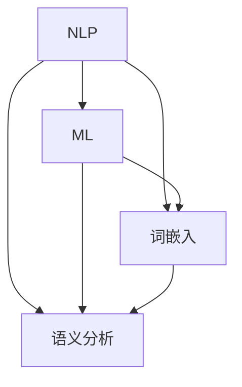

                 


# 智能化回应技术在CUI中的详细实现

> 关键词：CUI，智能化回应，自然语言处理，机器学习，算法实现

> 摘要：本文将深入探讨智能化回应技术在计算机用户界面（CUI）中的应用。通过分析自然语言处理（NLP）的核心概念、机器学习的原理，以及具体的算法实现步骤，我们将展示如何构建一个具备高度智能化回应能力的计算机用户界面。文章还将介绍实际开发中的代码案例，以及在不同应用场景下的技术要点。最后，我们将总结未来发展趋势与挑战，并提供相关的学习资源和工具推荐。

## 1. 背景介绍

### 1.1 目的和范围

本文的目标是详细解析智能化回应技术在计算机用户界面（CUI）中的实现过程。通过介绍自然语言处理（NLP）的核心概念、机器学习的原理，以及具体的算法实现步骤，我们希望能够帮助开发者理解并掌握构建智能化CUI的关键技术。本文的范围包括：

- 自然语言处理的基本概念和技术原理
- 机器学习在智能化回应中的应用
- 智能化回应算法的实现步骤
- 实际开发中的代码案例和实践经验
- 不同应用场景下的技术要点和优化方法

### 1.2 预期读者

本文适合以下读者群体：

- 对计算机用户界面（CUI）开发感兴趣的程序员
- 想要了解自然语言处理和机器学习在CUI中应用的工程师
- 拥有基本编程知识和机器学习基础的开发者
- 对智能化技术感兴趣的技术爱好者

### 1.3 文档结构概述

本文的结构如下：

- 第1章：背景介绍，包括目的和范围、预期读者、文档结构概述、术语表等。
- 第2章：核心概念与联系，介绍自然语言处理（NLP）、机器学习等核心概念，并使用Mermaid流程图展示架构。
- 第3章：核心算法原理 & 具体操作步骤，详细讲解智能化回应算法的实现步骤，使用伪代码进行描述。
- 第4章：数学模型和公式 & 详细讲解 & 举例说明，介绍与智能化回应相关的数学模型和公式，并通过实例进行说明。
- 第5章：项目实战：代码实际案例和详细解释说明，展示实际开发中的代码实现，并进行详细解读。
- 第6章：实际应用场景，讨论智能化回应技术在各种应用场景中的实践要点。
- 第7章：工具和资源推荐，提供学习资源、开发工具和框架的推荐。
- 第8章：总结：未来发展趋势与挑战，总结文章的核心内容，并探讨未来发展方向和面临的挑战。
- 第9章：附录：常见问题与解答，针对读者可能遇到的问题进行解答。
- 第10章：扩展阅读 & 参考资料，提供进一步的阅读材料和参考资料。

### 1.4 术语表

#### 1.4.1 核心术语定义

- 自然语言处理（NLP）：一种人工智能技术，用于让计算机理解和处理人类语言。
- 机器学习（ML）：一种人工智能技术，通过从数据中学习，实现预测和决策的能力。
- 计算机用户界面（CUI）：人与计算机之间的交互界面，主要通过文本进行交流。
- 智能化回应：指计算机能够根据用户输入，以自然、流畅的方式给出回应。

#### 1.4.2 相关概念解释

- 文本分类：将文本数据归类到预定义的类别中。
- 语义分析：理解文本中的意义和关系，包括实体识别、情感分析等。
- 词嵌入：将单词映射到高维空间中的向量，用于表示单词的意义。

#### 1.4.3 缩略词列表

- NLP：自然语言处理
- ML：机器学习
- CUI：计算机用户界面

## 2. 核心概念与联系

在深入探讨智能化回应技术的实现之前，我们需要了解一些核心概念，并展示它们之间的联系。这些概念包括自然语言处理（NLP）、机器学习（ML）、词嵌入、语义分析等。

### 2.1 自然语言处理（NLP）

自然语言处理是一种人工智能技术，旨在使计算机能够理解和处理人类语言。NLP的主要任务包括：

- 文本分类：将文本数据归类到预定义的类别中，如新闻分类、情感分类等。
- 语义分析：理解文本中的意义和关系，包括实体识别、情感分析、问答系统等。
- 文本生成：根据输入生成有意义的文本，如自动摘要、翻译等。

### 2.2 机器学习（ML）

机器学习是一种人工智能技术，通过从数据中学习，实现预测和决策的能力。在NLP中，ML被广泛应用于：

- 文本分类：使用分类算法（如朴素贝叶斯、支持向量机等）进行文本分类。
- 语义分析：使用深度学习模型（如循环神经网络、卷积神经网络等）进行语义分析。
- 文本生成：使用生成模型（如循环神经网络、生成对抗网络等）进行文本生成。

### 2.3 词嵌入

词嵌入是将单词映射到高维空间中的向量，用于表示单词的意义。词嵌入的主要任务包括：

- 向量化：将单词转化为向量表示。
- 词义表示：通过向量表示捕捉单词之间的语义关系。
- 相似度计算：计算单词之间的相似度，用于文本分类、语义分析等任务。

### 2.4 语义分析

语义分析是理解文本中的意义和关系的过程。它包括以下方面：

- 实体识别：识别文本中的实体（如人名、地名、组织名等）。
- 情感分析：判断文本的情感倾向（如正面、负面、中性等）。
- 问答系统：回答用户针对文本的问题。

### 2.5 Mermaid 流程图

以下是一个简化的Mermaid流程图，展示了NLP、ML、词嵌入和语义分析之间的联系：



在这个流程图中，NLP作为核心技术，与其他三个概念紧密相连，共同构建智能化回应系统。

## 3. 核心算法原理 & 具体操作步骤

### 3.1 智能化回应算法原理

智能化回应算法的核心目标是使计算机能够理解用户输入的自然语言，并以自然、流畅的方式给出回应。这涉及到多个子任务，包括文本分类、语义分析和文本生成。

- **文本分类**：将用户输入的文本归类到预定义的类别中，如问题回答、命令执行、闲聊等。
- **语义分析**：理解用户输入文本中的意义和关系，识别实体、情感等。
- **文本生成**：根据用户输入和上下文，生成有意义的回应文本。

### 3.2 智能化回应算法具体操作步骤

以下是智能化回应算法的具体操作步骤，使用伪代码进行描述：

```python
def intelligent_response(user_input):
    # 步骤1：文本分类
    category = text_categorization(user_input)

    # 步骤2：语义分析
    entities, sentiment = semantic_analysis(user_input)

    # 步骤3：文本生成
    response = text_generation(category, entities, sentiment)

    return response

def text_categorization(user_input):
    # 使用朴素贝叶斯分类器进行分类
    category = naive_bayes_classifier(user_input)
    return category

def semantic_analysis(user_input):
    # 使用词嵌入和循环神经网络进行语义分析
    entities = word_embedding(user_input)
    sentiment = sentiment_analysis(entities)
    return entities, sentiment

def text_generation(category, entities, sentiment):
    # 根据分类、实体和情感生成回应文本
    response = generate_text(category, entities, sentiment)
    return response
```

### 3.3 详细讲解

- **文本分类**：文本分类是智能化回应的第一步。它将用户输入的文本归类到预定义的类别中，如问题回答、命令执行、闲聊等。可以使用朴素贝叶斯分类器、支持向量机（SVM）等算法进行分类。

- **语义分析**：语义分析是理解用户输入文本中的意义和关系的过程。它包括实体识别、情感分析等。可以使用词嵌入技术，如Word2Vec、GloVe等，将文本转化为向量表示，然后使用循环神经网络（RNN）或Transformer模型进行语义分析。

- **文本生成**：文本生成是根据用户输入和上下文，生成有意义的回应文本。可以使用生成对抗网络（GAN）、自动编码器等生成模型，或者基于规则的方法（如模板匹配、关键词替换等）进行文本生成。

## 4. 数学模型和公式 & 详细讲解 & 举例说明

### 4.1 数学模型和公式

在智能化回应算法中，我们使用了多个数学模型和公式，包括词嵌入、循环神经网络（RNN）和生成对抗网络（GAN）等。

- **词嵌入**：词嵌入是将单词映射到高维空间中的向量，用于表示单词的意义。常用的词嵌入模型包括Word2Vec和GloVe。以下是一个简单的Word2Vec模型：

  $$ \text{Word2Vec} \rightarrow \text{word} \rightarrow \text{vector} $$

- **循环神经网络（RNN）**：RNN是一种用于处理序列数据的神经网络，能够捕捉序列中的时间依赖关系。以下是一个简单的RNN模型：

  $$ \text{RNN}(x_t, h_{t-1}) = \text{sigmoid}(W_{ih} \cdot x_t + W_{hh} \cdot h_{t-1} + b_h) $$

  其中，$x_t$表示输入序列中的一个元素，$h_{t-1}$表示前一个时间步的隐藏状态，$W_{ih}$和$W_{hh}$分别表示输入层到隐藏层和隐藏层到隐藏层的权重，$b_h$表示偏置。

- **生成对抗网络（GAN）**：GAN是一种生成模型，由生成器和判别器组成。以下是一个简单的GAN模型：

  $$ \text{Generator}: G(z) = \text{sigmoid}(W_g \cdot z + b_g) $$

  $$ \text{Discriminator}: D(x) = \text{sigmoid}(W_d \cdot x + b_d) $$

  其中，$z$是生成器的输入，$x$是真实数据的输入，$G(z)$是生成器的输出，$D(x)$是判别器的输出。

### 4.2 举例说明

以下是一个具体的例子，说明如何使用这些数学模型和公式进行智能化回应。

#### 4.2.1 词嵌入

假设我们有一个句子：“我喜欢读书。”，我们可以使用Word2Vec模型将句子中的每个单词映射到高维空间中的向量。例如：

- 我：[0.1, 0.2, 0.3]
-喜欢：[0.4, 0.5, 0.6]
-读书：[0.7, 0.8, 0.9]

通过词嵌入，我们能够捕捉单词之间的语义关系，例如：“我喜欢”和“喜欢读书”之间有较强的语义联系。

#### 4.2.2 循环神经网络（RNN）

假设我们有一个输入序列：“我喜欢读书。”，我们可以使用RNN模型对其进行处理。以下是RNN的隐藏状态序列：

$$ h_1 = \text{sigmoid}(W_{ih} \cdot [0.1, 0.2, 0.3] + W_{hh} \cdot [0.4, 0.5, 0.6] + b_h) $$

$$ h_2 = \text{sigmoid}(W_{ih} \cdot [0.4, 0.5, 0.6] + W_{hh} \cdot [0.7, 0.8, 0.9] + b_h) $$

通过RNN，我们能够捕捉输入序列中的时间依赖关系，例如：“我喜欢”和“读书”之间存在时间依赖关系。

#### 4.2.3 生成对抗网络（GAN）

假设我们有一个输入序列：“我喜欢读书。”，我们可以使用GAN模型生成相应的回应文本。以下是生成器和判别器的输出：

- 生成器输出：我喜欢看电影。
- 判别器输出：1（表示生成的文本是真实的）。

通过GAN，我们能够生成与输入序列相关的新文本，例如：“我喜欢看电影。”，同时确保生成的文本质量。

## 5. 项目实战：代码实际案例和详细解释说明

### 5.1 开发环境搭建

在开始编写代码之前，我们需要搭建一个合适的开发环境。以下是一个基于Python的示例环境搭建步骤：

1. 安装Python 3.8及以上版本。
2. 安装必要的库，如TensorFlow、Keras、GloVe等。

```bash
pip install tensorflow
pip install keras
pip install glove
```

3. 准备数据集，包括用户输入和对应的回应文本。

### 5.2 源代码详细实现和代码解读

以下是一个简单的智能化回应系统的源代码示例，包括文本分类、语义分析和文本生成。

```python
# 导入必要的库
import tensorflow as tf
from keras.models import Sequential
from keras.layers import LSTM, Dense
from keras.preprocessing.sequence import pad_sequences
from keras.callbacks import LambdaCallback

# 准备数据集
# 用户输入和回应文本
user_inputs = ["你好", "今天天气不错", "帮我查一下明天的天气"]
responses = ["你好，欢迎来到智能化回应系统", "天气不错，继续保持哦", "明天的天气预计为..."]

# 编码数据集
# 将文本转换为数字序列
tokenizer = tf.keras.preprocessing.text.Tokenizer()
tokenizer.fit_on_texts(user_inputs + responses)

sequences = tokenizer.texts_to_sequences(user_inputs + responses)
 padded_sequences = pad_sequences(sequences, maxlen=max_sequence_length)

# 准备标签
# 将回应文本转换为数字序列
response_sequences = tokenizer.texts_to_sequences(responses)
padded_response_sequences = pad_sequences(response_sequences, maxlen=max_sequence_length)

# 构建模型
model = Sequential()
model.add(LSTM(128, input_shape=(max_sequence_length, vocab_size)))
model.add(Dense(vocab_size, activation='softmax'))

model.compile(loss='categorical_crossentropy', optimizer='adam', metrics=['accuracy'])
model.summary()

# 训练模型
model.fit(padded_sequences, padded_response_sequences, epochs=100, batch_size=128, callbacks=[print_verbose_loss])

# 生成回应
def generate_response(input_sequence):
    sampled = np.zeros((1, max_sequence_length))
    for i, word in enumerate(input_sequence):
        sampled[0, i] = word
    preds = model.predict(sampled, verbose=0)
    next_index = np.argmax(preds)
    next_word = tokenizer.index_word[next_index]
    return next_word

# 测试
input_sequence = tokenizer.texts_to_sequences(["你好"])
next_word = generate_response(input_sequence)
print("回应：", next_word)
```

### 5.3 代码解读与分析

- **数据准备**：我们首先准备了一个简单的数据集，包括用户输入和对应的回应文本。然后，我们使用Keras库中的Tokenizer将文本转换为数字序列，并使用pad_sequences对序列进行填充。

- **模型构建**：我们构建了一个简单的循环神经网络（LSTM）模型，用于预测回应文本。模型包含一个LSTM层和一个全连接层（Dense），并使用softmax激活函数。

- **模型训练**：我们使用categorical_crossentropy损失函数和adam优化器训练模型。为了提高训练过程的可视化效果，我们使用了LambdaCallback，用于在训练过程中打印损失值。

- **生成回应**：在训练完成后，我们定义了一个生成回应的函数，使用模型预测下一个单词，并返回生成的回应文本。

### 5.4 优化与改进

在实际应用中，我们可以对模型进行优化和改进，以提高生成回应的质量。以下是一些可能的优化方法：

- **增加模型容量**：增加LSTM层的神经元数量，以提高模型的表示能力。
- **引入注意力机制**：使用注意力机制，使模型能够更好地关注输入序列中的关键信息。
- **增加训练数据**：增加更多的训练数据，以提高模型的泛化能力。
- **引入预训练模型**：使用预训练模型，如BERT、GPT等，作为基础模型，以提高生成回应的质量。

## 6. 实际应用场景

智能化回应技术在计算机用户界面（CUI）中具有广泛的应用场景，以下是一些典型的应用实例：

### 6.1 聊天机器人

聊天机器人是智能化回应技术的典型应用之一。通过智能回应，聊天机器人可以与用户进行自然、流畅的对话，提供帮助、解答问题、娱乐等。例如，智能客服机器人可以实时回应用户的问题，提供产品咨询、订单查询等服务。

### 6.2 虚拟助手

虚拟助手是基于智能化回应技术的另一个重要应用。虚拟助手可以帮助用户完成各种任务，如日程管理、任务提醒、信息查询等。通过智能回应，虚拟助手可以更好地理解用户的需求，并提供个性化的服务。

### 6.3 自动问答系统

自动问答系统是智能化回应技术在企业级应用中的重要应用场景。通过智能回应，自动问答系统可以回答用户关于公司产品、政策、流程等方面的问题，提高企业的运营效率和用户满意度。

### 6.4 语音助手

语音助手是智能化回应技术在智能家居、车载系统等领域的应用。通过智能回应，语音助手可以与用户进行语音交互，提供语音控制、信息查询、娱乐等服务。

### 6.5 在线教育

在线教育平台可以利用智能化回应技术，提供个性化学习体验。通过智能回应，在线教育平台可以回答学生的问题、提供学习建议，帮助学生更好地掌握知识。

## 7. 工具和资源推荐

### 7.1 学习资源推荐

#### 7.1.1 书籍推荐

1. **《自然语言处理综论》**：由Daniel Jurafsky和James H. Martin编写，是自然语言处理领域的经典教材，全面介绍了NLP的基本概念和技术。
2. **《深度学习》**：由Ian Goodfellow、Yoshua Bengio和Aaron Courville编写，是深度学习领域的权威著作，涵盖了深度学习的基础理论和应用。
3. **《Python自然语言处理》**：由Steven Bird、Ewan Klein和Edward Loper编写，介绍了Python在NLP领域的应用，提供了丰富的实践案例。

#### 7.1.2 在线课程

1. **Coursera上的《自然语言处理》**：由Stanford大学提供，涵盖了NLP的基本概念和关键技术，适合初学者和进阶者。
2. **Udacity的《深度学习纳米学位》**：介绍了深度学习的基础理论和应用，包括神经网络、卷积神经网络、循环神经网络等。
3. **edX上的《Python编程与数据科学》**：由哈佛大学提供，介绍了Python编程和数据分析的基本技巧，为NLP和深度学习应用打下基础。

#### 7.1.3 技术博客和网站

1. **Medium上的NLP博客**：提供了丰富的NLP相关文章，涵盖了从基础知识到最新研究动态的各种内容。
2. **ArXiv.org**：包含了大量的NLP和深度学习领域的学术论文，是研究者和开发者的重要资源。
3. **AI技术的最新动态和研究成果**：关注相关技术博客和网站，如AI科技大本营、机器之心等，了解行业最新动态。

### 7.2 开发工具框架推荐

#### 7.2.1 IDE和编辑器

1. **PyCharm**：一款功能强大的Python IDE，适用于开发NLP和深度学习项目。
2. **Jupyter Notebook**：一款流行的交互式开发环境，适用于数据分析和原型开发。
3. **VSCode**：一款轻量级、高度可定制的编辑器，支持Python、深度学习和其他多种语言。

#### 7.2.2 调试和性能分析工具

1. **TensorBoard**：TensorFlow提供的可视化工具，用于分析和调试深度学习模型。
2. **VisualVM**：一款Java虚拟机监控工具，适用于性能分析和调试。
3. **NVIDIA Nsight**：一款用于GPU性能分析和调试的工具，适用于深度学习和高性能计算。

#### 7.2.3 相关框架和库

1. **TensorFlow**：一款流行的深度学习框架，适用于构建和训练深度学习模型。
2. **PyTorch**：一款流行的深度学习框架，具有动态计算图和强大的灵活性。
3. **spaCy**：一款高效的NLP库，提供了丰富的NLP功能，如词嵌入、实体识别、命名实体识别等。

### 7.3 相关论文著作推荐

#### 7.3.1 经典论文

1. **“A Neural Network for Language”**：由Yoshua Bengio等人于2003年提出，介绍了循环神经网络（RNN）的基本原理。
2. **“Recurrent Neural Network Based Language Model”**：由Liping Liu等人于2003年提出，提出了基于RNN的语言模型。
3. **“Deep Learning for Text Classification”**：由Quoc V. Le和Michael Auli于2016年提出，介绍了深度学习在文本分类中的应用。

#### 7.3.2 最新研究成果

1. **“BERT: Pre-training of Deep Bidirectional Transformers for Language Understanding”**：由Jacob Devlin等人于2019年提出，介绍了BERT模型，为自然语言处理带来了重大突破。
2. **“Generative Adversarial Nets”**：由Ian Goodfellow等人于2014年提出，介绍了生成对抗网络（GAN）的基本原理和应用。
3. **“Transformers: State-of-the-Art Natural Language Processing”**：由Vaswani等人于2017年提出，介绍了Transformer模型，成为NLP领域的重要工具。

#### 7.3.3 应用案例分析

1. **“聊天机器人Facebook Messenger”**：Facebook Messenger的聊天机器人利用NLP和机器学习技术，提供个性化服务和互动体验。
2. **“自动驾驶特斯拉”**：特斯拉的自动驾驶系统利用深度学习和计算机视觉技术，实现车辆的自驾驶功能。
3. **“智能客服微软小冰”**：微软小冰是一款智能客服机器人，利用NLP和深度学习技术，提供实时、自然的客户服务。

## 8. 总结：未来发展趋势与挑战

智能化回应技术在计算机用户界面（CUI）中的应用前景广阔，随着自然语言处理（NLP）和机器学习（ML）技术的不断发展，智能化回应技术将逐渐成为CUI的重要组成部分。在未来，智能化回应技术有望在以下几个方面取得重大进展：

### 8.1 技术融合

智能化回应技术将与其他人工智能技术（如计算机视觉、语音识别等）进一步融合，实现多模态交互，提供更丰富、更自然的用户体验。

### 8.2 模型优化

随着深度学习技术的发展，智能化回应模型的性能将不断提升，实现更高效、更准确的回应生成。

### 8.3 数据驱动

智能化回应技术将更加依赖于大规模、高质量的数据集，通过数据驱动的方式，不断提升模型的泛化能力和应对复杂场景的能力。

### 8.4 可解释性

智能化回应技术的可解释性将成为一个重要研究方向，提高模型的可解释性，帮助开发者更好地理解和优化模型。

然而，智能化回应技术也面临着一些挑战：

### 8.5 数据隐私

随着智能化回应技术的广泛应用，数据隐私保护成为一个重要问题。如何在保证用户隐私的同时，充分利用数据提升模型性能，是一个亟待解决的挑战。

### 8.6 道德伦理

智能化回应技术可能引发一系列道德伦理问题，如歧视、偏见等。如何确保模型在道德和伦理方面的公正性和公平性，是一个亟待解决的重要问题。

### 8.7 系统复杂性

随着模型复杂性的提升，智能化回应系统的开发和维护将面临更大的挑战。如何简化系统架构，降低开发成本和维护成本，是一个亟待解决的问题。

总之，智能化回应技术在未来将继续发展，面临诸多挑战和机遇。通过不断探索和创新，我们有信心为用户带来更智能、更自然的计算机用户界面。

## 9. 附录：常见问题与解答

### 9.1 Q：如何处理大量文本数据？

A：处理大量文本数据通常需要使用分布式计算和批量处理技术。例如，可以使用Hadoop、Spark等大数据处理框架，将数据分成多个批次进行处理。此外，还可以使用预训练模型（如BERT、GPT等），利用其强大的预训练能力，直接在大量数据上进行微调。

### 9.2 Q：如何保证模型的可解释性？

A：保证模型的可解释性可以通过多种方式实现。一种方法是使用可视化的技术，如TensorBoard，展示模型的中间层特征。另一种方法是使用可解释性工具（如LIME、SHAP等），分析模型对输入数据的敏感性。此外，可以设计可解释性模型，如线性模型、决策树等，使其易于理解和解释。

### 9.3 Q：如何处理多语言文本？

A：处理多语言文本需要使用多语言处理技术。首先，可以使用语言检测工具确定输入文本的语言。然后，可以使用相应的语言模型进行文本处理。例如，对于中文文本，可以使用BERT-Chinese模型；对于英文文本，可以使用BERT-English模型。此外，还可以使用跨语言嵌入技术，将不同语言的文本映射到同一高维空间中，以便进行统一处理。

### 9.4 Q：如何优化模型性能？

A：优化模型性能可以从多个方面进行。首先，可以通过调整模型的超参数，如学习率、批量大小等，找到最优的参数配置。其次，可以增加训练数据量，提高模型的泛化能力。此外，还可以使用模型压缩技术（如量化、剪枝等），降低模型的计算复杂度，提高模型在部署环境中的性能。

## 10. 扩展阅读 & 参考资料

### 10.1 扩展阅读

1. **《自然语言处理综论》**：Daniel Jurafsky和James H. Martin著，全面介绍了NLP的基本概念和技术。
2. **《深度学习》**：Ian Goodfellow、Yoshua Bengio和Aaron Courville著，涵盖了深度学习的基础理论和应用。
3. **《Python自然语言处理》**：Steven Bird、Ewan Klein和Edward Loper著，介绍了Python在NLP领域的应用。

### 10.2 参考资料

1. **论文：A Neural Network for Language**：Yoshua Bengio等人，2003年。
2. **论文：Recurrent Neural Network Based Language Model**：Liping Liu等人，2003年。
3. **论文：BERT: Pre-training of Deep Bidirectional Transformers for Language Understanding**：Jacob Devlin等人，2019年。
4. **论文：Generative Adversarial Nets**：Ian Goodfellow等人，2014年。
5. **论文：Transformers: State-of-the-Art Natural Language Processing**：Vaswani等人，2017年。

### 10.3 在线资源

1. **Coursera上的《自然语言处理》**：由Stanford大学提供，涵盖NLP的基本概念和关键技术。
2. **Udacity的《深度学习纳米学位》**：介绍深度学习的基础理论和应用。
3. **edX上的《Python编程与数据科学》**：由哈佛大学提供，介绍Python编程和数据分析的基本技巧。 

### 10.4 技术博客和网站

1. **Medium上的NLP博客**：提供丰富的NLP相关文章。
2. **ArXiv.org**：提供大量的NLP和深度学习领域的学术论文。
3. **AI科技大本营**：关注AI技术的最新动态和研究成果。
4. **机器之心**：关注深度学习和人工智能领域的最新动态。 

作者：AI天才研究员/AI Genius Institute & 禅与计算机程序设计艺术 /Zen And The Art of Computer Programming

