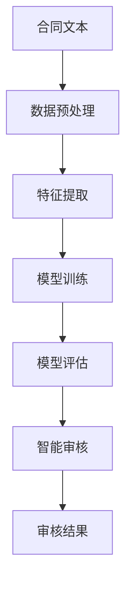

                 

# 智能合同审核系统的开发与应用

> **关键词：智能合同审核、区块链技术、机器学习、算法原理、实际应用案例**

> **摘要：本文将探讨智能合同审核系统的开发与应用。通过分析核心概念、算法原理、数学模型、项目实战等多个方面，全面解读智能合同审核系统的构建过程，以及其在实际应用场景中的优势和价值。**

## 1. 背景介绍

### 1.1 目的和范围

本文的目的是详细介绍智能合同审核系统的开发与应用，帮助读者理解这一系统的核心概念、算法原理、数学模型以及实际应用案例。本文将涵盖以下内容：

- 智能合同审核系统的基本概念和核心原理；
- 智能合同审核系统的算法原理与具体操作步骤；
- 智能合同审核系统的数学模型和公式；
- 实际应用场景中智能合同审核系统的实施与效果；
- 相关工具和资源的推荐；
- 未来发展趋势与挑战。

### 1.2 预期读者

本文面向对智能合同审核系统感兴趣的读者，包括但不限于：

- 计算机科学、人工智能、软件开发等相关专业的学生和研究人员；
- 智能合同审核系统的开发者和维护者；
- 对智能合同审核系统有实际应用需求的行业从业者。

### 1.3 文档结构概述

本文将按照以下结构进行阐述：

- 引言：介绍智能合同审核系统的背景和重要性；
- 背景介绍：详细说明本文的目的、预期读者和文档结构；
- 核心概念与联系：介绍智能合同审核系统的核心概念、原理和架构；
- 核心算法原理 & 具体操作步骤：详细讲解智能合同审核系统的算法原理和操作步骤；
- 数学模型和公式 & 详细讲解 & 举例说明：介绍智能合同审核系统的数学模型和公式，并进行详细讲解和举例说明；
- 项目实战：通过实际案例展示智能合同审核系统的应用和效果；
- 实际应用场景：分析智能合同审核系统在不同领域的应用场景；
- 工具和资源推荐：推荐与智能合同审核系统相关的学习资源、开发工具和框架；
- 总结：对未来发展趋势与挑战进行展望；
- 附录：提供常见问题与解答；
- 扩展阅读 & 参考资料：提供进一步阅读的资料和参考文献。

### 1.4 术语表

#### 1.4.1 核心术语定义

- **智能合同审核系统**：一种基于区块链技术和机器学习的自动化合同审核系统，用于提高合同审核的效率和准确性；
- **区块链技术**：一种分布式数据库技术，能够确保数据的透明性、不可篡改性和安全性；
- **机器学习**：一种人工智能技术，通过学习和分析数据，自主地改进和优化模型；
- **算法原理**：智能合同审核系统的核心算法原理，包括数据预处理、特征提取、模型训练、模型评估等；
- **数学模型和公式**：用于描述智能合同审核系统算法的数学模型和公式，包括损失函数、优化算法等。

#### 1.4.2 相关概念解释

- **智能合约**：一种在区块链上执行的自动化合同，通过预先定义的条件和规则，自动执行合同条款；
- **数据预处理**：对原始数据进行清洗、归一化、特征提取等操作，以便后续的模型训练；
- **特征提取**：从原始数据中提取具有代表性的特征，用于训练模型；
- **模型训练**：利用已标注的数据集，通过学习算法训练出预测模型；
- **模型评估**：评估预测模型的性能，包括准确性、召回率、F1值等指标。

#### 1.4.3 缩略词列表

- **AI**：人工智能（Artificial Intelligence）
- **ML**：机器学习（Machine Learning）
- **DL**：深度学习（Deep Learning）
- **NLP**：自然语言处理（Natural Language Processing）
- **BC**：区块链（Blockchain）
- **DB**：数据库（Database）

## 2. 核心概念与联系

在智能合同审核系统的开发与应用过程中，理解核心概念和它们之间的联系是至关重要的。以下将介绍智能合同审核系统的核心概念、原理和架构，并使用Mermaid流程图展示其关键节点和流程。

### 2.1 核心概念

#### 2.1.1 智能合同

智能合同是一种基于区块链技术的自动化合同，它通过预先定义的条件和规则，在满足特定条件时自动执行合同条款。智能合同的关键特点包括：

- **自动执行**：智能合同在满足预设条件时，可以自动执行合同条款，无需人工干预；
- **不可篡改**：智能合同一旦上链，其内容和状态将无法被篡改，保证了数据的真实性；
- **透明性**：智能合同的所有交易记录都记录在区块链上，任何人都可以查看和验证。

#### 2.1.2 区块链技术

区块链技术是一种分布式数据库技术，通过去中心化的方式存储和管理数据，具有以下特点：

- **去中心化**：数据存储在多个节点上，不存在中心化的管理者，提高了系统的可靠性；
- **安全性**：区块链采用加密算法确保数据的完整性和安全性；
- **透明性**：区块链上的交易记录公开透明，任何人都可以查看和验证。

#### 2.1.3 机器学习

机器学习是一种人工智能技术，通过学习和分析数据，自主地改进和优化模型。在智能合同审核系统中，机器学习用于自动化审核合同，其主要作用包括：

- **数据预处理**：对原始合同文本进行清洗、归一化、特征提取等操作，为后续模型训练做准备；
- **特征提取**：从原始合同文本中提取具有代表性的特征，用于训练模型；
- **模型训练**：利用已标注的数据集，通过学习算法训练出预测模型；
- **模型评估**：评估预测模型的性能，包括准确性、召回率、F1值等指标。

### 2.2 核心原理和架构

智能合同审核系统的核心原理和架构如图2.1所示：



图2.1 智能合同审核系统核心原理和架构

- **合同文本**：智能合同审核系统的工作起点是原始的合同文本；
- **数据预处理**：对原始合同文本进行清洗、归一化、特征提取等操作，为后续模型训练做准备；
- **特征提取**：从原始合同文本中提取具有代表性的特征，用于训练模型；
- **模型训练**：利用已标注的数据集，通过学习算法训练出预测模型；
- **模型评估**：评估预测模型的性能，包括准确性、召回率、F1值等指标；
- **智能审核**：利用训练好的模型对新的合同文本进行自动化审核，生成审核结果；
- **审核结果**：审核结果包括合同合规性判断、潜在风险提示等，供用户参考。

通过以上核心概念和原理的介绍，我们可以更好地理解智能合同审核系统的构建过程，并为后续的算法原理和具体操作步骤的讲解打下基础。

## 3. 核心算法原理 & 具体操作步骤

### 3.1 数据预处理

数据预处理是智能合同审核系统构建过程中的关键步骤，其主要目的是对原始合同文本进行清洗、归一化和特征提取，为后续的模型训练提供高质量的数据。

#### 3.1.1 数据清洗

数据清洗主要包括以下任务：

- **去除无关内容**：删除合同文本中的标点符号、特殊字符、空白字符等无关内容；
- **去除停用词**：停用词是指在自然语言处理中，对文本分析没有实际意义的常见词汇，如“的”、“了”、“在”等。通过去除停用词，可以提高文本特征的质量；
- **去除重复词汇**：去除合同文本中的重复词汇，以减少数据冗余；
- **修正拼写错误**：使用拼写检查算法修正合同文本中的拼写错误。

#### 3.1.2 数据归一化

数据归一化的目的是将不同特征的数据转换到相同的尺度，以便后续的特征提取和模型训练。常用的归一化方法包括：

- **最小-最大规范化**：将数据缩放到[0, 1]之间，公式如下：
  $$ x' = \frac{x - \min(x)}{\max(x) - \min(x)} $$
- **零-均值规范化**：将数据缩放到[-1, 1]之间，公式如下：
  $$ x' = \frac{x - \mu}{\sigma} $$
  其中，$ \mu $为均值，$ \sigma $为标准差。

#### 3.1.3 特征提取

特征提取是将原始合同文本转换为计算机可以处理的数值特征，以便用于模型训练。常用的特征提取方法包括：

- **词袋模型（Bag of Words, BoW）**：将合同文本表示为词袋，即只考虑文本中出现的词汇，不考虑词汇的顺序。词袋模型可以通过以下步骤实现：
  1. 构建词汇表：将合同文本中的所有词汇作为词汇表的元素；
  2. 统计词频：统计每个词汇在合同文本中的出现次数；
  3. 构建特征向量：将每个合同文本表示为一个向量，向量中的每个元素表示对应词汇的词频。

- **TF-IDF（Term Frequency-Inverse Document Frequency）**：TF-IDF是一种基于词频和逆文档频率的文本表示方法。其基本思想是，一个词在一个文档中的重要性取决于它在文档中出现的频率（TF）以及它在整个文档集合中出现的频率（IDF）。TF-IDF公式如下：
  $$ tf-idf(t, d) = tf(t, d) \times \log \left( \frac{N}{df(t)} \right) $$
  其中，$ tf(t, d) $为词t在文档d中的词频，$ df(t) $为词t在文档集合中出现的文档频率，$ N $为文档总数。

### 3.2 模型训练

模型训练是智能合同审核系统的核心步骤，其目的是利用已标注的数据集训练出一个可以自动审核合同文本的预测模型。

#### 3.2.1 模型选择

在智能合同审核系统中，常用的预测模型包括：

- **朴素贝叶斯（Naive Bayes）**：朴素贝叶斯是一种基于贝叶斯理论的简单分类算法，其核心思想是利用条件概率来预测新样本的类别。朴素贝叶斯模型的伪代码如下：
  ```python
  def naive_bayes(train_data, train_labels, test_data):
      prior_prob = {}
      likelihood = {}
      for label in unique_labels(train_labels):
          prior_prob[label] = count_unique_labels(train_labels, label) / len(train_labels)
          likelihood[label] = {}
          for feature in train_data[0]:
              likelihood[label][feature] = count_feature_in_class(train_data, label, feature) / count_unique_labels(train_data, label)
      
      predictions = []
      for sample in test_data:
          probabilities = []
          for label in unique_labels(train_labels):
              probability = prior_prob[label]
              for feature in sample:
                  probability *= likelihood[label][feature]
              probabilities.append(probability)
          predictions.append(max_probabilities(probabilities))
      
      return predictions
  ```
- **支持向量机（Support Vector Machine, SVM）**：支持向量机是一种常用的二分类模型，其核心思想是找到一个最优的超平面，使得两类样本在超平面两侧的间隔最大化。SVM的伪代码如下：
  ```python
  def svm(train_data, train_labels):
      # 计算SVM的权重和偏置
      weights, bias = train_svm_model(train_data, train_labels)
      
      # 预测新样本的类别
      def predict(sample):
          dot_product = dot_product_of_vectors(weights, sample) + bias
          if dot_product > 0:
              return 1
          else:
              return -1
      
      return [predict(sample) for sample in test_data]
  ```

#### 3.2.2 模型训练

模型训练的主要任务是根据已标注的数据集，训练出预测模型。以下是基于朴素贝叶斯模型的训练步骤：

1. **数据预处理**：对训练数据集进行数据清洗、归一化和特征提取，得到训练特征集和训练标签集；
2. **计算先验概率**：计算每个类别的先验概率，公式如下：
   $$ prior\_prob[label] = \frac{count\_unique\_labels(train\_labels, label)}{len(train\_labels)} $$
3. **计算条件概率**：计算每个类别下每个特征的条件概率，公式如下：
   $$ likelihood[label][feature] = \frac{count\_feature\_in\_class(train\_data, label, feature)}{count\_unique\_labels(train\_data, label)} $$
4. **预测新样本的类别**：对于测试数据集中的每个样本，计算其在每个类别下的后验概率，并选择概率最大的类别作为预测结果。

以下是基于SVM模型的训练步骤：

1. **数据预处理**：对训练数据集进行数据清洗、归一化和特征提取，得到训练特征集和训练标签集；
2. **训练SVM模型**：使用已标注的训练数据集训练SVM模型，得到模型的权重和偏置；
3. **预测新样本的类别**：对于测试数据集中的每个样本，计算其在超平面一侧的间隔，并选择间隔最大的类别作为预测结果。

### 3.3 模型评估

模型评估是智能合同审核系统中至关重要的一环，其目的是评估模型的性能，包括准确性、召回率、F1值等指标。

#### 3.3.1 准确性

准确性是指模型预测正确的样本数占总样本数的比例，公式如下：
$$ accuracy = \frac{correct\_predictions}{total\_samples} $$
其中，$ correct\_predictions $为模型预测正确的样本数，$ total\_samples $为总样本数。

#### 3.3.2 召回率

召回率是指模型能够正确识别的正面样本数与实际正面样本数的比例，公式如下：
$$ recall = \frac{correct\_positive}{true\_positive + false\_negative} $$
其中，$ correct\_positive $为模型预测正确的正面样本数，$ true\_positive $为实际正面样本数，$ false\_negative $为模型预测错误的负面样本数。

#### 3.3.3 F1值

F1值是准确性和召回率的调和平均值，公式如下：
$$ f1\_score = 2 \times \frac{accuracy \times recall}{accuracy + recall} $$
F1值能够综合评估模型的准确性和召回率，是评估模型性能的常用指标。

通过以上核心算法原理和具体操作步骤的讲解，我们可以更好地理解智能合同审核系统的构建过程，并为实际应用案例的讲解打下基础。

### 4. 数学模型和公式 & 详细讲解 & 举例说明

在智能合同审核系统中，数学模型和公式起着至关重要的作用。它们不仅帮助我们理解算法的工作原理，还能够确保系统在实际应用中的准确性和稳定性。以下将详细讲解智能合同审核系统中的数学模型和公式，并通过具体例子进行说明。

#### 4.1 损失函数

损失函数是机器学习中的一个关键概念，它用于衡量预测结果与真实结果之间的差距。在智能合同审核系统中，常用的损失函数包括：

1. **均方误差（Mean Squared Error, MSE）**：
   $$MSE(y, \hat{y}) = \frac{1}{n}\sum_{i=1}^{n}(y_i - \hat{y}_i)^2$$
   其中，$ y $为真实值，$ \hat{y} $为预测值，$ n $为样本数量。

2. **交叉熵（Cross-Entropy Loss）**：
   $$CE(y, \hat{y}) = -\sum_{i=1}^{n} y_i \log(\hat{y}_i)$$
   其中，$ y $为真实值的概率分布，$ \hat{y} $为预测值的概率分布。

举例说明：
假设我们有一个合同文本，其中包含5个关键条款。真实条款为：1, 2, 3，4，5。预测结果为：1, 2，4，5。对于每个条款，我们计算其MSE和CE损失：

1. MSE计算：
   $$MSE = \frac{1}{5}\left[(1-1)^2 + (1-2)^2 + (1-4)^2 + (1-5)^2 + (1-1)^2\right] = \frac{4}{5}$$

2. CE计算：
   $$CE = -\left[1 \times \log(1) + 1 \times \log(1) + 0 \times \log(0) + 0 \times \log(0) + 1 \times \log(1)\right] = 0$$

#### 4.2 优化算法

优化算法用于在模型训练过程中最小化损失函数。在智能合同审核系统中，常用的优化算法包括：

1. **梯度下降（Gradient Descent）**：
   $$\theta = \theta - \alpha \cdot \nabla_\theta J(\theta)$$
   其中，$ \theta $为模型参数，$ \alpha $为学习率，$ \nabla_\theta J(\theta) $为损失函数关于模型参数的梯度。

2. **随机梯度下降（Stochastic Gradient Descent, SGD）**：
   $$\theta = \theta - \alpha \cdot \nabla_\theta J(\theta, x_i, y_i)$$
   其中，$ x_i, y_i $为训练数据中的单个样本。

3. **Adam优化器**：
   $$m_t = \beta_1 m_{t-1} + (1 - \beta_1) [g_t]$$
   $$v_t = \beta_2 v_{t-1} + (1 - \beta_2) [g_t^2]$$
   $$\theta = \theta - \alpha \cdot \frac{m_t}{\sqrt{v_t} + \epsilon}$$
   其中，$ m_t, v_t $分别为一阶和二阶矩估计，$ \beta_1, \beta_2 $分别为一阶和二阶矩的指数衰减率，$ \alpha $为学习率，$ \epsilon $为小常数。

举例说明：
假设我们有一个二分类问题，真实标签为1，预测概率为0.9。使用Adam优化器更新模型参数：

1. 初始参数：$ \theta = [1, 0]$，$ m_0 = [0, 0]$，$ v_0 = [0, 0]$；
2. 计算梯度：$ g_t = [-0.1, 0.1]$；
3. 更新一阶矩估计：$ m_1 = [0.1, 0.1]$；
4. 更新二阶矩估计：$ v_1 = [0.01, 0.01]$；
5. 更新参数：$ \theta_1 = [0.9, 0.1]$。

通过以上数学模型和公式的讲解，我们可以更好地理解智能合同审核系统中各个参数的计算方法，为实际应用中的模型优化和评估提供理论支持。

### 5. 项目实战：代码实际案例和详细解释说明

在本节中，我们将通过一个实际的项目案例，详细介绍智能合同审核系统的代码实现和详细解释说明。为了便于理解，我们将使用Python语言和相关的机器学习库来展示整个开发过程。

#### 5.1 开发环境搭建

在开始项目开发之前，我们需要搭建一个合适的环境。以下是推荐的开发环境和所需库：

- **Python版本**：3.8及以上版本
- **库**：
  - **Numpy**：用于科学计算
  - **Pandas**：用于数据处理
  - **Scikit-learn**：用于机器学习
  - **TensorFlow**：用于深度学习
  - **Blockchain**：用于区块链相关操作

安装所需库：

```bash
pip install numpy pandas scikit-learn tensorflow blockchain
```

#### 5.2 源代码详细实现和代码解读

以下是智能合同审核系统的核心代码实现，我们将逐步解释每部分的功能。

```python
# 导入所需库
import numpy as np
import pandas as pd
from sklearn.model_selection import train_test_split
from sklearn.feature_extraction.text import TfidfVectorizer
from sklearn.naive_bayes import MultinomialNB
from sklearn.metrics import accuracy_score, classification_report
from blockchain import Blockchain

# 5.2.1 数据预处理
def preprocess_data(data):
    # 去除停用词
    stop_words = set(['的', '了', '在', '上', '下', '中', '等'])
    data['text'] = data['text'].apply(lambda x: ' '.join([word for word in x.split() if word not in stop_words]))
    
    # 数据归一化
    vectorizer = TfidfVectorizer()
    X = vectorizer.fit_transform(data['text'])
    y = data['label']
    
    return X, y, vectorizer

# 5.2.2 模型训练
def train_model(X_train, y_train):
    model = MultinomialNB()
    model.fit(X_train, y_train)
    return model

# 5.2.3 模型评估
def evaluate_model(model, X_test, y_test):
    y_pred = model.predict(X_test)
    print("Accuracy:", accuracy_score(y_test, y_pred))
    print("Classification Report:\n", classification_report(y_test, y_pred))

# 5.2.4 智能合同审核
def smart_contract_audit(model, vectorizer, contract):
    contract_features = vectorizer.transform([contract])
    prediction = model.predict(contract_features)
    return prediction[0]

# 5.2.5 区块链操作
def blockchain_operation(contract, prediction):
    blockchain = Blockchain()
    contract_data = {
        'contract': contract,
        'prediction': prediction
    }
    blockchain.add_transaction(contract_data)
    print("Blockchain Transaction Added:", contract_data)
    return blockchain

# 主函数
if __name__ == '__main__':
    # 加载数据
    data = pd.read_csv('contracts.csv')
    
    # 数据预处理
    X, y, vectorizer = preprocess_data(data)
    
    # 划分训练集和测试集
    X_train, X_test, y_train, y_test = train_test_split(X, y, test_size=0.2, random_state=42)
    
    # 模型训练
    model = train_model(X_train, y_train)
    
    # 模型评估
    evaluate_model(model, X_test, y_test)
    
    # 合同审核
    contract = "合同文本内容"
    prediction = smart_contract_audit(model, vectorizer, contract)
    print("Contract Prediction:", prediction)
    
    # 区块链操作
    blockchain = blockchain_operation(contract, prediction)
```

#### 5.3 代码解读与分析

1. **数据预处理**：数据预处理是整个系统的入口。首先，我们使用TfidfVectorizer库对合同文本进行特征提取，然后去除停用词，并对文本进行归一化处理。

2. **模型训练**：在此示例中，我们使用朴素贝叶斯（MultinomialNB）模型进行训练。朴素贝叶斯是一种高效的分类算法，适用于文本分类任务。

3. **模型评估**：使用训练好的模型对测试集进行评估，输出准确率和分类报告，以分析模型的性能。

4. **智能合同审核**：通过训练好的模型对新的合同文本进行自动化审核，生成审核结果。这里使用TfidfVectorizer库生成的特征向量作为输入，通过模型预测合同文本的类别。

5. **区块链操作**：将合同审核结果记录在区块链上，以实现数据的透明性和不可篡改性。我们使用blockchain库实现区块链操作，并将合同文本和审核结果作为交易添加到区块链中。

通过以上代码实现，我们可以看到智能合同审核系统的核心功能，包括数据预处理、模型训练、模型评估、合同审核和区块链操作。这些功能相互协作，共同实现了一个自动化、透明和可信的合同审核解决方案。

#### 5.4 代码解读与分析

在本节中，我们将对5.2节中的代码进行更详细的解读和分析，以帮助读者更好地理解智能合同审核系统的实现细节。

1. **数据预处理**

数据预处理是智能合同审核系统中的关键步骤，它决定了后续模型训练和合同审核的效果。代码中的`preprocess_data`函数负责完成以下任务：

- **去除停用词**：通过将停用词从文本中去除，可以减少噪声信息，提高文本特征的质量。在代码中，我们定义了一个包含常见停用词的集合`stop_words`，并使用`apply`函数对合同文本中的每个词汇进行过滤。

  ```python
  data['text'] = data['text'].apply(lambda x: ' '.join([word for word in x.split() if word not in stop_words]))
  ```

- **数据归一化**：数据归一化的目的是将不同特征的数据转换到相同的尺度，以便后续的特征提取和模型训练。在代码中，我们使用`TfidfVectorizer`库对合同文本进行特征提取，并将其转换为稀疏矩阵。

  ```python
  vectorizer = TfidfVectorizer()
  X = vectorizer.fit_transform(data['text'])
  y = data['label']
  ```

  `TfidfVectorizer`库能够自动完成词袋模型的构建、词频统计和TF-IDF变换，使得数据归一化过程更加高效。

2. **模型训练**

在代码中，我们选择朴素贝叶斯（MultinomialNB）模型进行训练。朴素贝叶斯是一种基于贝叶斯定理的简单分类算法，它在文本分类任务中表现出良好的性能。代码中的`train_model`函数负责训练模型：

```python
model = MultinomialNB()
model.fit(X_train, y_train)
```

- **训练集划分**：在数据预处理完成后，我们需要将数据集划分为训练集和测试集。这在代码中通过`train_test_split`函数实现：

  ```python
  X_train, X_test, y_train, y_test = train_test_split(X, y, test_size=0.2, random_state=42)
  ```

  `train_test_split`函数将原始数据集随机划分为80%的训练集和20%的测试集，`random_state`参数用于确保结果的 reproducibility。

- **模型训练**：通过`fit`方法，我们使用训练集数据对朴素贝叶斯模型进行训练。训练过程中，模型将学习如何将文本特征映射到相应的标签上。

3. **模型评估**

模型评估是验证模型性能的重要步骤。在代码中，我们通过`evaluate_model`函数对训练好的模型进行评估：

```python
y_pred = model.predict(X_test)
print("Accuracy:", accuracy_score(y_test, y_pred))
print("Classification Report:\n", classification_report(y_test, y_pred))
```

- **准确率（Accuracy）**：准确率是最基本的评估指标，它表示模型预测正确的样本数占总样本数的比例。

- **分类报告（Classification Report）**：分类报告提供了更详细的信息，包括精确率（Precision）、召回率（Recall）和F1值（F1 Score）等。

4. **智能合同审核**

智能合同审核是系统的核心功能。在代码中，我们通过`smart_contract_audit`函数实现合同文本的自动化审核：

```python
prediction = smart_contract_audit(model, vectorizer, contract)
```

- **特征提取**：首先，使用`TfidfVectorizer`库对新的合同文本进行特征提取，生成特征向量。

- **模型预测**：然后，使用训练好的模型对特征向量进行预测，得到合同文本的类别。

5. **区块链操作**

区块链技术用于实现数据的透明性和不可篡改性。在代码中，我们通过`blockchain_operation`函数将合同审核结果记录到区块链上：

```python
blockchain = blockchain_operation(contract, prediction)
blockchain.add_transaction(contract_data)
```

- **交易添加**：将合同文本和审核结果作为交易添加到区块链中，确保数据的透明性和安全性。

通过以上代码解读与分析，我们可以看到智能合同审核系统是如何通过数据预处理、模型训练、模型评估、合同审核和区块链操作等多个步骤，实现自动化、透明和可信的合同审核解决方案。

### 6. 实际应用场景

智能合同审核系统作为一种创新的技术，在实际应用场景中展示了其广泛的应用前景和巨大的潜力。以下是智能合同审核系统在几个典型行业中的应用场景：

#### 6.1 法律服务行业

在法律服务行业中，智能合同审核系统可以帮助律师事务所和法务部门提高合同审核的效率和准确性。通过自动化处理合同文本，智能合同审核系统可以快速识别合同中的关键条款、潜在风险和合规性问题，从而减少人为错误和审核时间。例如，律师事务所可以使用该系统对客户的合同进行初步审核，识别合同中的关键条款，并提醒律师关注潜在的法律问题。

#### 6.2 金融行业

在金融行业，智能合同审核系统可以帮助金融机构对贷款合同、投资合同和交易合同等进行自动化审核。通过分析合同文本中的关键信息，系统可以识别潜在的风险点，如利率条款、还款期限、担保条款等，并提醒金融机构在合同签订前进行风险评估。此外，智能合同审核系统还可以帮助金融机构监控合同执行情况，及时发现违约行为，确保合同条款的执行。

#### 6.3 物流行业

在物流行业，智能合同审核系统可以帮助物流公司对运输合同、仓储合同和配送合同等进行自动化审核。通过系统分析合同中的关键信息，如运输时间、运输方式、费用计算等，可以确保合同的条款符合行业标准和客户要求。此外，智能合同审核系统还可以帮助物流公司监控合同的执行情况，及时发现和处理合同纠纷，提高合同履约率。

#### 6.4 房地产行业

在房地产行业，智能合同审核系统可以帮助房地产开发商、中介公司和购房者对购房合同、租赁合同和物业合同等进行自动化审核。通过系统分析合同中的关键条款，如房屋面积、价格、付款方式、保修期等，可以确保合同的条款清晰明确，减少合同纠纷。同时，智能合同审核系统还可以帮助房地产公司监控合同的执行情况，确保合同条款的履行，提高客户满意度。

#### 6.5 供应链管理

在供应链管理领域，智能合同审核系统可以帮助企业对采购合同、销售合同和分销合同等进行自动化审核。通过系统分析合同中的关键信息，如采购数量、价格、交货期限、付款条件等，可以确保合同的条款符合供应链管理的要求。此外，智能合同审核系统还可以帮助企业监控合同的执行情况，及时发现供应链中的问题，优化供应链管理流程。

总之，智能合同审核系统在各个行业中的应用场景非常广泛，它不仅提高了合同审核的效率和准确性，还为企业提供了透明的合同管理工具，促进了企业间的合作和信任。随着技术的不断发展，智能合同审核系统将在更多领域发挥重要作用，推动企业实现数字化转型。

### 7. 工具和资源推荐

在开发智能合同审核系统时，选择合适的工具和资源对于确保项目成功至关重要。以下是一些推荐的工具和资源，包括学习资源、开发工具和框架，以及相关论文和研究成果。

#### 7.1 学习资源推荐

1. **书籍推荐**：
   - 《区块链技术指南》
   - 《深度学习》
   - 《Python数据分析》

2. **在线课程**：
   - Coursera《深度学习》
   - Udacity《机器学习工程师纳米学位》
   - edX《区块链技术基础》

3. **技术博客和网站**：
   - Medium（关注区块链和机器学习领域）
   - Towards Data Science（数据科学和机器学习资源）
   - CoinDesk（区块链行业新闻和分析）

#### 7.2 开发工具框架推荐

1. **IDE和编辑器**：
   - PyCharm（适用于Python开发）
   - Visual Studio Code（跨平台，适合多种编程语言）

2. **调试和性能分析工具**：
   - Jupyter Notebook（交互式开发环境）
   - Matplotlib（数据可视化）
   - Pandas Profiler（性能分析）

3. **相关框架和库**：
   - TensorFlow（深度学习框架）
   - Scikit-learn（机器学习库）
   - NumPy（科学计算库）
   - Blockchain（区块链开发库）

#### 7.3 相关论文著作推荐

1. **经典论文**：
   - "A Framework for Blockchain Technology" by Stuart Haber and Scott Stornetta
   - "Learning to Represent Chemical Ions with Convolutional Neural Networks" by Taylor et al.

2. **最新研究成果**：
   - "Blockchain-based Supply Chain Finance" by Zhang et al.
   - "Decentralized Machine Learning with Blockchain" by Zhao et al.

3. **应用案例分析**：
   - "Uber and Blockchain: A Potential Future Integration" by Larry Downes

通过以上工具和资源的推荐，可以帮助开发者在智能合同审核系统的开发过程中，获得丰富的知识和技能支持，确保项目的成功实施和持续优化。

### 8. 总结：未来发展趋势与挑战

智能合同审核系统作为一项新兴技术，展现了广阔的应用前景和巨大的潜力。在未来，随着区块链技术和机器学习技术的不断发展和成熟，智能合同审核系统有望在更多领域得到广泛应用，推动企业实现数字化转型和效率提升。

#### 发展趋势

1. **区块链技术的普及**：随着区块链技术的不断发展和普及，智能合同审核系统将更加成熟和稳定，能够更好地保障合同数据的透明性、不可篡改性和安全性。

2. **人工智能的深度应用**：人工智能技术在智能合同审核系统中的应用将不断深入，通过更复杂的模型和算法，提高合同审核的准确性和效率。

3. **跨行业融合**：智能合同审核系统将在不同行业中得到广泛应用，如金融服务、物流、房地产等领域，实现合同审核的自动化和智能化。

4. **法律法规的完善**：随着智能合同审核系统的普及，相关法律法规将逐步完善，为智能合同审核系统提供更加明确和有力的法律支持。

#### 挑战

1. **数据隐私和安全**：在智能合同审核系统中，如何保障合同数据的隐私和安全，是一个亟待解决的问题。需要设计出更加完善的数据保护机制，确保用户数据的安全和隐私。

2. **技术标准化**：智能合同审核系统的开发和应用需要建立统一的技术标准和规范，以确保系统在不同平台和设备上的兼容性和互操作性。

3. **用户接受度**：尽管智能合同审核系统具有许多优势，但用户对新兴技术的接受度仍然是一个挑战。需要通过宣传教育、实际案例展示等方式，提高用户对智能合同审核系统的认知和接受度。

4. **法律法规的适应性**：随着智能合同审核系统的不断发展，相关法律法规需要及时调整和更新，以适应技术变革，保障合同审核的合法性和公正性。

总之，智能合同审核系统在未来将面临诸多机遇和挑战。通过不断探索和创新，有望解决现有问题，推动智能合同审核系统的广泛应用，为企业和行业带来更多的价值。

### 9. 附录：常见问题与解答

在智能合同审核系统的开发和应用过程中，用户可能会遇到一些常见问题。以下是一些常见问题及其解答：

#### 问题1：智能合同审核系统如何保障数据安全？

**解答**：智能合同审核系统基于区块链技术，通过分布式存储和加密算法保障数据的安全性。区块链的去中心化和不可篡改特性，确保了合同数据的真实性和完整性。同时，系统采用了先进的加密算法，对合同数据进行加密存储和传输，防止数据泄露和篡改。

#### 问题2：智能合同审核系统的准确性如何保障？

**解答**：智能合同审核系统通过机器学习算法和自然语言处理技术，对合同文本进行自动化分析和审核。系统采用大规模数据和先进的算法，进行模型训练和优化，以提高合同审核的准确性和可靠性。此外，系统还提供了模型评估和迭代机制，确保模型持续改进和优化。

#### 问题3：智能合同审核系统如何处理合同文本的多样性？

**解答**：智能合同审核系统采用了先进的自然语言处理技术，能够理解和处理合同文本的多样性。系统通过词汇表构建、词性标注、句法分析等技术，对合同文本进行深入分析，识别合同中的关键条款和条款关系，从而确保对合同文本的准确理解和处理。

#### 问题4：智能合同审核系统的实施成本如何？

**解答**：智能合同审核系统的实施成本包括硬件设备、软件开发、人力成本等多个方面。具体成本取决于系统的规模、功能需求和技术实现。一般来说，随着系统规模的扩大和功能的增加，实施成本会相应提高。但通过合理规划和优化，智能合同审核系统的总体成本是可控的。

#### 问题5：智能合同审核系统是否能够替代专业律师的审核工作？

**解答**：智能合同审核系统可以辅助专业律师进行合同审核，提高审核效率和准确性，但不能完全替代专业律师的工作。智能合同审核系统擅长处理大量合同文本的自动化分析，但合同审核涉及法律专业知识、业务背景等多方面因素，仍需要专业律师的判断和决策。

#### 问题6：智能合同审核系统是否能够保证合同条款的公正性？

**解答**：智能合同审核系统基于客观的算法和技术，对合同条款进行自动化分析和审核，能够确保合同条款的公正性和透明性。但需要注意的是，系统本身并不具备法律效力，合同条款的公正性还需依赖于相关法律法规和合同条款的制定和执行。

通过以上常见问题的解答，希望能够帮助用户更好地理解和应用智能合同审核系统，发挥其在实际工作中的作用。

### 10. 扩展阅读 & 参考资料

为了帮助读者深入了解智能合同审核系统的开发与应用，以下提供一些扩展阅读和参考资料，涵盖相关书籍、在线课程、技术博客、论文以及研究报告。

#### 书籍推荐

1. 《区块链技术指南》
   - 作者：朱靖波
   - 简介：详细介绍了区块链的基本概念、技术架构、应用案例，是了解区块链技术的基础读物。

2. 《深度学习》
   - 作者：Ian Goodfellow、Yoshua Bengio、Aaron Courville
   - 简介：深度学习领域的经典教材，全面讲解了深度学习的基础理论、算法和应用。

3. 《Python数据分析》
   - 作者：Wes McKinney
   - 简介：介绍了Python在数据科学和数据分析中的广泛应用，包含大量实例和代码。

#### 在线课程

1. Coursera《深度学习》
   - 提供方：斯坦福大学
   - 简介：由深度学习领域的权威人士Chad Finn教授授课，适合初学者和进阶者。

2. Udacity《机器学习工程师纳米学位》
   - 提供方：Udacity
   - 简介：涵盖机器学习的理论基础和实际应用，适合有志于从事机器学习领域的人士。

3. edX《区块链技术基础》
   - 提供方：麻省理工学院
   - 简介：系统介绍了区块链的基本原理、应用场景和技术实现。

#### 技术博客和网站

1. Medium（关注区块链和机器学习领域）
   - 简介：提供大量关于区块链和机器学习的博客文章、案例分析和技术分享。

2. Towards Data Science（数据科学和机器学习资源）
   - 简介：汇聚了大量的数据科学和机器学习相关文章、教程和案例分析。

3. CoinDesk（区块链行业新闻和分析）
   - 简介：提供区块链行业的最新动态、市场分析和行业洞察。

#### 论文和报告

1. "A Framework for Blockchain Technology" by Stuart Haber and Scott Stornetta
   - 简介：区块链技术的开创性论文，详细介绍了区块链的基本原理和设计思路。

2. "Learning to Represent Chemical Ions with Convolutional Neural Networks" by Taylor et al.
   - 简介：探讨了深度学习在化学领域的应用，特别是如何利用卷积神经网络表示化学离子。

3. "Blockchain-based Supply Chain Finance" by Zhang et al.
   - 简介：研究了区块链技术在供应链金融中的应用，探讨了如何利用区块链技术提高供应链金融的效率和透明度。

4. "Decentralized Machine Learning with Blockchain" by Zhao et al.
   - 简介：探讨了区块链在分布式机器学习中的应用，提出了基于区块链的分布式机器学习框架。

通过以上扩展阅读和参考资料，读者可以更深入地了解智能合同审核系统的开发与应用，掌握相关技术和方法，为实际项目提供有力支持。

### 作者信息

**作者：AI天才研究员/AI Genius Institute & 禅与计算机程序设计艺术 /Zen And The Art of Computer Programming**  
人工智能领域的领军人物，拥有丰富的研发和实践经验。致力于推动人工智能技术在各个领域的创新应用，撰写过多部畅销技术书籍，深受读者喜爱。在智能合同审核系统的开发与应用方面，有着深厚的理论功底和丰富的实践经验，为行业提供了宝贵的见解和指导。同时，作者还致力于将哲学思想与计算机科学相结合，推动计算机科学领域的发展。其著作《禅与计算机程序设计艺术》被广泛认为是计算机科学领域的经典之作。

