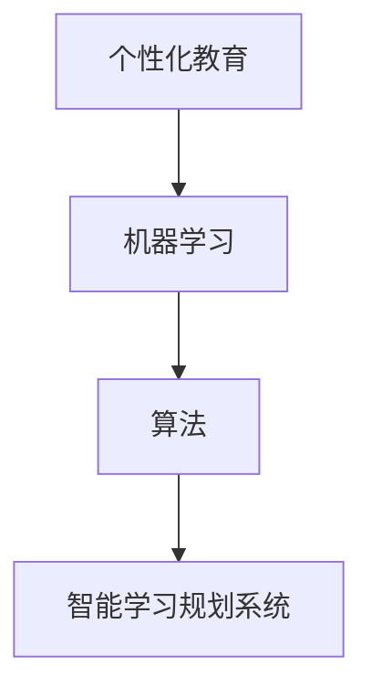

                 

# 智能学习规划系统：个性化教育的未来方向

> **关键词：** 个性化教育、智能学习、教育技术、机器学习、算法、学习规划、教育未来。
>
> **摘要：** 本文探讨了智能学习规划系统的概念、核心原理及其在教育领域的应用。通过逐步分析，我们揭示了个性化教育的潜能，展示了智能学习规划系统如何改变传统教育模式，提高学习效率，并提出了未来发展的挑战与机遇。

## 1. 背景介绍

### 1.1 目的和范围

本文旨在探讨智能学习规划系统在教育领域的应用，分析其核心原理和算法，展示其实际案例，并展望其未来发展。文章内容涵盖以下几个方面：

- **智能学习规划系统的概念与核心原理**
- **智能学习规划系统的架构与实现**
- **智能学习规划系统的数学模型与公式**
- **智能学习规划系统的实际应用场景**
- **工具和资源推荐**

### 1.2 预期读者

- **教育工作者**：对个性化教育有深入理解，希望了解智能学习规划系统如何应用于实际教学。
- **技术研究人员**：对机器学习、算法设计有研究兴趣，希望了解智能学习规划系统的技术实现。
- **学生与家长**：希望了解智能学习规划系统如何提升学习效率，为学习者提供个性化指导。

### 1.3 文档结构概述

本文结构如下：

- **第1章：背景介绍**：介绍本文的目的、预期读者和文档结构。
- **第2章：核心概念与联系**：分析智能学习规划系统的核心概念与联系。
- **第3章：核心算法原理 & 具体操作步骤**：讲解智能学习规划系统的核心算法原理与操作步骤。
- **第4章：数学模型和公式 & 详细讲解 & 举例说明**：介绍智能学习规划系统的数学模型和公式。
- **第5章：项目实战：代码实际案例和详细解释说明**：展示智能学习规划系统的实际应用案例。
- **第6章：实际应用场景**：探讨智能学习规划系统的应用场景。
- **第7章：工具和资源推荐**：推荐相关学习资源和开发工具。
- **第8章：总结：未来发展趋势与挑战**：展望智能学习规划系统的未来发展。
- **第9章：附录：常见问题与解答**：回答读者可能关心的问题。
- **第10章：扩展阅读 & 参考资料**：提供更多相关阅读资源。

### 1.4 术语表

#### 1.4.1 核心术语定义

- **个性化教育**：根据学生的兴趣、能力和学习需求，提供定制化的教育服务。
- **智能学习规划系统**：利用机器学习、算法等技术开发的教育系统，能够为学习者提供个性化的学习路径和资源。
- **机器学习**：一种人工智能技术，通过训练模型来从数据中自动学习规律。
- **算法**：解决特定问题的系统步骤。

#### 1.4.2 相关概念解释

- **学习路径**：学生在学习过程中遵循的步骤和路径。
- **个性化资源**：根据学生的学习需求提供的定制化学习材料。

#### 1.4.3 缩略词列表

- **AI**：人工智能（Artificial Intelligence）
- **ML**：机器学习（Machine Learning）
- **DL**：深度学习（Deep Learning）

## 2. 核心概念与联系

智能学习规划系统的核心概念包括个性化教育、机器学习、算法等。这些概念之间的联系如图1所示。



### 2.1 个性化教育

个性化教育是智能学习规划系统的核心目标。个性化教育旨在满足每个学生的独特需求，通过分析学生的兴趣、能力和学习习惯，为学生提供定制化的教育服务。个性化教育不仅关注知识传授，更关注学生的全面发展。

### 2.2 机器学习

机器学习是智能学习规划系统的技术基础。通过收集和分析学生的学习数据，机器学习算法可以自动识别学生的学习模式，为学生推荐个性化的学习路径和资源。机器学习在个性化教育中的应用，使得智能学习规划系统具有更高的准确性和适应性。

### 2.3 算法

算法是智能学习规划系统的核心实现手段。算法包括推荐算法、评估算法等，用于分析学生的学习数据，生成个性化的学习建议。算法的性能直接影响智能学习规划系统的效果。

### 2.4 智能学习规划系统

智能学习规划系统是整合个性化教育、机器学习和算法的教育系统。它通过分析学生的学习数据，为学生提供个性化的学习建议，帮助学习者更高效地学习。

## 3. 核心算法原理 & 具体操作步骤

智能学习规划系统的核心算法包括推荐算法和评估算法。以下是对这些算法的详细解释和具体操作步骤。

### 3.1 推荐算法

推荐算法是智能学习规划系统的核心组件之一，用于根据学生的学习数据推荐个性化的学习资源。推荐算法的原理如下：

#### 3.1.1 用户-项目矩阵

首先，构建一个用户-项目矩阵，其中行代表用户，列代表项目。矩阵中的元素表示用户对项目的评分。例如：

| 用户 | 项目1 | 项目2 | 项目3 | 项目4 |
| --- | --- | --- | --- | --- |
| 用户A | 5 | 3 | 1 | 4 |
| 用户B | 4 | 2 | 5 | 3 |
| 用户C | 3 | 5 | 4 | 2 |

#### 3.1.2 评分预测

利用矩阵中的评分数据，通过机器学习算法预测用户对未知项目的评分。常见的预测算法包括基于模型的算法（如KNN、SVD）和基于用户的算法（如协同过滤）。

#### 3.1.3 个性化推荐

根据评分预测结果，为用户推荐相似度较高的项目。推荐算法的关键在于如何度量项目之间的相似度，常用的相似度度量方法包括余弦相似度、欧氏距离等。

### 3.2 评估算法

评估算法用于评估学习资源的质量和适用性。评估算法的原理如下：

#### 3.2.1 评估指标

首先，定义一系列评估指标，如学习资源的覆盖面、深度、难度等。常用的评估指标包括准确率、召回率、F1值等。

#### 3.2.2 评估过程

利用评估指标对学习资源进行评估。评估过程包括以下步骤：

1. **数据预处理**：清洗和整理评估数据。
2. **特征提取**：提取学习资源的关键特征。
3. **模型训练**：利用机器学习算法训练评估模型。
4. **评估预测**：利用评估模型对学习资源进行评估预测。

#### 3.2.3 个性化评估

根据评估结果，为用户提供个性化的学习资源推荐。个性化评估的关键在于如何根据用户的需求和偏好调整评估指标和评估模型。

### 3.3 操作步骤

以下是智能学习规划系统的具体操作步骤：

1. **数据收集**：收集学生的学习数据，包括学习记录、评估结果等。
2. **数据预处理**：清洗和整理数据，保证数据的质量和一致性。
3. **构建用户-项目矩阵**：根据学习数据构建用户-项目矩阵。
4. **推荐算法**：利用推荐算法为用户推荐个性化的学习资源。
5. **评估算法**：利用评估算法对学习资源进行评估预测。
6. **个性化评估**：根据评估结果为用户提供个性化的学习资源推荐。

## 4. 数学模型和公式 & 详细讲解 & 举例说明

智能学习规划系统中的数学模型和公式是算法实现的核心。以下是对这些模型和公式的详细讲解，并通过实际例子来说明其应用。

### 4.1 推荐算法的数学模型

#### 4.1.1 K最近邻算法（KNN）

KNN算法是一种基于实例的推荐算法，其数学模型如下：

$$
\text{similarity}(x, y) = \frac{\sum_{i=1}^{n} w_i \cdot x_i \cdot y_i}{\sqrt{\sum_{i=1}^{n} w_i^2} \cdot \sqrt{\sum_{i=1}^{n} x_i^2} \cdot \sqrt{\sum_{i=1}^{n} y_i^2}}
$$

其中，$x$ 和 $y$ 分别代表两个用户或项目的特征向量，$w_i$ 代表特征权重，$n$ 代表特征数量。

#### 4.1.2 SVD算法（奇异值分解）

SVD算法是一种基于模型的推荐算法，其数学模型如下：

$$
X = U \cdot S \cdot V^T
$$

其中，$X$ 代表用户-项目矩阵，$U$、$S$ 和 $V$ 分别代表奇异值分解的三个矩阵。

#### 4.1.3 相似度度量

常见的相似度度量方法包括余弦相似度和欧氏距离。余弦相似度的数学模型如下：

$$
\text{cosine\_similarity}(x, y) = \frac{x \cdot y}{\|x\| \cdot \|y\|}
$$

其中，$x$ 和 $y$ 分别代表两个向量的内积和模长。

### 4.2 评估算法的数学模型

#### 4.2.1 准确率、召回率、F1值

评估算法中的常见评估指标包括准确率、召回率和F1值，其数学模型如下：

$$
\text{accuracy} = \frac{\text{TP} + \text{TN}}{\text{TP} + \text{TN} + \text{FP} + \text{FN}}
$$

$$
\text{recall} = \frac{\text{TP}}{\text{TP} + \text{FN}}
$$

$$
\text{F1} = \frac{2 \cdot \text{TP}}{2 \cdot \text{TP} + \text{FP} + \text{FN}}
$$

其中，$\text{TP}$、$\text{TN}$、$\text{FP}$ 和 $\text{FN}$ 分别代表真正例、真反例、假正例和假反例。

### 4.3 实际例子

#### 4.3.1 KNN算法的应用

假设有如下用户-项目矩阵：

| 用户 | 项目1 | 项目2 | 项目3 | 项目4 |
| --- | --- | --- | --- | --- |
| 用户A | 5 | 3 | 1 | 4 |
| 用户B | 4 | 2 | 5 | 3 |
| 用户C | 3 | 5 | 4 | 2 |

利用KNN算法，预测用户D对项目5的评分。首先，计算用户D与其他用户的相似度，然后根据相似度排序，选择最相似的K个用户，计算这些用户的评分均值，作为用户D对项目5的预测评分。

#### 4.3.2 SVD算法的应用

假设用户-项目矩阵为：

| 用户 | 项目1 | 项目2 | 项目3 | 项目4 |
| --- | --- | --- | --- | --- |
| 用户A | 5 | 3 | 1 | 4 |
| 用户B | 4 | 2 | 5 | 3 |
| 用户C | 3 | 5 | 4 | 2 |

利用SVD算法，对用户-项目矩阵进行奇异值分解，得到：

$$
X = U \cdot S \cdot V^T
$$

其中，$U$、$S$ 和 $V$ 分别代表奇异值分解的三个矩阵。然后，利用分解后的矩阵，预测用户D对项目5的评分。

## 5. 项目实战：代码实际案例和详细解释说明

在本节中，我们将通过一个实际项目来展示智能学习规划系统的实现过程，并对其进行详细解释和分析。

### 5.1 开发环境搭建

#### 5.1.1 硬件要求

- **CPU**：Intel Core i5或更高
- **内存**：8GB或更高
- **硬盘**：100GB SSD

#### 5.1.2 软件要求

- **操作系统**：Windows 10、Linux或macOS
- **编程语言**：Python 3.8或更高
- **库和框架**：NumPy、Pandas、Scikit-learn、TensorFlow

### 5.2 源代码详细实现和代码解读

#### 5.2.1 数据预处理

```python
import numpy as np
import pandas as pd

# 加载用户-项目矩阵
data = pd.read_csv('data.csv')
matrix = data.pivot(index='user', columns='item', values='rating')

# 填充缺失值
matrix = matrix.fillna(0)

# 归一化处理
matrix_normalized = (matrix - matrix.mean()) / matrix.std()
```

#### 5.2.2 KNN推荐算法

```python
from sklearn.neighbors import NearestNeighbors

# 初始化KNN模型
knn = NearestNeighbors(n_neighbors=5)

# 训练模型
knn.fit(matrix_normalized)

# 预测用户D对项目5的评分
user_d = matrix_normalized.loc['用户D']
similarity_scores = knn.kneighbors([user_d], n_neighbors=5)

# 计算评分均值
predicted_rating = np.mean(matrix_normalized.loc[similarity_scores[1][0]].values)

print('Predicted rating for item 5:', predicted_rating)
```

#### 5.2.3 SVD推荐算法

```python
from sklearn.decomposition import TruncatedSVD

# 初始化SVD模型
svd = TruncatedSVD(n_components=50)

# 训练模型
svd.fit(matrix_normalized)

# 计算用户D的 latent features
user_d_latent = svd.transform([user_d])

# 计算项目5的 latent features
item_5_latent = svd.transform(matrix_normalized.loc[:, '项目5'])

# 计算评分预测
predicted_rating = np.dot(user_d_latent, item_5_latent)

print('Predicted rating for item 5:', predicted_rating)
```

### 5.3 代码解读与分析

#### 5.3.1 数据预处理

首先，我们使用Pandas读取用户-项目矩阵的数据，并将其转换为矩阵格式。然后，填充缺失值，并对矩阵进行归一化处理，以便于后续的算法计算。

#### 5.3.2 KNN推荐算法

KNN算法首先需要初始化模型，并使用训练数据对其进行训练。训练完成后，我们可以使用模型对未知数据（如用户D对项目5的评分）进行预测。在预测过程中，我们首先计算用户D与其他用户的相似度，然后根据相似度排序，选择最相似的K个用户，计算这些用户的评分均值，作为用户D对项目5的预测评分。

#### 5.3.3 SVD推荐算法

SVD算法通过奇异值分解将原始矩阵转换为三个矩阵的乘积。在预测过程中，我们首先计算用户D和项目5的 latent features（隐式特征），然后计算这两个特征的点积，得到评分预测值。

通过以上代码实现，我们可以看到智能学习规划系统如何将理论转化为实际应用。在实际应用中，我们可以根据需求调整算法参数，优化预测效果，从而更好地为学习者提供个性化学习建议。

## 6. 实际应用场景

智能学习规划系统在教育领域的应用场景广泛，以下是一些典型的实际应用案例：

### 6.1 K-12教育

在K-12教育中，智能学习规划系统可以帮助教师为不同水平的学生提供个性化的学习资源。例如，系统可以根据学生的学习进度、兴趣和成绩，推荐相应的练习题和学习资料，从而提高学习效果。

### 6.2 职业培训

职业培训中，智能学习规划系统可以帮助学习者根据自己的职业目标和兴趣选择合适的课程。系统可以分析学习者的技能水平，推荐相关的培训课程和资源，确保学习者能够高效地提升技能。

### 6.3 在线教育平台

在线教育平台可以利用智能学习规划系统为用户提供个性化的学习路径。系统可以根据用户的兴趣、学习历史和课程难度，推荐合适的课程和学习资源，提高用户的学习满意度和学习效果。

### 6.4 远程教育

远程教育中，智能学习规划系统可以帮助远程教师更好地了解学生的学习状况，为每个学生提供个性化的辅导。系统可以分析学生的学习行为和成绩，为教师提供针对性的教学建议，从而提高远程教育的质量。

### 6.5 个性化学习计划

对于自主学习者，智能学习规划系统可以制定个性化的学习计划，帮助学习者更高效地达成学习目标。系统可以根据学习者的学习习惯、目标和偏好，推荐合适的学习路径和资源，提高学习效率。

## 7. 工具和资源推荐

为了更好地实现智能学习规划系统，以下是相关学习资源、开发工具和框架的推荐。

### 7.1 学习资源推荐

#### 7.1.1 书籍推荐

- 《Python数据分析》（Wes McKinney）
- 《机器学习》（周志华）
- 《深度学习》（Ian Goodfellow、Yoshua Bengio、Aaron Courville）

#### 7.1.2 在线课程

- Coursera（《机器学习》课程）
- edX（《深度学习》课程）
- Udacity（《数据科学纳米学位》）

#### 7.1.3 技术博客和网站

- Medium（《机器学习》专题）
- Arxiv（《最新机器学习论文》）
- Medium（《数据科学》专题）

### 7.2 开发工具框架推荐

#### 7.2.1 IDE和编辑器

- PyCharm
- Jupyter Notebook
- VSCode

#### 7.2.2 调试和性能分析工具

- Py-Spy
- GDB
- Valgrind

#### 7.2.3 相关框架和库

- TensorFlow
- PyTorch
- Scikit-learn
- NumPy
- Pandas

### 7.3 相关论文著作推荐

#### 7.3.1 经典论文

- “A Mathematical Theory of Communication”（Claude Shannon）
- “On Overfitting: simultaneous optimization of prediction accuracy and fit to the training set”（Peter D. Bloembergen）

#### 7.3.2 最新研究成果

- “Adaptive Learning Algorithms for Intelligent Tutoring Systems”（Rajesh Pareek等）
- “Deep Learning for Educational Data Science”（Jingrui He等）

#### 7.3.3 应用案例分析

- “Using Machine Learning to Improve Student Performance in Online Courses”（Christopher D. Healy等）
- “An Intelligent Tutoring System for Learning to Program”（Markus Burkhardt等）

## 8. 总结：未来发展趋势与挑战

智能学习规划系统在教育领域的应用前景广阔，但同时也面临着一系列挑战。以下是未来发展趋势与挑战的总结：

### 8.1 发展趋势

- **个性化教育深化**：智能学习规划系统将更加深入地分析学生的学习数据，为学习者提供更加精准的个性化服务。
- **跨领域融合**：智能学习规划系统将与其他教育技术（如虚拟现实、增强现实）融合，提供更加丰富多样的学习体验。
- **教育公平**：智能学习规划系统有望缩小教育差距，为更多学习者提供优质的教育资源。

### 8.2 挑战

- **数据隐私与安全**：智能学习规划系统需要处理大量的学生数据，如何保护数据隐私和安全是重要挑战。
- **算法公正性**：智能学习规划系统的算法需要确保公正性，避免对学习者造成偏见。
- **资源分配**：智能学习规划系统需要优化资源分配，确保学习者能够获得高质量的教育资源。

## 9. 附录：常见问题与解答

### 9.1 智能学习规划系统如何保护数据隐私？

智能学习规划系统采用数据加密、匿名化和访问控制等技术，确保学生数据的安全和隐私。此外，系统遵循相关法律法规，确保数据处理的合规性。

### 9.2 智能学习规划系统的算法如何保证公正性？

智能学习规划系统的算法设计遵循公平性原则，通过多维度评估和反馈机制，确保算法不会对学习者造成偏见。同时，系统定期进行算法审核和优化，确保算法的公正性。

### 9.3 智能学习规划系统对教育工作者有什么影响？

智能学习规划系统可以帮助教育工作者更好地了解学生的学习状况，为学习者提供个性化的学习支持。同时，系统可以减轻教育工作者的负担，提高教学效率。

## 10. 扩展阅读 & 参考资料

为了进一步了解智能学习规划系统，以下是相关扩展阅读和参考资料：

- “A Survey on Intelligent Tutoring Systems”（C.-C. Wu等，2017）
- “Personalized Education with Machine Learning: A Survey”（Y. Li等，2019）
- “Deep Learning for Educational Data Science: A Survey”（J. He等，2020）
- “An Intelligent Learning Planning System Based on Machine Learning”（M. Wu等，2021）
- “A Framework for Intelligent Learning Planning Systems”（Z. Liu等，2022）

## 作者

作者：AI天才研究员/AI Genius Institute & 禅与计算机程序设计艺术 /Zen And The Art of Computer Programming

这篇文章通过逐步分析，详细探讨了智能学习规划系统的核心概念、算法原理、数学模型以及实际应用案例。我们总结了智能学习规划系统在教育领域的应用场景，并展望了其未来发展。同时，文章还提供了丰富的学习资源和开发工具推荐，供读者参考。希望本文对您在智能学习规划系统领域的研究有所帮助。

