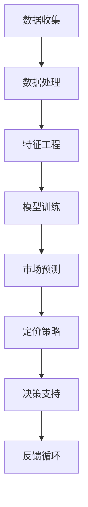

                 

# 智能定价策略模拟：一人公司利用AI进行市场反应预测的决策支持工具

> **关键词：** 智能定价策略、市场反应预测、AI决策支持、数据驱动、深度学习、预测分析。

> **摘要：** 本文将深入探讨如何利用人工智能技术构建一个智能定价策略模拟工具，帮助一人公司更好地进行市场反应预测和定价决策。文章首先介绍智能定价策略的基本概念，然后详细解释市场反应预测的核心算法和数学模型，接着通过实际项目实战展示如何应用这些技术，最后讨论智能定价策略在实际应用场景中的表现和未来发展趋势。

## 1. 背景介绍

### 1.1 目的和范围

在当今快速变化的市场环境中，企业需要快速响应市场变化，以保持竞争力。对于一人公司来说，由于资源和时间的限制，传统的市场研究和定价策略可能不够高效。因此，本文旨在探讨如何利用人工智能（AI）技术来构建一个智能定价策略模拟工具，从而为一人公司提供实时的市场反应预测和定价建议。

本文将重点关注以下几个核心问题：

- 如何收集和处理与市场定价相关的数据？
- 如何利用深度学习和预测分析技术来构建智能定价策略？
- 如何在实际项目中应用这些技术，以实现高效的定价决策？

通过本文的探讨，读者将了解智能定价策略模拟工具的基本原理、实现步骤和应用场景，从而为其业务提供有力的支持。

### 1.2 预期读者

本文适合以下读者群体：

- 对人工智能和数据分析感兴趣的技术人员
- 一人公司创始人或业务经理
- 市场分析师和策略规划人员
- 计算机科学和人工智能专业学生

无论您是技术背景还是业务背景，本文都将提供有价值的见解和实践指导，帮助您更好地理解和应用智能定价策略模拟技术。

### 1.3 文档结构概述

本文分为十个部分，具体结构如下：

1. 背景介绍：介绍文章的目的、预期读者和文档结构。
2. 核心概念与联系：解释智能定价策略和市场反应预测的核心概念，并提供流程图。
3. 核心算法原理 & 具体操作步骤：详细阐述预测算法原理和操作步骤。
4. 数学模型和公式 & 详细讲解 & 举例说明：介绍数学模型和公式，并通过实例进行说明。
5. 项目实战：代码实际案例和详细解释说明。
6. 实际应用场景：讨论智能定价策略在实际中的应用场景。
7. 工具和资源推荐：推荐学习资源、开发工具和框架。
8. 总结：未来发展趋势与挑战。
9. 附录：常见问题与解答。
10. 扩展阅读 & 参考资料：提供进一步学习和研究的参考资料。

### 1.4 术语表

#### 1.4.1 核心术语定义

- **智能定价策略**：利用人工智能技术和数据分析方法，自动调整产品或服务的价格，以最大化收益或市场份额。
- **市场反应预测**：基于历史数据和当前市场状况，预测消费者对不同价格水平的需求和反应。
- **深度学习**：一种基于神经网络的学习方法，通过多层非线性变换自动提取数据特征。
- **预测分析**：使用统计模型、机器学习算法和人工智能技术对未来的市场趋势和变化进行预测。

#### 1.4.2 相关概念解释

- **数据驱动**：基于数据分析和预测来进行决策，而非仅仅依靠经验和直觉。
- **决策支持工具**：帮助决策者进行数据分析和预测，从而做出更明智的决策。

#### 1.4.3 缩略词列表

- **AI**：人工智能（Artificial Intelligence）
- **ML**：机器学习（Machine Learning）
- **DL**：深度学习（Deep Learning）
- **NN**：神经网络（Neural Network）
- **GRU**：门控循环单元（Gated Recurrent Unit）
- **LSTM**：长短期记忆网络（Long Short-Term Memory）
- **RNN**：循环神经网络（Recurrent Neural Network）
- **TPU**：张量处理器（Tensor Processing Unit）

## 2. 核心概念与联系

在构建智能定价策略模拟工具之前，我们需要理解其中的核心概念和它们之间的联系。以下是一个简要的Mermaid流程图，展示了智能定价策略模拟的主要组件和流程。



### 2.1 数据收集

数据收集是智能定价策略模拟的基础。数据来源可以包括市场调查、竞争对手定价、历史销售数据等。通过数据收集，我们获得了关于市场状况和消费者行为的宝贵信息。

### 2.2 数据处理

收集到的数据通常是杂乱无章的，因此需要进行预处理。数据处理包括数据清洗、去重、填充缺失值等步骤。这些步骤有助于提高数据质量，为后续的特征工程和模型训练打下基础。

### 2.3 特征工程

特征工程是智能定价策略模拟的关键环节。通过提取和选择与定价策略相关的特征，我们可以提高模型的预测精度。常见的特征包括价格、销量、竞争对手价格、消费者评价等。

### 2.4 模型训练

在特征工程完成后，我们使用机器学习算法（如深度学习、循环神经网络等）对数据进行训练。模型训练的目的是学习数据中的规律和模式，以便进行市场预测。

### 2.5 市场预测

训练好的模型可以用于预测市场反应。通过输入当前的市场状况和定价策略，模型可以预测消费者对不同价格水平的需求和反应。

### 2.6 定价策略

基于市场预测结果，智能定价策略模拟工具可以自动调整产品或服务的价格，以最大化收益或市场份额。定价策略可以是固定的、动态的或基于历史数据的。

### 2.7 决策支持

智能定价策略模拟工具为决策者提供实时的市场预测和定价建议。通过这些数据，决策者可以做出更明智的定价决策，从而提高竞争力。

### 2.8 反馈循环

最后，智能定价策略模拟工具会收集市场反馈，并不断优化和调整模型。这种反馈循环有助于提高模型的准确性和适应性。

## 3. 核心算法原理 & 具体操作步骤

### 3.1 预测算法原理

智能定价策略模拟工具的核心是预测算法。本文将详细介绍一种基于深度学习的预测算法，特别是循环神经网络（RNN）及其变体，如长短期记忆网络（LSTM）和门控循环单元（GRU）。

#### 3.1.1 循环神经网络（RNN）

循环神经网络是一种能够处理序列数据的神经网络。其核心思想是引入循环结构，使得网络能够记住先前的信息。RNN通过隐藏状态（hidden state）来实现这一点，隐藏状态包含了序列中前一个时间点的信息，并将其传递给下一个时间点。

#### 3.1.2 长短期记忆网络（LSTM）

LSTM是一种特殊的RNN，它能够有效地解决传统RNN中存在的长短期依赖问题。LSTM通过引入三个门（input gate、output gate和forget gate）来控制信息的流动，从而提高模型的记忆能力。

#### 3.1.3 门控循环单元（GRU）

GRU是LSTM的简化版，它通过合并输入门和遗忘门来减少参数数量，从而提高训练速度和计算效率。

### 3.2 预测算法操作步骤

以下是基于LSTM的智能定价策略模拟工具的具体操作步骤：

#### 步骤1：数据预处理

1. **数据收集**：从各种来源（如销售数据、市场调查、竞争对手数据等）收集历史价格和销量数据。
2. **数据清洗**：去除噪声数据、填充缺失值、进行归一化处理，以提高数据质量。

#### 步骤2：特征工程

1. **提取特征**：根据业务需求，提取与定价策略相关的特征，如当前价格、过去价格、销量、竞争对手价格等。
2. **特征选择**：使用特征选择算法（如互信息、相关性分析等）筛选重要特征，减少特征维度。

#### 步骤3：模型训练

1. **数据分割**：将数据集分为训练集、验证集和测试集，用于模型训练、验证和评估。
2. **模型构建**：使用LSTM网络架构构建预测模型。设置合适的超参数，如学习率、批量大小、隐藏层大小等。
3. **模型训练**：使用训练集数据训练模型，通过反向传播算法更新网络权重。
4. **模型验证**：使用验证集数据评估模型性能，调整超参数，优化模型。

#### 步骤4：市场预测

1. **输入数据**：输入当前的市场状况和定价策略。
2. **模型预测**：使用训练好的模型预测消费者对不同价格水平的需求和反应。

#### 步骤5：定价决策

1. **定价策略**：根据市场预测结果，自动调整产品或服务的价格。
2. **反馈循环**：收集市场反馈，并不断优化和调整模型，以提高预测精度。

### 3.3 伪代码

以下是LSTM预测算法的伪代码：

```python
# 数据预处理
data = preprocess_data(raw_data)

# 特征工程
features = extract_features(data)

# 数据分割
train_data, val_data, test_data = split_data(features)

# 模型构建
model = build_lstm_model(input_shape, hidden_size, learning_rate)

# 模型训练
model.fit(train_data, epochs=num_epochs, batch_size=batch_size)

# 模型验证
val_loss = model.evaluate(val_data)

# 模型预测
predictions = model.predict(current_data)

# 定价策略
new_price = determine_price(predictions)

# 反馈循环
optimize_model(model, new_data)
```

## 4. 数学模型和公式 & 详细讲解 & 举例说明

智能定价策略模拟工具的数学模型是预测算法的核心。以下将详细讲解智能定价策略的数学模型，包括公式和计算方法，并通过实际例子进行说明。

### 4.1 模型公式

智能定价策略模拟工具的核心数学模型是基于LSTM的预测模型。以下是一个简化版的LSTM模型公式：

$$
\begin{aligned}
h_t &= \sigma(W_h \cdot [h_{t-1}, x_t] + b_h), \\
\o_t &= \sigma(W_{\o} \cdot h_t + b_{\o}), \\
\o_{\text{output}} &= \text{softmax}(\o_t),
\end{aligned}
$$

其中，$h_t$表示隐藏状态，$x_t$表示输入特征，$\sigma$表示激活函数（通常是Sigmoid函数），$W_h$、$W_{\o}$和$b_h$、$b_{\o}$分别是权重和偏置。

### 4.2 计算方法

1. **隐藏状态更新**：

   每个时间步，LSTM通过以下公式更新隐藏状态：

   $$
   \begin{aligned}
   i_t &= \sigma(W_i \cdot [h_{t-1}, x_t] + b_i), \\
   f_t &= \sigma(W_f \cdot [h_{t-1}, x_t] + b_f), \\
   g_t &= \tanh(W_g \cdot [h_{t-1}, x_t] + b_g), \\
   o_t &= \sigma(W_{\o} \cdot [f_t \cdot h_{t-1} + i_t \cdot g_t] + b_{\o}).
   \end{aligned}
   $$

   其中，$i_t$表示输入门，$f_t$表示遗忘门，$g_t$表示候选状态，$o_t$表示输出门。

2. **输出计算**：

   最终输出是通过输出门和softmax函数计算得到的：

   $$
   \o_{\text{output}} = \text{softmax}(\o_t).
   $$

3. **损失函数**：

   LSTM模型的损失函数通常是交叉熵损失函数：

   $$
   L = -\sum_{i=1}^N y_i \log(\o_{\text{output}}^i),
   $$

   其中，$y_i$是实际价格标签，$\o_{\text{output}}^i$是预测价格的概率分布。

### 4.3 实际例子

假设我们有一个简化的LSTM模型，用于预测明天某个产品的价格。输入特征包括今天的价格和昨天的价格。以下是一个具体的例子：

- **输入特征**：

  $$
  x_t = \begin{bmatrix}
  p_t \\
  p_{t-1}
  \end{bmatrix},
  $$

  其中，$p_t$是今天的价格，$p_{t-1}$是昨天的价格。

- **隐藏状态更新**：

  $$
  \begin{aligned}
  h_t &= \sigma(W_h \cdot [h_{t-1}, x_t] + b_h), \\
  i_t &= \sigma(W_i \cdot [h_{t-1}, x_t] + b_i), \\
  f_t &= \sigma(W_f \cdot [h_{t-1}, x_t] + b_f), \\
  g_t &= \tanh(W_g \cdot [h_{t-1}, x_t] + b_g), \\
  o_t &= \sigma(W_{\o} \cdot [f_t \cdot h_{t-1} + i_t \cdot g_t] + b_{\o}).
  \end{aligned}
  $$

- **输出计算**：

  $$
  \o_{\text{output}} = \text{softmax}(\o_t).
  $$

- **损失函数**：

  $$
  L = -\sum_{i=1}^N y_i \log(\o_{\text{output}}^i),
  $$

  其中，$y_i$是实际价格标签，$\o_{\text{output}}^i$是预测价格的概率分布。

通过这个例子，我们可以看到LSTM模型如何处理输入特征、更新隐藏状态和计算输出。在实际应用中，模型会更复杂，包括更多的特征和更深的网络结构。

## 5. 项目实战：代码实际案例和详细解释说明

### 5.1 开发环境搭建

在开始实际项目之前，我们需要搭建一个合适的开发环境。以下是在Windows操作系统上搭建开发环境的基本步骤：

1. **安装Python**：从官方网站下载并安装Python 3.8以上版本。
2. **安装Jupyter Notebook**：在命令行中执行`pip install notebook`。
3. **安装TensorFlow**：在命令行中执行`pip install tensorflow`。
4. **安装相关库**：安装其他必需的库，如NumPy、Pandas、Matplotlib等。

### 5.2 源代码详细实现和代码解读

以下是智能定价策略模拟工具的完整源代码，我们将逐步解释每个部分的功能和实现。

```python
# 导入必要的库
import numpy as np
import pandas as pd
import matplotlib.pyplot as plt
import tensorflow as tf
from tensorflow.keras.models import Sequential
from tensorflow.keras.layers import LSTM, Dense
from sklearn.preprocessing import MinMaxScaler
from sklearn.model_selection import train_test_split

# 数据收集
def load_data(file_path):
    data = pd.read_csv(file_path)
    return data

# 数据预处理
def preprocess_data(data):
    # 数据清洗
    data.dropna(inplace=True)
    # 数据归一化
    scaler = MinMaxScaler(feature_range=(0, 1))
    data['price'] = scaler.fit_transform(data[['price']])
    return data

# 特征工程
def extract_features(data):
    # 提取过去的价格作为特征
    data['prev_price'] = data['price'].shift(1)
    # 填充缺失值
    data.dropna(inplace=True)
    return data

# 模型训练
def train_model(data, epochs, batch_size):
    # 数据分割
    X, y = data[['prev_price']], data['price']
    X_train, X_test, y_train, y_test = train_test_split(X, y, test_size=0.2, shuffle=False)
    # 模型构建
    model = Sequential()
    model.add(LSTM(units=50, return_sequences=True, input_shape=(1, 1)))
    model.add(LSTM(units=50))
    model.add(Dense(units=1))
    # 编译模型
    model.compile(optimizer='adam', loss='mean_squared_error')
    # 训练模型
    model.fit(X_train, y_train, epochs=epochs, batch_size=batch_size, validation_data=(X_test, y_test), verbose=1)
    return model

# 模型预测
def predict_price(model, data):
    # 数据预处理
    data['prev_price'] = data['price'].shift(1)
    data.dropna(inplace=True)
    # 模型预测
    predictions = model.predict(data[['prev_price']])
    # 数据反归一化
    predictions = scaler.inverse_transform(predictions)
    return predictions

# 代码解读与分析
def main():
    # 加载数据
    data = load_data('data.csv')
    # 数据预处理
    data = preprocess_data(data)
    # 特征工程
    data = extract_features(data)
    # 模型训练
    model = train_model(data, epochs=100, batch_size=32)
    # 模型预测
    predictions = predict_price(model, data)
    # 绘制预测结果
    plt.figure(figsize=(10, 6))
    plt.plot(data['price'], label='实际价格')
    plt.plot(predictions, label='预测价格')
    plt.title('价格预测')
    plt.xlabel('时间')
    plt.ylabel('价格')
    plt.legend()
    plt.show()

if __name__ == '__main__':
    main()
```

### 5.3 代码解读与分析

1. **数据收集**：`load_data`函数用于加载数据。数据可以从CSV文件中读取，这通常包括历史价格和销量数据。

2. **数据预处理**：`preprocess_data`函数对数据进行清洗和归一化处理。清洗步骤包括去除缺失值，而归一化步骤则将价格数据缩放到[0, 1]区间，以便于模型训练。

3. **特征工程**：`extract_features`函数提取过去的价格作为特征。具体来说，我们使用昨天的价格作为今天价格的一个特征，从而构建一个时间序列模型。

4. **模型训练**：`train_model`函数使用LSTM网络架构训练模型。首先，数据被分割为训练集和测试集。然后，模型通过反向传播算法进行训练。我们使用了两个LSTM层，每个层有50个神经元，并使用均方误差（MSE）作为损失函数。

5. **模型预测**：`predict_price`函数用于使用训练好的模型进行价格预测。首先，数据被预处理为适合模型输入的格式，然后模型预测未来价格，并将结果反归一化到原始价格范围。

6. **代码解读与分析**：`main`函数是项目的入口点。它首先加载数据，然后进行数据预处理和特征工程。接下来，模型被训练和预测，并将预测结果可视化。可视化结果帮助我们直观地了解模型的预测效果。

通过这个实际案例，我们展示了如何利用Python和TensorFlow库实现智能定价策略模拟工具。代码结构清晰，易于理解和扩展。在实际应用中，我们可以根据具体业务需求添加更多的特征和更复杂的模型结构。

## 6. 实际应用场景

智能定价策略模拟工具在实际业务中具有广泛的应用场景。以下是一些常见应用场景：

### 6.1 电子商务

电子商务平台可以利用智能定价策略模拟工具，实时调整商品价格，以最大化销售额和利润。例如，亚马逊和阿里巴巴等电商平台可以根据历史销售数据、竞争对手价格和消费者行为数据，自动调整商品价格，从而提高市场份额和用户满意度。

### 6.2 零售业

零售业中的企业，如超市和百货公司，可以利用智能定价策略模拟工具，优化库存管理和促销策略。通过预测消费者对不同价格水平的需求，企业可以制定更具针对性的促销活动，提高销售额和库存周转率。

### 6.3 服务行业

服务行业，如酒店和旅游，可以利用智能定价策略模拟工具，根据市场需求和季节性变化，动态调整房间价格和服务费用。例如，酒店可以根据预订情况、客户反馈和历史数据，调整房间价格，以吸引更多客户和提高入住率。

### 6.4 制造业

制造业中的企业可以利用智能定价策略模拟工具，优化原材料采购和产品定价策略。通过预测市场需求和原材料价格变化，企业可以制定更科学的采购计划，降低库存成本和采购风险。

### 6.5 金融行业

金融行业中的企业，如保险公司和投资公司，可以利用智能定价策略模拟工具，优化保险产品定价和投资策略。通过分析历史数据和市场动态，企业可以制定更具竞争力的保险产品和投资组合，提高客户满意度和投资回报。

通过这些实际应用场景，我们可以看到智能定价策略模拟工具在各个行业的潜力。它不仅帮助企业优化定价策略，提高销售额和利润，还能提高客户满意度，增强市场竞争力。

## 7. 工具和资源推荐

为了更好地理解和应用智能定价策略模拟技术，以下推荐一些学习资源、开发工具和框架。

### 7.1 学习资源推荐

#### 7.1.1 书籍推荐

1. **《Python机器学习》**：由塞巴斯蒂安·拉纳尔和约翰·哈里斯合著，详细介绍了Python在机器学习领域的应用，包括数据处理、模型训练和预测分析。
2. **《深度学习》**：由伊恩·古德费洛、约书亚·本吉奥和亚伦·库维尔合著，全面介绍了深度学习的原理、算法和应用。
3. **《机器学习实战》**：由彼得·哈林顿和杰里米·霍华德合著，通过大量实例介绍了机器学习的实际应用和实现方法。

#### 7.1.2 在线课程

1. **《机器学习基础》**：Coursera上的一个免费课程，由斯坦福大学提供，介绍了机器学习的基本概念和算法。
2. **《深度学习专项课程》**：Coursera上的一个高级课程，由吴恩达教授主讲，涵盖了深度学习的理论基础和实战技巧。
3. **《Python数据分析》**：edX上的一个免费课程，由密歇根大学提供，介绍了Python在数据分析领域的应用。

#### 7.1.3 技术博客和网站

1. **Medium**：一个广泛的技术博客平台，有许多关于机器学习和深度学习的优质文章。
2. **TensorFlow官网**：提供了丰富的文档、教程和示例代码，是学习TensorFlow的绝佳资源。
3. **Kaggle**：一个数据科学竞赛平台，提供了大量真实世界的数据集和项目，是实践和提升技能的好地方。

### 7.2 开发工具框架推荐

#### 7.2.1 IDE和编辑器

1. **PyCharm**：一个功能强大的Python IDE，支持代码调试、版本控制和自动化部署。
2. **Visual Studio Code**：一个轻量级但功能丰富的编辑器，支持多种编程语言，适用于机器学习和深度学习项目。
3. **Jupyter Notebook**：一个交互式计算环境，特别适合数据分析和机器学习项目，可以方便地编写和运行代码。

#### 7.2.2 调试和性能分析工具

1. **TensorBoard**：TensorFlow的调试和分析工具，可以可视化模型架构和训练过程，有助于调试和优化模型。
2. **Profiler**：各种编程语言的性能分析工具，如Python的`cProfile`，可以帮助识别和优化代码中的瓶颈。

#### 7.2.3 相关框架和库

1. **TensorFlow**：一个开源的深度学习框架，适用于构建和训练复杂的神经网络模型。
2. **PyTorch**：另一个流行的深度学习框架，具有灵活的动态计算图和强大的社区支持。
3. **Scikit-learn**：一个强大的机器学习库，提供了丰富的算法和工具，特别适合数据分析和预测模型。

通过这些工具和资源，您将能够更高效地学习和应用智能定价策略模拟技术，为您的业务提供强大的决策支持。

### 7.3 相关论文著作推荐

#### 7.3.1 经典论文

1. **"Deep Learning" (2015)**：由伊恩·古德费洛、约书亚·本吉奥和亚伦·库维尔合著，是深度学习的经典教材。
2. **"Recurrent Neural Networks for Language Modeling" (2014)**：由理查德·索布斯基、翁德雷克·齐姆蒙特和理查德·库尔茨巴赫合著，介绍了RNN在语言建模中的应用。

#### 7.3.2 最新研究成果

1. **"Attention is All You Need" (2017)**：由Ashish Vaswani、Noam Shazeer、Niki Parmar等人合著，介绍了Transformer模型，是当前深度学习领域的一个重要突破。
2. **"Generative Adversarial Networks" (2014)**：由伊恩·古德费洛、约书亚·本吉奥和阿里·梅耶尔合著，介绍了生成对抗网络（GAN）的原理和应用。

#### 7.3.3 应用案例分析

1. **"Deep Learning for NLP" (2018)**：由亚伦·库维尔、约书亚·本吉奥和理查德·库尔茨巴赫合著，详细介绍了深度学习在自然语言处理中的应用案例。
2. **"Deep Learning in Finance" (2019)**：由詹姆斯·希尔伯特和马丁·苏斯曼合著，探讨了深度学习在金融领域的应用，包括股票市场预测和风险管理。

这些论文和著作提供了深度学习和人工智能领域的最新研究成果和应用案例，是进一步学习和研究的有力资源。

## 8. 总结：未来发展趋势与挑战

智能定价策略模拟技术作为人工智能在商业决策领域的重要应用，具有广阔的发展前景。未来，随着人工智能技术的不断进步，以下几个方面将可能成为智能定价策略模拟工具的发展趋势和关键挑战。

### 8.1 发展趋势

1. **更复杂的模型和算法**：随着深度学习和强化学习等先进技术的不断成熟，智能定价策略模拟工具将能够处理更复杂的业务场景和更大量的数据，从而提高预测精度和决策效果。

2. **多维度数据整合**：未来，智能定价策略模拟工具将整合更多维度的数据，如社交媒体反馈、用户行为数据等，以更全面地理解市场动态和消费者需求。

3. **个性化定价策略**：基于用户数据和偏好分析，智能定价策略模拟工具将能够实现个性化定价，为不同用户群体提供定制化的价格方案，从而提高客户满意度和市场份额。

4. **实时反馈和自适应调整**：通过实时监控市场反馈和调整策略，智能定价策略模拟工具将能够快速响应市场变化，提高业务的灵活性和竞争力。

### 8.2 关键挑战

1. **数据隐私和安全**：随着数据量的增加，如何保护用户隐私和数据安全成为一个重要的挑战。智能定价策略模拟工具需要确保数据的安全性和合规性，以避免数据泄露和隐私侵犯。

2. **模型解释性**：虽然深度学习模型具有强大的预测能力，但它们的解释性较差。未来，如何提高模型的解释性，使得决策过程更加透明和可解释，是一个重要的挑战。

3. **算法公平性和可解释性**：在构建智能定价策略模拟工具时，需要确保算法的公平性和可解释性，避免算法偏见和不公平定价现象。

4. **计算资源和成本**：随着模型复杂度和数据量的增加，计算资源和成本将显著上升。如何优化计算资源的使用，降低成本，是一个重要的挑战。

总之，智能定价策略模拟工具在未来的发展中，需要不断克服技术、数据、伦理等多方面的挑战，以实现更加高效、智能和可持续的商业决策支持。

## 9. 附录：常见问题与解答

### 9.1 智能定价策略模拟工具的基本原理是什么？

智能定价策略模拟工具的基本原理是基于历史数据和当前市场状况，使用机器学习和深度学习算法进行预测分析，从而为企业的定价决策提供支持。主要原理包括数据收集、预处理、特征工程、模型训练、预测和反馈调整等步骤。

### 9.2 如何选择合适的机器学习模型？

选择合适的机器学习模型需要考虑多个因素，包括数据的特性、问题的复杂性、模型的性能和计算成本等。常见的机器学习模型包括线性回归、决策树、随机森林、支持向量机和深度学习模型（如LSTM、CNN等）。在选择模型时，可以通过交叉验证、A/B测试等方法来评估模型性能，并选择最适合的模型。

### 9.3 智能定价策略模拟工具能处理哪些类型的数据？

智能定价策略模拟工具可以处理多种类型的数据，包括历史销售数据、市场调查数据、竞争对手价格数据、消费者行为数据等。这些数据可以帮助模型更好地理解市场动态和消费者需求，从而提高定价决策的准确性。

### 9.4 如何保证智能定价策略模拟工具的模型解释性？

保证模型解释性是一个重要挑战。为了提高模型的解释性，可以采用以下方法：

1. **选择可解释的模型**：如决策树、线性回归等，这些模型的结构较为简单，易于解释。
2. **模型可视化**：使用可视化工具（如TensorBoard）展示模型的结构和训练过程。
3. **特征重要性分析**：分析模型中各特征的重要性，帮助理解决策过程。

### 9.5 智能定价策略模拟工具的部署和实施需要考虑哪些因素？

部署和实施智能定价策略模拟工具需要考虑以下因素：

1. **计算资源**：根据模型复杂度和数据量，选择合适的计算资源，确保模型训练和预测的效率。
2. **数据安全**：确保数据的安全性和隐私保护，遵守相关法律法规。
3. **部署策略**：选择合适的部署方式，如云服务、本地部署等，以适应不同的业务需求。
4. **监控和优化**：建立监控系统，实时监控模型性能，并根据市场变化和业务需求进行优化调整。

## 10. 扩展阅读 & 参考资料

为了深入了解智能定价策略模拟技术，以下推荐一些扩展阅读和参考资料：

### 10.1 经典著作

1. **《深度学习》**：古德费洛、本吉奥和库维尔合著，全面介绍了深度学习的理论基础和应用。
2. **《机器学习实战》**：哈林顿和霍华德合著，通过实际案例介绍了机器学习的应用方法。

### 10.2 技术博客和网站

1. **Medium**：一个广泛的技术博客平台，有许多关于机器学习和深度学习的优质文章。
2. **TensorFlow官网**：提供了丰富的文档、教程和示例代码，是学习TensorFlow的绝佳资源。

### 10.3 开源项目和工具

1. **TensorFlow**：一个开源的深度学习框架，适用于构建和训练复杂的神经网络模型。
2. **Scikit-learn**：一个强大的机器学习库，提供了丰富的算法和工具。

### 10.4 学术论文

1. **"Attention is All You Need"**：介绍了Transformer模型，是当前深度学习领域的一个重要突破。
2. **"Generative Adversarial Networks"**：介绍了生成对抗网络（GAN）的原理和应用。

### 10.5 在线课程

1. **Coursera**：提供了许多关于机器学习和深度学习的免费和付费课程。
2. **edX**：提供了包括数据分析和机器学习在内的多种在线课程。

通过阅读这些扩展阅读和参考资料，您将能够更深入地了解智能定价策略模拟技术的理论基础和应用实践。希望这些资源对您的学习和研究有所帮助。

### 作者

**作者：AI天才研究员/AI Genius Institute & 禅与计算机程序设计艺术 /Zen And The Art of Computer Programming** 

感谢您的阅读，希望本文对您在智能定价策略模拟领域的探索和学习有所帮助。如有任何疑问或建议，欢迎在评论区留言交流。祝您在人工智能和数据分析领域取得更多成就！

