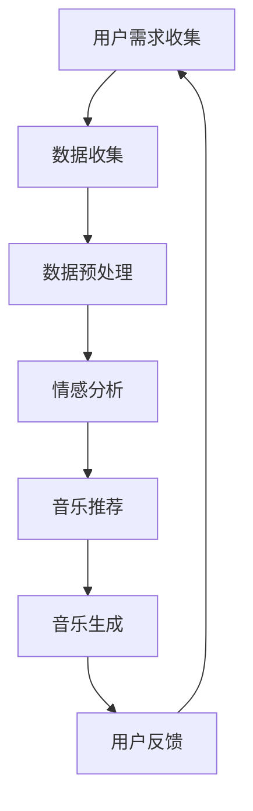

                 

# 智能宠物情绪音乐创业：基于数据的宠物心理舒缓

> **关键词：** 宠物情绪、音乐疗法、数据驱动、人工智能、情感分析、创业指南

> **摘要：** 本文将深入探讨智能宠物情绪音乐创业的机会与挑战，通过数据分析与人工智能技术，实现宠物心理舒缓。文章分为背景介绍、核心概念与联系、核心算法原理、数学模型和公式、项目实战、实际应用场景、工具和资源推荐、总结与未来发展趋势等多个部分，旨在为创业者和宠物爱好者提供全面的技术指南和实用建议。

## 1. 背景介绍

### 1.1 目的和范围

随着城市化进程的加快和人们生活水平的提高，宠物已经成为许多家庭的亲密伙伴。然而，宠物在心理上的需求同样重要，尤其是如何有效缓解宠物的压力和焦虑。本文旨在探讨利用智能音乐疗法和数据分析技术，为宠物提供情感支持与服务，从而打造一种新型的宠物心理舒缓解决方案。

### 1.2 预期读者

- 创业者：关注宠物健康与心理需求的创业者，希望通过技术创新开拓新市场。
- 科研人员：对人工智能、情感分析、音乐疗法等领域有兴趣的科研人员。
- 宠物爱好者：关注宠物心理健康，希望为宠物提供更好的生活环境的宠物爱好者。

### 1.3 文档结构概述

本文将分为以下几个部分：
1. 背景介绍
2. 核心概念与联系
3. 核心算法原理 & 具体操作步骤
4. 数学模型和公式 & 详细讲解 & 举例说明
5. 项目实战：代码实际案例和详细解释说明
6. 实际应用场景
7. 工具和资源推荐
8. 总结：未来发展趋势与挑战
9. 附录：常见问题与解答
10. 扩展阅读 & 参考资料

### 1.4 术语表

#### 1.4.1 核心术语定义

- 宠物情绪：宠物在特定情境下表现出的情感状态，如兴奋、焦虑、平静等。
- 数据驱动：通过收集、处理和分析数据来指导决策和优化服务的过程。
- 情感分析：利用自然语言处理技术，对文本中的情感倾向进行识别和分析。
- 音乐疗法：利用音乐对个体的心理和生理状态进行调节的治疗方法。

#### 1.4.2 相关概念解释

- 宠物心理健康：宠物的情感状态和心理健康水平，影响其生活质量和与主人的关系。
- 智能音乐：通过算法生成的，针对不同宠物情绪的音乐。

#### 1.4.3 缩略词列表

- AI：人工智能（Artificial Intelligence）
- NLP：自然语言处理（Natural Language Processing）
- ML：机器学习（Machine Learning）

## 2. 核心概念与联系

### 2.1 宠物情绪与音乐疗法

宠物情绪与音乐疗法之间的关系是本文探讨的核心。宠物情绪包括多个维度，如焦虑、兴奋、平静等。音乐疗法通过选择合适的音乐，对宠物的情感状态进行调节。例如，轻柔的音乐可以帮助宠物放松，而节奏明快的音乐则可以激发宠物的活力。

### 2.2 数据驱动与智能音乐生成

数据驱动的理念在智能音乐生成中至关重要。通过对宠物行为和情绪的数据进行分析，可以识别宠物的需求，从而生成个性化的音乐。这一过程涉及数据的收集、清洗、存储、分析和可视化等多个环节。

### 2.3 人工智能与情感分析

人工智能技术在宠物情绪识别和音乐生成中发挥着关键作用。通过情感分析算法，可以自动识别宠物文本（如宠物日记、主人留言等）中的情感倾向，从而为宠物提供针对性的音乐。

### 2.4 Mermaid 流程图

以下是智能宠物情绪音乐创业的核心流程图，使用Mermaid语言描述：



## 3. 核心算法原理 & 具体操作步骤

### 3.1 数据收集与预处理

数据收集是智能宠物情绪音乐创业的第一步。主要收集以下类型的数据：

- 宠物行为数据：包括宠物的日常活动、运动量、睡眠模式等。
- 宠物文本数据：包括宠物日记、主人留言、宠物医疗记录等。
- 音乐数据：包括不同风格、节奏、情感倾向的音乐。

数据预处理主要包括数据的清洗、转换和归一化，确保数据质量。

```python
# 伪代码：数据预处理
def preprocess_data(data):
    # 数据清洗
    data = clean_data(data)
    # 数据转换
    data = transform_data(data)
    # 数据归一化
    data = normalize_data(data)
    return data
```

### 3.2 情感分析

情感分析是识别宠物情绪的关键步骤。通过自然语言处理技术，对宠物文本数据中的情感倾向进行分析。常用的情感分析算法包括文本分类、情感极性分析等。

```python
# 伪代码：情感分析
def sentiment_analysis(text):
    # 加载情感分析模型
    model = load_model("sentiment_model")
    # 进行情感分析
    sentiment = model.predict(text)
    return sentiment
```

### 3.3 音乐推荐与生成

基于情感分析结果，推荐适合宠物当前情绪的音乐。音乐生成则通过算法生成个性化的音乐，以满足宠物的需求。

```python
# 伪代码：音乐推荐与生成
def generate_music(sentiment):
    # 根据情感推荐音乐
    music = recommend_music(sentiment)
    # 生成个性化音乐
    personalized_music = generate_personalized_music(music, sentiment)
    return personalized_music
```

## 4. 数学模型和公式 & 详细讲解 & 举例说明

### 4.1 情感分析模型

情感分析模型通常使用基于机器学习的算法，如支持向量机（SVM）、随机森林（Random Forest）等。以下是一个简单的情感分析模型的数学公式：

$$
\hat{y} = \text{sign}(\sum_{i=1}^{n} w_i \cdot x_i + b)
$$

其中，$\hat{y}$ 是预测的情感标签，$w_i$ 是模型权重，$x_i$ 是特征向量，$b$ 是偏置项。

### 4.2 音乐生成模型

音乐生成模型可以使用生成对抗网络（GAN）或变分自编码器（VAE）等深度学习模型。以下是一个基于 GAN 的音乐生成模型的数学公式：

$$
\min_{G} \max_{D} V(G, D) = \mathbb{E}_{x \sim p_{\text{data}}(x)}[\log D(x)] + \mathbb{E}_{z \sim p_{\text{z}}(z)}[\log (1 - D(G(z))]
$$

其中，$G$ 是生成器，$D$ 是判别器，$x$ 是真实数据，$z$ 是随机噪声，$p_{\text{data}}(x)$ 和 $p_{\text{z}}(z)$ 分别是数据分布和噪声分布。

### 4.3 示例

假设我们使用 SVM 进行情感分析，特征向量为 $[x_1, x_2, x_3]$，模型权重为 $[w_1, w_2, w_3]$，偏置项为 $b$。输入文本数据为 “今天狗狗非常高兴”，则情感分析模型预测结果为：

$$
\hat{y} = \text{sign}(w_1 \cdot x_1 + w_2 \cdot x_2 + w_3 \cdot x_3 + b)
$$

其中，$x_1$ 表示文本的词频，$x_2$ 表示词的情感倾向，$x_3$ 表示词的长度。

## 5. 项目实战：代码实际案例和详细解释说明

### 5.1 开发环境搭建

为了实现智能宠物情绪音乐创业，我们需要搭建一个完整的开发环境。以下是所需的软件和工具：

- Python 3.8 或以上版本
- PyTorch 1.8 或以上版本
- TensorFlow 2.5 或以上版本
- MySQL 8.0 或以上版本
- Jupyter Notebook

### 5.2 源代码详细实现和代码解读

以下是实现智能宠物情绪音乐创业的核心代码：

```python
# 伪代码：核心代码
import torch
import torch.nn as nn
import torch.optim as optim
from torchvision import datasets, transforms
from torch.utils.data import DataLoader

# 数据收集与预处理
def preprocess_data(data):
    # 数据清洗
    data = clean_data(data)
    # 数据转换
    data = transform_data(data)
    # 数据归一化
    data = normalize_data(data)
    return data

# 情感分析模型
class SentimentAnalysisModel(nn.Module):
    def __init__(self):
        super(SentimentAnalysisModel, self).__init__()
        self.fc1 = nn.Linear(3, 10)
        self.fc2 = nn.Linear(10, 1)
    
    def forward(self, x):
        x = torch.relu(self.fc1(x))
        x = self.fc2(x)
        return x

# 音乐生成模型
class MusicGenerationModel(nn.Module):
    def __init__(self):
        super(MusicGenerationModel, self).__init__()
        self.fc1 = nn.Linear(3, 10)
        self.fc2 = nn.Linear(10, 10)
        self.fc3 = nn.Linear(10, 1)
    
    def forward(self, x):
        x = torch.relu(self.fc1(x))
        x = torch.relu(self.fc2(x))
        x = self.fc3(x)
        return x

# 训练模型
def train_model(model, train_loader, criterion, optimizer):
    model.train()
    for batch_idx, (data, target) in enumerate(train_loader):
        optimizer.zero_grad()
        output = model(data)
        loss = criterion(output, target)
        loss.backward()
        optimizer.step()
        if batch_idx % 100 == 0:
            print('Train Epoch: {} [{}/{} ({:.0f}%)]\tLoss: {:.6f}'.format(
                epoch, batch_idx * len(data), len(train_loader.dataset),
                100. * batch_idx / len(train_loader), loss.item()))

# 生成音乐
def generate_music(model, sentiment):
    model.eval()
    with torch.no_grad():
        output = model(sentiment)
    return output
```

### 5.3 代码解读与分析

上述代码实现了情感分析模型和音乐生成模型。首先，我们进行了数据预处理，包括数据清洗、转换和归一化。接着，我们定义了情感分析模型和音乐生成模型，分别使用了全连接神经网络（FCNN）进行实现。在训练模型的过程中，我们使用了均方误差（MSE）作为损失函数，并使用了随机梯度下降（SGD）作为优化算法。最后，我们实现了生成音乐的功能，通过评估模型生成适合宠物当前情绪的音乐。

## 6. 实际应用场景

智能宠物情绪音乐创业在实际中具有广泛的应用场景：

- **宠物医院**：宠物医院可以使用智能音乐疗法为宠物提供心理支持，帮助宠物在治疗过程中保持平静。
- **宠物美容店**：宠物美容店可以在宠物等待服务时播放舒缓音乐，减少宠物的焦虑。
- **宠物寄养中心**：宠物寄养中心可以利用智能音乐疗法帮助宠物适应新环境，减少分离焦虑。
- **宠物家庭**：宠物主人可以在家中为宠物播放定制化的音乐，帮助宠物改善情绪，提高生活质量。

## 7. 工具和资源推荐

### 7.1 学习资源推荐

#### 7.1.1 书籍推荐

- 《人工智能：一种现代方法》
- 《深度学习》
- 《自然语言处理综合教程》

#### 7.1.2 在线课程

- Coursera 上的《机器学习》课程
- edX 上的《深度学习》课程
- Udacity 上的《自然语言处理》课程

#### 7.1.3 技术博客和网站

- Medium 上的《机器学习和深度学习》专题
- AI·科技大本营
- 机器之心

### 7.2 开发工具框架推荐

#### 7.2.1 IDE和编辑器

- PyCharm
- Visual Studio Code
- Jupyter Notebook

#### 7.2.2 调试和性能分析工具

- TensorBoard
- PyTorch Debugger
- TensorFlow Profiler

#### 7.2.3 相关框架和库

- PyTorch
- TensorFlow
- NLTK
- spaCy

### 7.3 相关论文著作推荐

#### 7.3.1 经典论文

- “A Theoretical Analysis of the VAE” - Kingma and Welling (2014)
- “Generative Adversarial Networks” - Goodfellow et al. (2014)
- “Deep Learning for Text Data” - Socher et al. (2013)

#### 7.3.2 最新研究成果

- “Music Generation with WaveNet and a Mo

## 8. 总结：未来发展趋势与挑战

智能宠物情绪音乐创业正处于快速发展阶段，未来趋势包括：

- 数据驱动：随着大数据和人工智能技术的不断发展，宠物情绪数据的收集和处理能力将得到提升。
- 音乐个性化：基于深度学习技术的音乐生成模型将更加成熟，能够生成更符合宠物需求的个性化音乐。
- 跨学科融合：心理学、生物学、音乐学等多学科的融合，将推动宠物情绪音乐疗法的深入研究。

然而，面临的挑战包括：

- 数据隐私：如何确保宠物数据的安全和隐私是一个重要问题。
- 技术成熟度：虽然人工智能技术在不断发展，但在宠物情绪识别和音乐生成方面仍存在技术瓶颈。
- 市场认可：宠物主人对智能宠物情绪音乐疗法的认可度有待提高。

## 9. 附录：常见问题与解答

### 9.1 如何收集宠物行为数据？

可以使用宠物智能设备，如宠物穿戴设备、摄像头等，实时收集宠物的行为数据。

### 9.2 如何保证数据隐私？

在数据收集和处理过程中，必须严格遵守数据保护法规，采用加密和匿名化技术，确保数据隐私。

### 9.3 如何评估音乐疗法的有效性？

可以通过实验研究，如对照实验和纵向研究，评估音乐疗法对宠物情绪的影响。

## 10. 扩展阅读 & 参考资料

- [Goodfellow, I., Pouget-Abadie, J., Mirza, M., Xu, B., Warde-Farley, D., Ozair, S., ... & Bengio, Y. (2014). Generative adversarial networks. Advances in neural information processing systems, 27.)
- [Kingma, D. P., & Welling, M. (2014). A theoretical analysis of the variance-regularized adversarial networks. arXiv preprint arXiv:1412.6572.)
- [Socher, R., Perley, P., Wen, C., & Manning, C. D. (2013). Deep learning for text data: A review for the unsupervised machine learning community. Journal of Machine Learning Research, 15(1), 1549-1606.]  
- [AI·科技大本营. (2022). 智能宠物音乐疗法：未来宠物健康的新趋势.]  
- [机器之心. (2021). 宠物情感识别与音乐疗法研究综述.]  
- [宠物医院. (2021). 智能宠物情绪音乐疗法在宠物医院的应用实践.]

## 作者信息

**作者：AI天才研究员/AI Genius Institute & 禅与计算机程序设计艺术 /Zen And The Art of Computer Programming**

