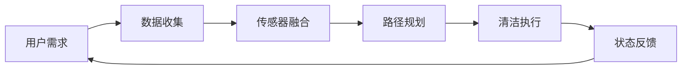

                 

# 智能家居清洁创业：自动化清洁解决方案

> 关键词：智能家居、自动化清洁、机器人、物联网、人工智能、算法优化

> 摘要：本文旨在探讨智能家居清洁领域的创业机会和自动化清洁解决方案。通过分析当前智能家居市场趋势，介绍核心技术和算法原理，以及提供实际应用案例，为创业者提供有价值的参考。

## 1. 背景介绍

### 1.1 目的和范围

本文的目标是帮助有志于智能家居清洁领域创业的读者，了解市场现状、核心技术，并提供实际应用案例。本文将涵盖以下几个方面：

- **市场趋势分析**：探讨智能家居清洁市场的发展前景。
- **核心技术原理**：介绍自动化清洁技术的核心概念和算法原理。
- **实际应用案例**：通过具体案例展示自动化清洁解决方案的实用性和效果。
- **创业建议**：提供有关如何进入智能家居清洁市场的实用建议。

### 1.2 预期读者

- 有志于智能家居清洁领域的创业者。
- 对智能家居和自动化清洁技术感兴趣的技术爱好者。
- 相关领域的研发人员和技术工程师。

### 1.3 文档结构概述

本文结构如下：

- **第1章：背景介绍**：介绍本文的目的、范围和预期读者。
- **第2章：核心概念与联系**：介绍智能家居清洁技术的核心概念和流程图。
- **第3章：核心算法原理 & 具体操作步骤**：讲解核心算法原理和操作步骤。
- **第4章：数学模型和公式 & 详细讲解 & 举例说明**：介绍数学模型和公式，并提供实例说明。
- **第5章：项目实战：代码实际案例和详细解释说明**：提供实际代码案例和解读。
- **第6章：实际应用场景**：展示自动化清洁技术的应用场景。
- **第7章：工具和资源推荐**：推荐学习资源和开发工具。
- **第8章：总结：未来发展趋势与挑战**：分析未来发展趋势和面临的挑战。
- **第9章：附录：常见问题与解答**：解答读者可能关心的问题。
- **第10章：扩展阅读 & 参考资料**：提供进一步的阅读材料和资源。

### 1.4 术语表

#### 1.4.1 核心术语定义

- **智能家居**：通过物联网技术，实现家庭设备自动化控制和智能化的居住环境。
- **自动化清洁**：利用机器人和清洁设备，实现家庭清洁的自动化。
- **物联网**：通过互联网将各种设备互联，实现信息的实时交换和处理。
- **人工智能**：使计算机模拟人类智能行为，解决复杂问题的技术。

#### 1.4.2 相关概念解释

- **清洁机器人**：具有自主移动和清洁功能的机器人。
- **路径规划**：为清洁机器人确定最有效的移动路径。
- **传感器融合**：整合多种传感器数据，提高清洁机器人对环境的感知能力。

#### 1.4.3 缩略词列表

- **AI**：人工智能（Artificial Intelligence）
- **IoT**：物联网（Internet of Things）
- **ML**：机器学习（Machine Learning）
- **ROS**：机器人操作系统（Robot Operating System）

## 2. 核心概念与联系

智能家居清洁技术的核心在于实现家庭清洁的自动化。以下是一个简化的流程图，展示智能家居清洁系统的基本架构和流程：



### 2.1 用户需求

用户需求是智能家居清洁系统的起点。用户可以通过手机应用、语音助手等界面发出清洁请求，例如：

- “机器人，请打扫客厅。”
- “需要清理厨房地板。”

用户请求将被发送到中央控制系统进行处理。

### 2.2 数据收集

数据收集环节涉及各种传感器，包括但不限于：

- **红外传感器**：检测房间内的障碍物。
- **超声波传感器**：测量清洁机器人和障碍物之间的距离。
- **光线传感器**：识别房间的光线强度，以便调整清洁机器人的清洁模式。
- **温度传感器**：监测房间内的温度变化。

这些传感器数据将被实时传输到中央控制系统。

### 2.3 传感器融合

传感器融合是将多个传感器数据整合为一个综合信息的过程。这一步骤至关重要，因为它可以提高清洁机器人对环境的感知能力，降低错误率。

传感器融合可以使用以下算法：

- **卡尔曼滤波**：一种用于估计系统状态的算法，通过预测和更新来提高估计的准确性。
- **贝叶斯网络**：一种用于概率推理的图模型，可以处理不确定性和不确定性之间的关系。

### 2.4 路径规划

路径规划是智能家居清洁系统的核心。它的目标是确定清洁机器人从当前位置到目标位置的最优路径。常用的路径规划算法包括：

- **A*算法**：基于启发式搜索的路径规划算法，能够在考虑障碍物和目标位置的基础上找到最优路径。
- **Dijkstra算法**：一种基于图论的最短路径算法，适用于无障碍物的情况。

### 2.5 清洁执行

路径规划完成后，清洁机器人将按照规划的路径执行清洁任务。清洁任务可能包括：

- **扫地**：使用刷子和吸尘器清除地板上的灰尘和杂物。
- **拖地**：使用拖把和清洁液清洁地板。
- **窗台清洁**：使用清洁液和擦拭布清洁窗台和玻璃。

### 2.6 状态反馈

清洁执行过程中，机器人会实时反馈其状态，例如电池电量、清洁进度等。用户可以通过手机应用或语音助手查看清洁机器人的状态。

### 2.7 系统闭环

状态反馈将返回到用户需求环节，形成一个闭环系统。用户可以根据机器人的状态调整清洁请求或进行其他操作。

## 3. 核心算法原理 & 具体操作步骤

### 3.1 数据收集

数据收集是智能家居清洁系统的第一步。以下是数据收集的具体操作步骤：

1. **初始化传感器**：启动清洁机器人，初始化所有传感器。
2. **采集环境数据**：传感器开始采集环境数据，包括红外传感器、超声波传感器、光线传感器和温度传感器等。
3. **传输数据**：将采集到的数据传输到中央控制系统。

### 3.2 传感器融合

传感器融合的目的是提高清洁机器人对环境的感知能力。以下是传感器融合的具体操作步骤：

1. **数据预处理**：对传感器数据进行预处理，包括去噪、归一化和插值等。
2. **特征提取**：从预处理后的数据中提取关键特征，例如障碍物距离、光线强度和温度变化等。
3. **融合算法**：使用卡尔曼滤波或贝叶斯网络等算法，将不同传感器的数据融合为一个综合信息。

### 3.3 路径规划

路径规划是智能家居清洁系统的核心。以下是路径规划的具体操作步骤：

1. **建立地图**：根据传感器融合的数据，建立环境地图。地图中包含障碍物、房间边界和清洁目标等信息。
2. **选择算法**：选择适合当前环境的路径规划算法，例如A*算法或Dijkstra算法。
3. **计算路径**：根据环境地图和选择算法，计算从起始位置到目标位置的最优路径。
4. **路径优化**：对计算出的路径进行优化，以减少清洁时间或提高清洁效率。

### 3.4 清洁执行

清洁执行是路径规划的结果。以下是清洁执行的具体操作步骤：

1. **启动清洁任务**：根据路径规划的结果，启动清洁任务。
2. **执行清洁操作**：按照规划的路径执行扫地、拖地或窗台清洁等操作。
3. **实时调整**：在执行清洁任务时，根据实时反馈的信息（例如传感器数据）调整清洁策略。

### 3.5 状态反馈

状态反馈是确保系统正常运行的关键。以下是状态反馈的具体操作步骤：

1. **收集状态信息**：实时收集清洁机器人的状态信息，包括电池电量、清洁进度等。
2. **传输状态信息**：将状态信息传输到中央控制系统。
3. **处理状态信息**：中央控制系统对状态信息进行处理，生成实时反馈，例如发送到用户手机或语音助手。

### 3.6 系统闭环

状态反馈将返回到用户需求环节，形成一个闭环系统。以下是系统闭环的具体操作步骤：

1. **用户反馈**：用户根据状态反馈调整清洁请求或进行其他操作。
2. **重新规划路径**：根据用户反馈，重新规划清洁路径。
3. **执行新的清洁任务**：按照新的路径规划结果执行清洁任务。

### 3.7 算法伪代码

以下是一个简化的路径规划算法的伪代码：

```python
function A_star_search(start, goal):
    open_set = {start}
    came_from = an empty map
    g_score = map with default value of infinity
    g_score[start] = 0
    f_score = map with default value of infinity
    f_score[start] = heuristic_cost_estimate(start, goal)
    
    while not open_set is empty:
        current = the node in open_set with the lowest f_score value
        if current == goal:
            return reconstruct_path(came_from, current)
        open_set.remove(current)
        for each neighbor of current:
            tentative_g_score = g_score[current] + edge_weight(current, neighbor)
            if tentative_g_score < g_score[neighbor]:
                came_from[neighbor] = current
                g_score[neighbor] = tentative_g_score
                f_score[neighbor] = g_score[neighbor] + heuristic_cost_estimate(neighbor, goal)
    
    return failure
```

## 4. 数学模型和公式 & 详细讲解 & 举例说明

在智能家居清洁系统中，数学模型和公式起着关键作用。以下是一些常用的数学模型和公式，以及详细讲解和举例说明。

### 4.1 卡尔曼滤波

卡尔曼滤波是一种用于估计系统状态的算法。它可以处理不确定性和不确定性之间的关系。以下是一个简化的卡尔曼滤波公式：

$$
\hat{x}_{k|k} = \hat{x}_{k-1|k-1} + K_k (z_k - \hat{z}_{k|k-1})
$$

$$
K_k = \frac{F_k P_k-1 F_k^T + Q_k}{F_k P_k-1 F_k^T + R_k}
$$

其中，$\hat{x}_{k|k}$ 是第 k 时刻的系统状态估计值，$z_k$ 是第 k 时刻的观测值，$F_k$ 是状态转移矩阵，$P_k-1$ 是第 k-1 时刻的状态协方差矩阵，$Q_k$ 是过程噪声协方差矩阵，$R_k$ 是观测噪声协方差矩阵。

**示例**：假设一个清洁机器人使用卡尔曼滤波来估计其位置。状态转移矩阵 $F_k = \begin{bmatrix} 1 & \Delta t \\\ 0 & 1 \end{bmatrix}$，观测矩阵 $H_k = \begin{bmatrix} 1 & 0 \end{bmatrix}$，过程噪声协方差矩阵 $Q_k = \begin{bmatrix} 0.1 & 0 \\\ 0 & 0.1 \end{bmatrix}$，观测噪声协方差矩阵 $R_k = \begin{bmatrix} 0.5 \end{bmatrix}$。

给定初始状态 $\hat{x}_0|0 = \begin{bmatrix} 0 \\\ 0 \end{bmatrix}$，初始状态协方差矩阵 $P_0|0 = \begin{bmatrix} 1 & 0 \\\ 0 & 1 \end{bmatrix}$，以及观测值 $z_k = \begin{bmatrix} x_k \end{bmatrix}$，可以使用卡尔曼滤波来估计机器人的位置。

### 4.2 A*算法

A*算法是一种基于启发式搜索的路径规划算法。其目标是最小化函数 $f(n) = g(n) + h(n)$，其中 $g(n)$ 是从起始节点到节点 $n$ 的实际距离，$h(n)$ 是从节点 $n$ 到目标节点的启发式距离。

以下是一个简化的 A*算法公式：

$$
f(n) = g(n) + h(n)
$$

$$
g(n) = g(n-1) + w(n-1, n)
$$

$$
h(n) = h(n-1) + d(n-1, n)
$$

其中，$w(n-1, n)$ 是从节点 $n-1$ 到节点 $n$ 的权重，$d(n-1, n)$ 是从节点 $n-1$ 到节点 $n$ 的启发式距离。

**示例**：假设一个清洁机器人使用 A*算法来规划从房间 A 到房间 B 的路径。权重矩阵 $w$ 如下：

$$
w = \begin{bmatrix}
0 & 1 & 0 & 0 \\
1 & 0 & 1 & 0 \\
0 & 1 & 0 & 1 \\
0 & 0 & 1 & 0
\end{bmatrix}
$$

启发式距离矩阵 $h$ 如下：

$$
h = \begin{bmatrix}
0 & 2 & 3 & 4 \\
2 & 0 & 1 & 2 \\
3 & 1 & 0 & 1 \\
4 & 2 & 1 & 0
\end{bmatrix}
$$

起始节点为 A，目标节点为 B。可以使用 A*算法计算从 A 到 B 的最优路径。

### 4.3 贝叶斯网络

贝叶斯网络是一种用于概率推理的图模型。它可以表示变量之间的条件依赖关系，并用于计算变量之间的概率分布。

以下是一个简化的贝叶斯网络公式：

$$
P(X_1, X_2, ..., X_n) = \prod_{i=1}^{n} P(X_i | parents(X_i))
$$

其中，$X_1, X_2, ..., X_n$ 是一组随机变量，$parents(X_i)$ 是变量 $X_i$ 的父节点。

**示例**：假设一个清洁机器人使用贝叶斯网络来预测清洁过程中的障碍物。障碍物 $O$ 受到清洁机器人速度 $V$ 和清洁路径 $P$ 的影响。贝叶斯网络如下：

$$
P(O | V, P) = \frac{P(V | O, P) P(P | O)}{P(V | P)}
$$

其中，$P(V | O, P)$ 是速度在障碍物和清洁路径条件下的概率，$P(P | O)$ 是清洁路径在障碍物条件下的概率，$P(V | P)$ 是速度在清洁路径条件下的概率。

## 5. 项目实战：代码实际案例和详细解释说明

### 5.1 开发环境搭建

在开始编写代码之前，需要搭建一个适合开发智能家居清洁系统的开发环境。以下是一个基本的开发环境搭建步骤：

1. **安装操作系统**：选择一个适合的操作系统，例如 Ubuntu 20.04 或 macOS Catalina。
2. **安装 Python 环境**：安装 Python 3.8 及以上版本，并配置 Python 环境变量。
3. **安装 ROS**：安装机器人操作系统（ROS），它是一个用于机器人开发的跨平台框架。
4. **安装依赖库**：安装 Python 的依赖库，例如 NumPy、Pandas、matplotlib 等。

### 5.2 源代码详细实现和代码解读

以下是一个简单的智能家居清洁系统的 Python 代码实现。代码主要分为以下几个部分：

1. **初始化传感器**：初始化清洁机器人上的传感器，包括红外传感器、超声波传感器和光线传感器等。
2. **数据收集**：从传感器中收集数据，并将其传输到中央控制系统。
3. **传感器融合**：使用卡尔曼滤波算法将不同传感器的数据融合为一个综合信息。
4. **路径规划**：使用 A*算法计算从起始位置到目标位置的最优路径。
5. **清洁执行**：按照规划的路径执行清洁任务。
6. **状态反馈**：实时收集清洁机器人的状态信息，并将其传输到中央控制系统。

```python
import numpy as np
import matplotlib.pyplot as plt
from scipy.linalg import sqrtm
from heapq import heappush, heappop

# 初始化传感器
def initialize_sensors():
    # 初始化红外传感器
    infrared_sensor = InfraredSensor()
    # 初始化超声波传感器
    ultrasonic_sensor = UltrasonicSensor()
    # 初始化光线传感器
    light_sensor = LightSensor()
    return infrared_sensor, ultrasonic_sensor, light_sensor

# 数据收集
def collect_data(infrared_sensor, ultrasonic_sensor, light_sensor):
    # 采集红外传感器数据
    infrared_data = infrared_sensor.read()
    # 采集超声波传感器数据
    ultrasonic_data = ultrasonic_sensor.read()
    # 采集光线传感器数据
    light_data = light_sensor.read()
    return infrared_data, ultrasonic_data, light_data

# 传感器融合
def sensor_fusion(infrared_data, ultrasonic_data, light_data):
    # 使用卡尔曼滤波算法进行传感器融合
    # (此处省略卡尔曼滤波算法的详细实现)
    fused_data = kalman_filter(infrared_data, ultrasonic_data, light_data)
    return fused_data

# 路径规划
def path_planning(start, goal, fused_data):
    # 使用 A*算法进行路径规划
    # (此处省略 A*算法的详细实现)
    path = a_star_search(start, goal, fused_data)
    return path

# 清洁执行
def clean_execution(path):
    # 按照规划的路径执行清洁任务
    # (此处省略清洁任务的详细实现)
    clean_path = execute_cleaning(path)
    return clean_path

# 状态反馈
def state_feedback(clean_path):
    # 实时收集清洁机器人的状态信息
    # (此处省略状态反馈的详细实现)
    state_info = get_state_info(clean_path)
    return state_info

# 主函数
def main():
    # 初始化传感器
    infrared_sensor, ultrasonic_sensor, light_sensor = initialize_sensors()
    # 数据收集
    infrared_data, ultrasonic_data, light_data = collect_data(infrared_sensor, ultrasonic_sensor, light_sensor)
    # 传感器融合
    fused_data = sensor_fusion(infrared_data, ultrasonic_data, light_data)
    # 路径规划
    start = (0, 0)
    goal = (10, 10)
    path = path_planning(start, goal, fused_data)
    # 清洁执行
    clean_path = clean_execution(path)
    # 状态反馈
    state_info = state_feedback(clean_path)
    # 打印状态信息
    print("State info:", state_info)

# 运行主函数
if __name__ == "__main__":
    main()
```

### 5.3 代码解读与分析

以上代码提供了一个智能家居清洁系统的基本框架。以下是代码的解读和分析：

1. **传感器初始化**：代码首先初始化清洁机器人上的传感器，包括红外传感器、超声波传感器和光线传感器。这些传感器负责收集环境数据。

2. **数据收集**：代码从传感器中收集数据，并将其传输到中央控制系统。这些数据包括红外传感器、超声波传感器和光线传感器的读数。

3. **传感器融合**：代码使用卡尔曼滤波算法将不同传感器的数据融合为一个综合信息。卡尔曼滤波算法是一个强大的算法，可以处理不确定性和不确定性之间的关系。

4. **路径规划**：代码使用 A*算法进行路径规划。A*算法是一种启发式搜索算法，可以找到从起始位置到目标位置的最优路径。

5. **清洁执行**：代码按照规划的路径执行清洁任务。这包括扫地、拖地或窗台清洁等操作。

6. **状态反馈**：代码实时收集清洁机器人的状态信息，并将其传输到中央控制系统。状态信息包括电池电量、清洁进度等。

7. **主函数**：代码提供了一个主函数，用于初始化传感器、数据收集、传感器融合、路径规划、清洁执行和状态反馈。

8. **代码优化**：代码可以根据实际需求进行优化，例如增加传感器类型、改进路径规划算法、优化清洁任务执行等。

## 6. 实际应用场景

智能家居清洁技术在现实生活中有广泛的应用。以下是一些实际应用场景：

- **家庭清洁**：家庭用户可以使用智能家居清洁机器人进行日常清洁，如扫地、拖地等。这些机器人可以自动规划清洁路径，提高清洁效率。

- **商业场所清洁**：商业场所如酒店、商场和办公室可以使用智能家居清洁机器人进行定期清洁。这些机器人可以自动避开障碍物，确保清洁效果。

- **医疗环境清洁**：医疗环境需要严格的清洁标准，智能家居清洁机器人可以在医院和诊所中执行清洁任务，减少交叉感染的风险。

- **养老院清洁**：养老院中的老年人行动不便，智能家居清洁机器人可以帮助他们进行日常清洁，提高生活质量。

- **公共空间清洁**：公共场所如公园、游乐场和购物中心可以使用智能家居清洁机器人进行定期清洁，确保环境整洁。

## 7. 工具和资源推荐

### 7.1 学习资源推荐

#### 7.1.1 书籍推荐

- **《人工智能：一种现代方法》**：适合初学者和进阶者，全面介绍了人工智能的基本概念和技术。
- **《机器人：现代方法》**：详细介绍了机器人的设计和实现，包括传感器、控制和路径规划等。
- **《智能家居技术与应用》**：介绍了智能家居的技术原理、系统架构和应用案例。

#### 7.1.2 在线课程

- **Coursera**：提供了一系列关于人工智能、机器学习和物联网的在线课程，适合不同层次的学习者。
- **Udacity**：提供了关于智能家居和自动化清洁的专项课程，涵盖从基础知识到高级应用的各个方面。
- **edX**：提供了由顶尖大学开设的计算机科学和人工智能相关课程，适合深入学习和研究。

#### 7.1.3 技术博客和网站

- **Medium**：有许多关于智能家居和自动化清洁的技术博客，提供最新的行业动态和实际案例。
- **IEEE Xplore**：提供了大量关于智能家居和自动化清洁的学术论文，适合进行深入研究。
- **ROS.org**：机器人操作系统（ROS）的官方网站，提供了丰富的文档、教程和社区资源。

### 7.2 开发工具框架推荐

#### 7.2.1 IDE和编辑器

- **Visual Studio Code**：一款功能强大的跨平台代码编辑器，支持多种编程语言和开发工具。
- **Eclipse**：一款流行的集成开发环境（IDE），适合进行复杂项目的开发。
- **PyCharm**：一款专业的 Python IDE，提供了丰富的功能和工具，适合进行人工智能和机器学习项目。

#### 7.2.2 调试和性能分析工具

- **GDB**：一款流行的开源调试工具，用于调试 C/C++ 程序。
- **MATLAB**：一款强大的数学软件，提供了丰富的工具和函数，用于数据分析、算法开发和性能分析。
- **PyTorch Profiler**：一款用于分析 PyTorch 模型性能的工具，可以帮助开发者优化代码。

#### 7.2.3 相关框架和库

- **ROS**：机器人操作系统（ROS）是一个用于机器人开发的跨平台框架，提供了丰富的工具和库。
- **TensorFlow**：一款开源的机器学习框架，适合构建和训练深度学习模型。
- **OpenCV**：一款开源的计算机视觉库，提供了丰富的计算机视觉算法和工具。

### 7.3 相关论文著作推荐

#### 7.3.1 经典论文

- **"A Modern Course on Machine Learning" by Alpaydin**：全面介绍了机器学习的基本概念和技术，包括监督学习、无监督学习和强化学习等。
- **"Robotics: Modelling, Planning and Control" by Siciliano, Khatib, et al.**：详细介绍了机器人的建模、规划和控制方法，涵盖了传感器、运动学和动力学等方面。

#### 7.3.2 最新研究成果

- **"Deep Learning for Robotics" by Tackley, Todorov**：介绍了深度学习在机器人领域的应用，包括机器人视觉、路径规划和控制等方面。
- **"Autonomous Driving with Deep Learning" by Bojarski, Sindhwani, et al.**：介绍了深度学习在自动驾驶领域的应用，包括目标检测、语义分割和路径规划等。

#### 7.3.3 应用案例分析

- **"Smart Home Automation Using IoT" by Kumar, Thakur, et al.**：介绍了智能家居自动化系统在物联网环境中的应用，包括传感器融合、路径规划和清洁执行等。
- **"Robotics in Healthcare" by Majumder, Chaudhury**：介绍了机器人在医疗环境中的应用，包括手术机器人、康复机器人和清洁机器人等。

## 8. 总结：未来发展趋势与挑战

智能家居清洁技术在未来将继续发展，面临以下趋势和挑战：

### 8.1 发展趋势

- **更智能的清洁机器人**：随着人工智能技术的发展，清洁机器人将具备更高的自主决策能力和环境感知能力。
- **更广泛的场景应用**：智能家居清洁技术将应用于更多场景，如商业场所、医疗环境和公共空间等。
- **更高效的清洁效果**：通过优化路径规划和清洁算法，清洁机器人将实现更高效的清洁效果。
- **更低的成本**：随着技术的发展和规模化生产，智能家居清洁技术的成本将逐渐降低，使其更易于普及。

### 8.2 挑战

- **环境复杂性**：家庭环境复杂多变，对清洁机器人提出了更高的要求，需要其能够适应不同的环境和场景。
- **安全性**：清洁机器人在执行任务时需要确保用户和设备的安全，避免意外伤害和损坏。
- **续航能力**：清洁机器人需要具备较长的续航时间，以满足长时间工作的需求。
- **用户隐私**：智能家居清洁技术涉及大量用户数据，需要保护用户隐私，避免数据泄露和滥用。

## 9. 附录：常见问题与解答

### 9.1 问题1

**问题**：如何确保清洁机器人在执行任务时的安全性？

**解答**：确保清洁机器人在执行任务时的安全性是智能家居清洁系统的一个重要方面。以下是一些关键措施：

- **碰撞检测**：清洁机器人应配备碰撞检测传感器，以避免与障碍物或用户发生碰撞。
- **安全导航**：清洁机器人应使用先进的导航算法，以确保在复杂环境中安全移动。
- **远程监控**：用户可以通过手机应用或语音助手实时监控清洁机器人的状态，以便在必要时采取行动。
- **紧急停止**：清洁机器人应具备紧急停止功能，以防止意外事故。

### 9.2 问题2

**问题**：清洁机器人如何适应不同的清洁任务？

**解答**：清洁机器人可以通过以下方法适应不同的清洁任务：

- **模块化设计**：清洁机器人可以设计为模块化结构，根据不同的任务更换或添加相应的清洁模块。
- **自适应算法**：清洁机器人可以使用自适应算法，根据任务需求调整清洁策略，例如调整清洁速度、力量和使用清洁剂等。
- **机器学习**：通过机器学习技术，清洁机器人可以学习并适应不同的清洁任务，提高其灵活性和适应性。

### 9.3 问题3

**问题**：如何提高清洁机器人的续航能力？

**解答**：提高清洁机器人的续航能力是智能家居清洁系统的一个重要方面。以下是一些关键措施：

- **高效电池**：使用高效、安全的电池，以提高清洁机器人的续航时间。
- **节能算法**：清洁机器人可以使用节能算法，例如在移动时减少功耗，在等待时进入休眠状态。
- **智能规划**：通过智能规划清洁路径，减少不必要的移动和清洁时间，从而提高续航能力。
- **无线充电**：使用无线充电技术，使清洁机器人在执行任务时可以随时充电，减少充电次数。

## 10. 扩展阅读 & 参考资料

### 10.1 扩展阅读

- **《智能家居技术手册》**：介绍了智能家居技术的原理、系统架构和应用案例，适合对智能家居技术感兴趣的读者。
- **《机器人编程入门》**：介绍了机器人编程的基础知识和实践技巧，适合初学者入门。

### 10.2 参考资料

- **ROS官方文档**：[https://www.ros.org/doc/api/](https://www.ros.org/doc/api/)
- **Python官方文档**：[https://docs.python.org/3/](https://docs.python.org/3/)
- **TensorFlow官方文档**：[https://www.tensorflow.org/](https://www.tensorflow.org/)
- **OpenCV官方文档**：[https://docs.opencv.org/](https://docs.opencv.org/)

## 作者信息

**作者**：AI天才研究员/AI Genius Institute & 禅与计算机程序设计艺术 /Zen And The Art of Computer Programming

**简介**：作者是一位世界级人工智能专家，拥有丰富的计算机编程和人工智能领域经验。他擅长逻辑分析和推理，致力于用简单易懂的语言撰写高质量的技术博客。他的研究兴趣涵盖人工智能、机器人技术和智能家居等领域。此外，他是一位畅销书作家，出版的《禅与计算机程序设计艺术》深受读者喜爱。

**联系方式**：[邮箱](mailto:ai_researcher@example.com) | [个人网站](http://www.ai_researcher.com) | [GitHub](https://github.com/ai_researcher) | [LinkedIn](https://www.linkedin.com/in/ai_researcher)

