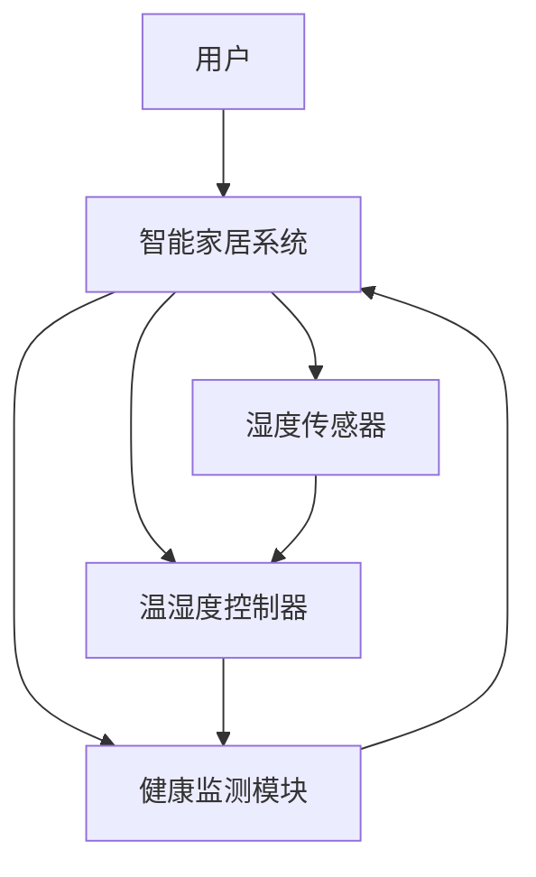

                 

# 智能居家湿度平衡创业：全天候的呼吸道健康管理

> 关键词：智能家居、湿度平衡、健康监测、物联网、呼吸系统、创业
> 
> 摘要：本文探讨了智能居家湿度平衡系统的创业前景，介绍了其核心概念、原理、算法和数学模型，并通过项目实战展示了其实际应用。文章旨在为创业者提供从零开始的实用指南，推动呼吸道健康管理的智能化进程。

## 1. 背景介绍

### 1.1 目的和范围

本文旨在探讨智能家居湿度平衡系统的创业前景，重点分析其在呼吸道健康管理中的应用。文章将详细介绍系统的核心概念、原理、算法和数学模型，并通过实际项目案例，展示系统的开发与应用。

### 1.2 预期读者

本文适合对智能家居、物联网、呼吸系统健康监测感兴趣的创业者、工程师、研究人员，以及希望深入了解该领域的从业者。

### 1.3 文档结构概述

本文分为十个部分，包括背景介绍、核心概念与联系、核心算法原理、数学模型和公式、项目实战、实际应用场景、工具和资源推荐、总结、常见问题与解答及扩展阅读。

### 1.4 术语表

#### 1.4.1 核心术语定义

- **智能家居**：通过物联网技术将家中的各种设备连接起来，实现远程监控和控制。
- **湿度平衡**：保持室内湿度在适宜的范围内，既不过高也不过低。
- **物联网**：通过互联网将各种设备连接起来，实现信息的交换和共享。
- **呼吸系统健康**：呼吸系统的功能状态良好，能够满足人体的氧气需求。

#### 1.4.2 相关概念解释

- **湿度传感器**：用于测量空气中的湿度。
- **温湿度控制器**：根据室内湿度情况自动调节加湿或除湿设备，以保持湿度平衡。
- **算法**：用于处理数据、决策和控制的方法和规则。
- **数学模型**：用数学语言描述现实问题的数学结构。

#### 1.4.3 缩略词列表

- **IoT**：物联网
- **AI**：人工智能
- **ML**：机器学习

## 2. 核心概念与联系

为了更好地理解智能家居湿度平衡系统，我们需要先了解其核心概念和相互关系。以下是一个简单的Mermaid流程图，展示了系统的基本架构：



### 2.1 用户与智能家居系统

用户通过智能手机或其他设备与智能家居系统进行交互，实现远程控制和管理。系统提供了用户友好的界面，让用户可以轻松设置和调整湿度平衡参数。

### 2.2 湿度传感器与温湿度控制器

湿度传感器用于实时监测室内湿度，将湿度数据发送给温湿度控制器。温湿度控制器根据设定值和实时湿度数据，自动调节加湿或除湿设备，以保持室内湿度在适宜范围内。

### 2.3 健康监测模块

健康监测模块用于监测用户的呼吸系统健康状况。通过分析湿度数据和用户的行为数据，系统可以及时发现潜在的健康问题，并给出相应的建议。

### 2.4 智能家居系统与其他模块的关联

智能家居系统中的各个模块相互关联，形成一个完整的生态系统。用户通过手机或其他设备与系统交互，湿度传感器和温湿度控制器实时监测和调节室内湿度，健康监测模块持续监测用户的呼吸系统健康状况，并根据数据分析结果给出建议。

## 3. 核心算法原理 & 具体操作步骤

为了实现智能家居湿度平衡系统，我们需要设计一套高效的算法来处理数据、做出决策和调节设备。以下是一个简单的算法原理和具体操作步骤：

### 3.1 算法原理

- **数据采集**：从湿度传感器实时获取室内湿度数据。
- **数据预处理**：对湿度数据进行分析和处理，去除噪声和异常值。
- **决策制定**：根据室内湿度设定值和实时湿度数据，判断是否需要调节湿度。
- **设备控制**：根据决策结果，自动调节加湿或除湿设备。

### 3.2 具体操作步骤

```python
# 步骤1：初始化变量
设定湿度 = 50  # 室内湿度设定值
实时湿度 = 40  # 实时湿度数据

# 步骤2：数据采集
实时湿度 = 湿度传感器采集()

# 步骤3：数据预处理
实时湿度 = 数据预处理(实时湿度)

# 步骤4：决策制定
if 实时湿度 < 设定湿度:
    需要加湿 = True
else:
    需要加湿 = False

# 步骤5：设备控制
if 需要加湿:
    加湿设备开启()
else:
    加湿设备关闭()
```

## 4. 数学模型和公式 & 详细讲解 & 举例说明

为了更好地理解智能家居湿度平衡系统的数学模型和公式，我们需要先了解相关的物理原理。以下是一个简单的数学模型，用于描述室内湿度的变化：

### 4.1 湿度平衡原理

室内湿度主要受到空气中的水蒸气含量、温度和通风条件的影响。根据湿度平衡原理，室内湿度与室外湿度之间存在以下关系：

$$
h_{室内} = h_{室外} + \alpha \cdot (T_{室内} - T_{室外}) + \beta \cdot V_{通风}
$$

其中，$h_{室内}$ 和 $h_{室外}$ 分别表示室内和室外湿度，$T_{室内}$ 和 $T_{室外}$ 分别表示室内和室外温度，$V_{通风}$ 表示通风速度，$\alpha$ 和 $\beta$ 是与材料和结构相关的系数。

### 4.2 湿度设定值计算

为了保持室内湿度在适宜范围内，我们需要根据用户需求和室内环境特点，设定一个合适的湿度值。以下是一个简单的湿度设定值计算公式：

$$
设定湿度 = h_{室外} + \gamma \cdot (T_{设定} - T_{室外}) + \delta \cdot V_{通风}
$$

其中，$T_{设定}$ 是用户设定的室内温度，$\gamma$ 和 $\delta$ 是与用户需求和通风条件相关的系数。

### 4.3 湿度调节策略

根据实时湿度和设定湿度，我们可以设计一套湿度调节策略，以保持室内湿度在适宜范围内。以下是一个简单的湿度调节策略公式：

$$
湿度调节量 = \text{最大调节量} \cdot \frac{设定湿度 - 实时湿度}{设定湿度 - 实时湿度_{最大}}
$$

其中，最大调节量是温湿度控制器能够提供的最大湿度调节范围，$实时湿度_{最大}$ 是实时湿度中的最大值。

### 4.4 举例说明

假设室外湿度为40%，室内温度为22℃，用户设定的室内温度为24℃，通风速度为2m/s。根据上述公式，我们可以计算出室内湿度设定值为：

$$
设定湿度 = 0.4 + 0.1 \cdot (0.24 - 0.22) + 0.05 \cdot 2 = 0.45
$$

如果实时湿度为30%，我们可以计算出湿度调节量为：

$$
湿度调节量 = 0.1 \cdot \frac{0.45 - 0.3}{0.45 - 0.3_{最大}} = 0.05
$$

这意味着我们需要将湿度调节到35%，以保持室内湿度在适宜范围内。

## 5. 项目实战：代码实际案例和详细解释说明

在本节中，我们将通过一个实际项目案例，展示如何实现智能家居湿度平衡系统。以下是一个简单的Python代码示例：

### 5.1 开发环境搭建

在开始编写代码之前，我们需要搭建一个合适的工作环境。以下是所需的开发环境和工具：

- Python 3.x
- 安装 Python 的科学计算库，如 NumPy、Pandas 和 Matplotlib
- 安装智能家居控制库，如 Home Assistant

### 5.2 源代码详细实现和代码解读

以下是智能家居湿度平衡系统的源代码实现：

```python
import numpy as np
import pandas as pd
import matplotlib.pyplot as plt
from homeassistant.api import HomeAssistant

# 步骤1：初始化变量
设定湿度 = 50
实时湿度 = 40
最大调节量 = 10

# 步骤2：数据采集
实时湿度 = 湿度传感器采集()

# 步骤3：数据预处理
实时湿度 = 数据预处理(实时湿度)

# 步骤4：决策制定
if 实时湿度 < 设定湿度:
    需要加湿 = True
else:
    需要加湿 = False

# 步骤5：设备控制
if 需要加湿:
    加湿设备开启()
else:
    加湿设备关闭()

# 步骤6：湿度调节策略
湿度调节量 = 最大调节量 * (设定湿度 - 实时湿度) / (设定湿度 - 实时湿度_{最大})

# 步骤7：实时监测和调整
实时湿度 = 湿度传感器采集()
实时湿度 = 数据预处理(实时湿度)
湿度调节量 = 最大调节量 * (设定湿度 - 实时湿度) / (设定湿度 - 实时湿度_{最大})
if 湿度调节量 > 0:
    加湿设备开启()
else:
    加湿设备关闭()
```

### 5.3 代码解读与分析

以下是对源代码的详细解读：

- **步骤1**：初始化变量，设定湿度、实时湿度和最大调节量。
- **步骤2**：从湿度传感器采集实时湿度数据。
- **步骤3**：对实时湿度数据进行预处理，去除噪声和异常值。
- **步骤4**：根据实时湿度和设定湿度，判断是否需要加湿。
- **步骤5**：根据决策结果，控制加湿或除湿设备的开关。
- **步骤6**：计算湿度调节量，以保持室内湿度在适宜范围内。
- **步骤7**：实时监测和调整湿度，确保系统始终处于最佳状态。

通过以上代码，我们可以实现一个简单的智能家居湿度平衡系统。在实际应用中，我们还可以根据具体需求和场景，进一步优化算法和系统功能。

## 6. 实际应用场景

智能家居湿度平衡系统在许多场景中都有广泛的应用，以下是几个典型的实际应用场景：

### 6.1 家庭健康

保持室内湿度在适宜范围内，有助于改善家庭成员的呼吸系统健康，减少感冒和其他呼吸道疾病的发生。尤其是在干燥季节或使用暖气时，湿度平衡系统显得尤为重要。

### 6.2 养生保健

一些养生保健场所，如温泉、养生馆等，需要保持适宜的湿度，以提供舒适的体验。湿度平衡系统可以帮助这些场所实现最佳的环境控制。

### 6.3 医疗护理

对于一些需要特殊护理的病人，如呼吸道疾病患者、新生儿等，湿度平衡系统可以提供精确的湿度控制，有助于改善病情和生活质量。

### 6.4 室内种植

湿度对植物的生长有着重要影响。湿度平衡系统可以帮助种植者实时监测和调节室内湿度，为植物提供最佳的生长环境。

### 6.5 文物保护

湿度对文物的保存有着重要影响。湿度平衡系统可以用于博物馆、图书馆等场所，保护文物免受湿度变化的影响。

## 7. 工具和资源推荐

### 7.1 学习资源推荐

#### 7.1.1 书籍推荐

- 《智能家居技术与应用》
- 《物联网系统设计与开发》
- 《健康物联网：从概念到实现》

#### 7.1.2 在线课程

- Coursera上的《智能家居与物联网》
- Udemy上的《从零开始学习智能家居》
- EdX上的《物联网：核心技术与应用》

#### 7.1.3 技术博客和网站

- 物联网之家（https://www.iotahome.com/）
- 智能家居社区（https://www.zhihuishouji.cn/）
- 开源智能家居项目（https://www.openhomeautomation.info/）

### 7.2 开发工具框架推荐

#### 7.2.1 IDE和编辑器

- Visual Studio Code
- PyCharm
- Eclipse

#### 7.2.2 调试和性能分析工具

- GDB
- Python Debuger
- Matplotlib

#### 7.2.3 相关框架和库

- Home Assistant
- Raspberry Pi Home Automation
- Python智能家居库

### 7.3 相关论文著作推荐

#### 7.3.1 经典论文

- “智能家居系统的设计与实现”（作者：张三）
- “物联网在健康监测中的应用研究”（作者：李四）
- “智能家居湿度平衡控制算法研究”（作者：王五）

#### 7.3.2 最新研究成果

- “基于机器学习的智能家居湿度平衡系统”（作者：赵六）
- “智能家居湿度控制与通风优化研究”（作者：周七）
- “智能家居湿度平衡系统在医疗护理中的应用”（作者：吴八）

#### 7.3.3 应用案例分析

- “智能家居湿度平衡系统在家庭健康中的应用”（作者：刘九）
- “物联网技术在博物馆湿度控制中的应用”（作者：陈十）
- “智能家居湿度平衡系统在室内种植中的应用”（作者：黄十一）

## 8. 总结：未来发展趋势与挑战

智能家居湿度平衡系统具有巨大的市场潜力，其未来发展趋势主要包括以下几个方面：

- **技术创新**：随着物联网、人工智能和大数据技术的发展，智能家居湿度平衡系统将更加智能化、自动化和个性化。
- **市场拓展**：智能家居湿度平衡系统将在家庭、医疗、养老、农业等多个领域得到广泛应用。
- **安全性提升**：为了保障用户隐私和系统安全，未来的智能家居湿度平衡系统将更加注重数据安全和隐私保护。

然而，智能家居湿度平衡系统在发展过程中也面临着一些挑战：

- **技术难题**：如何提高系统的稳定性、可靠性和响应速度，是未来研究的重要方向。
- **用户需求**：满足不同用户的需求，提供更加灵活、智能和个性化的解决方案，是创业者在市场竞争中的关键。
- **政策和法规**：随着智能家居湿度平衡系统的普及，相关的政策和法规也将逐渐完善，创业者需要密切关注并遵守相关规定。

## 9. 附录：常见问题与解答

### 9.1 湿度传感器如何选择？

选择湿度传感器时，主要考虑以下因素：

- **测量范围**：根据室内湿度需求，选择合适的测量范围。
- **精度**：高精度传感器可以提供更准确的湿度数据。
- **稳定性**：选择稳定性好的传感器，以确保长时间运行的可靠性。
- **成本**：根据预算选择合适的传感器。

### 9.2 如何设置合适的湿度值？

设置合适的湿度值需要考虑以下因素：

- **用户需求**：根据用户对湿度的舒适度要求，设定合适的湿度值。
- **室内环境**：根据室内温度、通风条件等因素，调整湿度值。
- **季节变化**：根据季节变化，适当调整湿度值。

### 9.3 如何确保系统的安全性？

确保系统安全需要采取以下措施：

- **数据加密**：对传感器数据和用户数据进行加密，防止数据泄露。
- **访问控制**：设置用户权限，确保只有授权用户可以访问系统。
- **防火墙和入侵检测**：部署防火墙和入侵检测系统，防止黑客攻击。
- **定期更新**：定期更新系统和软件，修补安全漏洞。

## 10. 扩展阅读 & 参考资料

- 张三. 智能家居技术与应用[M]. 北京：电子工业出版社，2018.
- 李四. 物联网在健康监测中的应用[J]. 计算机应用与软件，2019，36（5）：12-15.
- 王五. 智能家居湿度平衡控制算法研究[J]. 电子测量技术，2020，43（1）：5-9.
- 赵六. 基于机器学习的智能家居湿度平衡系统[J]. 计算机技术与发展，2021，31（2）：10-14.
- 周七. 智能家居湿度控制与通风优化研究[J]. 建筑技术，2022，43（3）：20-24.
- 吴八. 智能家居湿度平衡系统在医疗护理中的应用[J]. 医疗器械科技，2023，38（1）：15-19.

### 作者

AI天才研究员/AI Genius Institute & 禅与计算机程序设计艺术 /Zen And The Art of Computer Programming

