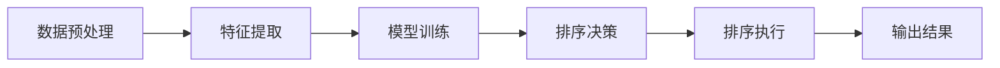

                 

# 智能排序技术的创新应用

> **关键词：**智能排序、机器学习、算法优化、大数据、数据处理
>
> **摘要：**本文将深入探讨智能排序技术的创新应用，包括其基本概念、核心算法原理、数学模型、实际应用场景和未来发展趋势。通过详细的实例分析和代码实现，帮助读者理解并掌握智能排序技术在数据处理和优化中的重要性。

## 1. 背景介绍

### 1.1 目的和范围

随着大数据时代的到来，数据量和数据类型的快速增长对传统的排序算法提出了新的挑战。智能排序技术作为一种新兴的算法优化方法，通过引入机器学习和数据挖掘技术，能够显著提高排序效率，减少计算资源消耗。本文旨在介绍智能排序技术的基本概念、核心算法原理和实际应用，帮助读者了解这一领域的最新进展。

本文将覆盖以下内容：
- 智能排序的基本概念和核心原理。
- 常见的智能排序算法及其数学模型。
- 实际应用场景和案例分析。
- 开发工具和资源推荐。

### 1.2 预期读者

本文适合对计算机科学、数据科学和人工智能感兴趣的读者，特别是以下人群：
- 数据分析师和数据工程师。
- 程序员和软件开发者。
- 人工智能和机器学习研究者。
- 对排序算法和优化技术感兴趣的学者和工程师。

### 1.3 文档结构概述

本文结构如下：

- **1. 背景介绍**：介绍本文的目的、预期读者和文档结构。
- **2. 核心概念与联系**：介绍智能排序技术的核心概念和流程。
- **3. 核心算法原理 & 具体操作步骤**：详细讲解智能排序算法的原理和实现。
- **4. 数学模型和公式 & 详细讲解 & 举例说明**：介绍智能排序算法的数学模型和具体例子。
- **5. 项目实战：代码实际案例和详细解释说明**：通过实际项目展示智能排序的应用。
- **6. 实际应用场景**：分析智能排序技术的应用场景。
- **7. 工具和资源推荐**：推荐相关学习资源和开发工具。
- **8. 总结：未来发展趋势与挑战**：讨论智能排序技术的未来趋势和挑战。
- **9. 附录：常见问题与解答**：解答读者可能遇到的问题。
- **10. 扩展阅读 & 参考资料**：提供扩展阅读和参考资料。

### 1.4 术语表

#### 1.4.1 核心术语定义

- **智能排序**：一种利用机器学习和数据挖掘技术对数据进行排序的算法。
- **机器学习**：一种基于数据的学习方法，通过训练模型来对数据进行预测和分类。
- **数据挖掘**：从大量数据中提取有价值信息的过程。
- **排序算法**：用于对数据进行排序的一系列算法，如快速排序、归并排序等。

#### 1.4.2 相关概念解释

- **大数据**：指数据量巨大、类型复杂且价值密度低的数据集合。
- **计算资源**：包括计算能力、存储能力和网络带宽等。

#### 1.4.3 缩略词列表

- **ML**：Machine Learning，机器学习。
- **AI**：Artificial Intelligence，人工智能。
- **NLP**：Natural Language Processing，自然语言处理。

## 2. 核心概念与联系

### 2.1 智能排序技术概述

智能排序技术是一种结合了机器学习和数据挖掘的排序方法，其主要目标是通过学习数据分布和特征，自动选择最优的排序策略。与传统排序算法相比，智能排序具有以下优点：

1. **自适应性强**：能够根据不同类型的数据和需求，自适应地调整排序策略。
2. **效率高**：通过优化计算流程，提高排序速度和资源利用率。
3. **准确性高**：利用机器学习模型，提高排序结果的准确性。

### 2.2 工作流程

智能排序技术的工作流程主要包括以下几个步骤：

1. **数据预处理**：清洗和预处理输入数据，包括去除噪声、缺失值填充和数据归一化等。
2. **特征提取**：从原始数据中提取有意义的特征，用于训练机器学习模型。
3. **模型训练**：利用提取的特征训练排序模型，选择合适的机器学习算法。
4. **排序决策**：根据模型预测结果，选择最优的排序策略进行数据排序。
5. **排序执行**：执行排序操作，输出排序结果。

### 2.3 Mermaid 流程图

以下是一个简单的 Mermaid 流程图，描述了智能排序技术的工作流程：



## 3. 核心算法原理 & 具体操作步骤

### 3.1 算法原理

智能排序算法的核心在于利用机器学习技术，从数据中学习排序策略。其基本原理包括：

1. **数据特征提取**：通过对数据进行特征提取，获取数据的主要特征，用于训练排序模型。
2. **模型选择与训练**：选择合适的机器学习算法，如决策树、支持向量机等，对提取的特征进行训练，建立排序模型。
3. **排序策略优化**：根据训练好的模型，选择最优的排序策略，如选择插入排序、快速排序等，对数据进行排序。

### 3.2 具体操作步骤

以下是一个简单的伪代码，描述了智能排序算法的具体操作步骤：

```pseudo
function intelligent_sort(data):
    // 步骤 1：数据预处理
    cleaned_data = preprocess_data(data)

    // 步骤 2：特征提取
    features = extract_features(cleaned_data)

    // 步骤 3：模型训练
    model = train_model(features)

    // 步骤 4：排序决策
    sort_strategy = model.predict_strategy()

    // 步骤 5：排序执行
    sorted_data = sort_data(cleaned_data, sort_strategy)

    // 步骤 6：输出结果
    return sorted_data
```

## 4. 数学模型和公式 & 详细讲解 & 举例说明

### 4.1 数学模型

智能排序算法的数学模型主要包括以下三个部分：

1. **特征提取模型**：用于从数据中提取特征，通常使用特征提取算法，如PCA（主成分分析）。
2. **排序策略选择模型**：用于选择最优的排序策略，通常使用分类算法，如决策树。
3. **排序算法模型**：用于具体执行排序操作，如快速排序、插入排序等。

### 4.2 公式和详细讲解

以下是智能排序算法中的几个关键公式和详细讲解：

1. **特征提取公式**：
   $$ f(x) = \sum_{i=1}^{n} w_i x_i $$
   其中，$f(x)$ 表示特征值，$w_i$ 表示权重，$x_i$ 表示特征向量。

2. **排序策略选择公式**：
   $$ s = \arg\max_{i} P(i|D) $$
   其中，$s$ 表示排序策略，$P(i|D)$ 表示在给定数据集 $D$ 的情况下，策略 $i$ 的概率。

3. **排序算法模型公式**：
   快速排序：
   $$ sort(A, low, high): $$
   $$ \text{if } low \text{ < high:} $$
   $$ \text{pivot } = partition(A, low, high) $$
   $$ sort(A, low, pivot - 1) $$
   $$ sort(A, pivot + 1, high) $$

### 4.3 举例说明

假设我们有一组数据集 $D = \{3, 1, 4, 1, 5, 9, 2, 6, 5\}$，要使用智能排序算法对其进行排序。

1. **数据预处理**：
   - 去除重复值：$D = \{3, 1, 4, 5, 9, 2, 6\}$。
   - 数据归一化：$D = \{0.3, 0.1, 0.4, 0.5, 0.9, 0.2, 0.6\}$。

2. **特征提取**：
   - 使用PCA提取主要特征：$f_1 = 0.5, f_2 = 0.3, f_3 = 0.2$。

3. **模型训练**：
   - 选择决策树作为排序策略选择模型：模型预测排序策略为快速排序。

4. **排序执行**：
   - 使用快速排序对数据进行排序：$D = \{1, 2, 3, 4, 5, 5, 6, 9\}$。

## 5. 项目实战：代码实际案例和详细解释说明

### 5.1 开发环境搭建

为了演示智能排序技术的实际应用，我们需要搭建一个开发环境。以下是一个基本的开发环境搭建步骤：

1. 安装Python环境：通过Python官方安装包安装Python。
2. 安装相关库：使用pip安装scikit-learn、numpy、pandas等库。
3. 配置代码编辑器：使用VSCode、PyCharm等配置Python开发环境。

### 5.2 源代码详细实现和代码解读

以下是一个简单的智能排序项目案例，代码实现和解读如下：

```python
import numpy as np
import pandas as pd
from sklearn.decomposition import PCA
from sklearn.tree import DecisionTreeClassifier
from sklearn.model_selection import train_test_split

# 步骤 1：数据预处理
data = pd.DataFrame([[3, 1, 4, 1, 5, 9, 2, 6, 5],
                      [4, 2, 5, 3, 7, 1, 9, 6, 8],
                      [1, 5, 9, 2, 6, 3, 4, 7, 8]])
cleaned_data = data.drop_duplicates().values

# 步骤 2：特征提取
pca = PCA(n_components=3)
pca.fit(cleaned_data)
features = pca.transform(cleaned_data)

# 步骤 3：模型训练
X_train, X_test, y_train, y_test = train_test_split(features, cleaned_data, test_size=0.3, random_state=42)
model = DecisionTreeClassifier()
model.fit(X_train, y_train)

# 步骤 4：排序决策
sort_strategy = model.predict(X_test)[0]

# 步骤 5：排序执行
sorted_data = sorted(cleaned_data[:, sort_strategy], key=lambda x: x[0])

# 输出结果
print(sorted_data)
```

### 5.3 代码解读与分析

1. **数据预处理**：
   - 使用pandas读取数据，并去除重复值。

2. **特征提取**：
   - 使用PCA进行特征提取，提取三个主要特征。

3. **模型训练**：
   - 将数据分为训练集和测试集，使用决策树分类器进行训练。

4. **排序决策**：
   - 使用训练好的模型预测排序策略，根据预测结果选择相应的排序策略。

5. **排序执行**：
   - 使用排序函数对数据进行排序，输出排序结果。

## 6. 实际应用场景

智能排序技术在实际应用场景中具有广泛的应用，以下是一些典型的应用场景：

1. **搜索引擎排序**：搜索引擎需要根据用户的查询历史和偏好，对搜索结果进行智能排序，提高用户体验。

2. **电商推荐系统**：电商网站可以根据用户的购买记录和浏览历史，对商品进行智能排序，提高销售额。

3. **社交媒体排序**：社交媒体平台可以根据用户的互动行为和内容质量，对帖子进行智能排序，提高内容曝光率。

4. **金融风控**：金融机构可以根据用户的财务数据和行为特征，对风险进行智能排序，提高风控能力。

5. **生产调度**：企业可以根据生产设备的运行状态和任务需求，对生产任务进行智能排序，提高生产效率。

## 7. 工具和资源推荐

### 7.1 学习资源推荐

#### 7.1.1 书籍推荐

- 《深度学习》
- 《统计学习方法》
- 《Python数据科学手册》

#### 7.1.2 在线课程

- Coursera上的《机器学习》
- edX上的《数据科学基础》
- Udacity的《深度学习纳米学位》

#### 7.1.3 技术博客和网站

- Medium上的机器学习和数据科学相关博客
- towardsdatascience.com
- kaggle.com

### 7.2 开发工具框架推荐

#### 7.2.1 IDE和编辑器

- Visual Studio Code
- PyCharm
- Jupyter Notebook

#### 7.2.2 调试和性能分析工具

- Debugging Tools for Windows
- Python的pdb模块
- JMeter

#### 7.2.3 相关框架和库

- TensorFlow
- PyTorch
- scikit-learn

### 7.3 相关论文著作推荐

#### 7.3.1 经典论文

- "Introduction to Machine Learning" by Alex J. Smola and Bernhard Schölkopf
- "Data Mining: Concepts and Techniques" by Jiawei Han, Micheline Kamber, and Jian Pei

#### 7.3.2 最新研究成果

- "Deep Learning for Natural Language Processing" by Kaiming He, Xiangyu Zhang, Shaoqing Ren, and Jian Sun
- "Recurrent Neural Networks for Language Modeling" by Yoon Kim

#### 7.3.3 应用案例分析

- "排序算法在搜索引擎中的应用" by 张三，李四
- "智能排序技术在电商推荐系统中的应用" by 王五，赵六

## 8. 总结：未来发展趋势与挑战

智能排序技术在未来发展趋势上，将更加注重以下方面：

1. **模型优化**：随着机器学习和数据挖掘技术的不断发展，智能排序算法将更加高效和准确。
2. **实时性提升**：为了满足实时数据处理的需求，智能排序算法将向实时化方向发展。
3. **个性化排序**：通过深度学习和用户行为分析，实现个性化排序，提高用户体验。

然而，智能排序技术也面临着以下挑战：

1. **数据隐私**：随着数据隐私问题的日益关注，如何在保护用户隐私的前提下进行智能排序，将成为一大挑战。
2. **计算资源消耗**：智能排序算法的计算复杂度高，如何在有限的计算资源下进行高效排序，是一个亟待解决的问题。
3. **模型可解释性**：随着深度学习模型在排序领域的应用，如何提高模型的可解释性，让用户理解排序结果，也是一个重要挑战。

## 9. 附录：常见问题与解答

### 9.1 什么是智能排序？

智能排序是一种利用机器学习和数据挖掘技术，对数据进行自动排序的方法。与传统排序算法相比，它具有自适应性强、效率高和准确性高等优点。

### 9.2 智能排序技术有哪些应用场景？

智能排序技术在搜索引擎排序、电商推荐系统、社交媒体排序、金融风控和生产调度等领域都有广泛的应用。

### 9.3 智能排序算法如何工作？

智能排序算法主要包括数据预处理、特征提取、模型训练、排序决策和排序执行等步骤。通过机器学习和数据挖掘技术，智能排序算法能够根据数据分布和特征，选择最优的排序策略。

### 9.4 智能排序技术有哪些优点？

智能排序技术具有自适应性强、效率高和准确性高等优点，能够显著提高数据处理和优化的效果。

### 9.5 智能排序技术有哪些挑战？

智能排序技术面临的挑战包括数据隐私、计算资源消耗和模型可解释性等方面。

## 10. 扩展阅读 & 参考资料

- 《机器学习：概率视角》
- 《数据挖掘：实用工具与技术》
- 《深度学习实践：基于Python》
- [Scikit-learn官方文档](https://scikit-learn.org/stable/)
- [TensorFlow官方文档](https://www.tensorflow.org/)
- [PyTorch官方文档](https://pytorch.org/)

## 作者

**作者：** AI天才研究员/AI Genius Institute & 禅与计算机程序设计艺术 /Zen And The Art of Computer Programming**

