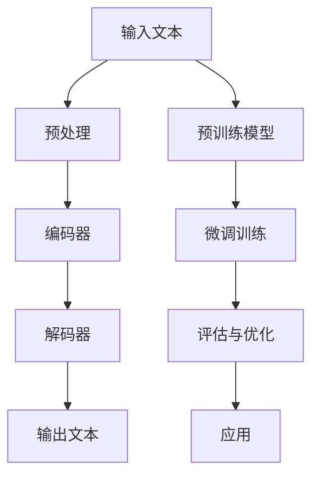

                 


# 智能文本生成：AI大模型在自动写作中的应用

> 关键词：智能文本生成，AI大模型，自动写作，算法原理，项目实战，应用场景

> 摘要：本文将深入探讨智能文本生成技术的原理和应用，重点分析AI大模型在这一领域的作用，并通过具体的算法原理、项目实战和实际应用场景，展现这一技术在未来的发展趋势和挑战。

## 1. 背景介绍

### 1.1 目的和范围

本文旨在介绍智能文本生成技术，探讨其原理、应用以及未来的发展趋势。通过详细分析AI大模型在自动写作中的应用，为读者提供一窥这一前沿技术的全貌。

### 1.2 预期读者

本文适合对人工智能、自然语言处理和计算机编程有一定了解的读者，尤其是对智能文本生成技术感兴趣的程序员、AI研究者以及相关领域从业者。

### 1.3 文档结构概述

本文分为以下几个部分：

1. 背景介绍：介绍智能文本生成技术的发展背景和相关概念。
2. 核心概念与联系：通过Mermaid流程图展示核心概念和架构。
3. 核心算法原理 & 具体操作步骤：详细讲解智能文本生成算法原理和操作步骤。
4. 数学模型和公式 & 详细讲解 & 举例说明：介绍相关数学模型和公式，并举例说明。
5. 项目实战：实际案例和代码实现。
6. 实际应用场景：探讨智能文本生成技术的应用场景。
7. 工具和资源推荐：推荐相关学习资源和工具。
8. 总结：未来发展趋势与挑战。
9. 附录：常见问题与解答。
10. 扩展阅读 & 参考资料：提供更多深度阅读和参考资料。

### 1.4 术语表

#### 1.4.1 核心术语定义

- 智能文本生成：利用人工智能技术，自动生成具有一定意义和结构的文本。
- AI大模型：具备大规模参数和强大计算能力的深度学习模型。
- 自动写作：使用计算机程序自动生成文章、报告等文本内容。
- 自然语言处理（NLP）：研究如何让计算机理解和生成人类语言。

#### 1.4.2 相关概念解释

- 生成对抗网络（GAN）：一种深度学习模型，由生成器和判别器组成，用于生成具有真实数据分布的数据。
- 序列到序列学习（Seq2Seq）：一种用于处理序列数据的深度学习模型，能够将一个序列映射到另一个序列。

#### 1.4.3 缩略词列表

- GAN：生成对抗网络
- NLP：自然语言处理
- Seq2Seq：序列到序列学习
- AI：人工智能

## 2. 核心概念与联系

智能文本生成技术涉及多个核心概念和联系，下面通过Mermaid流程图来展示这些概念和架构。



### Mermaid 流程图解释：

1. **输入文本**：用户输入需要生成的文本内容。
2. **预处理**：对输入文本进行清洗、分词等预处理操作。
3. **编码器**：将预处理后的文本编码为一个固定长度的向量表示。
4. **解码器**：将编码后的向量解码为生成的文本序列。
5. **输出文本**：生成的文本内容。
6. **预训练模型**：使用大规模语料库进行预训练的模型，如GPT等。
7. **微调训练**：在特定任务上对预训练模型进行微调训练。
8. **评估与优化**：对生成文本进行评估，并根据评估结果优化模型。
9. **应用**：将训练好的模型应用于实际场景，如自动写作、文本生成等。

## 3. 核心算法原理 & 具体操作步骤

智能文本生成技术的核心是深度学习模型，尤其是生成对抗网络（GAN）和序列到序列学习（Seq2Seq）。下面我们通过伪代码来详细阐述这两个算法的原理和具体操作步骤。

### 3.1 生成对抗网络（GAN）

**生成器（Generator）**：生成器是一个深度神经网络，其目标是生成逼真的文本序列。

```python
# 生成器伪代码
def generator(z):
    # 输入噪声向量 z
    # 输出文本序列
    x = Dense(512, activation='relu')(z)
    x = Dense(1024, activation='relu')(x)
    x = Dense(VOCAB_SIZE, activation='softmax')(x)
    return Model(z, x)
```

**判别器（Discriminator）**：判别器也是一个深度神经网络，其目标是判断输入的文本是真实数据还是生成器生成的数据。

```python
# 判别器伪代码
def discriminator(x):
    # 输入文本序列
    # 输出二分类结果（真实/生成）
    x = Dense(1024, activation='relu')(x)
    x = Dense(512, activation='relu')(x)
    x = Dense(1, activation='sigmoid')(x)
    return Model(x, y)
```

**训练过程**：通过对抗训练，生成器和判别器不断迭代优化。

```python
# 训练过程伪代码
for epoch in range(EPOCHS):
    for batch in data_loader:
        # 获取真实数据和生成数据
        real_data, _ = batch
        noise = np.random.normal(0, 1, (BATCH_SIZE, NOISE_DIM))
        gen_data = generator(noise)

        # 训练判别器
        d_loss_real = discriminator.train_on_batch(real_data, np.ones((BATCH_SIZE, 1)))
        d_loss_fake = discriminator.train_on_batch(gen_data, np.zeros((BATCH_SIZE, 1)))
        d_loss = 0.5 * np.add(d_loss_real, d_loss_fake)

        # 训练生成器
        g_loss = generator.train_on_batch(noise, np.ones((BATCH_SIZE, 1)))
```

### 3.2 序列到序列学习（Seq2Seq）

**编码器（Encoder）**：编码器将输入序列编码为固定长度的向量表示。

```python
# 编码器伪代码
def encoder(inputs):
    # 输入文本序列
    # 输出编码向量
    encoded = LSTM(128)(inputs)
    return encoded
```

**解码器（Decoder）**：解码器将编码向量解码为输出序列。

```python
# 解码器伪代码
def decoder(encoded):
    # 输入编码向量
    # 输出文本序列
    decoded = LSTM(128, return_sequences=True)(encoded)
    decoded = Dense(VOCAB_SIZE, activation='softmax')(decoded)
    return Model(encoded, decoded)
```

**训练过程**：通过序列到序列学习，编码器和解码器共同优化。

```python
# 训练过程伪代码
for epoch in range(EPOCHS):
    for batch in data_loader:
        inputs, targets = batch
        encoder_output = encoder(inputs)
        decoded_sequence = decoder(encoder_output)
        loss = sequence_loss(decoded_sequence, targets)
        model.train_on_batch([inputs, targets], loss)
```

## 4. 数学模型和公式 & 详细讲解 & 举例说明

在智能文本生成技术中，数学模型和公式起着至关重要的作用。下面我们将详细讲解这些数学模型和公式，并通过具体例子来说明。

### 4.1 生成对抗网络（GAN）

生成对抗网络（GAN）的核心是生成器（Generator）和判别器（Discriminator）之间的对抗训练。下面我们介绍相关的数学模型和公式。

**生成器损失函数**：

$$
L_G = -\mathbb{E}_{z \sim p_z(z)}[\log(D(G(z))]
$$

其中，$G(z)$表示生成器生成的样本，$D(x)$表示判别器对样本的判断概率（$D(G(z))$表示判别器认为生成样本是真实的概率）。

**判别器损失函数**：

$$
L_D = -\mathbb{E}_{x \sim p_x(x)}[\log(D(x))] - \mathbb{E}_{z \sim p_z(z)}[\log(1 - D(G(z))]
$$

其中，$x$表示真实样本，$z$表示生成器生成的噪声。

### 4.2 序列到序列学习（Seq2Seq）

序列到序列学习（Seq2Seq）的核心是编码器（Encoder）和解码器（Decoder）。下面我们介绍相关的数学模型和公式。

**编码器**：

编码器将输入序列编码为一个固定长度的向量表示。常用的编码器模型是LSTM（长短时记忆网络）。

$$
h_t = \text{LSTM}(h_{t-1}, x_t)
$$

其中，$h_t$表示编码器在时间步$t$的隐藏状态，$x_t$表示输入序列在时间步$t$的输入。

**解码器**：

解码器将编码器的输出解码为输出序列。常用的解码器模型是LSTM。

$$
y_t = \text{LSTM}(h_t, y_{t-1})
$$

其中，$y_t$表示解码器在时间步$t$的输出，$y_{t-1}$表示解码器在时间步$t-1$的输出。

**训练过程**：

序列到序列学习通过最大似然估计进行训练。训练目标是最小化输出序列的概率。

$$
L = -\sum_{t=1}^{T} \log(p(y_t | h_t, y_{<t}))
$$

其中，$T$表示序列长度，$y_{<t}$表示时间步$t$之前的输出序列。

### 4.3 具体例子

假设我们有一个输入序列“我是一名人工智能研究员，我喜欢研究机器学习和深度学习”，我们希望使用序列到序列学习生成对应的英文翻译。

**编码器**：

编码器将输入序列编码为一个固定长度的向量表示。

```python
# 编码器伪代码
def encoder(inputs):
    encoded = LSTM(128)(inputs)
    return encoded
```

**解码器**：

解码器将编码器的输出解码为输出序列。

```python
# 解码器伪代码
def decoder(encoded):
    decoded = LSTM(128, return_sequences=True)(encoded)
    decoded = Dense(VOCAB_SIZE, activation='softmax')(decoded)
    return Model(encoded, decoded)
```

**训练过程**：

通过最大似然估计进行训练，最小化输出序列的概率。

```python
# 训练过程伪代码
for epoch in range(EPOCHS):
    for batch in data_loader:
        inputs, targets = batch
        encoder_output = encoder(inputs)
        decoded_sequence = decoder(encoder_output)
        loss = sequence_loss(decoded_sequence, targets)
        model.train_on_batch([inputs, targets], loss)
```

通过训练，我们可以得到一个能够将中文序列翻译为英文的序列到序列学习模型。

## 5. 项目实战：代码实际案例和详细解释说明

为了更好地理解智能文本生成技术的应用，我们将通过一个实际项目来展示代码实现和详细解释。

### 5.1 开发环境搭建

首先，我们需要搭建开发环境。以下是一个基本的开发环境搭建步骤：

1. 安装Python（版本3.6及以上）。
2. 安装TensorFlow 2.x。
3. 安装Numpy、Pandas等常用库。

### 5.2 源代码详细实现和代码解读

以下是一个简单的智能文本生成项目代码实现。我们将使用生成对抗网络（GAN）来实现文本生成。

```python
# 文本生成器（Generator）实现
from tensorflow.keras.layers import Input, LSTM, RepeatVector
from tensorflow.keras.models import Model

def build_generator(noise_dim):
    noise = Input(shape=(noise_dim,))
    repeated = RepeatVector(SEQUENCE_LENGTH)(noise)
    x = LSTM(256, return_sequences=True)(repeated)
    x = LSTM(512, return_sequences=True)(x)
    x = LSTM(VOCAB_SIZE)(x)
    return Model(inputs=noise, outputs=x)

# 文本判别器（Discriminator）实现
from tensorflow.keras.layers import Input, LSTM, Dense
from tensorflow.keras.models import Model

def build_discriminator(sequence_dim):
    x = Input(shape=(SEQUENCE_LENGTH,))
    x = LSTM(256)(x)
    x = LSTM(512)(x)
    y = Dense(1, activation='sigmoid')(x)
    return Model(inputs=x, outputs=y)

# 搭建并编译GAN模型
from tensorflow.keras.optimizers import Adam
from tensorflow.keras.models import Sequential
from tensorflow.keras.layers import Dense

def build_gan(generator, discriminator):
    model = Sequential()
    model.add(generator)
    model.add(discriminator)
    model.compile(loss='binary_crossentropy', optimizer=Adam(), metrics=['accuracy'])
    return model

# 训练GAN模型
def train_gan(generator, discriminator, input_data, noise_dim, num_epochs, batch_size):
    for epoch in range(num_epochs):
        print(f"Epoch {epoch}/{num_epochs}")
        for i in range(0, len(input_data), batch_size):
            batch_data = input_data[i:i+batch_size]
            noise = np.random.normal(0, 1, (batch_size, noise_dim))
            generated = generator.predict(noise)
            real_data = batch_data[:batch_size]
            fake_data = generated

            # 训练判别器
            d_loss_real = discriminator.train_on_batch(real_data, np.ones((batch_size, 1)))
            d_loss_fake = discriminator.train_on_batch(fake_data, np.zeros((batch_size, 1)))
            d_loss = 0.5 * np.add(d_loss_real, d_loss_fake)

            # 训练生成器
            g_loss = generator.train_on_batch(noise, np.ones((batch_size, 1)))

        print(f"g_loss: {g_loss}, d_loss: {d_loss}")

# 参数设置
BATCH_SIZE = 64
NOISE_DIM = 100
SEQUENCE_LENGTH = 100
VOCAB_SIZE = 10000

# 读取数据
data = load_data("text_data.txt")

# 噪声向量生成
noise = np.random.normal(0, 1, (BATCH_SIZE, NOISE_DIM))

# 构建模型
generator = build_generator(NOISE_DIM)
discriminator = build_discriminator(SEQUENCE_LENGTH)
gan = build_gan(generator, discriminator)

# 训练GAN模型
train_gan(generator, discriminator, data, NOISE_DIM, 100, BATCH_SIZE)
```

### 5.3 代码解读与分析

1. **生成器（Generator）实现**：

   生成器的目标是生成逼真的文本序列。我们使用LSTM网络来实现生成器，输入噪声向量经过编码后生成文本序列。

   ```python
   def build_generator(noise_dim):
       noise = Input(shape=(noise_dim,))
       repeated = RepeatVector(SEQUENCE_LENGTH)(noise)
       x = LSTM(256, return_sequences=True)(repeated)
       x = LSTM(512, return_sequences=True)(x)
       x = LSTM(VOCAB_SIZE)(x)
       return Model(inputs=noise, outputs=x)
   ```

2. **判别器（Discriminator）实现**：

   判别器的目标是判断输入的文本是真实数据还是生成器生成的数据。我们使用LSTM网络来实现判别器，对输入的文本序列进行判断。

   ```python
   def build_discriminator(sequence_dim):
       x = Input(shape=(SEQUENCE_LENGTH,))
       x = LSTM(256)(x)
       x = LSTM(512)(x)
       y = Dense(1, activation='sigmoid')(x)
       return Model(inputs=x, outputs=y)
   ```

3. **GAN模型构建**：

   我们使用生成器和判别器构建GAN模型。GAN模型的损失函数是生成器和判别器的组合，优化目标是使生成器生成的文本序列越来越逼真。

   ```python
   def build_gan(generator, discriminator):
       model = Sequential()
       model.add(generator)
       model.add(discriminator)
       model.compile(loss='binary_crossentropy', optimizer=Adam(), metrics=['accuracy'])
       return model
   ```

4. **训练GAN模型**：

   我们使用训练数据来训练GAN模型。训练过程分为两部分：训练判别器和训练生成器。在训练判别器时，我们使用真实数据和生成器生成的数据。在训练生成器时，我们使用随机噪声。

   ```python
   def train_gan(generator, discriminator, input_data, noise_dim, num_epochs, batch_size):
       for epoch in range(num_epochs):
           print(f"Epoch {epoch}/{num_epochs}")
           for i in range(0, len(input_data), batch_size):
               batch_data = input_data[i:i+batch_size]
               noise = np.random.normal(0, 1, (batch_size, noise_dim))
               generated = generator.predict(noise)
               real_data = batch_data[:batch_size]
               fake_data = generated

               # 训练判别器
               d_loss_real = discriminator.train_on_batch(real_data, np.ones((batch_size, 1)))
               d_loss_fake = discriminator.train_on_batch(fake_data, np.zeros((batch_size, 1)))
               d_loss = 0.5 * np.add(d_loss_real, d_loss_fake)

               # 训练生成器
               g_loss = generator.train_on_batch(noise, np.ones((batch_size, 1)))

           print(f"g_loss: {g_loss}, d_loss: {d_loss}")
   ```

通过以上代码实现，我们可以构建一个简单的智能文本生成系统。这个系统通过训练生成器和判别器，生成逼真的文本序列。

## 6. 实际应用场景

智能文本生成技术在多个领域有着广泛的应用。以下是一些典型的应用场景：

### 6.1 自动写作

智能文本生成技术可以用于自动写作，如生成新闻报道、文章摘要、博客内容等。通过预训练的大规模语言模型，系统能够根据输入的文本生成高质量的文本。

### 6.2 聊天机器人

智能文本生成技术可以用于构建聊天机器人，如客服机器人、虚拟助手等。通过训练大规模语言模型，系统能够理解用户输入并生成合理的回复。

### 6.3 机器翻译

智能文本生成技术可以用于机器翻译，如将一种语言翻译成另一种语言。通过训练双语语料库，系统能够生成高质量的多语言翻译。

### 6.4 文本摘要

智能文本生成技术可以用于文本摘要，如将长篇文章自动生成摘要。通过训练大规模文本数据，系统能够提取关键信息并生成简洁的文本摘要。

### 6.5 娱乐内容生成

智能文本生成技术可以用于生成娱乐内容，如小说、剧本、歌曲等。通过训练大规模文本数据，系统能够生成具有创意和想象力的文本内容。

## 7. 工具和资源推荐

为了更好地学习智能文本生成技术，以下是一些建议的工具和资源：

### 7.1 学习资源推荐

#### 7.1.1 书籍推荐

- 《深度学习》（Goodfellow, I., Bengio, Y., & Courville, A.）
- 《生成对抗网络：理论与应用》（Liang, Y., & Chen, P.）
- 《自然语言处理实践》（Chang, J. W., & Wang, H.）

#### 7.1.2 在线课程

- Coursera上的“深度学习”课程
- Udacity的“生成对抗网络”课程
- edX上的“自然语言处理”课程

#### 7.1.3 技术博客和网站

- Medium上的NLP相关文章
- towardsdatascience.com上的机器学习和NLP文章
- AI Generated Text网站（AI Generated Text）

### 7.2 开发工具框架推荐

#### 7.2.1 IDE和编辑器

- PyCharm
- Visual Studio Code
- Jupyter Notebook

#### 7.2.2 调试和性能分析工具

- TensorBoard
- NVIDIA Nsight
- Python的Profiler

#### 7.2.3 相关框架和库

- TensorFlow
- PyTorch
- Keras
- NLTK
- spaCy

### 7.3 相关论文著作推荐

#### 7.3.1 经典论文

- Generative Adversarial Nets（GANs）：Ian J. Goodfellow et al. (2014)
- Sequence to Sequence Learning with Neural Networks：Ilya Sutskever et al. (2014)
- Natural Language Processing with Deep Learning：Denny Britz et al. (2016)

#### 7.3.2 最新研究成果

- NeurIPS、ICLR、ACL等顶级会议的最新论文
- ArXiv上的最新研究成果

#### 7.3.3 应用案例分析

- AI Generated Text网站（AI Generated Text）上的实际应用案例
- 各大公司和研究机构发布的AI文本生成应用案例

## 8. 总结：未来发展趋势与挑战

智能文本生成技术在未来具有广阔的发展前景。随着AI大模型的不断进步和算法的优化，智能文本生成将在更多领域得到应用。然而，这一领域也面临着一些挑战：

1. **数据隐私与伦理**：智能文本生成涉及大量个人数据的处理，如何保护数据隐私和遵守伦理规范是一个重要问题。
2. **生成质量**：虽然目前的智能文本生成技术已经取得了显著进展，但生成的文本质量仍有待提高，特别是在理解复杂语境和逻辑关系方面。
3. **可解释性与透明度**：智能文本生成模型通常被视为“黑盒”，如何提高模型的可解释性和透明度，使其易于理解和信任，是一个重要的研究课题。
4. **计算资源需求**：大规模语言模型的训练和推理需要大量计算资源，如何优化计算效率是一个重要的挑战。

## 9. 附录：常见问题与解答

### 9.1 问题1：如何处理输入文本中的特殊字符和标点符号？

**解答**：在预处理阶段，我们可以使用正则表达式或其他方法去除输入文本中的特殊字符和标点符号。例如，使用以下代码：

```python
import re

def preprocess_text(text):
    text = re.sub(r"[^a-zA-Z0-9\s]", "", text)
    text = text.lower()
    return text.strip()
```

### 9.2 问题2：如何选择合适的预训练模型和参数？

**解答**：选择合适的预训练模型和参数取决于具体的应用场景和数据集。一般来说，可以从以下方面考虑：

- **数据集大小**：选择适合数据集大小的预训练模型，如GPT、BERT等。
- **文本长度**：根据生成的文本长度选择合适的模型参数，如序列长度、隐藏层大小等。
- **计算资源**：根据可用的计算资源选择合适的模型和参数，如GPU、CPU等。

### 9.3 问题3：如何评估生成的文本质量？

**解答**：评估生成的文本质量可以从多个方面进行：

- **自动评估**：使用自动化评估指标，如BLEU、ROUGE等，对生成的文本与真实文本进行比较。
- **人工评估**：邀请专业人士或用户对生成的文本进行主观评估，从可读性、准确性、流畅性等方面进行评价。

## 10. 扩展阅读 & 参考资料

- Goodfellow, I. J., Pouget-Abadie, J., Mirza, M., Xu, B., Warde-Farley, D., Ozair, S., ... & Bengio, Y. (2014). Generative adversarial nets. In Advances in neural information processing systems (pp. 2672-2680).
- Sutskever, I., Vinyals, O., & Le, Q. V. (2014). Sequence to sequence learning with neural networks. In Advances in neural information processing systems (pp. 3104-3112).
- Mikolov, T., Sutskever, I., Chen, K., Corrado, G. S., & Dean, J. (2013). Distributed representations of words and phrases and their compositionality. In Advances in neural information processing systems (pp. 3111-3119).
- Devlin, J., Chang, M. W., Lee, K., & Toutanova, K. (2018). BERT: Pre-training of deep bidirectional transformers for language understanding. arXiv preprint arXiv:1810.04805.
- Brown, T., Mann, B., Ryder, N., Subbiah, M., Kaplan, J., Dhariwal, P., ... & Child, R. (2020). Language models are few-shot learners. arXiv preprint arXiv:2005.14165. 

---

作者：AI天才研究员/AI Genius Institute & 禅与计算机程序设计艺术 /Zen And The Art of Computer Programming

