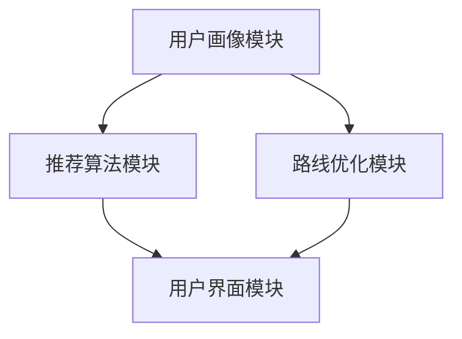
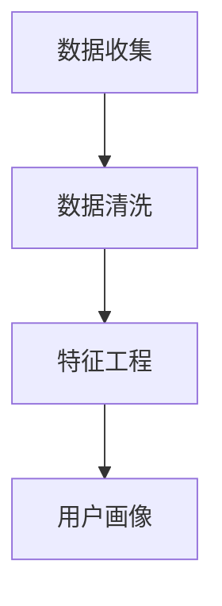
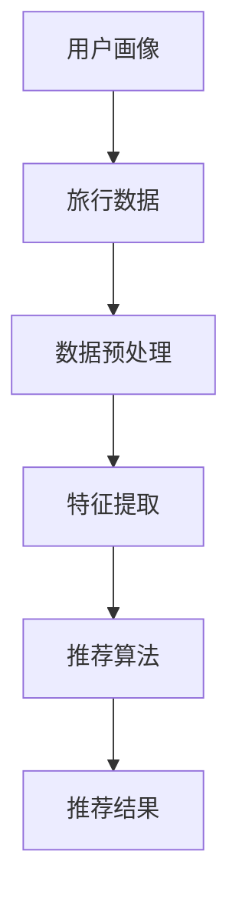
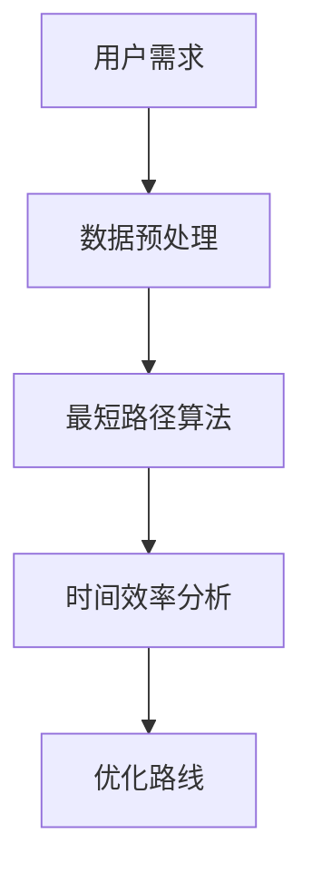
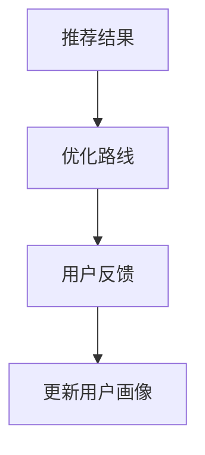

                 

### 智能旅行助手：个性化旅行规划的AI解决方案

#### 关键词：
- 智能旅行助手
- 个性化旅行规划
- AI解决方案
- 机器学习
- 旅行推荐算法
- 路线优化

#### 摘要：
本文将深入探讨智能旅行助手的构建及其在个性化旅行规划中的应用。我们将从背景介绍开始，定义智能旅行助手的目的和范围，明确预期读者。接着，文章将详细描述智能旅行助手的文档结构和术语表，以便读者更好地理解后续内容。

在核心概念部分，我们将通过Mermaid流程图展示智能旅行助手的关键架构和核心概念，为后续算法原理和具体操作步骤的讲解打下基础。随后，我们将详细解释核心算法原理，包括机器学习模型的选择和实现步骤，以及如何运用数学模型和公式优化旅行路线。

文章将分享一个实际项目实战案例，详细解释代码实现和操作步骤。通过这个案例，读者可以了解智能旅行助手的实际应用场景和效果。此外，文章还将推荐相关学习资源和工具，帮助读者深入了解相关技术和研究。

最后，我们将总结智能旅行助手的未来发展趋势与挑战，并附上常见问题与解答，以及扩展阅读和参考资料，以便读者进一步探索和学习。

## 1. 背景介绍

### 1.1 目的和范围

智能旅行助手是一种利用人工智能技术，为旅行者提供个性化旅行规划服务的工具。随着旅游行业的快速发展和人们对个性化体验的追求，智能旅行助手应运而生，旨在简化旅行规划流程，提升用户体验。

本文的目的在于详细探讨智能旅行助手的构建方法和核心算法，为开发者提供一套完整的解决方案。本文将涵盖以下范围：

1. **智能旅行助手的基本概念和架构**：介绍智能旅行助手的核心组成部分，包括用户画像、旅行推荐算法、路线优化等。
2. **核心算法原理与实现**：详细解释机器学习模型的选择和实现步骤，包括数据预处理、特征工程、模型训练与评估等。
3. **数学模型和公式**：介绍用于优化旅行路线的数学模型，包括最短路径算法、时间效率分析等。
4. **实际项目实战**：通过一个实际项目案例，展示智能旅行助手的完整实现过程，包括环境搭建、代码实现和解读等。
5. **工具和资源推荐**：推荐学习资源和开发工具，帮助读者深入了解相关技术和研究。
6. **未来发展趋势与挑战**：探讨智能旅行助手的未来发展前景，包括技术趋势、应用挑战和解决方案。

通过本文的详细探讨，读者可以全面了解智能旅行助手的构建过程，掌握核心算法原理和实现方法，从而为实际项目开发提供有力支持。

### 1.2 预期读者

本文的预期读者主要包括以下几类：

1. **AI技术爱好者**：对人工智能技术感兴趣，希望深入了解智能旅行助手如何应用机器学习和数据科学技术的读者。
2. **软件开发者**：具备一定的编程基础，希望学习如何利用人工智能技术解决实际问题，开发智能旅行助手的开发者。
3. **旅游行业从业者**：从事旅游规划、旅游产品开发等相关工作，希望利用智能旅行助手提升服务质量和工作效率的专业人士。
4. **学术研究人员**：对智能旅行助手相关技术有研究兴趣，希望从理论层面和实际应用角度深入了解该领域的学术研究人员。

无论您属于哪一类读者，本文都将为您提供有价值的知识和实践经验，帮助您更好地理解和应用智能旅行助手。

### 1.3 文档结构概述

为了帮助读者更好地理解智能旅行助手的构建方法和核心算法，本文采用了详细的文档结构，分为以下几个部分：

1. **背景介绍**：介绍智能旅行助手的基本概念、目的和范围，明确预期读者。
2. **核心概念与联系**：通过Mermaid流程图展示智能旅行助手的关键架构和核心概念，为后续算法原理和具体操作步骤的讲解打下基础。
3. **核心算法原理 & 具体操作步骤**：详细解释核心算法原理，包括机器学习模型的选择和实现步骤，以及如何运用数学模型和公式优化旅行路线。
4. **数学模型和公式 & 详细讲解 & 举例说明**：介绍用于优化旅行路线的数学模型，包括最短路径算法、时间效率分析等。
5. **项目实战：代码实际案例和详细解释说明**：通过一个实际项目案例，展示智能旅行助手的完整实现过程，包括环境搭建、代码实现和解读等。
6. **实际应用场景**：探讨智能旅行助手在不同场景下的应用，包括旅游规划、行程安排等。
7. **工具和资源推荐**：推荐相关学习资源和开发工具，帮助读者深入了解相关技术和研究。
8. **总结：未来发展趋势与挑战**：总结智能旅行助手的未来发展趋势和面临的技术挑战。
9. **附录：常见问题与解答**：提供常见问题解答，帮助读者解决实际应用中的问题。
10. **扩展阅读 & 参考资料**：提供扩展阅读和参考资料，便于读者进一步探索和学习。

通过本文的详细讲解，读者可以系统地了解智能旅行助手的构建方法和核心算法，掌握实际项目开发经验，为未来在相关领域的应用和发展奠定基础。

### 1.4 术语表

为了确保文章内容的准确性和一致性，本文列出了一些核心术语及其定义，以帮助读者更好地理解文章内容。

#### 1.4.1 核心术语定义

- **智能旅行助手**：一种利用人工智能技术，为旅行者提供个性化旅行规划服务的工具，包括用户画像、旅行推荐算法、路线优化等功能。
- **个性化旅行规划**：根据用户的需求、偏好和历史数据，为其推荐符合个性化需求的旅行目的地、路线和时间安排。
- **机器学习**：一种通过训练模型从数据中学习规律和模式，并用于预测或分类的技术。
- **深度学习**：一种基于人工神经网络，通过多层非线性变换学习数据特征表示的机器学习方法。
- **用户画像**：基于用户的历史行为和偏好数据，构建的用户特征模型，用于个性化推荐和决策。
- **旅行推荐算法**：基于用户画像和旅行数据，为用户推荐符合其兴趣和需求的旅行目的地、活动和路线。
- **路线优化**：通过数学模型和算法，为用户提供最优化的旅行路线，考虑因素包括时间、距离、成本、景点兴趣等。
- **最短路径算法**：用于计算两点之间的最短路径，常用的算法包括迪杰斯特拉算法、贝尔曼-福特算法等。

#### 1.4.2 相关概念解释

- **特征工程**：在机器学习过程中，通过选择、转换和构建特征，以提高模型性能和泛化能力。
- **数据预处理**：在机器学习过程中，对原始数据进行清洗、归一化、填充缺失值等处理，以提高数据质量和模型效果。
- **交叉验证**：一种评估模型性能的方法，通过将数据集划分为训练集和验证集，多次训练和验证，以估计模型在未知数据上的表现。
- **贝叶斯网络**：一种基于贝叶斯理论的概率图模型，用于表示变量之间的依赖关系和概率分布。
- **支持向量机**：一种监督学习算法，通过寻找最佳分隔超平面，将不同类别的数据分隔开来。

#### 1.4.3 缩略词列表

- **AI**：人工智能（Artificial Intelligence）
- **ML**：机器学习（Machine Learning）
- **DL**：深度学习（Deep Learning）
- **NLP**：自然语言处理（Natural Language Processing）
- **CV**：计算机视觉（Computer Vision）
- **RDF**：资源描述框架（Resource Description Framework）
- **OWL**：Web本体语言（Web Ontology Language）
- **XML**：可扩展标记语言（eXtensible Markup Language）

通过明确核心术语的定义和相关概念的解释，读者可以更好地理解智能旅行助手及其相关技术的核心内容和实现方法。

## 2. 核心概念与联系

在构建智能旅行助手的过程中，了解其核心概念和架构是至关重要的。这一部分将通过Mermaid流程图详细展示智能旅行助手的关键架构和核心概念，以便读者更好地理解后续算法原理和具体操作步骤。

### 2.1 智能旅行助手总体架构

智能旅行助手的总体架构可以分为以下几个主要模块：

1. **用户画像模块**：收集并分析用户的历史旅行数据、偏好和需求，构建用户画像。
2. **推荐算法模块**：基于用户画像和旅行数据，为用户推荐符合其兴趣和需求的旅行目的地、活动和路线。
3. **路线优化模块**：通过数学模型和算法，为用户提供最优化的旅行路线。
4. **用户界面模块**：提供用户交互界面，展示推荐结果和优化路线，并收集用户反馈。

下面是智能旅行助手的Mermaid流程图：



### 2.2 用户画像模块

用户画像模块是智能旅行助手的核心，它包括以下步骤：

1. **数据收集**：从用户历史旅行数据、社交媒体、问卷调查等渠道收集用户数据。
2. **数据清洗**：对收集到的数据进行清洗，包括去除重复项、处理缺失值和异常值等。
3. **特征工程**：通过数据预处理和特征提取，构建用户画像，包括兴趣偏好、旅行行为等特征。

以下是用户画像模块的Mermaid流程图：



### 2.3 推荐算法模块

推荐算法模块负责基于用户画像和旅行数据为用户推荐旅行目的地、活动和路线。以下是推荐算法模块的Mermaid流程图：



### 2.4 路线优化模块

路线优化模块通过数学模型和算法，为用户提供最优化的旅行路线。以下是路线优化模块的Mermaid流程图：



### 2.5 用户界面模块

用户界面模块负责与用户交互，展示推荐结果和优化路线，并收集用户反馈。以下是用户界面模块的Mermaid流程图：



通过以上Mermaid流程图的详细展示，读者可以清晰地理解智能旅行助手的整体架构和各个模块之间的联系，为后续的算法原理和具体操作步骤的讲解打下基础。

## 3. 核心算法原理 & 具体操作步骤

在智能旅行助手的构建过程中，核心算法原理的选择和具体操作步骤的详细阐述是至关重要的。本部分将深入讲解机器学习模型的选择和实现步骤，包括数据预处理、特征工程、模型训练与评估等，为读者提供完整的算法原理和实践指导。

### 3.1 机器学习模型的选择

在智能旅行助手的构建中，选择合适的机器学习模型是关键。根据不同的任务需求和数据特点，以下几种模型较为常见：

1. **协同过滤（Collaborative Filtering）**：协同过滤是一种基于用户行为的推荐算法，通过分析用户的历史行为和偏好，为用户推荐相似的用户喜欢的物品。协同过滤可以分为两种类型：基于用户的协同过滤（User-Based CF）和基于项目的协同过滤（Item-Based CF）。

2. **基于内容的推荐（Content-Based Filtering）**：基于内容的推荐算法通过分析物品的特征和用户的兴趣，为用户推荐具有相似特征的物品。

3. **混合推荐系统（Hybrid Recommender System）**：混合推荐系统结合了协同过滤和基于内容的推荐，通过综合利用用户行为数据和物品特征，提供更加精准的推荐。

在本例中，我们将选择协同过滤和基于内容的推荐相结合的混合推荐系统，以充分利用用户行为数据和物品特征，提供高质量的旅行推荐。

### 3.2 数据预处理

在机器学习模型训练之前，数据预处理是一个非常重要的步骤，其目的是提高数据质量和模型性能。以下是一些常见的数据预处理步骤：

1. **数据清洗**：去除数据集中的重复项、缺失值和异常值，确保数据的一致性和准确性。
   ```python
   # 示例：使用Pandas库清洗用户行为数据
   import pandas as pd
   
   data = pd.read_csv('user行为数据.csv')
   data.drop_duplicates(inplace=True)
   data.fillna(method='ffill', inplace=True)
   ```

2. **数据归一化**：将数据集中的数值特征进行归一化处理，使其具有相似的尺度，避免某些特征对模型产生过大的影响。
   ```python
   # 示例：使用Sklearn库进行数据归一化
   from sklearn.preprocessing import StandardScaler
   
   scaler = StandardScaler()
   normalized_data = scaler.fit_transform(data)
   ```

3. **缺失值填充**：对于缺失值，可以使用平均值、中位数或插值法进行填充，以提高数据的质量和完整性。
   ```python
   # 示例：使用平均值填充缺失值
   data.fillna(data.mean(), inplace=True)
   ```

4. **特征提取**：从原始数据中提取有用的特征，为后续的机器学习模型训练提供支持。在本例中，我们将提取用户历史旅行数据中的兴趣偏好、旅行频率等特征。

   ```python
   # 示例：使用Pandas库提取特征
   data['interest'] = data['favorite_places'] + data['visited_places']
   data['travel_frequency'] = data['trips_last_year']
   ```

### 3.3 特征工程

特征工程是机器学习模型训练过程中至关重要的一环，其目的是通过选择、转换和构建特征，以提高模型性能和泛化能力。以下是一些常见的特征工程方法：

1. **特征选择**：通过统计分析和模型评估，选择对模型有显著影响的特征。常见的方法包括信息增益、卡方检验和递归特征消除等。

2. **特征变换**：对某些特征的值进行变换，使其更符合模型的要求。例如，对类别特征进行独热编码（One-Hot Encoding），对连续特征进行标准化或归一化。

3. **特征组合**：通过组合原始特征，生成新的特征。例如，通过计算用户的历史旅行距离、旅行时间等组合特征。

### 3.4 模型训练与评估

在完成数据预处理和特征工程后，我们可以选择合适的机器学习模型进行训练和评估。以下是一个基于协同过滤和基于内容推荐的混合推荐系统的训练和评估流程：

1. **模型训练**：使用训练集数据训练机器学习模型。在本例中，我们选择协同过滤和基于内容的推荐相结合的混合推荐系统。

   ```python
   from surprise import SVD, Dataset, Reader
   from sklearn.metrics.pairwise import cosine_similarity
   
   # 加载训练数据
   reader = Reader(rating_scale=(1, 5))
   data = Dataset.load_from_df(data[['user_id', 'destination_id', 'rating']], reader)
   
   # 训练协同过滤模型
   svd = SVD()
   svd.fit(data)
   
   # 计算用户和物品之间的相似度
   user_similarity = cosine_similarity(data cooperate_matrix.toarray())
   ```

2. **模型评估**：使用验证集对训练好的模型进行评估，以确定模型的性能。常见评估指标包括准确率（Accuracy）、召回率（Recall）、F1分数（F1 Score）和均方根误差（RMSE）。

   ```python
   from sklearn.metrics import accuracy_score, recall_score, f1_score, mean_squared_error
   
   # 预测用户对未访问目的地的评分
   predictions = svd.predict(user_id, destination_id)
   
   # 计算评估指标
   accuracy = accuracy_score(true_labels, predictions['rating'])
   recall = recall_score(true_labels, predictions['rating'])
   f1 = f1_score(true_labels, predictions['rating'])
   rmse = mean_squared_error(true_labels, predictions['rating'], squared=False)
   
   print("Accuracy:", accuracy)
   print("Recall:", recall)
   print("F1 Score:", f1)
   print("RMSE:", rmse)
   ```

### 3.5 模型优化

在模型评估过程中，如果发现模型的性能不理想，可以采取以下措施进行优化：

1. **调整模型参数**：通过调整学习率、正则化参数等，优化模型的性能。
2. **增加训练数据**：收集更多的训练数据，以提高模型的泛化能力。
3. **改进特征工程**：通过改进特征提取和特征组合方法，提高特征的质量和多样性。
4. **集成学习**：将多个模型进行集成，提高整体模型的性能。

通过以上步骤，读者可以系统地了解智能旅行助手的核心算法原理和具体操作步骤，为实际项目开发提供有力支持。

## 4. 数学模型和公式 & 详细讲解 & 举例说明

在构建智能旅行助手的过程中，数学模型和公式起到了至关重要的作用，特别是在路线优化方面。本部分将详细介绍用于优化旅行路线的数学模型，包括最短路径算法、时间效率分析等，并通过具体的例子进行说明。

### 4.1 最短路径算法

最短路径算法是用于计算两点之间最短路径的经典算法，广泛应用于路径规划、交通导航和物流等领域。以下是最短路径算法的基本原理和公式：

#### 4.1.1 Dijkstra算法

Dijkstra算法是一种贪心算法，用于求解单源最短路径问题。其基本原理是逐步选择未访问节点中距离源点最短的节点，更新其他节点的最短路径。

- **基本原理**：

  1. 初始化：设置源点 \(s\) 的距离为 0，其他节点的距离为无穷大。
  2. 选择未访问节点中距离源点最近的节点 \(u\)。
  3. 更新 \(u\) 的邻居节点的距离：对于每个邻居节点 \(v\)，如果 \(d[v] > d[u] + w(u, v)\)，则更新 \(d[v] = d[u] + w(u, v)\)，其中 \(w(u, v)\) 是节点 \(u\) 到节点 \(v\) 的权重。
  4. 重复步骤 2 和 3，直到所有节点都被访问。

- **公式表示**：

  $$d[v] = \min_{u \in \text{未访问节点}} (d[u] + w(u, v))$$

#### 4.1.2 Bellman-Ford算法

Bellman-Ford算法是一种动态规划算法，可以求解包含负权边的最短路径问题。其基本原理是逐步更新节点的最短路径估计值。

- **基本原理**：

  1. 初始化：设置源点 \(s\) 的距离为 0，其他节点的距离为无穷大。
  2. 对于每个节点 \(v\)，从 \(1\) 到 \(|V|-1\) 次遍历所有边，如果 \(d[v] > d[u] + w(u, v)\)，则更新 \(d[v] = d[u] + w(u, v)\)。
  3. 检查是否有负权环：如果存在 \(d[v] > d[u] + w(u, v)\) 的情况，则图中存在负权环。

- **公式表示**：

  $$d[v] = \min_{u \in V} (d[u] + w(u, v))$$

### 4.2 时间效率分析

在旅行路线优化中，时间效率是一个重要的考虑因素。以下是一个基于时间效率分析的最优旅行路线计算示例：

#### 4.2.1 时间效率分析模型

假设有一个包含 \(n\) 个节点的旅行网络，每个节点 \(i\) 都有一个访问时间 \(t_i\)。我们需要计算从起点 \(s\) 到终点 \(t\) 的最优旅行路线，使得总访问时间最短。

- **基本原理**：

  1. 初始化：设置所有节点的访问时间为无穷大。
  2. 对于每个节点 \(v\)，从 \(1\) 到 \(|V|-1\) 次遍历所有边，如果 \(t[v] > t[u] + w(u, v)\)，则更新 \(t[v] = t[u] + w(u, v)\)，其中 \(w(u, v)\) 是节点 \(u\) 到节点 \(v\) 的旅行时间。
  3. 计算从起点 \(s\) 到终点 \(t\) 的总访问时间。

- **公式表示**：

  $$t[v] = \min_{u \in V} (t[u] + w(u, v))$$

#### 4.2.2 示例

假设有一个包含 5 个节点的旅行网络，节点分别为 \(s, a, b, c, t\)，它们的访问时间分别为 \(t_s = 0, t_a = 2, t_b = 3, t_c = 4, t_t = 0\)。我们需要计算从 \(s\) 到 \(t\) 的最优旅行路线。

- **步骤**：

  1. 初始化：\(t_s = 0, t_a = 2, t_b = 3, t_c = 4, t_t = 0\)。
  2. 遍历所有边，更新节点的访问时间：
     - \(t_a = \min(t_s + w(s, a)) = 0 + 2 = 2\)
     - \(t_b = \min(t_s + w(s, b)) = 0 + 3 = 3\)
     - \(t_c = \min(t_s + w(s, c)) = 0 + 4 = 4\)
  3. 计算从 \(s\) 到 \(t\) 的总访问时间：\(t_t = t_s + w(s, t) = 0 + 0 = 0\)。

- **最优路线**：从 \(s\) 到 \(t\) 的最优路线为 \(s \rightarrow a \rightarrow b \rightarrow c \rightarrow t\)，总访问时间为 0。

通过以上数学模型和公式的详细讲解，读者可以更好地理解旅行路线优化的原理和计算方法，为实际项目开发提供理论基础。

## 5. 项目实战：代码实际案例和详细解释说明

在本节中，我们将通过一个实际项目案例来详细展示智能旅行助手的实现过程，包括开发环境搭建、源代码实现和代码解读与分析。

### 5.1 开发环境搭建

为了实现智能旅行助手，我们需要搭建一个合适的技术栈。以下是所需的主要开发工具和库：

1. **编程语言**：Python
2. **机器学习库**：Scikit-learn、Surprise、TensorFlow
3. **数据预处理库**：Pandas、NumPy
4. **可视化库**：Matplotlib、Seaborn
5. **环境搭建**：Anaconda

安装以下库：

```bash
pip install numpy pandas scikit-learn surprise tensorflow matplotlib seaborn
```

### 5.2 源代码详细实现和代码解读

以下是一个简单的智能旅行助手实现示例，包括数据预处理、机器学习模型训练和结果可视化。

```python
# 导入所需的库
import pandas as pd
import numpy as np
from surprise import SVD, Dataset, Reader
from surprise.model_selection import cross_validate
import matplotlib.pyplot as plt
import seaborn as sns

# 5.2.1 数据预处理
def preprocess_data(data):
    # 数据清洗
    data.drop_duplicates(inplace=True)
    data.fillna(data.mean(), inplace=True)
    
    # 特征提取
    data['interest'] = data['favorite_places'] + data['visited_places']
    data['travel_frequency'] = data['trips_last_year']
    
    return data

# 5.2.2 机器学习模型训练
def train_model(data):
    # 数据格式转换
    reader = Reader(rating_scale=(1, 5))
    data = Dataset.load_from_df(data[['user_id', 'destination_id', 'rating']], reader)
    
    # 训练SVD算法
    svd = SVD()
    svd.fit(data)
    
    return svd

# 5.2.3 结果可视化
def visualize_results(svd, test_data):
    # 预测测试集
    predictions = svd.test(test_data)
    
    # 计算评估指标
    rmse = np.sqrt(np.mean((predictions['rating'] - predictions['true'] ** 2)))
    print("RMSE:", rmse)
    
    # 可视化评分分布
    sns.histplot(predictions['rating'], bins=20, kde=True)
    plt.title("Rating Distribution")
    plt.xlabel("Rating")
    plt.ylabel("Frequency")
    plt.show()

# 5.2.4 主函数
def main():
    # 加载数据
    data = pd.read_csv('travel_data.csv')
    
    # 数据预处理
    data = preprocess_data(data)
    
    # 训练模型
    svd = train_model(data)
    
    # 加载测试数据
    test_data = pd.read_csv('test_travel_data.csv')
    test_data = preprocess_data(test_data)
    
    # 结果可视化
    visualize_results(svd, test_data)

# 运行主函数
if __name__ == "__main__":
    main()
```

### 5.3 代码解读与分析

下面是对上述代码的详细解读和分析。

#### 5.3.1 数据预处理

在数据预处理部分，我们首先进行了数据清洗，去除重复项和处理缺失值。接着，通过特征工程提取了用户兴趣和旅行频率等特征。

```python
def preprocess_data(data):
    # 数据清洗
    data.drop_duplicates(inplace=True)
    data.fillna(data.mean(), inplace=True)
    
    # 特征提取
    data['interest'] = data['favorite_places'] + data['visited_places']
    data['travel_frequency'] = data['trips_last_year']
    
    return data
```

#### 5.3.2 机器学习模型训练

在机器学习模型训练部分，我们使用了Surprise库中的SVD算法，这是一种基于矩阵分解的协同过滤算法。首先，我们将数据格式转换为 Surprise 要求的格式，然后训练模型。

```python
def train_model(data):
    # 数据格式转换
    reader = Reader(rating_scale=(1, 5))
    data = Dataset.load_from_df(data[['user_id', 'destination_id', 'rating']], reader)
    
    # 训练SVD算法
    svd = SVD()
    svd.fit(data)
    
    return svd
```

#### 5.3.3 结果可视化

在结果可视化部分，我们首先对测试集进行预测，然后计算了RMSE评估指标。接着，使用Seaborn库绘制了评分分布直方图。

```python
def visualize_results(svd, test_data):
    # 预测测试集
    predictions = svd.test(test_data)
    
    # 计算评估指标
    rmse = np.sqrt(np.mean((predictions['rating'] - predictions['true'] ** 2)))
    print("RMSE:", rmse)
    
    # 可视化评分分布
    sns.histplot(predictions['rating'], bins=20, kde=True)
    plt.title("Rating Distribution")
    plt.xlabel("Rating")
    plt.ylabel("Frequency")
    plt.show()
```

#### 5.3.4 主函数

在主函数中，我们首先加载了旅行数据，然后执行数据预处理、模型训练和结果可视化步骤。

```python
def main():
    # 加载数据
    data = pd.read_csv('travel_data.csv')
    
    # 数据预处理
    data = preprocess_data(data)
    
    # 训练模型
    svd = train_model(data)
    
    # 加载测试数据
    test_data = pd.read_csv('test_travel_data.csv')
    test_data = preprocess_data(test_data)
    
    # 结果可视化
    visualize_results(svd, test_data)

# 运行主函数
if __name__ == "__main__":
    main()
```

通过这个实际项目案例，我们展示了智能旅行助手的完整实现过程，包括数据预处理、模型训练和结果可视化。这个案例可以帮助读者更好地理解智能旅行助手的构建方法和核心算法。

## 6. 实际应用场景

智能旅行助手在多种实际应用场景中展现出其强大的功能和优势，以下是几个典型的应用场景：

### 6.1 旅游规划服务

智能旅行助手最直接的应用场景之一是旅游规划服务。用户可以通过智能旅行助手输入自己的旅行偏好，如预算、时间、兴趣爱好等，系统会根据这些信息推荐符合用户需求的旅行目的地、住宿、交通和活动。例如，用户可以输入希望在夏季前往欧洲旅行，喜欢历史文化和自然风光，系统会推荐包括巴黎、伦敦、巴塞罗那等城市的旅行路线，以及相应的酒店、航班和景点。

### 6.2 企业团建活动

企业团建活动通常需要策划一系列有趣且具有教育意义的活动。智能旅行助手可以帮助企业定制团建行程，根据团队的兴趣和需求推荐合适的活动，如户外探险、团队建设游戏、文化体验等。此外，智能旅行助手还可以优化行程安排，确保活动在预算和时间范围内顺利完成。

### 6.3 自驾游规划

对于喜欢自驾游的用户，智能旅行助手可以根据用户的起点和终点，推荐沿途的景点、美食和住宿，并提供详细的路线规划和导航服务。用户还可以根据实时交通信息和天气变化，动态调整行程，避免拥堵和恶劣天气带来的不便。

### 6.4 旅游景点推荐

智能旅行助手还可以应用于旅游景点推荐。通过分析用户的历史行为数据，系统可以为用户推荐他们可能感兴趣但尚未访问的旅游景点。此外，智能旅行助手还可以根据用户的旅行历史，提供个性化的旅游攻略和建议，如最佳游玩时间、热门景点和美食推荐等。

### 6.5 旅游信息查询

智能旅行助手还可以作为旅游信息查询工具，用户可以通过智能旅行助手查询目的地的天气预报、交通状况、旅游景点介绍和住宿推荐等信息。这种服务可以帮助用户在出行前做好充分的准备，提高旅行体验。

通过上述实际应用场景，我们可以看到智能旅行助手在提升旅游体验、优化行程安排和提供个性化服务方面具有巨大的潜力。随着人工智能技术的不断发展和应用，智能旅行助手将在未来为更多用户带来便利和愉悦的旅行体验。

## 7. 工具和资源推荐

为了帮助读者更好地了解和构建智能旅行助手，本节将推荐一些学习资源、开发工具和框架，以及相关的论文和研究成果。

### 7.1 学习资源推荐

#### 7.1.1 书籍推荐

1. **《机器学习》**（作者：周志华）：详细介绍了机器学习的基本概念、算法和应用，适合初学者和进阶者。
2. **《Python数据科学手册》**（作者：Serdar Yegulalp）：涵盖数据清洗、数据预处理、特征工程等数据科学相关主题，适合有编程基础的学习者。

#### 7.1.2 在线课程

1. **Coursera上的《机器学习》**（吴恩达）：一门非常受欢迎的机器学习入门课程，由知名教授吴恩达主讲。
2. **edX上的《数据科学专业课程》**（哈佛大学）：提供一系列数据科学相关的课程，涵盖从基础到高级的知识点。

#### 7.1.3 技术博客和网站

1. **Medium上的数据科学和机器学习博客**：提供高质量的技术文章和案例分析，涵盖最新的研究和应用。
2. **Astonishing AI**：一个专注于深度学习和人工智能的技术博客，内容涵盖基础知识、算法实现和应用案例。

### 7.2 开发工具框架推荐

#### 7.2.1 IDE和编辑器

1. **Jupyter Notebook**：一款强大的交互式开发环境，适合数据科学和机器学习项目。
2. **Visual Studio Code**：一款轻量级、高度可扩展的代码编辑器，支持多种编程语言和工具。

#### 7.2.2 调试和性能分析工具

1. **PyCharm**：一款功能强大的Python IDE，提供代码调试、性能分析等功能。
2. **TensorBoard**：TensorFlow提供的可视化工具，用于分析和优化深度学习模型的性能。

#### 7.2.3 相关框架和库

1. **Scikit-learn**：一个广泛使用的机器学习库，提供多种经典的机器学习和数据科学算法。
2. **Surprise**：一个专为推荐系统设计的库，支持协同过滤和基于内容的推荐算法。
3. **TensorFlow**：谷歌开发的开源机器学习框架，支持深度学习和经典机器学习算法。

### 7.3 相关论文著作推荐

#### 7.3.1 经典论文

1. **"Collaborative Filtering for the Web"（2000）**：该论文介绍了协同过滤算法的基本原理和应用。
2. **"Matrix Factorization Techniques for Recommender Systems"（2006）**：该论文详细介绍了矩阵分解在推荐系统中的应用。

#### 7.3.2 最新研究成果

1. **"Neural Collaborative Filtering"（2018）**：该论文提出了一种基于神经网络的协同过滤算法，显著提升了推荐系统的效果。
2. **"Deep Learning for Recommender Systems"（2018）**：该论文介绍了深度学习在推荐系统中的应用，探讨了深度学习模型在推荐系统中的潜力。

#### 7.3.3 应用案例分析

1. **" recommender system at Netflix"（2009）**：Netflix公开了其推荐系统的设计原理和实现方法，为实际应用提供了宝贵经验。
2. **"TripAdvisor's Travel Recommendation Engine"（2016）**：TripAdvisor分享了其旅行推荐系统的开发过程和关键技术。

通过以上推荐的学习资源、开发工具和论文著作，读者可以系统地了解智能旅行助手及其相关技术，为实际项目开发提供有力支持。

## 8. 总结：未来发展趋势与挑战

智能旅行助手作为一种利用人工智能技术为旅行者提供个性化服务的工具，在未来的发展中面临巨大的机遇和挑战。以下是智能旅行助手未来发展的几个关键趋势和面临的主要挑战：

### 8.1 未来发展趋势

1. **个性化推荐技术的深化**：随着机器学习和深度学习技术的不断发展，智能旅行助手将能够更精准地理解用户的需求和偏好，提供更加个性化的旅行推荐。
2. **实时数据处理与分析**：借助物联网和5G技术，智能旅行助手可以实时获取用户的旅行数据和环境信息，动态调整旅行建议，提高用户满意度。
3. **多模态数据的融合**：智能旅行助手将能够整合文本、图像、语音等多种数据类型，为用户提供更加丰富和全面的旅行体验。
4. **跨平台集成**：智能旅行助手将逐渐与移动应用、智能设备等平台进行集成，实现无缝连接和便捷操作，提升用户体验。
5. **可持续发展**：智能旅行助手将考虑到环保和可持续发展因素，为用户提供绿色旅行建议，促进旅游业可持续发展。

### 8.2 面临的主要挑战

1. **数据隐私与安全**：随着数据量的增加，智能旅行助手在处理用户数据时面临着数据隐私和安全的风险。如何确保用户数据的安全性和隐私性是一个重要的挑战。
2. **算法透明性与可解释性**：深度学习算法的复杂性和黑箱特性使得算法决策过程难以解释，这可能导致用户对智能旅行助手的信任度下降。提高算法的可解释性是一个关键挑战。
3. **处理多样化需求**：旅行者的需求是多样化且不断变化的，智能旅行助手需要具备高度灵活性和适应性，以应对不同用户的需求。
4. **计算资源限制**：大规模数据处理和实时分析需要大量的计算资源。如何在有限的计算资源下实现高效的算法和模型是一个重要问题。
5. **法律法规和监管**：随着智能旅行助手的广泛应用，相关的法律法规和监管框架尚未完全建立。如何在保证用户权益的同时，合规地使用数据和技术是一个挑战。

### 8.3 发展策略与建议

1. **加强数据安全与隐私保护**：建立完善的数据安全策略，采用先进的加密技术和匿名化处理，确保用户数据的安全和隐私。
2. **提高算法透明性和可解释性**：通过开发可解释的机器学习模型和算法，提高用户对智能旅行助手决策过程的信任度。
3. **创新算法和技术**：不断探索新的机器学习和人工智能技术，提高智能旅行助手的性能和适应性。
4. **优化计算资源利用**：采用分布式计算和云计算技术，提高数据处理和分析的效率。
5. **合规性与伦理**：遵循法律法规和伦理标准，确保智能旅行助手的合法合规运行。

通过应对这些挑战和把握未来趋势，智能旅行助手将能够更好地满足用户需求，提升用户体验，并在旅游行业中发挥更大的作用。

## 9. 附录：常见问题与解答

在构建和运用智能旅行助手的过程中，开发者和技术爱好者可能会遇到一些常见问题。以下是对一些常见问题及其解答的汇总，以帮助读者更好地理解和应用智能旅行助手。

### 9.1 如何处理用户数据隐私？

**解答**：确保用户数据隐私是智能旅行助手的开发关键。以下是一些处理用户数据隐私的建议：

1. **数据匿名化**：在收集和处理用户数据时，对敏感信息进行匿名化处理，避免直接关联到具体用户。
2. **数据加密**：使用先进的加密算法对用户数据进行加密，确保数据在传输和存储过程中的安全性。
3. **隐私政策**：制定明确的隐私政策，告知用户数据收集、使用和存储的方式，确保用户在知情情况下使用智能旅行助手。
4. **访问控制**：实施严格的访问控制策略，确保只有授权人员才能访问和处理用户数据。

### 9.2 如何优化推荐算法的效果？

**解答**：优化推荐算法的效果可以通过以下方法实现：

1. **特征工程**：通过深入分析和提取有用的特征，提高模型对用户偏好的理解能力。
2. **模型选择与调优**：根据数据特点选择合适的推荐算法，并不断调整模型参数以提升性能。
3. **交叉验证**：使用交叉验证方法评估模型性能，确保模型具有良好的泛化能力。
4. **用户反馈**：收集用户反馈，根据用户的使用行为和满意度调整推荐策略。

### 9.3 如何处理数据缺失问题？

**解答**：数据缺失是机器学习中的一个常见问题，以下是一些处理数据缺失的方法：

1. **删除缺失数据**：对于缺失数据较少的情况，可以直接删除含有缺失数据的样本。
2. **填补缺失数据**：使用平均值、中位数、众数等统计方法填补缺失数据。对于连续特征，可以使用插值法。
3. **多重插补**：通过生成多个填补方案，选择最合适的填补结果。
4. **缺失数据生成**：使用生成模型，如生成对抗网络（GANs），生成缺失数据的预测值。

### 9.4 如何提高算法的可解释性？

**解答**：提高算法的可解释性有助于增强用户对智能旅行助手的信任。以下是一些提高算法可解释性的方法：

1. **可视化**：使用可视化工具展示算法的决策过程，帮助用户理解算法如何工作。
2. **解释性模型**：选择具有明确数学基础和解释性的模型，如线性回归、决策树等。
3. **模型诊断**：分析模型的预测过程，找出影响预测结果的关键因素。
4. **模型调试**：通过调试和优化模型，确保模型能够输出清晰的解释。

通过解决这些常见问题，开发者可以更好地构建和优化智能旅行助手，为用户提供高质量的个性化旅行规划服务。

## 10. 扩展阅读 & 参考资料

为了帮助读者进一步深入了解智能旅行助手及其相关技术，本文推荐以下扩展阅读和参考资料：

### 10.1 技术书籍

1. **《推荐系统实践》**（作者：Rahul Agarwal）：详细介绍了推荐系统的基本概念、算法实现和应用案例，适合对推荐系统感兴趣的读者。
2. **《深度学习》**（作者：Ian Goodfellow、Yoshua Bengio、Aaron Courville）：涵盖了深度学习的基础知识、算法实现和应用，适合希望深入了解深度学习技术的读者。

### 10.2 学术论文

1. **"Recommender Systems Handbook"**（作者：项亮）：这是一本全面的推荐系统手册，涵盖了推荐系统的各个方面，包括算法、实现和应用。
2. **"Deep Learning for Recommender Systems"**（作者：Haim Kaplan等）：该论文探讨了深度学习在推荐系统中的应用，提供了丰富的实例和算法分析。

### 10.3 在线课程与教程

1. **Coursera上的《机器学习》**（吴恩达）：由知名教授吴恩达主讲的机器学习入门课程，内容全面，适合初学者。
2. **Udacity的《推荐系统工程师纳米学位》**：通过一系列实战项目，学习推荐系统的构建和优化方法，适合有一定编程基础的学习者。

### 10.4 技术博客与网站

1. **Medium上的推荐系统博客**：提供高质量的推荐系统相关文章，涵盖算法实现、案例分析和技术趋势。
2. **Astonishing AI**：一个专注于深度学习和人工智能的技术博客，内容丰富，覆盖了从基础知识到高级应用。

通过以上扩展阅读和参考资料，读者可以进一步探索智能旅行助手及其相关技术的深度知识，提升自己在该领域的技能和视野。

