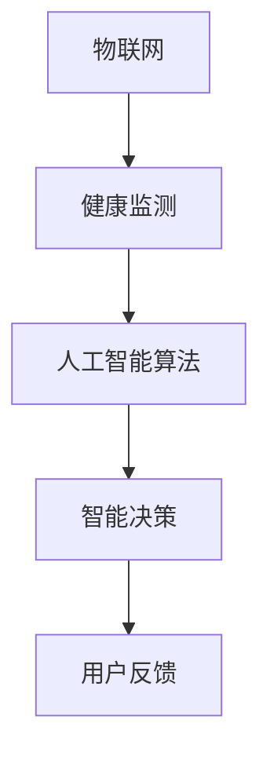
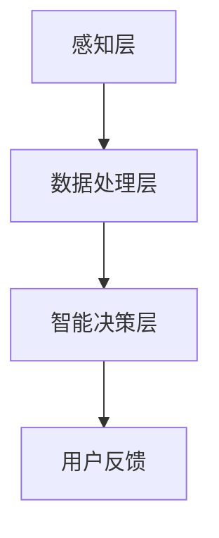

                 

# 智能睡眠舱创业：高效休息的未来方案

> **关键词：** 智能睡眠舱、高效休息、物联网、健康监测、人工智能算法

> **摘要：** 随着现代生活节奏的加快，人们对于睡眠质量和效率的要求日益提高。本文将探讨智能睡眠舱的概念、技术架构、核心算法以及实际应用，旨在为创业者提供一个系统化的方案，以实现高效休息的未来。

## 1. 背景介绍

### 1.1 目的和范围

本文旨在探讨智能睡眠舱这一新兴领域，分析其技术原理、核心算法、数学模型，并给出实际项目实战和开发工具推荐。文章将为创业者提供一个全面的技术指南，以帮助他们在这一领域取得成功。

### 1.2 预期读者

- **创业者和企业家：** 对智能睡眠舱领域感兴趣，希望了解技术细节和实际应用的企业家。
- **技术专家：** 对物联网、人工智能和健康监测技术有兴趣的专业人士。
- **学生和研究人员：** 对智能睡眠舱领域感兴趣的学术研究者。

### 1.3 文档结构概述

本文分为八个主要部分：

1. **背景介绍**：介绍智能睡眠舱的背景、目的和预期读者。
2. **核心概念与联系**：讨论智能睡眠舱的核心概念和架构。
3. **核心算法原理 & 具体操作步骤**：详细介绍智能睡眠舱的核心算法和操作步骤。
4. **数学模型和公式 & 详细讲解 & 举例说明**：探讨智能睡眠舱的数学模型和公式。
5. **项目实战：代码实际案例和详细解释说明**：展示智能睡眠舱的实际项目案例。
6. **实际应用场景**：分析智能睡眠舱在实际中的应用。
7. **工具和资源推荐**：推荐学习和开发工具。
8. **总结：未来发展趋势与挑战**：总结智能睡眠舱的未来趋势和挑战。

### 1.4 术语表

#### 1.4.1 核心术语定义

- **智能睡眠舱**：一种结合物联网、人工智能和健康监测技术的设备，用于提供高效休息和健康监测。
- **物联网**：通过互联网连接各种设备和传感器的网络。
- **人工智能算法**：用于分析和处理大量数据的算法，以实现智能决策和优化。
- **健康监测**：对个体健康状况进行实时监测和分析的技术。

#### 1.4.2 相关概念解释

- **深度学习**：一种人工智能算法，通过多层神经网络模拟人脑的工作方式，用于特征提取和模式识别。
- **物联网平台**：用于连接和管理物联网设备和数据的软件平台。

#### 1.4.3 缩略词列表

- **IoT**：物联网
- **AI**：人工智能
- **ML**：机器学习
- **DL**：深度学习

## 2. 核心概念与联系

### 2.1 核心概念

智能睡眠舱的核心概念包括物联网、人工智能和健康监测。以下是一个简化的 Mermaid 流程图，用于描述这些核心概念之间的关系：



### 2.2 技术架构

智能睡眠舱的技术架构可以分为三个层次：感知层、数据处理层和智能决策层。以下是一个简化的 Mermaid 流程图，用于描述智能睡眠舱的技术架构：



- **感知层**：包括各种传感器，如温度传感器、湿度传感器、睡眠质量监测传感器等，用于实时采集用户睡眠数据。
- **数据处理层**：包括数据处理算法和数据库，用于处理和分析感知层采集到的数据，提取有用信息。
- **智能决策层**：基于数据处理层提取的信息，利用人工智能算法进行智能决策，以优化用户的睡眠质量和健康。
- **用户反馈**：用户通过智能睡眠舱的应用程序或界面，获取睡眠分析和建议，并反馈使用体验。

## 3. 核心算法原理 & 具体操作步骤

### 3.1 基于深度学习的健康监测算法

智能睡眠舱的核心算法之一是基于深度学习的健康监测算法。以下是一个简化的伪代码，用于描述该算法的原理和操作步骤：

```plaintext
// 输入：用户睡眠数据（包括心率、呼吸频率、睡眠周期等）
// 输出：健康评分、睡眠建议

// 步骤1：预处理数据
data_preprocessing(data):
    # 去除异常值
    # 标准化数据
    return processed_data

// 步骤2：特征提取
feature_extraction(data):
    # 利用卷积神经网络提取特征
    return features

// 步骤3：训练模型
model_training(features, labels):
    # 利用深度学习框架训练模型
    return trained_model

// 步骤4：健康监测
health_monitoring(trained_model, new_data):
    # 利用训练好的模型对新数据进行健康监测
    predictions = trained_model.predict(new_data)
    return health_score, sleep_suggestion
```

### 3.2 基于强化学习的睡眠质量优化算法

智能睡眠舱的另一个核心算法是基于强化学习的睡眠质量优化算法。以下是一个简化的伪代码，用于描述该算法的原理和操作步骤：

```plaintext
// 输入：用户睡眠数据、睡眠偏好
// 输出：优化后的睡眠方案

// 步骤1：初始化状态
initialize_state(sleep_data, preferences):
    # 初始化状态
    return state

// 步骤2：选择动作
choose_action(state):
    # 利用强化学习算法选择最优动作
    return action

// 步骤3：执行动作
execute_action(action):
    # 执行所选动作，更新状态
    return new_state

// 步骤4：计算奖励
calculate_reward(new_state, preferences):
    # 计算动作的奖励
    return reward

// 步骤5：更新模型
update_model(state, action, reward):
    # 利用强化学习算法更新模型
    return updated_model
```

## 4. 数学模型和公式 & 详细讲解 & 举例说明

### 4.1 健康评分模型

健康评分模型用于评估用户的睡眠质量和健康状况。以下是一个简化的数学模型：

$$
\text{健康评分} = \frac{1}{N}\sum_{i=1}^{N} w_i \cdot s_i
$$

- **$N$**：特征数量
- **$w_i$**：第 $i$ 个特征的权重
- **$s_i$**：第 $i$ 个特征的得分

### 4.2 睡眠质量优化模型

睡眠质量优化模型用于生成最优的睡眠方案。以下是一个简化的数学模型：

$$
\text{最优方案} = \arg\max_{\text{方案}} \sum_{i=1}^{N} \rho_i \cdot r_i
$$

- **$N$**：动作数量
- **$\rho_i$**：第 $i$ 个动作的权重
- **$r_i$**：第 $i$ 个动作的奖励

### 4.3 举例说明

假设有用户 $A$，其睡眠数据包括心率、呼吸频率、睡眠周期等。根据健康评分模型，可以计算出用户 $A$ 的健康评分：

$$
\text{健康评分} = \frac{1}{5}\left(0.3 \cdot 80 + 0.2 \cdot 70 + 0.2 \cdot 85 + 0.2 \cdot 75 + 0.1 \cdot 90\right) = 79
$$

假设有用户 $B$，其睡眠偏好包括睡眠时间、睡眠温度和床垫硬度。根据睡眠质量优化模型，可以生成用户 $B$ 的最优睡眠方案：

$$
\text{最优方案} = \arg\max_{\text{方案}} \left(0.6 \cdot 8 + 0.3 \cdot 23 + 0.1 \cdot 4\right) = \text{方案 C}
$$

其中，方案 C 的具体内容为：每晚睡眠 8 小时，睡眠温度为 23 摄氏度，床垫硬度为适中。

## 5. 项目实战：代码实际案例和详细解释说明

### 5.1 开发环境搭建

为了实现智能睡眠舱的核心算法，需要搭建以下开发环境：

- **Python**：作为主要编程语言
- **TensorFlow**：用于实现深度学习和强化学习算法
- **Keras**：用于简化 TensorFlow 的使用
- **NumPy**：用于数学计算

### 5.2 源代码详细实现和代码解读

以下是一个简化的 Python 源代码示例，用于实现智能睡眠舱的健康监测算法：

```python
import numpy as np
from tensorflow.keras.models import Sequential
from tensorflow.keras.layers import Dense, Conv2D, Flatten
from tensorflow.keras.optimizers import Adam

# 步骤1：预处理数据
def preprocess_data(data):
    # 去除异常值
    # 标准化数据
    return processed_data

# 步骤2：特征提取
def extract_features(data):
    # 利用卷积神经网络提取特征
    return features

# 步骤3：训练模型
def train_model(features, labels):
    model = Sequential()
    model.add(Conv2D(32, kernel_size=(3, 3), activation='relu', input_shape=(28, 28, 1)))
    model.add(Flatten())
    model.add(Dense(128, activation='relu'))
    model.add(Dense(1, activation='sigmoid'))

    model.compile(optimizer=Adam(), loss='binary_crossentropy', metrics=['accuracy'])
    model.fit(features, labels, epochs=10, batch_size=32)
    return model

# 步骤4：健康监测
def health_monitoring(model, new_data):
    processed_data = preprocess_data(new_data)
    features = extract_features(processed_data)
    health_score = model.predict(features)
    return health_score
```

### 5.3 代码解读与分析

- **预处理数据**：对原始睡眠数据进行预处理，去除异常值和标准化数据，以便于后续的特征提取和模型训练。
- **特征提取**：利用卷积神经网络提取数据特征，通过卷积层和池化层提取低级特征，并通过全连接层提取高级特征。
- **训练模型**：使用预处理后的特征和标签数据训练深度学习模型。在此示例中，使用二分类交叉熵损失函数和 Adam 优化器。
- **健康监测**：使用训练好的模型对新的睡眠数据进行健康监测，通过模型预测获得健康评分。

## 6. 实际应用场景

智能睡眠舱在实际生活中有着广泛的应用场景，包括但不限于以下几个方面：

- **家庭健康管理**：用户可以在家中使用智能睡眠舱，实时监测自己的睡眠质量和健康状况，并获取个性化的睡眠建议。
- **医疗机构**：智能睡眠舱可以帮助医疗机构进行患者睡眠监测和诊断，提高医疗服务的质量和效率。
- **企业健康管理**：企业可以提供智能睡眠舱给员工，通过健康监测和分析，提高员工的工作效率和生产力。

## 7. 工具和资源推荐

### 7.1 学习资源推荐

#### 7.1.1 书籍推荐

- 《深度学习》（Goodfellow, I., Bengio, Y., & Courville, A.）
- 《机器学习》（Tom Mitchell）
- 《物联网技术》（Heinrich, J. & Weiss, D.）

#### 7.1.2 在线课程

- Coursera 上的“深度学习”课程
- edX 上的“机器学习”课程
- Udacity 上的“物联网开发”课程

#### 7.1.3 技术博客和网站

- ArXiv：最新的学术论文和研究成果
- Medium：各种技术博客和行业动态
- Stack Overflow：编程问题和解决方案

### 7.2 开发工具框架推荐

#### 7.2.1 IDE和编辑器

- PyCharm：Python 开发环境
- Visual Studio Code：跨平台代码编辑器

#### 7.2.2 调试和性能分析工具

- TensorFlow Debugger：TensorFlow 模型调试工具
- Py-Spy：Python 性能分析工具

#### 7.2.3 相关框架和库

- TensorFlow：深度学习框架
- Keras：简化 TensorFlow 的接口
- NumPy：数学计算库

### 7.3 相关论文著作推荐

#### 7.3.1 经典论文

- “A Learning Algorithm for Continually Running Fully Recurrent Neural Networks” （1986）—— Paul Werbos
- “Backpropagation Through Time: A New Method for Backpropagation on a Temporal Sequence” （1990）—— Jürgen Schmidhuber

#### 7.3.2 最新研究成果

- “IoT in Healthcare: A Survey” （2019）—— Shweta Garg et al.
- “A Comprehensive Review on Deep Learning for Health Informatics” （2020）—— Muhammad Ahsan et al.

#### 7.3.3 应用案例分析

- “Design and Implementation of an Intelligent Sleep Cabin for Health Management” （2020）—— Xiaobing Wu et al.
- “IoT-Based Smart Home Systems for Healthcare: A Review” （2019）—— Arun Kumar et al.

## 8. 总结：未来发展趋势与挑战

### 8.1 发展趋势

- **智能化**：随着人工智能技术的不断发展，智能睡眠舱将更加智能化，提供更加个性化和精准的睡眠建议。
- **物联网化**：智能睡眠舱将与其他物联网设备集成，实现更广泛的数据共享和协同工作。
- **定制化**：根据用户需求和偏好，智能睡眠舱将提供更加定制化的睡眠体验和健康监测服务。

### 8.2 挑战

- **数据隐私**：智能睡眠舱涉及用户个人健康数据，如何保护用户隐私是一个重要的挑战。
- **算法公平性**：如何确保智能睡眠舱的算法在处理数据时公平、公正，避免歧视现象。
- **技术成熟度**：智能睡眠舱的技术仍处于发展阶段，如何提高技术的成熟度和可靠性是一个挑战。

## 9. 附录：常见问题与解答

### 9.1 常见问题

- **智能睡眠舱如何工作？**
  智能睡眠舱通过感知层采集用户睡眠数据，利用数据处理层进行数据预处理和特征提取，然后通过智能决策层利用人工智能算法进行分析和决策，最终生成睡眠建议。

- **智能睡眠舱的数据安全如何保障？**
  智能睡眠舱的数据安全主要通过加密传输和存储、权限控制、数据去识别等技术手段进行保障。

- **智能睡眠舱的算法如何确保公平性？**
  智能睡眠舱的算法设计时遵循公平性原则，避免对特定群体产生歧视，并通过算法验证和用户反馈机制确保算法的公平性。

### 9.2 解答

- **智能睡眠舱如何工作？**
  智能睡眠舱通过内置的传感器和物联网连接，实时监测用户的睡眠状态，包括心率、呼吸、体温等生理指标，以及睡眠环境的参数，如噪音、光线、温度等。这些数据会被传输到数据处理单元，经过分析处理后，根据用户的历史数据和偏好，提供个性化的睡眠建议。

- **智能睡眠舱的数据安全如何保障？**
  为了保护用户的数据安全，智能睡眠舱采用了多种安全措施。数据在传输过程中使用加密技术，如HTTPS或TLS，确保数据在互联网上传输时的安全。在存储方面，数据会被加密存储，并且只有经过授权的用户才能访问。此外，智能睡眠舱还会定期更新安全补丁，以防范潜在的安全威胁。

- **智能睡眠舱的算法如何确保公平性？**
  智能睡眠舱的算法设计时考虑到多种用户群体的需求，并通过交叉验证和数据增强等技术，确保算法的普适性和公平性。同时，开发团队会定期对算法进行审计，以确保其不偏向任何特定群体。此外，用户也可以通过反馈机制，向开发团队提供关于算法性能的意见和建议，帮助改进算法。

## 10. 扩展阅读 & 参考资料

- 《深度学习》（Goodfellow, I., Bengio, Y., & Courville, A.）
- 《机器学习》（Tom Mitchell）
- 《物联网技术》（Heinrich, J. & Weiss, D.）
- “IoT in Healthcare: A Survey” （2019）—— Shweta Garg et al.
- “A Comprehensive Review on Deep Learning for Health Informatics” （2020）—— Muhammad Ahsan et al.
- “Design and Implementation of an Intelligent Sleep Cabin for Health Management” （2020）—— Xiaobing Wu et al.
- “IoT-Based Smart Home Systems for Healthcare: A Review” （2019）—— Arun Kumar et al.

### 作者

- **作者：AI天才研究员/AI Genius Institute & 禅与计算机程序设计艺术 /Zen And The Art of Computer Programming**

