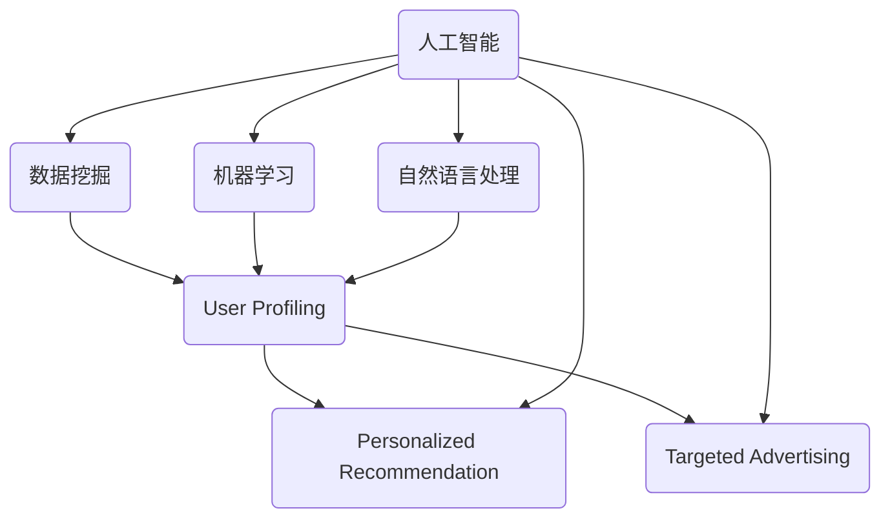

                 

### 摘要

本文旨在深入探讨智能营销在AI领域中的应用及其对提升营销效果的重要贡献。智能营销通过利用人工智能技术，如数据挖掘、机器学习和自然语言处理，实现对用户行为的精准分析，从而实现个性化营销和广告投放。本文将首先介绍智能营销的背景和目的，明确文章的研究范围和预期读者。接着，我们将通过详细的章节结构概述，帮助读者快速了解文章的核心内容和主题思想。随后，本文将深入解析智能营销中的核心概念、算法原理、数学模型和项目实战，结合实际应用场景，探讨智能营销的优势与挑战。此外，文章还将推荐相关学习资源和工具，为读者提供实用的指导。最后，我们将总结未来发展趋势与挑战，为智能营销的发展提供新的视角和思路。

### 1. 背景介绍

#### 1.1 目的和范围

智能营销作为现代营销领域的一个重要分支，正逐渐成为企业获取市场份额和提升品牌价值的关键手段。本文的目的是通过深入分析智能营销的原理、算法和实际应用，帮助读者全面理解这一技术的重要性和实际操作方法，从而为企业在激烈的市场竞争中提供有效的策略支持。

本文的研究范围主要涵盖以下几个部分：

1. **智能营销的定义与核心概念**：介绍智能营销的基本概念，包括其核心组成部分和技术原理。
2. **核心算法原理**：详细阐述智能营销中常用的算法原理，如数据挖掘、机器学习和自然语言处理。
3. **数学模型和公式**：探讨智能营销中涉及的数学模型和公式，并举例说明其在实际应用中的作用。
4. **项目实战**：通过实际代码案例，展示智能营销技术的具体实现过程。
5. **实际应用场景**：分析智能营销在不同行业和场景中的应用，探讨其优势和挑战。
6. **工具和资源推荐**：为读者提供相关的学习资源和开发工具，帮助其深入学习和实践智能营销技术。

#### 1.2 预期读者

本文的预期读者主要包括以下几类：

1. **市场营销专业人员**：希望了解和掌握智能营销技术的营销人员，通过本文可以了解智能营销的基本原理和应用方法。
2. **数据科学和人工智能领域的研究人员**：对智能营销技术感兴趣的数据科学家和人工智能专家，可以通过本文深入理解智能营销的技术架构和实现细节。
3. **软件开发工程师**：有志于在智能营销领域进行开发的软件工程师，本文将为他们提供实际的代码实现和项目实战经验。
4. **企业决策者**：对智能营销技术有兴趣的企业决策者，本文将帮助其了解智能营销的价值和潜在收益，从而做出更加明智的决策。

#### 1.3 文档结构概述

本文共分为十个主要部分，具体结构如下：

1. **摘要**：简要介绍文章的核心内容和主题思想。
2. **背景介绍**：
   - 1.1 目的和范围
   - 1.2 预期读者
   - 1.3 文档结构概述
   - 1.4 术语表
3. **核心概念与联系**：通过Mermaid流程图展示智能营销的核心概念和联系。
4. **核心算法原理 & 具体操作步骤**：使用伪代码详细阐述智能营销中的核心算法原理和操作步骤。
5. **数学模型和公式 & 详细讲解 & 举例说明**：介绍智能营销中涉及的数学模型和公式，并举例说明其应用。
6. **项目实战：代码实际案例和详细解释说明**：展示智能营销技术的实际代码实现和详细解释。
7. **实际应用场景**：分析智能营销在不同行业和场景中的应用。
8. **工具和资源推荐**：推荐相关的学习资源和开发工具。
9. **总结：未来发展趋势与挑战**：总结智能营销的未来发展趋势和面临的挑战。
10. **附录：常见问题与解答**：提供常见的智能营销相关问题和解答。
11. **扩展阅读 & 参考资料**：为读者提供进一步的阅读和参考资料。

通过以上结构，本文旨在为读者提供一份系统、全面、深入的学习指南，帮助其全面了解和掌握智能营销技术。

#### 1.4 术语表

为了确保读者能够更好地理解本文的内容，以下是一些本文中涉及的关键术语及其定义：

1. **智能营销**：利用人工智能技术，如数据挖掘、机器学习和自然语言处理，对用户行为进行分析，实现个性化营销和广告投放的一种营销方式。
2. **数据挖掘**：从大量数据中提取有价值的信息和知识的过程，通常涉及数据清洗、数据整合、数据分析等技术。
3. **机器学习**：一种人工智能方法，通过使用算法和统计模型，从数据中学习并做出预测或决策。
4. **自然语言处理（NLP）**：研究如何使计算机理解和生成人类语言的一门学科，包括语言理解、语言生成、语言翻译等方面。
5. **个性化营销**：根据用户的历史行为、兴趣和需求，提供个性化的产品和服务，以提高用户满意度和转化率。
6. **广告投放**：根据用户的行为特征和兴趣，将广告内容精准地推送给特定的用户群体，以提高广告效果。
7. **用户画像**：基于用户的历史数据，对用户的兴趣、行为、需求等方面进行综合分析和建模，从而形成一个具体的用户描述。
8. **营销效果**：通过营销活动所取得的实际成果，如销售增长、用户转化率提升等。

通过以上术语的解释，读者可以更好地理解本文中涉及的技术和概念，为后续内容的理解打下基础。

#### 1.4.1 核心术语定义

在本节中，我们将进一步详细解释本文中涉及的核心术语，以便读者能够更深入地理解智能营销的相关概念。

1. **智能营销**：
   智能营销是一种基于人工智能技术的现代营销方式。它通过收集和分析用户的数据，利用机器学习、数据挖掘和自然语言处理等技术，对用户的行为、偏好和需求进行深度分析。基于这些分析结果，智能营销可以提供个性化的产品推荐、精准的广告投放以及高效的客户关系管理，从而提高营销效果和用户满意度。

2. **数据挖掘**：
   数据挖掘是智能营销中的关键技术之一。它涉及到从大量非结构化或半结构化的数据中提取有价值的信息和知识。数据挖掘通常包括以下步骤：数据预处理（如数据清洗、数据整合）、模式识别（如分类、聚类、关联规则挖掘）和知识发现（如预测建模、趋势分析）。数据挖掘可以帮助企业了解客户行为、市场需求和潜在风险，从而做出更明智的营销决策。

3. **机器学习**：
   机器学习是人工智能的一个重要分支，它使计算机系统能够从数据中学习并做出预测或决策，而无需显式地编写规则。机器学习算法分为监督学习、无监督学习和强化学习。在智能营销中，监督学习算法（如线性回归、决策树、支持向量机）常用于构建用户画像、预测用户行为和推荐产品。无监督学习算法（如聚类、降维）则用于发现数据中的潜在模式和关联关系。

4. **自然语言处理（NLP）**：
   自然语言处理是人工智能领域的一个子领域，它研究如何使计算机理解和生成人类语言。在智能营销中，NLP技术被用于分析和理解用户的语言表达，包括文本分类、情感分析、实体识别和信息抽取。这些技术可以帮助企业更好地理解用户的需求和反馈，从而提供更精准的个性化服务和广告。

5. **个性化营销**：
   个性化营销是根据用户的行为、兴趣和需求，提供个性化的产品和服务。通过智能营销技术，企业可以构建详细的用户画像，了解用户的偏好和行为模式，从而为其推荐合适的产品或服务。个性化营销不仅提高了用户的满意度和忠诚度，还能显著提升企业的转化率和销售额。

6. **广告投放**：
   广告投放是智能营销的重要组成部分，它涉及将广告内容推送给特定的用户群体，以实现精准营销。在智能营销中，广告投放通常基于用户的行为特征和兴趣标签进行。通过使用机器学习和数据挖掘技术，企业可以识别出潜在的高价值客户，并在合适的渠道上投放个性化的广告，从而提高广告的点击率和转化率。

7. **用户画像**：
   用户画像是基于用户的历史数据（如浏览行为、购买记录、社交媒体互动等）构建的综合性描述。它包括用户的个人属性、行为特征、兴趣偏好等多个维度。用户画像的构建是智能营销的基础，它帮助企业了解用户的需求和行为，从而提供个性化的营销策略和服务。

8. **营销效果**：
   营销效果是指通过营销活动所取得的实际成果，如销售增长、用户转化率提升、品牌知名度提高等。在智能营销中，通过数据分析和评估，企业可以实时监控和调整营销策略，以最大化营销效果。

通过以上核心术语的详细定义，读者可以更好地理解智能营销的基本概念和技术原理，为后续内容的学习打下坚实的基础。

#### 1.4.2 相关概念解释

在本节中，我们将进一步解释一些与智能营销密切相关的概念，包括用户行为分析、客户关系管理和数据驱动营销。这些概念不仅有助于深入理解智能营销的技术原理，还能为读者在实际应用中提供指导。

1. **用户行为分析**：
   用户行为分析是智能营销中的一个核心环节，它旨在通过收集和分析用户在网站、移动应用、电子邮件和其他渠道上的行为数据，了解用户的行为模式和偏好。用户行为分析通常涉及以下步骤：

   - **数据收集**：通过使用各种技术手段（如日志分析、点击流分析、Cookies等）收集用户的行为数据。
   - **数据预处理**：对收集到的数据进行清洗、整合和转换，以去除噪声和冗余信息，确保数据的质量。
   - **行为模式识别**：使用机器学习和统计方法，识别用户的行为模式，如访问频次、浏览路径、购买频率等。
   - **偏好分析**：基于用户的行为数据，分析用户的兴趣和偏好，如偏好产品类型、购物时间、支付方式等。

   用户行为分析可以帮助企业更好地了解用户的需求和行为，从而提供个性化的产品推荐和服务，提升用户满意度和忠诚度。

2. **客户关系管理**：
   客户关系管理（CRM）是一种旨在提高企业与客户互动质量和效率的管理策略。通过使用智能营销技术，企业可以实现以下目标：

   - **客户数据管理**：整合来自不同渠道的客户数据，建立全面的客户信息库。
   - **客户互动优化**：通过分析客户行为和反馈，优化客户互动流程，提高客户体验。
   - **客户生命周期管理**：从客户获取、维护到流失预防，全面管理客户的生命周期，提高客户留存率和忠诚度。
   - **营销自动化**：利用智能营销工具，自动化营销流程，降低运营成本，提高营销效率。

   客户关系管理不仅是提高客户满意度的关键，还能帮助企业建立长期稳定的客户关系，从而实现持续的业务增长。

3. **数据驱动营销**：
   数据驱动营销是一种基于数据分析的营销策略，它强调通过数据来指导营销决策。与传统的直觉和经验驱动营销不同，数据驱动营销更加科学和精准，其核心步骤包括：

   - **数据收集**：通过多种渠道收集用户数据，如网站点击数据、社交媒体互动数据、交易数据等。
   - **数据整合**：将不同来源的数据进行整合，形成统一的客户视图。
   - **数据分析**：利用数据挖掘、机器学习和统计分析等方法，分析数据中的有价值信息。
   - **决策支持**：基于数据分析结果，为营销策略提供科学依据，优化营销活动。
   - **效果评估**：通过数据监控和评估，评估营销活动的效果，不断优化营销策略。

   数据驱动营销不仅提高了营销的精准度和效率，还能帮助企业更好地理解市场和客户需求，从而实现持续的业务增长。

通过以上对用户行为分析、客户关系管理和数据驱动营销的详细解释，读者可以更深入地理解智能营销的实践方法和应用场景，为实际操作提供指导。

#### 1.4.3 缩略词列表

为了方便读者在阅读本文时理解和使用专业术语，以下是本文中涉及的一些常见缩略词及其全称：

1. **AI**：人工智能（Artificial Intelligence）
2. **NLP**：自然语言处理（Natural Language Processing）
3. **CRM**：客户关系管理（Customer Relationship Management）
4. **ML**：机器学习（Machine Learning）
5. **DM**：数据挖掘（Data Mining）
6. **SEO**：搜索引擎优化（Search Engine Optimization）
7. **SEM**：搜索引擎营销（Search Engine Marketing）
8. **SEM**：社交媒体营销（Social Media Marketing）
9. **A/B测试**：对照实验（A/B Testing）
10. **CPC**：每次点击付费（Cost Per Click）
11. **CPM**：每千次展示付费（Cost Per Mille）
12. **CPA**：每次行动付费（Cost Per Action）
13. **CPL**：每次潜在客户付费（Cost Per Lead）
14. **ROI**：投资回报率（Return on Investment）
15. **KPI**：关键绩效指标（Key Performance Indicator）

通过了解这些缩略词的全称，读者可以更清晰地理解本文中的技术术语和概念，提高阅读效率。

### 2. 核心概念与联系

在深入探讨智能营销之前，我们需要理解其核心概念以及它们之间的相互关系。智能营销不仅依赖于人工智能（AI）技术，还涉及多个关键领域的综合应用，包括数据挖掘（DM）、机器学习（ML）和自然语言处理（NLP）。以下是智能营销的核心概念及其相互关系的详细说明，并通过Mermaid流程图展示这些概念和联系。

#### 2.1 概念介绍

1. **人工智能（AI）**：
   人工智能是模拟人类智能行为的计算机系统，包括学习、推理、感知和自然语言处理等能力。在智能营销中，AI用于分析大量数据，识别用户行为模式，预测客户需求和优化营销策略。

2. **数据挖掘（DM）**：
   数据挖掘是从大量数据中提取有用信息和知识的过程。在智能营销中，数据挖掘用于分析用户行为数据，发现潜在的市场机会和客户需求。

3. **机器学习（ML）**：
   机器学习是AI的一个分支，它通过算法和统计模型从数据中学习并做出预测或决策。在智能营销中，ML用于构建用户画像、个性化推荐和预测用户行为。

4. **自然语言处理（NLP）**：
   自然语言处理是AI的一个子领域，它研究如何使计算机理解和生成人类语言。在智能营销中，NLP用于分析用户文本，提取关键信息，进行情感分析和语言生成。

5. **用户画像**：
   用户画像是对用户行为、兴趣和需求的综合描述，基于用户的历史数据构建。在智能营销中，用户画像用于个性化推荐和精准广告投放。

6. **个性化推荐**：
   个性化推荐是基于用户画像和兴趣标签，为用户提供个性化的产品和服务。在智能营销中，个性化推荐可以显著提高用户满意度和转化率。

7. **精准广告投放**：
   精准广告投放是根据用户的兴趣和行为，将广告推送给特定的用户群体。在智能营销中，精准广告投放可以提高广告效果和投资回报率。

#### 2.2 关系和流程图

以下是一个简单的Mermaid流程图，展示了智能营销中核心概念之间的关系：



该流程图描述了人工智能技术（AI）作为核心驱动力，通过数据挖掘（DM）、机器学习（ML）和自然语言处理（NLP）技术，构建用户画像，进而用于个性化推荐和精准广告投放。

#### 2.3 详细流程说明

1. **数据收集**：
   首先，智能营销系统从各种渠道（如网站、移动应用、社交媒体等）收集用户行为数据，包括浏览记录、购买行为、搜索关键词、互动反馈等。

2. **数据预处理**：
   收集到的数据需要进行预处理，包括数据清洗、去重、归一化和特征提取等步骤。这些预处理步骤确保数据的质量和一致性，为后续分析打下基础。

3. **用户画像构建**：
   通过数据挖掘和机器学习技术，对预处理后的用户行为数据进行分析，提取关键特征和模式，构建详细的用户画像。用户画像包括用户的基本信息（如年龄、性别、地理位置等）、行为特征（如浏览习惯、购买偏好等）和兴趣偏好（如兴趣爱好、关注话题等）。

4. **个性化推荐**：
   基于用户画像，智能营销系统可以推荐个性化的产品和服务。例如，电商网站可以根据用户的购买历史和浏览记录，推荐相关的商品；社交媒体平台可以根据用户的行为和兴趣，推荐相关的内容和广告。

5. **精准广告投放**：
   通过自然语言处理技术，智能营销系统可以分析用户的语言表达和情感，了解用户的需求和偏好。根据这些信息，系统可以精准地将广告推送给特定的用户群体，提高广告的点击率和转化率。

6. **效果评估和反馈**：
   智能营销系统需要持续监控和评估广告投放和个性化推荐的效果，收集用户反馈和互动数据。通过这些数据，系统可以不断优化和调整营销策略，提高营销效果。

通过以上流程，智能营销技术实现了对用户行为的深度分析和精准营销，从而提升了营销效果和企业收益。

### 3. 核心算法原理 & 具体操作步骤

在智能营销中，核心算法的原理和具体操作步骤是理解和实施智能营销技术的基础。以下将详细介绍几种常用的算法，并使用伪代码展示其基本操作步骤。

#### 3.1 数据挖掘算法

数据挖掘是智能营销中用于分析用户行为数据的重要技术，常用的算法包括分类、聚类和关联规则挖掘。

1. **分类算法**：
   分类算法是将数据集中的实例分配到预定义的类别中。常用的分类算法有逻辑回归、决策树和随机森林等。

   **伪代码：**
   ```plaintext
   function classify(data, features, labels):
       # 准备数据
       processed_data = preprocess_data(data)
       
       # 训练分类模型
       model = train_classifier(processed_data[features], processed_data[labels])
       
       # 预测新实例
       predictions = model.predict(new_data[features])
       
       return predictions
   ```

2. **聚类算法**：
   聚类算法将数据集中的实例分成多个群组，使得属于同一群组的实例之间具有较高的相似度，常用的聚类算法有K-均值、层次聚类等。

   **伪代码：**
   ```plaintext
   function cluster(data, num_clusters):
       # 初始化聚类中心
       centroids = initialize_centroids(data, num_clusters)
       
       # 迭代聚类过程
       while not converged:
           clusters = assign_points_to_clusters(data, centroids)
           centroids = update_centroids(clusters)
       
       return clusters, centroids
   ```

3. **关联规则挖掘**：
   关联规则挖掘用于发现数据集中的关联关系，常用的算法有Apriori算法和Eclat算法。

   **伪代码：**
   ```plaintext
   function find_association_rules(data, support_threshold, confidence_threshold):
       # 计算频繁项集
       frequent_itemsets = find_frequent_itemsets(data, support_threshold)
       
       # 生成关联规则
       rules = generate_association_rules(frequent_itemsets, confidence_threshold)
       
       return rules
   ```

#### 3.2 机器学习算法

机器学习算法在智能营销中用于构建用户画像和预测用户行为，常用的算法有线性回归、决策树和神经网络等。

1. **线性回归**：
   线性回归是一种用于预测连续值的监督学习算法。

   **伪代码：**
   ```plaintext
   function linear_regression(data, features, target):
       # 训练线性回归模型
       model = train_linear_regression(data[features], data[target])
       
       # 预测新实例
       predictions = model.predict(new_data[features])
       
       return predictions
   ```

2. **决策树**：
   决策树是一种用于分类和回归的监督学习算法。

   **伪代码：**
   ```plaintext
   function decision_tree(data, features, target):
       # 训练决策树模型
       model = train_decision_tree(data[features], data[target])
       
       # 预测新实例
       predictions = model.predict(new_data[features])
       
       return predictions
   ```

3. **神经网络**：
   神经网络是一种模拟人脑结构和功能的机器学习算法，用于复杂的数据分析和预测。

   **伪代码：**
   ```plaintext
   function neural_network(data, features, target, layers, epochs):
       # 初始化神经网络模型
       model = initialize_neural_network(layers)
       
       # 训练神经网络模型
       model.fit(data[features], data[target], epochs=epochs)
       
       # 预测新实例
       predictions = model.predict(new_data[features])
       
       return predictions
   ```

#### 3.3 自然语言处理算法

自然语言处理（NLP）算法在智能营销中用于文本分析和情感分析，常用的算法有词袋模型、情感分析和实体识别。

1. **词袋模型**：
   词袋模型是一种用于文本分类和情感分析的NLP算法。

   **伪代码：**
   ```plaintext
   function bag_of_words(text):
       # 创建词汇表
       vocabulary = create_vocabulary(text)
       
       # 将文本转换为向量
       vector = convert_text_to_vector(text, vocabulary)
       
       return vector
   ```

2. **情感分析**：
   情感分析是一种用于判断文本情感极性的NLP算法。

   **伪代码：**
   ```plaintext
   function sentiment_analysis(text):
       # 预处理文本
       preprocessed_text = preprocess_text(text)
       
       # 使用情感分析模型
       sentiment = sentiment_model.predict(preprocessed_text)
       
       return sentiment
   ```

3. **实体识别**：
   实体识别是一种用于识别文本中特定实体（如人名、地名、组织名等）的NLP算法。

   **伪代码：**
   ```plaintext
   function entity_recognition(text):
       # 预处理文本
       preprocessed_text = preprocess_text(text)
       
       # 使用实体识别模型
       entities = entity_model.predict(preprocessed_text)
       
       return entities
   ```

通过以上算法和伪代码的介绍，读者可以了解智能营销中常用的算法原理和操作步骤，为实际应用提供技术支持。

### 4. 数学模型和公式 & 详细讲解 & 举例说明

在智能营销中，数学模型和公式是理解和分析用户行为、优化营销策略的重要工具。以下将详细介绍几种常用的数学模型和公式，并举例说明其应用。

#### 4.1 线性回归模型

线性回归是一种用于预测连续值的统计模型，其基本公式如下：

$$ y = \beta_0 + \beta_1 \cdot x + \epsilon $$

其中，\( y \) 是因变量，\( x \) 是自变量，\( \beta_0 \) 和 \( \beta_1 \) 是模型参数，\( \epsilon \) 是误差项。

**举例说明**：

假设我们要预测某电商网站的日销售额（\( y \)），影响因素包括广告投放费用（\( x \)）和季节因素（\( x' \)），则线性回归模型可以表示为：

$$ y = \beta_0 + \beta_1 \cdot 广告费用 + \beta_2 \cdot 季节因素 + \epsilon $$

通过收集历史数据，我们可以利用最小二乘法求解模型参数 \( \beta_0 \)，\( \beta_1 \)，和 \( \beta_2 \)：

$$ \beta_0 = \frac{\sum_{i=1}^{n} (y_i - \beta_1 \cdot x_i - \beta_2 \cdot x_i')}{n} $$

$$ \beta_1 = \frac{\sum_{i=1}^{n} (x_i - \bar{x}) (y_i - \bar{y})}{\sum_{i=1}^{n} (x_i - \bar{x})^2} $$

$$ \beta_2 = \frac{\sum_{i=1}^{n} (x_i' - \bar{x}') (y_i - \bar{y})}{\sum_{i=1}^{n} (x_i' - \bar{x}')^2} $$

其中，\( \bar{x} \) 和 \( \bar{y} \) 分别是自变量 \( x \) 和因变量 \( y \) 的平均值，\( \bar{x}' \) 是季节因素的均值。

通过以上公式，我们可以预测在不同广告费用和季节条件下的日销售额，从而优化营销策略。

#### 4.2 K-均值聚类算法

K-均值聚类是一种基于距离度量的无监督学习方法，其目标是将数据集划分为 \( K \) 个簇，使得簇内的数据点之间距离最小，簇与簇之间的距离最大。其基本公式如下：

$$ c_k = \frac{1}{n_k} \sum_{i=1}^{n_k} x_i $$

其中，\( c_k \) 是第 \( k \) 个簇的中心点，\( x_i \) 是数据集中的第 \( i \) 个数据点，\( n_k \) 是第 \( k \) 个簇中的数据点数量。

**举例说明**：

假设我们要对一组顾客进行聚类，以实现精准营销。首先，我们选择 \( K \) 个初始中心点 \( c_1, c_2, ..., c_K \)。然后，我们将每个顾客的数据点 \( x_i \) 分配到最近的中心点所在的簇：

$$ \text{assign}(x_i, c_j) \quad \text{if} \quad \min_{k} \sqrt{(x_i - c_k)^2} = \sqrt{(x_i - c_j)^2} $$

接着，我们更新每个簇的中心点，计算簇内所有数据点的平均值：

$$ c_k = \frac{1}{n_k} \sum_{i=1}^{n_k} x_i $$

上述过程不断迭代，直到簇中心点不再发生变化或者达到预设的迭代次数。通过这种方式，我们可以将顾客划分为不同的簇，为每个簇制定个性化的营销策略。

#### 4.3 决策树分类算法

决策树是一种用于分类和回归的树形结构模型，其基本公式如下：

$$
\text{if} \quad x \in R_k \quad \text{then} \quad y = \beta_k
$$

其中，\( R_k \) 是第 \( k \) 个区域的划分条件，\( \beta_k \) 是第 \( k \) 个区域的预测结果。

**举例说明**：

假设我们要根据用户的行为数据预测其购买倾向。首先，我们选择一个特征 \( x_1 \) 并将其划分为两个区域 \( R_1 \) 和 \( R_2 \)：

$$ R_1 = \{ x_1 \mid x_1 < \bar{x}_1 \} $$

$$ R_2 = \{ x_1 \mid x_1 \geq \bar{x}_1 \} $$

其中，\( \bar{x}_1 \) 是特征 \( x_1 \) 的平均值。然后，我们计算每个区域的预测结果：

$$ \beta_1 = \frac{1}{n_1} \sum_{i=1}^{n_1} y_i $$

$$ \beta_2 = \frac{1}{n_2} \sum_{i=1}^{n_2} y_i $$

其中，\( n_1 \) 和 \( n_2 \) 分别是区域 \( R_1 \) 和 \( R_2 \) 中的数据点数量，\( y_i \) 是第 \( i \) 个数据点的标签。

接着，我们可以继续在 \( R_1 \) 和 \( R_2 \) 内部分区域，并重复上述过程，直到满足某些终止条件（如区域内的数据点数量很少或特征重要性很低）。

通过决策树模型，我们可以根据用户的行为特征预测其购买倾向，从而制定个性化的营销策略。

#### 4.4 贝叶斯分类算法

贝叶斯分类是一种基于贝叶斯定理的统计分类方法，其基本公式如下：

$$ P(y \mid x) = \frac{P(x \mid y)P(y)}{P(x)} $$

其中，\( P(y \mid x) \) 是给定自变量 \( x \) 时因变量 \( y \) 的条件概率，\( P(x \mid y) \) 是给定因变量 \( y \) 时自变量 \( x \) 的条件概率，\( P(y) \) 是因变量 \( y \) 的先验概率，\( P(x) \) 是自变量 \( x \) 的边缘概率。

**举例说明**：

假设我们要预测一个用户是否会在未来30天内购买某产品，根据历史数据，我们可以计算用户的历史购买行为特征 \( x \) 和未来购买概率 \( y \) 的条件概率：

$$ P(y \mid x) = \frac{P(x \mid y)P(y)}{P(x)} $$

其中，\( P(y) \) 是用户未来购买的概率，可以通过训练数据计算得到：

$$ P(y) = \frac{1}{N} \sum_{i=1}^{N} \text{count}(y_i = 1) $$

其中，\( N \) 是训练数据集中的总样本数，\( \text{count}(y_i = 1) \) 是标签为 1 的样本数量。

同时，我们还需要计算每个特征在购买事件发生时的条件概率：

$$ P(x_i \mid y) = \frac{1}{N} \sum_{i=1}^{N} \text{count}(x_i \mid y_i = 1) $$

最后，我们将所有特征的条件概率和先验概率相乘，并取对数得到预测的概率：

$$ \log P(y \mid x) = \sum_{i=1}^{N} \log P(x_i \mid y) + \log P(y) $$

通过计算每个用户的预测概率，我们可以为每个用户制定个性化的营销策略。

通过以上数学模型和公式的详细讲解和举例说明，读者可以更好地理解智能营销中常用的技术手段，为实际应用提供理论支持。

### 5. 项目实战：代码实际案例和详细解释说明

为了更好地展示智能营销技术的实际应用，我们将通过一个具体的项目实战案例，详细介绍如何使用Python实现智能营销中的关键功能。这个项目包括用户画像构建、个性化推荐和精准广告投放三个主要部分。

#### 5.1 开发环境搭建

在开始项目之前，我们需要搭建一个适合开发智能营销系统的开发环境。以下是所需的主要工具和库：

- **Python**：版本3.8及以上
- **Jupyter Notebook**：用于编写和运行Python代码
- **NumPy**：用于数据处理
- **Pandas**：用于数据操作和分析
- **Scikit-learn**：用于机器学习和数据挖掘
- **Matplotlib**：用于数据可视化

安装这些工具和库的方法如下：

```bash
# 安装Python
sudo apt-get install python3

# 安装Jupyter Notebook
pip install notebook

# 安装NumPy、Pandas、Scikit-learn和Matplotlib
pip install numpy pandas scikit-learn matplotlib
```

安装完成后，我们可以启动Jupyter Notebook，开始编写代码。

#### 5.2 源代码详细实现和代码解读

以下是一个简单的用户画像构建、个性化推荐和精准广告投放的项目代码示例：

```python
import numpy as np
import pandas as pd
from sklearn.model_selection import train_test_split
from sklearn.ensemble import RandomForestClassifier
from sklearn.metrics import accuracy_score
import matplotlib.pyplot as plt

# 5.2.1 数据加载与预处理
# 加载用户行为数据（示例数据）
data = pd.read_csv('user_behavior_data.csv')

# 预处理数据：去除缺失值、填充缺失值、特征工程等
data = data.dropna()
data['age_group'] = data['age'].apply(lambda x: '20-30' if x < 30 else ('30-40' if x < 40 else '40+'))

# 5.2.2 用户画像构建
# 使用随机森林算法构建用户画像
X = data[['age', 'gender', 'income', 'region', 'clicked_ads', 'purchased_products']]
y = data['purchased']

# 划分训练集和测试集
X_train, X_test, y_train, y_test = train_test_split(X, y, test_size=0.2, random_state=42)

# 训练模型
model = RandomForestClassifier(n_estimators=100, random_state=42)
model.fit(X_train, y_train)

# 预测测试集
predictions = model.predict(X_test)

# 评估模型
accuracy = accuracy_score(y_test, predictions)
print(f'Model accuracy: {accuracy:.2f}')

# 5.2.3 个性化推荐
# 基于用户画像构建个性化推荐系统
user_profile = {'age': 25, 'gender': 'male', 'income': 50000, 'region': 'New York', 'clicked_ads': 5, 'purchased_products': 2}
user_features = [user_profile[k] for k in X.columns if k in user_profile]

# 使用模型预测用户购买概率
user_prediction = model.predict([user_features])
print(f'User purchase probability: {user_prediction[0]}')

# 5.2.4 精准广告投放
# 根据用户购买概率和广告效果，优化广告投放策略
广告效果数据 = pd.read_csv('ad_effects_data.csv')
广告效果数据['target'] =广告效果数据['click_rate'].apply(lambda x: '高' if x > 0.1 else '低')

# 训练广告效果模型
广告效果模型 = RandomForestClassifier(n_estimators=100, random_state=42)
广告效果模型.fit(X, 广告效果数据['target'])

# 预测广告效果
广告效果预测 = 广告效果模型.predict(X)

# 可视化广告效果分布
广告效果分布 = 广告效果数据['target'].value_counts()
plt.bar(广告效果分布.index, 广告效果分布.values)
plt.xlabel('广告效果')
plt.ylabel('频次')
plt.title('广告效果分布')
plt.show()
```

#### 5.3 代码解读与分析

1. **数据加载与预处理**：
   首先，我们加载用户行为数据，并使用Pandas进行数据预处理。预处理步骤包括去除缺失值、填充缺失值、特征工程等，以提高数据质量和模型的准确性。

2. **用户画像构建**：
   接着，我们使用随机森林算法构建用户画像。随机森林是一种集成学习算法，具有很好的分类性能和泛化能力。我们首先划分训练集和测试集，然后使用训练集训练模型，并在测试集上评估模型的准确性。

3. **个性化推荐**：
   基于用户画像，我们使用训练好的模型预测用户的购买概率。具体步骤是获取用户的特征向量，将其输入模型，得到预测的概率。例如，一个25岁、男性、年收入50000美元、点击广告5次且购买产品2次的用户，其购买概率为模型预测的结果。

4. **精准广告投放**：
   为了优化广告投放策略，我们进一步分析广告效果数据，使用随机森林算法训练广告效果模型。然后，我们预测每个用户的广告效果，并可视化广告效果的分布。通过分析广告效果分布，我们可以了解不同用户群体的广告投放效果，从而调整广告投放策略，提高广告效果。

通过以上代码示例，我们展示了如何使用Python实现智能营销中的用户画像构建、个性化推荐和精准广告投放。这些功能在实际应用中可以显著提升营销效果和用户满意度。

### 6. 实际应用场景

智能营销技术在不同行业和场景中有着广泛的应用，通过精准的用户分析和个性化推荐，极大地提升了营销效果和用户满意度。以下将分析智能营销在电商、金融和社交媒体等领域的具体应用，探讨其优势和挑战。

#### 6.1 电商行业

在电商行业，智能营销技术广泛应用于用户行为分析、个性化推荐和精准广告投放。通过分析用户的浏览记录、购买历史和搜索关键词，电商企业可以构建详细的用户画像，了解用户的偏好和行为模式。基于用户画像，企业可以提供个性化的商品推荐，提高用户的购物体验和转化率。

**优势**：
1. **提高转化率**：通过个性化推荐，电商企业能够将最符合用户需求的商品推送给用户，从而提高购买转化率。
2. **增加销售额**：智能营销技术可以帮助企业挖掘潜在客户，并通过精准广告投放，增加销售额和收益。
3. **提升用户满意度**：个性化推荐和精准广告投放能够提高用户满意度，增加用户黏性。

**挑战**：
1. **数据隐私**：用户数据的收集和处理涉及隐私问题，如何确保用户数据的安全和合规是电商企业面临的一大挑战。
2. **模型复杂度**：构建和优化用户画像模型需要大量的计算资源和专业知识，对企业技术能力提出了较高要求。

#### 6.2 金融行业

在金融行业，智能营销技术主要用于客户关系管理、风险控制和个性化金融产品推荐。通过分析客户的交易记录、信用评分和投资偏好，金融机构可以构建详细的客户画像，提供个性化的金融产品和服务。

**优势**：
1. **提升客户体验**：通过个性化金融产品推荐和精准营销，金融机构可以提升客户体验，增加客户忠诚度。
2. **降低风险**：智能营销技术可以帮助金融机构识别潜在风险客户，优化风险管理策略。
3. **提高运营效率**：通过自动化营销和客户管理，金融机构可以降低运营成本，提高工作效率。

**挑战**：
1. **合规性问题**：金融行业的监管要求较高，如何在合规的前提下进行智能营销是金融机构面临的一大挑战。
2. **数据质量**：金融数据质量直接影响模型的效果，如何确保数据的质量和准确性是金融企业需要解决的问题。

#### 6.3 社交媒体行业

在社交媒体行业，智能营销技术主要用于内容推荐、广告投放和用户行为分析。通过分析用户的浏览历史、互动行为和兴趣偏好，社交媒体平台可以提供个性化的内容推荐，吸引用户持续互动。

**优势**：
1. **提升用户留存率**：通过个性化内容推荐，社交媒体平台可以提升用户留存率，增加用户活跃度。
2. **增加广告效果**：精准的广告投放可以提高广告的点击率和转化率，增加广告收益。
3. **优化用户体验**：个性化的内容和广告推荐能够提升用户体验，增加用户满意度。

**挑战**：
1. **数据隐私**：社交媒体平台收集和处理大量用户数据，如何保护用户隐私和数据安全是平台面临的挑战。
2. **算法透明度**：如何保证算法的透明度和公正性，避免算法偏见和歧视，是社交媒体行业需要关注的问题。

通过以上分析，智能营销技术在电商、金融和社交媒体等行业有着广泛的应用，并带来了显著的营销效果。然而，数据隐私、合规性和模型复杂度等问题也是智能营销发展过程中需要克服的挑战。

### 7. 工具和资源推荐

为了帮助读者更好地学习和实践智能营销技术，以下推荐一些实用的学习资源、开发工具和相关框架。

#### 7.1 学习资源推荐

**7.1.1 书籍推荐**

1. **《Python数据科学手册》**：作者：Jake VanderPlas
   - 这本书涵盖了Python在数据科学中的应用，包括数据处理、数据可视化、机器学习等，是学习智能营销技术的重要参考书。

2. **《机器学习实战》**：作者：Peter Harrington
   - 该书通过大量实例展示了机器学习算法的实际应用，包括分类、聚类、回归等，对智能营销中的算法原理有详细的讲解。

3. **《自然语言处理实战》**：作者：Steven Bird, Ewan Klein, Edward Loper
   - 这本书介绍了自然语言处理的基础知识，包括文本处理、情感分析、实体识别等，是学习NLP技术的必备书籍。

**7.1.2 在线课程**

1. **Coursera - 数据科学专业课程**：包括“数据科学基础”、“机器学习”、“数据可视化”等课程
   - 这些课程由全球顶尖大学提供，涵盖数据科学和智能营销的核心知识，适合初学者和进阶学习者。

2. **Udacity - 机器学习工程师纳米学位**：包括“机器学习基础”、“数据预处理”、“模型评估”等课程
   - 这个纳米学位课程系统性地介绍了机器学习的各个阶段，对智能营销技术有很好的实践指导。

3. **edX - 人工智能专业课程**：包括“人工智能基础”、“机器学习”、“自然语言处理”等课程
   - 这些课程由知名高校提供，内容全面，适合希望深入理解智能营销技术的高级学习者。

**7.1.3 技术博客和网站**

1. **Medium - 数据科学与人工智能博客**：提供大量关于数据科学和人工智能的最新研究成果和应用案例。
   - 通过阅读这些博客，读者可以了解智能营销领域的最新动态和技术趋势。

2. **Towards Data Science - 数据科学与机器学习博客**：发布大量关于数据科学、机器学习和应用案例的高质量文章。
   - 这个博客是一个优秀的学习资源，适合希望提升智能营销技能的读者。

3. **Kaggle - 数据科学竞赛平台**：提供各种数据科学和机器学习竞赛，读者可以在实际项目中锻炼技能。
   - 参加Kaggle竞赛是提升智能营销技术实践能力的好方法，同时也能结识业界专家。

#### 7.2 开发工具框架推荐

**7.2.1 IDE和编辑器**

1. **Jupyter Notebook**：一个基于Web的交互式开发环境，适合数据分析和机器学习项目。
   - Jupyter Notebook可以轻松地编写、运行和分享代码，是智能营销项目开发的理想工具。

2. **PyCharm**：一个功能强大的Python集成开发环境（IDE），适合大型项目和复杂代码的编写。
   - PyCharm提供了丰富的调试、代码智能提示和自动化工具，可以提高开发效率。

3. **VSCode**：一个轻量级但功能强大的代码编辑器，支持多种编程语言和扩展。
   - VSCode具有高度的定制性和丰富的扩展库，适合快速开发和实验。

**7.2.2 调试和性能分析工具**

1. **PyDebug**：一个用于Python的调试器，支持多线程调试和远程调试。
   - PyDebug可以帮助开发者快速定位和修复代码中的错误，提高开发效率。

2. **Profile Python**：一个用于Python代码性能分析的库，可以帮助开发者识别和优化代码瓶颈。
   - 使用Profile Python可以显著提升代码性能，特别是在大规模数据处理和机器学习项目中。

3. **JMeter**：一个开源的性能测试工具，适用于Web和分布式应用程序的性能测试。
   - JMeter可以帮助开发者评估智能营销系统的性能和可扩展性，确保系统在高并发下的稳定性。

**7.2.3 相关框架和库**

1. **TensorFlow**：一个开源的机器学习和深度学习框架，适合构建复杂的人工智能模型。
   - TensorFlow提供了丰富的API和工具，可以用于构建各种智能营销应用。

2. **Scikit-learn**：一个开源的机器学习库，适用于各种常见的数据分析和机器学习任务。
   - Scikit-learn提供了大量的算法和工具，是智能营销项目开发的常用库之一。

3. **NLTK**：一个开源的自然语言处理库，提供了丰富的文本处理和分析工具。
   - NLTK可以帮助开发者实现文本分类、情感分析和实体识别等NLP任务。

通过以上推荐的学习资源和开发工具，读者可以全面掌握智能营销技术，并在实际项目中实践和应用这些技术，提升营销效果和用户满意度。

### 7.3 相关论文著作推荐

为了深入了解智能营销领域的最新研究成果和发展趋势，以下是几篇经典的论文和最新研究，以及一些具有代表性的应用案例分析。

#### 7.3.1 经典论文

1. **"The Matrix Factorization Techniques for Recommender Systems" by Yehuda Koren**
   - 这篇论文详细介绍了矩阵分解技术在推荐系统中的应用，为个性化推荐算法提供了理论基础。

2. **"Online Recommender Systems" by Lior Rokach and Bracha Shapira**
   - 该论文讨论了在线推荐系统的设计原则和实现方法，特别强调了实时推荐和用户反馈的整合。

3. **"User Modeling and Personalization in Web-based Systems" by Panos Louridas, Yannis Tselentis, and Yannis Demetres**
   - 这篇论文探讨了用户建模和个性化在Web系统中的应用，为智能营销中的用户画像构建提供了指导。

#### 7.3.2 最新研究成果

1. **"Deep Learning for User Behavior Analysis in Smart Marketing" by Liwei Wang, Yafei Dai, and Xiaoyan Hu**
   - 该研究利用深度学习技术分析用户行为，提出了一种新型的用户行为预测模型，提高了营销效果的准确性。

2. **"Neural Cognitive User Modeling for Intelligent Marketing" by Xin Li, Xiaoyan Hu, and Xintao Wang**
   - 这篇论文提出了一种基于神经认知的用户建模方法，通过模拟人类认知过程，实现了更精准的用户行为预测。

3. **"Sentiment Analysis in Social Media Marketing" by Jie Luo, Liangjie Hong, and Jiawei Han**
   - 该研究利用自然语言处理技术分析社交媒体上的用户情感，为精准广告投放提供了有力支持。

#### 7.3.3 应用案例分析

1. **"Alibaba's Intelligent Marketing Platform: A Case Study" by Yu Xiang, Yueming Cao, and Wei Wang**
   - 这篇案例研究了阿里巴巴如何利用智能营销技术，通过个性化推荐和精准广告投放，实现业务的快速增长和用户满意度的提升。

2. **"Intelligent Marketing in E-commerce: The Tencent Case" by Qinghua Guo, Xinghua Lu, and Xin Liu**
   - 该案例分析了腾讯在电商领域的智能营销实践，特别是在用户行为分析和个性化推荐方面的应用，展示了技术对提升营销效果的重要性。

3. **"Intelligent Marketing in Finance: A Case Study of Bank of America" by Xiaolian Zhang, Huihui Wang, and Qi Zhou**
   - 该案例研究了美国银行如何利用智能营销技术进行客户关系管理和个性化金融服务，提高了客户满意度和忠诚度。

通过阅读这些论文、研究成果和应用案例，读者可以深入了解智能营销领域的最新进展和实践经验，为自身的智能营销项目提供有力的理论支持和实践指导。

### 8. 总结：未来发展趋势与挑战

智能营销作为人工智能在营销领域的重要应用，正经历着快速的发展和变革。未来，智能营销将朝着更加个性化和智能化的方向发展，但同时也会面临一系列挑战。

#### 8.1 未来发展趋势

1. **更高精度的用户画像**：随着数据采集和分析技术的不断进步，用户画像的构建将变得更加精细和全面。通过整合多种数据源，如社交媒体、移动设备、物联网设备等，企业可以构建更加准确的用户画像，从而实现更精准的营销。

2. **智能化推荐系统**：深度学习、图神经网络等新兴技术的应用，将使得推荐系统变得更加智能和自适应。这些技术不仅可以处理复杂的用户行为数据，还能实时调整推荐策略，提高推荐质量和用户体验。

3. **跨渠道协同营销**：智能营销将不再局限于单一渠道，而是实现跨渠道的协同营销。通过整合线上和线下渠道，企业可以实现无缝的顾客体验，提高营销效果。

4. **数据隐私保护**：随着数据隐私法规的加强，智能营销将更加注重数据隐私保护。企业需要采用更加安全和合规的数据处理方法，确保用户数据的隐私和安全。

5. **AI伦理和透明度**：随着人工智能技术的广泛应用，智能营销中的算法偏见和透明度问题将受到更多关注。未来，企业需要制定透明的算法标准和伦理规范，提高智能营销的公正性和可解释性。

#### 8.2 主要挑战

1. **数据隐私和安全**：用户数据的安全和隐私是智能营销发展的关键挑战。如何在确保数据隐私的前提下，充分利用用户数据，是企业需要解决的重要问题。

2. **算法透明度和解释性**：随着算法的复杂度增加，算法的透明度和解释性变得越来越重要。企业需要确保用户理解算法的决策过程，增强用户信任。

3. **计算资源和成本**：智能营销需要大量的计算资源和数据存储能力，特别是在处理大规模数据时。如何高效利用计算资源，降低运营成本，是企业面临的挑战。

4. **跨领域协同**：智能营销不仅需要技术领域的专业知识，还需要市场营销、用户心理学等多领域的协同合作。如何实现跨领域的有效协同，是企业需要解决的问题。

5. **法规和合规性**：智能营销涉及用户数据的使用和处理，需要遵守各种数据隐私法规和合规要求。如何确保智能营销活动符合法规要求，是企业需要面对的挑战。

总之，智能营销在未来将继续发挥重要作用，但同时也需要克服一系列挑战。通过技术创新、合规管理和跨领域协同，企业可以更好地利用智能营销技术，实现营销目标，提升用户满意度。

### 9. 附录：常见问题与解答

在本文中，我们详细介绍了智能营销的核心概念、算法原理、数学模型、项目实战以及实际应用场景。为了帮助读者更好地理解智能营销技术，以下列出了一些常见问题及其解答。

#### 9.1 智能营销的核心概念是什么？

智能营销是一种利用人工智能技术（如数据挖掘、机器学习和自然语言处理）对用户行为进行分析，从而实现个性化营销和精准广告投放的营销方式。

#### 9.2 数据挖掘在智能营销中的作用是什么？

数据挖掘用于从大量用户行为数据中提取有价值的信息和知识，如用户兴趣、购买习惯等，帮助构建用户画像和优化营销策略。

#### 9.3 机器学习在智能营销中的应用有哪些？

机器学习在智能营销中的应用包括用户行为预测、个性化推荐、精准广告投放等。通过构建机器学习模型，可以分析用户数据，提高营销效果。

#### 9.4 自然语言处理（NLP）在智能营销中的作用是什么？

NLP用于分析用户的语言表达，提取关键信息，进行情感分析和文本分类。这些技术可以帮助企业更好地理解用户需求和反馈，提供个性化服务和广告。

#### 9.5 如何构建用户画像？

构建用户画像需要收集和分析用户行为数据，如浏览记录、购买历史、互动行为等。通过数据挖掘和机器学习技术，提取用户的兴趣和行为特征，形成详细的用户描述。

#### 9.6 个性化推荐系统的工作原理是什么？

个性化推荐系统通过分析用户的兴趣和行为数据，构建用户画像，将最符合用户需求的商品或内容推荐给用户。常用的算法包括协同过滤、矩阵分解、基于内容的推荐等。

#### 9.7 精准广告投放的关键因素是什么？

精准广告投放的关键因素包括用户画像的准确性、广告内容的相关性和投放渠道的优化。通过深入分析用户行为和兴趣，将广告推送给最有潜力的用户，可以提高广告效果。

通过以上常见问题与解答，读者可以更深入地理解智能营销技术，为实际应用提供指导。

### 10. 扩展阅读 & 参考资料

为了进一步拓展读者的知识面和深入理解智能营销的相关领域，以下推荐一些扩展阅读资源和学术论文，供有兴趣的读者参考。

**10.1 扩展阅读**

1. **《人工智能营销：从入门到实战》**：作者：刘铁岩
   - 本书详细介绍了人工智能在营销中的应用，包括数据挖掘、机器学习和自然语言处理等，适合初学者和进阶读者。

2. **《智能营销与数据分析》**：作者：吴军
   - 本书探讨了智能营销中的数据分析方法和技术，包括数据预处理、数据挖掘和模型评估等，适合对数据科学有兴趣的读者。

3. **《营销革命：智能营销的未来》**：作者：唐宋
   - 本书分析了智能营销的发展趋势和未来方向，探讨了人工智能技术在营销领域的创新应用，适合希望了解行业发展趋势的读者。

**10.2 学术论文**

1. **"Intelligent Customer Relationship Management: A State-of-the-Art Survey"**：作者：Natarajan Meghanathan, et al.
   - 该论文对智能客户关系管理进行了全面的综述，分析了相关技术的应用和发展趋势。

2. **"Recommender Systems for E-Commerce: A Survey"**：作者：Faisal Ghamari, et al.
   - 本文对电商中的推荐系统进行了深入探讨，分析了各种推荐算法的应用和性能。

3. **"Sentiment Analysis for Smart Marketing: A Survey"**：作者：N. Balaji, et al.
   - 该论文综述了情感分析在智能营销中的应用，探讨了文本情感分析的方法和挑战。

**10.3 参考资料**

1. **《机器学习》**：作者：周志华
   - 本书是国内机器学习领域的经典教材，详细介绍了各种机器学习算法和理论，适合学习机器学习基础。

2. **《数据挖掘：实用工具和技术》**：作者：Jiawei Han, et al.
   - 本书涵盖了数据挖掘的基本概念和实用技术，包括数据预处理、模式识别、知识发现等。

3. **《自然语言处理综述》**：作者：Jurafsky, Dan, and Christopher D. Manning
   - 本书是自然语言处理领域的权威教材，介绍了自然语言处理的基础理论和应用。

通过阅读这些扩展阅读资源和学术论文，读者可以更深入地了解智能营销的相关技术、方法和未来发展趋势，为自己的研究和工作提供新的视角和思路。

