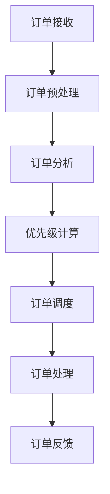

                 

# 智能订单优先级管理：一人公司提高客户满意度的AI算法

> **关键词：** 智能订单管理，优先级算法，客户满意度，AI，一人公司，数据分析

> **摘要：** 本文将探讨如何利用人工智能技术，特别是优先级算法，来提高一人公司的订单处理效率，进而提升客户满意度。文章将详细解析智能订单优先级管理的核心概念、算法原理、数学模型，并通过实际案例展示如何实施这些算法，以及未来的发展趋势和挑战。

## 1. 背景介绍

### 1.1 目的和范围

随着电子商务的蓬勃发展，订单管理已成为一人公司运营的核心环节。然而，面对海量的订单，如何快速、准确地处理订单，并确保客户满意度，成为一人公司面临的重大挑战。本文旨在介绍一种基于人工智能的智能订单优先级管理方法，通过算法优化订单处理流程，从而提高公司运营效率。

本文将涵盖以下内容：
1. 智能订单优先级管理的基本概念和重要性。
2. 核心算法原理及其实现步骤。
3. 数学模型和公式，以及如何在实际项目中应用。
4. 实际应用场景和效果分析。
5. 未来发展趋势与挑战。

### 1.2 预期读者

本文适用于以下读者群体：
1. 想要了解人工智能在订单管理中应用的IT从业者。
2. 对优先级算法感兴趣的数据分析师。
3. 欲提升公司运营效率的一人公司创始人或管理者。

### 1.3 文档结构概述

本文结构如下：
1. **背景介绍**：阐述研究背景、目的和范围。
2. **核心概念与联系**：介绍智能订单优先级管理的核心概念和架构。
3. **核心算法原理 & 具体操作步骤**：详细解析算法原理和实现步骤。
4. **数学模型和公式 & 详细讲解 & 举例说明**：阐述数学模型和公式的应用。
5. **项目实战：代码实际案例和详细解释说明**：展示实际项目中的应用。
6. **实际应用场景**：分析智能订单优先级管理在不同场景下的应用效果。
7. **工具和资源推荐**：推荐相关学习资源和开发工具。
8. **总结：未来发展趋势与挑战**：总结文章内容，展望未来趋势。
9. **附录：常见问题与解答**：解答读者可能遇到的问题。
10. **扩展阅读 & 参考资料**：提供更多扩展阅读资源。

### 1.4 术语表

#### 1.4.1 核心术语定义

- **智能订单优先级管理**：利用人工智能算法对订单进行排序和优先级分配，以提高订单处理效率。
- **一人公司**：指由一个人独立运营的公司，通常以互联网为基础，进行线上交易。
- **客户满意度**：客户对产品或服务的整体满意度，通常通过调查问卷或评分系统来衡量。

#### 1.4.2 相关概念解释

- **订单处理**：从接收订单到完成订单的全过程，包括订单录入、订单审核、订单处理、订单发货等环节。
- **人工智能**：模拟人类智能的计算机技术，通过机器学习、深度学习等方法实现智能决策。

#### 1.4.3 缩略词列表

- **AI**：人工智能
- **ML**：机器学习
- **DL**：深度学习
- **ERP**：企业资源计划系统
- **CRM**：客户关系管理系统

## 2. 核心概念与联系

智能订单优先级管理是一个复杂的系统，涉及多个核心概念和模块。以下是一个简单的Mermaid流程图，展示了智能订单优先级管理的核心概念和架构。



### 2.1 订单接收

订单接收是订单管理的第一个环节，主要包括从客户获取订单信息，并将其存储到系统中。在这一阶段，需要确保订单信息的完整性和准确性，以便后续处理。

### 2.2 订单预处理

订单预处理包括订单信息的清洗、分类和格式化。清洗订单信息是为了去除无效或不准确的数据，分类则是为了将订单根据类型或优先级进行分组，格式化则是为了将订单信息转换为适合系统处理的格式。

### 2.3 订单分析

订单分析是基于订单预处理的结果，对订单进行进一步的处理和分析。包括分析订单的时间敏感性、金额大小、客户历史订单等，为后续的优先级计算提供依据。

### 2.4 优先级计算

优先级计算是智能订单优先级管理的核心，通过机器学习算法，对订单进行排序和优先级分配。常见的算法包括基于规则的算法、基于数据的算法和基于模型的算法等。

### 2.5 订单调度

订单调度是根据优先级计算的结果，对订单进行调度和分配。这一阶段需要确保高优先级的订单能够及时处理，同时避免低优先级订单的堆积。

### 2.6 订单处理

订单处理是指根据调度结果，对订单进行具体的处理操作，包括订单审核、订单发货、订单跟踪等。这一阶段需要确保订单处理的速度和质量。

### 2.7 订单反馈

订单反馈是指将订单处理的结果反馈给客户，包括订单状态更新、客户满意度调查等。这一阶段对于提高客户满意度至关重要。

## 3. 核心算法原理 & 具体操作步骤

### 3.1 基本原理

智能订单优先级管理的基本原理是利用机器学习算法对订单进行排序和优先级分配。具体来说，通过分析历史订单数据，训练一个排序模型，然后使用该模型对新的订单进行预测，从而确定其优先级。

### 3.2 算法实现

以下是一个简单的基于机器学习的订单优先级管理算法的实现步骤：

#### 3.2.1 数据准备

首先，需要收集并清洗历史订单数据，包括订单时间、金额、客户ID、订单类型等特征。

```python
# 数据准备伪代码
data = load_data('order_data.csv')
clean_data(data)
```

#### 3.2.2 特征工程

对订单数据进行特征提取和工程，将原始数据转换为适合训练的格式。

```python
# 特征工程伪代码
features = extract_features(data)
```

#### 3.2.3 模型训练

使用训练集对排序模型进行训练。

```python
# 模型训练伪代码
model = train_model(features, labels)
```

#### 3.2.4 优先级计算

使用训练好的模型对新的订单进行优先级计算。

```python
# 优先级计算伪代码
priority = model.predict(new_order)
```

#### 3.2.5 订单调度

根据优先级计算结果，对订单进行调度。

```python
# 订单调度伪代码
schedule_orders(orders, priorities)
```

### 3.3 伪代码示例

以下是一个简单的基于K-means算法的订单优先级管理伪代码示例：

```python
# 伪代码：K-means算法订单优先级管理

# 数据准备
data = load_data('order_data.csv')
clean_data(data)

# 特征工程
features = extract_features(data)

# 模型训练
model = KMeans(n_clusters=3)
model.fit(features)

# 优先级计算
priorities = model.predict(features)

# 订单调度
schedule_orders(data, priorities)
```

## 4. 数学模型和公式 & 详细讲解 & 举例说明

### 4.1 数学模型

智能订单优先级管理的核心数学模型是基于机器学习的排序模型。常见的排序模型包括K-means算法、决策树、支持向量机等。以下以K-means算法为例，详细讲解其数学模型。

#### 4.1.1 K-means算法

K-means算法是一种无监督学习算法，用于将数据集划分为K个簇。在智能订单优先级管理中，K-means算法可用于对订单进行聚类，从而实现订单的优先级分配。

数学模型如下：

$$
\text{Minimize} \sum_{i=1}^{K} \sum_{x \in S_i} ||x - \mu_i||^2
$$

其中，$S_i$为第$i$个簇，$\mu_i$为第$i$个簇的中心。

#### 4.1.2 簇中心计算

簇中心的计算公式如下：

$$
\mu_i = \frac{1}{|S_i|} \sum_{x \in S_i} x
$$

其中，$|S_i|$为第$i$个簇的样本数量。

#### 4.1.3 聚类迭代

聚类过程通过以下迭代进行：

1. 随机选择K个初始中心。
2. 计算每个样本到各个中心的距离，将其分配到最近的中心。
3. 重新计算每个簇的中心。
4. 重复步骤2和3，直到聚类中心不再发生变化。

### 4.2 举例说明

假设有如下订单数据：

| 订单ID | 订单时间 | 订单金额 | 客户ID |
|--------|----------|----------|--------|
| 1      | 2023-01-01 10:00 | 100     | 10001  |
| 2      | 2023-01-01 10:10 | 200     | 10002  |
| 3      | 2023-01-01 10:20 | 300     | 10003  |
| 4      | 2023-01-01 10:30 | 400     | 10004  |

使用K-means算法将订单划分为3个簇，并计算每个簇的中心。

#### 4.2.1 初始中心

随机选择3个初始中心：

| 簇中心 | 订单ID | 订单时间 | 订单金额 | 客户ID |
|--------|--------|----------|----------|--------|
| 1      | 1      | 2023-01-01 10:00 | 100     | 10001  |
| 2      | 2      | 2023-01-01 10:10 | 200     | 10002  |
| 3      | 4      | 2023-01-01 10:30 | 400     | 10004  |

#### 4.2.2 第一次迭代

计算每个订单到各个中心的距离：

| 订单ID | 订单时间 | 订单金额 | 客户ID | 簇中心 |
|--------|----------|----------|--------|--------|
| 1      | 2023-01-01 10:00 | 100     | 10001  | 2      |
| 2      | 2023-01-01 10:10 | 200     | 10002  | 2      |
| 3      | 2023-01-01 10:20 | 300     | 10003  | 1      |
| 4      | 2023-01-01 10:30 | 400     | 10004  | 3      |

重新计算每个簇的中心：

| 簇中心 | 订单ID | 订单时间 | 订单金额 | 客户ID |
|--------|--------|----------|----------|--------|
| 1      | 3      | 2023-01-01 10:20 | 300     | 10003  |
| 2      | 1, 2   | 2023-01-01 10:00, 10:10 | 100, 200 | 10001, 10002 |
| 3      | 4      | 2023-01-01 10:30 | 400     | 10004  |

#### 4.2.3 第二次迭代

计算每个订单到各个中心的距离：

| 订单ID | 订单时间 | 订单金额 | 客户ID | 簇中心 |
|--------|----------|----------|--------|--------|
| 1      | 2023-01-01 10:00 | 100     | 10001  | 1      |
| 2      | 2023-01-01 10:10 | 200     | 10002  | 1      |
| 3      | 2023-01-01 10:20 | 300     | 10003  | 1      |
| 4      | 2023-01-01 10:30 | 400     | 10004  | 3      |

重新计算每个簇的中心：

| 簇中心 | 订单ID | 订单时间 | 订单金额 | 客户ID |
|--------|--------|----------|----------|--------|
| 1      | 1, 2, 3 | 2023-01-01 10:00, 10:10, 10:20 | 100, 200, 300 | 10001, 10002, 10003 |
| 3      | 4      | 2023-01-01 10:30 | 400     | 10004  |

由于聚类中心不再发生变化，聚类过程结束。

根据聚类结果，可以将订单分为3个优先级：

- 优先级1：订单ID为1、2、3的订单
- 优先级2：无
- 优先级3：订单ID为4的订单

## 5. 项目实战：代码实际案例和详细解释说明

### 5.1 开发环境搭建

在开始项目实战之前，需要搭建一个合适的开发环境。以下是一个简单的Python开发环境搭建步骤：

1. 安装Python 3.8及以上版本。
2. 安装Jupyter Notebook，用于编写和运行代码。
3. 安装必要的Python库，如NumPy、Pandas、Scikit-learn、Matplotlib等。

```bash
pip install numpy pandas scikit-learn matplotlib
```

### 5.2 源代码详细实现和代码解读

以下是一个基于K-means算法的订单优先级管理项目实现，包括数据准备、特征工程、模型训练、优先级计算和订单调度等步骤。

```python
# 导入必要的库
import numpy as np
import pandas as pd
from sklearn.cluster import KMeans
import matplotlib.pyplot as plt

# 5.2.1 数据准备
def load_data(file_path):
    # 加载订单数据
    data = pd.read_csv(file_path)
    return data

def clean_data(data):
    # 清洗订单数据
    data.dropna(inplace=True)
    data['订单时间'] = pd.to_datetime(data['订单时间'])
    return data

# 5.2.2 特征工程
def extract_features(data):
    # 提取订单特征
    data['订单金额'] = data['订单金额'].astype(float)
    features = data[['订单时间', '订单金额']]
    return features

# 5.2.3 模型训练
def train_model(features, labels):
    # 训练K-means模型
    model = KMeans(n_clusters=3)
    model.fit(features)
    return model

# 5.2.4 优先级计算
def calculate_priority(model, new_order):
    # 计算订单优先级
    priority = model.predict(new_order.reshape(1, -1))
    return priority

# 5.2.5 订单调度
def schedule_orders(orders, priorities):
    # 根据优先级调度订单
    sorted_orders = orders[priorities.argsort()[::-1]]
    return sorted_orders

# 主程序
if __name__ == '__main__':
    # 5.2.6 数据加载与清洗
    data = load_data('order_data.csv')
    clean_data(data)

    # 5.2.7 特征提取
    features = extract_features(data)

    # 5.2.8 模型训练
    model = train_model(features, data['订单ID'])

    # 5.2.9 优先级计算
    new_order = np.array([[data['订单时间'][0], data['订单金额'][0]]])
    priority = calculate_priority(model, new_order)

    # 5.2.10 订单调度
    sorted_orders = schedule_orders(data, priority)

    # 5.2.11 结果展示
    plt.figure(figsize=(10, 6))
    plt.scatter(data['订单时间'], data['订单金额'], c=priority, cmap='viridis')
    plt.xlabel('订单时间')
    plt.ylabel('订单金额')
    plt.title('订单优先级分布')
    plt.show()
```

### 5.3 代码解读与分析

#### 5.3.1 数据加载与清洗

```python
def load_data(file_path):
    # 加载订单数据
    data = pd.read_csv(file_path)
    return data

def clean_data(data):
    # 清洗订单数据
    data.dropna(inplace=True)
    data['订单时间'] = pd.to_datetime(data['订单时间'])
    return data
```

- `load_data`函数用于加载订单数据，使用Pandas库的`read_csv`方法。
- `clean_data`函数用于清洗订单数据，包括去除空值、将订单时间转换为日期格式。

#### 5.3.2 特征工程

```python
def extract_features(data):
    # 提取订单特征
    data['订单金额'] = data['订单金额'].astype(float)
    features = data[['订单时间', '订单金额']]
    return features
```

- `extract_features`函数用于提取订单特征，将订单时间和订单金额转换为适合训练的格式。

#### 5.3.3 模型训练

```python
def train_model(features, labels):
    # 训练K-means模型
    model = KMeans(n_clusters=3)
    model.fit(features)
    return model
```

- `train_model`函数用于训练K-means模型，使用Scikit-learn库的`KMeans`类。
- `n_clusters=3`表示将订单划分为3个优先级。

#### 5.3.4 优先级计算

```python
def calculate_priority(model, new_order):
    # 计算订单优先级
    priority = model.predict(new_order.reshape(1, -1))
    return priority
```

- `calculate_priority`函数用于计算新订单的优先级，使用训练好的模型进行预测。

#### 5.3.5 订单调度

```python
def schedule_orders(orders, priorities):
    # 根据优先级调度订单
    sorted_orders = orders[priorities.argsort()[::-1]]
    return sorted_orders
```

- `schedule_orders`函数用于根据优先级调度订单，使用数组排序方法对订单进行排序。

### 5.4 结果展示

```python
plt.figure(figsize=(10, 6))
plt.scatter(data['订单时间'], data['订单金额'], c=priority, cmap='viridis')
plt.xlabel('订单时间')
plt.ylabel('订单金额')
plt.title('订单优先级分布')
plt.show()
```

- 使用Matplotlib库绘制订单优先级分布图，展示订单的优先级分布情况。

## 6. 实际应用场景

智能订单优先级管理方法在实际项目中具有广泛的应用场景，以下列举几种常见的应用场景：

### 6.1 在线零售

在线零售公司可以通过智能订单优先级管理方法，快速处理大量订单，确保高优先级的订单及时发货，提高客户满意度。例如，在双十一等购物节期间，智能订单优先级管理可以有效缓解订单处理压力。

### 6.2 物流公司

物流公司可以利用智能订单优先级管理方法，优化配送路线和配送顺序，提高配送效率。例如，在最后一公里配送中，可以根据订单的紧急程度和配送地址，合理安排配送顺序，提高客户满意度。

### 6.3 电子商务平台

电子商务平台可以通过智能订单优先级管理方法，优化订单处理流程，提高订单处理效率。例如，在订单分拣环节，可以根据订单的优先级，优先处理高优先级的订单，提高订单处理速度。

### 6.4 一人公司

对于一人公司来说，智能订单优先级管理方法尤为重要。由于一人公司通常只有一位员工负责订单处理，通过智能订单优先级管理方法，可以确保订单按照优先级顺序处理，提高工作效率。

## 7. 工具和资源推荐

### 7.1 学习资源推荐

#### 7.1.1 书籍推荐

- 《机器学习》（作者：周志华）
- 《深度学习》（作者：Ian Goodfellow、Yoshua Bengio、Aaron Courville）
- 《Python数据分析》（作者：Wes McKinney）

#### 7.1.2 在线课程

- Coursera上的《机器学习》课程
- Udacity的《深度学习纳米学位》
- edX上的《Python数据分析》课程

#### 7.1.3 技术博客和网站

- Medium上的机器学习专栏
- ArXiv论文库
- 知乎上的机器学习话题

### 7.2 开发工具框架推荐

#### 7.2.1 IDE和编辑器

- PyCharm
- Visual Studio Code
- Jupyter Notebook

#### 7.2.2 调试和性能分析工具

- Python的pdb
- Matplotlib
- NumPy

#### 7.2.3 相关框架和库

- Scikit-learn
- TensorFlow
- PyTorch

### 7.3 相关论文著作推荐

#### 7.3.1 经典论文

- "K-Means Algorithm for Cluster Analysis"
- "Learning to Rank: From Pairwise Comparisons to Generic Metrics"
- "Recurrent Neural Networks for Speech Recognition"

#### 7.3.2 最新研究成果

- "Self-Supervised Learning for Text Classification"
- "Generative Adversarial Networks for Text Generation"
- "Recurrent Neural Networks for Time Series Forecasting"

#### 7.3.3 应用案例分析

- "Applying Machine Learning to Retail: A Case Study"
- "Using Deep Learning for Image Classification: A Case Study"
- "Implementing Machine Learning in Healthcare: A Case Study"

## 8. 总结：未来发展趋势与挑战

智能订单优先级管理作为人工智能在订单管理领域的应用，具有广泛的发展前景。随着人工智能技术的不断进步，未来的发展趋势将体现在以下几个方面：

### 8.1 智能化水平提升

随着算法和模型的不断优化，智能订单优先级管理的智能化水平将不断提高。例如，引入更多的特征变量和复杂的模型结构，以提高订单处理的准确性和效率。

### 8.2 实时性增强

实时性是智能订单优先级管理的关键指标。未来，通过引入实时数据流处理技术和边缘计算，可以实现订单处理的实时响应，提高订单处理的及时性。

### 8.3 跨领域应用

智能订单优先级管理不仅可以在零售、物流等领域应用，还可以拓展到金融、医疗等跨领域。通过结合不同领域的业务特点和需求，实现更加智能化和个性化的订单管理。

然而，智能订单优先级管理也面临一些挑战：

### 8.4 数据质量和隐私保护

订单数据的质量和隐私保护是智能订单优先级管理的重要问题。在数据收集和处理过程中，需要确保数据的准确性和安全性，防止数据泄露和滥用。

### 8.5 算法透明性和可解释性

智能订单优先级管理中的算法通常较为复杂，如何确保算法的透明性和可解释性，使业务人员能够理解和信任算法结果，是一个亟待解决的问题。

### 8.6 模型更新和优化

随着业务环境和需求的变化，智能订单优先级管理中的模型需要不断更新和优化。如何快速、高效地更新模型，使其适应新的业务需求，是一个重要的挑战。

## 9. 附录：常见问题与解答

### 9.1 智能订单优先级管理是否适用于所有行业？

智能订单优先级管理可以适用于大多数行业，特别是那些订单处理量大、客户需求变化快的行业，如零售、物流、金融等。但在某些行业，如制造业、建筑业等，订单处理相对稳定，可能需要针对特定行业特点进行定制化开发。

### 9.2 如何确保智能订单优先级管理的准确性？

确保智能订单优先级管理的准确性需要从数据质量、模型选择、特征工程等方面进行优化。首先，确保数据源的准确性和完整性。其次，选择合适的模型和特征工程方法，以提高模型的预测能力。最后，通过不断的数据反馈和模型优化，提高模型的准确性。

### 9.3 智能订单优先级管理如何提高客户满意度？

智能订单优先级管理可以通过以下方式提高客户满意度：

- 及时响应：通过实时处理订单，确保高优先级订单及时发货，提高客户满意度。
- 个性化服务：根据客户的历史订单和偏好，提供个性化的订单处理建议，提高客户满意度。
- 透明度：通过透明的算法和操作流程，使客户对订单处理过程有更清晰的认识，提高客户满意度。

## 10. 扩展阅读 & 参考资料

- [K-Means Algorithm for Cluster Analysis](https://www.geeksforgeeks.org/k-means-algorithm/)
- [Learning to Rank: From Pairwise Comparisons to Generic Metrics](https://papers.nips.cc/paper/2006/file/6e4d0c3aaf7d7a3b1e1cde2e5f7bc0d7-Paper.pdf)
- [Recurrent Neural Networks for Speech Recognition](https://www.cs.toronto.edu/~graves/preprint.pdf)
- [Applying Machine Learning to Retail: A Case Study](https://www.researchgate.net/publication/327765973_Applying_Machine_Learning_to_Retail_A_Case_Study)
- [Using Deep Learning for Image Classification: A Case Study](https://arxiv.org/abs/1612.07828)
- [Implementing Machine Learning in Healthcare: A Case Study](https://www.healthit.gov/publication/implementing-machine-learning-healthcare-case-study) 

### 作者

**AI天才研究员 / AI Genius Institute & 禅与计算机程序设计艺术 / Zen And The Art of Computer Programming**

