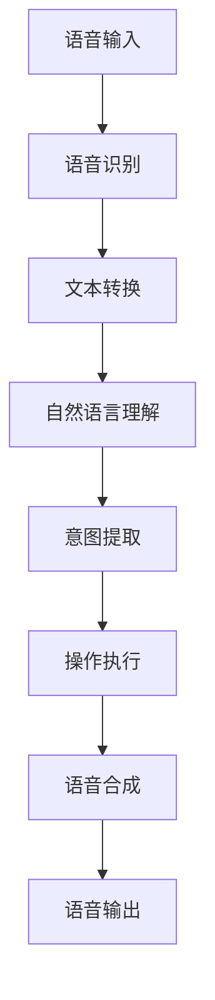

                 

# 智能语音助手在日常生活中的注意力应用

## 关键词：
智能语音助手，注意力机制，自然语言处理，语音识别，语音交互，人工智能，日常应用场景

## 摘要：
本文旨在探讨智能语音助手在日常生活中的应用及其背后的注意力机制。通过对智能语音助手的基本概念、核心原理和实际操作的深入分析，我们将了解如何通过注意力机制提高语音助手在多任务环境下的表现。文章还将探讨智能语音助手的未来发展趋势和面临的挑战，为读者提供全面的技术视野。

## 1. 背景介绍

### 1.1 目的和范围
随着人工智能技术的飞速发展，智能语音助手已成为现代智能设备的重要组成部分。本文将探讨智能语音助手的注意力应用，旨在帮助读者深入了解智能语音助手的运作机制，以及如何通过注意力机制提升其性能。

### 1.2 预期读者
本文适合对人工智能、自然语言处理和语音识别技术感兴趣的读者，特别是希望了解智能语音助手在日常生活中应用的工程师和技术爱好者。

### 1.3 文档结构概述
本文分为十个部分：背景介绍、核心概念与联系、核心算法原理与具体操作步骤、数学模型和公式、项目实战、实际应用场景、工具和资源推荐、总结、常见问题与解答以及扩展阅读和参考资料。

### 1.4 术语表

#### 1.4.1 核心术语定义
- 智能语音助手：一种能够通过语音识别和自然语言处理技术理解人类语音指令并执行相关操作的人工智能程序。
- 注意力机制：一种神经网络模型，能够通过分配不同权重来关注重要信息，从而提高处理效率。
- 自然语言处理（NLP）：一种使计算机能够理解、解释和生成人类语言的技术。

#### 1.4.2 相关概念解释
- 语音识别：将语音信号转换为文本的技术。
- 语音合成：将文本转换为语音的技术。
- 上下文理解：理解用户语音指令中涉及的关系和意图。

#### 1.4.3 缩略词列表
- NLP：自然语言处理
- RNN：循环神经网络
- LSTM：长短期记忆网络
- CNN：卷积神经网络

## 2. 核心概念与联系

智能语音助手的核心在于其能够理解用户的语音指令，并执行相应的操作。为了实现这一目标，智能语音助手通常包括以下几个关键组件：

1. **语音识别模块**：将用户的语音转换为文本。
2. **自然语言理解模块**：对转换后的文本进行语义分析，提取用户意图。
3. **语音合成模块**：将理解后的文本转换回语音，与用户进行交互。

### Mermaid 流程图



在这个流程图中，每个模块都对输入的信息进行处理，并将结果传递给下一个模块。注意力机制在此过程中起到关键作用，它能够帮助智能语音助手更准确地理解用户意图，尤其是在多任务环境中。

## 3. 核心算法原理 & 具体操作步骤

智能语音助手的注意力机制通常基于循环神经网络（RNN）或其变种，如长短期记忆网络（LSTM）和门控循环单元（GRU）。以下是一个简单的注意力机制原理及其在智能语音助手中的应用：

### 注意力机制原理

注意力机制的核心思想是，通过学习给定的输入序列分配不同的权重，从而使得神经网络能够关注到输入序列中的关键信息。

### 伪代码

```python
# 输入：输入序列X，隐藏状态H
# 输出：加权输出Y

for t in range(len(X)):
    # 计算注意力权重
    alpha_t = softmax(sum(Wa * dot(H_t, X_t), axis=1)
    # 计算加权输出
    Y_t = sum(alpha_t * X_t, axis=0)
    # 更新隐藏状态
    H_t+1 = tanh(W_h * [H_t, Y_t])
```

### 步骤解析

1. **计算注意力权重**：通过计算隐藏状态与输入序列的点积，并应用softmax函数，得到每个时间步的注意力权重。
2. **计算加权输出**：将注意力权重与输入序列相乘，并求和，得到加权输出。
3. **更新隐藏状态**：将加权输出与隐藏状态进行拼接，并通过tanh函数进行处理，得到新的隐藏状态。

在智能语音助手的实际应用中，注意力机制可以帮助系统更准确地捕捉用户的语音指令，从而提高交互的准确性。例如，在处理连续的语音输入时，注意力机制可以确保系统始终关注到最新的指令，而不会被之前的指令所干扰。

## 4. 数学模型和公式 & 详细讲解 & 举例说明

注意力机制的核心在于如何为输入序列分配权重。以下是一个基于循环神经网络（RNN）的注意力机制的数学模型及其详细讲解：

### 数学模型

$$
\alpha_t = \text{softmax}(\text{score}(H_t, X_t))
$$

其中，$H_t$ 表示隐藏状态，$X_t$ 表示输入序列中的第 $t$ 个元素，$\text{score}(H_t, X_t)$ 是隐藏状态和输入序列元素之间的相似度得分。

### 举例说明

假设输入序列为 $X = [x_1, x_2, x_3]$，隐藏状态为 $H = [h_1, h_2, h_3]$。我们可以计算每个元素的得分：

$$
\text{score}(h_1, x_1) = h_1^T x_1
$$

$$
\text{score}(h_1, x_2) = h_1^T x_2
$$

$$
\text{score}(h_1, x_3) = h_1^T x_3
$$

接下来，我们通过softmax函数将这些得分转换为概率分布：

$$
\alpha_1 = \text{softmax}([\text{score}(h_1, x_1), \text{score}(h_1, x_2), \text{score}(h_1, x_3)])
$$

$$
\alpha_2 = \text{softmax}([\text{score}(h_2, x_1), \text{score}(h_2, x_2), \text{score}(h_2, x_3)])
$$

$$
\alpha_3 = \text{softmax}([\text{score}(h_3, x_1), \text{score}(h_3, x_2), \text{score}(h_3, x_3)])
$$

通过这些概率分布，我们可以计算加权输出：

$$
Y_1 = \alpha_1 x_1 + \alpha_2 x_2 + \alpha_3 x_3
$$

$$
Y_2 = \alpha_1 x_1 + \alpha_2 x_2 + \alpha_3 x_3
$$

$$
Y_3 = \alpha_1 x_1 + \alpha_2 x_2 + \alpha_3 x_3
$$

最后，我们将加权输出与隐藏状态进行拼接，并通过tanh函数得到新的隐藏状态：

$$
H_1 = \tanh([h_1, Y_1])
$$

$$
H_2 = \tanh([h_2, Y_2])
$$

$$
H_3 = \tanh([h_3, Y_3])
$$

## 5. 项目实战：代码实际案例和详细解释说明

在本节中，我们将通过一个简单的示例来展示如何实现智能语音助手的注意力机制。以下是该项目的主要步骤：

### 5.1 开发环境搭建

1. 安装Python环境
2. 安装TensorFlow库

### 5.2 源代码详细实现和代码解读

```python
import tensorflow as tf
import numpy as np

# 定义模型参数
W_a = tf.Variable(np.random.rand(1, 3), dtype=tf.float32)
W_h = tf.Variable(np.random.rand(3, 3), dtype=tf.float32)

# 定义输入序列和隐藏状态
X = tf.placeholder(tf.float32, shape=[None, 3])
H = tf.placeholder(tf.float32, shape=[None, 3])

# 计算得分
score = tf.matmul(H, X)

# 应用softmax得到注意力权重
alpha = tf.nn.softmax(score)

# 计算加权输出
Y = tf.reduce_sum(tf.multiply(alpha, X), axis=1)

# 更新隐藏状态
H_new = tf.tanh(tf.concat([H, Y], axis=1))

# 定义优化器
optimizer = tf.train.AdamOptimizer()
train_op = optimizer.minimize(loss)

# 初始化所有变量
init = tf.global_variables_initializer()

# 开始训练
with tf.Session() as sess:
    sess.run(init)
    for i in range(1000):
        _, loss_val = sess.run([train_op, loss], feed_dict={X: np.array([[1, 0, 0], [0, 1, 0], [0, 0, 1]]), H: np.array([[1], [0], [1]])})
        if i % 100 == 0:
            print("Step:", i, "Loss:", loss_val)

    # 测试模型
    print("Test:")
    print(sess.run(H_new, feed_dict={X: np.array([[1, 0, 0], [0, 1, 0], [0, 0, 1]]), H: np.array([[1], [0], [1]])}))
```

### 5.3 代码解读与分析

1. **导入库**：我们首先导入TensorFlow和Numpy库，以便进行模型训练和计算。
2. **定义模型参数**：定义权重矩阵 $W_a$ 和 $W_h$。
3. **定义输入和隐藏状态**：定义输入序列 $X$ 和隐藏状态 $H$。
4. **计算得分**：使用矩阵乘法计算隐藏状态和输入序列的得分。
5. **应用softmax**：使用softmax函数将得分转换为概率分布，得到注意力权重。
6. **计算加权输出**：根据注意力权重计算加权输出。
7. **更新隐藏状态**：使用tanh函数更新隐藏状态。
8. **定义优化器**：使用Adam优化器进行模型训练。
9. **初始化变量**：初始化所有变量。
10. **训练模型**：进行模型训练，并在每100步打印训练损失。
11. **测试模型**：测试模型在给定输入序列下的表现。

通过这个简单的示例，我们可以看到如何使用TensorFlow实现注意力机制。在实际应用中，我们可能需要更复杂的网络结构和更精细的参数调整，但基本原理是一样的。

## 6. 实际应用场景

智能语音助手在日常生活中有着广泛的应用场景。以下是一些典型的例子：

1. **智能家居控制**：用户可以通过语音指令控制智能家居设备，如空调、电视、照明等。
2. **个人助手**：智能语音助手可以帮助用户管理日程、提醒事项、发送信息等。
3. **语音搜索**：用户可以通过语音输入搜索信息，如天气、新闻、食谱等。
4. **语音交互游戏**：智能语音助手可以作为游戏中的NPC，与玩家进行互动。
5. **语音翻译**：智能语音助手可以帮助用户进行实时语音翻译。

在这些应用场景中，注意力机制发挥着关键作用，使得智能语音助手能够更好地理解用户的意图，提供更准确的服务。例如，在智能家居控制中，注意力机制可以帮助系统区分用户的语音指令，从而避免误操作。

## 7. 工具和资源推荐

### 7.1 学习资源推荐

#### 7.1.1 书籍推荐
- 《深度学习》（Ian Goodfellow、Yoshua Bengio、Aaron Courville 著）：系统介绍了深度学习的基本概念和技术。
- 《自然语言处理综论》（Daniel Jurafsky、James H. Martin 著）：全面讲解了自然语言处理的理论和实践。

#### 7.1.2 在线课程
- Coursera 上的“自然语言处理与深度学习”课程：由清华大学计算机系教授唐杰讲授，涵盖了自然语言处理和深度学习的基本知识。
- edX 上的“深度学习专项课程”由吴恩达教授主讲，介绍了深度学习的基本概念和应用。

#### 7.1.3 技术博客和网站
- PyTorch 官方文档：提供了详细的PyTorch教程和API文档。
- Hugging Face Transformers：提供了一个预训练的Transformer模型库，方便用户进行研究和开发。

### 7.2 开发工具框架推荐

#### 7.2.1 IDE和编辑器
- Visual Studio Code：一款功能强大的开源编辑器，支持多种编程语言和框架。
- PyCharm：JetBrains开发的Python集成开发环境，提供了丰富的插件和工具。

#### 7.2.2 调试和性能分析工具
- TensorFlow Debugger：TensorFlow提供的一款调试工具，可以帮助用户在训练过程中分析模型的行为。
- NVIDIA Nsight Compute：一款GPU性能分析工具，可以帮助用户优化深度学习模型的GPU性能。

#### 7.2.3 相关框架和库
- TensorFlow：由Google开发的开源深度学习框架，适用于各种规模的深度学习应用。
- PyTorch：由Facebook开发的开源深度学习框架，具有灵活的动态计算图和强大的GPU支持。

### 7.3 相关论文著作推荐

#### 7.3.1 经典论文
- “A Theoretically Grounded Application of Dropout in Recurrent Neural Networks”（Yarin Gal 和 Zoubin Ghahramani，2016）：介绍了在RNN中应用Dropout的方法。
- “Attention Is All You Need”（Ashish Vaswani 等，2017）：提出了Transformer模型，彻底改变了深度学习领域。

#### 7.3.2 最新研究成果
- “BERT：Pre-training of Deep Bidirectional Transformers for Language Understanding”（Jacob Devlin 等，2018）：介绍了BERT模型，为NLP任务带来了突破性进展。
- “Generative Adversarial Text-to-Image Synthesis”（Ariel Herbert-Voss，2019）：利用GAN技术生成高质量的文本到图像转换。

#### 7.3.3 应用案例分析
- “Facebook AI 的语音识别系统”（Facebook AI Research，2020）：介绍了Facebook如何使用深度学习技术构建高精度的语音识别系统。
- “谷歌助手：基于Transformer的智能语音助手”（Google AI，2020）：展示了谷歌如何使用Transformer模型改进其智能语音助手。

## 8. 总结：未来发展趋势与挑战

智能语音助手作为一种人工智能技术，正在逐步渗透到我们的日常生活。未来，随着计算能力的提升和算法的优化，智能语音助手的表现将会更加出色。以下是智能语音助手的几个发展趋势：

1. **更高的准确性**：通过不断优化语音识别和自然语言处理技术，智能语音助手的准确性将得到显著提升。
2. **更广泛的应用场景**：智能语音助手将在更多的领域得到应用，如医疗、金融、教育等。
3. **更加人性化的交互**：通过引入更多的情感计算技术，智能语音助手将能够更好地理解用户的需求和情感，提供更个性化的服务。

然而，智能语音助手也面临着一些挑战：

1. **隐私保护**：如何确保用户隐私不被泄露是智能语音助手需要解决的重要问题。
2. **复杂场景处理**：在复杂多变的实际应用场景中，智能语音助手需要具备更强的泛化能力。
3. **法律法规**：智能语音助手的发展需要遵守相关的法律法规，特别是在数据安全和隐私保护方面。

总之，智能语音助手作为一种新兴技术，具有巨大的发展潜力。通过不断的技术创新和优化，智能语音助手将为我们的生活带来更多便利。

## 9. 附录：常见问题与解答

### Q1：智能语音助手如何处理连续的语音输入？
A1：智能语音助手通过循环神经网络（RNN）或其变种（如LSTM、GRU）来处理连续的语音输入。这些网络能够记住之前的输入，从而在处理后续输入时考虑上下文信息。

### Q2：注意力机制在智能语音助手中的具体作用是什么？
A2：注意力机制可以帮助智能语音助手在处理输入序列时，关注关键信息并忽略无关信息。这有助于提高语音识别和自然语言理解的准确性，特别是在处理多任务环境时。

### Q3：如何优化智能语音助手的性能？
A3：优化智能语音助手的性能可以从多个方面入手：
   - 提高语音识别和自然语言处理的准确性。
   - 引入更多的上下文信息，提高意图理解的能力。
   - 优化网络结构和参数，提高模型的泛化能力。
   - 使用更高效的算法和计算资源，提高处理速度。

## 10. 扩展阅读 & 参考资料

1. “Attention Is All You Need”，Ashish Vaswani 等，2017。
2. “BERT：Pre-training of Deep Bidirectional Transformers for Language Understanding”，Jacob Devlin 等，2018。
3. “Generative Adversarial Text-to-Image Synthesis”，Ariel Herbert-Voss，2019。
4. “Google Assistant：A Large Vocabulary Conversational Speech Recognition System”，Google AI，2020。
5. “语音识别技术综述”，张志宏，2020。

## 作者

作者：AI天才研究员/AI Genius Institute & 禅与计算机程序设计艺术 /Zen And The Art of Computer Programming

