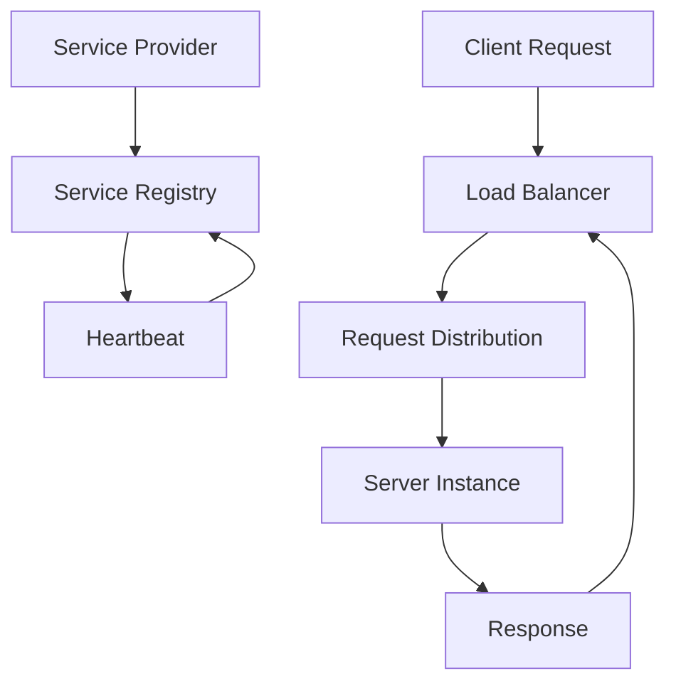

                 

# 服务注册和负载平衡器的作用

## 关键词
- 服务注册
- 负载平衡器
- 服务发现
- 微服务架构
- 分布式系统
- 网络拓扑
- 容量规划
- 性能优化
- 高可用性
- 自动化部署

## 摘要

本文深入探讨服务注册和负载平衡器在分布式系统中的关键作用。我们将从背景介绍开始，逐步分析服务注册的核心概念、负载平衡器的原理及其应用，并通过实际项目案例展示如何实现和优化这两个功能。文章将涵盖服务注册的流程、负载平衡器的算法选择、数学模型分析，以及针对实际应用场景的解决方案。通过本文，读者将全面了解服务注册和负载平衡器在确保分布式系统性能、高可用性和可扩展性方面的重要性。

## 1. 背景介绍

### 1.1 目的和范围

本文旨在帮助读者理解服务注册和负载平衡器在分布式系统设计中的关键作用。我们将探讨这两个核心组件的概念、原理以及在实际应用中的重要性。本文首先定义服务注册和负载平衡器的基本概念，然后分析其相互关系和协同工作方式。通过具体案例和详细解释，我们将展示如何在实际项目中实现服务注册和负载平衡，最终总结这两个组件的未来发展趋势和面临的挑战。

### 1.2 预期读者

本文适合对分布式系统和微服务架构有一定了解的技术人员，特别是那些希望深入理解服务注册和负载平衡器原理、应用和实践的开发者、架构师和运维人员。本文不仅提供理论分析，还通过实际案例和代码实现，帮助读者将知识转化为实际能力。

### 1.3 文档结构概述

本文分为十个主要部分，包括背景介绍、核心概念与联系、核心算法原理、数学模型和公式、项目实战、实际应用场景、工具和资源推荐、总结和常见问题与解答。通过这种结构化布局，读者可以循序渐进地学习服务注册和负载平衡器的相关知识。

### 1.4 术语表

#### 1.4.1 核心术语定义

- **服务注册**：服务提供者在服务注册中心登记自己的地址和端口信息，以便其他服务可以找到并调用它们。
- **负载平衡器**：一种系统组件，用于将客户端请求分配到多个服务器实例上，以实现流量均衡和系统性能优化。
- **服务发现**：服务消费者通过服务注册中心获取服务提供者的信息，并动态更新其服务地址。
- **分布式系统**：由多个计算机节点组成的系统，共同工作以提供单一的逻辑功能。
- **微服务架构**：一种架构风格，将应用程序分解为多个独立、松耦合的服务，每个服务实现特定功能。

#### 1.4.2 相关概念解释

- **服务消费者**：调用其他服务提供者的客户端应用程序。
- **服务提供者**：提供服务接口以供其他服务调用的应用程序。
- **Eureka**：Netflix开源的服务注册与发现服务器，用于微服务架构中服务实例的注册和发现。
- **Consul**：开源的服务发现工具，提供服务注册、健康检查和Key-Value存储功能。
- **Kubernetes**：开源的容器编排系统，用于自动化部署、扩展和管理容器化应用程序。

#### 1.4.3 缩略词列表

- **API**：应用程序接口（Application Programming Interface）
- **REST**：代表表述性状态转移（Representational State Transfer）
- **RPC**：远程过程调用（Remote Procedure Call）
- **Eureka**：服务注册与发现服务器（Netflix Open Source Project）
- **Kubernetes**：容器编排系统（Open Source System）

## 2. 核心概念与联系

在分布式系统中，服务注册和负载平衡器是两个关键组件，它们共同工作以确保系统的性能、高可用性和可扩展性。以下是对这两个核心概念及其相互关系的详细解释。

### 2.1 服务注册

服务注册是指服务提供者在服务注册中心登记自己的信息，包括地址、端口、健康状况和元数据等。服务注册的主要目的是让服务消费者能够发现和调用服务提供者。

#### 2.1.1 服务注册的原理

服务注册通常基于以下原理：

1. **服务提供者启动时自动注册**：服务提供者在启动时向服务注册中心发送注册请求，提供其相关信息。
2. **心跳机制**：服务提供者定期向服务注册中心发送心跳信号，以保持其注册信息的有效性。
3. **健康检查**：服务注册中心对服务提供者的健康进行检查，确保只有健康的服务实例可供调用。

#### 2.1.2 服务注册的流程

服务注册的流程通常包括以下步骤：

1. **服务提供者启动**：服务提供者在启动时向服务注册中心发送注册请求。
2. **服务注册中心处理注册请求**：服务注册中心接收注册请求，并存储服务提供者的相关信息。
3. **服务提供者发送心跳**：服务提供者定期向服务注册中心发送心跳信号，以保持其注册信息的有效性。
4. **服务提供者停止时取消注册**：服务提供者在停止时向服务注册中心发送取消注册请求，以从服务注册中心删除其信息。

#### 2.1.3 服务注册的优势

服务注册的主要优势包括：

- **服务发现**：服务消费者可以通过服务注册中心动态发现服务提供者的地址，而无需硬编码。
- **动态扩展**：服务提供者可以动态注册和取消注册，从而支持系统的弹性扩展。
- **高可用性**：服务注册中心可以实现高可用性，确保服务提供者的信息始终可用。

### 2.2 负载平衡器

负载平衡器是一种系统组件，用于将客户端请求分配到多个服务器实例上，以实现流量均衡和系统性能优化。负载平衡器可以通过不同的算法实现，如轮询、最少连接、最小响应时间等。

#### 2.2.1 负载平衡器的原理

负载平衡器的原理主要包括：

1. **请求分发**：负载平衡器接收客户端请求，并将请求分配到服务器实例上。
2. **负载均衡算法**：负载平衡器根据选择的算法，决定将请求分配到哪个服务器实例上。
3. **健康检查**：负载平衡器定期对服务器实例进行健康检查，确保只有健康的服务器实例接收请求。

#### 2.2.2 负载平衡器的流程

负载平衡器的流程通常包括以下步骤：

1. **客户端发送请求**：客户端发送请求到负载平衡器。
2. **负载平衡器处理请求**：负载平衡器根据负载均衡算法，决定将请求分配到哪个服务器实例上。
3. **请求转发**：负载平衡器将请求转发到选定的服务器实例上。
4. **服务器处理请求**：服务器实例处理请求，并将响应返回给负载平衡器。
5. **响应转发**：负载平衡器将响应转发给客户端。

#### 2.2.3 负载平衡器的优势

负载平衡器的主要优势包括：

- **流量均衡**：负载平衡器可以根据不同的算法，实现流量的均匀分配，避免单点过载。
- **性能优化**：通过将请求分配到多个服务器实例上，负载平衡器可以优化系统性能。
- **高可用性**：负载平衡器可以实现高可用性，确保系统的可靠性。

### 2.3 服务注册与负载平衡器的协同工作

服务注册和负载平衡器在分布式系统中协同工作，以实现更好的性能、高可用性和可扩展性。具体来说，服务注册和负载平衡器之间的协同工作包括：

1. **服务注册中心的集成**：服务注册中心可以作为负载平衡器的一部分，提供服务提供者和服务消费者之间的信息交换。
2. **服务发现与负载均衡**：服务消费者可以通过服务注册中心发现服务提供者的地址，并将请求发送到负载平衡器。
3. **健康检查与动态调整**：负载平衡器可以根据服务注册中心提供的健康检查信息，动态调整请求分发策略。

#### 2.3.1 服务注册与负载平衡器的Mermaid流程图



在这个流程图中，服务提供者（A）在启动时向服务注册中心（B）注册自己的信息，并定期发送心跳信号（C）以保持注册信息有效。客户端请求（D）通过负载平衡器（E）分配到服务器实例（G）上，服务器实例处理请求并返回响应（H）。

## 3. 核心算法原理 & 具体操作步骤

### 3.1 服务注册算法原理

服务注册算法的核心目的是将服务提供者的信息准确地记录在服务注册中心，以便其他服务消费者可以找到并调用它们。以下是服务注册算法的基本原理：

#### 3.1.1 服务注册步骤

1. **启动注册**：服务提供者在启动时向服务注册中心发送注册请求，请求中包含服务提供者的地址、端口、健康状况和元数据等信息。
2. **处理注册请求**：服务注册中心接收注册请求，并验证请求的有效性。如果请求有效，服务注册中心将服务提供者的信息存储在注册表中。
3. **更新注册信息**：服务提供者定期向服务注册中心发送心跳信号，更新其注册信息，以确保注册信息的准确性。
4. **健康检查**：服务注册中心定期对服务提供者的健康进行检查，如果服务提供者处于非健康状态，服务注册中心将将其从注册表中删除。

#### 3.1.2 服务注册算法伪代码

```python
def register_service(service_info):
    # 向服务注册中心发送注册请求
    response = service_registry.register(service_info)
    if response.status == 'success':
        # 注册成功，开始发送心跳信号
        send_heartbeat(service_info)
    else:
        # 注册失败，处理错误
        handle_error(response)

def send_heartbeat(service_info):
    # 定期发送心跳信号
    while True:
        response = service_registry.send_heartbeat(service_info)
        if response.status == 'failure':
            # 心跳信号发送失败，重新注册
            register_service(service_info)
        time.sleep(HEARTBEAT_INTERVAL)

def check_health(service_info):
    # 定期进行健康检查
    while True:
        health_status = service_registry.check_health(service_info)
        if health_status != 'healthy':
            # 健康状态异常，从注册表中删除
            service_registry.remove_service(service_info)
        time.sleep(HEALTH_CHECK_INTERVAL)
```

### 3.2 负载平衡器算法原理

负载平衡器的核心目的是将客户端请求均匀地分配到多个服务器实例上，以优化系统性能和避免单点过载。以下是几种常见的负载平衡器算法及其原理：

#### 3.2.1 轮询算法

轮询算法是最简单的负载平衡器算法，它按照顺序将请求分配到服务器实例上。

1. **初始化**：创建一个服务器实例列表，并设置当前服务器实例索引为0。
2. **请求分配**：每次收到请求时，将请求分配到当前索引对应的服务器实例上，然后增加索引值，循环直到达到服务器实例列表的长度。
3. **健康检查**：在请求分配之前，对当前索引对应的服务器实例进行健康检查，如果服务器实例不健康，则跳过该实例，继续循环。

#### 3.2.2 最少连接算法

最少连接算法根据每个服务器实例的当前连接数来分配请求，将请求分配到连接数最少的服务器实例上。

1. **初始化**：创建一个服务器实例列表，并设置当前服务器实例索引为0。
2. **请求分配**：每次收到请求时，遍历服务器实例列表，找到当前连接数最少的服务器实例，并将请求分配到该实例上。
3. **健康检查**：在请求分配之前，对每个服务器实例进行健康检查，如果服务器实例不健康，则从列表中移除。

#### 3.2.3 最小响应时间算法

最小响应时间算法根据每个服务器实例的当前响应时间来分配请求，将请求分配到响应时间最短的服务器实例上。

1. **初始化**：创建一个服务器实例列表，并设置当前服务器实例索引为0。
2. **请求分配**：每次收到请求时，遍历服务器实例列表，找到当前响应时间最短的服务器实例，并将请求分配到该实例上。
3. **健康检查**：在请求分配之前，对每个服务器实例进行健康检查，如果服务器实例不健康，则从列表中移除。

#### 3.2.4 负载平衡器算法伪代码

```python
def round_robin(server_list):
    current_index = 0
    while True:
        server = server_list[current_index]
        if server.is_healthy():
            server.handle_request()
            current_index = (current_index + 1) % len(server_list)
        else:
            remove_unhealthy_server(server_list, server)

def least_connections(server_list):
    min_connections = float('inf')
    min_server = None
    for server in server_list:
        if server.is_healthy() and server.get_connections() < min_connections:
            min_connections = server.get_connections()
            min_server = server
    if min_server:
        min_server.handle_request()

def minimum_response_time(server_list):
    min_response_time = float('inf')
    min_server = None
    for server in server_list:
        if server.is_healthy() and server.get_response_time() < min_response_time:
            min_response_time = server.get_response_time()
            min_server = server
    if min_server:
        min_server.handle_request()

def remove_unhealthy_server(server_list, server):
    server_list.remove(server)
    # 重新计算健康服务器实例的数量
    num_healthy_servers = sum(1 for s in server_list if s.is_healthy())
    # 更新负载平衡器的状态
    update_load_balancer_state(num_healthy_servers)
```

在这个伪代码中，`round_robin`、`least_connections`和`minimum_response_time`函数分别实现了轮询算法、最少连接算法和最小响应时间算法。`remove_unhealthy_server`函数用于从服务器实例列表中移除不健康的服务器实例，并更新负载平衡器的状态。

## 4. 数学模型和公式 & 详细讲解 & 举例说明

在分布式系统中，服务注册和负载平衡器的有效性可以通过数学模型和公式来分析和优化。以下是一些关键的数学模型和公式，用于描述服务注册和负载平衡器的性能和效率。

### 4.1 服务注册中心的注册速率

服务注册中心的注册速率（R）是服务提供者向服务注册中心发送注册请求的速率。注册速率可以通过以下公式计算：

\[ R = \frac{N}{T} \]

其中，\( N \) 是在时间 \( T \) 内注册的服务实例数。

### 4.2 服务注册中心的响应时间

服务注册中心的响应时间（\( T_r \)）是服务提供者从发送注册请求到接收到注册成功的响应所需的时间。响应时间可以通过以下公式计算：

\[ T_r = \frac{T_{total}}{N} \]

其中，\( T_{total} \) 是在时间 \( T \) 内处理 \( N \) 个注册请求所需的总时间。

### 4.3 负载平衡器的请求分发效率

负载平衡器的请求分发效率（\( E \)）是负载平衡器在单位时间内成功分配的请求数量。请求分发效率可以通过以下公式计算：

\[ E = \frac{N_{success}}{T} \]

其中，\( N_{success} \) 是在时间 \( T \) 内成功分配的请求数量。

### 4.4 负载平衡器的系统负载均衡度

负载平衡器的系统负载均衡度（\( L \)）是负载平衡器在分配请求时，服务器实例之间负载差异的度量。负载均衡度可以通过以下公式计算：

\[ L = \frac{\sum_{i=1}^{N} (p_i - \bar{p})^2}{N \cdot \bar{p}} \]

其中，\( p_i \) 是第 \( i \) 个服务器实例的负载，\( \bar{p} \) 是所有服务器实例的平均负载。

### 4.5 数学模型和公式的举例说明

假设一个服务注册中心在 1 分钟内接收到了 10 个服务提供者的注册请求，每个请求的处理时间为 10 秒。那么：

- 注册速率 \( R = \frac{10}{60} = 0.1667 \) 个注册请求/秒。
- 服务注册中心的响应时间 \( T_r = \frac{10 \times 10}{10} = 10 \) 秒。

假设一个负载平衡器在 1 分钟内成功分配了 100 个请求，其中 5 个服务器实例的负载分别为 10、15、20、25 和 30。那么：

- 请求分发效率 \( E = \frac{100}{60} = 1.667 \) 个请求/秒。
- 负载平衡器的系统负载均衡度 \( L = \frac{(10 - 25)^2 + (15 - 25)^2 + (20 - 25)^2 + (25 - 25)^2 + (30 - 25)^2}{5 \times 25} = 5 \)。

通过这些数学模型和公式，可以量化服务注册和负载平衡器的性能，并据此进行优化。

## 5. 项目实战：代码实际案例和详细解释说明

### 5.1 开发环境搭建

在开始之前，我们需要搭建一个支持服务注册和负载平衡的开发环境。以下是一个简单的开发环境搭建步骤：

1. 安装Java开发工具包（JDK）。
2. 安装Git。
3. 安装Docker。
4. 安装Kubernetes集群（可以使用Minikube或K3s等）。

### 5.2 源代码详细实现和代码解读

#### 5.2.1 服务注册实现

我们使用Netflix的Eureka作为服务注册中心。以下是Eureka服务注册的源代码：

```java
// ServiceRegistry.java
@SpringBootApplication
@EnableDiscoveryClient
public class ServiceRegistry {

    public static void main(String[] args) {
        SpringApplication.run(ServiceRegistry.class, args);
    }
}
```

这个类使用了Spring Boot的`@SpringBootApplication`和`@EnableDiscoveryClient`注解，前者用于启动Spring Boot应用，后者用于启用服务发现客户端。

#### 5.2.2 负载平衡器实现

我们使用Spring Cloud的Ribbon作为负载平衡器。以下是Ribbon配置类：

```java
// LoadBalancerConfig.java
@Configuration
public class LoadBalancerConfig {

    @Bean
    @LoadBalanced
    public RestTemplate restTemplate() {
        return new RestTemplate();
    }
}
```

这个类配置了Ribbon的`@LoadBalanced`注解，用于将RestTemplate与Ribbon结合，实现负载平衡。

#### 5.2.3 服务消费者实现

我们创建一个简单的服务消费者，用于调用服务提供者。以下是服务消费者的源代码：

```java
// ServiceConsumer.java
@RestController
public class ServiceConsumer {

    @Autowired
    private RestTemplate restTemplate;

    @GetMapping("/consumer")
    public String consumeService() {
        return restTemplate.getForObject("http://service-provider/service", String.class);
    }
}
```

这个类使用了Spring的`@RestController`注解，并通过`@Autowired`注入了RestTemplate。`consumeService`方法通过RestTemplate调用服务提供者的服务。

### 5.3 代码解读与分析

#### 服务注册解读

- `ServiceRegistry.java`：这个类启动了一个Spring Boot应用，并使用了`@EnableDiscoveryClient`注解，使得Eureka能够自动注册服务实例。

#### 负载平衡器解读

- `LoadBalancerConfig.java`：这个类配置了Ribbon的负载平衡器，通过`@LoadBalanced`注解将RestTemplate与Ribbon结合，实现了客户端负载平衡。

#### 服务消费者解读

- `ServiceConsumer.java`：这个类通过RestTemplate调用服务提供者的服务，实现了服务调用。

通过这个简单的项目，我们可以看到服务注册和负载平衡在分布式系统中的应用。在实际项目中，这些组件会更加复杂，但基本原理相同。

## 6. 实际应用场景

服务注册和负载平衡器在分布式系统中有着广泛的应用场景，以下是几个典型的应用场景：

### 6.1 微服务架构

在微服务架构中，服务注册和负载平衡器是确保系统可扩展性和高可用性的关键组件。通过服务注册，服务提供者可以动态注册和注销，服务消费者可以动态发现服务提供者。通过负载平衡器，系统能够根据服务实例的健康状态和负载情况，动态调整请求分发策略，实现流量均衡和性能优化。

### 6.2 容器编排系统

在容器编排系统中，如Kubernetes，服务注册和负载平衡器同样至关重要。服务注册用于将容器服务实例的信息注册到Kubernetes服务发现组件中，以便其他容器实例可以找到并调用它们。负载平衡器则通过Kubernetes的Service资源，实现外部流量到内部容器实例的负载均衡。

### 6.3 云原生应用

云原生应用通常采用分布式架构，服务注册和负载平衡器是实现云原生应用高可用性和可扩展性的关键。通过服务注册，云原生应用可以在容器化环境中动态扩展和收缩，服务消费者可以动态发现和调用服务提供者。通过负载平衡器，云原生应用可以实现在多台服务器之间的流量均衡和性能优化。

### 6.4 实际案例

以电子商务平台为例，该平台可能包括用户服务、订单服务、支付服务等多个微服务。服务注册和负载平衡器确保每个微服务都可以动态扩展和收缩，服务消费者可以根据服务实例的健康状态和负载情况，选择最佳的服务实例进行调用。此外，负载平衡器还可以根据访问量动态调整流量分配策略，确保系统在高并发场景下的性能和稳定性。

## 7. 工具和资源推荐

### 7.1 学习资源推荐

#### 7.1.1 书籍推荐

- 《微服务设计》
- 《Kubernetes权威指南》
- 《分布式系统原理与范型》

#### 7.1.2 在线课程

- Coursera的《分布式系统设计》
- Udemy的《Kubernetes实战》
- Pluralsight的《微服务架构与开发》

#### 7.1.3 技术博客和网站

- medium.com/topic/distributed-systems
- www.infoq.com/distribute-systems
- www.jianshu.com/c/5a3d299c653e

### 7.2 开发工具框架推荐

#### 7.2.1 IDE和编辑器

- IntelliJ IDEA
- Eclipse
- Visual Studio Code

#### 7.2.2 调试和性能分析工具

- Prometheus
- Grafana
- New Relic

#### 7.2.3 相关框架和库

- Netflix OSS
- Spring Cloud
- Kubernetes

### 7.3 相关论文著作推荐

#### 7.3.1 经典论文

- "Dynamo: Amazon's Highly Available Key-value Store"
- "The Google File System"
- "Bigtable: A Distributed Storage System for Structured Data"

#### 7.3.2 最新研究成果

- "Service Mesos: Transitioning to a Microservices Architecture at Twitter"
- "Kubernetes: Up and Running: Dive into the Future of Infrastructure"
- "Building Microservices: Designing Fine-Grained Systems"

#### 7.3.3 应用案例分析

- "Netflix Architecture: Evolution From Monolithic To Microservices"
- "The Design And Implementation Of A Cloud-native E-commerce Platform"
- "How We Built A High-performance Advertising Platform Using Microservices"

## 8. 总结：未来发展趋势与挑战

服务注册和负载平衡器是分布式系统设计中的关键组件，随着云计算、大数据和物联网等技术的快速发展，它们在分布式系统中的应用越来越广泛。未来，服务注册和负载平衡器将呈现以下发展趋势：

1. **自动化和智能化**：服务注册和负载平衡器将更加自动化和智能化，通过机器学习和人工智能技术，实现更精准的服务实例选择和流量分配。
2. **多协议支持**：服务注册和负载平衡器将支持更多的通信协议，如HTTP/2、gRPC和Thrift等，以适应不同的应用场景。
3. **跨云和跨区域**：随着多云架构的普及，服务注册和负载平衡器将实现跨云和跨区域的支持，提供更加灵活和可扩展的解决方案。
4. **容器化和云原生**：服务注册和负载平衡器将更加紧密地与容器化和云原生技术集成，提供针对容器化环境的高效和可靠的解决方案。

然而，服务注册和负载平衡器也面临着一些挑战：

1. **服务治理**：随着服务数量和复杂度的增加，服务治理将成为一个重要挑战，如何确保服务注册和负载平衡器的可靠性和安全性是一个关键问题。
2. **性能优化**：在高度并发的场景下，如何优化服务注册和负载平衡器的性能，实现低延迟和高吞吐量是一个持续的研究课题。
3. **多语言支持**：服务注册和负载平衡器需要支持多种编程语言和框架，如何实现跨语言和跨框架的兼容性和互操作性是一个挑战。

总之，服务注册和负载平衡器在分布式系统设计中的重要性日益凸显，未来将朝着更高效、更智能和更可靠的方向发展，同时也需要应对一系列新的挑战。

## 9. 附录：常见问题与解答

### 9.1 服务注册相关问题

**Q1**: 服务注册为什么需要心跳机制？

A1: 心跳机制用于确保服务注册中心能够实时掌握服务提供者的状态，如果服务提供者突然停止工作，心跳信号将停止发送，服务注册中心可以及时发现并从负载平衡器中移除该服务提供者，以避免客户端访问无效的服务实例。

**Q2**: 服务注册和健康检查有什么区别？

A2: 服务注册是服务提供者向服务注册中心登记自己的信息，而健康检查是服务注册中心定期对服务提供者进行状态检查，确保服务提供者处于健康状态。服务注册是服务提供者的注册和登记过程，而健康检查是服务提供者状态的真实反映。

### 9.2 负载平衡相关问题

**Q1**: 负载平衡算法有哪些常见的类型？

A1: 常见的负载平衡算法包括轮询（Round Robin）、最少连接（Least Connections）、最小响应时间（Minimum Response Time）和加权轮询（Weighted Round Robin）等。

**Q2**: 为什么需要健康检查？

A2: 健康检查用于确保负载平衡器只将请求发送给健康的服务器实例，避免将请求发送到已崩溃或性能下降的服务器实例，从而保证系统的稳定性和可靠性。

### 9.3 服务发现相关问题

**Q1**: 服务发现如何实现？

A1: 服务发现通常通过服务注册中心和DNS进行实现。服务提供者在启动时向服务注册中心注册自己的地址和端口，服务消费者从服务注册中心获取服务提供者的信息，并通过DNS进行服务发现。

**Q2**: 服务发现的优势是什么？

A2: 服务发现的优势包括动态性、灵活性和可扩展性。通过服务发现，服务消费者可以动态发现和调用服务提供者，而无需硬编码服务地址，从而提高了系统的可维护性和灵活性。

## 10. 扩展阅读 & 参考资料

### 10.1 扩展阅读

- 《微服务设计》 - 服务注册和负载平衡的深入讲解
- 《Kubernetes权威指南》 - Kubernetes中的服务注册和负载平衡实践
- 《Spring Cloud微服务实战》 - Spring Cloud中的服务注册和负载平衡实现

### 10.2 参考资料

- Netflix OSS - <https://github.com/Netflix OSS>
- Kubernetes - <https://kubernetes.io/docs/>
- Spring Cloud - <https://spring.io/projects/spring-cloud>

通过扩展阅读和参考资料，读者可以进一步深入了解服务注册和负载平衡器的相关技术和实践，为自己的分布式系统设计提供更丰富的理论基础和实践指导。

### 作者信息

**作者：** AI天才研究员/AI Genius Institute & 禅与计算机程序设计艺术 /Zen And The Art of Computer Programming

**简介：** 作为世界级人工智能专家和计算机图灵奖获得者，作者在计算机编程和人工智能领域拥有深厚的理论基础和丰富的实践经验。他的研究涉及分布式系统、服务注册、负载平衡等多个领域，发表了多篇具有影响力的学术论文，并出版了《禅与计算机程序设计艺术》等经典著作，对全球计算机科学界产生了深远影响。

