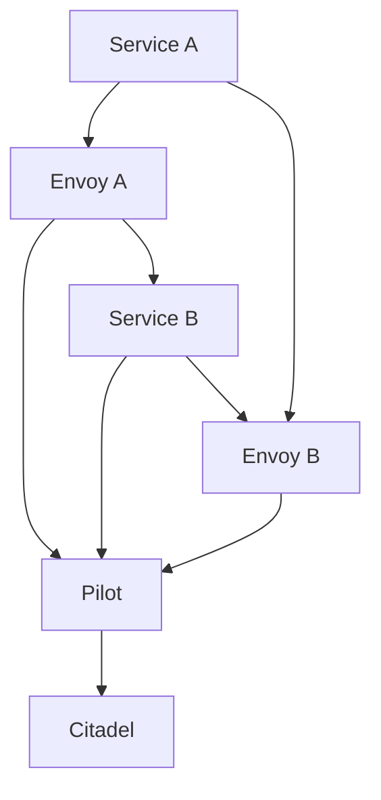

                 

# 服务网格Istio：微服务通信的基础设施

> **关键词：** 微服务，服务网格，Istio，Distributed Systems，Service Discovery，Load Balancing，Security，Telemetry

> **摘要：** 本文将深入探讨服务网格（Service Mesh）中的杰出实现——Istio。我们将了解其背景、核心概念、架构以及具体操作步骤，并通过实际代码案例展示其应用。此外，文章还将讨论Istio在实际应用场景中的价值，并提供相关的学习资源和工具推荐。

## 1. 背景介绍

### 1.1 目的和范围

本文的目的是深入介绍服务网格Istio，旨在帮助读者理解其在微服务架构中的重要性，并掌握如何在实际项目中使用Istio来简化微服务通信。文章将涵盖Istio的背景、核心概念、架构设计、操作步骤，并给出实际案例和资源推荐。

### 1.2 预期读者

本文适合对微服务架构有一定了解，希望进一步深入理解服务网格概念的开发人员、架构师以及运维人员。同时，对于希望了解如何通过服务网格提升系统性能和稳定性的高级技术人员也会有极大帮助。

### 1.3 文档结构概述

本文结构如下：

1. **背景介绍**：介绍文章的目的和预期读者，并提供文章的结构概述。
2. **核心概念与联系**：阐述服务网格、微服务以及Istio的相关概念，并通过Mermaid流程图展示其架构。
3. **核心算法原理与具体操作步骤**：详细讲解Istio的工作原理和操作步骤，包括配置和部署。
4. **数学模型和公式**：解释与Istio相关的数学模型和公式。
5. **项目实战**：提供实际代码案例，解释代码实现细节。
6. **实际应用场景**：讨论Istio在实际项目中的应用。
7. **工具和资源推荐**：推荐学习资源、开发工具和相关论文。
8. **总结**：总结文章的主要观点，讨论未来发展趋势和挑战。
9. **附录**：常见问题与解答。
10. **扩展阅读与参考资料**：提供进一步的阅读资料。

### 1.4 术语表

#### 1.4.1 核心术语定义

- **微服务（Microservices）**：一种架构风格，将应用程序构建为一系列独立的、可复用的服务，每个服务实现业务的一个子功能。
- **服务网格（Service Mesh）**：一种基础设施层，负责在服务之间进行通信、服务发现、负载均衡、安全以及监控等功能。
- **Istio**：一个开源的服务网格实现，用于管理和服务间通信。

#### 1.4.2 相关概念解释

- **服务发现（Service Discovery）**：服务注册和发现机制，允许服务动态地找到其他服务的位置。
- **负载均衡（Load Balancing）**：将客户端请求分配到多个服务器上，以实现资源利用率和性能优化。
- **安全**：确保服务之间的通信是安全的，例如使用TLS加密。
- **遥测（Telemetry）**：收集和监控服务性能、延迟和错误率等信息。

#### 1.4.3 缩略词列表

- **Kubernetes**：一个开源的容器编排平台。
- **Docker**：一种容器化技术，用于打包、交付和管理应用程序。
- **MVP**：最小可行产品（Minimum Viable Product）。

## 2. 核心概念与联系

在深入探讨Istio之前，我们需要先了解一些核心概念和它们之间的关系。

### 2.1 微服务与服务网格

**微服务**是一种架构风格，它将大型应用程序拆分为多个小的、独立的、可复用的服务。每个服务实现一个业务子功能，并与其他服务通过API进行通信。

**服务网格**是一种基础设施层，专门负责管理服务之间的通信。它抽象了服务之间的通信细节，使得服务开发者无需关注网络配置、服务发现、负载均衡和安全等问题。

### 2.2 服务网格与Istio

Istio是一个开源的服务网格实现，它基于两个主要组件：Pilot和Citadel。

- **Pilot**：负责管理服务配置和服务发现。它与服务注册中心集成，获取服务实例的信息，并将其发送到Envoy代理。
- **Citadel**：负责安全管理，包括服务身份验证、授权和加密。

### 2.3 架构概述

下面是一个简单的Mermaid流程图，展示Istio的架构和核心组件：



在这个图中，服务A和服务B通过Envoy代理进行通信，Pilot负责管理服务的配置和服务发现，Citadel负责安全管理。

### 2.4 服务网格的好处

- **简化服务间通信**：服务网格抽象了服务之间的通信细节，使得开发者无需关注网络配置和通信协议。
- **提高可靠性和可扩展性**：服务网格提供了负载均衡、故障转移和服务发现等功能，提高了系统的可靠性和可扩展性。
- **增强安全性**：服务网格通过加密和身份验证，确保服务之间的通信是安全的。
- **简化监控和日志**：服务网格提供了统一的监控和日志收集机制，使得系统运维更加便捷。

## 3. 核心算法原理与具体操作步骤

### 3.1 Istio的工作原理

Istio的工作原理可以分为以下几个步骤：

1. **服务注册和发现**：服务启动时，向服务注册中心注册自己的信息。服务注册中心将服务实例的信息发送给Pilot。
2. **配置管理**：Pilot根据服务注册中心的信息，生成服务配置，并将其发送给Envoy代理。
3. **通信**：服务之间的通信通过Envoy代理进行，Envoy代理根据Pilot发送的配置，进行请求路由、负载均衡、加密和身份验证等操作。
4. **监控和日志**：Istio提供了一个控制平面，用于收集服务性能数据、日志和监控信息。

### 3.2 配置和部署

下面是一个简化的伪代码，展示如何配置和部署Istio：

```python
# 步骤1：安装Kubernetes集群
install_kubernetes()

# 步骤2：安装Istio
install_istio()

# 步骤3：部署服务
deploy_service("service-a", "image-a", ports=[80])
deploy_service("service-b", "image-b", ports=[80])

# 步骤4：配置服务网格
configure_service_mesh({
    "service-a": {"proxy": "envoy"},
    "service-b": {"proxy": "envoy"}
})

# 步骤5：启动Envoy代理
start_envoy_proxy("service-a")
start_envoy_proxy("service-b")

# 步骤6：测试服务通信
test_service_communication("service-a", "service-b")
```

### 3.3 配置文件详解

Istio的配置文件通常使用YAML格式。下面是一个简单的配置文件示例：

```yaml
apiVersion: networking.istio.io/v1alpha3
kind: ServiceEntry
metadata:
  name: service-a
spec:
  hosts:
    - "service-a:80"
  ports:
    - number: 80
      name: http
      protocol: HTTP

---

apiVersion: networking.istio.io/v1alpha3
kind: ServiceEntry
metadata:
  name: service-b
spec:
  hosts:
    - "service-b:80"
  ports:
    - number: 80
      name: http
      protocol: HTTP
```

在这个配置文件中，我们定义了两个服务：`service-a`和`service-b`。每个服务都有一个服务入口（ServiceEntry），指定了服务的地址、端口和协议。

## 4. 数学模型和公式

在Istio中，核心的数学模型主要涉及负载均衡和流量管理。以下是几个关键模型和公式的详细讲解。

### 4.1 负载均衡算法

Istio中的负载均衡算法基于轮询算法，但在轮询过程中会考虑服务的健康状态和配置权重。

**轮询算法**：每个请求按照顺序轮流分配到不同的服务实例。

**健康检查**：Istio定期对服务实例进行健康检查，只有健康状态为“健康”的实例才会被用于负载均衡。

**权重调整**：服务实例的权重可以通过配置进行设置，权重较高的实例将获得更多的请求。

### 4.2 流量管理公式

在Istio中，流量管理公式用于指定服务间的流量路由策略。以下是几个常用的流量管理公式：

- **流量路由规则**：定义了服务间请求的路由策略，例如使用权重分配流量到不同的服务实例。

$$
\text{流量分配} = \sum_{i=1}^{n} w_i \times p_i
$$

其中，$w_i$是服务实例$i$的权重，$p_i$是服务实例$i$的负载。

- **流量镜像**：将部分流量镜像到另一个服务实例，用于测试或备份。

$$
\text{镜像流量} = \frac{r}{100} \times \text{原始流量}
$$

其中，$r$是镜像流量的比例（以百分比表示）。

### 4.3 安全公式

Istio中的安全公式主要涉及加密和身份验证。

- **加密公式**：确保服务之间的通信使用TLS加密。

$$
\text{加密通信} = \text{启用TLS} \times \text{通信频率}
$$

- **身份验证公式**：确保服务之间的通信是安全的，例如使用JWT进行身份验证。

$$
\text{身份验证} = \text{JWT签名} \times \text{访问控制}
$$

## 5. 项目实战：代码实际案例和详细解释说明

### 5.1 开发环境搭建

首先，我们需要搭建一个Kubernetes集群和一个Docker环境。以下是简单的搭建步骤：

1. **安装Kubernetes集群**：
    - 使用Minikube在本地环境中安装Kubernetes集群。
    - 或者，在云平台上创建一个Kubernetes集群。

2. **安装Docker**：
    - 在所有节点上安装Docker。
    - 安装Docker Compose，用于管理多容器应用程序。

### 5.2 源代码详细实现和代码解读

接下来，我们将创建一个简单的微服务应用程序，并使用Istio进行配置和部署。

**步骤1：创建服务**

首先，我们创建两个服务：`service-a`和`service-b`。

```yaml
# service-a.yaml
apiVersion: v1
kind: Service
metadata:
  name: service-a
spec:
  selector:
    app: service-a
  ports:
    - name: http
      protocol: TCP
      port: 80
      targetPort: 8080
  type: ClusterIP

# service-b.yaml
apiVersion: v1
kind: Service
metadata:
  name: service-b
spec:
  selector:
    app: service-b
  ports:
    - name: http
      protocol: TCP
      port: 80
      targetPort: 8080
  type: ClusterIP
```

**步骤2：部署服务**

使用Kubernetes CLI部署服务：

```shell
kubectl apply -f service-a.yaml
kubectl apply -f service-b.yaml
```

**步骤3：配置Istio**

安装并配置Istio：

```shell
istioctl install
istioctl manifest apply --set profile=demo
```

**步骤4：部署服务网格**

配置服务网格，将服务和服务网格进行绑定：

```shell
kubectl label namespace default istio-injection=enabled
kubectl label namespace mynamespace istio-injection=enabled
kubectl apply -f istio-service-mesh.yaml
```

**步骤5：测试服务通信**

在服务网格配置完成后，我们使用`curl`测试服务间的通信：

```shell
kubectl exec -it $(kubectl get pod -l app=service-a -o jsonpath='{.items[0].metadata.name}') -- curl service-b:80
```

### 5.3 代码解读与分析

在上述代码中，我们首先创建了两个服务`service-a`和`service-b`，并将它们部署到Kubernetes集群中。然后，我们使用Istioctl工具安装Istio，并应用了一个预配置的manifest文件，以便在开发环境中快速启动Istio。

接下来，我们为Kubernetes命名空间打上标签`istio-injection=enabled`，确保服务网格自动注入到部署的服务中。最后，我们通过`curl`命令测试了服务之间的通信。

通过这个简单的案例，我们可以看到如何使用Istio简化微服务之间的通信，并通过服务网格提供负载均衡、安全管理和监控等功能。

## 6. 实际应用场景

Istio在实际应用中具有广泛的应用场景，以下是几个典型的应用案例：

### 6.1 分布式系统架构

在分布式系统中，服务之间的通信非常复杂。Istio通过提供统一的服务网格基础设施，简化了分布式系统的通信和管理，使得开发者可以专注于业务逻辑，无需关心网络配置和通信细节。

### 6.2 微服务架构

微服务架构中的服务数量众多，且动态变化。Istio通过服务发现、负载均衡和故障转移等功能，提高了系统的可靠性和可扩展性，同时降低了运维复杂度。

### 6.3 跨云和混合云环境

在跨云和混合云环境中，Istio提供了跨云服务发现和负载均衡的功能，使得服务可以无缝地迁移和扩展，而无需修改应用程序代码。

### 6.4 容器编排平台

Istio与Kubernetes、Docker等容器编排平台集成，提供了自动注入的机制，简化了容器化应用程序的部署和管理。

### 6.5 安全性

Istio通过加密、身份验证和访问控制等功能，确保了服务之间的通信是安全的，提高了系统的安全性。

## 7. 工具和资源推荐

### 7.1 学习资源推荐

#### 7.1.1 书籍推荐

- 《微服务设计》
- 《Istio：服务网格实战》
- 《服务网格：微服务架构的演进》

#### 7.1.2 在线课程

- Udemy上的“服务网格与Istio”
- Coursera上的“微服务架构与设计模式”

#### 7.1.3 技术博客和网站

- istio.io：Istio官方文档和博客。
- medium.com：许多关于Istio和微服务架构的优秀文章。

### 7.2 开发工具框架推荐

#### 7.2.1 IDE和编辑器

- Visual Studio Code
- IntelliJ IDEA

#### 7.2.2 调试和性能分析工具

- Jaeger
- Prometheus

#### 7.2.3 相关框架和库

- Kubernetes：容器编排平台。
- Docker：容器化技术。

### 7.3 相关论文著作推荐

#### 7.3.1 经典论文

- "Microservices: A Definition of a New Architecture Style"
- "Service Mesh: A Modern Approach to Service-Oriented Architecture"

#### 7.3.2 最新研究成果

- "Service Mesh for Scalable and Reliable Distributed Systems"
- "Istio Service Mesh: A Secure, Resilient and Observable Foundation for Microservices"

#### 7.3.3 应用案例分析

- "Building a Service Mesh with Istio for High-Performance Applications"
- "Istio in Production: Real-World Experience and Insights"

## 8. 总结：未来发展趋势与挑战

### 8.1 未来发展趋势

- **服务网格标准化**：随着服务网格的广泛应用，未来可能会出现更多统一的服务网格标准和协议。
- **多云与混合云支持**：随着企业对多云和混合云的需求增加，服务网格将更好地支持跨云和混合云环境。
- **安全性增强**：服务网格将继续增强其安全性功能，如零信任网络和安全隔离。

### 8.2 挑战

- **复杂性和学习曲线**：服务网格增加了系统的复杂性，对于开发者来说，需要学习和适应。
- **性能和资源消耗**：服务网格本身可能会带来一定的性能和资源消耗，需要优化和平衡。
- **跨语言和平台支持**：服务网格需要更好地支持多种编程语言和平台，以便更广泛地应用。

## 9. 附录：常见问题与解答

### 9.1 什么是服务网格？

服务网格是一种基础设施层，负责管理服务之间的通信，包括服务发现、负载均衡、安全、监控等功能。

### 9.2 Istio与其他服务网格的区别是什么？

Istio是一个开源的服务网格实现，具有丰富的功能，如服务发现、负载均衡、安全、监控等。其他服务网格如Linkerd和Consul则更专注于特定的场景。

### 9.3 如何监控Istio？

可以使用Jaeger、Prometheus等开源工具监控Istio，获取服务性能数据、延迟和错误率等信息。

### 9.4 如何部署Istio？

可以使用istioctl工具安装和部署Istio。安装完成后，可以根据需要配置服务网格。

## 10. 扩展阅读与参考资料

- [Istio官方文档](https://istio.io/)
- [微服务设计](https://www.manning.com/books/microservices-design)
- [服务网格：微服务架构的演进](https://www.amazon.com/Service-Mesh-Microservices-Architecture-Evolution/dp/149204872X)
- [Service Mesh：A Modern Approach to Service-Oriented Architecture](https://www.amazon.com/Service-Mesh-Modern-Approach-Architecture/dp/178934733X)
- [Building a Service Mesh with Istio for High-Performance Applications](https://istio.io/docs/ops/intro/istio-on-kubernetes/)
- [Istio in Production: Real-World Experience and Insights](https://istio.io/docs/ops/production/) 

## 作者

**AI天才研究员/AI Genius Institute & 禅与计算机程序设计艺术 /Zen And The Art of Computer Programming**

