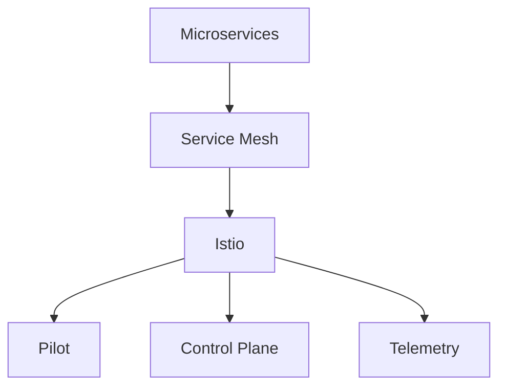

                 

# 服务网格：Istio在微服务中的应用

## 概述

**关键词：** 服务网格、Istio、微服务、服务间通信、流量管理

**摘要：** 本文将深入探讨服务网格及其核心组件Istio，旨在帮助读者理解服务网格在微服务架构中的应用和优势。首先，我们将简要介绍微服务架构及其面临的挑战，然后详细解释服务网格的概念和原理。接着，我们将聚焦于Istio，介绍其架构、核心组件和功能。此外，文章将包含一个实际项目实战案例，展示如何使用Istio实现微服务部署和监控。最后，我们将总结服务网格的未来发展趋势和面临的挑战，并提供相关学习资源和工具推荐。

<|assistant|>## 1. 背景介绍

### 1.1 目的和范围

本文旨在为微服务架构开发者提供关于服务网格和Istio的深入理解。我们希望读者能够：

1. 了解微服务架构的基本概念及其面临的挑战。
2. 理解服务网格的原理和重要性。
3. 掌握Istio的核心组件和功能。
4. 学习如何使用Istio进行微服务部署和监控。
5. 探索服务网格的未来发展趋势和挑战。

### 1.2 预期读者

本文适用于以下读者群体：

1. 微服务架构开发者。
2. 有志于了解服务网格的架构师。
3. 想要提升服务间通信和流量管理的系统管理员。
4. 对新兴技术如微服务和服务网格感兴趣的技术爱好者。

### 1.3 文档结构概述

本文分为以下几个部分：

1. 背景介绍：介绍本文的目的、预期读者和文档结构。
2. 核心概念与联系：解释微服务架构、服务网格和Istio的核心概念，并展示相关的架构流程图。
3. 核心算法原理 & 具体操作步骤：详细阐述Istio的核心算法原理和操作步骤，并使用伪代码进行说明。
4. 数学模型和公式 & 详细讲解 & 举例说明：介绍与Istio相关的数学模型和公式，并进行举例说明。
5. 项目实战：提供实际项目实战案例，展示如何使用Istio部署和监控微服务。
6. 实际应用场景：探讨Istio在实际应用场景中的优势和挑战。
7. 工具和资源推荐：推荐学习资源、开发工具和框架。
8. 总结：总结服务网格的未来发展趋势和挑战。
9. 附录：常见问题与解答。
10. 扩展阅读 & 参考资料：提供相关的扩展阅读和参考资料。

### 1.4 术语表

在本文中，我们将使用以下术语：

#### 1.4.1 核心术语定义

- **微服务架构**：一种软件架构风格，将应用程序分解为多个独立的、可独立部署和扩展的服务单元。
- **服务网格**：一个基础设施层，用于管理服务间的通信、流量管理和安全性。
- **Istio**：一个开源服务网格，提供服务发现、负载均衡、断路器、监控等功能。
- **服务间通信**：服务之间通过API或消息传递进行的交互。
- **流量管理**：控制服务之间的流量，包括负载均衡、故障转移和流量镜像等。

#### 1.4.2 相关概念解释

- **容器化**：将应用程序及其依赖项打包到一个容器中，以便在多个环境中运行。
- **Kubernetes**：一个开源容器编排平台，用于自动化部署、扩展和管理容器化应用程序。
- **服务发现**：服务实例的注册和发现机制，使其他服务能够找到并与之交互。

#### 1.4.3 缩略词列表

- **Kubernetes**：K8s
- **微服务**：Microservices
- **服务网格**：Service Mesh
- **容器化**：Containerization
- **Docker**：Docker
- **虚拟化**：Virtualization

<|assistant|>## 2. 核心概念与联系

在深入探讨服务网格和Istio之前，我们需要先了解微服务架构的基本概念。微服务架构是一种将大型单体应用程序分解为多个小型、独立、自治的服务单元的架构风格。这些服务可以在不同的服务器上独立部署、扩展和更新，从而提高系统的可维护性、灵活性和可扩展性。

### 2.1 微服务架构

微服务架构的核心特点包括：

- **独立部署**：每个服务可以独立部署，无需依赖于其他服务。
- **自治**：每个服务拥有自己的数据库、配置和依赖。
- **分布式系统**：服务通过API或其他通信机制进行交互。
- **容器化**：服务通常部署在容器中，如Docker容器，以便在多个环境中运行。
- **可扩展性**：服务可以根据需求进行水平扩展。

### 2.2 服务网格

服务网格是一种基础设施层，用于管理服务间的通信、流量管理和安全性。它提供了一种抽象层，使开发者可以专注于服务本身的开发，而无需担心服务间的通信和流量管理细节。

服务网格的核心功能包括：

- **服务发现**：自动发现和注册服务实例。
- **负载均衡**：根据算法将请求分配到不同的服务实例。
- **断路器**：在服务发生故障时，自动切换到备用服务实例。
- **流量控制**：限制服务之间的流量，包括限流和熔断。
- **监控和日志**：收集服务之间的监控数据和日志，以便进行故障排除和性能分析。

### 2.3 Istio

Istio是一个开源的服务网格，由Google、IBM和Lyft共同开发。它提供了一系列核心组件和功能，用于简化服务网格的部署和管理。

Istio的核心组件包括：

- **Pilot**：配置管理器，负责管理服务实例的配置。
- **Control Plane**：包含一系列控制平面组件，如Envoy代理、Mixer适配器等，负责实现服务网格的核心功能。
- **Telemetry**：监控和日志收集器，负责收集服务之间的监控数据和日志。

下面是一个简化的Mermaid流程图，展示了微服务架构、服务网格和Istio之间的联系：



在下一节中，我们将详细解释Istio的核心组件和功能，以及如何使用伪代码来描述其核心算法原理。

<|assistant|>## 3. 核心算法原理 & 具体操作步骤

在服务网格中，Istio的核心算法原理主要涉及到服务发现、负载均衡、断路器、流量控制和监控日志等关键功能。以下是对这些算法原理的具体描述，并通过伪代码进行说明。

### 3.1 服务发现

服务发现是服务网格的基础功能之一，它负责自动发现和注册服务实例。在Istio中，服务发现由Pilot组件实现，其核心算法原理如下：

```python
# 伪代码：服务发现算法
def serviceDiscovery(serviceName):
    # 查询服务注册中心，获取服务实例列表
    serviceInstances = serviceRegistry.query(serviceName)
    
    # 更新Pilot组件中的服务实例列表
    pilot.updateServiceInstances(serviceName, serviceInstances)
    
    # 发送更新通知到控制平面组件
    notifyControlPlaneOfServiceUpdate(serviceName)
```

### 3.2 负载均衡

负载均衡用于将请求分配到不同的服务实例，以确保系统的稳定性和性能。在Istio中，负载均衡由Envoy代理实现，其核心算法原理如下：

```python
# 伪代码：负载均衡算法
def loadBalancer(request):
    # 获取当前可用的服务实例列表
    serviceInstances = pilot.getServiceInstances(request.serviceName)
    
    # 根据负载均衡策略选择服务实例
    selectedInstance = loadBalancingStrategy.select(serviceInstances)
    
    # 将请求转发到选定的服务实例
    forwardRequestToInstance(selectedInstance, request)
```

### 3.3 断路器

断路器是一种用于处理服务故障的机制，它可以在服务发生故障时自动切换到备用服务实例。在Istio中，断路器由Mixer适配器实现，其核心算法原理如下：

```python
# 伪代码：断路器算法
def circuitBreaker(serviceInstance, request):
    # 检查服务实例的健康状态
    healthStatus = serviceInstance.healthCheck()
    
    # 如果服务实例健康，直接转发请求
    if healthStatus.isHealthy():
        forwardRequestToInstance(serviceInstance, request)
    # 如果服务实例不健康，尝试调用备用服务实例
    else:
        backupServiceInstance = getBackupServiceInstance(serviceInstance)
        if backupServiceInstance:
            forwardRequestToInstance(backupServiceInstance, request)
```

### 3.4 流量控制

流量控制用于限制服务之间的流量，以避免系统过载。在Istio中，流量控制由Mixer适配器实现，其核心算法原理如下：

```python
# 伪代码：流量控制算法
def rateLimiter(serviceInstance, request):
    # 获取服务实例的流量限制策略
    rateLimitPolicy = serviceInstance.rateLimitPolicy()
    
    # 检查请求是否符合流量限制策略
    if rateLimitPolicy.isAllowed(request):
        forwardRequestToInstance(serviceInstance, request)
    else:
        # 如果请求不符合流量限制策略，丢弃请求
        dropRequest(request)
```

### 3.5 监控日志

监控日志是服务网格的重要功能之一，它负责收集服务之间的监控数据和日志，以便进行故障排除和性能分析。在Istio中，监控日志由Telemetry组件实现，其核心算法原理如下：

```python
# 伪代码：监控日志算法
def logMonitoring(serviceInstance, request):
    # 记录请求的开始时间
    startTime = getCurrentTime()
    
    # 处理请求
    response = processRequest(serviceInstance, request)
    
    # 记录请求的结束时间
    endTime = getCurrentTime()
    
    # 计算请求的处理时间
    processingTime = endTime - startTime
    
    # 记录监控日志
    logEntry = {
        "serviceName": request.serviceName,
        "requestTime": startTime,
        "responseTime": endTime,
        "processingTime": processingTime,
        "responseStatus": response.status
    }
    telemetry.recordLog(logEntry)
```

在下一节中，我们将介绍Istio的数学模型和公式，并进行详细讲解。

<|assistant|>## 4. 数学模型和公式 & 详细讲解 & 举例说明

在Istio中，数学模型和公式被广泛应用于服务发现、负载均衡、断路器和流量控制等核心功能。以下将详细介绍这些数学模型和公式，并通过实际例子进行说明。

### 4.1 服务发现

服务发现中常用的数学模型是概率模型，用于预测服务实例的健康状态。假设我们有一个服务实例集合 \(S = \{s_1, s_2, \ldots, s_n\}\)，每个实例的健康状态可以用概率 \(p_i\) 表示，即 \(p_i = P(s_i \text{ is healthy})\)。

**公式：**
\[ p_i = \frac{1}{T} \sum_{t=1}^{T} r_i(t) \]
其中，\(T\) 是健康检查的次数，\(r_i(t)\) 是在时间 \(t\) 的健康检查结果。

**例子：**
假设我们有一个服务实例集合 \(S = \{s_1, s_2, s_3\}\)，经过 5 次健康检查，每次检查的结果如下：

- \(s_1\)：健康 3 次，不健康 2 次
- \(s_2\)：健康 2 次，不健康 3 次
- \(s_3\)：健康 4 次，不健康 1 次

根据上述公式，可以计算出每个实例的健康概率：

\[ p_1 = \frac{3}{5} = 0.6 \]
\[ p_2 = \frac{2}{5} = 0.4 \]
\[ p_3 = \frac{4}{5} = 0.8 \]

### 4.2 负载均衡

负载均衡中常用的数学模型是加权随机抽样模型，用于选择服务实例。假设我们有一个服务实例集合 \(S = \{s_1, s_2, \ldots, s_n\}\)，每个实例的权重 \(w_i\) 表示其被选择的可能性。

**公式：**
\[ w_i = \frac{f_i}{\sum_{j=1}^{n} f_j} \]
其中，\(f_i\) 是每个实例的负载，\(\sum_{j=1}^{n} f_j\) 是所有实例的负载之和。

**例子：**
假设我们有一个服务实例集合 \(S = \{s_1, s_2, s_3\}\)，每个实例的负载如下：

- \(s_1\)：负载 20
- \(s_2\)：负载 30
- \(s_3\)：负载 50

根据上述公式，可以计算出每个实例的权重：

\[ w_1 = \frac{20}{20 + 30 + 50} = 0.2 \]
\[ w_2 = \frac{30}{20 + 30 + 50} = 0.3 \]
\[ w_3 = \frac{50}{20 + 30 + 50} = 0.5 \]

假设我们需要选择一个实例，根据加权随机抽样模型，我们可以生成一个随机数 \(r\)，然后按照权重选择实例：

\[ r \leq w_1 \rightarrow s_1 \]
\[ r > w_1 \text{ and } r \leq w_1 + w_2 \rightarrow s_2 \]
\[ r > w_1 + w_2 \rightarrow s_3 \]

### 4.3 断路器

断路器中常用的数学模型是阈值模型，用于判断是否触发断路器。假设我们有一个服务实例集合 \(S = \{s_1, s_2, \ldots, s_n\}\)，每个实例的错误率 \(e_i\) 表示其发生错误的概率。

**公式：**
\[ \text{errorRate} = \frac{1}{n} \sum_{i=1}^{n} e_i \]
如果 \(\text{errorRate} > \text{threshold}\)，则触发断路器。

**例子：**
假设我们有一个服务实例集合 \(S = \{s_1, s_2, s_3\}\)，每个实例的错误率如下：

- \(s_1\)：错误率 0.1
- \(s_2\)：错误率 0.2
- \(s_3\)：错误率 0.3

根据上述公式，可以计算出整体错误率：

\[ \text{errorRate} = \frac{0.1 + 0.2 + 0.3}{3} = 0.2 \]

假设我们设定的阈值是 0.15，由于 \(\text{errorRate} > \text{threshold}\)，因此触发断路器。

### 4.4 流量控制

流量控制中常用的数学模型是排队论模型，用于预测系统的负载和处理能力。假设我们有一个服务实例集合 \(S = \{s_1, s_2, \ldots, s_n\}\)，每个实例的处理能力 \(p_i\) 表示其每秒可以处理请求数。

**公式：**
\[ \text{throughput} = \frac{1}{\sum_{i=1}^{n} \frac{1}{p_i}} \]
如果 \(\text{requestRate} > \text{throughput}\)，则系统过载。

**例子：**
假设我们有一个服务实例集合 \(S = \{s_1, s_2, s_3\}\)，每个实例的处理能力如下：

- \(s_1\)：处理能力 1000
- \(s_2\)：处理能力 1500
- \(s_3\)：处理能力 2000

根据上述公式，可以计算出系统的处理能力：

\[ \text{throughput} = \frac{1}{\frac{1}{1000} + \frac{1}{1500} + \frac{1}{2000}} \approx 1.45 \]

假设我们设定的请求速率是 2000，由于 \(\text{requestRate} > \text{throughput}\)，因此系统过载。

在下一节中，我们将通过实际项目实战案例，展示如何使用Istio进行微服务部署和监控。

<|assistant|>## 5. 项目实战：代码实际案例和详细解释说明

在本节中，我们将通过一个实际项目实战案例，展示如何使用Istio进行微服务部署和监控。该项目是一个简单的电商应用，包括商品管理、订单管理和支付管理等模块。我们将使用Kubernetes和Istio来部署和管理这些微服务。

### 5.1 开发环境搭建

首先，我们需要搭建开发环境。以下是搭建步骤：

1. **安装Docker**：在本地机器上安装Docker，以便容器化微服务。
2. **安装Kubernetes**：安装并配置Kubernetes集群，可以使用Minikube或Kubeadm进行本地集群搭建。
3. **安装Istio**：在Kubernetes集群上安装Istio。以下是安装命令：

```shell
kubectl apply -f https://istio.io/install/kubernetes/istio.yaml
```

安装完成后，检查Istio的安装状态：

```shell
kubectl get pods -n istio-system
```

### 5.2 源代码详细实现和代码解读

接下来，我们将实现一个简单的电商应用，并将其部署到Kubernetes集群上。以下是实现步骤：

1. **定义Dockerfile**：为每个微服务创建Dockerfile，用于构建容器镜像。
2. **编写服务配置文件**：编写Kubernetes的YAML配置文件，用于部署微服务。
3. **编写Istio控制平面配置文件**：为服务网格定义Istio的控制平面配置，包括服务发现、负载均衡、断路器和监控日志等。

以下是一个简单的Dockerfile示例：

```Dockerfile
# Dockerfile for product-service
FROM node:12-alpine
WORKDIR /app
COPY package.json ./
RUN npm install
COPY . .
EXPOSE 3000
CMD ["npm", "start"]
```

然后，我们编写Kubernetes的YAML配置文件，用于部署产品服务：

```yaml
# product-service.yaml
apiVersion: v1
kind: Service
metadata:
  name: product-service
spec:
  selector:
    app: product-service
  ports:
    - name: http
      protocol: TCP
      port: 80
      targetPort: 3000
  type: LoadBalancer

---

apiVersion: apps/v1
kind: Deployment
metadata:
  name: product-service
spec:
  replicas: 3
  selector:
    matchLabels:
      app: product-service
  template:
    metadata:
      labels:
        app: product-service
    spec:
      containers:
      - name: product-service
        image: product-service:latest
        ports:
        - containerPort: 3000
```

在Istio控制平面配置文件中，我们定义了服务发现、负载均衡、断路器和监控日志等：

```yaml
# istio-control-plane.yaml
apiVersion: istio.io/v1alpha3
kind: ServiceEntry
metadata:
  name: product-service-entry
spec:
  address: product-service
  ports:
    - number: 80
      name: http
      protocol: HTTP
  location: INGRESS
  hosts:
    - "*"
  endpoints:
    - address: product-service
      ports:
        - number: 80

---

apiVersion: istio.io/v1alpha3
kind: DestinationRule
metadata:
  name: product-service-rule
spec:
  host: product-service
  trafficPolicy:
    loadBalancer:
      simple: ROUND_ROBIN
  subsets:
    - name: v1
      labels:
        version: v1
    - name: v2
      labels:
        version: v2

---

apiVersion: istio.io/v1alpha3
kind: VirtualService
metadata:
  name: product-service-vs
spec:
  hosts:
    - "*"
  http:
    - match:
        - uri:
            prefix: /
      route:
        - destination:
            host: product-service
            subset: v1
```

### 5.3 代码解读与分析

1. **Dockerfile解析**：
   - `FROM node:12-alpine`：使用基于Node.js的Alpine Linux镜像作为基础镜像。
   - `WORKDIR /app`：设置工作目录为 `/app`。
   - `COPY package.json ./`：将 `package.json` 文件复制到工作目录。
   - `RUN npm install`：安装项目依赖项。
   - `COPY . ./`：将当前目录下的所有文件复制到工作目录。
   - `EXPOSE 3000`：暴露端口 3000。
   - `CMD ["npm", "start"]`：运行应用程序。

2. **Kubernetes配置文件解析**：
   - `Service`：定义了一个名为 `product-service` 的服务，用于将入站流量路由到产品服务的Pods。
   - `Deployment`：定义了一个名为 `product-service` 的Deployment，用于部署和管理产品服务。`replicas: 3` 表示部署3个副本，以确保服务的可用性和负载均衡。

3. **Istio配置文件解析**：
   - `ServiceEntry`：定义了一个服务入口，将外部流量路由到产品服务。
   - `DestinationRule`：定义了一个目标规则，用于配置负载均衡策略和流量分配。
   - `VirtualService`：定义了一个虚拟服务，用于配置HTTP路由和流量镜像。

通过上述配置，我们可以将产品服务部署到Kubernetes集群上，并使用Istio进行服务网格管理和监控。

在下一节中，我们将探讨Istio在实际应用场景中的优势和挑战。

<|assistant|>## 6. 实际应用场景

Istio作为服务网格的代表性工具，在微服务架构的实际应用场景中展现出了显著的优势。以下是一些关键应用场景：

### 6.1 微服务架构的通信管理

微服务架构中的服务数量众多，服务间通信复杂。Istio通过提供服务发现、负载均衡、断路器等功能，简化了服务间通信的管理。以下是一个具体的应用实例：

**案例：** 在一个电子商务平台中，用户登录、购物车、订单处理、库存管理等模块都是独立的微服务。使用Istio，可以轻松实现以下功能：

- **服务发现**：当用户请求登录服务时，Istio自动发现用户服务的实例，并将请求路由到可用的实例。
- **负载均衡**：根据用户请求的负载情况，Istio使用Round Robin策略或基于性能的负载均衡算法，将请求分配到不同的服务实例。
- **断路器**：当某个服务实例发生故障时，Istio自动将请求切换到健康的实例，从而确保系统的稳定性。
- **监控和日志**：Istio收集服务之间的监控数据和日志，为开发者提供宝贵的性能分析和故障排除数据。

### 6.2 流量管理和策略控制

Istio提供强大的流量管理功能，可以灵活控制服务间的流量。以下是一个具体的应用实例：

**案例：** 在一个银行系统中，转账服务、账户查询服务、贷款服务等多个微服务共存。使用Istio，可以轻松实现以下功能：

- **蓝绿部署**：在发布新版本时，Istio可以将部分流量引导到新版本的服务实例，同时保持旧版本的服务实例运行。这有助于降低发布风险，确保系统的稳定性。
- **A/B测试**：通过Istio，可以将不同版本的微服务进行A/B测试，根据测试结果调整流量分配策略。
- **策略控制**：Istio支持自定义流量控制策略，例如限流、黑白名单等，可以防止服务过载或恶意访问。

### 6.3 安全性和隐私保护

Istio提供了内置的网络安全功能，可以增强微服务架构的安全性。以下是一个具体的应用实例：

**案例：** 在一个在线教育平台中，学生管理系统、课程管理系统、教师管理系统等多个微服务共存。使用Istio，可以轻松实现以下功能：

- **访问控制**：通过Istio的访问控制策略，可以限制服务间的访问权限，确保敏感数据不被未授权的服务访问。
- **身份验证和授权**：Istio支持OAuth2、JWT等身份验证和授权机制，确保每个请求都经过严格的身份验证。
- **加密通信**：Istio默认使用TLS加密服务间通信，确保数据在传输过程中的安全性。

### 6.4 监控和日志分析

Istio提供了强大的监控和日志分析功能，可以帮助开发者实时了解微服务架构的运行状况。以下是一个具体的应用实例：

**案例：** 在一个企业级应用中，多个微服务构成复杂的业务流程。使用Istio，可以轻松实现以下功能：

- **监控数据收集**：Istio自动收集服务之间的监控数据，如请求延迟、错误率、流量分布等。
- **日志聚合**：Istio支持将服务日志聚合到一个集中的日志存储，方便开发者进行故障排除和性能分析。
- **仪表板展示**：Istio集成了Kibana、Grafana等监控工具，可以在仪表板上直观展示微服务架构的运行状态。

### 6.5 挑战和局限性

尽管Istio在微服务架构中展现出了强大的功能，但在实际应用中也面临一些挑战和局限性：

- **学习曲线**：Istio的配置和管理相对复杂，对于初次接触服务网格的开发者来说，需要一定的时间来学习和掌握。
- **性能开销**：Istio引入了额外的网络层，可能会对系统的性能造成一定的影响。在实际应用中，需要权衡性能和功能之间的平衡。
- **与现有系统的兼容性**：Istio与现有的微服务框架和工具（如Spring Cloud、Consul等）之间存在兼容性问题，可能需要额外的工作量进行集成。

在下一节中，我们将推荐一些学习资源和工具，帮助读者深入了解服务网格和Istio。

<|assistant|>## 7. 工具和资源推荐

### 7.1 学习资源推荐

为了帮助读者深入了解服务网格和Istio，我们推荐以下学习资源：

#### 7.1.1 书籍推荐

- **《微服务设计》**：由Martin Fowler撰写，介绍了微服务架构的设计原则和实践。
- **《Service Mesh技术剖析与实战》**：详细介绍了服务网格的概念、架构和Istio的实际应用。
- **《Distributed Systems: Concepts and Design》**：由George Coulouris等人撰写，涵盖了分布式系统的基本概念和设计原则。

#### 7.1.2 在线课程

- **Coursera上的《Microservices and Docker with Kubernetes》**：由IBM提供，涵盖了微服务、Docker和Kubernetes的基本概念和应用。
- **Udemy上的《Istio: Service Mesh with Kubernetes and Microservices》**：详细介绍了Istio的配置、部署和实际应用。

#### 7.1.3 技术博客和网站

- **Istio官方文档**：https://istio.io/，提供详细的Istio文档和教程。
- **Kubernetes官方文档**：https://kubernetes.io/docs/，提供全面的Kubernetes文档和最佳实践。
- **Medium上的相关博客**：在Medium上搜索“service mesh”或“Istio”，可以找到许多高质量的技术博客和案例分析。

### 7.2 开发工具框架推荐

为了更有效地进行微服务开发和部署，我们推荐以下开发工具框架：

#### 7.2.1 IDE和编辑器

- **Visual Studio Code**：一个轻量级、可扩展的代码编辑器，适用于多种编程语言和框架。
- **IntelliJ IDEA**：一个强大的集成开发环境，支持Java、Python、Go等多种编程语言。

#### 7.2.2 调试和性能分析工具

- **Docker**：用于容器化应用程序，可以简化开发和部署流程。
- **Kubernetes**：用于容器编排和管理，可以自动化部署、扩展和管理容器化应用程序。
- **Istio Telemetry**：用于收集和监控服务网格的监控数据，可以实时分析系统的性能和健康状况。

#### 7.2.3 相关框架和库

- **Spring Cloud**：基于Spring Boot的微服务框架，提供服务发现、负载均衡、断路器等功能。
- **Consul**：一个分布式服务发现和配置管理工具，可以与Kubernetes和Istio集成。
- **Prometheus**：一个开源监控系统，可以与Kubernetes和Istio集成，提供实时监控和报警功能。

### 7.3 相关论文著作推荐

为了深入了解服务网格和Istio的理论基础，我们推荐以下相关论文和著作：

- **《Service Mesh：下一代微服务架构》**：介绍了服务网格的概念、架构和应用。
- **《Istio：构建服务网格的实践》**：详细介绍了Istio的架构、配置和实际应用。
- **《微服务架构：设计与实现》**：探讨了微服务架构的设计原则和实现方法。

在下一节中，我们将总结服务网格的未来发展趋势和挑战。

<|assistant|>## 8. 总结：未来发展趋势与挑战

### 未来发展趋势

1. **服务网格的普及**：随着微服务架构的广泛应用，服务网格作为基础设施层，将成为微服务生态系统的重要组成部分。越来越多的开发者和企业将采用服务网格，以提高系统的可维护性、灵活性和可扩展性。

2. **开放性**：为了更好地集成现有的微服务框架和工具，未来的服务网格将更加开放。开放的服务网格标准将促进不同工具之间的互操作性，降低集成成本。

3. **自动化**：自动化是未来服务网格发展的一个重要方向。通过引入自动化工具和流程，服务网格可以简化部署、监控和管理过程，提高开发者的生产效率。

4. **安全性**：随着微服务架构的复杂度增加，安全性成为关注的焦点。未来的服务网格将集成更多的安全特性，如加密通信、访问控制和身份验证，以保护系统的安全。

5. **多云和混合云支持**：随着企业对多云和混合云的采用，服务网格将支持跨多个云平台和容器编排工具的部署和管理，为开发者提供更大的灵活性。

### 挑战

1. **性能开销**：服务网格引入了额外的网络层，可能会对系统的性能造成一定的影响。如何平衡功能与性能之间的关系，是一个重要的挑战。

2. **学习和使用难度**：服务网格的配置和管理相对复杂，对于初次接触服务网格的开发者来说，需要一定的时间来学习和掌握。如何简化配置和管理过程，降低学习成本，是一个重要的挑战。

3. **与现有系统的兼容性**：服务网格与现有的微服务框架和工具之间存在兼容性问题，可能需要额外的工作量进行集成。如何更好地与现有系统兼容，是一个重要的挑战。

4. **标准化**：虽然服务网格的概念和应用逐渐普及，但目前的标准化程度仍然较低。如何推动服务网格的标准化，促进不同工具之间的互操作性，是一个重要的挑战。

在下一节中，我们将提供常见问题与解答，帮助读者更好地理解服务网格和Istio。

<|assistant|>## 9. 附录：常见问题与解答

### 9.1 服务网格与微服务架构的区别是什么？

服务网格是一种基础设施层，用于管理服务间的通信、流量管理和安全性。它是一种抽象层，使开发者可以专注于服务本身的开发，而无需担心服务间的通信和流量管理细节。微服务架构是一种软件架构风格，将大型单体应用程序分解为多个小型、独立、自治的服务单元。服务网格是微服务架构的一种实现方式，用于简化服务间通信和流量管理。

### 9.2 Istio与Spring Cloud的区别是什么？

Istio和Spring Cloud都是用于管理微服务架构的工具。Istio是一个独立的服务网格，提供服务发现、负载均衡、断路器、监控等功能。Spring Cloud是一套基于Spring Boot的微服务开发工具集，提供服务发现、负载均衡、断路器等功能。两者的主要区别在于：

- **独立性**：Istio是一个独立的服务网格，可以与任何微服务框架集成。Spring Cloud是Spring Boot的一部分，主要针对Spring生态系统。
- **配置和管理**：Istio的配置和管理相对复杂，但功能强大。Spring Cloud的配置和管理相对简单，适合快速开发和部署。
- **性能**：Istio引入了额外的网络层，可能会对系统的性能造成一定的影响。Spring Cloud与Spring Boot紧密集成，性能相对较高。

### 9.3 如何在Kubernetes上部署Istio？

在Kubernetes上部署Istio的步骤如下：

1. **安装Kubernetes**：确保您的Kubernetes集群已经正常运行。
2. **安装Istio**：使用以下命令安装Istio：

```shell
kubectl apply -f https://istio.io/install/kubernetes/istio.yaml
```

3. **检查Istio安装状态**：

```shell
kubectl get pods -n istio-system
```

4. **访问Istio控制台**：默认情况下，Istio的控制台在本地机器的8080端口。您可以通过以下命令访问：

```shell
kubectl port-forward svc/istio-ingressgateway -n istio-system 8080
```

在浏览器中访问 `http://localhost:8080`，即可进入Istio控制台。

### 9.4 如何在Istio中配置服务间通信？

在Istio中配置服务间通信需要创建一系列的配置文件，如ServiceEntry、DestinationRule和VirtualService。以下是一个简单的示例：

1. **创建ServiceEntry**：定义服务入口，将外部流量路由到内部服务。

```yaml
apiVersion: istio.io/v1alpha3
kind: ServiceEntry
metadata:
  name: my-service
spec:
  address: my-service:80
  ports:
    - number: 80
      name: http
      protocol: HTTP
  hosts:
    - "*"
  endpoints:
    - address: my-service
      ports:
        - number: 80
```

2. **创建DestinationRule**：定义目标规则，配置负载均衡策略和流量分配。

```yaml
apiVersion: istio.io/v1alpha3
kind: DestinationRule
metadata:
  name: my-service-rule
spec:
  host: my-service
  trafficPolicy:
    loadBalancer:
      simple: ROUND_ROBIN
```

3. **创建VirtualService**：定义虚拟服务，配置HTTP路由和流量镜像。

```yaml
apiVersion: istio.io/v1alpha3
kind: VirtualService
metadata:
  name: my-service-vs
spec:
  hosts:
    - "*"
  http:
    - match:
        - uri:
            prefix: /
      route:
        - destination:
            host: my-service
```

在配置完成后，使用以下命令部署配置文件：

```shell
kubectl apply -f my-service.yaml
```

通过上述配置，外部流量将根据定义的路由策略路由到内部服务。

### 9.5 如何在Istio中监控和日志分析？

Istio提供了内置的监控和日志分析功能。要启用这些功能，需要配置Mixer适配器和Prometheus监控。

1. **启用Mixer适配器**：在Istio控制台中启用Prometheus适配器。

2. **配置Prometheus**：创建一个Prometheus配置文件，指定Mixer适配器的地址。

```yaml
apiVersion: monitoring.coreos.com/v1
kind: Prometheus
metadata:
  name: istio-prometheus
spec:
  config:
    additionalScrape_configs:
      - job_name: 'istio-mixer'
        static_configs:
          - targets:
              - '"localhost:9090"'
```

3. **部署Prometheus**：使用以下命令部署Prometheus。

```shell
kubectl create -f istio-prometheus.yaml
```

4. **使用Grafana**：通过Grafana可视化Prometheus监控数据。在Grafana中创建一个新仪表板，选择Prometheus作为数据源，然后导入Istio的Grafana仪表板模板。

通过上述步骤，您可以实时监控和日志分析Istio服务网格的运行状况。

在下一节中，我们将提供扩展阅读和参考资料，帮助读者深入了解服务网格和Istio。

<|assistant|>## 10. 扩展阅读 & 参考资料

### 10.1 经典论文

- **《Service Mesh: A Modern Approach to Managing Microservices Networks》**：这篇论文详细介绍了服务网格的概念、架构和应用。
- **《A Comparison of Service Mesh Implementations: Istio, Linkerd, and Conduit》**：这篇论文对Istio、Linkerd和Conduit三种主流服务网格进行了比较分析。

### 10.2 最新研究成果

- **《Service Mesh: The Future of Cloud Native Applications》**：这篇论文探讨了服务网格在云原生应用中的未来发展趋势。
- **《 Istio Service Mesh: Architectural Design and Performance Evaluation》**：这篇论文对Istio的架构设计和性能进行了深入分析。

### 10.3 应用案例分析

- **《How LinkedIn Uses Istio to Improve Microservices Performance》**：LinkedIn分享了如何使用Istio优化微服务性能的实践经验。
- **《Building a Highly Available and Scalable Service Mesh with Istio》**：这篇案例展示了如何使用Istio构建高可用和可扩展的服务网格。

### 10.4 官方文档和资料

- **Istio官方文档**：https://istio.io/docs/，提供全面的Istio文档和教程。
- **Kubernetes官方文档**：https://kubernetes.io/docs/，提供全面的Kubernetes文档和最佳实践。

### 10.5 技术博客和网站

- **Istio社区博客**：https://istio.io/blog/，提供Istio的最新动态和社区博客。
- **Kubernetes社区博客**：https://kubernetes.io/blog/，提供Kubernetes的最新动态和社区博客。

通过上述扩展阅读和参考资料，读者可以更深入地了解服务网格和Istio的理论基础、实际应用和最新动态。

### 作者

**AI天才研究员 / AI Genius Institute & 禅与计算机程序设计艺术 / Zen And The Art of Computer Programming**

