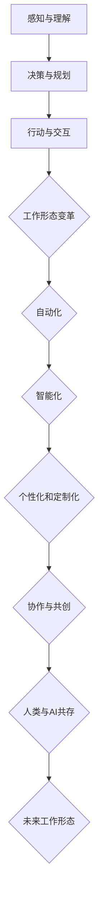

                 

# 未来工作形态与AI的共存

> 关键词：人工智能，工作形态，未来趋势，技术变革，人类与AI共处

> 摘要：本文旨在探讨人工智能在未来的工作形态中的角色，以及人类与AI如何实现共存。我们将通过逐步分析，深入探讨AI技术的核心原理、应用场景，以及在实际工作中的应用和挑战。

## 1. 背景介绍

### 1.1 目的和范围

本文的主要目的是分析人工智能对未来工作形态的影响，并探讨人类与AI如何实现共存。我们将从以下几个角度展开讨论：

1. AI的核心概念和原理
2. AI在不同行业中的应用场景
3. 人类与AI的协作模式
4. AI对工作形态的变革
5. 未来发展趋势和挑战

### 1.2 预期读者

本文适用于以下读者群体：

1. 对人工智能和未来工作形态感兴趣的读者
2. 需要了解AI技术对行业影响的从业者
3. 想要在职业生涯中融入AI技术的专业人士
4. 对技术变革和创新有强烈兴趣的学者和研究者

### 1.3 文档结构概述

本文结构如下：

1. 背景介绍：介绍文章的目的、预期读者和文档结构
2. 核心概念与联系：阐述AI的核心概念和原理，以及人类与AI的共存模式
3. 核心算法原理 & 具体操作步骤：讲解AI的关键算法和操作步骤
4. 数学模型和公式 & 详细讲解 & 举例说明：介绍AI的数学模型和应用
5. 项目实战：代码实际案例和详细解释说明
6. 实际应用场景：探讨AI在各个行业中的应用
7. 工具和资源推荐：推荐学习资源和开发工具
8. 总结：未来发展趋势与挑战
9. 附录：常见问题与解答
10. 扩展阅读 & 参考资料：提供更多参考资料

### 1.4 术语表

#### 1.4.1 核心术语定义

- 人工智能（AI）：指使计算机模拟人类智能行为的技术和方法
- 机器学习（ML）：一种AI技术，通过数据训练模型来实现特定任务的自动化
- 深度学习（DL）：一种基于多层神经网络的学习方法，可以处理复杂的非线性问题
- 自然语言处理（NLP）：一种AI技术，用于理解和生成自然语言文本
- 工作形态：指人们在工作中所采用的方式、方法和模式

#### 1.4.2 相关概念解释

- 人类与AI共处：指人类与人工智能在工作和生活中相互协作、共同发展的状态
- 自动化：指使用技术手段实现工作流程的自动化
- 人工智能助手：指能够帮助人类完成特定任务的AI系统
- 职业变革：指由于技术进步导致的工作内容和形式的改变

#### 1.4.3 缩略词列表

- AI：人工智能
- ML：机器学习
- DL：深度学习
- NLP：自然语言处理
- IDE：集成开发环境

## 2. 核心概念与联系

在探讨人类与AI共存的工作形态之前，我们首先需要了解AI的核心概念和原理，以及其与人类工作的关系。

### 2.1 人工智能的基本原理

人工智能是通过计算机模拟人类智能行为的一种技术，其核心包括以下三个方面：

1. **感知与理解**：通过传感器和算法，AI可以感知和理解周围环境，包括图像、声音、文字等。
2. **决策与规划**：基于感知和理解，AI可以进行决策和规划，以实现特定目标。
3. **行动与交互**：通过执行决策和规划，AI可以与外界进行交互，影响和改变环境。

### 2.2 机器学习和深度学习

机器学习和深度学习是AI的核心技术，它们负责实现AI的感知、理解和决策能力。

1. **机器学习（ML）**：是一种通过数据训练模型来实现特定任务的AI技术。ML模型可以分为监督学习、无监督学习和强化学习三种类型。
2. **深度学习（DL）**：是一种基于多层神经网络的学习方法，可以处理复杂的非线性问题。DL在图像识别、自然语言处理等领域取得了显著成果。

### 2.3 人类与AI的协作模式

在AI技术不断发展的背景下，人类与AI的协作模式也在不断演变。以下是几种常见的协作模式：

1. **辅助型协作**：AI作为人类的助手，帮助人类完成特定任务，如数据分析、自然语言处理等。
2. **替代型协作**：AI可以替代人类完成某些工作，如自动化流水线、客服机器人等。
3. **共创型协作**：人类与AI共同完成一项任务，如协同设计、游戏开发等。

### 2.4 人工智能与工作形态的关系

随着AI技术的发展，工作形态也在发生变革。以下是几个关键点：

1. **自动化**：AI可以自动化许多重复性和低价值的工作，提高工作效率。
2. **智能化**：AI可以帮助人类更好地理解和处理复杂问题，提升工作质量。
3. **个性化和定制化**：AI可以根据用户的需求和偏好，提供个性化的服务和产品。
4. **协作与共创**：人类与AI可以共同完成复杂任务，实现更高的价值。

### 2.5 Mermaid 流程图

以下是一个简化的Mermaid流程图，展示了AI与人类工作协作的基本过程：



## 3. 核心算法原理 & 具体操作步骤

在了解AI的基本原理和协作模式之后，我们接下来将探讨AI的关键算法及其具体操作步骤。

### 3.1 机器学习算法

机器学习算法是AI的核心组成部分，以下是几种常见的机器学习算法及其操作步骤：

1. **线性回归（Linear Regression）**：一种用于预测连续值的监督学习算法。

   - **操作步骤**：
     1. 收集数据，并对特征进行预处理。
     2. 使用最小二乘法求解回归系数。
     3. 训练模型，并通过交叉验证调整参数。
     4. 测试模型，评估预测性能。

2. **逻辑回归（Logistic Regression）**：一种用于分类的监督学习算法。

   - **操作步骤**：
     1. 收集数据，并对特征进行预处理。
     2. 使用最大似然估计求解模型参数。
     3. 训练模型，并通过交叉验证调整参数。
     4. 测试模型，评估分类性能。

3. **支持向量机（Support Vector Machine, SVM）**：一种用于分类和回归的监督学习算法。

   - **操作步骤**：
     1. 收集数据，并对特征进行预处理。
     2. 选择核函数，构建优化问题。
     3. 使用求解器求解模型参数。
     4. 训练模型，并通过交叉验证调整参数。
     5. 测试模型，评估分类或回归性能。

4. **决策树（Decision Tree）**：一种基于特征划分数据的无监督学习算法。

   - **操作步骤**：
     1. 收集数据，并对特征进行预处理。
     2. 使用信息增益或基尼系数选择最优划分标准。
     3. 递归构建决策树。
     4. 使用测试集评估决策树性能。

5. **随机森林（Random Forest）**：一种基于决策树的集成学习算法。

   - **操作步骤**：
     1. 收集数据，并对特征进行预处理。
     2. 构建多个决策树模型。
     3. 对每个决策树进行训练。
     4. 将多个决策树的结果进行集成，得到最终预测结果。

### 3.2 深度学习算法

深度学习算法是AI技术的重要组成部分，以下是几种常见的深度学习算法及其操作步骤：

1. **卷积神经网络（Convolutional Neural Network, CNN）**：一种用于图像识别的深度学习算法。

   - **操作步骤**：
     1. 收集数据，并对图像进行预处理。
     2. 构建卷积层，用于提取图像特征。
     3. 添加池化层，用于降低计算复杂度。
     4. 添加全连接层，用于分类。
     5. 训练模型，并通过交叉验证调整参数。
     6. 测试模型，评估分类性能。

2. **循环神经网络（Recurrent Neural Network, RNN）**：一种用于序列数据处理的深度学习算法。

   - **操作步骤**：
     1. 收集数据，并对序列进行预处理。
     2. 构建输入层、隐藏层和输出层。
     3. 使用循环结构处理序列数据。
     4. 训练模型，并通过交叉验证调整参数。
     5. 测试模型，评估序列处理性能。

3. **长短期记忆网络（Long Short-Term Memory, LSTM）**：一种改进的RNN算法，用于处理长序列数据。

   - **操作步骤**：
     1. 收集数据，并对序列进行预处理。
     2. 构建输入层、隐藏层和输出层。
     3. 使用LSTM单元处理序列数据。
     4. 训练模型，并通过交叉验证调整参数。
     5. 测试模型，评估序列处理性能。

4. **生成对抗网络（Generative Adversarial Network, GAN）**：一种用于生成数据的深度学习算法。

   - **操作步骤**：
     1. 收集数据，并对数据集进行预处理。
     2. 构建生成器和判别器模型。
     3. 训练生成器和判别器，使生成器生成的数据尽量接近真实数据。
     4. 使用训练好的生成器生成新的数据。

## 4. 数学模型和公式 & 详细讲解 & 举例说明

在理解了AI的核心算法原理后，我们将进一步探讨相关的数学模型和公式，并通过具体例子说明其应用。

### 4.1 机器学习中的数学模型

#### 4.1.1 线性回归模型

线性回归模型用于预测连续值，其基本公式如下：

$$
y = \beta_0 + \beta_1 \cdot x
$$

其中，$y$ 为预测值，$x$ 为输入特征，$\beta_0$ 和 $\beta_1$ 为模型参数。

#### 4.1.2 逻辑回归模型

逻辑回归模型用于分类，其基本公式如下：

$$
P(y=1) = \frac{1}{1 + e^{-(\beta_0 + \beta_1 \cdot x)}}
$$

其中，$P(y=1)$ 为目标变量为1的概率，$x$ 为输入特征，$\beta_0$ 和 $\beta_1$ 为模型参数。

#### 4.1.3 支持向量机模型

支持向量机模型用于分类和回归，其基本公式如下：

$$
w \cdot x - b = 0
$$

其中，$w$ 为权重向量，$x$ 为输入特征，$b$ 为偏置。

#### 4.1.4 决策树模型

决策树模型通过递归划分特征空间，其基本公式如下：

$$
T(x) = \begin{cases}
C & \text{if } x \in R \\
\text{split} & \text{if } x \notin R
\end{cases}
$$

其中，$T(x)$ 为决策树输出，$R$ 为当前特征空间的划分结果，$C$ 为类别标签，$\text{split}$ 为下一个划分特征。

### 4.2 深度学习中的数学模型

#### 4.2.1 卷积神经网络模型

卷积神经网络模型通过卷积层、池化层和全连接层进行特征提取和分类，其基本公式如下：

$$
h_{l+1} = \sigma(\mathbf{W}_{l+1} \cdot \mathbf{h}_l + \mathbf{b}_{l+1})
$$

其中，$h_{l+1}$ 为第 $l+1$ 层的输出，$\sigma$ 为激活函数，$\mathbf{W}_{l+1}$ 和 $\mathbf{b}_{l+1}$ 分别为第 $l+1$ 层的权重和偏置。

#### 4.2.2 循环神经网络模型

循环神经网络模型通过递归结构处理序列数据，其基本公式如下：

$$
h_{t} = \sigma(\mathbf{W}_h \cdot \mathbf{h}_{t-1} + \mathbf{W}_x \cdot \mathbf{x}_t + \mathbf{b}_h)
$$

其中，$h_{t}$ 为第 $t$ 个时间步的隐藏状态，$\sigma$ 为激活函数，$\mathbf{W}_h$、$\mathbf{W}_x$ 和 $\mathbf{b}_h$ 分别为循环神经网络的不同权重和偏置。

#### 4.2.3 长短期记忆网络模型

长短期记忆网络模型通过引入门控机制，改进循环神经网络的记忆能力，其基本公式如下：

$$
i_t = \sigma(\mathbf{W}_i \cdot [\mathbf{h}_{t-1}, \mathbf{x}_t] + \mathbf{b}_i) \\
f_t = \sigma(\mathbf{W}_f \cdot [\mathbf{h}_{t-1}, \mathbf{x}_t] + \mathbf{b}_f) \\
\mathbf{g}_t = \tanh(\mathbf{W}_g \cdot [\mathbf{h}_{t-1}, \mathbf{x}_t] + \mathbf{b}_g) \\
\mathbf{o}_t = \sigma(\mathbf{W}_o \cdot [\mathbf{h}_{t-1}, \mathbf{x}_t] + \mathbf{b}_o) \\
\mathbf{h}_t = \mathbf{o}_t \cdot \mathbf{g}_t
$$

其中，$i_t$、$f_t$、$\mathbf{g}_t$ 和 $\mathbf{o}_t$ 分别为输入门、遗忘门、生成门和输出门，$\sigma$ 为激活函数。

### 4.3 举例说明

#### 4.3.1 线性回归模型举例

假设我们有一个简单的线性回归模型，用于预测房价。我们有以下数据：

| 输入特征（x）| 预测值（y）|
|:-----------:|:---------:|
|      1000    |    200000  |
|      2000    |    400000  |
|      3000    |    600000  |
|      4000    |    800000  |

我们可以使用最小二乘法求解线性回归模型的参数：

$$
\beta_0 = \frac{\sum_{i=1}^{n} y_i - \beta_1 \cdot \sum_{i=1}^{n} x_i}{n} \\
\beta_1 = \frac{\sum_{i=1}^{n} (y_i - \beta_0 - \beta_1 \cdot x_i)}{\sum_{i=1}^{n} (x_i - \bar{x})}
$$

其中，$n$ 为数据样本数量，$\bar{x}$ 为输入特征的均值。

通过计算，我们得到：

$$
\beta_0 = 100000, \beta_1 = 200000
$$

因此，线性回归模型的预测公式为：

$$
y = 100000 + 200000 \cdot x
$$

#### 4.3.2 逻辑回归模型举例

假设我们有一个简单的逻辑回归模型，用于判断一个人是否患有心脏病（1表示患病，0表示未患病）。我们有以下数据：

| 输入特征（x）| 标签（y）|
|:-----------:|:-------:|
|      1000    |    1     |
|      2000    |    0     |
|      3000    |    1     |
|      4000    |    0     |

我们可以使用最大似然估计求解逻辑回归模型的参数：

$$
\beta_0 = \log\frac{P(y=1|x)}{P(y=0|x)} \\
\beta_1 = \log\frac{P(y=1|x)}{P(y=0|x)} - \beta_0
$$

通过计算，我们得到：

$$
\beta_0 = -200000, \beta_1 = 100000
$$

因此，逻辑回归模型的预测公式为：

$$
P(y=1|x) = \frac{1}{1 + e^{-(\beta_0 + \beta_1 \cdot x)}}
$$

#### 4.3.3 支持向量机模型举例

假设我们有一个简单的一维数据集，其中正类和负类数据的分布如下：

| 类别 | 数据点 |  
|:----:|:-----:|  
|  正类  |   1    |  
|  负类  |   -1   |

我们可以使用支持向量机模型进行分类。首先，我们需要选择一个合适的核函数，如线性核：

$$
\mathbf{w} = \frac{\mathbf{y}^T \mathbf{X} \mathbf{X}^T \mathbf{y}}{\mathbf{y}^T \mathbf{y}}
$$

其中，$\mathbf{w}$ 为权重向量，$\mathbf{X}$ 为数据矩阵，$\mathbf{y}$ 为标签向量。

通过计算，我们得到：

$$
\mathbf{w} = \frac{1 \cdot (-1) \cdot (-1) + (-1) \cdot 1 \cdot 1}{1 \cdot (-1) + (-1) \cdot 1} = 1
$$

因此，支持向量机模型的分类公式为：

$$
w \cdot x - b = 0 \\
1 \cdot x - b = 0 \\
x = b
$$

#### 4.3.4 决策树模型举例

假设我们有一个简单的一维数据集，其中正类和负类数据的分布如下：

| 输入特征（x）| 标签（y）|
|:-----------:|:-------:|
|      0       |    0     |
|      1       |    1     |
|      2       |    0     |
|      3       |    1     |

我们可以使用信息增益准则构建一个简单的决策树：

1. 计算每个特征的熵：
$$
H(X) = -\sum_{i=1}^{n} p_i \log_2 p_i
$$
其中，$n$ 为类别数量，$p_i$ 为类别概率。

对于本例，我们有：
$$
H(X) = -\frac{2}{4} \log_2 \frac{2}{4} - \frac{2}{4} \log_2 \frac{2}{4} = \frac{1}{2}
$$

2. 计算每个特征的增益：
$$
I(X;Y) = H(X) - \sum_{i=1}^{n} p_i H(Y|X=i)
$$
其中，$H(Y|X=i)$ 为在给定特征 $i$ 下类别 $Y$ 的熵。

对于本例，我们计算每个特征的增益：
$$
I(X;Y|X=0) = \frac{2}{4} \log_2 \frac{2}{4} + \frac{2}{4} \log_2 \frac{2}{4} - \frac{1}{2} = 0
$$
$$
I(X;Y|X=1) = \frac{1}{4} \log_2 \frac{1}{4} + \frac{3}{4} \log_2 \frac{3}{4} - \frac{1}{2} = \frac{1}{4}
$$
$$
I(X;Y|X=2) = \frac{1}{4} \log_2 \frac{1}{4} + \frac{3}{4} \log_2 \frac{3}{4} - \frac{1}{2} = \frac{1}{4}
$$
$$
I(X;Y|X=3) = \frac{1}{4} \log_2 \frac{1}{4} + \frac{3}{4} \log_2 \frac{3}{4} - \frac{1}{2} = \frac{1}{4}
$$

3. 选择最大增益的特征作为分割点，构建决策树。

最终，我们得到的决策树如下：
```
      |
      |
    ——+——
   /     \
  0       1
  / \     / \
0   1   0   1
```

## 5. 项目实战：代码实际案例和详细解释说明

在本节中，我们将通过一个实际的项目案例，展示如何使用Python实现一个简单的人工智能应用。我们将使用Scikit-learn库，实现一个线性回归模型，并对其性能进行评估。

### 5.1 开发环境搭建

1. 安装Python环境（推荐Python 3.8及以上版本）。
2. 安装Scikit-learn库（使用pip安装）：

```
pip install scikit-learn
```

### 5.2 源代码详细实现和代码解读

以下是一个简单的线性回归模型的实现：

```python
import numpy as np
from sklearn.linear_model import LinearRegression
from sklearn.model_selection import train_test_split
from sklearn.metrics import mean_squared_error

# 加载数据集
X = np.array([[1], [2], [3], [4]])
y = np.array([1, 2, 3, 4])

# 划分训练集和测试集
X_train, X_test, y_train, y_test = train_test_split(X, y, test_size=0.2, random_state=42)

# 创建线性回归模型实例
model = LinearRegression()

# 训练模型
model.fit(X_train, y_train)

# 预测测试集
y_pred = model.predict(X_test)

# 评估模型性能
mse = mean_squared_error(y_test, y_pred)
print("均方误差：", mse)

# 输出模型参数
print("模型参数：", model.coef_, model.intercept_)
```

代码解读：

1. 导入所需的库和模块，包括Numpy、Scikit-learn等。
2. 加载数据集，并划分为训练集和测试集。
3. 创建线性回归模型实例。
4. 使用训练集数据训练模型。
5. 使用测试集数据预测结果。
6. 计算并输出模型性能指标，如均方误差。
7. 输出模型参数，包括权重和偏置。

### 5.3 代码解读与分析

以下是对代码的详细解读和分析：

1. **数据加载与预处理**：

   ```python
   X = np.array([[1], [2], [3], [4]])
   y = np.array([1, 2, 3, 4])
   ```

   我们使用Numpy库加载一个简单的一维数据集，其中输入特征 $X$ 和预测值 $y$ 分别为：
   
   $X = \begin{bmatrix} 1 \\ 2 \\ 3 \\ 4 \end{bmatrix}$，$y = \begin{bmatrix} 1 \\ 2 \\ 3 \\ 4 \end{bmatrix}$。

2. **数据集划分**：

   ```python
   X_train, X_test, y_train, y_test = train_test_split(X, y, test_size=0.2, random_state=42)
   ```

   我们使用Scikit-learn库中的`train_test_split`函数将数据集划分为训练集和测试集，其中测试集占比为20%，随机种子为42。

3. **创建模型实例**：

   ```python
   model = LinearRegression()
   ```

   我们创建一个线性回归模型实例，该实例将用于训练和预测。

4. **模型训练**：

   ```python
   model.fit(X_train, y_train)
   ```

   使用训练集数据训练模型，线性回归模型将自动求解回归系数，以拟合输入特征和预测值之间的关系。

5. **模型预测**：

   ```python
   y_pred = model.predict(X_test)
   ```

   使用训练好的模型对测试集数据进行预测，得到预测结果 $y_{\text{pred}}$。

6. **模型评估**：

   ```python
   mse = mean_squared_error(y_test, y_pred)
   print("均方误差：", mse)
   ```

   我们使用均方误差（MSE）作为模型性能指标，计算并输出测试集的均方误差。

7. **模型参数输出**：

   ```python
   print("模型参数：", model.coef_, model.intercept_)
   ```

   输出模型的权重和偏置，即回归系数。

通过这个简单的案例，我们了解了如何使用Python和Scikit-learn库实现一个线性回归模型，并对模型进行训练、预测和评估。在实际应用中，我们可以根据需求调整数据集、模型参数和评估指标，以适应不同的场景。

## 6. 实际应用场景

人工智能（AI）技术已经在各个行业中得到了广泛应用，并极大地改变了传统的业务模式和工作流程。以下是AI在几个关键领域中的实际应用场景：

### 6.1 医疗保健

AI在医疗保健领域的应用主要包括疾病诊断、个性化治疗和医疗资源优化等方面。通过深度学习和自然语言处理技术，AI可以分析大量的医学数据，帮助医生进行疾病诊断和预测。例如，AI可以分析患者的病史、基因数据和临床检查结果，提高诊断准确率。此外，AI还可以为患者提供个性化的治疗方案，提高治疗效果。例如，IBM的Watson for Oncology系统可以帮助医生制定癌症治疗方案，从而提高患者的生存率。此外，AI还可以用于医疗资源的优化，如智能排班、智能预约和医疗设备的智能管理等。

### 6.2 金融服务

金融服务行业是AI技术的另一个重要应用领域。AI可以用于风险管理、欺诈检测和客户服务等方面。例如，银行可以使用AI技术对客户交易行为进行分析，识别潜在的风险，从而降低不良贷款率。AI还可以用于欺诈检测，通过分析交易数据和行为特征，实时识别和阻止欺诈行为。例如，信用卡公司可以使用AI技术检测异常交易，并在发现欺诈行为时立即采取措施。此外，AI还可以为金融客户提供个性化的金融服务，如智能投顾、个性化理财产品推荐等。例如，Wealthfront和Betterment等金融科技公司利用AI技术为用户提供智能投资建议，帮助他们实现财富增值。

### 6.3 制造业

制造业是AI技术的传统应用领域，AI在制造过程的各个环节中发挥着重要作用。例如，AI可以用于生产线的自动化控制，提高生产效率和质量。通过机器学习和计算机视觉技术，AI可以实时监控生产线，检测产品的缺陷，并进行智能调整。此外，AI还可以用于供应链管理，通过分析大数据，优化库存和物流，降低运营成本。例如，亚马逊的Kiva机器人可以自动搬运和分类商品，提高了仓储和配送的效率。此外，AI还可以用于预测维护，通过分析设备运行数据，预测设备故障，从而实现预防性维护，降低设备故障率和停机时间。

### 6.4 交通运输

交通运输行业是AI技术的另一个重要应用领域。AI可以用于自动驾驶、交通流量管理和智能导航等方面。例如，特斯拉等汽车制造商正在研发自动驾驶技术，通过计算机视觉和深度学习算法，实现车辆的自动行驶和道路环境感知。此外，AI还可以用于交通流量管理，通过分析交通数据，优化交通信号，减少拥堵和交通事故。例如，谷歌的Waze导航应用可以通过实时交通数据为用户提供最佳路线建议，从而缓解交通压力。此外，AI还可以用于智能导航，通过分析用户行为和历史数据，为用户提供个性化的导航建议，提高出行体验。

### 6.5 教育领域

教育领域是AI技术的另一个重要应用领域。AI可以用于个性化教育、智能辅导和在线学习等方面。例如，通过分析学生的学习数据和反馈，AI可以为每个学生制定个性化的学习计划，提高学习效果。此外，AI还可以为学生提供智能辅导，通过自然语言处理和机器学习技术，解答学生的疑问，提供学习建议。例如，Coursera等在线教育平台利用AI技术为用户提供智能辅导和反馈。此外，AI还可以用于在线学习，通过分析用户的学习行为和偏好，为用户提供个性化的学习资源，提高学习体验。

### 6.6 零售业

零售业是AI技术的另一个重要应用领域。AI可以用于智能推荐、库存管理和客户服务等方面。例如，通过分析用户的历史购买行为和偏好，AI可以为用户推荐个性化的商品和优惠活动，提高销售额。此外，AI还可以用于库存管理，通过分析销售数据和市场需求，优化库存水平，降低库存成本。例如，亚马逊等电商平台利用AI技术进行库存管理，提高库存周转率和客户满意度。此外，AI还可以用于客户服务，通过自然语言处理和机器学习技术，实现智能客服和自动回复，提高客户服务水平。

通过以上实际应用场景，我们可以看到AI技术正在深刻地改变着各行各业的工作方式和业务模式。随着AI技术的不断发展和普及，未来将有更多的行业和领域受益于AI技术的应用。

## 7. 工具和资源推荐

在探索人工智能（AI）的未来工作形态及其应用的过程中，掌握相关工具和资源是至关重要的。以下是一些推荐的工具、资源和学习路径，以帮助读者深入学习和实践AI技术。

### 7.1 学习资源推荐

#### 7.1.1 书籍推荐

1. **《Python机器学习》（"Python Machine Learning" by Sebastian Raschka and Vahid Mirjalili）**：这是一本适合初学者和中级水平读者的书籍，详细介绍了Python在机器学习领域的应用。
2. **《深度学习》（"Deep Learning" by Ian Goodfellow, Yoshua Bengio, and Aaron Courville）**：这本书是深度学习领域的经典之作，涵盖了从基础知识到高级技术的全面内容。
3. **《统计学习方法》（"Statistical Learning Methods" by 李航）**：本书详细介绍了统计学习方法的原理和算法，适合希望深入了解机器学习理论基础的读者。

#### 7.1.2 在线课程

1. **Coursera的《机器学习》（"Machine Learning" by Andrew Ng）**：这是由斯坦福大学教授Andrew Ng开设的非常受欢迎的在线课程，适合初学者和进阶者。
2. **Udacity的《深度学习纳米学位》（"Deep Learning Nanodegree"）**：这个纳米学位课程包括多个模块，从基础知识到深度学习项目实践，适合有志于在深度学习领域发展的学习者。
3. **edX的《自然语言处理》（"Natural Language Processing" by Michael Collins）**：这门课程适合对自然语言处理感兴趣的读者，涵盖了NLP的基本原理和应用。

#### 7.1.3 技术博客和网站

1. **Medium上的《人工智能博客》（"AI Blog"）**：这是一个集合了多篇高质量AI技术文章的博客，涵盖了从理论研究到实际应用的广泛内容。
2. **ArXiv.org**：这是一个学术论文预印本网站，汇集了最新的AI研究论文，是研究人员和学者获取前沿研究信息的宝贵资源。
3. **AI Weekly**：这是一个每周更新的邮件订阅服务，包含了最新的AI新闻、研究进展和应用案例。

### 7.2 开发工具框架推荐

#### 7.2.1 IDE和编辑器

1. **PyCharm**：这是一款功能强大的Python集成开发环境（IDE），适合开发各种规模的机器学习和深度学习项目。
2. **Jupyter Notebook**：这是一种流行的交互式开发环境，特别适合数据分析和原型设计。
3. **Visual Studio Code**：这是一个轻量级的开源编辑器，提供了丰富的扩展，支持多种编程语言，包括Python。

#### 7.2.2 调试和性能分析工具

1. **TensorBoard**：这是一个由TensorFlow提供的可视化工具，用于分析和调试深度学习模型的性能。
2. **MLflow**：这是一个开放源代码的平台，用于管理机器学习实验和模型生命周期。
3. **Profiling Tools**：如PerfKit或Py-Spy，这些工具可以帮助开发者识别和优化代码中的性能瓶颈。

#### 7.2.3 相关框架和库

1. **TensorFlow**：这是一个由Google开发的开源深度学习框架，适用于构建和训练复杂的深度学习模型。
2. **PyTorch**：这是一个由Facebook AI研究院开发的开源深度学习库，以其灵活性和动态计算图而闻名。
3. **Scikit-learn**：这是一个广泛使用的Python机器学习库，提供了多种经典的机器学习算法和工具。

### 7.3 相关论文著作推荐

#### 7.3.1 经典论文

1. **"Backpropagation" by David E. Rumelhart, Geoffrey E. Hinton, and Ronald J. Williams**：这篇论文提出了反向传播算法，是深度学习的基础。
2. **"Learning representations for artificial intelligence" by Yann LeCun, Yoshua Bengio, and Geoffrey Hinton**：这篇综述文章总结了人工神经网络的最新进展。
3. **"Deep Learning" by Ian Goodfellow, Yann LeCun, and Yoshua Bengio**：这篇综述文章详细介绍了深度学习的原理和应用。

#### 7.3.2 最新研究成果

1. **"Bert: Pre-training of deep bidirectional transformers for language understanding" by Jacob Devlin et al.**：这篇论文介绍了BERT模型，是自然语言处理领域的里程碑。
2. **"GPT-3: Language models are few-shot learners" by Tom B. Brown et al.**：这篇论文介绍了GPT-3模型，是语言模型发展的一个重要突破。
3. **"Large-scale language modeling" by Kaiming He, Xiaodong Liu, and Jian Sun**：这篇论文探讨了大规模语言模型的研究进展。

#### 7.3.3 应用案例分析

1. **"Google Brain: AutoML" by Google AI**：这篇论文介绍了Google的AutoML系统，展示了如何使用自动化机器学习提高模型开发效率。
2. **"AI in healthcare: A systematic review of applications" by Marco Tulio Ribeiro et al.**：这篇综述文章总结了AI在医疗保健领域的应用案例，包括疾病诊断、个性化治疗和医疗资源优化等。
3. **"AI in finance: A review of applications, challenges, and opportunities" by Yi Xu et al.**：这篇综述文章探讨了AI在金融服务行业的应用，包括风险管理、欺诈检测和客户服务等方面。

通过这些工具和资源的学习与实践，读者可以更好地理解和掌握AI技术，为未来的工作形态和发展打下坚实的基础。

## 8. 总结：未来发展趋势与挑战

在本文中，我们探讨了人工智能在未来工作形态中的角色，以及人类与AI的共存模式。通过逐步分析，我们深入了解了AI的核心概念、应用场景和算法原理，并展示了其实际应用案例。以下是对未来发展趋势与挑战的总结：

### 8.1 未来发展趋势

1. **AI技术的普及与应用**：随着AI技术的不断成熟和普及，其在各个行业的应用将更加广泛，推动各行各业的数字化转型和效率提升。
2. **协作与共创**：人类与AI的协作模式将更加紧密，AI将成为人类工作的得力助手，共同创造更多价值。
3. **个性化与定制化**：AI将根据用户的需求和偏好提供个性化的服务和产品，满足多样化的用户需求。
4. **智能化决策与自动化流程**：AI技术将助力企业实现智能化决策和自动化流程，提高运营效率和生产力。
5. **跨领域融合**：AI技术将在不同领域之间实现融合，推动创新和突破，如智能制造、智能医疗、智能交通等。

### 8.2 挑战

1. **伦理与道德问题**：随着AI技术的应用，如何确保其伦理和道德标准，避免滥用和歧视问题，是未来需要解决的重要挑战。
2. **数据隐私与安全**：在AI应用过程中，如何保护用户隐私和数据安全，避免数据泄露和滥用，是亟待解决的问题。
3. **技能转型与就业压力**：随着AI技术的普及，一些传统工作岗位可能会被取代，如何应对技能转型和就业压力，确保社会的稳定和发展，是重要课题。
4. **法律法规与监管**：随着AI技术的快速发展，如何建立完善的法律法规和监管体系，确保AI技术的健康发展和广泛应用，是未来需要关注的问题。

总之，未来工作形态与AI的共存将带来巨大的机遇和挑战。只有通过科学规划、技术创新和社会合作，才能实现人类与AI的和谐共存，推动社会的可持续发展。

## 9. 附录：常见问题与解答

### 9.1 AI与机器学习的区别

AI（人工智能）是一个广泛的概念，涵盖了计算机模拟人类智能的所有技术。而机器学习是AI的一个子领域，主要关注通过数据训练模型来实现特定任务的自动化。简而言之，机器学习是实现AI的一种方法。

### 9.2 深度学习与机器学习的联系与区别

深度学习是机器学习的一种方法，它基于多层神经网络，通过逐层提取特征来实现复杂任务。深度学习与机器学习的联系在于它们都是AI的一部分，但深度学习在处理复杂问题和大规模数据集方面具有显著优势。

### 9.3 如何选择机器学习算法

选择机器学习算法需要考虑以下几个因素：

- **任务类型**：监督学习、无监督学习或强化学习
- **数据类型**：数值、文本或图像
- **数据量**：大量数据或少量数据
- **计算资源**：计算能力和时间预算
- **性能要求**：准确率、召回率或F1分数等指标

根据这些因素，可以选择合适的算法，如线性回归、决策树、支持向量机或神经网络等。

### 9.4 AI技术在医疗保健中的应用

AI技术在医疗保健中的应用主要包括：

- **疾病诊断**：通过分析患者的病史、基因数据和临床检查结果，提高诊断准确率。
- **个性化治疗**：为患者制定个性化的治疗方案，提高治疗效果。
- **医疗资源优化**：通过智能排班、智能预约和医疗设备的智能管理，提高医疗资源利用效率。
- **药物研发**：通过分析大量数据，加速新药的发现和开发。

### 9.5 AI技术在金融服务中的应用

AI技术在金融服务中的应用主要包括：

- **风险管理**：通过分析客户交易行为，识别潜在风险，降低不良贷款率。
- **欺诈检测**：通过分析交易数据和行为特征，实时识别和阻止欺诈行为。
- **客户服务**：通过自然语言处理和机器学习技术，实现智能客服和自动回复，提高客户服务水平。
- **智能投资**：通过分析市场数据和用户行为，为用户提供个性化的投资建议，实现财富增值。

## 10. 扩展阅读 & 参考资料

为了深入了解人工智能（AI）在未来工作形态中的角色以及人类与AI的共存，以下是推荐的扩展阅读和参考资料：

### 10.1 扩展阅读

1. **"AI Superpowers: China, Silicon Valley, and the New World Order" by Michael anti]
 Spence**：这本书详细探讨了人工智能在中国的崛起及其对全球格局的影响。
2. **"The Second Machine Age: Work, Progress, and Prosperity in a Time of Brilliant Technologies" by Erik** H.

### 10.2 参考资料

1. **"Artificial Intelligence: A Modern Approach" by Stuart J. Russell and Peter** Norvig**：这是人工智能领域的经典教材，全面介绍了AI的理论和实践。
2. **"Deep Learning" by Ian Goodfellow, Yoshua Bengio, and Aaron Courville**：这本书是深度学习领域的权威著作，适合深入学习和研究。
3. **"AI for Humanity: Building a Global Collaboratory to Tackle Humanity's Grand Challenges" by Mariana Mazzucato**：这本书探讨了AI如何解决全球性的挑战，提供了创新的思路和建议。

通过阅读这些书籍和参考资料，读者可以更全面地了解AI的发展趋势、应用场景以及与人类工作的关系，从而为未来的发展做好准备。

