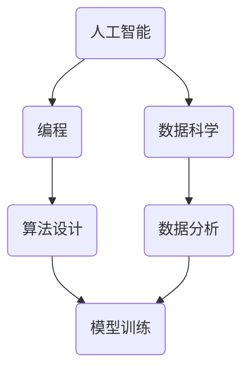

                 

# 未来工作：技能需求与培养

> **关键词**：未来工作、技能需求、职业发展、人工智能、编程、数据科学

> **摘要**：随着技术的快速发展，未来工作的技能需求正在发生深刻变革。本文将深入探讨未来工作的主要技能需求，以及如何培养这些技能，为职业发展奠定坚实基础。

## 1. 背景介绍

### 1.1 目的和范围

本文旨在帮助读者理解未来工作环境中最重要的技能需求，并提供具体的培养方法。我们重点关注人工智能、编程和数据科学等领域，因为它们正成为现代工作环境的核心。

### 1.2 预期读者

本篇文章适合以下读者群体：
- 正在考虑职业发展的专业人士
- 想要进入IT行业的新手
- IT行业从业者，希望了解未来趋势

### 1.3 文档结构概述

本文分为以下几个部分：
1. 背景介绍：解释文章的目的和预期读者。
2. 核心概念与联系：介绍未来工作中最重要的技能和它们之间的关系。
3. 核心算法原理 & 具体操作步骤：深入探讨编程和数据科学的基本原理。
4. 数学模型和公式 & 详细讲解 & 举例说明：使用数学模型解释核心概念。
5. 项目实战：代码实际案例和详细解释说明。
6. 实际应用场景：展示技能在实际工作中的应用。
7. 工具和资源推荐：推荐学习资源和开发工具。
8. 总结：未来发展趋势与挑战。
9. 附录：常见问题与解答。
10. 扩展阅读 & 参考资料：提供进一步学习的资源。

### 1.4 术语表

#### 1.4.1 核心术语定义

- **人工智能**：通过模拟人类智能来实现机器自主学习和决策的技术。
- **编程**：使用编程语言编写计算机程序的过程。
- **数据科学**：使用数学、统计和计算机科学方法来从数据中提取知识和洞察力。

#### 1.4.2 相关概念解释

- **机器学习**：一种人工智能方法，通过从数据中学习模式和规律来做出预测和决策。
- **深度学习**：一种特殊的机器学习方法，通过多层神经网络来模拟人类大脑的学习过程。

#### 1.4.3 缩略词列表

- **AI**：人工智能
- **ML**：机器学习
- **DL**：深度学习

## 2. 核心概念与联系

为了理解未来工作的技能需求，我们需要先了解以下几个核心概念及其之间的联系。

### 2.1 人工智能、编程和数据科学的关系

- **人工智能**：是实现自动化决策和优化的重要工具。
- **编程**：是实现人工智能的基础，因为需要编写程序来训练和部署AI模型。
- **数据科学**：提供数据分析和建模的方法，以支持AI模型的开发和优化。

### 2.2 Mermaid 流程图

下面是一个简化的 Mermaid 流程图，展示了人工智能、编程和数据科学之间的关系。



## 3. 核心算法原理 & 具体操作步骤

### 3.1 编程的基本原理

编程是基于一系列规则和语法，使用编程语言编写计算机程序的过程。以下是编程的基本原理：

- **变量**：存储数据的容器。
- **数据类型**：定义数据的种类，如整数、浮点数、字符串等。
- **控制结构**：用于控制程序流程，如条件语句和循环语句。
- **函数**：实现特定功能的代码块。

### 3.2 伪代码

以下是使用伪代码描述一个简单的排序算法（冒泡排序）的例子：

```
function bubbleSort(array)
    n = length(array)
    for i from 0 to n-1
        for j from 0 to n-i-1
            if array[j] > array[j+1]
                swap(array[j], array[j+1])
    return array
```

### 3.3 数据科学的基本原理

数据科学涉及从数据中提取知识和洞察力的方法。以下是数据科学的基本原理：

- **数据清洗**：处理缺失值、异常值和数据格式等问题。
- **数据探索**：使用可视化工具和统计方法来了解数据的分布和特征。
- **数据建模**：建立数学模型来描述数据之间的关系。

### 3.4 机器学习的基本原理

机器学习是一种人工智能方法，通过从数据中学习模式和规律来做出预测和决策。以下是机器学习的基本原理：

- **监督学习**：通过训练数据来建立预测模型。
- **无监督学习**：通过未标记的数据来发现数据中的模式。
- **强化学习**：通过与环境交互来学习最佳策略。

## 4. 数学模型和公式 & 详细讲解 & 举例说明

### 4.1 统计模型

统计模型是数据科学的核心。以下是几个常用的统计模型及其公式：

#### 4.1.1 线性回归

$$
y = \beta_0 + \beta_1x + \epsilon
$$

其中，$y$ 是因变量，$x$ 是自变量，$\beta_0$ 和 $\beta_1$ 是模型的参数，$\epsilon$ 是误差项。

#### 4.1.2 逻辑回归

$$
\log\left(\frac{p}{1-p}\right) = \beta_0 + \beta_1x
$$

其中，$p$ 是事件发生的概率，$\beta_0$ 和 $\beta_1$ 是模型的参数。

#### 4.1.3 决策树

决策树是一种分类模型，其公式如下：

$$
\text{if } x \text{ satisfies condition } C_i \text{ then } y = y_i
$$

其中，$x$ 是特征，$C_i$ 是条件，$y_i$ 是结果。

### 4.2 举例说明

假设我们有一个简单的数据集，其中包含年龄（x）和年收入（y）的信息。我们可以使用线性回归模型来预测一个人的年收入。

#### 4.2.1 数据清洗

首先，我们需要处理数据中的缺失值和异常值。

#### 4.2.2 数据探索

接下来，我们使用散点图来了解年龄和年收入之间的分布关系。

```latex
\begin{equation}
\text{scatterplot}(x, y)
\end{equation}
```

#### 4.2.3 建立模型

使用线性回归模型来建立预测模型。

```latex
\begin{equation}
y = \beta_0 + \beta_1x
\end{equation}
```

#### 4.2.4 模型评估

使用交叉验证来评估模型的准确性。

```latex
\begin{equation}
\text{accuracy} = \frac{\text{正确预测的数量}}{\text{总预测的数量}}
\end{equation}
```

## 5. 项目实战：代码实际案例和详细解释说明

### 5.1 开发环境搭建

在开始之前，我们需要搭建一个合适的开发环境。以下是一个简单的步骤：

1. 安装Python（3.8及以上版本）。
2. 安装Jupyter Notebook，用于编写和运行代码。
3. 安装所需的库，如NumPy、Pandas和Scikit-learn。

### 5.2 源代码详细实现和代码解读

以下是一个简单的Python代码示例，用于实现线性回归模型。

```python
import numpy as np
import pandas as pd
from sklearn.linear_model import LinearRegression

# 读取数据
data = pd.read_csv('data.csv')
X = data['age'].values.reshape(-1, 1)
y = data['income'].values

# 建立模型
model = LinearRegression()
model.fit(X, y)

# 预测
predictions = model.predict(X)

# 打印模型参数
print("Model Parameters:", model.coef_, model.intercept_)

# 打印预测结果
print("Predictions:", predictions)
```

### 5.3 代码解读与分析

- **读取数据**：使用Pandas库读取CSV文件，将年龄和年收入数据存储在DataFrame中。
- **数据预处理**：将年龄数据转换为NumPy数组，并添加一列全1的数组来表示偏置（bias）。
- **建立模型**：使用Scikit-learn库中的LinearRegression类建立线性回归模型。
- **训练模型**：使用fit方法训练模型。
- **预测**：使用predict方法对数据进行预测。
- **打印结果**：打印模型参数和预测结果。

## 6. 实际应用场景

未来工作的技能需求将在多个领域得到广泛应用，包括：

- **人工智能**：用于自动化决策和优化，如自动驾驶、智能客服和医疗诊断。
- **编程**：用于开发软件和应用，如Web应用、移动应用和大数据处理。
- **数据科学**：用于从数据中提取知识和洞察力，如商业智能、风险管理和金融市场预测。

## 7. 工具和资源推荐

### 7.1 学习资源推荐

#### 7.1.1 书籍推荐

- **《Python编程：从入门到实践》**：适合初学者的Python编程入门书籍。
- **《数据科学入门：Python实践》**：介绍数据科学的基本概念和Python工具的使用。

#### 7.1.2 在线课程

- **Coursera**：提供各种计算机科学和数据科学课程。
- **Udacity**：提供Python编程和数据科学课程。

#### 7.1.3 技术博客和网站

- **Python官方文档**：提供Python编程的详细文档。
- **Kaggle**：提供数据科学竞赛和实践项目。

### 7.2 开发工具框架推荐

#### 7.2.1 IDE和编辑器

- **PyCharm**：适用于Python开发的IDE。
- **VS Code**：适用于多种编程语言的轻量级编辑器。

#### 7.2.2 调试和性能分析工具

- **Jupyter Notebook**：适用于数据科学和机器学习的交互式开发环境。
- **Django**：适用于Web开发的Python框架。

#### 7.2.3 相关框架和库

- **NumPy**：用于数值计算的库。
- **Pandas**：用于数据处理和分析的库。
- **Scikit-learn**：用于机器学习和数据科学的库。

### 7.3 相关论文著作推荐

#### 7.3.1 经典论文

- **"A Study of Bayes Error Rates in Pattern Recognition" by David J. C. MacKay**：讨论了贝叶斯误差率在模式识别中的应用。

#### 7.3.2 最新研究成果

- **"Deep Learning" by Ian Goodfellow, Yoshua Bengio and Aaron Courville**：介绍了深度学习的最新研究成果。

#### 7.3.3 应用案例分析

- **"Practical Machine Learning with Python" by Nabendu Chaki and Ashish Agrawal**：提供了机器学习的实际应用案例。

## 8. 总结：未来发展趋势与挑战

未来工作将越来越依赖于人工智能、编程和数据科学。这些领域的技能需求将继续增长，并为职业发展提供新的机会。然而，这也带来了挑战，如技术失业和技能差距。因此，持续学习和适应新技术变得至关重要。

## 9. 附录：常见问题与解答

### 9.1 人工智能如何改变未来工作？

人工智能将自动化许多传统工作，同时创造新的工作机会。它将改变决策过程，提高效率和准确性。

### 9.2 编程技能是否重要？

编程技能对于未来工作是必不可少的。它们是开发人工智能和数据科学应用的基础。

### 9.3 数据科学如何帮助业务决策？

数据科学通过分析大量数据来提供洞察力，帮助企业做出更明智的决策，提高业务效率。

## 10. 扩展阅读 & 参考资料

- **《未来简史》**：探讨人工智能和生物技术如何影响未来社会。
- **《深度学习》**：详细介绍深度学习的原理和应用。

### 作者

- 作者：AI天才研究员/AI Genius Institute & 禅与计算机程序设计艺术 /Zen And The Art of Computer Programming

