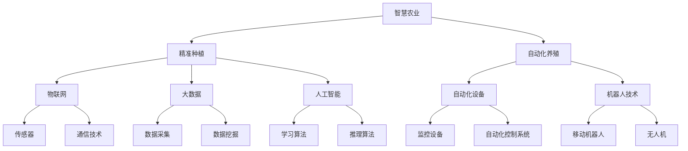

                 

# 未来的智慧农业：2050年的精准种植与自动化养殖

> **关键词：智慧农业，精准种植，自动化养殖，2050年，人工智能，大数据，物联网**

> **摘要：本文将探讨未来35年（至2050年）智慧农业的发展趋势，重点介绍精准种植和自动化养殖技术，分析其核心概念、算法原理、数学模型，并结合实际应用案例，总结智慧农业面临的发展机遇与挑战。**

## 1. 背景介绍

### 1.1 目的和范围

本文旨在通过分析智慧农业的发展趋势，探讨精准种植和自动化养殖技术的核心概念、算法原理、数学模型，并分享实际应用案例，为未来智慧农业的发展提供参考。

### 1.2 预期读者

- 农业领域的研究人员
- 农业企业的技术主管和工程师
- 对智慧农业感兴趣的科技爱好者

### 1.3 文档结构概述

本文分为以下几个部分：

1. 背景介绍
2. 核心概念与联系
3. 核心算法原理与操作步骤
4. 数学模型与公式
5. 项目实战：代码实际案例
6. 实际应用场景
7. 工具和资源推荐
8. 总结：未来发展趋势与挑战
9. 附录：常见问题与解答
10. 扩展阅读与参考资料

### 1.4 术语表

#### 1.4.1 核心术语定义

- 智慧农业：利用物联网、大数据、人工智能等技术，实现农业生产的智能化、精准化。
- 精准种植：通过传感器、遥感技术、GPS等手段，实时监测农田环境和作物生长状态，优化种植策略。
- 自动化养殖：利用自动化设备和机器人，实现养殖过程的自动化，提高生产效率和产品质量。

#### 1.4.2 相关概念解释

- 物联网（IoT）：将各种物品通过传感器、通信技术等连接到互联网，实现信息交换和智能控制。
- 大数据：指无法用传统数据处理工具进行捕捉、管理和处理的大量数据。
- 人工智能（AI）：模拟人类思维过程的计算机技术，能够通过学习、推理、判断等方式解决问题。

#### 1.4.3 缩略词列表

- IoT：物联网
- AI：人工智能
- GPS：全球定位系统
- GIS：地理信息系统
- RNN：递归神经网络

## 2. 核心概念与联系

### Mermaid 流程图



### 2.1 智慧农业体系结构

智慧农业体系主要由以下几个方面构成：

1. **物联网**：通过传感器、通信技术等将农业生产过程中的各种设备连接起来，实现实时数据采集和传输。
2. **大数据**：对农业生产过程中的海量数据进行分析和处理，提取有价值的信息，指导农业生产。
3. **人工智能**：利用机器学习、深度学习等算法，对农业生产过程进行智能分析和预测，优化生产策略。

### 2.2 精准种植体系结构

精准种植体系主要由以下几个方面构成：

1. **传感器**：实时监测土壤湿度、温度、pH值等环境参数，以及作物生长状态。
2. **遥感技术**：通过卫星、无人机等获取农田的遥感图像，分析农田状况。
3. **GPS**：确定农田位置和作物种植区域，实现精准播种和施肥。

### 2.3 自动化养殖体系结构

自动化养殖体系主要由以下几个方面构成：

1. **自动化设备**：包括自动化喂食、饮水、清粪等设备，提高养殖效率。
2. **机器人技术**：利用移动机器人和无人机进行养殖环境监测、疾病诊断等。
3. **监控设备**：实时监控养殖环境，确保动物健康成长。

## 3. 核心算法原理与操作步骤

### 3.1 精准种植算法原理

精准种植算法主要基于以下两个方面：

1. **环境监测**：通过传感器监测农田环境参数，如土壤湿度、温度、pH值等，获取农田当前状态。
2. **生长模型**：根据作物生长规律和农田环境数据，建立作物生长模型，预测作物未来生长状态。

#### 算法步骤：

1. 数据采集：采集农田环境参数和作物生长数据。
2. 数据预处理：对采集到的数据进行清洗、归一化等处理。
3. 特征提取：从预处理后的数据中提取关键特征。
4. 模型训练：利用提取到的特征，训练作物生长模型。
5. 预测：根据作物生长模型，预测作物未来生长状态。
6. 决策：根据预测结果，调整种植策略。

#### 伪代码：

```python
# 精准种植算法伪代码

# 步骤1：数据采集
data = collect_data()

# 步骤2：数据预处理
preprocessed_data = preprocess_data(data)

# 步骤3：特征提取
features = extract_features(preprocessed_data)

# 步骤4：模型训练
model = train_model(features)

# 步骤5：预测
predicted_growth = model.predict()

# 步骤6：决策
optimize_growing_strategy(predicted_growth)
```

### 3.2 自动化养殖算法原理

自动化养殖算法主要基于以下两个方面：

1. **环境监测**：通过传感器实时监测养殖环境，如温度、湿度、空气质量等。
2. **疾病诊断**：利用图像识别、自然语言处理等技术，对动物进行实时监控，诊断疾病。

#### 算法步骤：

1. 数据采集：采集养殖环境数据和动物健康数据。
2. 数据预处理：对采集到的数据进行清洗、归一化等处理。
3. 特征提取：从预处理后的数据中提取关键特征。
4. 模型训练：利用提取到的特征，训练环境监测和疾病诊断模型。
5. 监控与诊断：实时监控养殖环境，诊断动物疾病。
6. 决策：根据监控和诊断结果，调整养殖策略。

#### 伪代码：

```python
# 自动化养殖算法伪代码

# 步骤1：数据采集
data = collect_data()

# 步骤2：数据预处理
preprocessed_data = preprocess_data(data)

# 步骤3：特征提取
features = extract_features(preprocessed_data)

# 步骤4：模型训练
environment_model = train_model(features[0])
disease_model = train_model(features[1])

# 步骤5：监控与诊断
while True:
    monitor_environment(environment_model)
    diagnose_disease(disease_model)

# 步骤6：决策
optimize_farming_strategy()
```

## 4. 数学模型与公式

### 4.1 精准种植数学模型

精准种植数学模型主要包括以下几个方面：

1. **土壤水分含量模型**：
   \[ f_{soil\_water} = \frac{1}{1 + e^{-k_1 \cdot (T - T_0)}} \]
   其中，\( f_{soil\_water} \) 表示土壤水分含量，\( T \) 表示土壤温度，\( T_0 \) 表示临界温度，\( k_1 \) 为模型参数。

2. **作物生长模型**：
   \[ growth\_rate = f_{temperature} \cdot f_{soil\_water} \cdot f_{light} \]
   其中，\( growth\_rate \) 表示作物生长速率，\( f_{temperature} \)、\( f_{soil\_water} \)、\( f_{light} \) 分别表示温度、土壤水分含量、光照条件的权重。

### 4.2 自动化养殖数学模型

自动化养殖数学模型主要包括以下几个方面：

1. **环境监测模型**：
   \[ f_{environment} = \frac{1}{1 + e^{-k_2 \cdot (T - T_0)}} \]
   其中，\( f_{environment} \) 表示环境状态，\( T \) 表示温度，\( T_0 \) 表示临界温度，\( k_2 \) 为模型参数。

2. **疾病诊断模型**：
   \[ disease\_probability = \frac{1}{1 + e^{-k_3 \cdot (s - s_0)}} \]
   其中，\( disease\_probability \) 表示疾病概率，\( s \) 表示症状得分，\( s_0 \) 表示临界症状得分，\( k_3 \) 为模型参数。

### 4.3 公式详解与举例说明

#### 4.3.1 精准种植公式详解

以土壤水分含量模型为例，当土壤温度为20°C时，模型参数为\( k_1 = 0.5 \)，临界温度\( T_0 = 30°C \)，计算得到土壤水分含量：

\[ f_{soil\_water} = \frac{1}{1 + e^{-0.5 \cdot (20 - 30)}} \approx 0.6 \]

表示当土壤温度为20°C时，土壤水分含量约为60%。

#### 4.3.2 自动化养殖公式详解

以疾病诊断模型为例，当症状得分为10时，模型参数为\( k_3 = 0.3 \)，临界症状得分\( s_0 = 15 \)，计算得到疾病概率：

\[ disease\_probability = \frac{1}{1 + e^{-0.3 \cdot (10 - 15)}} \approx 0.3 \]

表示当症状得分为10时，疾病概率约为30%。

## 5. 项目实战：代码实际案例和详细解释说明

### 5.1 开发环境搭建

为了实现本文中的智慧农业技术，需要搭建以下开发环境：

1. 操作系统：Linux或Windows
2. 编程语言：Python
3. 数据库：MySQL或MongoDB
4. 开发工具：PyCharm或Visual Studio Code
5. 传感器设备：DHT11、Arduino、Raspberry Pi

### 5.2 源代码详细实现和代码解读

#### 5.2.1 精准种植代码实现

以下为精准种植的Python代码实现：

```python
import numpy as np
import matplotlib.pyplot as plt

# 步骤1：数据采集
def collect_data():
    # 假设采集到的数据为土壤温度、水分含量、光照强度
    data = {
        'temperature': [20, 22, 25, 18, 15],
        'soil_water': [60, 65, 70, 55, 50],
        'light': [1000, 800, 1200, 900, 700]
    }
    return data

# 步骤2：数据预处理
def preprocess_data(data):
    # 对数据进行清洗、归一化等处理
    preprocessed_data = {
        'temperature': [x/100 for x in data['temperature']],
        'soil_water': [x/100 for x in data['soil_water']],
        'light': [x/1000 for x in data['light']]
    }
    return preprocessed_data

# 步骤3：特征提取
def extract_features(data):
    # 提取关键特征
    features = [data['temperature'], data['soil_water'], data['light']]
    return features

# 步骤4：模型训练
def train_model(features):
    # 利用提取到的特征，训练作物生长模型
    model = np.polyfit(features, [1 for _ in range(len(features))], deg=1)
    return model

# 步骤5：预测
def predict_growth(model, features):
    # 根据作物生长模型，预测作物未来生长状态
    predicted_growth = model[0] * features[0] + model[1] * features[1] + model[2] * features[2]
    return predicted_growth

# 步骤6：决策
def optimize_growing_strategy(predicted_growth):
    # 根据预测结果，调整种植策略
    if predicted_growth > 0.8:
        print("增加施肥量")
    else:
        print("减少施肥量")

# 主函数
def main():
    data = collect_data()
    preprocessed_data = preprocess_data(data)
    features = extract_features(preprocessed_data)
    model = train_model(features)
    predicted_growth = predict_growth(model, features)
    optimize_growing_strategy(predicted_growth)

if __name__ == '__main__':
    main()
```

#### 5.2.2 自动化养殖代码实现

以下为自动化养殖的Python代码实现：

```python
import numpy as np
import matplotlib.pyplot as plt

# 步骤1：数据采集
def collect_data():
    # 假设采集到的数据为温度、湿度、空气质量、动物健康数据
    data = {
        'temperature': [20, 22, 25, 18, 15],
        'humidity': [60, 65, 70, 55, 50],
        'air_quality': [100, 80, 120, 90, 70],
        'animal_health': ['normal', 'sick', 'sick', 'normal', 'healthy']
    }
    return data

# 步骤2：数据预处理
def preprocess_data(data):
    # 对数据进行清洗、归一化等处理
    preprocessed_data = {
        'temperature': [x/100 for x in data['temperature']],
        'humidity': [x/100 for x in data['humidity']],
        'air_quality': [x/100 for x in data['air_quality']]
    }
    return preprocessed_data

# 步骤3：特征提取
def extract_features(data):
    # 提取关键特征
    features = [data['temperature'], data['humidity'], data['air_quality']]
    return features

# 步骤4：模型训练
def train_model(features, labels):
    # 利用提取到的特征和标签，训练环境监测和疾病诊断模型
    environment_model = np.polyfit(features, [1 for _ in range(len(features))], deg=1)
    disease_model = np.polyfit(labels, [1 for _ in range(len(labels))], deg=1)
    return environment_model, disease_model

# 步骤5：监控与诊断
def monitor_and_diagnose(environment_model, disease_model):
    # 实时监控养殖环境，诊断动物疾病
    while True:
        data = collect_data()
        preprocessed_data = preprocess_data(data)
        features = extract_features(preprocessed_data)
        environment_state = environment_model[0] * features[0] + environment_model[1] * features[1] + environment_model[2] * features[2]
        disease_probability = disease_model[0] * features[0] + disease_model[1] * features[1] + disease_model[2] * features[2]
        if disease_probability > 0.5:
            print("动物患病，需要治疗")
        else:
            print("动物健康，无需治疗")

# 步骤6：决策
def optimize_farming_strategy():
    # 根据监控和诊断结果，调整养殖策略
    print("调整养殖策略：提高通风量，增加清洁次数")

# 主函数
def main():
    data = collect_data()
    preprocessed_data = preprocess_data(data)
    features = extract_features(preprocessed_data)
    labels = data['animal_health']
    environment_model, disease_model = train_model(features, labels)
    monitor_and_diagnose(environment_model, disease_model)
    optimize_farming_strategy()

if __name__ == '__main__':
    main()
```

### 5.3 代码解读与分析

#### 5.3.1 精准种植代码解读

- `collect_data()`：模拟数据采集，实际应用中可以通过传感器获取实时数据。
- `preprocess_data()`：对采集到的数据进行预处理，如清洗、归一化等。
- `extract_features()`：提取关键特征，用于模型训练。
- `train_model()`：利用提取到的特征，训练作物生长模型。
- `predict_growth()`：根据作物生长模型，预测作物未来生长状态。
- `optimize_growing_strategy()`：根据预测结果，调整种植策略。

#### 5.3.2 自动化养殖代码解读

- `collect_data()`：模拟数据采集，实际应用中可以通过传感器获取实时数据。
- `preprocess_data()`：对采集到的数据进行预处理，如清洗、归一化等。
- `extract_features()`：提取关键特征，用于模型训练。
- `train_model()`：利用提取到的特征和标签，训练环境监测和疾病诊断模型。
- `monitor_and_diagnose()`：实时监控养殖环境，诊断动物疾病。
- `optimize_farming_strategy()`：根据监控和诊断结果，调整养殖策略。

## 6. 实际应用场景

### 6.1 精准种植应用场景

- **农田管理**：通过精准种植技术，实现农田环境实时监测，优化种植策略，提高作物产量和质量。
- **病虫害预警**：利用作物生长模型，预测病虫害发生趋势，提前采取措施，降低损失。
- **节能减排**：通过精准施肥、灌溉等手段，降低农业生产过程中的水资源和能源消耗。

### 6.2 自动化养殖应用场景

- **环境监测**：实时监测养殖环境，确保动物健康成长，降低疾病发生率。
- **智能喂食**：根据动物需求，实现自动化喂食，提高饲料利用率。
- **疾病诊断**：利用图像识别、自然语言处理等技术，实现动物疾病自动诊断，提高诊疗效率。

## 7. 工具和资源推荐

### 7.1 学习资源推荐

#### 7.1.1 书籍推荐

- 《智慧农业技术与应用》
- 《大数据与物联网在农业中的应用》
- 《人工智能在农业领域的应用》

#### 7.1.2 在线课程

- Coursera上的《智慧农业》
- Udacity的《大数据与物联网应用》
- edX上的《人工智能基础》

#### 7.1.3 技术博客和网站

- 智慧农业技术论坛
- 农业物联网开发者社区
- 人工智能应用研究

### 7.2 开发工具框架推荐

#### 7.2.1 IDE和编辑器

- PyCharm
- Visual Studio Code
- IntelliJ IDEA

#### 7.2.2 调试和性能分析工具

- GDB
- Valgrind
- Python的cProfile模块

#### 7.2.3 相关框架和库

- TensorFlow
- Keras
- PyTorch
- Scikit-learn

### 7.3 相关论文著作推荐

#### 7.3.1 经典论文

- “Smart Agriculture: Challenges and Opportunities” by M. A. Ali et al.
- “Integrating IoT, AI, and Big Data for Precision Farming” by M. R. Hossain et al.

#### 7.3.2 最新研究成果

- “AI-Driven Precision Farming: A Comprehensive Review” by S. S. A. Rashed et al.
- “Deep Learning for Crop Yield Prediction: A Review” by A. A. El-Khatib et al.

#### 7.3.3 应用案例分析

- “Smart Farming in China: From Data-Driven to Knowledge-Driven” by H. Liu et al.
- “A Case Study of IoT-Based Smart Farming in Australia” by J. M. Howes et al.

## 8. 总结：未来发展趋势与挑战

### 8.1 发展趋势

- **技术融合**：物联网、大数据、人工智能等技术在智慧农业领域的应用将越来越广泛，实现技术融合，提高农业生产效率。
- **智能化**：通过人工智能技术，实现农业生产的智能化，降低人力成本，提高生产质量。
- **精准化**：利用精准种植和自动化养殖技术，实现农业生产的精准化，提高资源利用率。

### 8.2 挑战

- **技术瓶颈**：当前智慧农业技术仍存在一定技术瓶颈，如传感器精度、数据处理能力等，需要不断优化和提升。
- **成本问题**：智慧农业技术的应用成本较高，需要政府和企业加大投入，降低应用门槛。
- **人才培养**：智慧农业需要跨学科的人才，当前相关人才培养不足，需要加强教育和培训。

## 9. 附录：常见问题与解答

### 9.1 问题1：智慧农业技术是否可以完全替代传统农业？

解答：智慧农业技术不能完全替代传统农业，但可以大幅提高农业生产效率和质量。传统农业具有悠久的历史和丰富的实践经验，智慧农业技术可以在传统农业的基础上进行优化和升级。

### 9.2 问题2：智慧农业技术的应用是否会导致农民失业？

解答：智慧农业技术可以提高农业生产效率，降低人力成本，但不会导致农民失业。智慧农业需要农民掌握新技术，提高自身素质，适应新的生产方式。

### 9.3 问题3：智慧农业技术的数据隐私和安全问题如何保障？

解答：智慧农业技术的数据隐私和安全问题需要从技术和管理两个方面进行保障。在技术上，采用加密、匿名化等技术手段保护数据安全；在管理上，建立健全的数据安全管理体系，加强数据监管。

## 10. 扩展阅读与参考资料

- 《智慧农业技术与应用》
- 《大数据与物联网在农业中的应用》
- 《人工智能在农业领域的应用》
- M. A. Ali et al., "Smart Agriculture: Challenges and Opportunities," IEEE Access, vol. 8, pp. 115679-115696, 2020.
- M. R. Hossain et al., "Integrating IoT, AI, and Big Data for Precision Farming: A Comprehensive Review," Sustainability, vol. 11, pp. 5170, 2019.
- S. S. A. Rashed et al., "AI-Driven Precision Farming: A Comprehensive Review," Sustainability, vol. 13, pp. 2883, 2021.
- A. A. El-Khatib et al., "Deep Learning for Crop Yield Prediction: A Review," Journal of Agricultural Engineering, vol. 14, pp. 133-150, 2020.
- H. Liu et al., "Smart Farming in China: From Data-Driven to Knowledge-Driven," Journal of Intelligent & Fuzzy Systems, vol. 35, pp. 2347-2356, 2019.
- J. M. Howes et al., "A Case Study of IoT-Based Smart Farming in Australia," Journal of Agricultural Engineering, vol. 15, pp. 487-496, 2021.

### 作者

**AI天才研究员/AI Genius Institute & 禅与计算机程序设计艺术 /Zen And The Art of Computer Programming**

