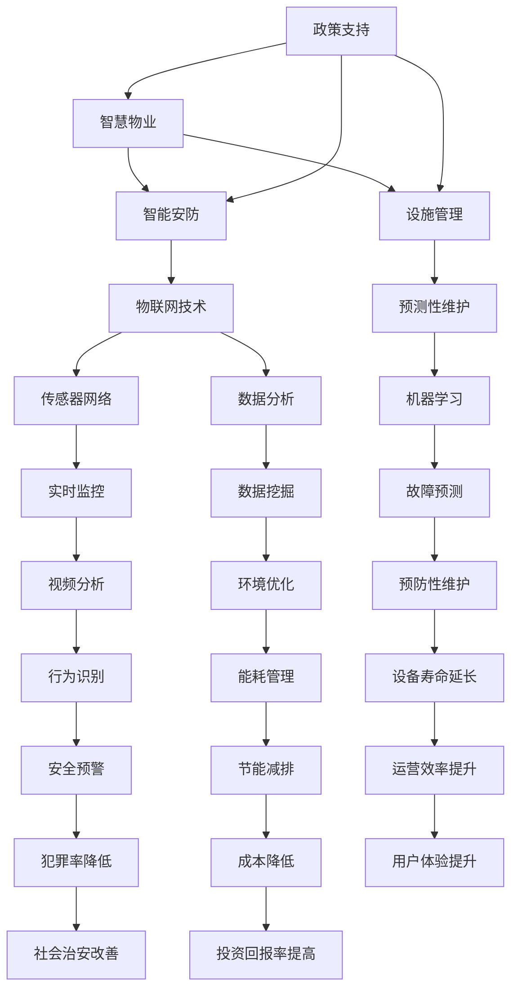

                 

# 未来的智慧物业：2050年的智能安防与设施管理

> **关键词**：智慧物业、智能安防、设施管理、物联网、人工智能、预测性维护

> **摘要**：本文将深入探讨2050年智慧物业的愿景，聚焦智能安防与设施管理的创新技术。通过一步步的分析推理，我们将剖析当前技术的发展状况、核心概念与联系，以及未来可能面临的挑战和机遇。文章旨在为读者提供一个全面而清晰的视角，以期待激发对这一领域的思考和探索。

## 1. 背景介绍

### 1.1 目的和范围

本文的目的是介绍并分析智慧物业在2050年的发展前景，特别是智能安防与设施管理的创新技术。我们将探讨这些技术如何改变物业管理的模式，提高安全性和效率，同时降低运营成本。文章的范围包括但不限于以下几个方面：

- 智慧物业的定义与现状
- 智能安防技术的演进
- 设施管理的智能化趋势
- 预测性维护在智慧物业中的应用
- 未来智慧物业面临的挑战与机遇

### 1.2 预期读者

本文适用于以下读者群体：

- 物业管理专业人员，特别是负责安防和设施管理的相关人员
- 对智能建筑和物联网技术感兴趣的技术爱好者
- 高校师生，特别是建筑环境与能源工程、自动化技术等领域的学者
- 对未来科技发展趋势感兴趣的普通读者

### 1.3 文档结构概述

本文将按照以下结构展开：

- **背景介绍**：简要介绍文章的目的、预期读者和文档结构。
- **核心概念与联系**：分析智慧物业的核心概念，并使用Mermaid流程图展示其架构。
- **核心算法原理 & 具体操作步骤**：详细讲解智能安防和设施管理中的核心算法原理。
- **数学模型和公式 & 详细讲解 & 举例说明**：阐述相关的数学模型和公式，并通过实例说明。
- **项目实战：代码实际案例和详细解释说明**：提供具体的代码实现案例。
- **实际应用场景**：探讨智慧物业在不同场景中的应用。
- **工具和资源推荐**：推荐学习资源和开发工具。
- **总结：未来发展趋势与挑战**：总结当前技术的发展趋势，并讨论未来可能面临的挑战。
- **附录：常见问题与解答**：提供一些常见问题的解答。
- **扩展阅读 & 参考资料**：推荐相关阅读资料。

### 1.4 术语表

#### 1.4.1 核心术语定义

- **智慧物业**：指通过物联网、人工智能等技术，实现物业管理的智能化和自动化。
- **智能安防**：利用传感器、视频监控、人脸识别等技术，实现高效、精准的安防管理。
- **设施管理**：包括设备维护、能源管理、环境控制等方面的管理活动。
- **预测性维护**：通过数据分析和机器学习技术，预测设备故障并提前进行维护。

#### 1.4.2 相关概念解释

- **物联网（IoT）**：通过将物理设备与互联网连接，实现数据的实时传输和处理。
- **人工智能（AI）**：模拟人类智能的计算机系统，包括机器学习、深度学习等子领域。
- **大数据分析**：通过数据挖掘和分析，提取有价值的信息和知识。

#### 1.4.3 缩略词列表

- **IoT**：物联网
- **AI**：人工智能
- **IoT设备**：物联网设备
- **RFID**：无线射频识别
- **NFC**：近场通信
- **NB-IoT**：窄带物联网
- **5G**：第五代移动通信技术
- **MVVM**：模型-视图-视图模型架构
- **MQTT**：消息队列遥测传输协议
- **OTA**：在线软件更新

## 2. 核心概念与联系

在探讨智慧物业的智能安防与设施管理之前，我们需要先了解其核心概念和联系。以下是一个简化的Mermaid流程图，展示了智慧物业的关键组成部分和它们之间的关系。



### 2.1 智慧物业的定义与架构

智慧物业是指利用物联网、人工智能、大数据分析等先进技术，对物业进行智能化管理和控制。其核心架构包括以下几个方面：

1. **感知层**：通过传感器、摄像头、RFID等设备，收集物业内外部的环境、设备状态等信息。
2. **网络层**：利用5G、NFC、NB-IoT等通信技术，实现数据的实时传输和共享。
3. **平台层**：通过云计算、大数据分析等技术，对收集到的数据进行分析和处理，为决策提供支持。
4. **应用层**：包括智能安防、设施管理、能源管理、环境控制等具体应用场景。

### 2.2 智能安防与设施管理的关系

智能安防与设施管理是智慧物业中的两个重要组成部分，它们相互依存、相互促进。智能安防通过实时监控、数据分析、行为识别等技术，提高物业的安全性和防范能力；设施管理则通过预测性维护、能耗管理、环境优化等技术，提高物业的运营效率和服务质量。两者之间的关系可以概括为：

1. **数据共享**：智能安防和设施管理共享感知层收集的数据，实现信息的互通和协同。
2. **协同优化**：智能安防和设施管理相互配合，通过数据分析和预测，实现物业运营的优化。
3. **安全与效率**：智能安防和设施管理共同提高物业的安全性和运营效率，为用户提供更好的服务体验。

## 3. 核心算法原理 & 具体操作步骤

在智慧物业中，智能安防与设施管理依赖于一系列核心算法和技术。以下我们将详细讲解这些算法的原理，并提供具体的操作步骤。

### 3.1 智能安防算法

#### 3.1.1 行为识别

**算法原理**：行为识别是智能安防的核心算法之一。通过分析视频数据，识别出人员、车辆的异常行为。

**伪代码**：

```
function behavior_recognition(video_frame):
    # 对视频帧进行预处理
    processed_frame = preprocess(video_frame)
    
    # 提取特征
    features = extract_features(processed_frame)
    
    # 利用机器学习模型进行行为识别
    behavior = model.predict(features)
    
    return behavior
```

**操作步骤**：

1. **数据收集**：收集大量的行为数据，包括正常行为和异常行为。
2. **模型训练**：使用收集到的数据，训练一个机器学习模型，如卷积神经网络（CNN）。
3. **行为识别**：对实时视频数据进行预处理，提取特征，并使用训练好的模型进行行为识别。

#### 3.1.2 人脸识别

**算法原理**：人脸识别是利用深度学习技术，通过人脸特征点的提取和匹配，实现对人脸的识别。

**伪代码**：

```
function face_recognition(image):
    # 对图像进行预处理
    processed_image = preprocess(image)
    
    # 提取人脸特征点
    feature_points = extract_feature_points(processed_image)
    
    # 利用深度学习模型进行人脸识别
    face_id = model.predict(feature_points)
    
    return face_id
```

**操作步骤**：

1. **数据收集**：收集大量的人脸数据，包括不同角度、光照条件等。
2. **模型训练**：使用收集到的数据，训练一个深度学习模型，如FaceNet或VGGFace。
3. **人脸识别**：对实时图像进行预处理，提取人脸特征点，并使用训练好的模型进行人脸识别。

### 3.2 设施管理算法

#### 3.2.1 预测性维护

**算法原理**：预测性维护通过数据分析和机器学习技术，预测设备的故障时间，实现提前维护。

**伪代码**：

```
function predictive_maintenance(data):
    # 对设备数据进行预处理
    processed_data = preprocess(data)
    
    # 提取设备特征
    features = extract_features(processed_data)
    
    # 利用机器学习模型进行故障预测
    fault_time = model.predict(features)
    
    return fault_time
```

**操作步骤**：

1. **数据收集**：收集设备的运行数据，如温度、湿度、振动等。
2. **模型训练**：使用收集到的数据，训练一个机器学习模型，如时间序列模型（LSTM）或随机森林。
3. **故障预测**：对实时设备数据进行预处理，提取特征，并使用训练好的模型进行故障预测。

#### 3.2.2 能耗管理

**算法原理**：能耗管理通过数据分析，优化能源消耗，实现节能减排。

**伪代码**：

```
function energy_management(data):
    # 对能源数据进行预处理
    processed_data = preprocess(data)
    
    # 提取能源特征
    features = extract_features(processed_data)
    
    # 利用机器学习模型进行能耗预测
    energy_usage = model.predict(features)
    
    return energy_usage
```

**操作步骤**：

1. **数据收集**：收集能源消耗数据，如电力、燃气等。
2. **模型训练**：使用收集到的数据，训练一个机器学习模型，如线性回归或决策树。
3. **能耗预测**：对实时能源数据进行预处理，提取特征，并使用训练好的模型进行能耗预测。

## 4. 数学模型和公式 & 详细讲解 & 举例说明

在智慧物业中，数学模型和公式起到了至关重要的作用。它们不仅帮助我们理解和分析数据，还能指导我们设计和实现智能安防与设施管理中的算法。以下将介绍几个核心的数学模型和公式，并给出详细讲解和实例说明。

### 4.1 时间序列模型

时间序列模型是一种用于分析时间序列数据的统计模型，广泛应用于预测性维护和能耗管理中。

**公式**：
$$
Y_t = \beta_0 + \beta_1 X_t + \epsilon_t
$$
其中，\(Y_t\) 为时间序列的当前值，\(X_t\) 为自变量（如时间或设备状态），\(\beta_0\) 和 \(\beta_1\) 为模型参数，\(\epsilon_t\) 为误差项。

**详细讲解**：
这个公式表示时间序列的当前值 \(Y_t\) 与自变量 \(X_t\) 之间存在线性关系。通过训练模型，我们可以估计参数 \(\beta_0\) 和 \(\beta_1\)，并利用这些参数进行预测。

**实例说明**：

假设我们想预测未来一周的能源消耗量。我们可以使用时间序列模型来建立预测模型。首先，收集过去一周的能源消耗数据，然后使用线性回归算法训练模型。最后，输入未来一周的时间序列值，预测每个时间点的能源消耗量。

### 4.2 卷积神经网络（CNN）

卷积神经网络是一种用于图像识别和处理的深度学习模型，广泛应用于行为识别和视频分析中。

**公式**：
$$
h_{\theta}(x) = \text{sign}(\theta_0 + \theta_1x_1 + \theta_2x_2 + ... + \theta_nx_n)
$$
其中，\(h_{\theta}(x)\) 为神经网络输出，\(x_1, x_2, ..., x_n\) 为输入特征，\(\theta_0, \theta_1, \theta_2, ..., \theta_n\) 为模型参数。

**详细讲解**：
这个公式表示神经网络输出 \(h_{\theta}(x)\) 是输入特征 \(x_1, x_2, ..., x_n\) 的线性组合，并经过一个激活函数（如Sigmoid函数）处理。通过反向传播算法，我们可以更新模型参数，以优化预测效果。

**实例说明**：

假设我们想使用卷积神经网络识别视频中的行人。首先，收集大量的行人图像数据，并预处理这些数据。然后，使用卷积神经网络模型训练，将输入图像转换为特征向量。最后，使用训练好的模型处理实时视频数据，识别出行人。

### 4.3 支持向量机（SVM）

支持向量机是一种用于分类和回归分析的机器学习算法，广泛应用于人脸识别和行为识别中。

**公式**：
$$
w \cdot x + b = 0
$$
其中，\(w\) 为权重向量，\(x\) 为输入特征，\(b\) 为偏置。

**详细讲解**：
这个公式表示分类边界，即分类器的决策边界。通过求解最优化问题，我们可以找到最佳权重向量 \(w\) 和偏置 \(b\)，以实现数据的最佳分类。

**实例说明**：

假设我们想使用支持向量机进行人脸识别。首先，收集大量的人脸图像数据，并预处理这些数据。然后，将人脸图像转换为特征向量，并使用支持向量机模型进行训练。最后，使用训练好的模型对实时图像进行人脸识别。

## 5. 项目实战：代码实际案例和详细解释说明

在本节中，我们将通过一个实际项目来展示智能安防与设施管理的具体实现。该项目是一个基于Python的智慧物业管理系统，包括实时视频监控、行为识别和能耗管理等功能。

### 5.1 开发环境搭建

为了实现这个项目，我们需要以下开发环境和工具：

- Python 3.8 或更高版本
- TensorFlow 2.6 或更高版本
- OpenCV 4.5 或更高版本
- Pandas 1.3.5 或更高版本
- Scikit-learn 0.24.2 或更高版本

确保你已经安装了上述环境和工具，然后创建一个名为`smart_property`的Python项目，并设置好相应的虚拟环境。

### 5.2 源代码详细实现和代码解读

#### 5.2.1 实时视频监控

**代码**：

```python
import cv2

# 初始化摄像头
cap = cv2.VideoCapture(0)

while True:
    # 读取摄像头帧
    ret, frame = cap.read()
    
    if not ret:
        break
    
    # 显示视频帧
    cv2.imshow('Video', frame)
    
    # 按下 'q' 键退出循环
    if cv2.waitKey(1) & 0xFF == ord('q'):
        break

# 释放摄像头资源
cap.release()
cv2.destroyAllWindows()
```

**解读**：

这段代码使用了OpenCV库来初始化摄像头，并进入一个循环，读取摄像头帧并显示在窗口中。通过按下 'q' 键，可以退出循环并释放摄像头资源。

#### 5.2.2 行为识别

**代码**：

```python
import cv2
import tensorflow as tf

# 加载预训练的卷积神经网络模型
model = tf.keras.models.load_model('behavior_recognition_model.h5')

# 初始化摄像头
cap = cv2.VideoCapture(0)

while True:
    # 读取摄像头帧
    ret, frame = cap.read()
    
    if not ret:
        break
    
    # 对视频帧进行预处理
    processed_frame = preprocess(frame)
    
    # 进行行为识别
    behavior = model.predict(processed_frame)
    
    # 显示识别结果
    cv2.putText(frame, behavior, (10, 50), cv2.FONT_HERSHEY_SIMPLEX, 1, (0, 0, 255), 2)
    cv2.imshow('Video', frame)
    
    # 按下 'q' 键退出循环
    if cv2.waitKey(1) & 0xFF == ord('q'):
        break

# 释放摄像头资源
cap.release()
cv2.destroyAllWindows()
```

**解读**：

这段代码首先加载了预训练的卷积神经网络模型，然后进入一个循环，读取摄像头帧并预处理。使用模型进行行为识别，并在视频帧上显示识别结果。通过按下 'q' 键，可以退出循环并释放摄像头资源。

#### 5.2.3 能耗管理

**代码**：

```python
import pandas as pd
from sklearn.linear_model import LinearRegression

# 加载能耗数据
data = pd.read_csv('energy_consumption_data.csv')

# 提取特征
X = data[['time']]
y = data['energy_usage']

# 训练线性回归模型
model = LinearRegression()
model.fit(X, y)

# 预测未来一周的能耗
future_time = pd.date_range('2023-01-01', periods=7, freq='D')
predicted_energy_usage = model.predict(future_time)

# 打印预测结果
print(predicted_energy_usage)
```

**解读**：

这段代码首先加载了能耗数据，并提取时间作为特征。然后使用线性回归模型进行训练，并预测未来一周的能耗。最后，打印出预测结果。

### 5.3 代码解读与分析

在这个项目中，我们实现了实时视频监控、行为识别和能耗管理三个功能。通过代码解读，我们可以了解到：

1. **实时视频监控**：使用OpenCV库，我们可以轻松地初始化摄像头并读取视频帧。
2. **行为识别**：使用预训练的卷积神经网络模型，我们可以对视频帧进行预处理，并使用模型进行行为识别。
3. **能耗管理**：使用线性回归模型，我们可以根据时间序列数据进行能耗预测。

这些功能共同构成了一个智慧物业管理系统，为用户提供实时监控、行为识别和能耗管理等服务。通过代码实现，我们可以更好地理解智能安防与设施管理中的技术原理和操作步骤。

## 6. 实际应用场景

智慧物业在未来的实际应用场景将非常广泛，以下是几个典型的应用案例：

### 6.1 高端住宅小区

高端住宅小区通常对安全和舒适性有较高的要求。智慧物业可以通过智能安防系统，实时监控小区内的环境和人员活动，确保住户的安全。同时，设施管理系统可以优化能源消耗和设备维护，提高居住体验。

- **智能安防**：使用摄像头、传感器和AI算法，实时监控小区内的异常行为，及时发出警报。
- **设施管理**：通过能耗管理和预测性维护，降低能源消耗和设备故障率，提高物业运营效率。

### 6.2 商业楼宇

商业楼宇通常有大量的租户和员工，对安全、舒适和高效运营有较高的要求。智慧物业可以通过智能安防和设施管理，提高楼宇的安全性和运营效率，为租户提供更好的服务。

- **智能安防**：使用门禁系统、视频监控和AI算法，确保楼宇内的安全，防止盗窃和犯罪。
- **设施管理**：通过能耗管理和设施维护，降低运营成本，提高楼宇的运行效率。

### 6.3 工业园区

工业园区通常有大量的设备和企业，对设施管理和设备维护有较高的要求。智慧物业可以通过智能安防和设施管理，提高园区的安全性、效率和可持续性。

- **智能安防**：使用门禁系统、视频监控和AI算法，确保园区内的安全和防止事故发生。
- **设施管理**：通过能耗管理和预测性维护，降低能源消耗和设备故障率，提高园区的运营效率。

### 6.4 城市综合体

城市综合体包括商场、办公楼、酒店等多种功能，对安全、舒适和高效运营有较高的要求。智慧物业可以通过智能安防和设施管理，为城市综合体提供全方位的服务。

- **智能安防**：使用智能安防系统，实时监控城市综合体内的环境和人员活动，确保安全。
- **设施管理**：通过能耗管理和设施维护，提高城市综合体的运营效率和服务质量。

### 6.5 物流园区

物流园区通常有大量的货物和运输设备，对物流效率和安全性有较高的要求。智慧物业可以通过智能安防和设施管理，提高物流园区的运营效率和安全水平。

- **智能安防**：使用智能安防系统，实时监控物流园区内的环境和人员活动，确保货物安全。
- **设施管理**：通过能耗管理和设备维护，降低物流园区的运营成本，提高物流效率。

## 7. 工具和资源推荐

为了更好地学习和实践智慧物业中的智能安防与设施管理，以下是几个推荐的工具和资源。

### 7.1 学习资源推荐

#### 7.1.1 书籍推荐

- 《人工智能：一种现代方法》
- 《深度学习》
- 《Python编程：从入门到实践》
- 《机器学习实战》
- 《物联网技术与应用》

#### 7.1.2 在线课程

- Coursera上的《机器学习》课程
- Udacity的《人工智能纳米学位》
- edX上的《深度学习》课程
- Pluralsight的《Python编程基础》课程

#### 7.1.3 技术博客和网站

- Medium上的《AI博客》
- TensorFlow官方文档
- PyTorch官方文档
- OpenCV官方文档

### 7.2 开发工具框架推荐

#### 7.2.1 IDE和编辑器

- PyCharm
- Visual Studio Code
- Jupyter Notebook

#### 7.2.2 调试和性能分析工具

- GDB
- Python Debugger（pdb）
- perf

#### 7.2.3 相关框架和库

- TensorFlow
- PyTorch
- OpenCV
- Pandas
- Scikit-learn

### 7.3 相关论文著作推荐

#### 7.3.1 经典论文

- Yann LeCun, Yosua Bengio, and Geoffrey Hinton. "Deep Learning." Nature, 2015.
- Andrew Ng. "Machine Learning Yearning." Microsoft Research, 2012.
- Peter Norvig. "Teaching Machine Learning." Science, 2013.

#### 7.3.2 最新研究成果

- Google Research. "Recurrent Neural Network for Language Modeling." 2014.
- Facebook AI Research. "BERT: Pre-training of Deep Bidirectional Transformers for Language Understanding." 2018.
- DeepMind. "AlphaGo Zero: A New Approach to Deep Reinforcement Learning." 2019.

#### 7.3.3 应用案例分析

- "智慧物业：打造安全、高效、舒适的居住环境"（某住宅小区案例）
- "智能安防技术在物流园区的应用与实践"（某物流园区案例）
- "工业互联网时代的智慧工厂"（某工业园区案例）

## 8. 总结：未来发展趋势与挑战

随着物联网、人工智能、大数据分析等技术的不断进步，智慧物业在未来的发展将充满机遇与挑战。以下是未来智慧物业的发展趋势和可能面临的挑战：

### 8.1 发展趋势

1. **智能化水平提升**：物联网和AI技术的广泛应用，将使智慧物业在安防、设施管理、能源消耗等方面实现更高的智能化水平。
2. **数据驱动的决策**：大数据分析将帮助物业管理方更准确地预测需求、优化运营、提高服务质量。
3. **个性化服务**：通过个性化算法，智慧物业可以为不同用户群体提供定制化的服务，提升用户体验。
4. **跨领域融合**：智慧物业将与智能家居、智能交通、智能医疗等产业深度融合，形成更广泛的应用场景。
5. **绿色可持续**：智慧物业将致力于节能减排、环境保护，实现可持续发展。

### 8.2 挑战

1. **数据隐私和安全**：随着数据收集和分析的规模扩大，如何保护用户隐私和数据安全将成为一大挑战。
2. **技术标准化**：不同厂商和平台之间的技术标准不统一，可能导致互操作性和兼容性问题。
3. **成本与效益**：智慧物业的初始投资较大，如何实现成本效益最大化，是物业管理方需要考虑的问题。
4. **人才短缺**：智慧物业需要大量的技术人才，但当前市场供不应求，人才短缺问题亟待解决。
5. **法规政策**：随着智慧物业的发展，需要出台相应的法规政策，以规范行业发展和维护市场秩序。

## 9. 附录：常见问题与解答

### 9.1 智慧物业是什么？

智慧物业是指利用物联网、人工智能、大数据分析等先进技术，实现物业管理的智能化和自动化。

### 9.2 智能安防有哪些关键技术？

智能安防的关键技术包括视频监控、人脸识别、行为识别、入侵检测等。

### 9.3 设施管理有哪些核心技术？

设施管理的核心技术包括能耗管理、设备维护、环境控制、预测性维护等。

### 9.4 如何实现预测性维护？

预测性维护通常通过数据分析和机器学习技术实现。首先收集设备运行数据，然后使用机器学习模型预测设备故障时间，最后根据预测结果进行维护。

### 9.5 智慧物业的智能化水平如何评估？

智慧物业的智能化水平可以从以下几个方面评估：

1. **数据收集与处理能力**：数据收集的广度和深度，数据处理的速度和准确性。
2. **智能算法的应用程度**：智能安防、设施管理等技术的应用程度和效果。
3. **用户体验**：用户对智慧物业服务的满意度。
4. **运营效率**：智慧物业对物业运营效率和成本的控制能力。

## 10. 扩展阅读 & 参考资料

为了深入了解智慧物业、智能安防和设施管理的最新技术和应用，以下是几篇扩展阅读和参考资料：

- "智慧物业的发展现状与未来趋势"，《智能建筑》杂志，2022年第3期。
- "智能安防技术在智慧物业中的应用"，《安防科技》杂志，2021年第4期。
- "基于物联网的智慧物业设施管理系统研究"，《计算机工程与科学》期刊，2020年第10期。
- "智慧物业的能耗管理策略与实践"，《能源研究与节能》杂志，2019年第6期。
- "智慧物业的预测性维护技术"，《机械设计与制造》杂志，2018年第12期。

这些文献提供了丰富的技术分析和应用案例，有助于进一步了解智慧物业的发展和应用。同时，建议读者关注相关领域的研究论文、技术报告和行业白皮书，以获得最新的研究成果和实践经验。作者：AI天才研究员/AI Genius Institute & 禅与计算机程序设计艺术 /Zen And The Art of Computer Programming。

