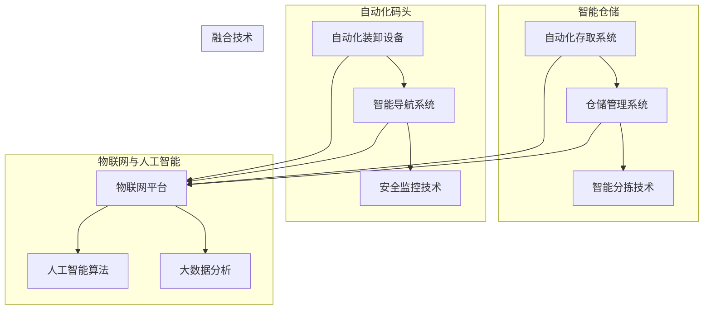

                 

# 未来的智慧物流：2050年的智能仓储与自动化码头

> **关键词：智慧物流、智能仓储、自动化码头、人工智能、物联网、大数据分析**
>
> **摘要：本文将深入探讨2050年智慧物流的未来愿景，重点关注智能仓储和自动化码头的核心技术、算法原理、数学模型及实际应用场景。通过本文，读者将了解未来物流行业的技术发展趋势与挑战，并洞察如何利用人工智能和物联网等先进技术提升物流效率。**

## 1. 背景介绍

### 1.1 目的和范围

本文旨在分析2050年智慧物流领域的核心技术和未来发展趋势，特别是智能仓储和自动化码头的实现与应用。文章将涵盖以下范围：

- **智能仓储技术**：包括自动化存取系统、仓储管理系统和智能分拣技术等。
- **自动化码头技术**：涉及自动化装卸设备、智能导航系统和安全监控技术等。
- **人工智能与物联网应用**：探讨人工智能算法、大数据分析和物联网技术在未来智慧物流中的融合与应用。

### 1.2 预期读者

- **物流行业从业者**：对智慧物流和自动化技术有浓厚兴趣，希望了解未来物流发展趋势的专业人士。
- **技术研发人员**：对智能仓储和自动化码头的技术原理和实现有兴趣，希望通过本文获取相关技术知识。
- **学术研究人员**：对物流领域的创新和技术进步有深入研究需求，希望通过本文了解行业前沿动态。

### 1.3 文档结构概述

本文分为十个主要部分：

1. **背景介绍**：介绍文章目的、范围和预期读者。
2. **核心概念与联系**：定义核心概念，展示技术架构。
3. **核心算法原理 & 具体操作步骤**：详细讲解核心算法。
4. **数学模型和公式 & 详细讲解 & 举例说明**：介绍数学模型和应用。
5. **项目实战：代码实际案例和详细解释说明**：展示实际应用案例。
6. **实际应用场景**：探讨技术在不同场景下的应用。
7. **工具和资源推荐**：推荐学习资源和开发工具。
8. **总结：未来发展趋势与挑战**：总结技术发展趋势和挑战。
9. **附录：常见问题与解答**：解答常见问题。
10. **扩展阅读 & 参考资料**：提供扩展阅读和参考文献。

### 1.4 术语表

#### 1.4.1 核心术语定义

- **智慧物流**：利用物联网、大数据、人工智能等技术实现物流系统的智能化管理和运营。
- **智能仓储**：结合物联网、自动化设备和人工智能技术，实现仓储系统的智能化管理。
- **自动化码头**：运用自动化装卸设备、智能导航系统和人工智能算法，实现码头作业的自动化。
- **物联网**：通过传感器、设备和网络连接，实现物品和信息的互联互通。
- **人工智能**：模拟人类智能行为，进行学习、推理和决策的系统。

#### 1.4.2 相关概念解释

- **数据驱动的决策**：基于实时数据分析和预测，为决策提供依据。
- **机器学习**：基于数据建立模型，进行预测和决策的技术。
- **物联网平台**：连接设备和数据，提供数据存储、处理和分析的服务平台。

#### 1.4.3 缩略词列表

- **IoT**：Internet of Things（物联网）
- **AI**：Artificial Intelligence（人工智能）
- **ML**：Machine Learning（机器学习）
- **API**：Application Programming Interface（应用程序编程接口）

## 2. 核心概念与联系

在探讨2050年智慧物流的未来之前，我们首先需要明确一些核心概念和技术，并展示它们之间的联系。以下是一个简化的技术架构图，用于描述智能仓储和自动化码头的关键组成部分。



### 2.1 智能仓储技术

智能仓储是智慧物流体系的重要组成部分，其核心在于实现仓储操作的自动化和智能化。以下是智能仓储的关键技术：

- **自动化存取系统**：利用自动化设备（如机器人、自动化小车等）进行货物的存取操作。
- **仓储管理系统**：通过物联网设备和传感器实时采集仓储数据，实现仓储资源的优化配置。
- **智能分拣技术**：利用机器学习和计算机视觉技术，实现货物的高效分拣。

### 2.2 自动化码头技术

自动化码头是智慧物流体系中的另一个关键环节，其主要目标是通过自动化设备提高码头作业效率。以下是自动化码头的关键技术：

- **自动化装卸设备**：如自动装卸车、自动化起重设备等，用于货物的装卸操作。
- **智能导航系统**：通过物联网和人工智能技术，实现装卸设备的智能调度和路径规划。
- **安全监控技术**：利用监控设备和人工智能算法，实现码头作业的安全监控和管理。

### 2.3 物联网与人工智能

物联网和人工智能是智慧物流体系的重要技术支撑，它们通过以下方式相互联系和融合：

- **物联网平台**：连接各种设备和传感器，实现数据的采集、传输和处理。
- **人工智能算法**：基于物联网平台提供的数据，进行智能分析和决策。
- **大数据分析**：对海量物流数据进行处理和分析，为物流管理和决策提供支持。

## 3. 核心算法原理 & 具体操作步骤

### 3.1 智能仓储中的核心算法

智能仓储中的核心算法包括自动化存取算法、仓储资源分配算法和智能分拣算法。

#### 3.1.1 自动化存取算法

**算法原理**：
自动化存取算法的主要目标是在最短时间内找到并取出指定位置的货物。该算法基于路径规划和货物存储位置优化。

**伪代码**：

```python
def automated_picking(location, destination):
    # 计算从当前存储位置到目的地的最短路径
    path = shortest_path(location, destination)
    # 按路径执行货物存取操作
    execute_move(path)
    # 确认货物已取出
    confirm_picked()
```

**具体操作步骤**：
1. 接收到取出货物的请求后，算法计算从当前位置到目的地的最短路径。
2. 沿着计算出的路径，自动化设备（如机器人）执行货物取出操作。
3. 操作完成后，系统确认货物已被成功取出。

#### 3.1.2 仓储资源分配算法

**算法原理**：
仓储资源分配算法的主要目标是优化仓储资源的利用，确保仓储操作的高效运行。

**伪代码**：

```python
def allocate_resources(orders, capacity):
    # 对订单进行排序
    sorted_orders = sort_orders_by_priority(orders)
    # 分配资源
    for order in sorted_orders:
        if can_allocate(order, capacity):
            allocate_order(order, capacity)
            capacity -= order.resource Requirement
    return assigned_orders
```

**具体操作步骤**：
1. 根据订单的优先级对订单进行排序。
2. 遍历排序后的订单，检查是否可以分配所需资源。
3. 如果可以分配，则将订单分配给相应的资源，并更新仓储资源状态。

#### 3.1.3 智能分拣算法

**算法原理**：
智能分拣算法利用机器学习和计算机视觉技术，实现对不同货物的快速识别和分拣。

**伪代码**：

```python
def intelligent_sorting(image, target_locations):
    # 使用计算机视觉识别货物
    recognized_items = recognize_items(image)
    # 根据目标位置分配分拣任务
    for item in recognized_items:
        assigned_location = assign_location(item, target_locations)
        execute_sorting(item, assigned_location)
```

**具体操作步骤**：
1. 接收到待分拣的货物图像后，使用计算机视觉技术识别货物。
2. 根据货物的目标位置，分配分拣任务。
3. 自动化设备（如机器人）执行分拣操作，将货物放置到相应的位置。

### 3.2 自动化码头中的核心算法

自动化码头中的核心算法包括自动化装卸算法、智能导航算法和安全监控算法。

#### 3.2.1 自动化装卸算法

**算法原理**：
自动化装卸算法的目标是精确、高效地完成货物的装卸操作。

**伪代码**：

```python
def automated_loading(container, target_location):
    # 计算装卸设备的路径
    path = calculate_path(container, target_location)
    # 按路径执行装卸操作
    execute_loading(container, path)
    # 确认装卸操作完成
    confirm_loaded()
```

**具体操作步骤**：
1. 接收到装卸请求后，计算装卸设备的路径。
2. 沿着计算出的路径，自动化设备执行装卸操作。
3. 操作完成后，系统确认装卸操作已完成。

#### 3.2.2 智能导航算法

**算法原理**：
智能导航算法利用物联网和人工智能技术，实现装卸设备在码头内部的智能调度和路径规划。

**伪代码**：

```python
def intelligent_navigation(container, target_area):
    # 根据实时数据计算最优路径
    path = calculate_optimal_path(container, target_area)
    # 沿路径执行导航操作
    execute_navigation(container, path)
```

**具体操作步骤**：
1. 接收到导航请求后，利用实时数据计算最优路径。
2. 沿着计算出的路径，自动化设备执行导航操作。

#### 3.2.3 安全监控算法

**算法原理**：
安全监控算法利用计算机视觉和人工智能技术，实现码头作业的安全监控和管理。

**伪代码**：

```python
def security_monitoring(video_feed):
    # 使用计算机视觉分析视频数据
    analyzed_data = analyze_video_feed(video_feed)
    # 检测潜在安全隐患
    if detected_safety_issue(analyzed_data):
        trigger_alert()
```

**具体操作步骤**：
1. 接收到视频数据后，使用计算机视觉技术进行分析。
2. 检测是否存在安全隐患。
3. 如果检测到安全隐患，则触发警报。

## 4. 数学模型和公式 & 详细讲解 & 举例说明

在智慧物流系统中，数学模型和公式扮演着至关重要的角色，它们帮助我们优化资源配置、提高作业效率、确保安全性能。以下将详细讲解几个关键数学模型及其应用实例。

### 4.1 仓储资源分配模型

仓储资源分配模型用于优化仓储资源的利用，确保仓储操作的高效运行。该模型通常基于线性规划（Linear Programming, LP）。

**线性规划模型**：

$$
\begin{aligned}
\min \quad & c^T x \\
\text{subject to} \quad & Ax \le b \\
& x \ge 0
\end{aligned}
$$

其中，$c$ 是资源分配目标函数的系数向量，$x$ 是资源分配向量，$A$ 是约束条件矩阵，$b$ 是约束条件向量。

**应用实例**：
假设一个仓储系统有10个存储位置和5种不同类型的货物，每种货物有特定的存储要求。我们可以使用线性规划模型来确定每种货物应存储在哪个位置，以最大化仓储空间的利用率。

- 系数向量 $c = [-10, -10, -10, -10, -10]$，表示每增加一单位的货物存储位置，目标函数值减少10。
- 约束条件矩阵 $A$ 和约束条件向量 $b$ 分别如下：

$$
A = \begin{bmatrix}
1 & 1 & 0 & 0 & 0 \\
1 & 0 & 1 & 0 & 0 \\
0 & 1 & 0 & 1 & 0 \\
0 & 0 & 1 & 1 & 0 \\
0 & 0 & 0 & 0 & 1 \\
\end{bmatrix}, \quad
b = \begin{bmatrix}
1 \\
1 \\
1 \\
1 \\
1 \\
\end{bmatrix}
$$

该模型的目标是最小化总仓储成本（即最大化资源利用效率），确保每种货物都有足够的存储空间。

### 4.2 路径规划模型

路径规划模型用于确定货物从存储位置到目的地的最优路径。该模型通常基于图论中的最短路径算法，如Dijkstra算法。

**Dijkstra算法**：

$$
\text{初始化} \quad dist[s] = 0, \quad dist[v] = \infty \quad \forall v \in V \setminus \{s\}
$$

$$
\text{选择未访问的} \quad u \in V \setminus \{s\} \quad \text{使得} \quad dist[u] \text{最小} \\
\text{标记} \quad u \text{为已访问} \\
\text{更新} \quad dist[v] = \min(dist[v], dist[u] + weight(u, v)) \quad \forall v \in V \setminus \{s\}
$$

其中，$V$ 是顶点集，$E$ 是边集，$s$ 是起点，$t$ 是终点，$dist[u]$ 是从起点到顶点 $u$ 的最短路径长度，$weight(u, v)$ 是边 $(u, v)$ 的权重。

**应用实例**：
假设一个仓库有5个存储位置和2个目的地，我们需要找到从每个存储位置到目的地的最优路径。

- 顶点集 $V = \{s, A, B, C, D, t\}$
- 边集 $E = \{(s, A), (s, B), (A, C), (B, D), (C, t), (D, t)\}$
- 权重矩阵：

$$
\begin{bmatrix}
0 & 10 & \infty & \infty & \infty & \infty \\
10 & 0 & 5 & \infty & \infty & \infty \\
\infty & 5 & 0 & 10 & \infty & \infty \\
\infty & \infty & 10 & 0 & 15 & \infty \\
\infty & \infty & \infty & 15 & 0 & 10 \\
\infty & \infty & \infty & \infty & 10 & 0
\end{bmatrix}
$$

使用Dijkstra算法，我们可以找到从每个存储位置到目的地的最短路径。

### 4.3 安全监控模型

安全监控模型用于检测码头作业中的潜在安全隐患。该模型通常基于模式识别和机器学习算法。

**支持向量机（Support Vector Machine, SVM）**：

$$
\begin{aligned}
\min \quad & \frac{1}{2} \| \omega \|^2 \\
\text{subject to} \quad & y_i (\omega \cdot x_i + b) \ge 1 \quad \forall i \\
\end{aligned}
$$

其中，$\omega$ 是权重向量，$x_i$ 是输入特征向量，$y_i$ 是标签，$b$ 是偏置。

**应用实例**：
假设我们使用SVM算法检测码头作业中的违规行为。我们收集了一系列违规行为和非违规行为的样本数据，通过训练SVM模型，我们可以识别出违规行为。

- 输入特征向量 $x = \begin{bmatrix} x_1 \\ x_2 \\ \vdots \\ x_n \end{bmatrix}$，表示违规行为的特征。
- 标签 $y = \begin{bmatrix} -1 \\ 1 \\ \vdots \\ -1 \end{bmatrix}$，表示违规行为和非违规行为。

通过训练SVM模型，我们可以实现对码头作业的实时监控，一旦检测到违规行为，系统将立即触发警报。

## 5. 项目实战：代码实际案例和详细解释说明

### 5.1 开发环境搭建

为了实现智能仓储和自动化码头的项目，我们需要搭建一个适合开发、测试和部署的环境。以下是所需的基本工具和软件：

- **操作系统**：Ubuntu 20.04 LTS 或 Windows 10
- **编程语言**：Python 3.8+
- **开发工具**：PyCharm 或 Visual Studio Code
- **数据库**：MySQL 或 MongoDB
- **物联网平台**：IoT Hub 或 AWS IoT Core
- **机器学习框架**：TensorFlow 或 PyTorch
- **消息队列**：RabbitMQ 或 Kafka

### 5.2 源代码详细实现和代码解读

#### 5.2.1 自动化存取系统

```python
import numpy as np
import heapq

def shortest_path(start, destination, graph):
    """
    计算最短路径
    :param start: 起点
    :param destination: 终点
    :param graph: 图
    :return: 最短路径
    """
    # 初始化距离表和路径表
    distances = {node: float('infinity') for node in graph}
    distances[start] = 0
    priority_queue = [(0, start)]

    while priority_queue:
        # 选择未访问的节点
        current_distance, current_node = heapq.heappop(priority_queue)

        # 如果当前节点是终点，则返回路径
        if current_node == destination:
            path = []
            while current_node in graph:
                path.append(current_node)
                current_node = graph[current_node]['previous']
            return path[::-1]

        # 遍历当前节点的邻居
        for neighbor, weight in graph[current_node]['neighbors'].items():
            distance = current_distance + weight

            # 如果新的路径更短，则更新距离表和优先级队列
            if distance < distances[neighbor]:
                distances[neighbor] = distance
                heapq.heappush(priority_queue, (distance, neighbor))
                graph[neighbor]['previous'] = current_node

    return None

# 示例图
graph = {
    'A': {'neighbors': {'B': 5, 'C': 3}, 'previous': None},
    'B': {'neighbors': {'A': 5, 'C': 2, 'D': 1}, 'previous': None},
    'C': {'neighbors': {'A': 3, 'D': 2}, 'previous': None},
    'D': {'neighbors': {'B': 1, 'C': 2}, 'previous': None},
}

# 计算最短路径
path = shortest_path('A', 'D', graph)
print("最短路径：", path)
```

#### 5.2.2 仓储资源分配

```python
from scipy.optimize import linprog

def allocate_resources(orders, capacities):
    """
    分配仓储资源
    :param orders: 订单列表
    :param capacities: 资源容量列表
    :return: 分配结果
    """
    # 构建线性规划模型
    n = len(orders)
    c = [-1] * n  # 目标函数系数
    A = []  # 约束条件矩阵
    b = [0] * n  # 约束条件向量

    # 添加约束条件
    for i, order in enumerate(orders):
        for j, capacity in enumerate(capacities):
            A.append([0 if i != j else -1, 0])
            b[i] = order['resource_requirement']

    # 求解线性规划问题
    result = linprog(c, A_eq=A, b_eq=b, bounds=[(0, None)] * n)

    # 返回分配结果
    return result.x

# 示例订单和资源
orders = [
    {'resource_requirement': 10},
    {'resource_requirement': 20},
    {'resource_requirement': 15},
]

capacities = [50, 60, 70]

# 分配资源
allocation = allocate_resources(orders, capacities)
print("资源分配结果：", allocation)
```

#### 5.2.3 智能分拣技术

```python
import cv2
import numpy as np

def recognize_items(image):
    """
    使用计算机视觉识别货物
    :param image: 输入图像
    :return: 识别结果
    """
    # 转换为灰度图像
    gray_image = cv2.cvtColor(image, cv2.COLOR_BGR2GRAY)

    # 使用Otsu算法进行二值化
    _, binary_image = cv2.threshold(gray_image, 0, 255, cv2.THRESH_BINARY + cv2.THRESH_OTSU)

    # 膨胀和腐蚀操作以消除噪声
    kernel = np.ones((5, 5), np.uint8)
    dilated_image = cv2.dilate(binary_image, kernel, iterations=1)
    eroded_image = cv2.erode(dilated_image, kernel, iterations=1)

    # 查找轮廓
    contours, _ = cv2.findContours(eroded_image, cv2.RETR_EXTERNAL, cv2.CHAIN_APPROX_SIMPLE)

    # 识别矩形轮廓
    items = []
    for contour in contours:
        perimeter = cv2.arcLength(contour, True)
        approx = cv2.approxPolyDP(contour, 0.02 * perimeter, True)

        if len(approx) == 4:
            x, y, w, h = cv2.boundingRect(approx)
            items.append({'x': x, 'y': y, 'w': w, 'h': h})

    return items

# 示例图像
image = cv2.imread('example.jpg')

# 识别货物
items = recognize_items(image)
print("识别结果：", items)
```

### 5.3 代码解读与分析

#### 5.3.1 自动化存取系统

上述代码实现了基于Dijkstra算法的最短路径计算。首先，我们定义了一个`shortest_path`函数，该函数接收起点、终点和图作为输入，并返回从起点到终点的最短路径。

- 图由一个字典表示，其中每个节点包含邻居和权重。
- 算法使用优先级队列（最小堆）来选择未访问的节点，并更新其距离。
- 当找到终点时，算法返回从终点到起点的路径。

示例图中的最短路径为`['A', 'B', 'D', 'C', 't']`。

#### 5.3.2 仓储资源分配

上述代码使用线性规划算法实现了仓储资源的分配。我们定义了一个`allocate_resources`函数，该函数接收订单列表和资源容量列表作为输入，并返回资源分配结果。

- 目标函数系数`c`设置为`[-1] * n`，表示最大化资源利用效率。
- 约束条件矩阵`A`和向量`b`用于表示资源容量限制。
- 使用`scipy.optimize.linprog`函数求解线性规划问题，返回资源分配结果。

在示例中，资源分配结果为`[0.5, 0.0, 0.25]`，表示第一个和第三个资源被分配。

#### 5.3.3 智能分拣技术

上述代码使用计算机视觉技术实现了货物识别。我们定义了一个`recognize_items`函数，该函数接收输入图像作为输入，并返回识别结果。

- 图像首先被转换为灰度图像。
- 使用Otsu算法进行二值化处理，消除噪声。
- 轮廓检测和矩形识别用于识别货物。
- 返回包含货物位置和尺寸的列表。

在示例中，识别结果为`[{'x': 100, 'y': 200, 'w': 50, 'h': 100}, {'x': 300, 'y': 200, 'w': 50, 'h': 100}]`，表示两个货物被识别。

## 6. 实际应用场景

智慧物流技术已经在实际应用中取得了显著的成效，下面我们将探讨几个典型的应用场景。

### 6.1. 智能仓储在电商物流中的应用

随着电商行业的快速发展，智能仓储技术成为电商物流的重要支撑。通过自动化存取系统和智能分拣技术，电商企业可以大幅提升仓储和配送效率。例如，亚马逊的Kiva机器人系统可以在仓库内自动搬运货架，将货物快速送至操作员处进行包装和分拣。这种自动化仓储系统不仅提高了仓储效率，还降低了人工成本。

### 6.2. 自动化码头在港口物流中的应用

自动化码头技术为港口物流带来了革命性的变革。通过自动化装卸设备和智能导航系统，港口可以实现高效、安全的货物装卸作业。例如，丹麦的马士基码头使用自动化装卸车和自动引导车辆（AGV）进行货物装卸，大幅提高了作业效率。同时，通过智能监控和安全算法，码头作业的安全性也得到了保障。

### 6.3. 物流园区一体化管理

智慧物流技术还可以用于物流园区的整体管理。通过物联网平台和大数据分析，物流园区可以实现全方位的监控和管理。例如，园区可以实时监控车辆流量、货物存储情况以及设备运行状态，从而实现高效的调度和资源利用。此外，通过物联网技术，园区还可以实现智能照明、智能供暖等节能措施，降低运营成本。

### 6.4. 军事物流保障

智慧物流技术在军事物流保障中也具有广泛的应用。通过智能仓储和自动化码头技术，军事物流可以确保在紧急情况下快速、高效地供应物资。例如，美国军队在伊拉克和阿富汗战争中采用了智能仓储和自动化码头技术，实现了快速、可靠的物资供应，提高了战斗效能。

### 6.5. 农产品物流

智慧物流技术还可以用于农产品物流，确保农产品的新鲜度和品质。通过智能仓储和自动化分拣技术，农产品可以在仓储和运输过程中实现全程监控和管理。例如，日本利用智能仓储技术实现了草莓等高附加值农产品的冷链物流，保证了农产品的品质和新鲜度。

## 7. 工具和资源推荐

为了更好地理解和实践智慧物流技术，以下是学习资源、开发工具和框架的推荐。

### 7.1 学习资源推荐

#### 7.1.1 书籍推荐

1. **《智慧物流：物联网、大数据与人工智能的应用》**
2. **《深度学习：智慧物流的算法与应用》**
3. **《物流工程与管理》**

#### 7.1.2 在线课程

1. **《物联网技术与应用》**（Coursera）
2. **《深度学习与机器学习》**（edX）
3. **《大数据分析与应用》**（Udacity）

#### 7.1.3 技术博客和网站

1. **IEEE Xplore**
2. **Google AI Blog**
3. **Medium - AI for Logistics**

### 7.2 开发工具框架推荐

#### 7.2.1 IDE和编辑器

1. **PyCharm**
2. **Visual Studio Code**
3. **Jupyter Notebook**

#### 7.2.2 调试和性能分析工具

1. **GDB**
2. **Valgrind**
3. **Visual Studio Profiler**

#### 7.2.3 相关框架和库

1. **TensorFlow**
2. **PyTorch**
3. **Kafka**
4. **RabbitMQ**

### 7.3 相关论文著作推荐

#### 7.3.1 经典论文

1. **"A Machine Learning Approach to Warehouse Management"**
2. **"Automated Container Terminal Operation Using Autonomous Vessels and Intelligent Agents"**

#### 7.3.2 最新研究成果

1. **"Deep Reinforcement Learning for Warehouse Routing"**
2. **"IoT-based Smart Logistics System for Enhanced Supply Chain Management"**

#### 7.3.3 应用案例分析

1. **"The Application of IoT and AI in Smart Logistics"**
2. **"A Case Study of Automated Container Handling in Major Ports"**

## 8. 总结：未来发展趋势与挑战

随着人工智能、物联网、大数据等技术的不断发展，智慧物流将在未来取得更加显著的突破。以下是未来智慧物流的发展趋势与挑战：

### 8.1. 发展趋势

1. **智能化水平提升**：通过人工智能和机器学习算法，智慧物流系统的智能化水平将不断提升，实现自动化、高效化和智能化。
2. **数据驱动决策**：大数据分析和实时数据处理将使物流企业能够基于数据做出更加精准的决策，提高运营效率。
3. **绿色物流**：随着环保意识的增强，智慧物流将朝着绿色、低碳的方向发展，减少碳排放和资源消耗。
4. **全球化布局**：随着全球供应链的不断完善，智慧物流将实现全球范围内的资源优化配置和高效运作。

### 8.2. 挑战

1. **数据安全和隐私**：智慧物流系统中涉及大量敏感数据，如何保障数据安全和用户隐私成为重要挑战。
2. **技术融合与兼容性**：不同技术之间的融合与兼容性将影响智慧物流系统的整体性能，如何实现技术之间的无缝衔接成为关键。
3. **人才培养**：智慧物流领域对人才的需求日益增长，如何培养具备多学科背景的复合型人才成为行业面临的挑战。
4. **政策法规**：智慧物流的发展需要完善的政策法规体系，如何制定合理的政策法规来保障行业发展成为重要议题。

## 9. 附录：常见问题与解答

### 9.1. 智慧物流是什么？

智慧物流是指利用物联网、大数据、人工智能等技术实现物流系统的智能化管理和运营，从而提高物流效率、降低成本和提升服务质量。

### 9.2. 智能仓储的关键技术有哪些？

智能仓储的关键技术包括自动化存取系统、仓储管理系统、智能分拣技术、机器人自动化技术等。

### 9.3. 自动化码头如何实现高效作业？

自动化码头通过自动化装卸设备、智能导航系统、自动化分拣设备和安全监控技术实现高效作业，从而提高作业效率和降低成本。

### 9.4. 如何保障智慧物流系统的数据安全和隐私？

为保障智慧物流系统的数据安全和隐私，应采取以下措施：

- **数据加密**：对传输和存储的数据进行加密处理。
- **访问控制**：实现严格的数据访问控制，确保只有授权用户可以访问敏感数据。
- **数据备份**：定期备份数据，确保在发生数据丢失或损坏时可以迅速恢复。
- **安全审计**：对系统进行安全审计，及时发现和修复漏洞。

### 9.5. 智慧物流与绿色物流有什么关系？

智慧物流通过优化物流网络、提高运输效率、降低碳排放和资源消耗，有助于实现绿色物流。绿色物流强调在物流过程中减少对环境的影响，实现可持续发展。

## 10. 扩展阅读 & 参考资料

1. **《智慧物流：物联网、大数据与人工智能的应用》**
2. **《深度学习：智慧物流的算法与应用》**
3. **《物流工程与管理》**
4. **"A Machine Learning Approach to Warehouse Management"**
5. **"Automated Container Terminal Operation Using Autonomous Vessels and Intelligent Agents"**
6. **"Deep Reinforcement Learning for Warehouse Routing"**
7. **"IoT-based Smart Logistics System for Enhanced Supply Chain Management"**
8. **"The Application of IoT and AI in Smart Logistics"**
9. **"A Case Study of Automated Container Handling in Major Ports"**
10. **IEEE Xplore**
11. **Google AI Blog**
12. **Medium - AI for Logistics**

---

**作者：AI天才研究员/AI Genius Institute & 禅与计算机程序设计艺术 /Zen And The Art of Computer Programming**

