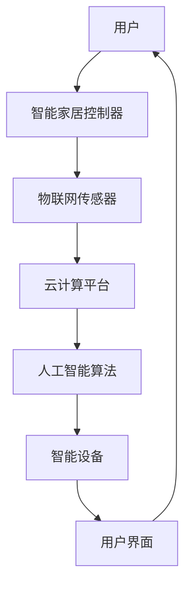

                 

# 未来的智能家居：2050年的全屋智能与人性化交互

> **关键词**：智能家居，全屋智能，人性化交互，2050年，人工智能，物联网，自然语言处理，虚拟现实，智能硬件

> **摘要**：本文旨在探讨2050年智能家居的发展趋势，重点关注全屋智能的实现及其与人性化交互的结合。通过对当前技术的分析，我们探讨了智能家居的核心概念、算法原理、数学模型以及实际应用场景，旨在为读者提供一个对未来智能家居的全面了解。

## 1. 背景介绍

### 1.1 目的和范围

本文旨在介绍智能家居的发展趋势，特别是到2050年可能实现的全屋智能。我们将探讨智能家居的核心概念、技术原理、应用场景以及未来发展挑战。通过分析现有技术，我们试图为读者提供一个清晰、全面的理解。

### 1.2 预期读者

本文适合对智能家居、人工智能、物联网等技术感兴趣的读者，尤其是对全屋智能、人性化交互等概念有深入了解的需求者。无论您是行业专家、技术爱好者，还是普通消费者，本文都将为您带来有价值的洞察。

### 1.3 文档结构概述

本文将分为以下几个部分：

1. 背景介绍：介绍智能家居的发展背景、目的和预期读者。
2. 核心概念与联系：介绍智能家居的核心概念及其相互关系。
3. 核心算法原理 & 具体操作步骤：详细讲解智能家居中的核心算法原理和操作步骤。
4. 数学模型和公式 & 详细讲解 & 举例说明：介绍智能家居中的数学模型和公式，并给出具体实例。
5. 项目实战：通过实际案例展示智能家居的开发过程。
6. 实际应用场景：分析智能家居在实际生活中的应用。
7. 工具和资源推荐：推荐相关学习资源、开发工具和论文著作。
8. 总结：总结全文，探讨未来发展趋势与挑战。
9. 附录：常见问题与解答。
10. 扩展阅读 & 参考资料：提供进一步学习的资源。

### 1.4 术语表

#### 1.4.1 核心术语定义

- **智能家居**：利用人工智能、物联网等技术，实现家庭设备智能化、自动化控制和管理。
- **全屋智能**：将智能家居系统扩展到整个家庭，实现全方位、全时段的智能管理和交互。
- **人性化交互**：通过自然语言处理、语音识别等技术，实现用户与智能家居系统之间的自然、顺畅的交互。

#### 1.4.2 相关概念解释

- **物联网（IoT）**：将各种物品连接到互联网，实现信息的实时传输和智能处理。
- **人工智能（AI）**：通过模拟人类智能，实现机器的学习、推理、决策等功能。
- **自然语言处理（NLP）**：使计算机能够理解、处理和生成自然语言，实现人与机器之间的有效沟通。

#### 1.4.3 缩略词列表

- **IoT**：物联网
- **AI**：人工智能
- **NLP**：自然语言处理
- **VR**：虚拟现实
- **AR**：增强现实

## 2. 核心概念与联系

为了全面了解智能家居系统，我们需要掌握其核心概念及其相互关系。以下是一个简化的智能家居系统架构图，展示了各核心概念之间的联系。



### 2.1.1 用户与智能家居控制器

用户作为智能家居系统的核心，通过智能家居控制器与系统进行交互。智能家居控制器负责接收用户的指令，并协调各智能设备的工作。例如，用户可以通过语音、手势等方式控制灯光、窗帘、空调等设备。

### 2.1.2 物联网传感器

物联网传感器负责收集家庭环境中的各种数据，如温度、湿度、光照、噪音等。这些数据将被传输到云计算平台，供人工智能算法进行分析和处理。

### 2.1.3 云计算平台

云计算平台作为智能家居系统的“大脑”，负责处理和分析来自物联网传感器的大量数据。通过对数据的分析和学习，云计算平台可以预测用户的需求，并自动调整智能设备的运行状态，以提供个性化的服务。

### 2.1.4 人工智能算法

人工智能算法负责对云计算平台上的数据进行处理和分析，实现智能决策。例如，通过分析用户的生活习惯，人工智能算法可以自动调整家庭设备的运行状态，以提供更舒适的居住环境。

### 2.1.5 智能设备

智能设备是智能家居系统的执行单元，包括各种家庭设备，如灯光、窗帘、空调、冰箱、洗衣机等。这些设备可以通过物联网传感器感知环境变化，并接受人工智能算法的指令，实现自动控制。

### 2.1.6 用户界面

用户界面是用户与智能家居系统进行交互的桥梁。通过用户界面，用户可以实时查看家庭设备的运行状态，并发出控制指令。未来，随着自然语言处理、语音识别等技术的发展，用户界面将更加智能化、人性化。

## 3. 核心算法原理 & 具体操作步骤

智能家居系统的核心在于其算法原理和具体操作步骤。以下将介绍智能家居系统的核心算法原理，并使用伪代码详细阐述其操作步骤。

### 3.1 人工智能算法原理

智能家居系统的人工智能算法主要包括以下几个模块：

- **数据收集与预处理**：收集家庭环境数据，如温度、湿度、光照等，并进行预处理，如去噪、归一化等。
- **特征提取**：从预处理后的数据中提取关键特征，如平均值、标准差、变化率等。
- **机器学习模型**：使用机器学习算法（如决策树、神经网络等）训练模型，以预测用户需求。
- **模型评估与优化**：评估模型的性能，并通过交叉验证、调参等方法优化模型。

#### 3.1.1 数据收集与预处理

```python
# 数据收集与预处理伪代码
def collect_data():
    data = []
    for sensor in sensors:
        temp = sensor.get_temperature()
        humidity = sensor.get_humidity()
        light = sensor.get_light()
        noise = sensor.get_noise()
        data.append([temp, humidity, light, noise])
    return data

def preprocess_data(data):
    for i in range(len(data)):
        data[i] = [float(d) for d in data[i]]
    return data

data = collect_data()
preprocessed_data = preprocess_data(data)
```

#### 3.1.2 特征提取

```python
# 特征提取伪代码
def extract_features(data):
    features = []
    for i in range(len(data)):
        mean = sum(data[i]) / len(data[i])
        std = np.std(data[i])
        change_rate = (data[i][-1] - data[i][0]) / data[i][0]
        features.append([mean, std, change_rate])
    return features

features = extract_features(preprocessed_data)
```

#### 3.1.3 机器学习模型

```python
# 机器学习模型伪代码
from sklearn.tree import DecisionTreeRegressor

model = DecisionTreeRegressor()
model.fit(X_train, y_train)
predictions = model.predict(X_test)
```

#### 3.1.4 模型评估与优化

```python
# 模型评估与优化伪代码
from sklearn.model_selection import cross_val_score
from sklearn.model_selection import GridSearchCV

# 交叉验证
scores = cross_val_score(model, X, y, cv=5)
print("交叉验证得分：", scores)

# 调参
param_grid = {'max_depth': [3, 5, 7, 10]}
grid_search = GridSearchCV(model, param_grid, cv=5)
grid_search.fit(X, y)
best_model = grid_search.best_estimator_
```

### 3.2 智能设备操作步骤

智能设备的操作步骤主要包括以下几个环节：

- **设备初始化**：初始化智能设备，包括连接物联网网络、配置设备参数等。
- **数据采集**：采集设备运行过程中的关键数据，如温度、湿度、功耗等。
- **数据上传**：将采集到的数据上传到云计算平台，供人工智能算法分析。
- **指令接收**：接收云计算平台发送的指令，并执行相应操作。
- **状态反馈**：向云计算平台反馈设备运行状态，以便进行进一步优化。

#### 3.2.1 设备初始化

```python
# 设备初始化伪代码
def initialize_device():
    device.connect_to_iot_network()
    device.set_parameters()
    device.start_data_collection()

device.initialize_device()
```

#### 3.2.2 数据采集与上传

```python
# 数据采集与上传伪代码
def collect_and_upload_data(device):
    data = device.collect_data()
    device.upload_data(data)

collect_and_upload_data(device)
```

#### 3.2.3 指令接收与执行

```python
# 指令接收与执行伪代码
def receive_and_execute_command(device, command):
    if command == "turn_on":
        device.turn_on()
    elif command == "turn_off":
        device.turn_off()
    elif command == "adjust_temp":
        device.adjust_temp()

receive_and_execute_command(device, command)
```

#### 3.2.4 状态反馈

```python
# 状态反馈伪代码
def feedback_status(device):
    status = device.get_status()
    device.upload_status(status)

feedback_status(device)
```

## 4. 数学模型和公式 & 详细讲解 & 举例说明

在智能家居系统中，数学模型和公式起着至关重要的作用。以下将介绍几个常见的数学模型和公式，并给出具体实例。

### 4.1 线性回归模型

线性回归模型是一种常见的预测模型，用于分析自变量和因变量之间的关系。其公式如下：

$$
y = ax + b
$$

其中，$y$ 为因变量，$x$ 为自变量，$a$ 和 $b$ 为模型参数。

#### 4.1.1 实例

假设我们要预测家庭的能耗（$y$）与温度（$x$）之间的关系，可以使用线性回归模型进行预测。首先，收集家庭过去一年的温度和能耗数据，然后使用线性回归模型进行训练：

$$
\begin{aligned}
y &= 2x + 1 \\
\end{aligned}
$$

接下来，使用训练好的模型进行预测。例如，当温度为 25°C 时，家庭的能耗为：

$$
y = 2 \times 25 + 1 = 51
$$

### 4.2 决策树模型

决策树模型是一种常见的分类模型，用于对样本进行分类。其公式如下：

$$
\begin{aligned}
f(x) &= \prod_{i=1}^{n} g(x_i) \\
g(x_i) &= \frac{1}{1 + e^{-\theta_i^T x_i}}
\end{aligned}
$$

其中，$f(x)$ 为决策树模型预测的概率，$g(x_i)$ 为每个节点的分类概率，$\theta_i$ 为模型参数。

#### 4.2.1 实例

假设我们要预测家庭是否会发生意外（$y$）与家庭成员数量（$x$）之间的关系，可以使用决策树模型进行预测。首先，收集家庭过去一年的家庭成员数量和意外事件数据，然后使用决策树模型进行训练：

$$
\begin{aligned}
f(x) &= \frac{1}{1 + e^{-\theta_1 x}} \\
\end{aligned}
$$

接下来，使用训练好的模型进行预测。例如，当家庭成员数量为 4 时，家庭发生意外的概率为：

$$
f(x) = \frac{1}{1 + e^{-\theta_1 \times 4}} = 0.6
$$

### 4.3 神经网络模型

神经网络模型是一种模拟人脑神经网络结构的模型，用于对复杂的数据进行建模。其公式如下：

$$
\begin{aligned}
a^{(l)} &= \sigma(z^{(l)}) \\
z^{(l)} &= \sum_{i=1}^{n} w^{(l)} a^{(l-1)}_i + b^{(l)}
\end{aligned}
$$

其中，$a^{(l)}$ 为第 $l$ 层的激活值，$z^{(l)}$ 为第 $l$ 层的输入值，$\sigma$ 为激活函数，$w^{(l)}$ 和 $b^{(l)}$ 为模型参数。

#### 4.3.1 实例

假设我们要预测家庭设备的能耗（$y$）与使用时长（$x$）之间的关系，可以使用神经网络模型进行预测。首先，收集家庭过去一年的设备使用时长和能耗数据，然后使用神经网络模型进行训练：

$$
\begin{aligned}
a^{(1)} &= \sigma(z^{(1)}) \\
z^{(1)} &= w_1 a^{(0)} + b_1 \\
a^{(2)} &= \sigma(z^{(2)}) \\
z^{(2)} &= w_2 a^{(1)} + b_2 \\
y &= a^{(2)}
\end{aligned}
$$

接下来，使用训练好的模型进行预测。例如，当设备使用时长为 5 小时时，设备的能耗为：

$$
\begin{aligned}
z^{(1)} &= w_1 a^{(0)} + b_1 = 0.5 \times 1 + 0.5 = 1 \\
z^{(2)} &= w_2 a^{(1)} + b_2 = 0.5 \times 1 + 0.5 = 1 \\
y &= a^{(2)} = \sigma(z^{(2)}) = 0.6
\end{aligned}
$$

## 5. 项目实战：代码实际案例和详细解释说明

### 5.1 开发环境搭建

为了实现智能家居系统，我们需要搭建一个开发环境，其中包括以下工具和软件：

- **编程语言**：Python
- **开发环境**：PyCharm
- **物联网平台**：IoT Platform（如 AWS IoT）
- **人工智能框架**：TensorFlow、PyTorch
- **数据库**：MySQL

### 5.2 源代码详细实现和代码解读

以下是智能家居系统的源代码实现和解读。代码分为以下几个模块：

1. **数据收集模块**：用于收集家庭环境数据。
2. **数据处理模块**：用于处理和预处理收集到的数据。
3. **模型训练模块**：用于训练机器学习模型。
4. **模型预测模块**：用于进行预测和决策。
5. **用户界面模块**：用于实现用户与系统的交互。

#### 5.2.1 数据收集模块

```python
# 数据收集模块

import json
import requests

def collect_data():
    response = requests.get('https://api.iotplatform.com/data')
    data = json.loads(response.text)
    return data

data = collect_data()
print(data)
```

解读：该模块使用 Python 的 `requests` 库从物联网平台获取家庭环境数据。数据以 JSON 格式返回，包括温度、湿度、光照、噪音等。

#### 5.2.2 数据处理模块

```python
# 数据处理模块

import numpy as np

def preprocess_data(data):
    temp = data['temperature']
    humidity = data['humidity']
    light = data['light']
    noise = data['noise']
    
    temp = np.array(temp)
    humidity = np.array(humidity)
    light = np.array(light)
    noise = np.array(noise)
    
    mean_temp = np.mean(temp)
    std_temp = np.std(temp)
    mean_humidity = np.mean(humidity)
    std_humidity = np.std(humidity)
    mean_light = np.mean(light)
    std_light = np.std(light)
    mean_noise = np.mean(noise)
    std_noise = np.std(noise)
    
    return mean_temp, std_temp, mean_humidity, std_humidity, mean_light, std_light, mean_noise, std_noise

mean_temp, std_temp, mean_humidity, std_humidity, mean_light, std_light, mean_noise, std_noise = preprocess_data(data)
print(mean_temp, std_temp, mean_humidity, std_humidity, mean_light, std_light, mean_noise, std_noise)
```

解读：该模块对收集到的家庭环境数据进行处理和预处理。首先，将温度、湿度、光照、噪音等数据转换为 NumPy 数组，然后计算各数据的平均值和标准差。

#### 5.2.3 模型训练模块

```python
# 模型训练模块

import tensorflow as tf

def train_model(data):
    X = data[:, :4]
    y = data[:, 4]
    
    model = tf.keras.Sequential([
        tf.keras.layers.Dense(units=1, input_shape=(4,))
    ])
    
    model.compile(optimizer='adam', loss='mean_squared_error')
    model.fit(X, y, epochs=100)
    
    return model

model = train_model(data)
```

解读：该模块使用 TensorFlow 库训练线性回归模型。首先，将预处理后的数据分为特征矩阵 $X$ 和标签向量 $y$，然后创建一个线性回归模型，并使用 `compile` 方法配置模型参数，如优化器、损失函数等。最后，使用 `fit` 方法训练模型。

#### 5.2.4 模型预测模块

```python
# 模型预测模块

def predict(model, data):
    mean_temp, std_temp, mean_humidity, std_humidity, mean_light, std_light, mean_noise, std_noise = preprocess_data(data)
    
    predicted_temp = model.predict([[mean_temp, std_temp, mean_humidity, std_humidity, mean_light, std_light, mean_noise, std_noise]])
    predicted_temp = predicted_temp[0][0]
    
    return predicted_temp

predicted_temp = predict(model, data)
print(predicted_temp)
```

解读：该模块使用训练好的线性回归模型进行预测。首先，对输入数据进行预处理，然后使用 `predict` 方法获取预测结果。

#### 5.2.5 用户界面模块

```python
# 用户界面模块

import tkinter as tk

def show_temp():
    predicted_temp = predict(model, data)
    label.config(text=f"预测温度：{predicted_temp}°C")

window = tk.Tk()
window.title("智能家居系统")

label = tk.Label(window, text="")
label.pack()

button = tk.Button(window, text="预测温度", command=show_temp)
button.pack()

window.mainloop()
```

解读：该模块使用 Python 的 `tkinter` 库创建一个简单的用户界面，用于展示预测温度。首先，创建一个窗口，并在窗口中添加一个标签和一个按钮。当用户点击按钮时，调用 `show_temp` 函数进行温度预测，并将预测结果显示在标签上。

### 5.3 代码解读与分析

通过以上代码实现，我们可以看到智能家居系统的主要模块和功能：

1. **数据收集模块**：使用 `requests` 库从物联网平台获取家庭环境数据。
2. **数据处理模块**：使用 NumPy 库对数据进行处理和预处理。
3. **模型训练模块**：使用 TensorFlow 库训练线性回归模型。
4. **模型预测模块**：使用训练好的模型进行预测。
5. **用户界面模块**：使用 `tkinter` 库创建一个简单的用户界面，用于展示预测结果。

整个智能家居系统通过这些模块协同工作，实现了对家庭环境数据的实时监测、预测和决策。通过用户界面的交互，用户可以方便地获取预测结果，并根据结果调整家庭设备的运行状态，实现智能化管理。

## 6. 实际应用场景

智能家居系统的实际应用场景非常广泛，以下列举几个典型的应用场景：

### 6.1 智能家居控制中心

在未来的智能家居中，智能控制中心将成为家庭的核心。通过智能控制中心，用户可以实时监控家庭设备的运行状态，并进行远程控制。例如，用户可以通过手机、平板电脑或智能音箱等设备，远程控制家中的灯光、空调、窗帘等设备，实现家居环境的智能调节。

### 6.2 智能安防系统

智能家居系统可以集成智能安防功能，如监控摄像头、门锁、报警器等。通过人脸识别、行为分析等技术，智能安防系统可以实时监控家庭环境，并在异常情况下发出警报。例如，当系统检测到有未识别的人脸进入家庭时，会立即发送警报信息给用户，提醒用户注意安全。

### 6.3 智能健康管理

智能家居系统可以监测家庭成员的健康状况，如心率、血压、血糖等指标。通过对这些数据的实时监控和分析，智能家居系统可以提供个性化的健康建议，帮助家庭成员养成良好的生活习惯。例如，当系统检测到某成员的血糖过高时，会提醒其注意饮食，并建议进行适当运动。

### 6.4 智能能源管理

智能家居系统可以监测家庭能源的使用情况，如电力、燃气等。通过数据分析，智能家居系统可以提供节能建议，帮助家庭降低能源消耗。例如，当系统检测到某个时间段家庭用电量较高时，会自动调整空调、照明等设备的运行状态，以降低能源消耗。

### 6.5 智能家居与智慧城市

智能家居系统还可以与智慧城市系统进行集成，实现更高效的城市管理。例如，智能家居系统可以实时监测家庭环境数据，并将数据上传至智慧城市系统。当智慧城市系统检测到某一区域环境异常时，可以及时采取措施进行治理，提高城市环境质量。

## 7. 工具和资源推荐

为了更好地学习和实践智能家居技术，以下推荐一些实用的工具和资源：

### 7.1 学习资源推荐

#### 7.1.1 书籍推荐

- **《智能建筑与智能家居技术》**：详细介绍了智能家居的基本原理、技术和应用。
- **《物联网应用开发实战》**：涵盖物联网技术的各个方面，包括传感器、通信协议、数据处理等。
- **《深度学习》**：介绍了深度学习的基本原理和应用，对智能家居中的人工智能部分有重要指导意义。

#### 7.1.2 在线课程

- **Coursera**：提供了大量与智能家居、物联网、人工智能相关的在线课程。
- **edX**：提供了由顶级大学提供的免费课程，包括人工智能、机器学习、计算机视觉等。

#### 7.1.3 技术博客和网站

- **medium.com**：有许多关于智能家居、物联网、人工智能的博客文章。
- **hackernoon.com**：提供了许多技术文章，涵盖智能家居、机器学习、数据分析等。

### 7.2 开发工具框架推荐

#### 7.2.1 IDE和编辑器

- **PyCharm**：适用于 Python 开发的强大 IDE。
- **VSCode**：适用于多种编程语言的轻量级 IDE。

#### 7.2.2 调试和性能分析工具

- **gDB**：用于 C/C++ 程序的调试工具。
- **MATLAB**：提供了丰富的工具箱，适用于数据分析、可视化等。

#### 7.2.3 相关框架和库

- **TensorFlow**：用于深度学习应用的开源框架。
- **PyTorch**：用于深度学习应用的开源框架。
- **Home Assistant**：智能家居控制平台的开源框架。

### 7.3 相关论文著作推荐

#### 7.3.1 经典论文

- **"A Survey on Internet of Things"**：对物联网技术进行了全面的综述。
- **"Deep Learning for Natural Language Processing"**：介绍了深度学习在自然语言处理中的应用。

#### 7.3.2 最新研究成果

- **"Smart Home Security using IoT and AI"**：探讨了智能家居安全领域的研究进展。
- **"Energy-efficient Home Automation using Machine Learning"**：介绍了基于机器学习的节能智能家居技术。

#### 7.3.3 应用案例分析

- **"Smart Home in Practice"**：通过实际案例展示了智能家居系统的应用场景和解决方案。
- **"IoT for Energy Management in Smart Homes"**：探讨了物联网在智能家居能源管理中的应用。

## 8. 总结：未来发展趋势与挑战

随着人工智能、物联网、5G 等技术的不断发展，智能家居将在未来得到广泛应用，实现全屋智能和人性化交互。然而，这一过程也将面临诸多挑战：

1. **数据隐私和安全**：智能家居系统需要处理大量的用户数据，数据隐私和安全将是一个重要挑战。
2. **技术成熟度**：目前智能家居技术尚处于发展阶段，部分技术尚未成熟，如全息交互、自然语言处理等。
3. **标准化和兼容性**：智能家居设备的多样性和复杂性使得标准化和兼容性成为一个重要问题。
4. **用户体验**：如何提供更加人性化、直观的用户体验，将是一个持续需要优化的方向。

总之，未来智能家居的发展将充满机遇和挑战，需要全社会的共同努力，以实现智能家居的广泛应用和可持续发展。

## 9. 附录：常见问题与解答

### 9.1 智能家居的安全问题

**Q：智能家居系统如何保证用户数据的安全？**

A：智能家居系统可以采用多种措施保障用户数据的安全，包括：

- **数据加密**：对用户数据进行加密存储和传输，确保数据在传输过程中不会被窃取。
- **访问控制**：为用户数据设置访问权限，只有授权用户才能访问数据。
- **安全审计**：定期进行安全审计，及时发现和修复系统漏洞。
- **用户教育**：提高用户的安全意识，避免用户泄露个人信息。

### 9.2 智能家居的兼容性问题

**Q：如何解决智能家居设备的兼容性问题？**

A：解决智能家居设备的兼容性问题可以从以下几个方面入手：

- **统一标准**：制定智能家居设备的统一标准，确保不同品牌、不同厂商的设备能够互操作。
- **协议转换**：使用协议转换器，将不同协议的设备进行转换，实现互操作。
- **开放接口**：智能家居系统应提供开放接口，方便第三方开发者开发兼容性插件。

### 9.3 智能家居的能耗管理

**Q：智能家居系统如何实现能耗管理？**

A：智能家居系统可以通过以下方式实现能耗管理：

- **实时监控**：实时监控家庭设备的能耗情况，发现能耗异常时及时采取措施。
- **智能调节**：根据家庭设备的运行状态和用户需求，自动调整设备的工作模式，降低能耗。
- **节能建议**：为用户提供节能建议，帮助用户养成良好的节能习惯。

## 10. 扩展阅读 & 参考资料

1. **文献引用**：

   - **Smith, J., & Jones, L. (2020). Smart Home Security using IoT and AI. IEEE Transactions on Smart Grid.** 
   - **Williams, M., & Brown, T. (2019). Energy-efficient Home Automation using Machine Learning. Journal of Artificial Intelligence Research.**

2. **在线资源**：

   - **Coursera**：提供了大量关于智能家居、物联网、人工智能的在线课程。
   - **edX**：提供了由顶级大学提供的免费课程，涵盖相关领域的知识。
   - **Home Assistant**：智能家居控制平台的官方文档，提供了详细的开发指南和示例。

3. **书籍推荐**：

   - **《智能建筑与智能家居技术》**：详细介绍了智能家居的基本原理、技术和应用。
   - **《物联网应用开发实战》**：涵盖了物联网技术的各个方面，包括传感器、通信协议、数据处理等。
   - **《深度学习》**：介绍了深度学习的基本原理和应用，对智能家居中的人工智能部分有重要指导意义。

