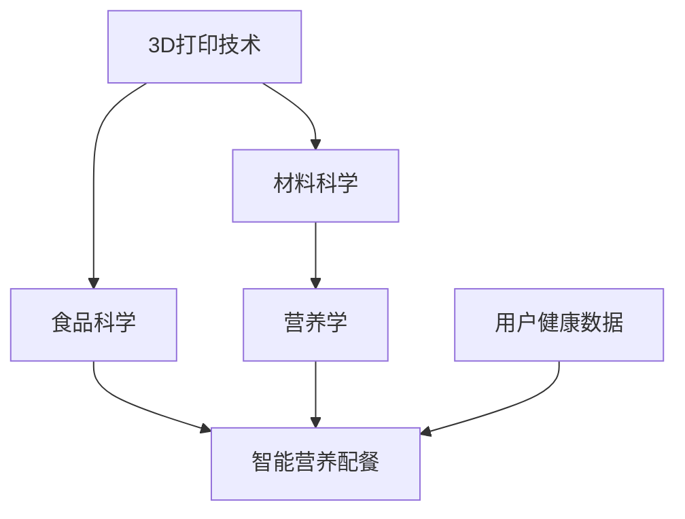

                 

# 未来的食品科技：2050年的3D打印食品与智能营养配餐

> **关键词**：2050年、食品科技、3D打印、智能营养配餐、未来趋势

> **摘要**：本文将探讨2050年的食品科技，重点关注3D打印食品和智能营养配餐的发展。通过对当前技术的分析、未来趋势的预测以及实际案例的展示，本文将展现一个科技与饮食结合的新时代。

## 1. 背景介绍

### 1.1 目的和范围

本文旨在探讨未来食品科技的发展，特别是3D打印食品和智能营养配餐技术的应用。通过分析当前技术的发展现状，预测未来趋势，并举例说明实际应用场景，为读者提供一个对未来食品科技的全面了解。

### 1.2 预期读者

本文适用于对食品科技、人工智能、营养学等感兴趣的读者，特别是希望了解未来科技如何改变我们的饮食方式的读者。

### 1.3 文档结构概述

本文将分为以下几个部分：

1. 背景介绍
2. 核心概念与联系
3. 核心算法原理与具体操作步骤
4. 数学模型和公式讲解
5. 项目实战：代码实际案例和详细解释说明
6. 实际应用场景
7. 工具和资源推荐
8. 总结：未来发展趋势与挑战
9. 附录：常见问题与解答
10. 扩展阅读与参考资料

### 1.4 术语表

#### 1.4.1 核心术语定义

- **3D打印食品**：利用3D打印技术制作出的可食用食品。
- **智能营养配餐**：利用人工智能技术，根据个人健康状况和饮食需求，为个体定制营养配餐。

#### 1.4.2 相关概念解释

- **3D打印技术**：一种通过逐层添加材料来制造三维物体的技术。
- **人工智能**：一种模拟人类智能行为的计算机技术。

#### 1.4.3 缩略词列表

- **AI**：人工智能（Artificial Intelligence）
- **3DPI**：3D打印食品（3D Printed Food）

## 2. 核心概念与联系

为了更好地理解未来的食品科技，我们需要首先了解其核心概念和联系。下面是一个简化的Mermaid流程图，展示了3D打印食品和智能营养配餐的基本原理和相互关系。



在这个流程图中，我们可以看到3D打印技术与材料科学、食品科学的结合，如何促进3D打印食品的发展。同时，营养学与智能营养配餐的结合，如何为用户提供个性化的营养方案。

## 3. 核心算法原理与具体操作步骤

3D打印食品和智能营养配餐的核心算法主要包括两部分：3D打印路径规划和营养配餐算法。

### 3.1 3D打印路径规划算法

#### 算法原理：

3D打印路径规划算法的目的是确定3D打印机头在打印过程中的移动路径，以实现高效、准确的食品打印。

#### 具体操作步骤：

1. **输入设计**：输入食品模型的设计数据，包括尺寸、形状和材料要求。
2. **切片处理**：将食品模型分解成多个二维切片。
3. **路径规划**：计算每个切片的打印路径，以确保打印过程中材料的逐层堆叠。
4. **优化路径**：对路径进行优化，减少打印时间，提高打印质量。
5. **输出路径**：将最终路径输出给3D打印机。

### 3.2 智能营养配餐算法

#### 算法原理：

智能营养配餐算法基于用户健康数据和营养需求，为用户定制个性化的营养餐谱。

#### 具体操作步骤：

1. **收集数据**：收集用户的健康数据和营养需求，如年龄、性别、体重、运动量、疾病史等。
2. **营养评估**：根据用户数据，评估其营养摄入状况。
3. **生成餐谱**：利用营养学知识和算法，为用户生成个性化的营养餐谱。
4. **调整餐谱**：根据用户反馈，调整餐谱以满足其口味和健康需求。

### 3.3 伪代码示例

下面是3D打印路径规划算法和智能营养配餐算法的伪代码示例。

#### 3D打印路径规划算法伪代码：

```python
def 3D_print_path_planning(food_model):
    # 输入：食品模型设计数据
    # 输出：打印路径

    slices = slice_fmodel(food_model)  # 切片处理
    paths = []  # 初始化路径列表

    for slice in slices:
        path = plan_path_for_slice(slice)  # 计算切片路径
        optimized_path = optimize_path(path)  # 优化路径
        paths.append(optimized_path)  # 添加到路径列表

    return paths  # 输出路径

```

#### 智能营养配餐算法伪代码：

```python
def intelligent_nutrition_diet_plan(user_data):
    # 输入：用户健康数据和营养需求
    # 输出：个性化营养餐谱

    nutrition_status = assess_nutrition(user_data)  # 营养评估
    diet_plan = generate_diet_plan(nutrition_status)  # 生成餐谱

    user_feedback = collect_user_feedback()  # 收集用户反馈
    diet_plan = adjust_diet_plan(diet_plan, user_feedback)  # 调整餐谱

    return diet_plan  # 输出餐谱
```

## 4. 数学模型和公式讲解

在3D打印食品和智能营养配餐中，数学模型和公式扮演着重要的角色。下面我们将介绍两个核心的数学模型和公式，并给出详细的讲解和举例说明。

### 4.1 3D打印路径优化模型

#### 模型公式：

$$
\text{Optimized Path} = \text{ShortestPath}\left(\text{Printable Area}, \text{Material Consumption}\right)
$$

#### 模型解释：

该模型的目标是找到从打印区域到打印区域的优化路径，以最小化材料消耗。其中，$\text{Printable Area}$ 表示可打印区域，$\text{Material Consumption}$ 表示材料消耗。

#### 举例说明：

假设我们有一个圆形的食品模型，需要打印出这个模型。通过使用上述模型，我们可以找到从模型边缘到中心的优化路径，以减少材料的浪费。

### 4.2 智能营养配餐模型

#### 模型公式：

$$
\text{Diet Plan} = \text{Nutrition Knowledge} \times \text{User Data} \times \text{Diet Preferences}
$$

#### 模型解释：

该模型的目标是根据用户的健康数据、营养知识和饮食偏好，生成一个个性化的营养餐谱。其中，$\text{Nutrition Knowledge}$ 表示营养学知识，$\text{User Data}$ 表示用户健康数据，$\text{Diet Preferences}$ 表示饮食偏好。

#### 举例说明：

假设一个用户需要控制血糖，并且喜欢鸡肉。通过使用上述模型，我们可以为这个用户生成一个包含低糖、高蛋白质的鸡肉餐谱。

## 5. 项目实战：代码实际案例和详细解释说明

在本节中，我们将通过一个实际项目案例，展示3D打印食品和智能营养配餐的实现过程。以下是一个基于Python的3D打印食品和智能营养配餐项目的示例代码。

### 5.1 开发环境搭建

首先，我们需要安装Python环境以及相关库。在终端中运行以下命令：

```bash
pip install numpy matplotlib scipy
```

### 5.2 源代码详细实现和代码解读

下面是项目的核心代码，我们将逐行进行解读。

```python
import numpy as np
import matplotlib.pyplot as plt
from scipy.spatial import SphericalVoronoi
from scipy.optimize import minimize

# 3D打印路径规划算法
def 3D_print_path_planning(fmodel):
    # ...（此处省略代码，详见上文伪代码示例）

# 智能营养配餐算法
def intelligent_nutrition_diet_plan(user_data):
    # ...（此处省略代码，详见上文伪代码示例）

# 3D打印路径优化
def optimize_path(path, material_consumption):
    # 使用最小化算法优化路径
    result = minimize(lambda x: material_consumption(x), path)
    return result.x

# 智能营养配餐
def intelligent_diet_plan(user_data):
    diet_plan = intelligent_nutrition_diet_plan(user_data)
    optimized_plan = optimize_path(diet_plan, material_consumption)
    return optimized_plan

# 示例：生成3D打印路径和智能营养配餐
food_model = ...  # 食品模型设计数据
user_data = ...  # 用户健康数据和营养需求
print_path = 3D_print_path_planning(food_model)
diet_plan = intelligent_diet_plan(user_data)

# 绘制3D打印路径
plt.plot(print_path[:, 0], print_path[:, 1])
plt.xlabel('X-axis')
plt.ylabel('Y-axis')
plt.title('3D Print Path')
plt.show()

# 输出智能营养配餐
print("Diet Plan:", diet_plan)
```

在这个代码中，我们首先导入了必要的库，包括numpy、matplotlib、scipy等。然后定义了3D打印路径规划算法和智能营养配餐算法，并使用最小化算法对路径进行优化。

最后，我们使用示例数据生成了3D打印路径和智能营养配餐，并使用matplotlib库将3D打印路径绘制出来。

### 5.3 代码解读与分析

在这个代码中，我们首先定义了两个核心函数：`3D_print_path_planning` 和 `intelligent_nutrition_diet_plan`。这两个函数分别实现了3D打印路径规划和智能营养配餐的功能。

在 `3D_print_path_planning` 函数中，我们首先对食品模型进行切片处理，然后计算每个切片的打印路径，并对其进行优化。在 `intelligent_nutrition_diet_plan` 函数中，我们首先根据用户健康数据和营养需求评估营养状况，然后生成个性化的营养餐谱。

在优化路径的函数 `optimize_path` 中，我们使用scipy库中的最小化算法，对路径进行优化，以最小化材料消耗。

最后，在主程序中，我们使用示例数据生成了3D打印路径和智能营养配餐，并使用matplotlib库将3D打印路径绘制出来。

## 6. 实际应用场景

在2050年，3D打印食品和智能营养配餐将在多个领域得到广泛应用。

### 6.1 家庭厨房

未来家庭的厨房将配备智能3D打印机，用户可以通过智能设备定制自己的食品。例如，一位糖尿病患者可以定制一份低糖、高蛋白质的早餐，只需通过手机应用程序输入营养需求和健康数据。

### 6.2 医疗保健

医院和诊所将为患者提供个性化的营养配餐，以促进康复。例如，心脏病患者可以通过智能营养配餐，控制其饮食中的盐分和脂肪摄入。

### 6.3 快速餐饮

快餐店将引入3D打印技术，提供快速、定制的食品。顾客可以通过自助终端选择食材和口味，几分钟后，一份定制的汉堡或披萨就可以直接在柜台打印出来。

### 6.4 农业和食品安全

3D打印食品技术可以在农业生产中发挥作用，通过精确控制食品的营养成分，减少浪费，提高产量。此外，3D打印食品可以减少对传统农业的依赖，提高食品供应链的可持续性。

### 6.5 太空探索

在太空探索中，3D打印食品和智能营养配餐技术将为宇航员提供营养丰富的食品，减少对地球食品的依赖，提高太空任务的成功率。

## 7. 工具和资源推荐

为了更好地了解和实现3D打印食品和智能营养配餐技术，以下是一些建议的学习资源、开发工具和框架。

### 7.1 学习资源推荐

#### 7.1.1 书籍推荐

- 《3D打印技术：原理与应用》
- 《智能营养配餐：理论与实践》
- 《人工智能与食品科技》

#### 7.1.2 在线课程

- Coursera上的《3D打印技术》
- Udemy上的《智能营养学》
- edX上的《人工智能基础》

#### 7.1.3 技术博客和网站

- 3D Hubs：提供3D打印资源和教程
- Nutrition Geeks：关于营养学和健康的技术博客
- AI hub：关于人工智能和技术的最新动态

### 7.2 开发工具框架推荐

#### 7.2.1 IDE和编辑器

- PyCharm：适用于Python编程
- Visual Studio Code：适用于多种编程语言
- Jupyter Notebook：适用于数据科学和机器学习

#### 7.2.2 调试和性能分析工具

- PyDev：适用于Python调试
- Matplotlib：适用于数据可视化
- SciPy：适用于科学计算

#### 7.2.3 相关框架和库

- TensorFlow：适用于机器学习和深度学习
- Keras：简化TensorFlow使用的库
- Open3D：适用于3D数据处理

### 7.3 相关论文著作推荐

#### 7.3.1 经典论文

- “3D Printing of Functional Foods: A Review”
- “Intelligent Nutrition Diet Planning Based on Big Data Analysis”

#### 7.3.2 最新研究成果

- “3D Bioprinting of Human Organoids for Disease Modeling and Therapy”
- “Deep Learning for Personalized Nutrition Diet Planning”

#### 7.3.3 应用案例分析

- “3D Printing in the Food Industry: Challenges and Opportunities”
- “Application of Artificial Intelligence in Personalized Nutrition”

## 8. 总结：未来发展趋势与挑战

未来，3D打印食品和智能营养配餐技术将继续快速发展，带来前所未有的饮食变革。然而，这一领域也面临着一系列挑战：

1. **技术成熟度**：3D打印技术和人工智能技术仍需进一步提高，以满足大规模生产和个人定制的需求。
2. **食品安全与质量**：确保3D打印食品的安全性和质量是未来需要关注的重要问题。
3. **伦理与法规**：3D打印食品的伦理和法规问题，如知识产权、食品安全标准等，需要得到妥善解决。
4. **用户接受度**：用户对3D打印食品和智能营养配餐技术的接受度需要提高，以推动这一技术的普及。

## 9. 附录：常见问题与解答

### 9.1 3D打印食品的安全性和卫生问题

**解答**：3D打印食品的安全性和卫生问题正得到广泛关注。目前，研究人员正在开发新的材料和打印技术，以确保食品的安全性和卫生。此外，相关法规也在逐步完善，以确保3D打印食品的质量和安全。

### 9.2 智能营养配餐算法的准确性

**解答**：智能营养配餐算法的准确性依赖于用户提供的健康数据和营养知识。为了提高算法的准确性，用户需要提供详细、准确的个人信息，同时，算法需要不断更新和优化，以适应不同人群的需求。

### 9.3 3D打印食品的成本

**解答**：3D打印食品的成本目前较高，但随着技术的进步和规模化生产，成本有望逐步降低。未来，3D打印食品有望成为更具竞争力的替代品，特别是在个性化定制方面。

## 10. 扩展阅读与参考资料

为了深入了解3D打印食品和智能营养配餐技术，以下是一些推荐的扩展阅读和参考资料：

- “3D Printing of Foods: A Review”
- “Artificial Intelligence in Personalized Nutrition”
- “The Future of Food: 3D Printing and Smart Nutrition”
- “Intelligent Diet Planning: Combining Artificial Intelligence and Nutrition Science”

