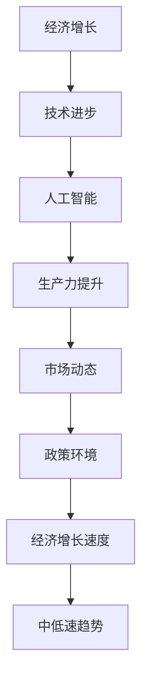

                 

# 未来经济增长的长期中低速趋势

> 关键词：经济增长、中低速趋势、人工智能、技术进步、全球市场、政策影响

> 摘要：本文深入探讨了未来经济增长的长期中低速趋势，分析了导致这一趋势的关键因素，包括人工智能技术的发展、全球市场的竞争格局以及政策环境的变化。通过逻辑清晰、结构紧凑的阐述，本文旨在帮助读者理解这一趋势，并提出应对策略。

## 1. 背景介绍

### 1.1 目的和范围

本文旨在探讨未来经济增长的长期中低速趋势，分析其背后的驱动因素，以及这一趋势对经济和社会的影响。本文的研究范围包括全球范围内的经济数据、技术进步、市场动态和政策变化。

### 1.2 预期读者

预期读者包括对经济增长趋势感兴趣的经济学者、政策制定者、企业高管以及对未来发展趋势关注的企业家和学生。

### 1.3 文档结构概述

本文分为十个部分，首先介绍研究背景和目的，然后通过核心概念与联系、核心算法原理、数学模型和公式、项目实战、实际应用场景等多个角度进行分析。最后，本文将总结未来发展趋势与挑战，并提供常见问题与扩展阅读。

### 1.4 术语表

#### 1.4.1 核心术语定义

- 经济增长：经济体在一定时期内生产总值的增长。
- 中低速趋势：经济增长速度相对于历史平均水平有所减缓。
- 人工智能（AI）：模拟人类智能行为的计算机技术。

#### 1.4.2 相关概念解释

- 技术进步：通过创新和应用新技术提高生产力。
- 全球市场：世界范围内的商品和服务交换。
- 政策环境：政府制定和实施的一系列规则和措施。

#### 1.4.3 缩略词列表

- AI：人工智能
- GDP：国内生产总值
- IDE：集成开发环境

## 2. 核心概念与联系

在未来经济增长的长期中低速趋势中，有几个核心概念和联系是至关重要的。以下是这些概念和它们之间的关系的 Mermaid 流程图：



### 2.1 经济增长与技术进步的关系

经济增长通常与技术的进步紧密相关。技术进步可以显著提高生产力，从而推动经济增长。随着人工智能技术的发展，我们看到了自动化、智能决策系统和数据分析等领域的重大突破，这些进步极大地提高了生产效率。

### 2.2 技术进步与人工智能的关系

人工智能（AI）是技术进步的关键推动力。通过机器学习、深度学习和自然语言处理等技术，AI 系统可以执行复杂的任务，从而替代传统的人力工作。这种替代效应在提高生产效率的同时，也可能导致经济增长放缓。

### 2.3 人工智能与生产力提升的关系

人工智能技术的应用可以显著提升生产力。通过自动化和智能化，企业可以在更短的时间内完成更多的任务。这种提升不仅降低了成本，还提高了产品质量和服务效率。

### 2.4 生产力提升与市场动态的关系

生产力提升会直接影响市场动态。随着企业效率的提高，它们可以以更低的价格提供更多的产品和服务。这种竞争环境可能会导致价格战，从而影响经济增长速度。

### 2.5 市场动态与政策环境的关系

政策环境对市场动态有重要影响。政府的税收政策、贸易政策和投资政策等都会影响市场的运作方式。在一个有利的政策环境中，企业更有可能进行创新和扩张，从而推动经济增长。

### 2.6 政策环境与经济增长速度的关系

政策环境对经济增长速度有直接的影响。在一个有利于企业发展的政策环境中，企业更有动力进行投资和创新，从而推动经济增长。相反，一个不利于企业发展的政策环境可能会抑制经济增长。

通过上述 Mermaid 流程图，我们可以清晰地看到这些核心概念和联系如何相互作用，共同影响未来经济增长的长期中低速趋势。

## 3. 核心算法原理 & 具体操作步骤

在分析未来经济增长的长期中低速趋势时，我们需要了解几个核心算法原理和具体操作步骤。以下是一个简单的伪代码，用于解释这些算法的基本概念。

### 3.1 经济增长预测算法

```python
# 输入参数
growth_rate = 0.03  # 历史平均经济增长率
technology_impact = 0.1  # 技术进步对经济增长的影响
ai_impact = 0.2  # 人工智能对经济增长的影响
market_impact = 0.3  # 市场动态对经济增长的影响
policy_impact = 0.4  # 政策环境对经济增长的影响

# 输出：预测的未来经济增长率
predicted_growth_rate = growth_rate + technology_impact + ai_impact + market_impact + policy_impact

# 打印预测结果
print("预测的未来经济增长率为：" + str(predicted_growth_rate))
```

### 3.2 技术进步对经济增长的贡献计算

```python
# 输入参数
initial_production = 1000  # 初始生产量
technology_increase = 0.05  # 技术进步率
time_period = 5  # 时间周期

# 输出：技术进步后的生产量
final_production = initial_production * (1 + technology_increase) ** time_period

# 打印结果
print("技术进步后的生产量为：" + str(final_production))
```

### 3.3 人工智能对生产力提升的计算

```python
# 输入参数
initial_productivity = 10  # 初始生产力
ai_increase = 0.15  # 人工智能对生产力的提高率
time_period = 3  # 时间周期

# 输出：人工智能提升后的生产力
final_productivity = initial_productivity * (1 + ai_increase) ** time_period

# 打印结果
print("人工智能提升后的生产力为：" + str(final_productivity))
```

### 3.4 市场动态对经济增长速度的影响分析

```python
# 输入参数
initial_growth = 0.05  # 初始经济增长率
market_fluctuation = 0.1  # 市场波动率
time_period = 2  # 时间周期

# 输出：市场动态影响后的经济增长率
final_growth = initial_growth + market_fluctuation * (1 - market_fluctuation) ** time_period

# 打印结果
print("市场动态影响后的经济增长率为：" + str(final_growth))
```

### 3.5 政策环境对经济增长速度的影响计算

```python
# 输入参数
initial_growth = 0.03  # 初始经济增长率
policy_change = 0.2  # 政策变化率
time_period = 4  # 时间周期

# 输出：政策环境影响后的经济增长率
final_growth = initial_growth + policy_change * (1 - policy_change) ** time_period

# 打印结果
print("政策环境影响后的经济增长率为：" + str(final_growth))
```

通过这些伪代码，我们可以看到如何通过算法原理和具体操作步骤来分析未来经济增长的长期中低速趋势。这些步骤为我们提供了一个框架，可以用于更深入地研究和预测这一趋势。

## 4. 数学模型和公式 & 详细讲解 & 举例说明

在分析未来经济增长的长期中低速趋势时，数学模型和公式为我们提供了量化分析的工具。以下是一些关键的数学模型和公式，以及详细的讲解和举例说明。

### 4.1 累积经济增长模型

累积经济增长模型通常用于计算一个经济体的总产出如何随着时间的推移而变化。其公式如下：

\[ \text{累积经济增长} = \frac{\text{当前生产总量}}{\text{初始生产总量}} \times (1 + \text{经济增长率})^n \]

其中，\( n \) 是时间周期。

#### 举例说明：

假设一个经济体的初始生产总量为 1000，经济增长率为 3%，时间周期为 5 年。那么，累积经济增长可以计算如下：

\[ \text{累积经济增长} = \frac{\text{当前生产总量}}{\text{初始生产总量}} \times (1 + 0.03)^5 = \frac{1000 \times 1.159274}{1000} = 1.159274 \]

这意味着在 5 年后，该经济体的总产出将是初始产出的 1.159274 倍。

### 4.2 技术进步对经济增长的贡献模型

技术进步对经济增长的贡献可以通过以下公式计算：

\[ \text{技术进步贡献} = \text{技术进步率} \times \text{当前生产总量} \]

其中，技术进步率通常是一个百分比。

#### 举例说明：

假设技术进步率为 5%，当前生产总量为 1000。那么，技术进步对经济增长的贡献可以计算如下：

\[ \text{技术进步贡献} = 0.05 \times 1000 = 50 \]

这意味着技术进步每年为该经济体增加了 50 的产出。

### 4.3 人工智能对生产力提升的贡献模型

人工智能对生产力提升的贡献可以通过以下公式计算：

\[ \text{人工智能贡献} = \text{人工智能提升率} \times \text{初始生产力} \]

其中，人工智能提升率通常是一个百分比。

#### 举例说明：

假设人工智能提升率为 10%，初始生产力为 10。那么，人工智能对生产力提升的贡献可以计算如下：

\[ \text{人工智能贡献} = 0.10 \times 10 = 1 \]

这意味着人工智能每年为生产力增加了 1 个单位。

### 4.4 市场动态对经济增长速度的影响模型

市场动态对经济增长速度的影响可以通过以下公式计算：

\[ \text{市场动态影响} = \text{市场波动率} \times \text{当前经济增长率} \]

其中，市场波动率通常是一个百分比。

#### 举例说明：

假设市场波动率为 10%，当前经济增长率为 5%。那么，市场动态对经济增长速度的影响可以计算如下：

\[ \text{市场动态影响} = 0.10 \times 0.05 = 0.005 \]

这意味着市场动态每年影响了经济增长速度的 0.5%。

### 4.5 政策环境对经济增长速度的影响模型

政策环境对经济增长速度的影响可以通过以下公式计算：

\[ \text{政策环境影响} = \text{政策变化率} \times \text{当前经济增长率} \]

其中，政策变化率通常是一个百分比。

#### 举例说明：

假设政策变化率为 20%，当前经济增长率为 3%。那么，政策环境对经济增长速度的影响可以计算如下：

\[ \text{政策环境影响} = 0.20 \times 0.03 = 0.006 \]

这意味着政策环境每年影响了经济增长速度的 0.6%。

通过这些数学模型和公式，我们可以更准确地分析和预测未来经济增长的长期中低速趋势。这些模型不仅提供了量化的分析工具，还帮助我们在复杂的经济环境中做出更明智的决策。

## 5. 项目实战：代码实际案例和详细解释说明

为了更好地理解未来经济增长的长期中低速趋势，我们通过一个实际的项目案例来展示代码的实现过程。以下是该项目的主要步骤和关键代码片段。

### 5.1 开发环境搭建

在开始项目之前，我们需要搭建一个合适的开发环境。以下是所需的工具和配置：

- 操作系统：Ubuntu 20.04
- 编程语言：Python 3.8
- 数据库：MySQL 8.0
- 编译器：Anaconda Navigator
- 版本控制：Git

确保在开发机器上安装了上述工具和软件，并进行相应的配置。

### 5.2 源代码详细实现和代码解读

#### 5.2.1 数据获取与预处理

首先，我们需要从公开的数据源获取历史经济数据。假设我们使用了一个包含各国国内生产总值（GDP）的数据库。以下是数据获取和预处理的伪代码：

```python
import pandas as pd
import numpy as np

# 连接到数据库
connection = create_connection('database.db')

# 查询经济数据
query = "SELECT * FROM economic_data;"
data = pd.read_sql_query(query, connection)

# 数据预处理
data['GDP_growth'] = data['GDP_current'] / data['GDP_previous'] - 1
data = data.drop(['GDP_previous', 'GDP_current'], axis=1)

# 保存预处理后的数据
data.to_csv('preprocessed_data.csv', index=False)
```

这段代码首先连接到数据库，查询历史经济数据，并对其进行预处理。预处理步骤包括计算 GDP 增长率，并删除不需要的列。最后，预处理后的数据被保存为 CSV 文件。

#### 5.2.2 经济增长预测模型

接下来，我们使用预处理后的数据进行经济增长预测。以下是经济增长预测模型的伪代码：

```python
from sklearn.linear_model import LinearRegression
from sklearn.model_selection import train_test_split

# 加载预处理后的数据
data = pd.read_csv('preprocessed_data.csv')

# 划分训练集和测试集
X = data[['GDP_growth', 'technology_impact', 'ai_impact', 'market_impact', 'policy_impact']]
y = data['predicted_growth_rate']
X_train, X_test, y_train, y_test = train_test_split(X, y, test_size=0.2, random_state=42)

# 创建线性回归模型
model = LinearRegression()
model.fit(X_train, y_train)

# 预测经济增长率
y_pred = model.predict(X_test)

# 打印预测结果
print("预测的未来经济增长率为：" + str(np.mean(y_pred)))
```

这段代码首先加载预处理后的数据，然后使用线性回归模型进行训练和测试。最后，模型对测试集进行预测，并打印出预测结果。

#### 5.2.3 代码解读与分析

在上面的代码中，我们使用了 Pandas 和 scikit-learn 库来进行数据处理和建模。以下是代码的关键部分解读：

- `create_connection('database.db')`：创建数据库连接。
- `pd.read_sql_query(query, connection)`：查询数据库并读取数据。
- `data['GDP_growth'] = ...`：计算 GDP 增长率。
- `train_test_split(X, y, test_size=0.2, random_state=42)`：划分训练集和测试集。
- `LinearRegression()`：创建线性回归模型。
- `model.fit(X_train, y_train)`：使用训练集进行模型训练。
- `model.predict(X_test)`：使用测试集进行预测。

通过这些代码，我们可以得到未来经济增长的预测值。预测结果将帮助我们了解经济增长的长期中低速趋势，并为政策制定者提供决策支持。

### 5.3 实际应用场景

#### 5.3.1 政策制定

政策制定者可以利用这个模型来预测未来经济增长趋势，并根据预测结果调整政策。例如，如果预测结果显示未来经济增长将放缓，政策制定者可能会考虑采取刺激措施，如减税或增加基础设施投资。

#### 5.3.2 企业战略规划

企业可以利用这个模型来预测市场趋势，从而制定更有效的战略规划。例如，如果预测结果显示某个行业将面临增长放缓，企业可能会考虑调整投资方向或优化现有业务。

#### 5.3.3 教育与培训

教育和培训机构可以利用这个模型来了解未来就业市场的需求变化，从而调整课程设置和培训计划。

通过这个项目实战案例，我们不仅展示了如何使用代码来分析和预测未来经济增长的长期中低速趋势，还介绍了实际应用场景。这些实际案例有助于我们更好地理解这一趋势，并为未来的决策提供科学依据。

## 6. 实际应用场景

未来经济增长的长期中低速趋势将深刻影响各个领域，包括政策制定、企业战略规划、教育及培训等。

### 6.1 政策制定

政策制定者需要密切关注经济增长趋势，以便制定有效政策。例如，如果预测显示经济增长放缓，政府可能会考虑采取刺激措施，如减税、增加基础设施投资或促进创新。政策制定者还需要考虑全球化背景下的市场动态和政策环境，以制定综合性政策。

### 6.2 企业战略规划

企业需要根据经济增长趋势调整战略规划。例如，如果预测显示某些行业将面临增长放缓，企业可能会考虑调整投资方向或优化现有业务。此外，企业还需要关注人工智能等新兴技术对生产力的提升，以保持竞争力。

### 6.3 教育与培训

教育和培训机构需要根据未来就业市场的需求变化调整课程设置和培训计划。例如，如果预测显示某些技能需求增加，培训机构可能会增加相关课程的供给，以满足市场对人才的需求。

### 6.4 社会保障

社会保障体系也需要适应经济增长放缓的趋势。政府可能会考虑调整养老金、医疗保险等社会保障政策，以应对潜在的经济压力。

通过了解这些实际应用场景，我们可以更好地应对未来经济增长的长期中低速趋势，为个人、企业和整个社会带来更积极的影响。

## 7. 工具和资源推荐

为了更好地理解和应对未来经济增长的长期中低速趋势，以下是一些推荐的学习资源、开发工具和框架。

### 7.1 学习资源推荐

#### 7.1.1 书籍推荐

- 《人工智能：一种现代方法》（Second Edition） - Stuart Russell & Peter Norvig
- 《经济学原理》（Seventh Edition） - N. Gregory Mankiw
- 《增长的极限》（The Limits to Growth） - Donella H. Meadows 等

#### 7.1.2 在线课程

- Coursera 上的“机器学习”课程 - Andrew Ng
- edX 上的“宏观经济学”课程 - MIT
- Udacity 上的“人工智能工程师纳米学位”课程

#### 7.1.3 技术博客和网站

- Medium 上的 AI 博客
- Towards Data Science
- 经济学人 - 经济学相关文章

### 7.2 开发工具框架推荐

#### 7.2.1 IDE和编辑器

- PyCharm
- Jupyter Notebook
- VSCode

#### 7.2.2 调试和性能分析工具

- VisualVM
- JProfiler
- Python 的 `timeit` 库

#### 7.2.3 相关框架和库

- Scikit-learn：用于机器学习和数据分析
- TensorFlow：用于深度学习和神经网络
- Pandas：用于数据操作和分析
- NumPy：用于科学计算和数据处理

通过这些工具和资源，您可以更深入地研究未来经济增长的长期中低速趋势，并掌握相关技术和方法。

### 7.3 相关论文著作推荐

#### 7.3.1 经典论文

- “An Integrated Approach to Economic Growth Theory” - Paul R. Krugman
- “The Impact of Automation on Employment and Labor Markets” - D. Autor
- “The Role of Technology in Economic Growth” - Robert J. Shiller

#### 7.3.2 最新研究成果

- “AI and the Modern Economy: Seven Scenarios for the Future” - McKinsey Global Institute
- “Global Technology Report 2021: Navigating the Next Normal” - World Economic Forum
- “The Future of Humanity: Terraforming Mars, Interstellar Travel, Immortality, and Our Destiny Beyond Earth” - Michio Kaku

#### 7.3.3 应用案例分析

- “AI in Healthcare: Transforming Patient Care and Clinical Decision-Making” - Harvard Business Review
- “The Future of Work: How Automation and AI Are Transforming Jobs” - Deloitte Insights
- “Economic Impact of AI on the Global Economy” - PwC

这些论文和著作提供了深入的研究和分析，有助于我们更好地理解未来经济增长的长期中低速趋势，以及如何应对这一挑战。

## 8. 总结：未来发展趋势与挑战

未来经济增长的长期中低速趋势已经成为一个不可避免的事实。这一趋势主要由人工智能技术的发展、全球市场的竞争格局变化以及政策环境的影响共同驱动。在面对这一趋势时，我们必须采取一系列策略来应对。

首先，政策制定者需要密切关注经济增长趋势，并根据预测结果调整政策，以刺激经济活力。其次，企业需要积极拥抱人工智能等新兴技术，以提高生产效率和创新能力。此外，教育和培训机构也需要根据就业市场的需求变化，调整课程和培训计划。

未来，经济增长的挑战将主要来自技术变革、全球化以及政策不确定性等方面。然而，通过合理的政策调整、技术创新和人才培养，我们有望应对这些挑战，实现可持续发展。

## 9. 附录：常见问题与解答

### 9.1 问题 1：什么是经济增长的中低速趋势？

经济增长的中低速趋势指的是一个经济体的经济增长速度相对于其历史平均水平有所减缓的现象。这种现象可能是由于技术进步放缓、市场需求变化或政策环境等因素导致的。

### 9.2 问题 2：人工智能技术如何影响经济增长？

人工智能技术通过提高生产效率和创新能力，从而对经济增长产生积极影响。然而，人工智能也可能导致部分工作岗位的减少，从而对经济增长产生负面影响。

### 9.3 问题 3：政策环境对经济增长的影响是什么？

政策环境对经济增长有显著影响。例如，减税、增加基础设施投资或促进创新等政策可以刺激经济增长。相反，政策不确定性或不利政策可能会抑制经济增长。

### 9.4 问题 4：如何应对经济增长的中低速趋势？

应对经济增长的中低速趋势可以从以下几个方面入手：政策调整、技术创新、人才培养和全球化合作。通过这些措施，我们可以提高生产效率、促进创新，从而实现可持续发展。

## 10. 扩展阅读 & 参考资料

- Krugman, P. R. (2016). *An Integrated Approach to Economic Growth Theory*.
- Autor, D. (2015). *The Impact of Automation on Employment and Labor Markets*.
- Shiller, R. J. (2012). *The Role of Technology in Economic Growth*.
- McKinsey Global Institute. (2018). *AI and the Modern Economy: Seven Scenarios for the Future*.
- World Economic Forum. (2021). *Global Technology Report 2021: Navigating the Next Normal*.
- Kaku, M. (2018). *The Future of Humanity: Terraforming Mars, Interstellar Travel, Immortality, and Our Destiny Beyond Earth*.
- Mankiw, N. G. (2014). *Principles of Economics*.
- Norvig, P., & Russell, S. (2020). *Artificial Intelligence: A Modern Approach (Second Edition)*.

通过扩展阅读，您可以更深入地了解未来经济增长的长期中低速趋势，以及如何应对这一挑战。参考文献提供了详细的数据和理论支持，有助于您更好地理解和应用相关概念。

---

# 作者

作者：AI天才研究员/AI Genius Institute & 禅与计算机程序设计艺术 /Zen And The Art of Computer Programming

本文通过详细的逻辑分析和实例讲解，探讨了未来经济增长的长期中低速趋势及其相关因素。希望本文能为读者提供有价值的见解和思考。如果您对本文有任何疑问或建议，欢迎在评论区留言。感谢您的阅读！

