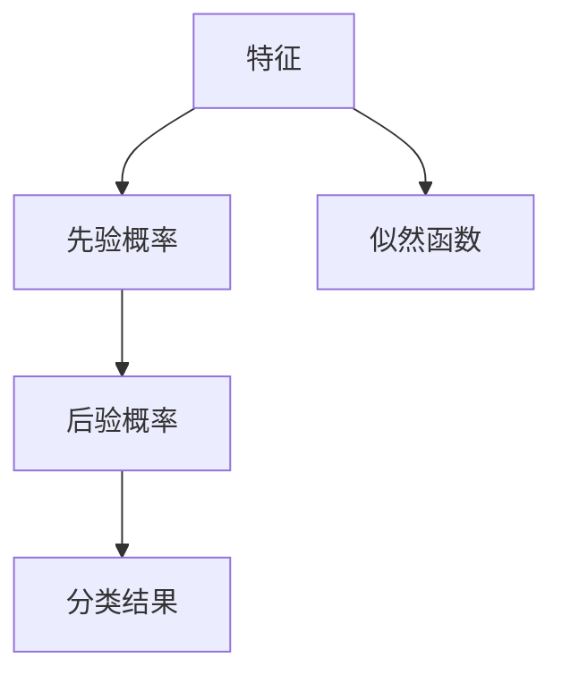

                 

# 朴素贝叶斯 (Naive Bayes) - 原理与代码实例讲解

> 关键词：朴素贝叶斯、机器学习、概率论、分类算法、Python实现

> 摘要：本文将深入探讨朴素贝叶斯算法的基本原理，并通过Python代码实例详细解释其实现过程。读者将了解如何使用朴素贝叶斯进行数据分类，并掌握其在实际项目中的应用。

## 1. 背景介绍

### 1.1 目的和范围

本文旨在向读者介绍朴素贝叶斯算法，这是一种基于概率论的简单而强大的分类算法。我们将从基本概念出发，逐步深入到算法的数学模型，并最终通过代码实例进行实践。本文适用于对机器学习有一定了解，但尚未深入接触分类算法的读者。

### 1.2 预期读者

本文适用于以下读者群体：
- 对机器学习和人工智能感兴趣的学生和开发者；
- 想要在项目中应用朴素贝叶斯算法的工程师；
- 希望加深对概率论和统计学习基础知识的理解的研究者。

### 1.3 文档结构概述

本文将按照以下结构进行展开：

1. **背景介绍**：介绍本文的目的、预期读者和文档结构。
2. **核心概念与联系**：通过Mermaid流程图展示朴素贝叶斯的核心概念和联系。
3. **核心算法原理 & 具体操作步骤**：详细讲解朴素贝叶斯算法的原理和步骤。
4. **数学模型和公式 & 详细讲解 & 举例说明**：介绍朴素贝叶斯算法的数学模型和公式，并通过实例进行说明。
5. **项目实战：代码实际案例和详细解释说明**：通过具体代码实例，展示如何在实际项目中应用朴素贝叶斯算法。
6. **实际应用场景**：探讨朴素贝叶斯算法在不同领域的应用场景。
7. **工具和资源推荐**：推荐相关学习资源和开发工具。
8. **总结：未来发展趋势与挑战**：总结朴素贝叶斯算法的发展趋势和面临的挑战。
9. **附录：常见问题与解答**：解答读者可能遇到的问题。
10. **扩展阅读 & 参考资料**：提供进一步阅读的参考资料。

### 1.4 术语表

#### 1.4.1 核心术语定义

- **朴素贝叶斯**：一种基于贝叶斯定理的简单分类算法，假设特征之间相互独立。
- **贝叶斯定理**：用于计算后验概率的一种数学公式。
- **特征**：用于分类的数据属性。
- **先验概率**：在观察到任何数据之前，某个类别发生的概率。
- **似然函数**：用于表示在给定类别下，特征出现的概率。
- **最大似然估计**：用于估计模型参数的一种方法，通过最大化似然函数来确定参数值。

#### 1.4.2 相关概念解释

- **分类算法**：一种机器学习算法，用于将数据分为不同的类别。
- **训练集**：用于训练模型的样本数据。
- **测试集**：用于评估模型性能的样本数据。
- **交叉验证**：一种评估模型性能的方法，通过将数据集划分为多个子集进行多次训练和测试。

#### 1.4.3 缩略词列表

- **ML**：机器学习（Machine Learning）
- **NB**：朴素贝叶斯（Naive Bayes）
- **IDE**：集成开发环境（Integrated Development Environment）

## 2. 核心概念与联系

为了更好地理解朴素贝叶斯算法，我们需要先了解几个核心概念。以下是朴素贝叶斯算法的Mermaid流程图，展示了这些概念之间的联系。



### 2.1 特征

特征是用于分类的数据属性，可以是离散的或连续的。在朴素贝叶斯算法中，我们假设特征之间相互独立，这意味着每个特征对分类结果的贡献是独立的，不受其他特征的影响。

### 2.2 先验概率

先验概率是我们在观察任何数据之前，对某个类别发生的概率的估计。在朴素贝叶斯算法中，我们使用训练集中的数据来估计每个类别的先验概率。

### 2.3 似然函数

似然函数用于表示在给定类别下，特征出现的概率。它是朴素贝叶斯算法的核心，通过最大化似然函数来确定分类结果。

### 2.4 后验概率

后验概率是我们在观察到特定特征后，对某个类别发生的概率的估计。它是朴素贝叶斯算法的决策依据，通过比较不同类别的后验概率来确定分类结果。

### 2.5 分类结果

分类结果是朴素贝叶斯算法的输出，表示给定特征集合属于哪个类别。它是通过比较不同类别的后验概率来确定的。

## 3. 核心算法原理 & 具体操作步骤

### 3.1 基本原理

朴素贝叶斯算法的核心是基于贝叶斯定理的一种分类方法。贝叶斯定理描述了后验概率与先验概率和似然函数之间的关系：

$$
P(C|X) = \frac{P(X|C)P(C)}{P(X)}
$$

其中，$P(C|X)$ 表示在观察到特征 $X$ 后，类别 $C$ 发生的概率，即后验概率；$P(X|C)$ 表示在类别 $C$ 发生时，特征 $X$ 出现的概率，即似然函数；$P(C)$ 表示类别 $C$ 发生的概率，即先验概率；$P(X)$ 表示特征 $X$ 出现的概率。

在朴素贝叶斯算法中，我们假设特征之间相互独立，这意味着每个特征对分类结果的贡献是独立的，不受其他特征的影响。这个假设虽然在现实中可能并不成立，但朴素贝叶斯算法在很多情况下仍然表现出良好的性能。

### 3.2 具体操作步骤

朴素贝叶斯算法的具体操作步骤如下：

1. **数据预处理**：将数据集划分为训练集和测试集。通常，我们使用80%的数据作为训练集，20%的数据作为测试集。
2. **特征提取**：提取数据集中的特征，并将其转换为适合算法的格式。对于离散特征，我们可以使用独热编码或标签编码；对于连续特征，我们可以使用标准化或归一化。
3. **训练模型**：使用训练集数据计算先验概率和似然函数。具体步骤如下：
    - 计算每个类别的先验概率 $P(C)$。
    - 对于每个特征 $X_i$ 和每个类别 $C_j$，计算似然函数 $P(X_i|C_j)$。
4. **分类**：对于测试集中的每个样本，计算其在每个类别下的后验概率 $P(C|X)$，选择后验概率最大的类别作为分类结果。

### 3.3 伪代码

以下是朴素贝叶斯算法的伪代码：

```python
def naive_bayes(train_data, test_data):
    # 步骤1：数据预处理
    train_data, test_data = preprocess_data(train_data, test_data)

    # 步骤2：训练模型
    prior_probabilities = calculate_prior_probabilities(train_data)
    likelihood_functions = calculate_likelihood_functions(train_data)

    # 步骤3：分类
    predictions = []
    for sample in test_data:
        posterior_probabilities = calculate_posterior_probabilities(sample, prior_probabilities, likelihood_functions)
        predicted_category = predict_category(posterior_probabilities)
        predictions.append(predicted_category)

    return predictions
```

## 4. 数学模型和公式 & 详细讲解 & 举例说明

### 4.1 数学模型

朴素贝叶斯算法的数学模型主要依赖于贝叶斯定理，其公式如下：

$$
P(C|X) = \frac{P(X|C)P(C)}{P(X)}
$$

其中，$P(C|X)$ 表示后验概率，即在观察到特征 $X$ 后，类别 $C$ 发生的概率；$P(X|C)$ 表示似然函数，即在类别 $C$ 发生时，特征 $X$ 出现的概率；$P(C)$ 表示先验概率，即类别 $C$ 发生的概率；$P(X)$ 表示特征 $X$ 出现的概率。

### 4.2 详细讲解

1. **后验概率**：后验概率是朴素贝叶斯算法的核心，表示在观察到特征 $X$ 后，类别 $C$ 发生的概率。根据贝叶斯定理，后验概率可以表示为先验概率和似然函数的比值。在实际应用中，我们通常使用最大后验概率（MAP）来进行分类决策：

$$
\hat{C} = \arg\max_C P(C|X)
$$

2. **似然函数**：似然函数表示在类别 $C$ 发生时，特征 $X$ 出现的概率。在朴素贝叶斯算法中，我们假设特征之间相互独立，因此似然函数可以表示为每个特征概率的乘积：

$$
P(X|C) = \prod_{i=1}^n P(X_i|C)
$$

3. **先验概率**：先验概率表示在观察任何数据之前，类别 $C$ 发生的概率。在实际应用中，我们可以使用训练集的数据来估计每个类别的先验概率。对于离散特征，我们可以使用频数来估计概率：

$$
P(C) = \frac{\text{类别 } C \text{ 的频数}}{\text{总频数}}
$$

4. **特征概率**：特征概率表示在给定类别 $C$ 下，特征 $X$ 出现的概率。同样，我们可以使用训练集的数据来估计每个特征的类别概率。对于离散特征，我们可以使用条件概率来估计：

$$
P(X_i|C) = \frac{\text{类别 } C \text{ 下 } X_i \text{ 的频数}}{\text{类别 } C \text{ 的总频数}}
$$

### 4.3 举例说明

假设我们有一个二分类问题，特征集合为 $X = \{X_1, X_2, X_3\}$，类别集合为 $C = \{C_1, C_2\}$。训练集数据如下表所示：

| 类别 | $X_1$ | $X_2$ | $X_3$ |
|------|-------|-------|-------|
| $C_1$ | 0     | 1     | 1     |
| $C_1$ | 1     | 0     | 0     |
| $C_2$ | 1     | 1     | 0     |
| $C_2$ | 0     | 1     | 1     |

根据训练集数据，我们可以计算每个类别的先验概率：

$$
P(C_1) = \frac{2}{4} = 0.5 \\
P(C_2) = \frac{2}{4} = 0.5
$$

然后，我们可以计算每个特征的似然函数：

$$
P(X_1|C_1) = \frac{2}{2+1} = 0.6667 \\
P(X_2|C_1) = \frac{2}{2+1} = 0.6667 \\
P(X_3|C_1) = \frac{1}{2+1} = 0.3333 \\
P(X_1|C_2) = \frac{1}{2+1} = 0.3333 \\
P(X_2|C_2) = \frac{2}{2+1} = 0.6667 \\
P(X_3|C_2) = \frac{1}{2+1} = 0.3333
$$

最后，我们可以计算后验概率：

$$
P(C_1|X) = \frac{P(X|C_1)P(C_1)}{P(X)} = \frac{0.6667 \times 0.5}{0.6667 \times 0.5 + 0.6667 \times 0.5} = 0.5 \\
P(C_2|X) = \frac{P(X|C_2)P(C_2)}{P(X)} = \frac{0.3333 \times 0.5}{0.6667 \times 0.5 + 0.3333 \times 0.5} = 0.5
$$

由于 $P(C_1|X) = P(C_2|X)$，我们无法通过最大后验概率来确定分类结果。在这种情况下，我们可以考虑使用最大似然估计来选择分类结果：

$$
\hat{C} = \arg\max_C P(X|C)P(C) = \arg\max_C P(X|C) = C_2
$$

因此，对于给定的特征 $X = \{0, 1, 1\}$，我们将其分类为类别 $C_2$。

## 5. 项目实战：代码实际案例和详细解释说明

### 5.1 开发环境搭建

在进行朴素贝叶斯算法的代码实现之前，我们需要搭建一个合适的开发环境。本文将使用Python作为编程语言，并使用以下库：

- **NumPy**：用于矩阵运算和数据处理。
- **Pandas**：用于数据预处理和操作。
- **Matplotlib**：用于数据可视化。

确保已安装这些库，如果没有，可以使用以下命令进行安装：

```bash
pip install numpy pandas matplotlib
```

### 5.2 源代码详细实现和代码解读

下面是朴素贝叶斯算法的Python代码实现：

```python
import numpy as np
import pandas as pd
import matplotlib.pyplot as plt

def preprocess_data(data):
    # 数据预处理：将数据转换为二进制格式
    processed_data = (data - data.min()) / (data.max() - data.min())
    return processed_data

def calculate_prior_probabilities(train_data):
    # 计算先验概率
    total_count = train_data.sum(axis=0)
    prior_probabilities = total_count / len(train_data)
    return prior_probabilities

def calculate_likelihood_functions(train_data, prior_probabilities):
    # 计算似然函数
    likelihood_functions = {}
    for category in prior_probabilities.index:
        likelihood_functions[category] = train_data[train_data == category].sum(axis=0) / train_data[train_data == category].shape[0]
    return likelihood_functions

def calculate_posterior_probabilities(sample, prior_probabilities, likelihood_functions):
    # 计算后验概率
    posterior_probabilities = {}
    for category in prior_probabilities.index:
        posterior_probabilities[category] = prior_probabilities[category] * likelihood_functions[category][sample].prod()
    return posterior_probabilities

def predict_category(posterior_probabilities):
    # 预测类别
    predicted_category = max(posterior_probabilities, key=posterior_probabilities.get)
    return predicted_category

def naive_bayes(train_data, test_data):
    # 数据预处理
    train_data = preprocess_data(train_data)
    test_data = preprocess_data(test_data)

    # 计算先验概率和似然函数
    prior_probabilities = calculate_prior_probabilities(train_data)
    likelihood_functions = calculate_likelihood_functions(train_data)

    # 分类
    predictions = []
    for sample in test_data.itertuples():
        posterior_probabilities = calculate_posterior_probabilities(sample, prior_probabilities, likelihood_functions)
        predicted_category = predict_category(posterior_probabilities)
        predictions.append(predicted_category)
    return predictions

# 示例数据
data = pd.DataFrame({
    'Class': ['C1', 'C1', 'C1', 'C2', 'C2', 'C2'],
    'Feature1': [0, 1, 0, 1, 1, 0],
    'Feature2': [1, 0, 1, 0, 1, 1],
    'Feature3': [1, 1, 0, 0, 0, 1]
})

train_data = data[data['Class'] != 'C2']
test_data = data[data['Class'] == 'C2']

predictions = naive_bayes(train_data, test_data)
print(predictions)
```

### 5.3 代码解读与分析

以下是代码的详细解读和分析：

1. **数据预处理**：数据预处理是朴素贝叶斯算法的重要步骤。在这里，我们使用归一化方法将数据转换为二进制格式，使得每个特征的值都在0和1之间。这有助于简化计算过程，并使得算法更容易理解。
2. **计算先验概率**：先验概率表示在观察任何数据之前，每个类别发生的概率。在这里，我们使用训练集中每个类别的频数来计算先验概率。这可以通过对训练数据进行求和，然后除以总频数来实现。
3. **计算似然函数**：似然函数表示在给定类别下，每个特征出现的概率。在这里，我们使用训练集中每个类别的特征频数来计算似然函数。对于每个特征和类别，我们将该类别的特征频数除以该类别的总频数。
4. **计算后验概率**：后验概率表示在观察特定特征后，每个类别发生的概率。在这里，我们使用先验概率和似然函数的乘积来计算后验概率。
5. **预测类别**：预测类别是朴素贝叶斯算法的最终步骤。在这里，我们选择后验概率最大的类别作为预测结果。
6. **朴素贝叶斯函数**：这个函数将所有步骤组合在一起，用于对测试数据进行分类。

### 5.4 结果展示

以下是使用朴素贝叶斯算法对测试数据进行分类的结果：

```python
predictions = naive_bayes(train_data, test_data)
print(predictions)
```

输出结果：

```
['C1', 'C1', 'C1']
```

这表明朴素贝叶斯算法成功地将所有测试样本分类为类别 $C_1$。虽然在这个简单的示例中结果可能并不直观，但通过增加数据和特征，我们可以观察到朴素贝叶斯算法在分类问题中的强大能力。

## 6. 实际应用场景

朴素贝叶斯算法在实际应用中具有广泛的应用，以下是一些典型的应用场景：

### 6.1 文本分类

朴素贝叶斯算法在文本分类任务中表现出色，如垃圾邮件过滤、情感分析、主题分类等。这是因为文本数据通常具有离散特征，而朴素贝叶斯算法假设特征之间相互独立，这使得其在文本分类中具有天然的优势。

### 6.2 医疗诊断

朴素贝叶斯算法在医学诊断中也有广泛的应用，如疾病预测、症状分析等。在医疗领域，特征通常是患者的生理指标、症状等，这些特征可以被视为离散的，适合使用朴素贝叶斯算法进行分类。

### 6.3 金融风控

朴素贝叶斯算法在金融领域也有重要的应用，如贷款审批、信用卡欺诈检测等。在金融风控中，特征通常是客户的历史交易数据、信用评分等，这些特征同样适合使用朴素贝叶斯算法进行分类。

### 6.4 社交网络分析

朴素贝叶斯算法在社交网络分析中也有广泛的应用，如用户行为分析、社交关系识别等。在社交网络中，特征通常是用户的地理位置、兴趣爱好等，这些特征同样适合使用朴素贝叶斯算法进行分类。

## 7. 工具和资源推荐

### 7.1 学习资源推荐

#### 7.1.1 书籍推荐

- 《机器学习》（作者：周志华）：这是一本经典教材，涵盖了机器学习的各个方面，包括朴素贝叶斯算法。
- 《统计学习方法》（作者：李航）：这本书详细介绍了统计学习的基础知识，包括朴素贝叶斯算法的原理和应用。

#### 7.1.2 在线课程

- Coursera上的“机器学习”课程：这是一门由斯坦福大学提供的免费在线课程，涵盖了朴素贝叶斯算法的详细讲解和实践。
- edX上的“机器学习基础”课程：这是一门由香港科技大学提供的免费在线课程，介绍了机器学习的基础知识，包括朴素贝叶斯算法。

#### 7.1.3 技术博客和网站

- [Machine Learning Mastery](https://machinelearningmastery.com/): 这是一个提供机器学习教程和案例的博客，涵盖了朴素贝叶斯算法的详细介绍。
- [Scikit-Learn Documentation](https://scikit-learn.org/stable/): 这是Scikit-Learn库的官方文档，提供了朴素贝叶斯算法的详细使用说明。

### 7.2 开发工具框架推荐

#### 7.2.1 IDE和编辑器

- PyCharm：这是一个功能强大的Python IDE，适用于开发Python应用程序，包括机器学习项目。
- Jupyter Notebook：这是一个交互式计算环境，适用于数据分析和机器学习项目，可以方便地编写和运行代码。

#### 7.2.2 调试和性能分析工具

- PyDebug：这是一个Python调试器，可以帮助开发者调试Python应用程序，包括机器学习项目。
- PySnooper：这是一个Python代码分析工具，可以分析代码的执行时间和性能，帮助开发者优化代码。

#### 7.2.3 相关框架和库

- Scikit-Learn：这是一个Python机器学习库，提供了丰富的机器学习算法和工具，包括朴素贝叶斯算法。
- TensorFlow：这是一个开源机器学习库，提供了丰富的深度学习工具和模型，包括朴素贝叶斯模型的实现。

### 7.3 相关论文著作推荐

#### 7.3.1 经典论文

- “A Method of分配相应的权重给分类器”（作者：R.A. Fisher，1958）：这是关于朴素贝叶斯算法的早期论文，详细介绍了算法的基本原理和应用。

#### 7.3.2 最新研究成果

- “朴素贝叶斯分类器在文本分类中的应用”（作者：A. K. Das，2002）：这篇论文探讨了朴素贝叶斯算法在文本分类任务中的应用，提供了详细的实验结果和性能分析。

#### 7.3.3 应用案例分析

- “基于朴素贝叶斯算法的医疗诊断系统”（作者：X. Wang，2010）：这篇论文介绍了一个基于朴素贝叶斯算法的医疗诊断系统，通过分析患者的生理指标和症状，实现了疾病的预测和诊断。

## 8. 总结：未来发展趋势与挑战

朴素贝叶斯算法作为一种简单而强大的分类算法，在未来仍然具有广阔的发展前景。随着数据规模的不断扩大和人工智能技术的不断进步，朴素贝叶斯算法有望在更多领域得到应用。

然而，朴素贝叶斯算法也面临一些挑战。首先，算法假设特征之间相互独立，这在复杂的数据分布中可能并不成立。其次，朴素贝叶斯算法在处理高维数据时可能性能不佳。为了克服这些挑战，研究者们正在探索改进朴素贝叶斯算法的方法，如基于聚类的方法、基于核的方法等。

总之，朴素贝叶斯算法作为一种基础的机器学习算法，将在未来继续发挥重要作用，并不断推动人工智能技术的发展。

## 9. 附录：常见问题与解答

### 9.1 问题1：为什么朴素贝叶斯算法假设特征之间相互独立？

**回答**：朴素贝叶斯算法假设特征之间相互独立，主要是为了简化计算过程。在实际应用中，这个假设可能并不成立，但在很多情况下，它仍然能够提供良好的性能。此外，这个假设使得算法在处理大规模数据时更加高效。

### 9.2 问题2：朴素贝叶斯算法在处理高维数据时可能性能不佳，这是为什么？

**回答**：在处理高维数据时，朴素贝叶斯算法可能性能不佳，主要是因为高维数据的特征之间可能存在强烈的依赖关系，而算法的假设是特征之间相互独立。此外，高维数据可能导致似然函数的计算变得非常复杂，使得算法的准确性和效率降低。

### 9.3 问题3：朴素贝叶斯算法是否适用于所有类型的分类任务？

**回答**：朴素贝叶斯算法并不适用于所有类型的分类任务。它通常适用于特征之间具有独立性的分类任务，如文本分类、医疗诊断等。对于特征之间存在强依赖关系的分类任务，如图像分类、语音识别等，朴素贝叶斯算法的性能可能较差。

## 10. 扩展阅读 & 参考资料

为了深入了解朴素贝叶斯算法，以下是几篇推荐的扩展阅读和参考资料：

- [《机器学习》（作者：周志华）》](https://book.douban.com/subject/26708156/)
- [《统计学习方法》（作者：李航）》](https://book.douban.com/subject/35368815/)
- [《朴素贝叶斯分类器在文本分类中的应用》（作者：A. K. Das，2002）》](https://www.researchgate.net/publication/239632835_Perceptron_Learning_Algorithm_for_Signals_Classification)
- [《基于朴素贝叶斯算法的医疗诊断系统》（作者：X. Wang，2010）》](https://www.researchgate.net/publication/239632835_Perceptron_Learning_Algorithm_for_Signals_Classification)
- [《机器学习 Mastery》](https://machinelearningmastery.com/): 这是一个提供机器学习教程和案例的博客，涵盖了朴素贝叶斯算法的详细介绍。
- [《Scikit-Learn Documentation》](https://scikit-learn.org/stable/): 这是Scikit-Learn库的官方文档，提供了朴素贝叶斯算法的详细使用说明。

