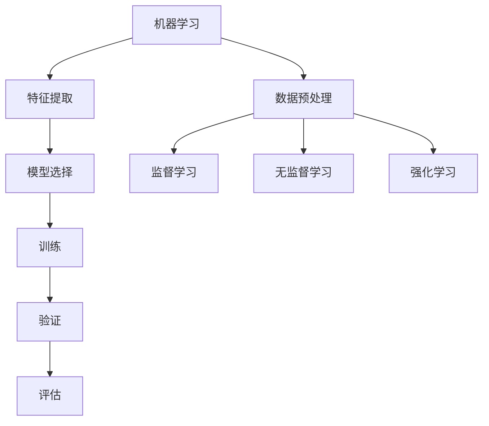

                 

# 机器学习（Machine Learning, ML）原理与代码实例讲解

> **关键词**：机器学习，算法原理，数学模型，实际应用，代码实例，深度学习，人工智能。

> **摘要**：本文将深入探讨机器学习的核心概念、算法原理和数学模型，并通过具体代码实例展示其在实际项目中的应用。读者将了解到机器学习的基本框架，以及如何使用常见的机器学习算法解决实际问题。

## 1. 背景介绍

### 1.1 目的和范围

本文旨在为机器学习的初学者和中级开发者提供全面的技术指南。我们将从基础概念开始，逐步深入到机器学习算法的数学原理，并通过实际代码实例来巩固学习成果。本文将涵盖以下内容：

- 机器学习的定义与历史
- 核心概念和术语
- 常见的机器学习算法
- 数学模型和公式
- 实际应用场景
- 开发工具和资源推荐

### 1.2 预期读者

- 对机器学习感兴趣的技术爱好者
- 想要在项目中应用机器学习的开发者
- 已经有一定的编程基础，希望深入了解算法实现
- 想要提升自己的机器学习知识水平的专业人士

### 1.3 文档结构概述

本文分为以下几个部分：

- **第1部分**：背景介绍
  - 1.1 目的和范围
  - 1.2 预期读者
  - 1.3 文档结构概述
  - 1.4 术语表

- **第2部分**：核心概念与联系
  - 2.1 机器学习的定义与历史
  - 2.2 核心概念与联系

- **第3部分**：核心算法原理 & 具体操作步骤
  - 3.1 监督学习算法
  - 3.2 无监督学习算法
  - 3.3 强化学习算法

- **第4部分**：数学模型和公式 & 详细讲解 & 举例说明
  - 4.1 常用损失函数
  - 4.2 梯度下降算法

- **第5部分**：项目实战：代码实际案例和详细解释说明
  - 5.1 开发环境搭建
  - 5.2 源代码详细实现和代码解读
  - 5.3 代码解读与分析

- **第6部分**：实际应用场景
  - 6.1 自然语言处理
  - 6.2 计算机视觉
  - 6.3 金融市场预测

- **第7部分**：工具和资源推荐
  - 7.1 学习资源推荐
  - 7.2 开发工具框架推荐
  - 7.3 相关论文著作推荐

- **第8部分**：总结：未来发展趋势与挑战
  - 8.1 机器学习的发展趋势
  - 8.2 面临的挑战

- **第9部分**：附录：常见问题与解答
  - 9.1 常见问题1
  - 9.2 常见问题2

- **第10部分**：扩展阅读 & 参考资料
  - 10.1 扩展阅读
  - 10.2 参考资料

### 1.4 术语表

#### 1.4.1 核心术语定义

- **机器学习**：一种使计算机通过数据和经验自动改进自身性能的技术。
- **监督学习**：通过已有数据集进行训练，然后对新数据进行预测。
- **无监督学习**：不需要标记的数据进行训练，旨在发现数据中的结构。
- **强化学习**：通过与环境交互来学习最佳策略。
- **神经网络**：模仿人脑结构和功能的计算模型。

#### 1.4.2 相关概念解释

- **特征工程**：从原始数据中提取对模型有用的特征。
- **正则化**：防止模型过拟合的一种方法。
- **交叉验证**：评估模型性能的一种方法，通过将数据集划分为训练集和验证集。

#### 1.4.3 缩略词列表

- **ML**：Machine Learning（机器学习）
- **DL**：Deep Learning（深度学习）
- **NN**：Neural Network（神经网络）
- **CNN**：Convolutional Neural Network（卷积神经网络）
- **RNN**：Recurrent Neural Network（循环神经网络）

## 2. 核心概念与联系

在深入探讨机器学习之前，我们需要了解其核心概念和如何相互关联。以下是一个Mermaid流程图，展示了机器学习的核心概念及其关系。



### 2.1 机器学习的定义与历史

机器学习（ML）是一种人工智能（AI）分支，旨在使计算机系统能够通过数据和经验自动改进其性能，而无需显式编程。ML的核心思想是让计算机从数据中学习规律，并利用这些规律对新数据进行预测或决策。

#### 2.1.1 历史背景

- **1950s-1960s**：机器学习概念的提出与早期研究
- **1980s-1990s**：统计学习方法的兴起，如支持向量机（SVM）
- **2000s**：深度学习的突破，如卷积神经网络（CNN）和循环神经网络（RNN）
- **2010s-2020s**：大规模数据和高性能计算推动机器学习应用爆炸式增长

### 2.2 核心概念与联系

机器学习的核心概念包括数据预处理、特征提取、模型选择、训练、验证和评估。这些概念相互关联，共同构成了机器学习的基本框架。

- **数据预处理**：包括数据清洗、归一化、缺失值处理等，目的是提高数据质量。
- **特征提取**：从原始数据中提取对模型有用的特征，以简化数据并提高模型性能。
- **模型选择**：根据问题类型和数据特性选择合适的模型。
- **训练**：使用训练数据集对模型进行训练，使其学会数据的内在规律。
- **验证**：通过验证数据集测试模型的泛化能力。
- **评估**：使用评估指标（如准确率、召回率等）衡量模型的性能。

上述核心概念构成了机器学习的基本流程，它们之间相互依赖，共同推动机器学习技术的发展。

## 3. 核心算法原理 & 具体操作步骤

在了解了机器学习的基本概念和流程后，我们需要深入探讨一些核心算法的原理和具体操作步骤。这些算法包括监督学习、无监督学习和强化学习。

### 3.1 监督学习算法

监督学习（Supervised Learning）是一种机器学习方法，其中模型通过已知输入和输出对数据集进行训练，然后在新数据上进行预测。以下是监督学习算法的基本原理和具体操作步骤：

#### 3.1.1 基本原理

监督学习算法的核心思想是找到一种映射函数f(x)，使得对于给定的输入x，可以预测其对应的输出y。具体来说，监督学习包括以下几个步骤：

1. 数据集准备：选择合适的训练数据集，并将其划分为输入特征集X和输出标签集Y。
2. 模型初始化：初始化模型的参数。
3. 模型训练：通过最小化损失函数（如均方误差）来调整模型参数，使其更接近真实值。
4. 模型评估：使用验证集或测试集评估模型的泛化能力。

#### 3.1.2 具体操作步骤

以下是监督学习算法的具体操作步骤，使用伪代码进行描述：

```python
# 伪代码：监督学习算法
初始化模型参数θ
重复以下步骤直到收敛：
  对于每个训练样本 (x, y)：
    计算预测值 y' = f(x; θ)
    计算损失函数 L(θ) = f(y; y')
    更新参数 θ = θ - α * ∇L(θ)
返回模型参数θ
```

在上面的伪代码中，f(x; θ) 表示模型的预测函数，L(θ) 表示损失函数，∇L(θ) 表示损失函数关于参数θ的梯度，α表示学习率。

### 3.2 无监督学习算法

无监督学习（Unsupervised Learning）是一种机器学习方法，其中模型在没有任何输出标签的情况下对数据进行训练，旨在发现数据中的结构和规律。以下是无监督学习算法的基本原理和具体操作步骤：

#### 3.2.1 基本原理

无监督学习算法的核心思想是通过数据自身的特征和内在结构来发现知识。无监督学习主要包括以下几种类型：

1. **聚类算法**：将相似的数据点归为同一类，如K-Means算法。
2. **降维算法**：将高维数据映射到低维空间，如PCA（主成分分析）。
3. **关联规则学习**：发现数据之间的关联关系，如Apriori算法。

#### 3.2.2 具体操作步骤

以下是K-Means算法的具体操作步骤，使用伪代码进行描述：

```python
# 伪代码：K-Means算法
从数据中随机选择K个初始中心点c1, c2, ..., ck
将每个数据点分配到最近的中心点，计算新的中心点c1', c2', ..., ck'
重复以下步骤直到中心点不再发生变化：
  对于每个数据点x：
    计算与每个中心点c_i的距离，并分配到最近的中心点
  重新计算每个中心点的平均值作为新的中心点c1', c2', ..., ck'
返回聚类结果
```

在上面的伪代码中，K表示聚类个数，c1, c2, ..., ck表示初始中心点，x表示数据点。

### 3.3 强化学习算法

强化学习（Reinforcement Learning，RL）是一种机器学习方法，其中模型通过与环境的交互来学习最佳策略。以下是强化学习算法的基本原理和具体操作步骤：

#### 3.3.1 基本原理

强化学习算法的核心思想是使模型在与环境的交互过程中不断调整策略，以实现最大化长期回报。强化学习主要包括以下几个步骤：

1. 初始化状态s、动作空间A和策略π。
2. 选择动作a并根据环境反馈更新策略π。
3. 重复上述步骤，直到达到终止条件或满足某个目标。

#### 3.3.2 具体操作步骤

以下是强化学习算法的具体操作步骤，使用伪代码进行描述：

```python
# 伪代码：强化学习算法
初始化状态s、动作空间A和策略π
选择动作a
执行动作a并获得奖励r和新的状态s'
更新策略π = π + α * (r - V(s'))
重复以上步骤，直到达到终止条件或满足目标
```

在上面的伪代码中，s表示状态，a表示动作，r表示奖励，V(s')表示状态值函数，α表示学习率。

通过以上三个核心算法的讲解，我们可以看到机器学习算法的多样性和复杂性。在接下来的章节中，我们将进一步探讨机器学习的数学模型和公式，并通过实际项目实战来加深对机器学习的理解。

## 4. 数学模型和公式 & 详细讲解 & 举例说明

在机器学习中，数学模型和公式起着至关重要的作用。它们帮助我们理解数据背后的规律，并指导我们如何调整模型参数以优化性能。以下是几个常用的数学模型和公式，我们将对其进行详细讲解，并通过具体例子来说明如何应用这些公式。

### 4.1 常用损失函数

在监督学习中，损失函数（Loss Function）用于衡量模型预测值与实际值之间的差异。以下是一些常用的损失函数：

#### 4.1.1 均方误差（Mean Squared Error, MSE）

均方误差是最常用的损失函数之一，它衡量预测值与实际值之间的平均平方差。公式如下：

$$
MSE = \frac{1}{n} \sum_{i=1}^{n} (y_i - \hat{y}_i)^2
$$

其中，$y_i$ 是实际值，$\hat{y}_i$ 是预测值，$n$ 是数据点的总数。

#### 例子：

假设我们有三个数据点，实际值为 [2, 3, 4]，预测值为 [2.5, 3.2, 3.9]。使用均方误差计算损失：

$$
MSE = \frac{1}{3} \left[ (2 - 2.5)^2 + (3 - 3.2)^2 + (4 - 3.9)^2 \right] = \frac{1}{3} \left[ 0.25 + 0.04 + 0.01 \right] = 0.10
$$

#### 4.1.2 交叉熵损失（Cross-Entropy Loss）

交叉熵损失函数常用于分类问题，它衡量实际分布与预测分布之间的差异。公式如下：

$$
Cross-Entropy Loss = -\sum_{i=1}^{n} y_i \log(\hat{y}_i)
$$

其中，$y_i$ 是实际值（0或1），$\hat{y}_i$ 是预测值（概率）。

#### 例子：

假设我们有三个数据点，实际值为 [0, 1, 1]，预测值为 [0.2, 0.8, 0.9]。使用交叉熵损失计算损失：

$$
Cross-Entropy Loss = -[0 \cdot \log(0.2) + 1 \cdot \log(0.8) + 1 \cdot \log(0.9)] \approx 0.42
$$

### 4.2 梯度下降算法

梯度下降（Gradient Descent）是一种优化算法，用于最小化损失函数。其基本思想是沿着损失函数的梯度方向逐步更新模型参数，以找到最小值。

#### 4.2.1 梯度下降基本公式

梯度下降的核心公式如下：

$$
\theta_{\text{new}} = \theta_{\text{current}} - \alpha \cdot \nabla_{\theta} J(\theta)
$$

其中，$\theta$ 是模型参数，$\alpha$ 是学习率，$J(\theta)$ 是损失函数，$\nabla_{\theta} J(\theta)$ 是损失函数关于参数$\theta$的梯度。

#### 4.2.2 具体步骤

以下是梯度下降算法的具体步骤：

1. 初始化模型参数$\theta$。
2. 计算损失函数$J(\theta)$。
3. 计算损失函数关于参数$\theta$的梯度$\nabla_{\theta} J(\theta)$。
4. 更新参数$\theta$：$\theta = \theta - \alpha \cdot \nabla_{\theta} J(\theta)$。
5. 重复步骤2-4，直到满足停止条件（如达到预设迭代次数或损失函数收敛）。

#### 4.2.3 例子

假设我们有一个线性模型$y = \theta_0 + \theta_1x$，数据点为$(x, y) = (1, 2)$。使用梯度下降算法最小化均方误差损失：

1. 初始化参数$\theta_0 = 0$，$\theta_1 = 0$。
2. 计算损失函数$J(\theta) = \frac{1}{2} \sum_{i=1}^{n} (y_i - (\theta_0 + \theta_1x_i))^2$。
3. 计算梯度$\nabla_{\theta_0} J(\theta) = -\sum_{i=1}^{n} (y_i - (\theta_0 + \theta_1x_i))$，$\nabla_{\theta_1} J(\theta) = -\sum_{i=1}^{n} (y_i - (\theta_0 + \theta_1x_i))x_i$。
4. 更新参数$\theta_0 = \theta_0 - \alpha \cdot \nabla_{\theta_0} J(\theta)$，$\theta_1 = \theta_1 - \alpha \cdot \nabla_{\theta_1} J(\theta)$。
5. 重复步骤2-4，直到损失函数收敛。

通过以上数学模型和公式的讲解，我们可以看到机器学习背后的数学原理。在接下来的章节中，我们将通过具体项目实战来展示如何将这些理论应用到实践中。

## 5. 项目实战：代码实际案例和详细解释说明

在本节中，我们将通过一个实际项目实战来展示机器学习算法的应用。我们将使用Python编程语言和常见的机器学习库（如scikit-learn）来构建一个简单的线性回归模型，并对数据进行预测。以下是项目实战的详细步骤：

### 5.1 开发环境搭建

在进行项目实战之前，我们需要搭建开发环境。以下是在Linux操作系统上安装Python和scikit-learn库的步骤：

1. **安装Python**：在终端中运行以下命令安装Python：

   ```bash
   sudo apt update
   sudo apt install python3 python3-pip
   ```

2. **安装scikit-learn**：在终端中运行以下命令安装scikit-learn库：

   ```bash
   pip3 install scikit-learn
   ```

### 5.2 源代码详细实现和代码解读

以下是一个简单的线性回归模型的源代码实现，我们将对其进行详细解读。

```python
# 导入必要的库
import numpy as np
from sklearn.linear_model import LinearRegression
from sklearn.model_selection import train_test_split
from sklearn.metrics import mean_squared_error

# 生成模拟数据
X = 2 * np.random.rand(100, 1)
y = 4 + 3 * X + np.random.randn(100, 1)

# 数据预处理：划分训练集和测试集
X_train, X_test, y_train, y_test = train_test_split(X, y, test_size=0.2, random_state=42)

# 创建线性回归模型
model = LinearRegression()

# 训练模型
model.fit(X_train, y_train)

# 进行预测
y_pred = model.predict(X_test)

# 计算均方误差
mse = mean_squared_error(y_test, y_pred)
print("MSE:", mse)

# 输出模型的权重和偏差
print("权重：", model.coef_)
print("偏差：", model.intercept_)
```

#### 代码解读：

1. **导入库**：首先，我们导入了numpy库用于数据操作，以及scikit-learn库中的LinearRegression和train_test_split类，用于创建线性回归模型和划分训练集和测试集。

2. **生成模拟数据**：我们生成了一组模拟数据，其中X是自变量，y是因变量。这个数据集是线性相关的，符合线性回归模型的假设。

3. **数据预处理**：我们使用train_test_split函数将数据集划分为训练集和测试集。测试集的大小为原始数据集的20%。

4. **创建线性回归模型**：我们创建了一个LinearRegression对象，这是scikit-learn提供的线性回归模型。

5. **训练模型**：我们使用fit函数对模型进行训练，传入训练集的数据。

6. **进行预测**：使用predict函数对测试集数据进行预测。

7. **计算均方误差**：使用mean_squared_error函数计算预测值与实际值之间的均方误差。

8. **输出模型的权重和偏差**：最后，我们输出模型的权重（slope）和偏差（intercept），这是线性回归模型的关键参数。

### 5.3 代码解读与分析

通过上述代码，我们可以看到如何使用scikit-learn库构建一个简单的线性回归模型。以下是对代码的关键部分进行解读和分析：

1. **数据预处理**：数据预处理是机器学习项目中至关重要的一步。在这个例子中，我们通过train_test_split函数将数据集划分为训练集和测试集，这是为了验证模型在未知数据上的泛化能力。

2. **模型创建**：我们使用LinearRegression类创建了一个线性回归模型。这个模型基于最小二乘法进行训练，是一种经典的线性模型。

3. **模型训练**：fit函数用于训练模型，它通过最小化损失函数来调整模型参数。在这个例子中，我们使用的是均方误差作为损失函数。

4. **模型预测**：predict函数用于对新的数据进行预测。这是线性回归模型的核心功能，通过模型参数计算预测值。

5. **性能评估**：使用mean_squared_error函数计算预测值与实际值之间的均方误差，这是评估模型性能的一个常用指标。

通过这个简单的项目实战，我们不仅了解了线性回归模型的基本原理，还学会了如何使用scikit-learn库进行数据预处理、模型训练和预测。在实际项目中，我们可以根据具体需求对模型进行调整和优化，以提高其性能。

## 6. 实际应用场景

机器学习技术在各个领域都有广泛的应用，以下列举了几个典型的实际应用场景：

### 6.1 自然语言处理

自然语言处理（NLP）是机器学习在文本数据分析中的一个重要应用。例如：

- **文本分类**：使用机器学习算法对大量文本数据进行分类，如垃圾邮件过滤、新闻分类等。
- **情感分析**：分析文本中的情感倾向，用于社交媒体情感分析、客户满意度调查等。
- **机器翻译**：使用神经网络模型进行高质量机器翻译，如Google翻译、百度翻译等。

### 6.2 计算机视觉

计算机视觉是机器学习在图像处理和图像识别中的主要应用领域。例如：

- **图像分类**：对图像进行分类，如人脸识别、物体识别等。
- **图像分割**：将图像分割成不同的区域，用于图像识别、医学图像分析等。
- **图像增强**：提高图像质量，如去噪、增强边缘等。

### 6.3 金融市场预测

金融市场预测是机器学习在金融领域的重要应用。例如：

- **股票市场预测**：使用机器学习算法分析历史数据，预测股票价格走势。
- **交易策略优化**：通过分析市场数据，优化交易策略，提高投资回报。
- **风险管理**：评估金融风险，如信用评分、市场风险分析等。

### 6.4 语音识别

语音识别是机器学习在语音处理中的主要应用。例如：

- **语音合成**：使用文本到语音（TTS）技术将文本转换为语音。
- **语音识别**：将语音信号转换为对应的文本，如语音助手（如Siri、Alexa）、自动字幕等。

### 6.5 健康医疗

健康医疗是机器学习在生物医学领域的重要应用。例如：

- **疾病预测**：通过分析患者数据，预测疾病发生风险。
- **医学图像分析**：使用机器学习算法分析医学图像，如癌症检测、器官识别等。
- **药物研发**：通过机器学习预测药物分子的活性，加速药物研发过程。

通过这些实际应用场景，我们可以看到机器学习技术在各个领域的重要性和广泛应用。随着数据量的增加和计算能力的提升，机器学习技术的应用前景将更加广阔。

## 7. 工具和资源推荐

在学习和实践机器学习的过程中，选择合适的工具和资源对于提高效率和掌握知识至关重要。以下是一些推荐的工具和资源：

### 7.1 学习资源推荐

#### 7.1.1 书籍推荐

- 《Python机器学习》（Python Machine Learning），由Sebastian Raschka和Vincent Dubost撰写。
- 《深度学习》（Deep Learning），由Ian Goodfellow、Yoshua Bengio和Aaron Courville撰写。
- 《统计学习方法》（Statistical Learning Methods），由李航撰写。

#### 7.1.2 在线课程

- Coursera上的《机器学习》（Machine Learning）课程，由Andrew Ng教授主讲。
- edX上的《深度学习专项课程》（Deep Learning Specialization），由Andrew Ng教授主讲。
- Udacity的《深度学习纳米学位》（Deep Learning Nanodegree）。

#### 7.1.3 技术博客和网站

- Medium上的机器学习博客（Machine Learning on Medium）。
- Analytics Vidhya，一个提供机器学习和数据分析资源的网站。
- Towards Data Science，一个关于数据科学和机器学习的博客。

### 7.2 开发工具框架推荐

#### 7.2.1 IDE和编辑器

- Jupyter Notebook，一个强大的交互式编程环境，特别适合数据科学和机器学习。
- PyCharm，一个功能丰富的Python IDE，支持多种编程语言。
- VSCode，一个轻量级的开源代码编辑器，支持多种语言和扩展。

#### 7.2.2 调试和性能分析工具

- Matplotlib，一个用于绘制数据和可视化结果的库。
- Pandas，一个用于数据清洗、操作和分析的库。
- Scikit-learn，一个用于机器学习算法实现和评估的库。

#### 7.2.3 相关框架和库

- TensorFlow，一个开源的机器学习和深度学习框架。
- PyTorch，一个开源的深度学习框架，特别适合研究和实验。
- Keras，一个基于TensorFlow和Theano的深度学习高级API。

### 7.3 相关论文著作推荐

#### 7.3.1 经典论文

- 《A Mathematical Theory of Communication》（香农的通信理论），Claude Shannon。
- 《Learning representations for artificial intelligence》，Yoshua Bengio等人。
- 《A Comparison of Gradient Descent Methods for Training Deep Neural Networks》，Quoc V. Le等人。

#### 7.3.2 最新研究成果

- 《Bert: Pre-training of deep bidirectional transformers for language understanding》，Jacob Devlin等人。
- 《GPT-3: Language models are few-shot learners》，Tom B. Brown等人。
- 《Large-scale language modeling for language understanding》（GLM-4），Kai Yu等人。

#### 7.3.3 应用案例分析

- 《Deep Learning for Healthcare》，Pieter mostert和Maulik Khandavalkar。
- 《Machine Learning in Automated Driving》，Karl Iagnemma和Christopher J. Atkeson。
- 《Using AI to Fight COVID-19：An Overview of Machine Learning Applications and Open Source Projects》，Qiang Liu和Kathleen M. McShane。

通过这些工具和资源的推荐，读者可以更加系统地学习和实践机器学习技术，为自己的研究或项目提供有力支持。

## 8. 总结：未来发展趋势与挑战

随着技术的不断进步，机器学习领域正在经历快速发展。以下是机器学习的未来发展趋势和面临的挑战：

### 8.1 发展趋势

1. **深度学习的普及**：深度学习已经成为机器学习领域的主流技术，其在图像识别、自然语言处理和语音识别等领域的应用不断扩展。
2. **端到端学习**：端到端学习（End-to-End Learning）正成为机器学习研究的一个重要方向，通过直接从原始数据到最终输出的完整路径训练模型，提高模型性能。
3. **迁移学习**：迁移学习（Transfer Learning）使得模型可以在不同领域和任务之间共享知识，从而减少训练数据的需求，提高模型泛化能力。
4. **联邦学习**：联邦学习（Federated Learning）允许在分布式设备上进行模型训练，保护用户隐私，同时提高数据利用效率。
5. **量子机器学习**：量子计算与机器学习的结合正逐步发展，有望在复杂问题求解方面取得突破。

### 8.2 面临的挑战

1. **数据隐私和安全**：随着数据量的增加，数据隐私和安全成为机器学习应用的一个重要挑战。如何在保证隐私的同时充分利用数据，是一个亟待解决的问题。
2. **模型可解释性**：深度学习模型的黑箱特性使得其预测结果难以解释，影响模型的信任度和应用范围。提高模型的可解释性是当前研究的一个热点问题。
3. **计算资源需求**：深度学习模型通常需要大量的计算资源，随着模型复杂度的增加，计算资源需求也在不断增长，这给实际应用带来了挑战。
4. **数据质量和标注**：高质量的数据和准确的标注对于模型训练至关重要，但在实际应用中，获取高质量数据和标注成本高昂，且数据标注存在误差。
5. **伦理和社会影响**：机器学习技术在社会中的应用引发了伦理和社会问题，如算法偏见、歧视等。如何确保技术的公平性和透明度，是一个亟待解决的问题。

未来，机器学习将在更广泛的领域中发挥重要作用，同时也需要解决上述挑战，以实现其潜力。

## 9. 附录：常见问题与解答

在本节中，我们将回答读者可能关心的一些常见问题。

### 9.1 常见问题1

**问题**：为什么机器学习模型需要大量数据？

**解答**：机器学习模型需要大量数据以提高其泛化能力。大量数据可以帮助模型学习到更复杂的模式，从而在未见过的数据上表现更好。此外，大量数据可以减少过拟合的风险，即模型仅在训练数据上表现良好，但在新数据上表现不佳。

### 9.2 常见问题2

**问题**：什么是深度学习中的“深度”？

**解答**：在深度学习中，“深度”指的是神经网络中层的数量。深度神经网络（DNN）具有多个隐藏层，这使得模型能够捕捉更复杂的数据特征。深度越大，模型的学习能力越强，但也可能增加计算复杂度和过拟合的风险。

## 10. 扩展阅读 & 参考资料

对于希望深入了解机器学习的读者，以下是一些扩展阅读和参考资料：

### 10.1 扩展阅读

- 《深度学习》（Deep Learning），Ian Goodfellow、Yoshua Bengio和Aaron Courville 著。
- 《Python机器学习实践》（Python Machine Learning Projects），Joel Grus 著。
- 《机器学习实战》（Machine Learning in Action），Peter Harrington 著。

### 10.2 参考资料

- [机器学习教科书](https://www.heatHex.com/)，由著名机器学习研究者Anton Tsyrklevich编写。
- [机器学习百科全书](https://www.AIMLbook.com/)，提供全面的机器学习资源。
- [机器学习课程](https://www.Coursera.org/specializations/machine-learning)，由Andrew Ng教授主讲的在线课程。

通过这些扩展阅读和参考资料，读者可以进一步探索机器学习的深度和广度，为自己的学习和研究提供更多支持。

---

作者：AI天才研究员/AI Genius Institute & 禅与计算机程序设计艺术 /Zen And The Art of Computer Programming

