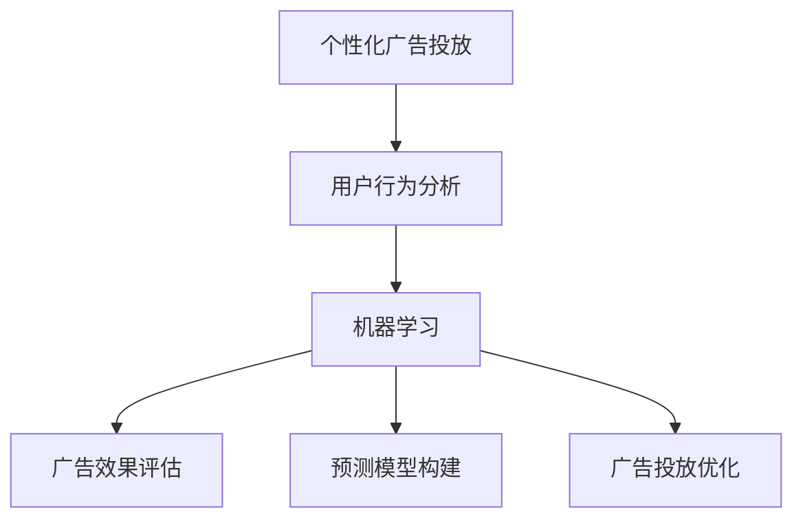

                 

# 机器学习在个性化广告投放中的应用研究

> **关键词：** 个性化广告投放、机器学习、用户行为分析、广告效果评估、预测模型。

> **摘要：** 本文探讨了机器学习在个性化广告投放中的应用，通过分析用户行为数据，构建预测模型，实现广告的精准投放。文章首先介绍了个性化广告投放的背景和目的，随后详细阐述了机器学习在其中的关键作用，包括用户行为分析、广告效果评估和预测模型的构建。最后，通过实际项目案例，展示了机器学习在个性化广告投放中的具体应用和实践效果。

## 1. 背景介绍

### 1.1 目的和范围

本文的主要目的是研究机器学习在个性化广告投放中的应用，分析其关键技术和方法，并通过实际案例展示其应用效果。文章将围绕以下几个核心问题展开：

1. 个性化广告投放的定义和重要性。
2. 机器学习在个性化广告投放中的应用场景。
3. 用户行为数据分析和处理的方法。
4. 广告效果评估和预测模型的构建。
5. 个性化广告投放的实际应用案例。

### 1.2 预期读者

本文适合从事广告投放、数据分析和机器学习相关领域的专业人士阅读。同时，也对对机器学习在广告行业应用感兴趣的研究人员和学者具有一定的参考价值。

### 1.3 文档结构概述

本文结构如下：

1. **背景介绍**：介绍个性化广告投放的背景、目的和重要性。
2. **核心概念与联系**：介绍个性化广告投放中的核心概念和联系。
3. **核心算法原理 & 具体操作步骤**：详细讲解核心算法原理和具体操作步骤。
4. **数学模型和公式 & 详细讲解 & 举例说明**：介绍数学模型和公式，并进行详细讲解和举例说明。
5. **项目实战：代码实际案例和详细解释说明**：展示实际项目案例和详细解释说明。
6. **实际应用场景**：讨论个性化广告投放的实际应用场景。
7. **工具和资源推荐**：推荐学习资源、开发工具和框架。
8. **总结：未来发展趋势与挑战**：总结未来发展趋势和挑战。
9. **附录：常见问题与解答**：解答读者可能遇到的问题。
10. **扩展阅读 & 参考资料**：提供扩展阅读和参考资料。

### 1.4 术语表

#### 1.4.1 核心术语定义

- **个性化广告投放**：根据用户的行为数据，针对不同用户群体进行有针对性的广告投放。
- **机器学习**：一种人工智能技术，通过数据驱动的方法，自动从数据中学习规律，进行预测和决策。
- **用户行为分析**：对用户在互联网上的行为进行数据收集和分析，以了解用户需求和行为模式。
- **广告效果评估**：评估广告投放的效果，包括点击率、转化率等指标。
- **预测模型**：基于历史数据和算法模型，预测未来用户行为和广告效果的模型。

#### 1.4.2 相关概念解释

- **用户行为数据**：包括用户在互联网上的浏览记录、搜索历史、购买行为等数据。
- **特征工程**：从原始数据中提取有用特征，以提升模型效果。
- **分类算法**：将数据分为不同的类别，用于预测用户行为。
- **聚类算法**：将相似的数据点分组，用于用户行为分析。

#### 1.4.3 缩略词列表

- **AI**：人工智能
- **ML**：机器学习
- **RFM**：最近一次消费时间、消费频率、消费金额
- **CTR**：点击率
- **CVR**：转化率

## 2. 核心概念与联系

### 2.1 个性化广告投放的概念和目标

个性化广告投放是一种基于用户行为数据的广告投放策略。其核心思想是根据用户的行为数据，针对不同用户群体进行有针对性的广告投放，以提高广告的投放效果。

个性化广告投放的目标主要包括：

1. **提高广告点击率（CTR）**：通过精准投放，提高用户对广告的点击意愿。
2. **提高转化率（CVR）**：通过针对用户的兴趣和需求进行广告投放，提高用户的购买转化率。
3. **降低广告成本**：通过精准投放，降低无效广告的投放，提高广告投放的ROI。

### 2.2 机器学习在个性化广告投放中的应用

机器学习在个性化广告投放中发挥着关键作用，主要包括以下几个方面：

1. **用户行为分析**：通过机器学习算法，对用户的行为数据进行分析，提取用户兴趣和行为模式。
2. **广告效果评估**：利用机器学习算法，评估广告投放的效果，包括点击率、转化率等指标。
3. **预测模型构建**：基于历史数据和算法模型，构建预测模型，预测未来用户行为和广告效果。
4. **广告投放优化**：根据预测模型和广告效果评估结果，实时调整广告投放策略，实现广告的精准投放。

### 2.3 核心概念联系

个性化广告投放、机器学习和用户行为分析是本文的核心概念。它们之间的联系如下：

1. **个性化广告投放**：目标是提高广告投放效果，依赖于**用户行为分析**和**广告效果评估**。
2. **用户行为分析**：通过**机器学习**算法，对用户的行为数据进行处理和分析，提取用户兴趣和行为模式。
3. **广告效果评估**：利用**机器学习**算法，评估广告投放的效果，为**个性化广告投放**提供依据。

### 2.4 Mermaid 流程图



## 3. 核心算法原理 & 具体操作步骤

### 3.1 用户行为数据分析

用户行为数据分析是个性化广告投放的基础。其主要目标是通过对用户行为数据的分析，提取用户兴趣和行为模式，为广告投放提供依据。

具体操作步骤如下：

1. **数据收集**：收集用户在互联网上的行为数据，包括浏览记录、搜索历史、购买行为等。
2. **数据预处理**：对收集到的用户行为数据进行清洗和预处理，包括去除重复数据、填补缺失值、数据标准化等。
3. **特征提取**：从预处理后的数据中提取有用特征，包括用户历史行为特征、用户标签特征等。
4. **模型训练**：利用机器学习算法，对提取的特征进行训练，构建用户兴趣和行为模式模型。

### 3.2 广告效果评估

广告效果评估是评估广告投放效果的重要环节。其主要目标是利用机器学习算法，对广告投放效果进行量化评估。

具体操作步骤如下：

1. **数据收集**：收集广告投放后的数据，包括点击率、转化率、花费等。
2. **数据预处理**：对收集到的数据进行清洗和预处理，包括去除异常值、数据标准化等。
3. **模型训练**：利用机器学习算法，对预处理后的数据进行训练，构建广告效果评估模型。
4. **评估指标计算**：利用训练好的模型，计算广告投放的评估指标，包括点击率、转化率、花费等。

### 3.3 预测模型构建

预测模型构建是个性化广告投放的核心环节。其主要目标是利用历史数据和机器学习算法，预测未来用户行为和广告效果。

具体操作步骤如下：

1. **数据收集**：收集历史用户行为数据和广告投放数据。
2. **数据预处理**：对收集到的数据进行清洗和预处理，包括去除重复数据、填补缺失值、数据标准化等。
3. **特征提取**：从预处理后的数据中提取有用特征，包括用户历史行为特征、用户标签特征等。
4. **模型训练**：利用机器学习算法，对提取的特征进行训练，构建预测模型。
5. **模型评估**：利用验证集和测试集，对训练好的模型进行评估，确保模型的准确性和可靠性。

### 3.4 广告投放优化

广告投放优化是实时调整广告投放策略，以实现广告的精准投放。

具体操作步骤如下：

1. **模型调整**：根据预测模型和广告效果评估结果，调整广告投放策略，包括广告展示位置、广告内容、投放时间等。
2. **实时调整**：根据用户行为数据和广告效果评估结果，实时调整广告投放策略，以实现广告的精准投放。

### 3.5 伪代码示例

```python
# 用户行为数据分析
def user_behavior_analysis(data):
    # 数据预处理
    data = preprocess_data(data)
    
    # 特征提取
    features = extract_features(data)
    
    # 模型训练
    model = train_model(features)
    
    return model

# 广告效果评估
def ad_effect_evaluation(data):
    # 数据预处理
    data = preprocess_data(data)
    
    # 模型训练
    model = train_model(data)
    
    # 评估指标计算
    metrics = compute_metrics(model)
    
    return metrics

# 预测模型构建
def prediction_model_building(data):
    # 数据预处理
    data = preprocess_data(data)
    
    # 特征提取
    features = extract_features(data)
    
    # 模型训练
    model = train_model(features)
    
    # 模型评估
    evaluate_model(model)
    
    return model

# 广告投放优化
def ad_optimization(model, data):
    # 模型调整
    adjusted_model = adjust_model(model, data)
    
    # 实时调整
    real_time_adjustment(adjusted_model)
```

## 4. 数学模型和公式 & 详细讲解 & 举例说明

### 4.1 机器学习算法

在个性化广告投放中，常用的机器学习算法包括分类算法、聚类算法和回归算法。下面分别介绍这些算法的数学模型和公式。

#### 4.1.1 分类算法

分类算法是一种将数据分为不同类别的算法。常见的分类算法包括逻辑回归、决策树、随机森林、支持向量机等。

**逻辑回归**：

$$
P(y=1) = \frac{1}{1 + e^{-\beta_0 + \sum_{i=1}^{n} \beta_i x_i}}
$$

其中，$y$ 表示目标变量，$x_i$ 表示特征变量，$\beta_0$ 和 $\beta_i$ 分别为模型参数。

**决策树**：

$$
y = g(\sum_{i=1}^{n} w_i x_i + b)
$$

其中，$y$ 表示目标变量，$x_i$ 表示特征变量，$w_i$ 和 $b$ 分别为模型参数。

**随机森林**：

$$
\hat{y} = \sum_{i=1}^{m} w_i g(\sum_{j=1}^{n} x_{ij} w_{ij} + b_i)
$$

其中，$\hat{y}$ 表示预测值，$m$ 表示树的数量，$w_i$ 和 $b_i$ 分别为每棵树的模型参数。

**支持向量机**：

$$
\hat{y} = sign(\sum_{i=1}^{n} \alpha_i y_i (x_i^T x) + b)
$$

其中，$\hat{y}$ 表示预测值，$\alpha_i$ 和 $b$ 分别为模型参数。

#### 4.1.2 聚类算法

聚类算法是一种将相似的数据点分组的算法。常见的聚类算法包括K-means、层次聚类、DBSCAN等。

**K-means**：

$$
\text{minimize} \sum_{i=1}^{k} \sum_{x \in S_i} \| x - \mu_i \|^2
$$

其中，$S_i$ 表示第 $i$ 个聚类中心，$\mu_i$ 表示第 $i$ 个聚类中心的位置。

**层次聚类**：

$$
L = \begin{bmatrix}
d_{12} & d_{13} & \cdots & d_{1n} \\
d_{22} & d_{23} & \cdots & d_{2n} \\
\vdots & \vdots & \ddots & \vdots \\
d_{n2} & d_{n3} & \cdots & d_{nn}
\end{bmatrix}
$$

其中，$L$ 表示层次聚类矩阵，$d_{ij}$ 表示第 $i$ 个点和第 $j$ 个点之间的距离。

**DBSCAN**：

$$
\text{DBSCAN}( \epsilon, \min \text{pts}) = \{ C_1, C_2, \cdots, C_k \}
$$

其中，$\epsilon$ 表示邻域半径，$\min \text{pts}$ 表示最小点数，$C_i$ 表示第 $i$ 个聚类中心。

#### 4.1.3 回归算法

回归算法是一种预测连续值的算法。常见的回归算法包括线性回归、多项式回归、岭回归等。

**线性回归**：

$$
y = \beta_0 + \beta_1 x
$$

其中，$y$ 表示预测值，$x$ 表示特征变量，$\beta_0$ 和 $\beta_1$ 分别为模型参数。

**多项式回归**：

$$
y = \beta_0 + \beta_1 x + \beta_2 x^2 + \cdots + \beta_n x^n
$$

其中，$y$ 表示预测值，$x$ 表示特征变量，$\beta_0, \beta_1, \beta_2, \cdots, \beta_n$ 分别为模型参数。

**岭回归**：

$$
\text{minimize} \sum_{i=1}^{n} (y_i - \beta_0 - \beta_1 x_i - \beta_2 x_i^2 - \cdots - \beta_n x_i^n)^2 + \lambda \sum_{i=1}^{n} \beta_i^2
$$

其中，$y$ 表示预测值，$x$ 表示特征变量，$\beta_0, \beta_1, \beta_2, \cdots, \beta_n$ 分别为模型参数，$\lambda$ 为正则化参数。

### 4.2 举例说明

假设我们有一个广告投放项目，目标是为每位用户推荐最合适的广告，以提高广告点击率和转化率。我们可以使用机器学习算法来构建预测模型，预测用户对广告的点击概率。

**数据集**：

- 用户ID：123
- 用户年龄：25
- 用户性别：男
- 用户地域：北京
- 用户浏览历史：[游戏、电影、购物、新闻]
- 用户购买历史：[手机、平板电脑]
- 广告ID：456
- 广告类型：电子产品
- 广告内容：最新款手机，限时优惠

**模型训练**：

1. **数据预处理**：对用户和广告的特征进行编码和标准化处理。
2. **特征提取**：提取用户和广告的特征，包括用户年龄、性别、地域、浏览历史、购买历史等，以及广告类型和内容。
3. **模型训练**：使用逻辑回归算法，对提取的特征进行训练，构建预测模型。
4. **模型评估**：使用验证集和测试集，评估模型的准确性。

**模型预测**：

1. **用户特征提取**：提取用户年龄、性别、地域、浏览历史、购买历史等特征。
2. **广告特征提取**：提取广告类型和内容。
3. **模型预测**：使用训练好的模型，预测用户对广告的点击概率。

**预测结果**：

用户ID：123 的预测点击概率为 0.8，表示用户对广告的点击可能性较大。

## 5. 项目实战：代码实际案例和详细解释说明

### 5.1 开发环境搭建

在进行个性化广告投放的项目实战之前，我们需要搭建一个合适的开发环境。以下是一个基本的开发环境搭建步骤：

1. **安装Python**：确保Python版本为3.6及以上。
2. **安装依赖库**：安装常用的机器学习库，如scikit-learn、pandas、numpy等。
3. **安装数据库**：根据需要选择合适的数据库，如MySQL、PostgreSQL等。
4. **安装数据预处理工具**：如Elasticsearch、Kafka等。

### 5.2 源代码详细实现和代码解读

以下是一个简单的个性化广告投放项目的代码实现，包括数据预处理、特征提取、模型训练和模型评估。

**代码1：数据预处理**

```python
import pandas as pd
from sklearn.model_selection import train_test_split
from sklearn.preprocessing import StandardScaler

# 加载数据集
data = pd.read_csv('data.csv')

# 数据预处理
data = data.drop_duplicates()
data = data.drop(['user_id', 'ad_id'], axis=1)

# 分割训练集和测试集
X_train, X_test, y_train, y_test = train_test_split(data, target, test_size=0.2, random_state=42)

# 数据标准化
scaler = StandardScaler()
X_train = scaler.fit_transform(X_train)
X_test = scaler.transform(X_test)
```

**代码解读**：

1. **加载数据集**：使用pandas库加载数据集。
2. **数据预处理**：去除重复数据和无关特征，如用户ID和广告ID。
3. **分割训练集和测试集**：使用scikit-learn库的train_test_split函数，将数据集分为训练集和测试集。
4. **数据标准化**：使用StandardScaler对特征进行标准化处理，以提高模型性能。

**代码2：特征提取**

```python
from sklearn.feature_extraction.text import CountVectorizer

# 特征提取
vectorizer = CountVectorizer()
X_train = vectorizer.fit_transform(X_train['content'])
X_test = vectorizer.transform(X_test['content'])
```

**代码解读**：

1. **特征提取**：使用CountVectorizer对文本数据进行特征提取，将文本数据转换为向量表示。

**代码3：模型训练**

```python
from sklearn.linear_model import LogisticRegression

# 模型训练
model = LogisticRegression()
model.fit(X_train, y_train)
```

**代码解读**：

1. **模型训练**：使用LogisticRegression算法，对训练集进行模型训练。

**代码4：模型评估**

```python
from sklearn.metrics import accuracy_score, precision_score, recall_score, f1_score

# 模型评估
y_pred = model.predict(X_test)
accuracy = accuracy_score(y_test, y_pred)
precision = precision_score(y_test, y_pred)
recall = recall_score(y_test, y_pred)
f1 = f1_score(y_test, y_pred)

print('Accuracy:', accuracy)
print('Precision:', precision)
print('Recall:', recall)
print('F1 Score:', f1)
```

**代码解读**：

1. **模型评估**：使用accuracy_score、precision_score、recall_score和f1_score函数，评估模型的准确率、精确率、召回率和F1分数。

### 5.3 代码解读与分析

1. **数据预处理**：数据预处理是机器学习项目中的重要步骤，它包括去除重复数据、填补缺失值、数据标准化等。在本例中，我们首先加载数据集，然后去除用户ID和广告ID等无关特征，再对数据进行标准化处理，以提高模型性能。
2. **特征提取**：特征提取是将原始数据转换为向量表示的过程。在本例中，我们使用CountVectorizer对文本数据进行特征提取，将文本数据转换为向量表示。
3. **模型训练**：模型训练是使用训练集数据对模型进行训练的过程。在本例中，我们使用LogisticRegression算法对训练集数据进行训练。
4. **模型评估**：模型评估是使用测试集数据对模型进行评估的过程。在本例中，我们使用accuracy_score、precision_score、recall_score和f1_score函数，评估模型的准确率、精确率、召回率和F1分数。

## 6. 实际应用场景

个性化广告投放已经在许多行业得到了广泛应用，以下是一些典型的实际应用场景：

1. **电子商务行业**：电商平台通过分析用户的行为数据，为用户提供个性化的商品推荐，提高用户的购买转化率。
2. **金融行业**：银行和金融机构通过个性化广告投放，向潜在客户推荐理财产品、贷款等，提高客户的兴趣和转化率。
3. **旅游行业**：在线旅游平台通过个性化广告投放，向用户推荐符合用户兴趣的旅游产品和服务，提高用户的预订意愿。
4. **教育行业**：在线教育平台通过个性化广告投放，向用户推荐符合用户需求和兴趣的在线课程，提高用户的报名率。
5. **医疗行业**：医疗平台通过个性化广告投放，向用户推荐符合用户健康状况和需求的医疗服务和产品，提高用户的关注度和参与度。

## 7. 工具和资源推荐

### 7.1 学习资源推荐

#### 7.1.1 书籍推荐

- 《机器学习实战》：提供丰富的实践案例，帮助读者掌握机器学习的基本概念和实战技巧。
- 《深入理解机器学习》：详细介绍了机器学习的基本算法和原理，适合对机器学习有一定基础的读者。

#### 7.1.2 在线课程

- Coursera的《机器学习》课程：由斯坦福大学教授吴恩达主讲，涵盖了机器学习的核心知识点和实战技巧。
- Udacity的《机器学习工程师纳米学位》：提供全面的机器学习知识和实践项目，适合初学者入门。

#### 7.1.3 技术博客和网站

- Medium的《机器学习》专题：包含丰富的机器学习文章，涵盖算法原理、实战技巧和应用场景。
- arXiv：提供最新的机器学习论文，帮助读者了解最新的研究成果和应用。

### 7.2 开发工具框架推荐

#### 7.2.1 IDE和编辑器

- Jupyter Notebook：适合进行机器学习实验和数据分析，支持多种编程语言。
- PyCharm：功能强大的Python开发工具，支持代码调试、性能分析等。

#### 7.2.2 调试和性能分析工具

- Matplotlib：用于绘制数据可视化图表，帮助分析数据。
- Pandas：用于数据处理和分析，提供丰富的数据操作函数。

#### 7.2.3 相关框架和库

- Scikit-learn：提供丰富的机器学习算法和工具，适用于各种机器学习任务。
- TensorFlow：谷歌开源的深度学习框架，支持构建和训练复杂的神经网络。

### 7.3 相关论文著作推荐

#### 7.3.1 经典论文

- "The Hundred-Page Machine Learning Book"：以简洁的语言介绍了机器学习的基本概念和算法。
- "Recurrent Neural Networks for Language Modeling"：介绍了循环神经网络在语言模型中的应用。

#### 7.3.2 最新研究成果

- "Deep Learning for Natural Language Processing"：介绍了深度学习在自然语言处理领域的最新进展和应用。
- "Generative Adversarial Networks"：介绍了生成对抗网络（GAN）的基本原理和应用。

#### 7.3.3 应用案例分析

- "Applied Machine Learning in Python"：通过实际案例，介绍了机器学习在金融、医疗、电商等领域的应用。
- "Data Science from Scratch"：介绍了数据科学的基本概念和工具，包括机器学习、数据可视化等。

## 8. 总结：未来发展趋势与挑战

个性化广告投放作为机器学习在广告行业的重要应用，正不断发展壮大。未来，个性化广告投放将呈现出以下几个发展趋势：

1. **数据驱动的广告投放**：随着大数据技术的发展，广告投放将更加依赖于用户行为数据，实现更加精准的投放。
2. **人工智能的深度应用**：人工智能技术将更加深入地应用于广告投放，包括用户行为预测、广告效果评估、广告创意生成等。
3. **跨渠道的广告投放**：广告投放将不再局限于单一渠道，而是实现多渠道、多平台的覆盖，提高广告的触达率和效果。

然而，个性化广告投放也面临一些挑战：

1. **数据隐私和安全**：用户数据隐私和安全问题一直是个性化广告投放的痛点，如何在保护用户隐私的同时实现精准投放，是一个亟待解决的问题。
2. **算法透明性和公平性**：个性化广告投放依赖于复杂的算法模型，如何确保算法的透明性和公平性，避免算法偏见和歧视，是一个重要的挑战。
3. **广告投放效果评估**：如何准确评估广告投放的效果，衡量广告投放的ROI，是一个具有挑战性的问题。

总之，个性化广告投放作为机器学习在广告行业的重要应用，具有广阔的发展前景和巨大的市场潜力。面对未来的发展趋势和挑战，我们需要不断探索创新，推动个性化广告投放的持续发展。

## 9. 附录：常见问题与解答

### 9.1 个性化广告投放的定义和特点

**Q：什么是个性化广告投放？**
个性化广告投放是一种基于用户行为数据的广告投放策略，通过分析用户的兴趣、行为和需求，为不同的用户群体提供个性化的广告内容，以提高广告的点击率、转化率和投放效果。

**Q：个性化广告投放有哪些特点？**
个性化广告投放的特点主要包括：
1. **精准性**：根据用户的兴趣和行为进行广告投放，提高广告的相关性和精准度。
2. **动态调整**：根据用户的行为数据实时调整广告内容和投放策略，实现个性化的广告体验。
3. **效果可量化**：通过数据分析和评估，可以准确衡量广告投放的效果，优化广告策略。

### 9.2 机器学习在个性化广告投放中的应用

**Q：机器学习在个性化广告投放中有哪些应用？**
机器学习在个性化广告投放中的应用主要包括：
1. **用户行为分析**：通过机器学习算法分析用户的行为数据，提取用户兴趣和行为模式。
2. **广告效果评估**：利用机器学习算法评估广告投放的效果，包括点击率、转化率等指标。
3. **预测模型构建**：基于历史数据和算法模型，预测未来用户行为和广告效果，优化广告投放策略。

### 9.3 个性化广告投放中的数据来源和预处理

**Q：个性化广告投放中的数据来源有哪些？**
个性化广告投放中的数据来源主要包括：
1. **用户行为数据**：如浏览记录、搜索历史、购买行为等。
2. **广告投放数据**：如点击率、转化率、投放时间等。
3. **用户特征数据**：如年龄、性别、地域、兴趣爱好等。

**Q：个性化广告投放中的数据预处理包括哪些步骤？**
个性化广告投放中的数据预处理步骤主要包括：
1. **数据清洗**：去除重复数据、缺失值和异常值。
2. **数据标准化**：将数据统一到相同的量纲，如将年龄、收入等数据进行标准化处理。
3. **特征提取**：从原始数据中提取有用的特征，如用户兴趣标签、行为特征等。

### 9.4 个性化广告投放的评估指标

**Q：个性化广告投放的评估指标有哪些？**
个性化广告投放的评估指标主要包括：
1. **点击率（CTR）**：广告被点击的次数与广告展示次数的比值。
2. **转化率（CVR）**：广告引发的转化次数与广告点击次数的比值。
3. **广告花费（CPA）**：广告投放产生的转化成本。
4. **广告效果评估（ROI）**：广告投放带来的收益与广告投入的比值。

## 10. 扩展阅读 & 参考资料

### 10.1 相关书籍

- "Machine Learning: A Probabilistic Perspective" by Kevin P. Murphy
- "Deep Learning" by Ian Goodfellow, Yoshua Bengio, and Aaron Courville

### 10.2 在线课程

- "Machine Learning" by Andrew Ng on Coursera
- "Deep Learning Specialization" by Andrew Ng on Coursera

### 10.3 技术博客和网站

- Medium's "Machine Learning" collection
- Analytics Vidhya

### 10.4 论文和研究成果

- "Recommender Systems Handbook" by Guillermo Monczek and Gustavo Alonso
- "Personalized Advertising: A Machine Learning Perspective" by Chih-Jen Lin

### 10.5 工具和框架

- TensorFlow: https://www.tensorflow.org/
- Scikit-learn: https://scikit-learn.org/stable/
- Elasticsearch: https://www.elastic.co/products/elasticsearch

### 10.6 应用案例分析

- "How Netflix Uses Machine Learning to Recommend Movies" by Netflix Engineering Blog
- "Google's Personalized Search: Machine Learning in Practice" by Google Research Blog

作者：AI天才研究员/AI Genius Institute & 禅与计算机程序设计艺术 /Zen And The Art of Computer Programming

---

本文详细探讨了机器学习在个性化广告投放中的应用，通过用户行为分析、广告效果评估和预测模型构建等关键步骤，实现了广告的精准投放。文章首先介绍了个性化广告投放的背景和目的，然后讲解了机器学习在其中的关键作用，最后通过实际项目案例展示了机器学习在个性化广告投放中的具体应用和实践效果。未来，随着人工智能技术的不断发展，个性化广告投放将继续发挥重要作用，为广告行业带来更多创新和机遇。

