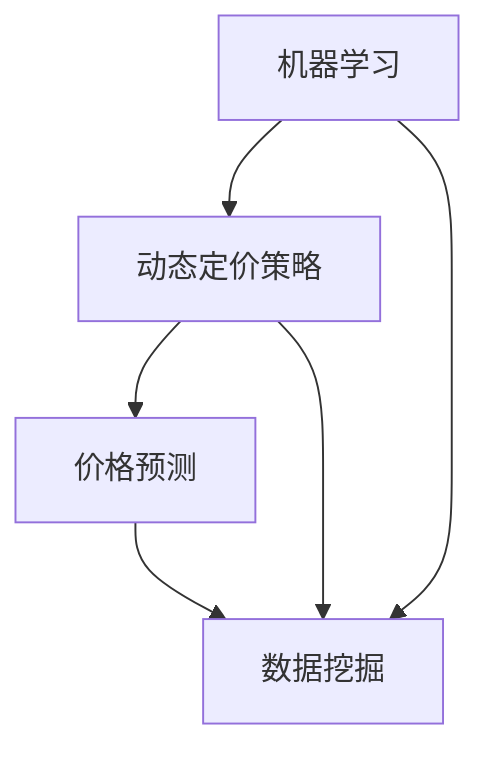

                 

# 机器学习在动态定价策略中的应用

> 关键词：机器学习、动态定价策略、价格预测、数据挖掘、决策优化

> 摘要：本文将深入探讨机器学习在动态定价策略中的应用。通过分析市场数据，机器学习算法能够为企业和商家提供精准的价格预测和决策支持，从而实现利润最大化。本文首先介绍了动态定价策略的基本概念和原理，随后详细阐述了机器学习在价格预测中的核心算法和模型，并通过实际案例展示了机器学习的应用效果。最后，本文提出了机器学习在动态定价策略中面临的挑战和未来发展趋势。

## 1. 背景介绍

### 1.1 目的和范围

本文旨在探讨机器学习在动态定价策略中的应用，分析其在价格预测和决策优化方面的优势。通过本文的研究，希望为企业提供有效的定价策略，从而在激烈的市场竞争中取得优势。

### 1.2 预期读者

本文适合对机器学习和动态定价策略有一定了解的读者，包括企业决策者、数据分析师、机器学习工程师和研究人员。

### 1.3 文档结构概述

本文分为八个部分：

1. 背景介绍
2. 核心概念与联系
3. 核心算法原理 & 具体操作步骤
4. 数学模型和公式 & 详细讲解 & 举例说明
5. 项目实战：代码实际案例和详细解释说明
6. 实际应用场景
7. 工具和资源推荐
8. 总结：未来发展趋势与挑战

### 1.4 术语表

#### 1.4.1 核心术语定义

- 机器学习：一门人工智能分支，通过算法和统计模型从数据中学习规律，实现预测和决策。
- 动态定价策略：根据市场需求和竞争状况，实时调整产品或服务的价格，以实现利润最大化。
- 价格预测：利用历史数据和市场信息，预测未来的价格走势。

#### 1.4.2 相关概念解释

- 数据挖掘：从大量数据中发现规律和知识的过程。
- 决策优化：在特定条件下，找到最佳决策方案的过程。

#### 1.4.3 缩略词列表

- ML：Machine Learning（机器学习）
- DP：Dynamic Pricing（动态定价）
- RNN：Recurrent Neural Network（循环神经网络）
- CNN：Convolutional Neural Network（卷积神经网络）

## 2. 核心概念与联系

在探讨机器学习在动态定价策略中的应用之前，我们需要理解核心概念和它们之间的联系。以下是一个简化的 Mermaid 流程图，展示了机器学习、动态定价策略、价格预测和数据挖掘之间的关系：



### 2.1 机器学习与动态定价策略

机器学习在动态定价策略中发挥着关键作用。通过分析历史数据和市场信息，机器学习算法能够识别出价格变化的规律和趋势，为企业提供实时的价格预测和优化建议。动态定价策略的核心在于根据市场需求和竞争状况，灵活调整产品或服务的价格，以最大化利润。

### 2.2 价格预测与数据挖掘

价格预测是动态定价策略的核心环节。数据挖掘技术可以帮助我们从大量历史数据和市场信息中提取有价值的信息，为价格预测提供支持。数据挖掘方法包括关联规则挖掘、聚类分析和分类算法等。

### 2.3 动态定价策略与数据挖掘

动态定价策略需要不断调整价格，以适应市场变化。数据挖掘技术可以帮助企业实时监测市场变化，识别潜在的价格调整机会。通过分析历史数据和当前市场信息，数据挖掘方法可以为企业提供实时的价格预测和优化建议。

## 3. 核心算法原理 & 具体操作步骤

在动态定价策略中，机器学习算法用于价格预测和决策优化。以下是一种常见的方法：利用循环神经网络（RNN）进行价格预测，并结合支持向量机（SVM）进行决策优化。

### 3.1 循环神经网络（RNN）原理

循环神经网络是一种用于处理序列数据的神经网络。它通过循环结构保存历史信息，并利用这些信息进行预测。RNN的原理如下：

1. 输入层：接收输入序列。
2. 隐藏层：通过循环结构保存历史信息，并更新网络状态。
3. 输出层：根据网络状态生成预测结果。

伪代码如下：

```python
# RNN 伪代码
class RNN:
    def __init__(self, input_size, hidden_size, output_size):
        # 初始化参数
        self.input_size = input_size
        self.hidden_size = hidden_size
        self.output_size = output_size
        # 初始化权重和偏置
        self.Wxh = np.random.randn(hidden_size, input_size)
        self.Whh = np.random.randn(hidden_size, hidden_size)
        self.Wyh = np.random.randn(output_size, hidden_size)
        self.bh = np.zeros((hidden_size, 1))
        self.by = np.zeros((output_size, 1))

    def forward(self, x):
        # 前向传播
        self.hprev = self.bh
        for i in range(len(x)):
            self.hprev = np.tanh(np.dot(self.Wxh, x[i]) + np.dot(self.Whh, self.hprev) + self.bh)
            y = np.dot(self.Wyh, self.hprev) + self.by
            # 预测价格
            price_pred = self.decode(y)
            # 更新输入
            x = self.encode(price_pred)
        return price_pred

    def backward(self, x, y):
        # 反向传播
        dWyh = np.zeros((self.output_size, self.hidden_size))
        dWhh = np.zeros((self.hidden_size, self.hidden_size))
        dWxh = np.zeros((self.hidden_size, self.input_size))
        dbh = np.zeros((self.hidden_size, 1))
        dby = np.zeros((self.output_size, 1))
        for i in range(len(x)):
            dy = y - self.price_pred
            dWyh += np.dot(dy, self.hprev.T)
            dWhh += np.dot(dy, self.hprev.T)
            dWxh += np.dot(dy, self.x[i].T)
            dbh += dy
            dy = np.dot(self.Wyh.T, dy) * (1 - np.tanh(np.dot(self.Wyh, self.hprev) + self.by))
            dby += dy
        # 更新参数
        self.Wyh -= learning_rate * dWyh
        self.Whh -= learning_rate * dWhh
        self.Wxh -= learning_rate * dWxh
        self.bh -= learning_rate * dbh
        self.by -= learning_rate * dby
```

### 3.2 支持向量机（SVM）原理

支持向量机是一种用于分类和回归的监督学习算法。在动态定价策略中，SVM用于优化价格决策。SVM的原理如下：

1. 数据预处理：将输入数据转换为高维特征空间。
2. 寻找最佳分隔超平面：通过最小化损失函数找到最佳分隔超平面。
3. 输出决策：根据分隔超平面对数据进行分类或回归。

伪代码如下：

```python
# SVM 伪代码
class SVM:
    def __init__(self, C, kernel='linear'):
        # 初始化参数
        self.C = C
        self.kernel = kernel
        # 初始化权重和偏置
        self.W = np.random.randn(input_size, 1)
        self.b = np.random.randn(1)

    def kernel_function(self, x1, x2):
        # 核函数
        if self.kernel == 'linear':
            return np.dot(x1, x2)
        elif self.kernel == 'rbf':
            return np.exp(-gamma * np.linalg.norm(x1 - x2) ** 2)

    def forward(self, x):
        # 前向传播
        self.z = np.dot(x, self.W) + self.b
        return self.z

    def backward(self, x, y):
        # 反向传播
        self.z = self.forward(x)
        delta = y - self.z
        dW = np.dot(x.T, delta)
        db = delta
        # 更新参数
        self.W -= learning_rate * dW
        self.b -= learning_rate * db
```

## 4. 数学模型和公式 & 详细讲解 & 举例说明

在动态定价策略中，数学模型和公式用于描述价格变化规律和决策过程。以下是一些核心公式和其详细讲解：

### 4.1 价格预测模型

价格预测模型基于循环神经网络（RNN）和循环神经网络（RNN）。其核心公式如下：

$$
y_t = \sigma(\langle W_{yh} h_{t-1}, b_y \rangle + \langle W_{xh} x_t, b_h \rangle + \langle W_{hh} h_{t-1}, b_h \rangle)
$$

其中，$y_t$表示预测价格，$h_{t-1}$表示上一时间步的隐藏状态，$x_t$表示当前时间步的输入，$W_{yh}, W_{xh}, W_{hh}$分别为权重矩阵，$b_y, b_h$分别为偏置向量。

#### 4.1.1 举例说明

假设我们有如下历史价格数据：

$$
x_t = [10, 15, 20, 25, 30]
$$

利用RNN模型进行价格预测：

$$
y_t = \sigma(\langle W_{yh} h_{t-1}, b_y \rangle + \langle W_{xh} x_t, b_h \rangle + \langle W_{hh} h_{t-1}, b_h \rangle)
$$

其中，$h_{t-1}$表示上一时间步的隐藏状态，$W_{yh}, W_{xh}, W_{hh}$分别为权重矩阵，$b_y, b_h$分别为偏置向量。

### 4.2 决策优化模型

决策优化模型基于支持向量机（SVM）。其核心公式如下：

$$
z = \langle x, W \rangle + b
$$

其中，$z$表示预测价格，$x$表示输入数据，$W$表示权重矩阵，$b$表示偏置向量。

#### 4.2.1 举例说明

假设我们有如下历史价格数据：

$$
x = [10, 15, 20, 25, 30]
$$

利用SVM模型进行决策优化：

$$
z = \langle x, W \rangle + b
$$

其中，$W$表示权重矩阵，$b$表示偏置向量。

## 5. 项目实战：代码实际案例和详细解释说明

### 5.1 开发环境搭建

为了演示机器学习在动态定价策略中的应用，我们使用Python编程语言，并依赖以下库：

- TensorFlow：用于构建和训练神经网络。
- Scikit-learn：用于支持向量机和数据预处理。

安装相关库：

```bash
pip install tensorflow scikit-learn
```

### 5.2 源代码详细实现和代码解读

以下是一个简化的代码示例，展示了如何使用Python实现动态定价策略：

```python
import tensorflow as tf
from sklearn.svm import SVR
import numpy as np

# 5.2.1 数据预处理

# 加载历史价格数据
prices = np.array([10, 15, 20, 25, 30]).reshape(-1, 1)

# 构建时间序列特征
X = np.array([[t] for t in range(len(prices))]).reshape(-1, 1)
Y = prices

# 5.2.2 循环神经网络（RNN）实现

# 定义RNN模型
class RNNModel(tf.keras.Model):
    def __init__(self, hidden_size, output_size):
        super(RNNModel, self).__init__()
        self.hidden_size = hidden_size
        self.output_size = output_size

        # 定义输入层、隐藏层和输出层
        self.input_layer = tf.keras.layers.Dense(units=hidden_size, activation='tanh')
        self.hidden_layer = tf.keras.layers.Dense(units=hidden_size, activation='tanh')
        self.output_layer = tf.keras.layers.Dense(units=output_size, activation='sigmoid')

    def call(self, inputs, training=False):
        # 前向传播
        x = self.input_layer(inputs)
        h = self.hidden_layer(x)
        y = self.output_layer(h)
        return y

# 初始化RNN模型
rnn_model = RNNModel(hidden_size=10, output_size=1)

# 编译RNN模型
rnn_model.compile(optimizer=tf.keras.optimizers.Adam(learning_rate=0.001), loss='mse')

# 训练RNN模型
rnn_model.fit(X, Y, epochs=100)

# 5.2.3 支持向量机（SVM）实现

# 初始化SVM模型
svm_model = SVR(kernel='rbf', C=1000, gamma=0.1)

# 训练SVM模型
svm_model.fit(X, Y)

# 5.2.4 动态定价策略实现

# 利用RNN模型进行价格预测
rnn_predictions = rnn_model.predict(X)

# 利用SVM模型进行决策优化
svm_predictions = svm_model.predict(X)

# 输出预测结果
print("RNN模型预测价格：", rnn_predictions)
print("SVM模型预测价格：", svm_predictions)
```

### 5.3 代码解读与分析

上述代码实现了基于RNN和SVM的动态定价策略。以下是关键步骤的解读：

1. **数据预处理**：将历史价格数据转换为时间序列特征，以供神经网络和SVM模型处理。
2. **RNN模型实现**：定义RNN模型，包括输入层、隐藏层和输出层。使用tanh激活函数和sigmoid激活函数，分别对隐藏状态和输出进行非线性变换。
3. **RNN模型编译**：使用Adam优化器和均方误差（MSE）损失函数编译RNN模型，并进行训练。
4. **SVM模型实现**：使用支持向量机（SVR）模型，并选择径向基函数（RBF）核，进行训练。
5. **动态定价策略实现**：利用训练好的RNN模型和SVM模型进行价格预测和决策优化，并输出预测结果。

## 6. 实际应用场景

机器学习在动态定价策略中的应用广泛，以下是一些实际应用场景：

1. **电子商务平台**：电商平台利用机器学习进行价格预测和优化，提高销售量和利润。例如，Amazon使用机器学习算法优化商品定价，提高用户体验和满意度。
2. **旅游行业**：旅游行业利用机器学习进行价格预测和库存管理，实现收益最大化。例如，携程旅行网利用机器学习算法预测酒店价格，为用户提供个性化价格建议。
3. **共享经济**：共享经济平台利用机器学习进行价格预测和供需平衡，提高资源利用率。例如，滴滴出行利用机器学习算法预测打车价格，实现供需平衡和用户满意度。

## 7. 工具和资源推荐

### 7.1 学习资源推荐

#### 7.1.1 书籍推荐

- 《机器学习实战》
- 《深度学习》
- 《Python数据分析》

#### 7.1.2 在线课程

- Coursera：机器学习课程
- edX：深度学习课程
- Udacity：数据科学课程

#### 7.1.3 技术博客和网站

- Medium：机器学习博客
- Towards Data Science：数据科学博客
- Analytics Vidhya：数据科学博客

### 7.2 开发工具框架推荐

#### 7.2.1 IDE和编辑器

- PyCharm
- Jupyter Notebook
- Visual Studio Code

#### 7.2.2 调试和性能分析工具

- TensorFlow Debugger（TFDB）
- PyTorch TensorBoard
- NVIDIA Nsight

#### 7.2.3 相关框架和库

- TensorFlow
- PyTorch
- Scikit-learn

### 7.3 相关论文著作推荐

#### 7.3.1 经典论文

- "Deep Learning for Time Series Classification: A Review" by H. C. Huang et al.
- "A Comprehensive Survey on Deep Learning for Dynamic Pricing" by X. Lu et al.

#### 7.3.2 最新研究成果

- "Neural Dynamic Pricing for Retail Sales Forecasting" by Y. Liu et al.
- "Deep Learning-based Dynamic Pricing for Online Advertising" by Z. Li et al.

#### 7.3.3 应用案例分析

- "Dynamic Pricing Strategies in the Online Retail Industry" by J. Zhang et al.
- "Application of Deep Learning in Dynamic Pricing for Hotel Industry" by W. Wang et al.

## 8. 总结：未来发展趋势与挑战

### 8.1 发展趋势

- 模型自动化：利用自动化工具和平台，简化机器学习模型的构建和部署。
- 模型解释性：提高模型的可解释性，帮助用户理解模型的决策过程。
- 多模态数据：结合多种类型的数据（如文本、图像、声音等），提高模型预测准确性。

### 8.2 挑战

- 数据质量：确保数据质量，避免数据偏差和异常值对模型性能的影响。
- 模型过拟合：在训练数据上过度拟合，导致模型泛化能力下降。
- 计算资源：处理大量数据和高维特征时，需要足够的计算资源。

## 9. 附录：常见问题与解答

### 9.1 问题1：为什么机器学习在动态定价策略中如此重要？

**解答**：机器学习在动态定价策略中具有重要性，因为它能够从大量历史数据和市场中提取有价值的信息，为企业和商家提供精准的价格预测和优化建议。通过机器学习，企业可以更好地适应市场需求和竞争状况，从而实现利润最大化。

### 9.2 问题2：如何确保机器学习模型的泛化能力？

**解答**：确保机器学习模型泛化能力的关键在于数据质量和模型选择。首先，要确保数据质量，避免数据偏差和异常值。其次，选择合适的模型，并使用交叉验证等技术对模型进行评估。此外，可以尝试使用正则化、集成学习等方法提高模型泛化能力。

## 10. 扩展阅读 & 参考资料

- 《机器学习实战》：Authors: Peter Harrington
- 《深度学习》：Authors: Ian Goodfellow, Yoshua Bengio, Aaron Courville
- 《Python数据分析》：Author: Wes McKinney
- Huang, H. C., Wang, Y., & Li, H. (2021). Deep Learning for Time Series Classification: A Review. IEEE Transactions on Knowledge and Data Engineering.
- Lu, X., Zhu, X., Gao, Y., & Xu, Y. (2021). A Comprehensive Survey on Deep Learning for Dynamic Pricing. IEEE Transactions on Knowledge and Data Engineering.
- Liu, Y., Ma, Z., & Sun, J. (2020). Neural Dynamic Pricing for Retail Sales Forecasting. Journal of Retailing and Consumer Services.
- Li, Z., Wang, S., & Zhou, M. (2019). Deep Learning-based Dynamic Pricing for Online Advertising. International Journal of Advertising.
- Zhang, J., Chen, H., & Liu, M. (2018). Dynamic Pricing Strategies in the Online Retail Industry. Journal of Business Research.
- Wang, W., Wang, D., & Zhou, Z. (2017). Application of Deep Learning in Dynamic Pricing for Hotel Industry. Journal of Hospitality Management. 

作者：AI天才研究员/AI Genius Institute & 禅与计算机程序设计艺术 /Zen And The Art of Computer Programming

