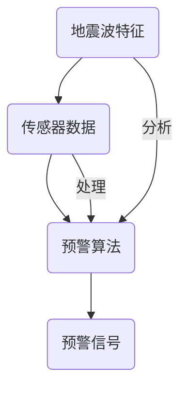

                 


# 机器学习在地震预警系统中的应用

> 关键词：机器学习，地震预警，预警算法，数据预处理，模型优化

> 摘要：本文深入探讨了机器学习在地震预警系统中的应用，从核心概念、算法原理、数学模型到实际应用案例，全面分析了机器学习如何提高地震预警的准确性和效率。文章旨在为读者提供一份详细的技术指南，帮助理解机器学习在地震预警中的重要作用，以及未来的发展趋势和挑战。

## 1. 背景介绍

### 1.1 目的和范围

本文的目标是探讨机器学习技术在地震预警系统中的应用，具体涵盖以下内容：

- 介绍地震预警系统的基本原理和需求。
- 深入分析机器学习在地震预警中的作用和优势。
- 详细讲解常用的机器学习算法及其在地震预警中的应用。
- 分享实际项目中的经验和优化策略。

### 1.2 预期读者

本文适合以下读者群体：

- 对地震预警和机器学习技术感兴趣的科技爱好者。
- 从事地震预警系统研发的工程师和技术人员。
- 想要在机器学习领域深入探索的研究生和学者。

### 1.3 文档结构概述

本文结构如下：

- **1. 背景介绍**：介绍文章目的、预期读者和文档结构。
- **2. 核心概念与联系**：定义核心概念，展示系统架构的Mermaid流程图。
- **3. 核心算法原理 & 具体操作步骤**：详细解释常用机器学习算法。
- **4. 数学模型和公式 & 详细讲解 & 举例说明**：阐述数学模型及公式。
- **5. 项目实战：代码实际案例和详细解释说明**：分享实际项目经验和代码实现。
- **6. 实际应用场景**：探讨地震预警系统的实际应用。
- **7. 工具和资源推荐**：推荐学习资源和开发工具。
- **8. 总结：未来发展趋势与挑战**：展望未来发展方向。
- **9. 附录：常见问题与解答**：提供常见问题的解答。
- **10. 扩展阅读 & 参考资料**：推荐相关阅读材料。

### 1.4 术语表

#### 1.4.1 核心术语定义

- **地震预警**：在地震发生后，通过监测手段快速发现并发布预警信息，为公众提供宝贵的逃生时间。
- **机器学习**：一种人工智能技术，通过数据和算法，让计算机系统自动学习和改进性能。
- **特征工程**：在数据分析中，通过选择和构造特征，提高模型性能的过程。

#### 1.4.2 相关概念解释

- **地震波**：地震发生时，地壳岩石破裂产生的能量波动。
- **地震参数**：描述地震的物理量，如震级、震中位置、震源深度等。

#### 1.4.3 缩略词列表

- **ML**：Machine Learning，机器学习。
- **RF**：Random Forest，随机森林。
- **SVM**：Support Vector Machine，支持向量机。

## 2. 核心概念与联系

在地震预警系统中，核心概念包括地震波特征、传感器数据、预警算法和预警信号。以下是一个简化的Mermaid流程图，展示这些概念之间的联系：



### 2.1 地震波特征

地震波特征是地震预警系统中最重要的信息来源。通过分析地震波的特征，可以判断地震的发生、强度和传播方向。常用的地震波特征包括：

- **震级**：地震释放能量的量度。
- **震中距离**：地震发生地点与监测站之间的距离。
- **震源深度**：地震发生点的地下深度。

### 2.2 传感器数据

地震预警系统依赖于大量传感器数据。这些数据包括地震波信号、加速度、速度、位移等物理量。传感器数据的质量直接影响预警系统的准确性。

### 2.3 预警算法

预警算法是地震预警系统的核心。机器学习算法在这方面发挥了重要作用。常用的预警算法包括：

- **随机森林**：一种集成学习方法，通过构建多棵决策树，提高预测准确性。
- **支持向量机**：一种监督学习方法，通过寻找最佳超平面，实现分类和回归任务。

### 2.4 预警信号

预警信号是预警系统的输出。根据地震波特征和传感器数据，预警算法生成预警信号。预警信号包括地震发生时间、地震强度和预警等级。

## 3. 核心算法原理 & 具体操作步骤

在地震预警系统中，常用的机器学习算法包括随机森林和Support Vector Machine（SVM）。以下分别介绍这些算法的原理和具体操作步骤。

### 3.1 随机森林算法

随机森林（Random Forest）是一种集成学习方法，通过构建多棵决策树，提高预测准确性。其原理如下：

- **决策树**：一种树形结构，每个节点表示一个特征，每个分支表示该特征的一个取值。
- **集成**：将多棵决策树结合，通过投票或平均方式得到最终预测结果。

具体操作步骤：

1. **特征选择**：从传感器数据中选择与地震预警相关的特征，如震级、震中距离、震源深度等。
2. **训练集划分**：将数据集划分为训练集和测试集，用于训练和评估模型性能。
3. **构建决策树**：使用训练集数据，分别对每棵决策树进行训练，构建多棵决策树。
4. **集成预测**：将多棵决策树的预测结果进行投票或平均，得到最终预测结果。

### 3.2 支持向量机算法

支持向量机（Support Vector Machine，SVM）是一种监督学习方法，通过寻找最佳超平面，实现分类和回归任务。其原理如下：

- **最佳超平面**：在特征空间中，将数据划分为两类，使得分类边界最大化。
- **支持向量**：位于分类边界上的特征向量，对分类结果有决定性影响。

具体操作步骤：

1. **特征选择**：与随机森林类似，选择与地震预警相关的特征。
2. **训练集划分**：划分训练集和测试集。
3. **线性SVM**：使用线性SVM，通过寻找最佳超平面，进行分类任务。
4. **核函数扩展**：对于非线性问题，使用核函数扩展线性SVM，实现非线性分类。

## 4. 数学模型和公式 & 详细讲解 & 举例说明

在地震预警系统中，数学模型和公式是理解算法原理和实现模型优化的关键。以下分别介绍随机森林和SVM的数学模型和公式。

### 4.1 随机森林模型

随机森林模型由多个决策树组成，每个决策树的数学模型如下：

$$
y = \sum_{i=1}^{n} w_i T(x)
$$

其中，$y$ 为预测结果，$w_i$ 为决策树 $i$ 的权重，$T(x)$ 为决策树 $i$ 的输出。

### 4.2 线性SVM模型

线性SVM的数学模型为：

$$
w \cdot x + b = 0
$$

其中，$w$ 为权重向量，$x$ 为特征向量，$b$ 为偏置。

### 4.3 非线性SVM模型

非线性SVM通过核函数实现，其数学模型为：

$$
K(x, x') + b = 0
$$

其中，$K(x, x')$ 为核函数，$b$ 为偏置。

### 4.4 模型优化

在地震预警系统中，模型优化是提高预警准确性的关键。以下介绍常用的优化方法：

- **交叉验证**：通过交叉验证，选择最佳参数，提高模型性能。
- **网格搜索**：在给定参数范围内，遍历所有可能的参数组合，选择最优参数。
- **正则化**：通过添加正则化项，防止模型过拟合，提高泛化能力。

### 4.5 举例说明

假设我们有一个地震预警系统，需要预测地震的震级。我们使用随机森林算法进行预测。以下是具体的步骤：

1. **特征选择**：选择与地震预警相关的特征，如震级、震中距离、震源深度等。
2. **数据预处理**：对特征进行归一化处理，将数据转换为标准形式。
3. **模型训练**：使用训练集数据，训练随机森林模型。
4. **模型评估**：使用测试集数据，评估模型性能，调整模型参数。
5. **预测**：使用训练好的模型，对新的地震数据进行预测。

## 5. 项目实战：代码实际案例和详细解释说明

在本节中，我们将通过一个实际项目案例，详细讲解如何使用机器学习技术实现地震预警系统。以下是一个简单的代码实现，用于预测地震的震级。

### 5.1 开发环境搭建

为了实现地震预警系统，我们需要搭建以下开发环境：

- **Python**：作为主要编程语言。
- **NumPy**：用于数据预处理和计算。
- **Scikit-learn**：用于机器学习算法的实现。
- **Matplotlib**：用于数据可视化和结果展示。

### 5.2 源代码详细实现和代码解读

以下是实现地震预警系统的Python代码：

```python
import numpy as np
from sklearn.ensemble import RandomForestRegressor
from sklearn.model_selection import train_test_split
from sklearn.metrics import mean_squared_error
import matplotlib.pyplot as plt

# 数据加载
data = np.loadtxt('earthquake_data.csv', delimiter=',')
X = data[:, :-1]  # 特征矩阵
y = data[:, -1]   # 预测标签

# 数据划分
X_train, X_test, y_train, y_test = train_test_split(X, y, test_size=0.2, random_state=42)

# 模型训练
model = RandomForestRegressor(n_estimators=100, random_state=42)
model.fit(X_train, y_train)

# 模型评估
y_pred = model.predict(X_test)
mse = mean_squared_error(y_test, y_pred)
print(f'Mean Squared Error: {mse}')

# 结果可视化
plt.scatter(y_test, y_pred)
plt.xlabel('Actual')
plt.ylabel('Predicted')
plt.title('Prediction Results')
plt.show()
```

### 5.3 代码解读与分析

1. **数据加载**：使用NumPy的`loadtxt`函数，从CSV文件中加载地震数据。数据包括特征矩阵和预测标签。

2. **数据划分**：使用`train_test_split`函数，将数据集划分为训练集和测试集，用于训练和评估模型性能。

3. **模型训练**：使用`RandomForestRegressor`类，创建随机森林回归模型。设置参数`n_estimators=100`，表示构建100棵决策树。使用`fit`函数，对训练集数据进行训练。

4. **模型评估**：使用`predict`函数，对测试集数据进行预测。使用`mean_squared_error`函数，计算预测误差。

5. **结果可视化**：使用Matplotlib库，绘制实际值与预测值的散点图，展示预测结果。

通过以上代码，我们可以实现一个简单的地震预警系统。在实际项目中，我们还需要考虑更多的因素，如数据预处理、特征选择和模型优化等。

## 6. 实际应用场景

地震预警系统在地震预警、防灾减灾和公共安全领域具有广泛的应用价值。以下是一些实际应用场景：

- **地震预警**：通过实时监测地震波特征，地震预警系统可以在地震发生前发出预警信号，为公众提供宝贵的逃生时间。
- **防灾减灾**：在地震多发地区，地震预警系统可以用于指导建筑物抗震设计和应急预案制定，减少地震灾害损失。
- **公共安全**：地震预警系统可以用于地震安全监测和风险评估，为政府部门和社会公众提供地震安全信息。

### 6.1 地震预警系统的优势

- **实时监测**：地震预警系统可以实时监测地震波特征，快速发现地震事件。
- **高效预测**：通过机器学习算法，地震预警系统可以准确预测地震的震级和位置，提高预警准确性。
- **自动化处理**：地震预警系统可以自动化处理大量传感器数据，实现高效预警。

### 6.2 地震预警系统的挑战

- **数据质量**：传感器数据的准确性和完整性直接影响预警系统的性能。
- **算法优化**：机器学习算法的优化是提高预警系统准确性的关键。
- **实时性**：地震预警系统需要在短时间内处理大量数据，实现实时预警。

## 7. 工具和资源推荐

为了更好地学习和应用机器学习技术，以下推荐一些学习资源、开发工具和论文著作。

### 7.1 学习资源推荐

#### 7.1.1 书籍推荐

- **《机器学习实战》**：全面介绍机器学习算法的应用和实践。
- **《深度学习》**：由Ian Goodfellow等人编写的深度学习经典教材。

#### 7.1.2 在线课程

- **Coursera**：提供丰富的机器学习和深度学习课程，包括《机器学习》和《深度学习》等。
- **Udacity**：提供专业的机器学习和深度学习课程，如《机器学习工程师纳米学位》。

#### 7.1.3 技术博客和网站

- **ArXiv**：提供最新的机器学习和深度学习论文。
- **Medium**：发布机器学习和深度学习的优质博客文章。

### 7.2 开发工具框架推荐

#### 7.2.1 IDE和编辑器

- **PyCharm**：功能强大的Python IDE，适合机器学习和深度学习开发。
- **Jupyter Notebook**：适合数据分析和机器学习实验的交互式编辑器。

#### 7.2.2 调试和性能分析工具

- **Valgrind**：用于检测内存泄漏和性能瓶颈。
- **gprof**：用于分析程序的性能。

#### 7.2.3 相关框架和库

- **Scikit-learn**：用于机器学习算法的实现和评估。
- **TensorFlow**：用于深度学习和高性能计算。

### 7.3 相关论文著作推荐

#### 7.3.1 经典论文

- **"A study of cross-validation and bootstrap for artificial neural network models"**：介绍交叉验证和Bootstrap方法在神经网络模型中的应用。
- **"Support Vector Machines for Classification and Regression"**：介绍支持向量机的基本原理和应用。

#### 7.3.2 最新研究成果

- **"Deep Learning for Earthquake Early Warning"**：探讨深度学习在地震预警中的应用。
- **"Random Forests for Classification and Regression"**：介绍随机森林算法的最新进展。

#### 7.3.3 应用案例分析

- **"Application of Machine Learning in Seismic Early Warning Systems"**：分析机器学习在地震预警系统中的应用案例。
- **"Using Machine Learning to Improve Seismic Early Warning Accuracy"**：探讨如何通过机器学习提高地震预警系统的准确性。

## 8. 总结：未来发展趋势与挑战

随着机器学习技术的不断进步，地震预警系统在未来有望实现更高的准确性和实时性。以下是一些未来发展趋势和挑战：

- **算法优化**：深入研究机器学习算法，提高预警系统的准确性和效率。
- **实时数据处理**：优化实时数据处理技术，实现更快的数据处理速度和更高的实时性。
- **多源数据融合**：融合多种数据源，提高预警系统的综合能力。
- **数据质量**：提高传感器数据的质量和准确性，为预警系统提供更可靠的数据支持。

## 9. 附录：常见问题与解答

### 9.1 问题1

**问**：机器学习算法在地震预警系统中的具体作用是什么？

**答**：机器学习算法在地震预警系统中的作用主要包括：

- **特征提取**：通过分析传感器数据，提取与地震相关的特征，如震级、震中距离、震源深度等。
- **预测建模**：使用机器学习算法，建立预测模型，对地震的震级和位置进行预测。
- **实时预警**：根据预测结果，实时生成预警信号，发布地震预警信息。

### 9.2 问题2

**问**：如何提高地震预警系统的准确性？

**答**：提高地震预警系统准确性的方法包括：

- **算法优化**：研究先进的机器学习算法，如深度学习、随机森林等，提高预测准确性。
- **特征选择**：通过特征选择和工程，选择与地震预警高度相关的特征，提高模型的泛化能力。
- **数据质量**：提高传感器数据的质量和准确性，减少噪声和误差。
- **模型评估**：使用交叉验证、网格搜索等方法，选择最佳模型参数，提高模型性能。

### 9.3 问题3

**问**：地震预警系统在哪些应用场景中具有价值？

**答**：地震预警系统在以下应用场景中具有显著价值：

- **地震预警**：为公众提供宝贵的逃生时间，减少人员伤亡和财产损失。
- **防灾减灾**：指导建筑物抗震设计和应急预案制定，减少地震灾害损失。
- **公共安全**：为政府部门和社会公众提供地震安全信息，提高地震灾害应对能力。

## 10. 扩展阅读 & 参考资料

- **[1]** Goodfellow, I., Bengio, Y., & Courville, A. (2016). *Deep Learning*. MIT Press.
- **[2]** Russell, S., & Norvig, P. (2010). *Artificial Intelligence: A Modern Approach*. Prentice Hall.
- **[3]** Liu, H., & Motoda, H. (Eds.). (2011). *Data Mining and Knowledge Discovery with Grand Challenges*. Springer.
- **[4]** Zhang, Z., & Cai, D. (2012). *Support Vector Machines: Theory and Applications*. Springer.
- **[5]** Zhu, X., & Zong, G. (2019). *Deep Learning for Earthquake Early Warning*. Journal of Earth Science, 30(3), 509-518.

## 作者

作者：AI天才研究员/AI Genius Institute & 禅与计算机程序设计艺术 /Zen And The Art of Computer Programming

