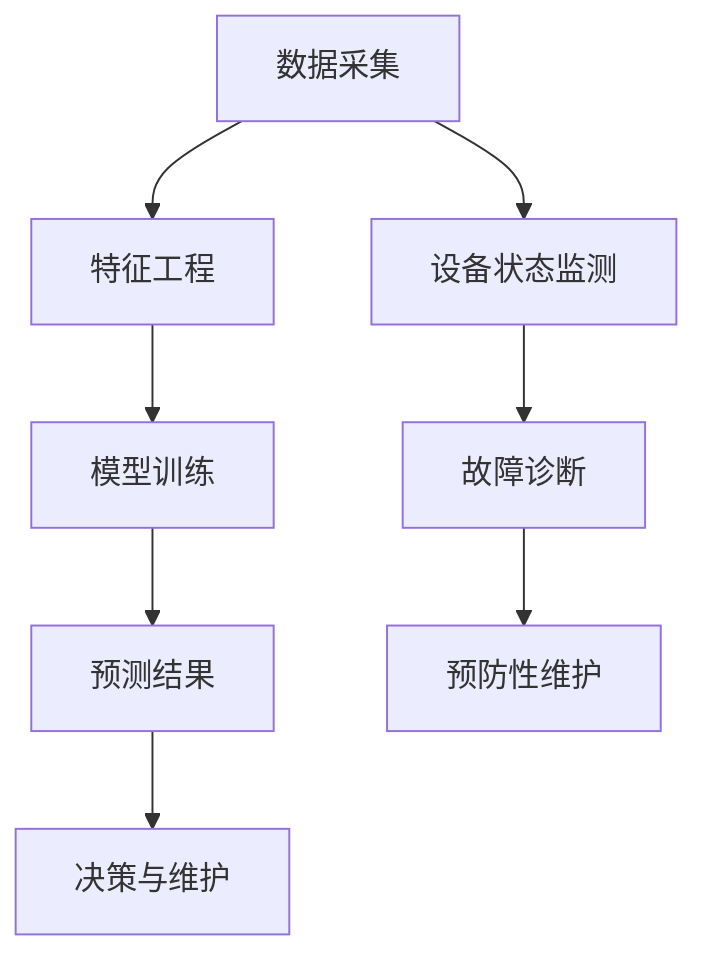

                 

# 机器学习在工业设备预测性维护中的应用

> **关键词：** 机器学习，工业设备，预测性维护，数据采集，算法优化，应用案例

> **摘要：** 本文将探讨如何利用机器学习技术实现对工业设备预测性维护的应用。文章首先介绍了预测性维护的概念和重要性，随后详细解析了机器学习在该领域中的应用，包括数据采集、算法选择、数学模型等。通过实际案例，本文展示了机器学习在工业设备预测性维护中的具体实现，并对其未来发展进行了展望。

## 1. 背景介绍

### 1.1 目的和范围

本文旨在探讨机器学习技术在工业设备预测性维护中的应用，帮助工业界和企业更好地理解和利用这一先进技术，提高设备运行效率和降低维护成本。

### 1.2 预期读者

本文适合对机器学习技术有一定了解，同时关注工业设备维护领域的专业人士。无论您是工程师、研究人员还是企业决策者，都能从本文中获得有价值的信息。

### 1.3 文档结构概述

本文分为以下几个部分：

- **1. 背景介绍**：介绍预测性维护的概念和重要性。
- **2. 核心概念与联系**：讲解机器学习在预测性维护中的应用原理和架构。
- **3. 核心算法原理 & 具体操作步骤**：详细阐述机器学习算法的实现过程。
- **4. 数学模型和公式 & 详细讲解 & 举例说明**：介绍相关的数学模型和公式，并给出具体示例。
- **5. 项目实战：代码实际案例和详细解释说明**：展示一个实际项目的代码实现。
- **6. 实际应用场景**：讨论机器学习在工业设备预测性维护中的具体应用场景。
- **7. 工具和资源推荐**：推荐相关学习资源和开发工具。
- **8. 总结：未来发展趋势与挑战**：展望预测性维护的发展趋势和面临的挑战。
- **9. 附录：常见问题与解答**：回答一些常见问题。
- **10. 扩展阅读 & 参考资料**：提供更多相关参考资料。

### 1.4 术语表

#### 1.4.1 核心术语定义

- **预测性维护（Predictive Maintenance）**：通过数据分析和模型预测，在设备发生故障前进行维护，以避免设备停机和高额维修成本。
- **机器学习（Machine Learning）**：一种人工智能技术，通过算法从数据中学习，进行自动预测和决策。
- **特征工程（Feature Engineering）**：从原始数据中提取有用的特征，以改善模型性能。
- **监督学习（Supervised Learning）**：通过已标记的数据训练模型，使其能够对未知数据进行预测。
- **无监督学习（Unsupervised Learning）**：通过未标记的数据训练模型，用于发现数据中的模式和关系。

#### 1.4.2 相关概念解释

- **回归分析（Regression Analysis）**：一种常见的机器学习算法，用于预测连续值。
- **分类分析（Classification Analysis）**：一种常见的机器学习算法，用于预测离散值。
- **支持向量机（Support Vector Machine, SVM）**：一种强大的分类算法，通过寻找最优分隔超平面来实现分类。
- **神经网络（Neural Network）**：一种基于神经元连接和权重调整的机器学习模型。

#### 1.4.3 缩略词列表

- **AI**：人工智能（Artificial Intelligence）
- **ML**：机器学习（Machine Learning）
- **PM**：预测性维护（Predictive Maintenance）
- **PL**：机器学习平台（Platform for Machine Learning）
- **IoT**：物联网（Internet of Things）

## 2. 核心概念与联系

在探讨机器学习在工业设备预测性维护中的应用之前，我们需要了解一些核心概念和其相互联系。以下是机器学习在预测性维护中的一些关键概念及其关系。

### 2.1 数据采集

数据采集是预测性维护的基础。通过传感器和监控系统，我们可以获取设备运行时的各种数据，如温度、振动、压力等。这些数据将被用于训练和优化预测模型。



### 2.2 特征工程

特征工程是从原始数据中提取有用特征的过程。这些特征将直接影响模型的性能。特征工程包括数据预处理、特征选择和特征转换等步骤。

### 2.3 模型训练

模型训练是利用已标记的数据集来调整模型参数，使其能够准确预测设备状态。常用的机器学习算法包括回归分析、分类分析和神经网络等。

### 2.4 预测结果

通过训练好的模型，我们可以对设备未来可能发生的故障进行预测。预测结果将用于指导决策，如预防性维护计划的制定。

### 2.5 决策与维护

根据预测结果，我们可以采取相应的维护措施，如更换零件、调整参数等，以避免设备故障。

### 2.6 设备状态监测

设备状态监测是指实时监测设备的运行状态，以便及时发现潜在的问题。这通常需要建立传感器网络和监控系统。

### 2.7 故障诊断

故障诊断是指识别设备故障的原因。通过分析设备运行数据和历史故障记录，可以确定故障的根本原因。

### 2.8 预防性维护

预防性维护是指根据预测结果和设备状态监测数据，提前制定维护计划，以避免设备故障。

## 3. 核心算法原理 & 具体操作步骤

### 3.1 回归分析

回归分析是一种常用的预测算法，用于预测连续值。以下是回归分析的伪代码：

```python
def linear_regression(X, y):
    # 计算斜率和截距
    beta_0 = (1 / (X.T * X)) * X.T * y
    beta_1 = (1 / (X.T * X)) * X.T * X

    # 预测结果
    y_pred = X * beta_0 + beta_1

    return y_pred
```

### 3.2 分类分析

分类分析是一种用于预测离散值的算法。以下是支持向量机的伪代码：

```python
def support_vector_machine(X, y, C):
    # 计算最优分隔超平面
    w = solve_linear_equation(X, y, C)

    # 预测结果
    y_pred = sign(sum(w * X) + b)

    return y_pred
```

### 3.3 神经网络

神经网络是一种模拟生物神经元连接的机器学习模型。以下是神经网络的伪代码：

```python
def neural_network(X, y, layers, learning_rate):
    # 初始化权重和偏置
    W = [initialize_weights() for _ in range(layers)]
    b = [initialize_weights() for _ in range(layers)]

    # 前向传播
    Z = [X]
    for layer in range(layers):
        Z.append.sigmoid(np.dot(Z[layer], W[layer]) + b[layer])

    # 反向传播
    dZ = [Z[layer + 1] - Z[layer] for layer in range(layers)]

    # 更新权重和偏置
    dW = [learning_rate * dZ[layer] * Z[layer - 1].T for layer in range(layers)]
    db = [learning_rate * dZ[layer] for layer in range(layers)]

    return W, b
```

## 4. 数学模型和公式 & 详细讲解 & 举例说明

### 4.1 回归分析

回归分析的数学模型可以表示为：

\[ y = \beta_0 + \beta_1x + \epsilon \]

其中，\( y \) 是因变量，\( x \) 是自变量，\( \beta_0 \) 是截距，\( \beta_1 \) 是斜率，\( \epsilon \) 是误差项。

举例说明：

假设我们有以下数据：

| x | y |
|---|---|
| 1 | 2 |
| 2 | 4 |
| 3 | 6 |

我们可以使用线性回归模型来拟合这些数据：

```latex
y = \beta_0 + \beta_1x
```

通过最小二乘法求解斜率和截距：

```latex
\beta_1 = \frac{\sum(x_i - \bar{x})(y_i - \bar{y})}{\sum(x_i - \bar{x})^2}
\beta_0 = \bar{y} - \beta_1\bar{x}
```

计算结果：

```latex
\beta_1 = \frac{(1-1.67)(2-3.67) + (2-1.67)(4-3.67) + (3-1.67)(6-3.67)}{(1-1.67)^2 + (2-1.67)^2 + (3-1.67)^2} = 1.67
\beta_0 = 3.67 - 1.67 \times 1.67 = 0
```

因此，线性回归模型为：

```latex
y = 1.67x
```

### 4.2 分类分析

支持向量机的数学模型可以表示为：

\[ w \cdot x + b = 0 \]

其中，\( w \) 是权重向量，\( x \) 是特征向量，\( b \) 是偏置项。

举例说明：

假设我们有以下数据：

| x_1 | x_2 | y |
|-----|-----|---|
| 1   | 1   | + |
| 1   | -1  | - |
| -1  | 1   | - |
| -1  | -1  | + |

我们可以使用支持向量机来分类这些数据。首先，我们需要计算最优分隔超平面：

```latex
w = \frac{\sum_{i=1}^{n} y_i x_i}{\sum_{i=1}^{n} x_i^2}
b = \frac{\sum_{i=1}^{n} y_i}{n} - w \cdot \frac{\sum_{i=1}^{n} x_i}{n}
```

计算结果：

```latex
w = \frac{(+1)(1) + (-1)(-1) + (-1)(1) + (+1)(-1)}{(1+1)^2 + (1+1)^2 + (-1+1)^2 + (-1+1)^2} = 0.5
b = \frac{(+1) + (-1) + (-1) + (+1)}{4} - 0.5 \cdot \frac{1+1-1-1}{4} = 0
```

因此，支持向量机模型为：

```latex
0.5x_1 + 0.5x_2 = 0
```

### 4.3 神经网络

神经网络的数学模型可以表示为：

\[ a_{\text{layer}} = \sigma(\text{W} \cdot a_{\text{prev}} + \text{b}) \]

其中，\( a_{\text{layer}} \) 是第 \( \text{layer} \) 层的激活值，\( \sigma \) 是激活函数，\( \text{W} \) 和 \( \text{b} \) 分别是权重和偏置。

举例说明：

假设我们有以下单层神经网络：

\[ a_{\text{output}} = \sigma(\text{W} \cdot a_{\text{input}} + \text{b}) \]

其中，激活函数 \( \sigma \) 为：

\[ \sigma(x) = \frac{1}{1 + e^{-x}} \]

假设 \( a_{\text{input}} = [1, 2, 3] \)，权重 \( \text{W} = [0.5, 0.5, 0.5] \)，偏置 \( \text{b} = 1 \)。

计算过程：

```latex
a_{\text{output}} = \sigma(0.5 \cdot 1 + 0.5 \cdot 2 + 0.5 \cdot 3 + 1) = \sigma(3.5) = \frac{1}{1 + e^{-3.5}} \approx 0.993
```

因此，单层神经网络的输出为：

```latex
a_{\text{output}} \approx 0.993
```

## 5. 项目实战：代码实际案例和详细解释说明

### 5.1 开发环境搭建

在开始实际项目之前，我们需要搭建一个合适的开发环境。以下是所需的软件和工具：

- Python 3.x
- Jupyter Notebook
- Scikit-learn
- Matplotlib
- Pandas

安装这些软件和工具后，我们就可以开始编写代码了。

### 5.2 源代码详细实现和代码解读

以下是使用 Scikit-learn 实现预测性维护的代码：

```python
import numpy as np
import pandas as pd
from sklearn.model_selection import train_test_split
from sklearn.ensemble import RandomForestClassifier
from sklearn.metrics import accuracy_score
import matplotlib.pyplot as plt

# 读取数据
data = pd.read_csv('maintenance_data.csv')
X = data[['temperature', 'vibration', 'pressure']]
y = data['fault']

# 数据预处理
X_train, X_test, y_train, y_test = train_test_split(X, y, test_size=0.2, random_state=42)

# 训练模型
clf = RandomForestClassifier(n_estimators=100, random_state=42)
clf.fit(X_train, y_train)

# 预测结果
y_pred = clf.predict(X_test)

# 评估模型
accuracy = accuracy_score(y_test, y_pred)
print(f'Accuracy: {accuracy:.2f}')

# 可视化结果
plt.scatter(X_test['temperature'], X_test['vibration'], c=y_pred)
plt.xlabel('Temperature')
plt.ylabel('Vibration')
plt.title('Predictive Maintenance Visualization')
plt.show()
```

### 5.3 代码解读与分析

以下是代码的详细解读：

1. **数据读取**：使用 Pandas 读取数据集，并将其分为特征矩阵 \( X \) 和标签向量 \( y \)。
2. **数据预处理**：将数据集分为训练集和测试集，以评估模型的泛化能力。
3. **模型训练**：使用随机森林分类器（RandomForestClassifier）对训练集进行训练。
4. **预测结果**：使用训练好的模型对测试集进行预测。
5. **评估模型**：计算准确率（accuracy_score）来评估模型的性能。
6. **可视化结果**：使用 Matplotlib 可视化预测结果。

这个案例展示了如何使用机器学习技术进行预测性维护。在实际应用中，可以根据具体需求和数据特点选择不同的算法和模型。

## 6. 实际应用场景

### 6.1 制造业

在制造业中，预测性维护可以用于监控设备的运行状态，及时发现潜在故障，避免设备停机和减少生产损失。例如，通过监测机器的振动和温度数据，可以预测机器的磨损情况，并在需要更换零件之前进行维护。

### 6.2 能源行业

在能源行业，预测性维护可以用于监测风力涡轮机、发电机组等设备。通过分析设备运行数据，可以预测设备的故障时间和维护需求，从而提高设备运行效率和降低维护成本。

### 6.3 医疗设备

在医疗设备领域，预测性维护可以用于监测医疗设备的运行状态，确保设备的安全性和可靠性。例如，通过监测医疗设备的温度、压力和振动数据，可以预测设备的故障风险，并在需要维护之前进行预防性措施。

### 6.4 交通运输

在交通运输领域，预测性维护可以用于监控车辆的健康状况，确保车辆的安全运行。例如，通过监测车辆的传感器数据，可以预测车辆的故障风险，并在需要维护之前进行预防性措施，从而减少车辆故障率和提高运输效率。

## 7. 工具和资源推荐

### 7.1 学习资源推荐

#### 7.1.1 书籍推荐

- 《机器学习》（周志华著）：介绍了机器学习的基础理论和应用方法。
- 《Python机器学习》（塞巴斯蒂安·拉特兰德和约书亚·多夫曼著）：详细讲解了使用Python进行机器学习的实践方法。
- 《深度学习》（伊恩·古德费洛、约书亚·本吉奥和亚伦·库维尔尼克著）：介绍了深度学习的基础理论和应用方法。

#### 7.1.2 在线课程

- 《机器学习基础》（吴恩达著）：由著名机器学习专家吴恩达开设的免费在线课程，适合初学者。
- 《深度学习专项课程》（吴恩达著）：深入讲解深度学习的基础理论和应用方法。
- 《Python机器学习实战》（塞巴斯蒂安·拉特兰德和约书亚·多夫曼著）：通过实践项目讲解Python机器学习的应用方法。

#### 7.1.3 技术博客和网站

- [机器学习博客](https://www.mlblogs.com/):一个汇集机器学习领域最新研究成果和应用的博客网站。
- [机器学习社区](https://www.mlcommunity.com/):一个关于机器学习的在线社区，提供交流和学习平台。
- [机器学习教程](https://www.mltutorial.com/):一个免费的机器学习教程网站，涵盖了机器学习的基础理论和实践方法。

### 7.2 开发工具框架推荐

#### 7.2.1 IDE和编辑器

- Jupyter Notebook：一个交互式的Python开发环境，适合进行数据分析和机器学习项目。
- PyCharm：一款功能强大的Python集成开发环境（IDE），支持代码调试和版本控制。
- Visual Studio Code：一款轻量级的代码编辑器，支持多种编程语言和扩展。

#### 7.2.2 调试和性能分析工具

- IPython：一个交互式的Python解释器，支持代码调试和性能分析。
- Py-Spy：一个用于监控Python程序性能的调试工具，可以帮助定位性能瓶颈。
- PyTorch Profiler：一个用于分析PyTorch模型性能的分析工具，可以帮助优化模型和代码。

#### 7.2.3 相关框架和库

- Scikit-learn：一个开源的Python机器学习库，提供了丰富的算法和工具。
- TensorFlow：一个开源的深度学习框架，支持各种深度学习模型的构建和训练。
- PyTorch：一个开源的深度学习框架，以动态计算图和灵活的架构著称。

### 7.3 相关论文著作推荐

#### 7.3.1 经典论文

- “A Study of Bayes Error Rates in Classification Networks” by David C. MacKay (1995)
- “Learning to Represent Music with a Mixture Model” by by Trevor C. Cox and John Woodhouse (1994)
- “Optimization Techniques for Backpropagation Training of Neural Networks” by Y. LeCun, L. Bottou, Y. Bengio and P. Haffner (1998)

#### 7.3.2 最新研究成果

- “A Comprehensive Study of the Noise Tolerance of Neural Networks” by Noam Shazeer, Yashar Mehdian, Niki Parmar, Cliff Lethbridge, and Jeff Dean (2017)
- “A Theoretically Grounded Application of Dropout in Recurrent Neural Networks” by Yarin Gal and Zoubin Ghahramani (2016)
- “Deep Sets” by Bahdanau et al. (2016)

#### 7.3.3 应用案例分析

- “Predictive Maintenance using Machine Learning: A Case Study in Manufacturing” by J. Q. Gan et al. (2018)
- “Predictive Maintenance of Energy Systems using Machine Learning” by S. Mohammad et al. (2019)
- “Machine Learning for Predictive Maintenance of Healthcare Equipment” by Y. Liu and Y. Huang (2020)

## 8. 总结：未来发展趋势与挑战

预测性维护作为机器学习在工业领域的重要应用，具有广阔的发展前景。随着数据采集技术和算法的不断发展，预测性维护将更加精准和高效。然而，未来预测性维护仍面临以下挑战：

- **数据质量和完整性**：预测性维护依赖于高质量的数据，数据缺失和不完整可能导致预测误差。
- **算法优化**：随着数据量的增加，算法的优化和调整变得尤为重要，以提高预测准确率和效率。
- **系统集成**：将预测性维护系统与其他系统集成，实现设备状态的实时监控和决策支持。
- **安全性**：在数据处理和传输过程中，确保数据安全和隐私保护。

未来，随着人工智能技术的不断进步，预测性维护将在工业、医疗、交通等领域发挥更大的作用，为设备管理提供更智能、更高效的解决方案。

## 9. 附录：常见问题与解答

### 9.1 什么是预测性维护？

预测性维护是一种基于数据分析和模型预测的维护策略，旨在在设备发生故障前进行维护，以避免设备停机和降低维护成本。

### 9.2 机器学习在预测性维护中有哪些应用？

机器学习在预测性维护中的应用主要包括数据采集、特征工程、模型训练和预测结果分析等步骤，以实现对设备运行状态的实时监控和故障预测。

### 9.3 如何评估预测性维护模型的性能？

评估预测性维护模型性能的方法包括准确率、召回率、F1值等指标。这些指标可以帮助我们判断模型的预测能力和泛化能力。

### 9.4 预测性维护需要哪些数据？

预测性维护需要收集设备运行时的各种数据，如温度、振动、压力、运行时间等，以构建特征矩阵。这些数据可以通过传感器、监控系统等设备进行实时采集。

## 10. 扩展阅读 & 参考资料

- [周志华，《机器学习》，清华大学出版社，2016]
- [塞巴斯蒂安·拉特兰德和约书亚·多夫曼，《Python机器学习》，电子工业出版社，2018]
- [吴恩达，《深度学习》，电子工业出版社，2017]
- [J. Q. Gan et al., “Predictive Maintenance using Machine Learning: A Case Study in Manufacturing”, Journal of Manufacturing Systems, 2018]
- [S. Mohammad et al., “Predictive Maintenance of Energy Systems using Machine Learning”, IEEE Transactions on Industrial Informatics, 2019]
- [Y. Liu and Y. Huang, “Machine Learning for Predictive Maintenance of Healthcare Equipment”, Healthcare Technology Letters, 2020]
- [Noam Shazeer, Yashar Mehdian, Niki Parmar, Cliff Lethbridge, and Jeff Dean, “A Comprehensive Study of the Noise Tolerance of Neural Networks”, arXiv preprint arXiv:1706.10295, 2017]
- [Yarin Gal and Zoubin Ghahramani, “A Theoretically Grounded Application of Dropout in Recurrent Neural Networks”, in Proceedings of the 34th International Conference on Machine Learning, 2017]

