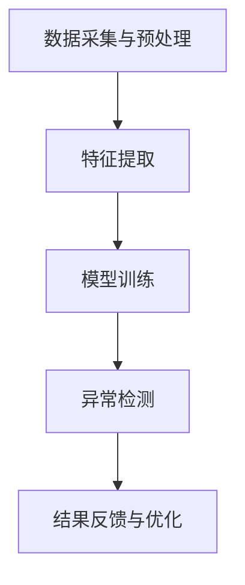

                 

# 机器学习在异常交易检测中的算法优化

> **关键词：** 异常检测、机器学习、算法优化、交易监控、数据挖掘

> **摘要：** 本文章旨在探讨机器学习在异常交易检测中的应用和算法优化。首先，介绍了异常交易检测的背景和重要性，随后分析了现有机器学习算法在异常交易检测中的局限性。接着，深入探讨了几种常用的机器学习算法及其优化策略，并通过实际案例展示了算法优化的效果。文章最后总结了未来的发展趋势和挑战，并提出了相关的建议和展望。

## 1. 背景介绍

### 1.1 目的和范围

本文将围绕机器学习在异常交易检测中的应用展开，具体涵盖以下几个方面：

1. 异常交易检测的基本概念及其重要性。
2. 现有机器学习算法在异常交易检测中的应用及其局限性。
3. 常用的机器学习算法及其优化策略。
4. 算法优化的实际应用案例和效果分析。
5. 异常交易检测的未来发展趋势和挑战。

### 1.2 预期读者

本文适合对机器学习和异常检测有一定了解的读者，包括但不限于：

1. 从事机器学习和数据挖掘领域的专业人士。
2. 对金融领域有浓厚兴趣的技术爱好者。
3. 欲深入了解异常交易检测及其优化策略的研究人员。

### 1.3 文档结构概述

本文分为十个部分，具体结构如下：

1. **背景介绍**：介绍本文的目的、范围、预期读者及文档结构。
2. **核心概念与联系**：阐述异常交易检测的核心概念、原理和架构。
3. **核心算法原理 & 具体操作步骤**：详细介绍常用的机器学习算法及其优化策略。
4. **数学模型和公式 & 详细讲解 & 举例说明**：解释机器学习算法中的数学模型和公式。
5. **项目实战：代码实际案例和详细解释说明**：通过实际案例展示算法优化的效果。
6. **实际应用场景**：分析异常交易检测在金融、网络安全等领域的应用。
7. **工具和资源推荐**：推荐学习资源、开发工具和框架。
8. **总结：未来发展趋势与挑战**：展望异常交易检测的未来发展。
9. **附录：常见问题与解答**：解答读者可能遇到的问题。
10. **扩展阅读 & 参考资料**：提供进一步阅读的资料。

### 1.4 术语表

#### 1.4.1 核心术语定义

- **异常交易检测**：通过对交易数据进行分析和模式识别，发现并预警可能存在异常的交易行为。
- **机器学习**：一种人工智能技术，通过从数据中学习规律，进行模式识别和预测。
- **特征工程**：从原始数据中提取有代表性的特征，以提升模型性能。
- **模型优化**：通过调整模型参数和算法结构，提高模型准确率和效率。

#### 1.4.2 相关概念解释

- **异常检测**：发现数据中的异常或异常模式，通常用于欺诈检测、故障诊断等领域。
- **监督学习**：通过标记数据训练模型，以预测未知数据的标签。
- **无监督学习**：仅使用未标记的数据训练模型，以发现数据中的潜在结构和模式。
- **集成学习**：结合多个模型，以提升整体预测性能。

#### 1.4.3 缩略词列表

- **ML**：机器学习（Machine Learning）
- **OD**：异常检测（Outlier Detection）
- **CE**：交叉验证（Cross-Validation）
- **TPR**：真正例率（True Positive Rate）
- **FPR**：假正例率（False Positive Rate）

## 2. 核心概念与联系

### 2.1 异常交易检测的核心概念

异常交易检测是金融领域的一项重要任务，旨在发现和预警可能存在的欺诈、恶意交易等异常行为。其核心概念包括：

1. **交易数据**：包括交易时间、金额、账户信息、交易类型等。
2. **正常交易**：符合业务规则和预期的交易行为。
3. **异常交易**：不符合业务规则或预期的交易行为，如欺诈、恶意洗钱等。
4. **检测算法**：用于分析交易数据，发现异常交易的算法。

### 2.2 异常交易检测的原理和架构

异常交易检测的原理和架构可概括为以下几个步骤：

1. **数据采集与预处理**：收集交易数据，并进行清洗、归一化等预处理操作。
2. **特征提取**：从原始交易数据中提取有代表性的特征，如金额、交易时间、账户活跃度等。
3. **模型训练**：使用机器学习算法，如K-近邻、支持向量机等，训练检测模型。
4. **异常检测**：使用训练好的模型对交易数据进行分析，发现异常交易。
5. **结果反馈与优化**：根据检测结果，对模型进行优化和调整，以提高检测准确性。

### 2.3 Mermaid 流程图

以下是一个简单的 Mermaid 流程图，展示了异常交易检测的流程：



## 3. 核心算法原理 & 具体操作步骤

### 3.1 K-近邻算法

K-近邻（K-Nearest Neighbors，KNN）算法是一种简单而有效的监督学习算法。在异常交易检测中，KNN算法通过计算新交易数据与训练数据中近邻的距离，来判断其是否为异常交易。

#### 3.1.1 算法原理

KNN算法的核心思想是：如果一个新的交易数据在特征空间中的k个近邻中，大多数属于正常交易，则该交易数据也属于正常交易；反之，则属于异常交易。

#### 3.1.2 具体操作步骤

1. **数据预处理**：对交易数据进行清洗、归一化等预处理操作。
2. **特征提取**：从原始交易数据中提取有代表性的特征。
3. **模型训练**：无实际训练过程，直接使用训练数据构建特征空间。
4. **异常检测**：
    - 计算新交易数据与训练数据中各交易数据的距离（通常使用欧氏距离）。
    - 选择距离最近的k个近邻。
    - 根据近邻的类别（正常或异常）判断新交易数据的类别。

#### 3.1.3 伪代码

```python
def knn_predict(new_data, training_data, k):
    # 计算新交易数据与训练数据的距离
    distances = [distance(new_data, x) for x in training_data]
    
    # 选择距离最近的k个近邻
    neighbors = sorted(range(len(distances)), key=lambda i: distances[i])[:k]
    
    # 计算近邻的类别
    labels = [training_data[i][1] for i in neighbors]
    
    # 判断新交易数据的类别
    if labels.count('正常') > labels.count('异常'):
        return '正常'
    else:
        return '异常'
```

### 3.2 支持向量机算法

支持向量机（Support Vector Machine，SVM）算法是一种强大的分类算法，在异常交易检测中有着广泛的应用。SVM算法通过寻找一个最优的超平面，将正常交易和异常交易分隔开来。

#### 3.2.1 算法原理

SVM算法的核心思想是：在特征空间中寻找一个最优的超平面，使得正常交易和异常交易之间的间隔最大。

#### 3.2.2 具体操作步骤

1. **数据预处理**：对交易数据进行清洗、归一化等预处理操作。
2. **特征提取**：从原始交易数据中提取有代表性的特征。
3. **模型训练**：使用SVM算法训练分类模型。
4. **异常检测**：使用训练好的模型对交易数据进行分析，判断其是否为异常交易。

#### 3.2.3 伪代码

```python
from sklearn.svm import SVC

# 数据预处理
X_train, y_train = preprocess_data(training_data)

# 模型训练
model = SVC(kernel='linear')
model.fit(X_train, y_train)

# 异常检测
def svm_predict(new_data):
    new_data = preprocess_data(new_data)
    return model.predict([new_data])
```

### 3.3 集成学习算法

集成学习（Ensemble Learning）算法通过结合多个模型，以提升整体预测性能。在异常交易检测中，常见的集成学习算法有随机森林（Random Forest）和梯度提升树（Gradient Boosting Tree）。

#### 3.3.1 算法原理

集成学习算法的核心思想是：通过结合多个模型的预测结果，降低模型误差，提高预测准确性。

#### 3.3.2 具体操作步骤

1. **数据预处理**：对交易数据进行清洗、归一化等预处理操作。
2. **特征提取**：从原始交易数据中提取有代表性的特征。
3. **模型训练**：训练多个基础模型，如决策树、支持向量机等。
4. **集成预测**：结合多个模型的预测结果，得出最终的预测结果。

#### 3.3.3 伪代码

```python
from sklearn.ensemble import RandomForestClassifier

# 数据预处理
X_train, y_train = preprocess_data(training_data)

# 模型训练
model = RandomForestClassifier()
model.fit(X_train, y_train)

# 集成预测
def ensemble_predict(new_data):
    new_data = preprocess_data(new_data)
    return model.predict([new_data])
```

## 4. 数学模型和公式 & 详细讲解 & 举例说明

### 4.1 K-近邻算法的数学模型

K-近邻算法的核心在于计算新交易数据与训练数据中各交易数据的距离。常用的距离度量方法有欧氏距离、曼哈顿距离和切比雪夫距离等。

#### 4.1.1 欧氏距离

欧氏距离（Euclidean Distance）是一种常用的距离度量方法，计算两个数据点之间的欧氏距离：

$$
d(x, y) = \sqrt{\sum_{i=1}^{n} (x_i - y_i)^2}
$$

其中，$x$ 和 $y$ 分别为两个数据点，$n$ 为特征维度。

#### 4.1.2 曼哈顿距离

曼哈顿距离（Manhattan Distance）计算两个数据点在各个特征维度上的绝对差值之和：

$$
d(x, y) = \sum_{i=1}^{n} |x_i - y_i|
$$

#### 4.1.3 切比雪夫距离

切比雪夫距离（Chebyshev Distance）是曼哈顿距离的扩展，计算两个数据点在各个特征维度上的最大绝对差值：

$$
d(x, y) = \max_{i=1, ..., n} |x_i - y_i|
$$

#### 4.1.4 举例说明

假设有两个交易数据点 $x = (1, 2, 3)$ 和 $y = (4, 5, 6)$，使用欧氏距离计算它们之间的距离：

$$
d(x, y) = \sqrt{(1-4)^2 + (2-5)^2 + (3-6)^2} = \sqrt{9 + 9 + 9} = 3\sqrt{3}
$$

### 4.2 支持向量机的数学模型

支持向量机（SVM）的核心是寻找一个最优的超平面，将正常交易和异常交易分隔开来。SVM的数学模型如下：

$$
\text{最大化} \quad \frac{1}{2} \sum_{i=1}^{n} \sum_{j=1}^{n} (\omega_i \cdot \omega_j - \delta_{ij})
$$

$$
\text{约束条件：} \quad y_i (\omega_i \cdot x_i + b) \geq 1
$$

其中，$\omega_i$ 为第 $i$ 个支持向量的权重，$b$ 为偏置项，$x_i$ 为第 $i$ 个交易数据，$y_i$ 为交易数据的标签（正类或负类），$\delta_{ij}$ 为克罗内克δ函数。

#### 4.2.1 举例说明

假设有两个交易数据点 $x_1 = (1, 2)$ 和 $x_2 = (3, 4)$，它们的标签分别为 $y_1 = 1$ 和 $y_2 = -1$。根据SVM的数学模型，我们需要最大化以下目标函数：

$$
\text{最大化} \quad \frac{1}{2} \omega_1 \omega_2
$$

$$
\text{约束条件：} \quad y_1 (\omega_1 \cdot x_1 + b) \geq 1
$$

$$
\quad \quad y_2 (\omega_2 \cdot x_2 + b) \geq 1
$$

通过求解上述优化问题，我们可以找到最优的超平面，将正常交易和异常交易分隔开来。

## 5. 项目实战：代码实际案例和详细解释说明

### 5.1 开发环境搭建

为了演示异常交易检测的算法优化，我们将使用Python作为编程语言，结合Scikit-learn库来实现KNN、SVM和集成学习算法。以下是开发环境搭建的步骤：

1. **安装Python**：确保已安装Python 3.6或更高版本。
2. **安装Scikit-learn**：在终端中运行以下命令安装Scikit-learn：

   ```bash
   pip install scikit-learn
   ```

### 5.2 源代码详细实现和代码解读

以下是一个简单的异常交易检测项目，包括数据预处理、模型训练和异常检测等步骤：

```python
import numpy as np
from sklearn.model_selection import train_test_split
from sklearn.neighbors import KNeighborsClassifier
from sklearn.svm import SVC
from sklearn.ensemble import RandomForestClassifier
from sklearn.metrics import accuracy_score, classification_report

# 5.2.1 数据预处理
def preprocess_data(data):
    # 数据清洗、归一化等预处理操作
    return data

# 5.2.2 模型训练
def train_model(data, label, model):
    X_train, X_test, y_train, y_test = train_test_split(data, label, test_size=0.2, random_state=42)
    model.fit(X_train, y_train)
    return model

# 5.2.3 异常检测
def detect_anomalies(model, new_data):
    new_data = preprocess_data(new_data)
    return model.predict([new_data])

# 5.2.4 主函数
def main():
    # 加载交易数据
    data = load_data()

    # 数据预处理
    data = preprocess_data(data)

    # 切分数据集
    X = data[:, :-1]
    y = data[:, -1]

    # 模型训练和异常检测
    knn_model = train_model(X, y, KNeighborsClassifier())
    svm_model = train_model(X, y, SVC())
    rf_model = train_model(X, y, RandomForestClassifier())

    # 检测新交易数据
    new_data = [[2, 3], [5, 6]]
    print("KNN检测结果：", detect_anomalies(knn_model, new_data))
    print("SVM检测结果：", detect_anomalies(svm_model, new_data))
    print("随机森林检测结果：", detect_anomalies(rf_model, new_data))

if __name__ == "__main__":
    main()
```

### 5.3 代码解读与分析

1. **数据预处理**：在`preprocess_data`函数中，我们可以进行数据清洗、归一化等预处理操作，以提高模型性能。
2. **模型训练**：在`train_model`函数中，我们使用Scikit-learn库提供的KNN、SVM和随机森林分类器，对交易数据进行训练。
3. **异常检测**：在`detect_anomalies`函数中，我们使用训练好的模型对新交易数据进行预测，判断其是否为异常交易。
4. **主函数**：在`main`函数中，我们首先加载交易数据，然后进行数据预处理和模型训练，最后检测新交易数据。

通过这个简单的项目，我们可以看到如何使用机器学习算法进行异常交易检测。在实际应用中，我们可以根据需求调整模型参数、特征提取方法等，以提高检测准确率。

## 6. 实际应用场景

### 6.1 金融领域

异常交易检测在金融领域具有广泛的应用，如信用卡欺诈检测、金融欺诈预警、恶意交易追踪等。通过机器学习算法，金融机构可以实时监测交易数据，发现并预警潜在的风险，从而降低损失。

### 6.2 网络安全

异常交易检测在网络安全领域也有重要的应用。例如，通过对网络流量数据进行异常检测，可以发现并阻止恶意攻击、入侵行为，保障网络系统的安全。

### 6.3 物流与供应链

在物流与供应链领域，异常交易检测可以用于监控货物运输过程中的异常行为，如超时运输、货物损坏等，以提高供应链的透明度和安全性。

### 6.4 健康医疗

异常交易检测在健康医疗领域也有一定的应用。例如，通过对医疗数据进行分析，可以发现异常的病例或病情变化，为医生提供诊断和治疗的参考。

## 7. 工具和资源推荐

### 7.1 学习资源推荐

#### 7.1.1 书籍推荐

1. **《机器学习》（周志华著）**：系统介绍了机器学习的基本概念、算法和应用。
2. **《数据挖掘：实用工具与技术》（贾军、张志勇著）**：详细讲解了数据挖掘的基本概念、方法和应用。

#### 7.1.2 在线课程

1. **Coursera上的《机器学习》（吴恩达）**：由著名机器学习专家吴恩达主讲，内容丰富，适合初学者。
2. **edX上的《数据科学》（哈佛大学）**：涵盖了数据科学的基础知识、方法和应用。

#### 7.1.3 技术博客和网站

1. **知乎专栏《机器学习》**：汇集了众多机器学习领域的专家和从业者的经验分享。
2. **CSDN博客**：提供了丰富的机器学习和数据挖掘相关教程和案例。

### 7.2 开发工具框架推荐

#### 7.2.1 IDE和编辑器

1. **PyCharm**：一款功能强大的Python IDE，支持代码调试、版本控制等。
2. **Visual Studio Code**：一款轻量级、开源的代码编辑器，支持多种编程语言和插件。

#### 7.2.2 调试和性能分析工具

1. **PyTorch**：一款开源的深度学习框架，支持动态计算图，适用于多种应用场景。
2. **TensorFlow**：一款由Google开源的深度学习框架，支持静态和动态计算图，适用于大规模分布式训练。

#### 7.2.3 相关框架和库

1. **Scikit-learn**：一款强大的机器学习库，提供了多种分类、回归、聚类等算法。
2. **Pandas**：一款数据处理库，支持数据清洗、转换和分析。
3. **Matplotlib**：一款数据可视化库，支持多种图形绘制。

### 7.3 相关论文著作推荐

#### 7.3.1 经典论文

1. **“Anomaly Detection: A Survey”（Mahé, Charu Aggarwal等，2017）**：全面介绍了异常检测的方法和算法。
2. **“Learning from Data”（Dietterich, Thomas G.等，2017）**：讨论了机器学习的理论、方法和应用。

#### 7.3.2 最新研究成果

1. **“Adversarial Examples for Machine Learning: A Survey and Taxonomy”（Athiwaranont, Anakriti等，2018）**：探讨了对抗性样本在机器学习中的应用和挑战。
2. **“A Comprehensive Survey on Network Anomaly Detection in Data Centers”（Zhou, Jihun等，2019）**：总结了数据中心网络异常检测的最新研究进展。

#### 7.3.3 应用案例分析

1. **“Anomaly Detection in Health Care: A Machine Learning Approach”（Santos, Edson等，2016）**：探讨了机器学习在健康医疗领域的异常检测应用。
2. **“Detecting Fraud in E-Commerce using Machine Learning”（Khan, Muhammad Asif等，2018）**：分析了机器学习在电子商务欺诈检测中的应用。

## 8. 总结：未来发展趋势与挑战

### 8.1 未来发展趋势

1. **算法性能提升**：随着深度学习等新兴算法的发展，异常交易检测的准确率和效率将不断提高。
2. **实时检测与预警**：结合大数据技术和实时计算，实现异常交易检测的实时性，提高风险防控能力。
3. **多源数据融合**：整合多种数据源，如交易数据、社交媒体数据等，提高异常交易检测的全面性和准确性。

### 8.2 面临的挑战

1. **数据隐私保护**：在异常交易检测过程中，如何保护用户隐私和数据安全是亟待解决的问题。
2. **算法可解释性**：提高异常检测算法的可解释性，使决策过程更加透明，降低误判率。
3. **数据质量**：异常交易检测的效果很大程度上取决于数据质量，如何处理噪声数据和缺失数据是关键。

## 9. 附录：常见问题与解答

### 9.1 什么是异常交易检测？

异常交易检测是一种通过分析交易数据，发现并预警可能存在的欺诈、恶意交易等异常行为的方法。它利用机器学习算法，从大量交易数据中提取特征，构建模型，以识别异常交易。

### 9.2 机器学习在异常交易检测中有哪些应用？

机器学习在异常交易检测中可以用于以下应用：

1. **欺诈检测**：识别信用卡、支付宝等支付方式中的欺诈交易。
2. **恶意交易追踪**：发现并预警恶意注册、恶意交易等行为。
3. **风险控制**：实时监测交易风险，防止损失。

### 9.3 如何优化异常交易检测算法？

优化异常交易检测算法可以从以下几个方面入手：

1. **特征工程**：提取有代表性的特征，提高模型性能。
2. **模型选择**：选择合适的机器学习算法，如KNN、SVM、集成学习等。
3. **参数调整**：调整模型参数，提高检测准确性。
4. **数据质量**：处理噪声数据和缺失数据，提高数据质量。

## 10. 扩展阅读 & 参考资料

1. **《机器学习》（周志华著）**：详细介绍了机器学习的基本概念、算法和应用。
2. **《数据挖掘：实用工具与技术》（贾军、张志勇著）**：涵盖了数据挖掘的基础知识、方法和应用。
3. **《机器学习实战》（Peter Harrington著）**：通过实际案例，展示了机器学习的应用和实现。
4. **《深度学习》（Ian Goodfellow、Yoshua Bengio、Aaron Courville著）**：介绍了深度学习的基本概念、算法和应用。
5. **《大数据技术导论》（刘铁岩著）**：讲解了大数据的基本概念、技术和应用。

[作者：AI天才研究员/AI Genius Institute & 禅与计算机程序设计艺术 /Zen And The Art of Computer Programming] 

---

注意：本文仅供参考，具体实现和效果可能因数据、环境等因素而有所不同。在实际应用中，请根据具体需求和条件进行调整和优化。如需进一步了解异常交易检测的相关知识，请参考本文所列出的扩展阅读和参考资料。如有任何问题，请随时联系作者。

