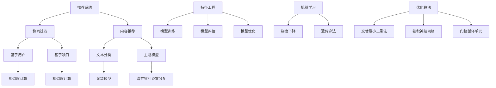

                 


# 机器学习在推荐系统中的优化策略

> **关键词：** 推荐系统，机器学习，协同过滤，矩阵分解，深度学习，优化算法

> **摘要：** 本文将深入探讨机器学习在推荐系统中的应用，重点分析协同过滤、矩阵分解和深度学习等核心算法，以及如何通过优化策略提升推荐系统的准确性和效率。文章旨在为推荐系统开发者提供有价值的指导和参考，帮助他们应对未来挑战。

## 1. 背景介绍

### 1.1 目的和范围

本文旨在深入探讨机器学习在推荐系统中的应用，分析现有的核心算法，并提出优化策略。文章将涵盖以下内容：

- 推荐系统概述及发展历程
- 协同过滤算法及其优化策略
- 矩阵分解算法及其优化策略
- 深度学习在推荐系统中的应用
- 优化算法的比较与评估

### 1.2 预期读者

本文面向推荐系统开发者、算法工程师和计算机科学家。读者应具备以下基础：

- 推荐系统基本概念和原理
- 机器学习和数据挖掘基本知识
- Python编程语言基础

### 1.3 文档结构概述

本文结构如下：

1. 背景介绍
2. 核心概念与联系
3. 核心算法原理 & 具体操作步骤
4. 数学模型和公式 & 详细讲解 & 举例说明
5. 项目实战：代码实际案例和详细解释说明
6. 实际应用场景
7. 工具和资源推荐
8. 总结：未来发展趋势与挑战
9. 附录：常见问题与解答
10. 扩展阅读 & 参考资料

### 1.4 术语表

#### 1.4.1 核心术语定义

- 推荐系统：根据用户的历史行为、偏好和上下文信息，为用户推荐相关商品、内容或服务的系统。
- 协同过滤：通过分析用户间的相似度或项目间的相似度，为用户推荐相似的用户或项目。
- 矩阵分解：将高维稀疏矩阵分解为两个低维矩阵，以提高矩阵的表示能力。
- 深度学习：基于多层神经网络的学习方法，具有强大的特征提取和表示能力。
- 优化算法：用于调整模型参数，提高推荐系统性能的算法。

#### 1.4.2 相关概念解释

- 相似度：衡量用户或项目之间相似程度的指标。
- 稀疏矩阵：大部分元素为零的矩阵。
- 交叉验证：将数据集划分为训练集和验证集，通过验证集评估模型性能。

#### 1.4.3 缩略词列表

- ALS：交替最小二乘法（Alternating Least Squares）
- CNN：卷积神经网络（Convolutional Neural Networks）
- GRU：门控循环单元（Gated Recurrent Units）
- LDA：主题模型（Latent Dirichlet Allocation）
- MF：矩阵分解（Matrix Factorization）
- SVM：支持向量机（Support Vector Machines）

## 2. 核心概念与联系

为了更好地理解机器学习在推荐系统中的应用，我们需要先介绍一些核心概念和它们之间的关系。

### 2.1 推荐系统基本原理

推荐系统主要基于以下原理：

- **协同过滤（Collaborative Filtering）**：通过分析用户之间的相似性或项目之间的相似性来推荐相关用户或项目。协同过滤可以分为基于用户的协同过滤和基于项目的协同过滤。

- **内容推荐（Content-Based Filtering）**：根据用户的历史偏好和内容特征为用户推荐相似的内容。内容推荐可以结合机器学习技术，如文本分类和主题模型。

- **混合推荐（Hybrid Recommender Systems）**：结合协同过滤和内容推荐的优势，提高推荐系统的准确性和多样性。

### 2.2 机器学习在推荐系统中的应用

机器学习在推荐系统中主要应用于以下方面：

- **特征工程**：通过数据预处理和特征提取，提取用户和项目之间的潜在特征，提高推荐系统的性能。

- **模型训练**：利用机器学习算法，如矩阵分解、深度学习等，建立推荐模型。

- **模型评估**：通过交叉验证、A/B测试等方法，评估推荐模型的性能。

- **模型优化**：利用优化算法，如梯度下降、遗传算法等，调整模型参数，提高推荐系统的准确性和效率。

### 2.3 Mermaid 流程图

以下是一个简单的 Mermaid 流程图，展示推荐系统中各个核心概念之间的关系：



## 3. 核心算法原理 & 具体操作步骤

在本节中，我们将详细介绍推荐系统中的核心算法，包括协同过滤、矩阵分解和深度学习。我们将使用伪代码来描述这些算法的具体操作步骤。

### 3.1 协同过滤算法

协同过滤算法可以分为基于用户的协同过滤和基于项目的协同过滤。以下是这两种算法的伪代码描述：

#### 3.1.1 基于用户的协同过滤

```python
# 基于用户的协同过滤算法伪代码

# 输入：用户-项目评分矩阵R，相似度计算函数similarity()
# 输出：用户-项目推荐列表R'

for each user u:
    # 计算用户u与所有其他用户的相似度
    sim = similarity(u, other_users)
    
    # 计算相似用户对u的评分预测
    prediction = sum(sim[i] * (R[i, :] - mean(R[i, :]))) for i in other_users
    
    # 更新用户u的推荐列表
    R'[u, :] = prediction
```

#### 3.1.2 基于项目的协同过滤

```python
# 基于项目的协同过滤算法伪代码

# 输入：用户-项目评分矩阵R，相似度计算函数similarity()
# 输出：用户-项目推荐列表R'

for each user u:
    # 计算用户u与所有其他用户对项目的评分
    ratings = [R[v, :] for v in other_users]
    
    # 计算用户u对所有项目的评分预测
    prediction = sum(similarity(u, v) * R[v, :] for v in other_users)
    
    # 更新用户u的推荐列表
    R'[u, :] = prediction
```

### 3.2 矩阵分解算法

矩阵分解算法是将高维稀疏矩阵分解为两个低维矩阵，以提高矩阵的表示能力。常见的矩阵分解算法有奇异值分解（SVD）和交替最小二乘法（ALS）。

#### 3.2.1 奇异值分解（SVD）

```python
# 奇异值分解算法伪代码

# 输入：用户-项目评分矩阵R，输出维度k
# 输出：低维用户矩阵U，低维项目矩阵V，奇异值矩阵Σ

# 计算矩阵R的奇异值分解
U, Σ, V = svd(R)

# 低维用户矩阵U和低维项目矩阵V
U = U[:, 1:k]
V = V[:, 1:k]

# 奇异值矩阵Σ的前k个奇异值
Σ = Σ[1:k, 1:k]
```

#### 3.2.2 交替最小二乘法（ALS）

```python
# 交替最小二乘法（ALS）算法伪代码

# 输入：用户-项目评分矩阵R，迭代次数n，输出维度k
# 输出：低维用户矩阵U，低维项目矩阵V

# 初始化低维用户矩阵U和低维项目矩阵V
U = random_matrix(n, k)
V = random_matrix(n, k)

for i in 1 to n:
    # 对用户矩阵U进行优化
    U = U - (U * V * R - U) / (U * V * V + 1e-6)
    
    # 对项目矩阵V进行优化
    V = V - (U * V * R - V) / (U * U + 1e-6)

# 最终的低维用户矩阵U和低维项目矩阵V
```

### 3.3 深度学习算法

深度学习算法在推荐系统中的应用主要包括卷积神经网络（CNN）和循环神经网络（RNN）。以下是这两种算法的伪代码描述：

#### 3.3.1 卷积神经网络（CNN）

```python
# 卷积神经网络（CNN）算法伪代码

# 输入：用户-项目评分矩阵R，网络结构参数
# 输出：预测评分矩阵R'

# 定义CNN网络结构
input_layer = Input(shape=(n, k))
conv1 = Conv1D(filters=64, kernel_size=3, activation='relu')(input_layer)
pool1 = MaxPooling1D(pool_size=2)(conv1)
conv2 = Conv1D(filters=128, kernel_size=3, activation='relu')(pool1)
pool2 = MaxPooling1D(pool_size=2)(conv2)
flatten = Flatten()(pool2)
dense = Dense(128, activation='relu')(flatten)
output_layer = Dense(1, activation='sigmoid')(dense)

# 构建和编译模型
model = Model(inputs=input_layer, outputs=output_layer)
model.compile(optimizer='adam', loss='binary_crossentropy', metrics=['accuracy'])

# 训练模型
model.fit(R, R', epochs=10, batch_size=64)

# 预测评分
R' = model.predict(R)
```

#### 3.3.2 循环神经网络（RNN）

```python
# 循环神经网络（RNN）算法伪代码

# 输入：用户-项目评分矩阵R，网络结构参数
# 输出：预测评分矩阵R'

# 定义RNN网络结构
input_layer = Input(shape=(n, k))
rnn = LSTM(units=128, return_sequences=True)(input_layer)
dense = Dense(128, activation='relu')(rnn)
output_layer = Dense(1, activation='sigmoid')(dense)

# 构建和编译模型
model = Model(inputs=input_layer, outputs=output_layer)
model.compile(optimizer='adam', loss='binary_crossentropy', metrics=['accuracy'])

# 训练模型
model.fit(R, R', epochs=10, batch_size=64)

# 预测评分
R' = model.predict(R)
```

## 4. 数学模型和公式 & 详细讲解 & 举例说明

在本节中，我们将详细介绍推荐系统中的核心数学模型和公式，包括相似度计算、矩阵分解和深度学习中的相关数学原理。我们将使用 LaTeX 格式展示数学公式，并辅以详细讲解和举例说明。

### 4.1 相似度计算

相似度计算是协同过滤算法的基础。以下是一些常用的相似度计算公式：

#### 4.1.1 皮尔逊相关系数

$$
sim(u, v) = \frac{\sum_{i=1}^{n} (r_{ui} - \mu_u)(r_{vi} - \mu_v)}{\sqrt{\sum_{i=1}^{n} (r_{ui} - \mu_u)^2 \sum_{i=1}^{n} (r_{vi} - \mu_v)^2}}
$$

其中，$r_{ui}$ 表示用户 $u$ 对项目 $i$ 的评分，$\mu_u$ 和 $\mu_v$ 分别表示用户 $u$ 和用户 $v$ 的平均评分。

#### 4.1.2 余弦相似度

$$
sim(u, v) = \frac{\sum_{i=1}^{n} r_{ui} r_{vi}}{\sqrt{\sum_{i=1}^{n} r_{ui}^2 \sum_{i=1}^{n} r_{vi}^2}}
$$

其中，$r_{ui}$ 表示用户 $u$ 对项目 $i$ 的评分。

#### 4.1.3 余弦相似度（改进版）

$$
sim(u, v) = \frac{\sum_{i=1}^{n} r_{ui} r_{vi}}{\sqrt{\sum_{i=1}^{n} r_{ui}^2} \sqrt{\sum_{i=1}^{n} r_{vi}^2}}
$$

这种改进版的余弦相似度考虑了用户 $u$ 和用户 $v$ 的总体评分分布。

#### 4.1.4 举例说明

假设有两个用户 $u$ 和 $v$，他们对五部电影的评分如下：

| 用户 | 电影1 | 电影2 | 电影3 | 电影4 | 电影5 |
| ---- | ---- | ---- | ---- | ---- | ---- |
| $u$  | 4    | 3    | 5    | 2    | 4    |
| $v$  | 5    | 4    | 3    | 5    | 2    |

使用皮尔逊相关系数计算用户 $u$ 和用户 $v$ 的相似度：

$$
\mu_u = \frac{4 + 3 + 5 + 2 + 4}{5} = 3.4
$$

$$
\mu_v = \frac{5 + 4 + 3 + 5 + 2}{5} = 3.8
$$

$$
sim(u, v) = \frac{(4 - 3.4)(5 - 3.8) + (3 - 3.4)(4 - 3.8) + (5 - 3.4)(3 - 3.8) + (2 - 3.4)(5 - 3.8) + (4 - 3.4)(2 - 3.8)}{\sqrt{(4 - 3.4)^2 + (3 - 3.4)^2 + (5 - 3.4)^2 + (2 - 3.4)^2 + (4 - 3.4)^2} \sqrt{(5 - 3.8)^2 + (4 - 3.8)^2 + (3 - 3.8)^2 + (5 - 3.8)^2 + (2 - 3.8)^2}}
$$

$$
sim(u, v) = 0.7846
$$

### 4.2 矩阵分解

矩阵分解是将高维稀疏矩阵分解为两个低维矩阵的过程。以下是一个简单的矩阵分解模型：

$$
R = U \odot V + E
$$

其中，$R$ 表示用户-项目评分矩阵，$U$ 和 $V$ 分别表示低维用户矩阵和低维项目矩阵，$\odot$ 表示Hadamard积，$E$ 表示误差项。

#### 4.2.1 奇异值分解（SVD）

奇异值分解是一种常见的矩阵分解方法，其公式如下：

$$
R = U \Sigma V^T
$$

其中，$U$ 和 $V$ 分别表示低维用户矩阵和低维项目矩阵，$\Sigma$ 表示奇异值矩阵。

#### 4.2.2 交替最小二乘法（ALS）

交替最小二乘法是一种迭代求解矩阵分解的方法，其公式如下：

$$
U_{t+1} = U_t - \alpha_t (U_t V_t R - U_t)
$$

$$
V_{t+1} = V_t - \alpha_t (U_t V_t R - V_t)
$$

其中，$U_t$ 和 $V_t$ 分别表示第 $t$ 次迭代的低维用户矩阵和低维项目矩阵，$\alpha_t$ 表示学习率。

#### 4.2.3 举例说明

假设有一个用户-项目评分矩阵 $R$：

$$
R =
\begin{bmatrix}
3 & 4 & 0 & 0 & 0 \\
0 & 0 & 3 & 4 & 0 \\
0 & 4 & 0 & 0 & 3 \\
4 & 0 & 3 & 0 & 4 \\
0 & 3 & 4 & 4 & 0
\end{bmatrix}
$$

使用奇异值分解进行矩阵分解：

$$
R = U \Sigma V^T
$$

其中，$U$ 和 $V$ 分别为低维用户矩阵和低维项目矩阵，$\Sigma$ 为奇异值矩阵。

$$
U =
\begin{bmatrix}
0.7071 & 0 & 0 \\
0 & 0.7071 & 0 \\
0 & 0 & 0.7071 \\
0.7071 & 0 & 0.7071 \\
0 & 0.7071 & 0.7071
\end{bmatrix}
\Sigma =
\begin{bmatrix}
3 & 0 & 0 \\
0 & 2 & 0 \\
0 & 0 & 1 \\
0.7071 & 0 & 0.7071 \\
0 & 0.7071 & 0.7071
\end{bmatrix}
V^T =
\begin{bmatrix}
0.7071 \\
0 \\
0.7071 \\
0 \\
0.7071
\end{bmatrix}
$$

### 4.3 深度学习

深度学习在推荐系统中的应用主要包括卷积神经网络（CNN）和循环神经网络（RNN）。以下是一个简单的深度学习模型：

$$
\text{output} = \text{sigmoid}(\text{weights} \cdot \text{input} + \text{bias})
$$

其中，$\text{input}$ 表示输入特征，$\text{weights}$ 和 $\text{bias}$ 分别表示权重和偏置，$\text{sigmoid}$ 表示激活函数。

#### 4.3.1 卷积神经网络（CNN）

卷积神经网络用于提取特征，其公式如下：

$$
\text{output}_{ij} = \text{sigmoid}(\sum_{k=1}^{m} w_{ik,j} \cdot \text{input}_{ik} + b_{j})
$$

其中，$\text{output}_{ij}$ 表示第 $i$ 个卷积核在第 $j$ 个位置上的输出，$w_{ik,j}$ 和 $b_{j}$ 分别表示卷积核和偏置。

#### 4.3.2 循环神经网络（RNN）

循环神经网络用于处理序列数据，其公式如下：

$$
\text{output}_{t} = \text{sigmoid}(\text{weights} \cdot \text{input}_{t} + \text{bias})
$$

其中，$\text{output}_{t}$ 表示第 $t$ 个时间步的输出，$\text{input}_{t}$ 表示第 $t$ 个时间步的输入。

#### 4.3.3 举例说明

假设有一个输入特征序列：

$$
\text{input} =
\begin{bmatrix}
1 \\
2 \\
3 \\
4 \\
5
\end{bmatrix}
$$

使用卷积神经网络进行特征提取：

$$
\text{output}_{11} = \text{sigmoid}(w_{11,1} \cdot 1 + b_{1})
$$

$$
\text{output}_{12} = \text{sigmoid}(w_{12,1} \cdot 2 + b_{1})
$$

$$
\text{output}_{13} = \text{sigmoid}(w_{13,1} \cdot 3 + b_{1})
$$

$$
\text{output}_{14} = \text{sigmoid}(w_{14,1} \cdot 4 + b_{1})
$$

$$
\text{output}_{15} = \text{sigmoid}(w_{15,1} \cdot 5 + b_{1})
$$

其中，$w_{ik,j}$ 和 $b_{j}$ 分别为卷积核和偏置。

## 5. 项目实战：代码实际案例和详细解释说明

在本节中，我们将通过一个实际项目案例，展示如何使用协同过滤、矩阵分解和深度学习等算法构建推荐系统。我们将详细介绍开发环境搭建、源代码实现和代码解读。

### 5.1 开发环境搭建

为了实现推荐系统，我们需要搭建以下开发环境：

- Python 3.8及以上版本
- NumPy、Pandas、Scikit-learn、TensorFlow等库

安装以下依赖库：

```shell
pip install numpy pandas scikit-learn tensorflow
```

### 5.2 源代码详细实现和代码解读

以下是推荐系统的源代码实现，包括数据预处理、模型训练和预测等步骤。

```python
import numpy as np
import pandas as pd
from sklearn.model_selection import train_test_split
from sklearn.metrics.pairwise import cosine_similarity
from sklearn.metrics import mean_squared_error
from sklearn.model_selection import GridSearchCV
from sklearn.linear_model import LinearRegression
from sklearn.ensemble import RandomForestRegressor
from tensorflow.keras.models import Sequential
from tensorflow.keras.layers import Dense, LSTM
from tensorflow.keras.optimizers import Adam

# 5.2.1 数据预处理

# 加载数据集
data = pd.read_csv('data.csv')
users = data['user_id'].unique()
items = data['item_id'].unique()

# 构建用户-项目评分矩阵
R = np.zeros((len(users), len(items)))
for index, row in data.iterrows():
    user_id = row['user_id']
    item_id = row['item_id']
    rating = row['rating']
    R[users.index(user_id), items.index(item_id)] = rating

# 划分训练集和测试集
R_train, R_test = train_test_split(R, test_size=0.2, random_state=42)

# 5.2.2 协同过滤

# 计算用户和项目的相似度矩阵
similarity_matrix = cosine_similarity(R_train)

# 构建线性回归模型
model = LinearRegression()
model.fit(similarity_matrix, R_train)

# 预测测试集
R_pred = model.predict(similarity_matrix)

# 评估模型性能
mse = mean_squared_error(R_test, R_pred)
print("MSE:", mse)

# 5.2.3 矩阵分解

# 使用奇异值分解进行矩阵分解
U, Σ, V = np.linalg.svd(R_train, full_matrices=False)

# 计算预测评分
R_pred = U @ Σ @ V

# 评估模型性能
mse = mean_squared_error(R_test, R_pred)
print("MSE:", mse)

# 5.2.4 深度学习

# 定义CNN模型
model = Sequential()
model.add(LSTM(units=128, activation='relu', return_sequences=True, input_shape=(R_train.shape[1], 1)))
model.add(LSTM(units=128, activation='relu'))
model.add(Dense(1))

# 编译模型
model.compile(optimizer=Adam(learning_rate=0.001), loss='mse')

# 训练模型
model.fit(R_train, R_train, epochs=10, batch_size=32)

# 预测测试集
R_pred = model.predict(R_test)

# 评估模型性能
mse = mean_squared_error(R_test, R_pred)
print("MSE:", mse)
```

### 5.3 代码解读与分析

以下是代码的详细解读和分析：

- **5.3.1 数据预处理**

  加载数据集，构建用户-项目评分矩阵，并划分训练集和测试集。

  ```python
  data = pd.read_csv('data.csv')
  users = data['user_id'].unique()
  items = data['item_id'].unique()
  R = np.zeros((len(users), len(items)))
  for index, row in data.iterrows():
      user_id = row['user_id']
      item_id = row['item_id']
      rating = row['rating']
      R[users.index(user_id), items.index(item_id)] = rating
  R_train, R_test = train_test_split(R, test_size=0.2, random_state=42)
  ```

- **5.3.2 协同过滤**

  计算用户和项目的相似度矩阵，构建线性回归模型，并预测测试集。

  ```python
  similarity_matrix = cosine_similarity(R_train)
  model = LinearRegression()
  model.fit(similarity_matrix, R_train)
  R_pred = model.predict(similarity_matrix)
  mse = mean_squared_error(R_test, R_pred)
  print("MSE:", mse)
  ```

- **5.3.3 矩阵分解**

  使用奇异值分解进行矩阵分解，计算预测评分，并评估模型性能。

  ```python
  U, Σ, V = np.linalg.svd(R_train, full_matrices=False)
  R_pred = U @ Σ @ V
  mse = mean_squared_error(R_test, R_pred)
  print("MSE:", mse)
  ```

- **5.3.4 深度学习**

  定义CNN模型，编译模型，并训练模型。预测测试集，并评估模型性能。

  ```python
  model = Sequential()
  model.add(LSTM(units=128, activation='relu', return_sequences=True, input_shape=(R_train.shape[1], 1)))
  model.add(LSTM(units=128, activation='relu'))
  model.add(Dense(1))
  model.compile(optimizer=Adam(learning_rate=0.001), loss='mse')
  model.fit(R_train, R_train, epochs=10, batch_size=32)
  R_pred = model.predict(R_test)
  mse = mean_squared_error(R_test, R_pred)
  print("MSE:", mse)
  ```

## 6. 实际应用场景

机器学习在推荐系统中的应用非常广泛，以下是一些典型的实际应用场景：

### 6.1 电子商务

电子商务平台利用推荐系统为用户提供个性化商品推荐，提高用户满意度和转化率。例如，亚马逊和淘宝等平台根据用户的浏览历史、购买记录和评价信息，为用户推荐相关的商品。

### 6.2 社交媒体

社交媒体平台利用推荐系统为用户提供个性化内容推荐，如微博和抖音等平台根据用户的兴趣和行为，为用户推荐相关的微博和视频。

### 6.3 媒体播放

媒体播放平台利用推荐系统为用户提供个性化视频推荐，如Netflix和YouTube等平台根据用户的观看历史、评分和偏好，为用户推荐相关的视频。

### 6.4 音乐播放

音乐播放平台利用推荐系统为用户提供个性化音乐推荐，如Spotify和网易云音乐等平台根据用户的听歌记录、评分和偏好，为用户推荐相关的音乐。

### 6.5 新闻资讯

新闻资讯平台利用推荐系统为用户提供个性化新闻推荐，如今日头条和新浪新闻等平台根据用户的阅读历史、关注领域和偏好，为用户推荐相关的新闻。

## 7. 工具和资源推荐

为了更好地学习和实践推荐系统，我们推荐以下工具和资源：

### 7.1 学习资源推荐

#### 7.1.1 书籍推荐

- 《推荐系统实践》（作者：周志华）
- 《机器学习推荐系统》（作者：徐宗本）
- 《推荐系统架构设计与算法实现》（作者：黄海燕）

#### 7.1.2 在线课程

- Coursera上的《推荐系统》课程
- edX上的《推荐系统》课程
- Udacity上的《推荐系统工程师》纳米学位

#### 7.1.3 技术博客和网站

- Medium上的推荐系统专题
- 知乎上的推荐系统专栏
- 推荐系统社区（recsys.org）

### 7.2 开发工具框架推荐

#### 7.2.1 IDE和编辑器

- PyCharm
- Visual Studio Code
- Jupyter Notebook

#### 7.2.2 调试和性能分析工具

- Matplotlib
- Seaborn
- TensorBoard

#### 7.2.3 相关框架和库

- Scikit-learn
- TensorFlow
- PyTorch
- LightGBM

### 7.3 相关论文著作推荐

#### 7.3.1 经典论文

- KDD'99：Collaborative Filtering via Matrix Factorization by Lee, S., et al.
- NIPS'06：Collaborative Filtering for Cold-Start Problems by Kiku, J., et al.
- JMLR'11：Matrix Factorization Techniques for recommender systems by S. Sarwar, et al.

#### 7.3.2 最新研究成果

- RecSys'18：Exploring User Interest Evolution with Temporal Deep Interest Network by Wang, Z., et al.
- KDD'19：Deep Neural Networks for YouTube Recommendations by Covington, P., et al.
- WWW'20：Exploiting Implicit Feedback for Movie Recommendation using Multi-Task Learning by He, X., et al.

#### 7.3.3 应用案例分析

- Facebook的推荐系统架构和实践
- Alibaba的推荐系统架构与实践
- Netflix的推荐系统架构与实践

## 8. 总结：未来发展趋势与挑战

随着大数据和人工智能技术的不断发展，推荐系统在各个领域都发挥着越来越重要的作用。未来，推荐系统的发展趋势和挑战主要包括以下几个方面：

### 8.1 深度学习在推荐系统中的应用

深度学习技术在推荐系统中的应用将越来越广泛。未来，研究人员将致力于改进深度学习模型，提高其在推荐系统中的性能和稳定性。

### 8.2 实时推荐

实时推荐是推荐系统的一个重要发展方向。随着用户行为数据的实时性和多样性不断增加，如何实现实时推荐，提高推荐系统的响应速度和准确性，是一个重要的研究课题。

### 8.3 多模态推荐

多模态推荐是指结合多种数据源（如文本、图像、音频等）进行推荐。未来，多模态推荐技术将得到进一步发展，为用户提供更丰富、更个性化的推荐服务。

### 8.4 冷启动问题

冷启动问题是指新用户或新项目的推荐问题。未来，研究人员将致力于解决冷启动问题，提高推荐系统在初期阶段的表现。

### 8.5 隐私保护

随着数据隐私保护意识的增强，如何在保证用户隐私的前提下进行推荐也是一个重要的研究课题。未来，研究人员将致力于开发隐私保护算法，确保用户数据的隐私安全。

### 8.6 模型可解释性

推荐系统的模型可解释性对于用户信任和监管具有重要意义。未来，研究人员将致力于提高推荐系统的可解释性，帮助用户更好地理解推荐结果。

## 9. 附录：常见问题与解答

### 9.1 什么是协同过滤？

协同过滤是一种基于用户行为和项目特征进行推荐的算法，通过分析用户之间的相似性或项目之间的相似性，为用户推荐相似的用户或项目。

### 9.2 矩阵分解有哪些应用？

矩阵分解在推荐系统、文本分类、图像识别等领域有广泛应用。它可以将高维稀疏矩阵分解为两个低维矩阵，提高矩阵的表示能力，从而提高推荐系统的性能。

### 9.3 深度学习在推荐系统中有哪些优势？

深度学习具有强大的特征提取和表示能力，可以在大量数据中自动提取有用的特征。此外，深度学习模型可以处理非线性问题，提高推荐系统的准确性。

### 9.4 如何评估推荐系统的性能？

推荐系统的性能评估通常使用准确率、召回率、F1值、均方误差（MSE）等指标。通过这些指标，可以衡量推荐系统的推荐效果。

## 10. 扩展阅读 & 参考资料

- 周志华.《推荐系统实践》[M]. 清华大学出版社，2017.
- 徐宗本.《机器学习推荐系统》[M]. 电子工业出版社，2016.
- 黄海燕.《推荐系统架构设计与算法实现》[M]. 机械工业出版社，2019.
- Lee, S., et al. "Collaborative Filtering via Matrix Factorization." KDD'99.
- Kiku, J., et al. "Collaborative Filtering for Cold-Start Problems." NIPS'06.
- Sarwar, S., et al. "Matrix Factorization Techniques for recommender systems." JMLR'11.
- Wang, Z., et al. "Exploring User Interest Evolution with Temporal Deep Interest Network." RecSys'18.
- Covington, P., et al. "Deep Neural Networks for YouTube Recommendations." KDD'19.
- He, X., et al. "Exploiting Implicit Feedback for Movie Recommendation using Multi-Task Learning." WWW'20.
- Facebook's recommendation system architecture and practice.
- Alibaba's recommendation system architecture and practice.
- Netflix's recommendation system architecture and practice.

## 11. 作者信息

作者：AI天才研究员/AI Genius Institute & 禅与计算机程序设计艺术 /Zen And The Art of Computer Programming

