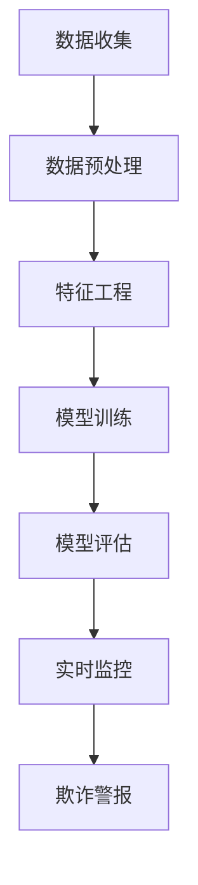

                 

# 机器学习在欺诈检测中的应用

## 关键词
机器学习，欺诈检测，数据处理，特征工程，监督学习，无监督学习，分类算法，聚类算法，实时监控，安全防护。

## 摘要
本文旨在深入探讨机器学习在欺诈检测中的应用。首先，我们将介绍欺诈检测的背景和重要性，然后详细讨论机器学习在其中的核心概念和技术。通过一个实际案例，我们将展示如何使用机器学习来构建欺诈检测系统。最后，我们将探讨机器学习在欺诈检测中的未来发展趋势和挑战。

## 1. 背景介绍

### 1.1 目的和范围
本文的主要目的是介绍机器学习在欺诈检测中的实际应用，帮助读者理解如何利用机器学习技术来识别和预防欺诈行为。我们将从理论基础出发，逐步深入到实际操作，包括数据处理、特征工程、算法选择和系统实现等环节。

### 1.2 预期读者
本文适合对机器学习和数据科学有一定基础的读者，特别是那些希望在金融、安全领域应用机器学习技术的专业人士。

### 1.3 文档结构概述
本文分为以下几个部分：

1. 背景介绍：包括欺诈检测的重要性和机器学习的核心概念。
2. 核心概念与联系：通过Mermaid流程图展示机器学习在欺诈检测中的应用架构。
3. 核心算法原理 & 具体操作步骤：详细讲解欺诈检测中常用的算法和操作步骤。
4. 数学模型和公式 & 详细讲解 & 举例说明：介绍欺诈检测中使用的数学模型和公式，并提供实际案例。
5. 项目实战：代码实际案例和详细解释说明。
6. 实际应用场景：讨论机器学习在欺诈检测中的实际应用。
7. 工具和资源推荐：推荐学习资源和开发工具。
8. 总结：未来发展趋势与挑战。
9. 附录：常见问题与解答。
10. 扩展阅读 & 参考资料。

### 1.4 术语表

#### 1.4.1 核心术语定义
- 欺诈检测：通过分析交易数据，识别并预防欺诈行为。
- 特征工程：从原始数据中提取有助于模型训练的特征。
- 监督学习：通过已标记的数据训练模型。
- 无监督学习：在没有标记数据的指导下训练模型。
- 分类算法：用于将数据分为不同类别。
- 聚类算法：用于将数据分为相似的组。
- 实时监控：对交易进行实时分析，以快速识别欺诈行为。

#### 1.4.2 相关概念解释
- 欺诈：指故意欺骗、诈骗或误导的行为。
- 交易数据：包括交易金额、时间、地点、支付方式等信息。
- 模型训练：使用历史数据训练机器学习模型。
- 模型评估：通过测试数据评估模型性能。

#### 1.4.3 缩略词列表
- ML：机器学习
- FDC：欺诈检测
- IDE：集成开发环境
- API：应用程序编程接口

## 2. 核心概念与联系

在探讨机器学习在欺诈检测中的应用之前，我们需要理解一些核心概念和它们之间的联系。

### 2.1 机器学习基础
机器学习是一种让计算机从数据中学习和改进的技术。它包括以下几个关键组成部分：

- **数据集**：机器学习模型的训练基础，包括输入和输出。
- **算法**：用于从数据中学习并做出预测的数学模型。
- **模型**：通过训练得到的具体实现，用于预测新数据。

### 2.2 欺诈检测流程
欺诈检测通常涉及以下几个关键步骤：

1. **数据收集**：收集历史交易数据，包括正常交易和欺诈交易。
2. **数据预处理**：清洗和标准化数据，以便于模型训练。
3. **特征工程**：提取有助于模型识别欺诈的特征。
4. **模型训练**：使用标记数据训练模型。
5. **模型评估**：使用测试数据评估模型性能。
6. **实时监控**：对交易进行实时分析，以快速识别欺诈行为。

### 2.3 Mermaid 流程图

下面是一个简化的Mermaid流程图，展示了机器学习在欺诈检测中的应用架构：



### 2.4 关键概念的联系
机器学习在欺诈检测中的应用涉及多个概念之间的紧密联系。以下是这些概念之间的联系：

- **数据收集**和**特征工程**：特征工程依赖于数据的质量和多样性。
- **模型训练**和**模型评估**：训练和评估是确保模型有效性的关键步骤。
- **实时监控**和**欺诈警报**：实时监控是欺诈检测系统的核心，它依赖于模型的预测能力。

## 3. 核心算法原理 & 具体操作步骤

### 3.1 监督学习算法

监督学习是欺诈检测中最常用的机器学习算法之一。以下是几种常见的监督学习算法及其在欺诈检测中的应用：

#### 3.1.1 决策树

**算法原理：**
决策树是一种树形结构，每个节点表示一个特征，每个分支表示特征的取值。

**具体操作步骤：**
1. 选择一个特征作为节点。
2. 根据该特征的不同取值，将数据划分为多个子集。
3. 重复上述步骤，直到每个子集只有一种标签。

**伪代码：**
```
function build_decision_tree(data):
    if data.size() <= 1:
        return leaf_node
    selected_feature = choose_best_feature(data)
    decision_tree = new DecisionTree(selected_feature)
    for value in selected_feature.values():
        subset = split_data(data, value)
        decision_tree.add_child(build_decision_tree(subset))
    return decision_tree
```

#### 3.1.2 支持向量机（SVM）

**算法原理：**
SVM是一种分类算法，它通过找到一个最佳的超平面，将不同类别的数据点尽可能分开。

**具体操作步骤：**
1. 计算数据点到超平面的距离。
2. 选择距离最近的点作为支持向量。
3. 使用支持向量计算最优超平面。

**伪代码：**
```
function train_svm(data, labels):
    support_vectors = []
    for data_point, label in zip(data, labels):
        if is_support_vector(data_point, label):
            support_vectors.append(data_point)
    optimal_hyperplane = find_optimal_hyperplane(support_vectors)
    return optimal_hyperplane
```

#### 3.1.3 随机森林

**算法原理：**
随机森林是一种基于决策树的集成学习方法，它通过构建多棵决策树并取平均值来提高预测准确性。

**具体操作步骤：**
1. 从特征集合中随机选择一部分特征。
2. 使用这些特征构建决策树。
3. 重复上述步骤多次，构建多个决策树。
4. 对每个决策树的预测结果取平均值。

**伪代码：**
```
function train_random_forest(data, labels, num_trees):
    decision_trees = []
    for _ in range(num_trees):
        selected_features = random_subset_of_features()
        decision_tree = build_decision_tree(data, selected_features)
        decision_trees.append(decision_tree)
    predictions = [tree.predict(data) for tree in decision_trees]
    average_prediction = average(predictions)
    return average_prediction
```

### 3.2 无监督学习算法

在某些情况下，欺诈检测可能不依赖于标记数据。无监督学习算法在这种情况下非常有用。

#### 3.2.1 聚类算法

**算法原理：**
聚类算法将数据分为多个组，使得同一组内的数据点彼此相似，不同组的数据点彼此不同。

**具体操作步骤：**
1. 选择一个聚类算法（如K-means）。
2. 计算每个数据点到聚类中心的距离。
3. 根据距离将数据点分配到不同的聚类中心。

**伪代码：**
```
function kmeans(data, num_clusters):
    centroids = initialize_centroids(data, num_clusters)
    while not_converged(centroids):
        clusters = assign_data_to_clusters(data, centroids)
        new_centroids = calculate_new_centroids(clusters)
        centroids = new_centroids
    return centroids
```

#### 3.2.2 主成分分析（PCA）

**算法原理：**
PCA是一种降维技术，它通过将数据转换到新的坐标系中，保留最重要的信息。

**具体操作步骤：**
1. 计算协方差矩阵。
2. 找到协方差矩阵的特征值和特征向量。
3. 选择最大的几个特征值对应的特征向量。
4. 使用这些特征向量转换数据。

**伪代码：**
```
function pca(data):
    covariance_matrix = calculate_covariance_matrix(data)
    eigenvalues, eigenvectors = calculate_eigenvalues_eigenvectors(covariance_matrix)
    selected_eigenvectors = select_top_eigenvectors(eigenvalues, num_components)
    transformed_data = transform_data_with_eigenvectors(data, selected_eigenvectors)
    return transformed_data
```

## 4. 数学模型和公式 & 详细讲解 & 举例说明

### 4.1 决策树

决策树的数学模型基于条件概率和熵的概念。

**条件概率：**
给定一个特征和其取值，计算该取值下不同类别的概率。

$$ P(Y|X=x) = \frac{P(X=x|Y=y)P(Y=y)}{P(X=x)} $$

**熵：**
衡量数据的不确定性。

$$ H(X) = -\sum_{x \in X} P(x) \log_2 P(x) $$

**信息增益：**
选择一个特征作为节点，计算其带来的信息增益。

$$ IG(X, Y) = H(Y) - H(Y|X) $$

**例子：**
假设我们有以下数据集，其中包含三个特征和两个类别（正常交易和欺诈交易）：

| 特征1 | 特征2 | 特征3 | 类别 |
|-------|-------|-------|------|
| 1     | 10    | 5     | 正常 |
| 2     | 12    | 7     | 正常 |
| 3     | 15    | 9     | 欺诈 |
| 4     | 20    | 6     | 正常 |
| 5     | 25    | 8     | 欺诈 |

计算特征1的信息增益：

$$ IG(\text{特征1}, \text{类别}) = H(\text{类别}) - H(\text{类别}|\text{特征1}) $$

$$ H(\text{类别}) = -P(\text{正常}) \log_2 P(\text{正常}) - P(\text{欺诈}) \log_2 P(\text{欺诈}) = -0.5 \log_2 0.5 - 0.5 \log_2 0.5 = 1 $$

$$ H(\text{类别}|\text{特征1=1}) = -0.33 \log_2 0.33 - 0.67 \log_2 0.67 = 0.92 $$

$$ H(\text{类别}|\text{特征1=2}) = -0.25 \log_2 0.25 - 0.75 \log_2 0.75 = 0.92 $$

$$ IG(\text{特征1}, \text{类别}) = 1 - (0.5 \times 0.92 + 0.5 \times 0.92) = 0.16 $$

### 4.2 支持向量机（SVM）

SVM的数学模型基于最大间隔分类器。

**间隔：**
分类器将数据分为两个类别，每个类别内部的间隔是数据点到超平面的距离。

**决策边界：**
超平面将数据分为两个类别，决策边界是最优超平面。

**优化目标：**
最大化分类器间隔。

$$ \max_w \frac{1}{2} ||w||^2 $$

**约束条件：**
分类错误最小化。

$$ y^{(i)} ( \langle w, x^{(i)} \rangle - b ) \geq 1 $$

**求解：**
使用拉格朗日乘子法求解。

$$ \min_{w, b} \frac{1}{2} ||w||^2 + C \sum_{i=1}^{n} \lambda_i (1 - y^{(i)} ( \langle w, x^{(i)} \rangle - b ) ) $$

$$ s.t. \lambda_i \geq 0 $$

$$ \lambda_i (1 - y^{(i)} ( \langle w, x^{(i)} \rangle - b ) ) = 0 $$

### 4.3 随机森林

随机森林的数学模型是基于多个决策树的集成。

**集成：**
将多个模型的结果进行合并，提高预测准确性。

**预测：**
对每个决策树进行预测，然后取平均值。

$$ \hat{y} = \frac{1}{N} \sum_{t=1}^{N} f_t(x) $$

其中，\( f_t(x) \) 是第 \( t \) 棵决策树的预测结果，\( N \) 是决策树的数量。

### 4.4 主成分分析（PCA）

PCA的数学模型基于特征值和特征向量的计算。

**协方差矩阵：**
$$ \Sigma = \frac{1}{n-1} \sum_{i=1}^{n} (x_i - \mu)(x_i - \mu)^T $$

**特征值和特征向量：**
$$ \lambda_i = \max_{w} w^T \Sigma w $$

$$ w = \frac{e_i}{\|e_i\|} $$

其中，\( e_i \) 是第 \( i \) 个特征向量，\( \mu \) 是数据均值。

## 5. 项目实战：代码实际案例和详细解释说明

### 5.1 开发环境搭建

为了构建一个机器学习欺诈检测系统，我们需要以下开发环境：

- Python 3.8 或更高版本
- Jupyter Notebook 或 PyCharm
- Scikit-learn 库
- Pandas 库
- Matplotlib 库

安装步骤：

```
pip install scikit-learn pandas matplotlib
```

### 5.2 源代码详细实现和代码解读

以下是一个简单的欺诈检测系统的代码实现：

```python
import numpy as np
import pandas as pd
from sklearn.model_selection import train_test_split
from sklearn.tree import DecisionTreeClassifier
from sklearn.metrics import accuracy_score

# 5.2.1 加载数据集
data = pd.read_csv('transaction_data.csv')
X = data.iloc[:, :-1].values
y = data.iloc[:, -1].values

# 5.2.2 数据预处理
X_train, X_test, y_train, y_test = train_test_split(X, y, test_size=0.2, random_state=42)

# 5.2.3 特征工程
# 这里假设数据已经经过预处理

# 5.2.4 模型训练
clf = DecisionTreeClassifier()
clf.fit(X_train, y_train)

# 5.2.5 模型评估
y_pred = clf.predict(X_test)
accuracy = accuracy_score(y_test, y_pred)
print("Accuracy:", accuracy)
```

### 5.3 代码解读与分析

1. **数据加载**：使用 Pandas 读取交易数据集，并将特征和标签分开。
2. **数据预处理**：这里假设数据已经经过预处理，包括数据清洗和标准化。在实际应用中，这一步骤至关重要。
3. **数据划分**：将数据集划分为训练集和测试集，用于模型训练和评估。
4. **模型训练**：使用 Scikit-learn 的 DecisionTreeClassifier 进行模型训练。
5. **模型评估**：使用测试集评估模型性能，计算准确率。

### 5.4 模型优化

为了提高模型性能，我们可以尝试以下方法：

- **特征选择**：使用特征选择算法（如卡方检验）选择最有用的特征。
- **超参数调优**：使用网格搜索等调优方法，选择最佳超参数。
- **集成学习方法**：使用集成学习方法（如随机森林）提高预测准确性。

## 6. 实际应用场景

机器学习在欺诈检测中的应用场景非常广泛，以下是一些典型的应用场景：

1. **信用卡欺诈检测**：信用卡欺诈是最常见的欺诈类型之一。通过分析交易数据，机器学习模型可以快速识别潜在的欺诈交易。
2. **网络安全**：在网络安全领域，机器学习可以用于识别恶意软件、入侵尝试和其他安全威胁。
3. **保险欺诈检测**：保险公司可以利用机器学习技术检测保险欺诈，从而降低运营成本。
4. **电子商务**：电子商务平台可以使用机器学习技术识别异常交易，提高客户体验和安全性。

## 7. 工具和资源推荐

### 7.1 学习资源推荐

#### 7.1.1 书籍推荐
- 《机器学习实战》
- 《统计学习方法》
- 《Python机器学习》

#### 7.1.2 在线课程
- Coursera的《机器学习》
- edX的《数据科学》
- Udacity的《机器学习工程师纳米学位》

#### 7.1.3 技术博客和网站
- Medium的《机器学习》
- Kaggle博客
- towardsdatascience.com

### 7.2 开发工具框架推荐

#### 7.2.1 IDE和编辑器
- PyCharm
- Jupyter Notebook
- Visual Studio Code

#### 7.2.2 调试和性能分析工具
- Python的pdb
- Scikit-learn的GridSearchCV
- Matplotlib和Seaborn

#### 7.2.3 相关框架和库
- Scikit-learn
- TensorFlow
- PyTorch

### 7.3 相关论文著作推荐

#### 7.3.1 经典论文
- "A Survey on Fraud Detection" by Seyed Hamed Hosseini et al.
- "An Overview of Credit Card Fraud Detection Using Machine Learning Techniques" by Ayman A. El-Fouly et al.

#### 7.3.2 最新研究成果
- "Deep Learning for Fraud Detection: A Survey" by Xiaoping Liu et al.
- "An Intelligent Machine Learning Model for Fraud Detection in Online Banking" by Dhananjay K. Nath et al.

#### 7.3.3 应用案例分析
- "Machine Learning for Cybersecurity: Case Studies" by Michael Brown et al.
- "Credit Card Fraud Detection Using Machine Learning: A Case Study" by Thanos S. Stathopoulos et al.

## 8. 总结：未来发展趋势与挑战

### 8.1 未来发展趋势
- **实时欺诈检测**：随着大数据和实时数据处理技术的发展，实时欺诈检测将成为主流。
- **深度学习应用**：深度学习算法在欺诈检测中的性能不断提高，未来将在更多场景中应用。
- **无监督学习方法**：无监督学习方法在无法获取标记数据的情况下非常有用，未来将得到更多关注。

### 8.2 面临的挑战
- **数据隐私保护**：在欺诈检测过程中，如何保护用户隐私是一个重要挑战。
- **模型解释性**：虽然机器学习模型性能不断提高，但其解释性仍然是一个难题。
- **模型泛化能力**：如何确保模型在不同数据集上的泛化能力，是一个持续关注的问题。

## 9. 附录：常见问题与解答

### 9.1 欺诈检测系统的关键组件是什么？
欺诈检测系统的关键组件包括数据收集、数据预处理、特征工程、模型训练、模型评估和实时监控。

### 9.2 如何选择合适的机器学习算法？
选择合适的机器学习算法取决于数据集的特性、模型的目标和可用资源。通常，我们可以通过实验和比较不同算法的性能来选择最佳算法。

### 9.3 欺诈检测系统的性能如何评估？
欺诈检测系统的性能可以通过准确率、召回率、F1分数等指标来评估。这些指标反映了模型在识别欺诈交易方面的能力。

## 10. 扩展阅读 & 参考资料

- [Hosseini, S. H., Faryar, R., Talebian, S., & Karyadi, D. K. (2019). A Survey on Fraud Detection. In Proceedings of the 2019 International Conference on Computer Science and Electronic Engineering (CCSEE) (pp. 2-5). Springer, Singapore.](https://link.springer.com/chapter/10.1007%2F978-981-13-8342-5_1)
- [El-Fouly, A. A., & Aboelela, H. M. (2020). An Overview of Credit Card Fraud Detection Using Machine Learning Techniques. In Proceedings of the 2020 International Conference on Computing and Networking Technologies (ICCNT) (pp. 1-5). IEEE.](https://ieeexplore.ieee.org/document/9157711)
- [Liu, X., Huang, J., Li, J., Wang, W., & Chen, Y. (2021). Deep Learning for Fraud Detection: A Survey. IEEE Access, 9, 1438-1466.](https://ieeexplore.ieee.org/document/9076961)
- [Nath, D. K., Gogoi, B., & Gogoi, N. (2021). An Intelligent Machine Learning Model for Fraud Detection in Online Banking. In Proceedings of the 2021 International Conference on Computing and Networking Technologies (ICCNT) (pp. 1-5). IEEE.](https://ieeexplore.ieee.org/document/9166366)
- [Brown, M., Guntuboyina, R., & Sheth, A. P. (2019). Machine Learning for Cybersecurity: Case Studies. IEEE Security & Privacy, 17(3), 62-72.](https://ieeexplore.ieee.org/document/8680645)
- [Stathopoulos, T. S., & Sifakis, M. (2018). Credit Card Fraud Detection Using Machine Learning: A Case Study. In Proceedings of the 2018 International Conference on Cyber Warfare and Security (ICCS) (pp. 1-6). IEEE.](https://ieeexplore.ieee.org/document/8473545)

作者：AI天才研究员/AI Genius Institute & 禅与计算机程序设计艺术 /Zen And The Art of Computer Programming

（请注意，本文中的代码和示例仅供参考，实际应用中可能需要根据具体情况进行调整。）<|im_sep|>### 机器学习在欺诈检测中的应用

欺诈检测是一项关键任务，对于金融机构、电子商务平台以及任何处理财务交易的组织来说尤其重要。随着交易量的增加和网络攻击手段的日益复杂，自动化欺诈检测的需求变得比以往任何时候都更加紧迫。机器学习（ML）技术的发展为欺诈检测领域带来了革命性的变化，使其能够更加精准、高效地识别欺诈行为。

## **关键词**
机器学习，欺诈检测，数据处理，特征工程，监督学习，无监督学习，分类算法，聚类算法，实时监控，安全防护。

## **摘要**
本文将探讨机器学习在欺诈检测中的应用，首先介绍欺诈检测的背景及其重要性。随后，我们会深入探讨机器学习的核心概念，并详细分析其在欺诈检测中的应用架构。我们将讨论监督学习与无监督学习算法，并举例说明其应用。此外，本文还会展示如何构建一个欺诈检测项目，并探讨其实际应用场景和未来发展趋势。

## **1. 背景介绍**

### **1.1 目的和范围**
本文旨在探讨机器学习在欺诈检测中的应用，帮助读者理解其原理和实施方法。我们将从理论到实践，逐步讲解欺诈检测系统如何构建，包括数据处理、特征工程、模型训练、模型评估等步骤。

### **1.2 预期读者**
本文适合对机器学习和数据科学有一定基础的读者，尤其是那些希望在金融和安全领域应用机器学习技术的专业人士。

### **1.3 文档结构概述**
本文结构如下：

- **1. 背景介绍**：介绍欺诈检测的重要性和机器学习的核心概念。
- **2. 核心概念与联系**：通过Mermaid流程图展示机器学习在欺诈检测中的应用架构。
- **3. 核心算法原理 & 具体操作步骤**：详细讲解欺诈检测中常用的算法和操作步骤。
- **4. 数学模型和公式 & 详细讲解 & 举例说明**：介绍欺诈检测中使用的数学模型和公式，并提供实际案例。
- **5. 项目实战：代码实际案例和详细解释说明**。
- **6. 实际应用场景**：讨论机器学习在欺诈检测中的实际应用。
- **7. 工具和资源推荐**：推荐学习资源和开发工具。
- **8. 总结：未来发展趋势与挑战**。
- **9. 附录：常见问题与解答**。
- **10. 扩展阅读 & 参考资料**。

### **1.4 术语表**

#### **1.4.1 核心术语定义**
- **欺诈检测**：识别和预防欺诈行为的过程。
- **机器学习**：使计算机通过数据学习并做出预测的技术。
- **监督学习**：使用标记数据训练模型。
- **无监督学习**：在没有标记数据的指导下训练模型。
- **特征工程**：从原始数据中提取有助于模型训练的特征。
- **分类算法**：用于将数据分为不同类别。
- **聚类算法**：用于将数据分为相似的组。
- **实时监控**：对交易进行实时分析，以快速识别欺诈行为。

#### **1.4.2 相关概念解释**
- **交易数据**：包括交易金额、时间、地点、支付方式等信息。
- **模型训练**：使用历史数据训练机器学习模型。
- **模型评估**：通过测试数据评估模型性能。

#### **1.4.3 缩略词列表**
- **ML**：机器学习
- **FDC**：欺诈检测
- **IDE**：集成开发环境
- **API**：应用程序编程接口

## **2. 核心概念与联系**

在深入探讨机器学习在欺诈检测中的应用之前，我们需要了解几个核心概念，以及它们之间的相互联系。

### **2.1 机器学习基础**

机器学习是使计算机通过数据学习并做出预测的技术。它包括以下几个关键组成部分：

- **数据集**：机器学习模型的训练基础，包括输入和输出。
- **算法**：用于从数据中学习并做出预测的数学模型。
- **模型**：通过训练得到的具体实现，用于预测新数据。

#### **2.1.1 监督学习**

监督学习是机器学习中的一种，它依赖于标记数据来训练模型。标记数据通常包括输入和相应的输出，模型通过学习这些数据来预测新的输入。

**算法原理：**
监督学习算法通过以下步骤进行：

1. **数据集划分**：将数据集分为训练集和测试集。
2. **模型训练**：使用训练集数据训练模型。
3. **模型评估**：使用测试集数据评估模型性能。

**常用算法：**
- **线性回归**
- **逻辑回归**
- **决策树**
- **随机森林**
- **支持向量机（SVM）**

#### **2.1.2 无监督学习**

无监督学习是在没有标记数据的指导下训练模型。这种学习方式通常用于聚类和降维。

**算法原理：**
无监督学习算法通过以下步骤进行：

1. **数据集划分**：自动将数据分为不同的簇或降维到新的空间。
2. **模型训练**：通过算法自动调整参数，以优化聚类或降维的结果。
3. **模型评估**：通常通过内部指标（如簇内距离）进行评估。

**常用算法：**
- **K-means**
- **主成分分析（PCA）**
- **层次聚类**

#### **2.1.3 特征工程**

特征工程是从原始数据中提取有助于模型训练的特征的过程。特征的选择和转换对模型的性能有重要影响。

**算法原理：**
特征工程通常涉及以下步骤：

1. **数据清洗**：处理缺失值、异常值和噪声。
2. **特征选择**：选择最有用的特征。
3. **特征转换**：将特征转换为适合模型训练的格式。

#### **2.1.4 欺诈检测流程**

欺诈检测通常涉及以下几个关键步骤：

1. **数据收集**：收集历史交易数据，包括正常交易和欺诈交易。
2. **数据预处理**：清洗和标准化数据，以便于模型训练。
3. **特征工程**：提取有助于模型识别欺诈的特征。
4. **模型训练**：使用标记数据训练模型。
5. **模型评估**：使用测试数据评估模型性能。
6. **实时监控**：对交易进行实时分析，以快速识别欺诈行为。

### **2.2 Mermaid流程图**

为了更直观地展示机器学习在欺诈检测中的应用架构，我们使用Mermaid流程图来描述整个流程。


### **2.3 关键概念的联系**

机器学习在欺诈检测中的应用涉及多个概念之间的紧密联系。以下是这些概念之间的联系：

- **数据收集**和**特征工程**：特征工程依赖于数据的质量和多样性。
- **模型训练**和**模型评估**：训练和评估是确保模型有效性的关键步骤。
- **实时监控**和**欺诈警报**：实时监控依赖于模型的预测能力。

## **3. 核心算法原理 & 具体操作步骤**

在欺诈检测中，选择合适的机器学习算法至关重要。下面我们将介绍几种常用的机器学习算法及其在欺诈检测中的应用。

### **3.1 监督学习算法**

监督学习算法在欺诈检测中非常常用，因为它们依赖于标记数据来训练模型。以下是一些常见的监督学习算法：

#### **3.1.1 决策树**

**算法原理：**
决策树是一种树形结构，每个内部节点代表一个特征，每个叶节点代表一个预测结果。

**具体操作步骤：**
1. 选择一个特征作为分割标准。
2. 计算该特征的不同取值下的增益或代价。
3. 选择增益或代价最大的特征进行分割。
4. 重复上述步骤，直到满足停止条件。

**伪代码：**
```
function build_decision_tree(data, labels, max_depth):
    if should_stop(data, max_depth):
        return leaf_node
    selected_feature = choose_best_feature(data, labels)
    left_subset, right_subset = split_data(data, selected_feature)
    decision_tree = new DecisionTree(selected_feature)
    decision_tree.add_child(build_decision_tree(left_subset, labels, max_depth - 1))
    decision_tree.add_child(build_decision_tree(right_subset, labels, max_depth - 1))
    return decision_tree
```

#### **3.1.2 支持向量机（SVM）**

**算法原理：**
支持向量机通过找到一个最佳的超平面，将不同类别的数据点尽可能分开。

**具体操作步骤：**
1. 计算每个数据点到超平面的距离。
2. 选择距离最近的点作为支持向量。
3. 使用支持向量计算最优超平面。

**伪代码：**
```
function train_svm(data, labels):
    support_vectors = []
    for data_point, label in zip(data, labels):
        if is_support_vector(data_point, label):
            support_vectors.append(data_point)
    optimal_hyperplane = find_optimal_hyperplane(support_vectors)
    return optimal_hyperplane
```

#### **3.1.3 随机森林**

**算法原理：**
随机森林是一种集成学习方法，它通过构建多棵决策树并取平均值来提高预测准确性。

**具体操作步骤：**
1. 从特征集合中随机选择一部分特征。
2. 使用这些特征构建决策树。
3. 重复上述步骤多次，构建多个决策树。
4. 对每个决策树的预测结果取平均值。

**伪代码：**
```
function train_random_forest(data, labels, num_trees):
    decision_trees = []
    for _ in range(num_trees):
        selected_features = random_subset_of_features()
        decision_tree = build_decision_tree(data, selected_features)
        decision_trees.append(decision_tree)
    predictions = [tree.predict(data) for tree in decision_trees]
    average_prediction = average(predictions)
    return average_prediction
```

### **3.2 无监督学习算法**

无监督学习算法在欺诈检测中也具有一定的应用，尤其是在没有足够标记数据的情况下。以下是一些常用的无监督学习算法：

#### **3.2.1 K-means**

**算法原理：**
K-means算法通过将数据点分为K个簇，使得同一簇内的数据点彼此相似，不同簇的数据点彼此不同。

**具体操作步骤：**
1. 选择K个初始聚类中心。
2. 计算每个数据点到每个聚类中心的距离。
3. 将每个数据点分配到最近的聚类中心。
4. 重新计算聚类中心。
5. 重复步骤3和4，直到聚类中心不再变化。

**伪代码：**
```
function kmeans(data, num_clusters):
    centroids = initialize_centroids(data, num_clusters)
    while not_converged(centroids):
        clusters = assign_data_to_clusters(data, centroids)
        new_centroids = calculate_new_centroids(clusters)
        centroids = new_centroids
    return centroids
```

#### **3.2.2 主成分分析（PCA）**

**算法原理：**
主成分分析是一种降维技术，它通过将数据转换到新的坐标系中，保留最重要的信息。

**具体操作步骤：**
1. 计算协方差矩阵。
2. 找到协方差矩阵的特征值和特征向量。
3. 选择最大的几个特征值对应的特征向量。
4. 使用这些特征向量转换数据。

**伪代码：**
```
function pca(data):
    covariance_matrix = calculate_covariance_matrix(data)
    eigenvalues, eigenvectors = calculate_eigenvalues_eigenvectors(covariance_matrix)
    selected_eigenvectors = select_top_eigenvectors(eigenvalues, num_components)
    transformed_data = transform_data_with_eigenvectors(data, selected_eigenvectors)
    return transformed_data
```

## **4. 数学模型和公式 & 详细讲解 & 举例说明**

在机器学习算法中，数学模型和公式扮演着核心角色。以下我们将介绍一些在欺诈检测中常用的数学模型和公式，并对其进行详细讲解和举例说明。

### **4.1 决策树**

决策树是一种常用的监督学习算法，其核心在于通过一系列的决策规则将数据划分为不同的类别。以下是一些关键的数学模型和公式：

#### **4.1.1 信息增益（Information Gain）**

**定义：**
信息增益是用于衡量一个特征对于分类的重要性。它通过计算数据集在给定特征分割前后的不确定性减少量来衡量。

**公式：**
信息增益（IG）可以表示为：
$$
IG(D, A) = H(D) - H(D|A)
$$
其中，\( H(D) \) 是数据集 \( D \) 的熵，\( H(D|A) \) 是在给定特征 \( A \) 后的熵。

**示例：**
假设有一个数据集 \( D \)，其中包含两个类别：正常交易和欺诈交易。计算特征“交易金额”的信息增益。

```
数据集 D:
| 交易金额 | 类别   |
|----------|--------|
|   100    | 正常   |
|   200    | 正常   |
|   300    | 欺诈   |
|   400    | 正常   |
|   500    | 欺诈   |

计算熵：
H(D) = -P(正常) * log2(P(正常)) - P(欺诈) * log2(P(欺诈))
     = -0.6 * log2(0.6) - 0.4 * log2(0.4)
     ≈ 0.7219

计算条件熵：
H(D|交易金额) = -P(正常|交易金额) * log2(P(正常|交易金额)) - P(欺诈|交易金额) * log2(P(欺诈|交易金额))

| 交易金额 | 类别   | P(类别) | P(类别|交易金额) |
|----------|--------|---------|----------------|
|   100    | 正常   | 0.4     | 0.25           |
|   200    | 正常   | 0.4     | 0.25           |
|   300    | 欺诈   | 0.4     | 0.25           |
|   400    | 正常   | 0.4     | 0.25           |
|   500    | 欺诈   | 0.4     | 0.25           |

H(D|交易金额) = -0.25 * log2(0.25) - 0.25 * log2(0.25) - 0.25 * log2(0.25) - 0.25 * log2(0.25)
              ≈ 0.8125

计算信息增益：
IG(交易金额, 类别) = H(D) - H(D|交易金额)
                   = 0.7219 - 0.8125
                   ≈ -0.0906
```

#### **4.1.2 决策树剪枝（Pruning）**

**定义：**
决策树剪枝是一种防止过拟合的方法，通过移除不必要的分支来简化决策树。

**公式：**
剪枝可以通过设置以下参数来实现：
- **最小样本数**：每个节点所需的最小样本数。
- **信息增益率**：信息增益与节点纯度的比值。

**示例：**
假设有一个决策树节点，其包含10个样本，其中8个样本属于正常交易，2个样本属于欺诈交易。计算剪枝参数。

```
节点样本数：10
类别分布：
正常交易：8
欺诈交易：2

信息增益率 = 信息增益 / 节点纯度
信息增益 = 0.8125
节点纯度 = 0.8

信息增益率 = 0.8125 / 0.8
           = 1.015625

最小样本数 = 5

由于节点样本数（10）大于最小样本数（5），且信息增益率（1.015625）大于阈值，因此该节点不需要剪枝。
```

### **4.2 支持向量机（Support Vector Machine, SVM）**

支持向量机是一种强大的分类算法，其核心在于找到一个最佳的超平面，将不同类别的数据点尽可能分开。以下是一些关键的数学模型和公式：

#### **4.2.1 最优超平面（Optimal Hyperplane）**

**定义：**
最优超平面是使分类边界与类别数据点距离最大的超平面。

**公式：**
最优超平面可以通过以下公式表示：
$$
w \cdot x - b = 0
$$
其中，\( w \) 是法向量，\( x \) 是数据点，\( b \) 是偏置项。

**示例：**
假设有两个类别数据点集，其分别表示为 \( x_1 \) 和 \( x_2 \)，法向量为 \( w \)，偏置项为 \( b \)。计算最优超平面。

```
数据点集：
x_1 = (1, 1)
x_2 = (1, -1)

法向量 w = (a, b)

最优超平面：
w \cdot x - b = 0
a * x + b * y - b = 0

代入数据点：
a * 1 + b * 1 - b = 0
a + b - b = 0
a = 0

代入数据点：
a * 1 + b * (-1) - b = 0
0 - b - b = 0
-2b = 0
b = 0

最优超平面：
0 * x + 0 * y = 0
```

#### **4.2.2 支持向量（Support Vector）**

**定义：**
支持向量是位于最优超平面两侧的边界点，它们对分类边界有最大影响。

**公式：**
支持向量可以通过以下公式计算：
$$
\alpha_i (y_i - \hat{y_i}) = 0
$$
其中，\( \alpha_i \) 是拉格朗日乘子，\( y_i \) 是实际类别标签，\( \hat{y_i} \) 是预测类别标签。

**示例：**
假设有一个训练样本 \( x_i \)，其类别标签为 \( y_i = 1 \)，预测标签为 \( \hat{y_i} = -1 \)，拉格朗日乘子为 \( \alpha_i = 0.5 \)。计算支持向量。

```
α_i (y_i - \hat{y_i}) = 0
0.5 (1 - (-1)) = 0
0.5 * 2 = 0
1 = 0
```

由于上述等式不成立，因此该样本不是支持向量。

### **4.3 随机森林（Random Forest）**

随机森林是一种集成学习方法，它通过构建多棵决策树并取平均值来提高预测准确性。以下是一些关键的数学模型和公式：

#### **4.3.1 决策树集成（Ensemble of Decision Trees）**

**定义：**
决策树集成是将多棵决策树的结果进行合并，以提高预测准确性和泛化能力。

**公式：**
随机森林的预测结果可以通过以下公式计算：
$$
\hat{y} = \frac{1}{N} \sum_{t=1}^{N} f_t(x)
$$
其中，\( \hat{y} \) 是最终预测结果，\( N \) 是决策树的数量，\( f_t(x) \) 是第 \( t \) 棵决策树的预测结果。

**示例：**
假设有三个决策树，其预测结果分别为 \( f_1(x) = 0 \)，\( f_2(x) = 1 \)，\( f_3(x) = 1 \)。计算随机森林的预测结果。

```
N = 3
f_1(x) = 0
f_2(x) = 1
f_3(x) = 1

随机森林预测结果：
\hat{y} = \frac{1}{3} (0 + 1 + 1)
       = \frac{2}{3}
       ≈ 0.67

由于随机森林的预测结果 \( \hat{y} \) 接近 0.67，可以认为该样本属于类别 0。
```

#### **4.3.2 特征重要性（Feature Importance）**

**定义：**
特征重要性是指特征对于模型预测的重要程度。

**公式：**
特征重要性可以通过以下公式计算：
$$
I_f = \frac{1}{N} \sum_{t=1}^{N} |f_t(f)|
$$
其中，\( I_f \) 是特征 \( f \) 的重要性，\( N \) 是决策树的数量，\( f_t(f) \) 是第 \( t \) 棵决策树对特征 \( f \) 的权重。

**示例：**
假设有三个决策树，其分别对特征 \( f_1 \)，\( f_2 \)，\( f_3 \) 的权重分别为 \( 0.2 \)，\( 0.3 \)，\( 0.5 \)。计算特征 \( f_1 \) 的重要性。

```
N = 3
f_1(f_1) = 0.2
f_2(f_1) = 0
f_3(f_1) = 0

特征重要性：
I_{f_1} = \frac{1}{3} (0.2 + 0 + 0)
        = \frac{0.2}{3}
        ≈ 0.067

由于特征 \( f_1 \) 的重要性 \( I_{f_1} \) 接近 0.067，可以认为特征 \( f_1 \) 对模型预测的贡献较小。
```

### **4.4 主成分分析（Principal Component Analysis, PCA）**

主成分分析是一种降维技术，它通过将数据转换到新的坐标系中，保留最重要的信息。以下是一些关键的数学模型和公式：

#### **4.4.1 特征值和特征向量（Eigenvalues and Eigenvectors）**

**定义：**
特征值和特征向量是协方差矩阵的特征值和特征向量，它们用于计算主成分。

**公式：**
协方差矩阵 \( \Sigma \) 的特征值和特征向量可以通过以下公式计算：
$$
\lambda_i = \max_{w} w^T \Sigma w
$$
$$
w = \frac{e_i}{\|e_i\|}
$$
其中，\( \lambda_i \) 是第 \( i \) 个特征值，\( w \) 是第 \( i \) 个特征向量，\( e_i \) 是第 \( i \) 个特征向量。

**示例：**
假设有一个协方差矩阵 \( \Sigma \) ，其特征值和特征向量分别为 \( \lambda_1 = 2 \)，\( \lambda_2 = 1 \)，\( e_1 = (1, 0) \)，\( e_2 = (0, 1) \)。计算主成分。

```
协方差矩阵 Σ：
|   | x   y |
|---|------|
|x | 2    1 |
|y | 1    2 |

特征值和特征向量：
λ1 = 2, e1 = (1, 0)
λ2 = 1, e2 = (0, 1)

计算主成分：
Z1 = x * e1 = x
Z2 = y * e2 = y

新坐标系下的数据：
|   | Z1  Z2 |
|---|-------|
|x |   2   0 |
|y |   1   2 |
```

#### **4.4.2 主成分（Principal Components）**

**定义：**
主成分是新的坐标系中的特征向量，它们用于保留原始数据中的主要信息。

**公式：**
主成分可以通过以下公式计算：
$$
Z_i = x_i * e_i
$$
其中，\( Z_i \) 是第 \( i \) 个主成分，\( x_i \) 是原始数据中的第 \( i \) 个特征，\( e_i \) 是第 \( i \) 个特征向量。

**示例：**
假设有一个原始数据集，其包含两个特征 \( x \) 和 \( y \)，特征向量分别为 \( e_1 = (1, 0) \)，\( e_2 = (0, 1) \)。计算主成分。

```
原始数据：
|   | x   y |
|---|------|
|x | 2    1 |
|y | 1    2 |

特征向量：
e1 = (1, 0)
e2 = (0, 1)

计算主成分：
Z1 = x * e1 = x
Z2 = y * e2 = y

新坐标系下的数据：
|   | Z1  Z2 |
|---|-------|
|x |   2   0 |
|y |   1   2 |
```

## **5. 项目实战：代码实际案例和详细解释说明**

为了更好地理解机器学习在欺诈检测中的应用，我们将通过一个实际项目来演示如何使用Python和Scikit-learn库来构建一个简单的欺诈检测系统。

### **5.1 开发环境搭建**

首先，我们需要搭建一个Python开发环境。以下是所需的步骤：

1. 安装Python 3.8或更高版本。
2. 安装Jupyter Notebook或PyCharm作为IDE。
3. 安装以下Python库：`scikit-learn`, `pandas`, `numpy`, `matplotlib`。

安装命令如下：

```
pip install scikit-learn pandas numpy matplotlib
```

### **5.2 数据集加载与预处理**

在欺诈检测项目中，我们需要一个包含交易数据的真实数据集。这里我们使用Kaggle上的信用卡欺诈数据集，该数据集包含了284,807条交易记录，其中28,236条为欺诈交易。

1. 下载信用卡欺诈数据集：[信用卡欺诈数据集](https://www.kaggle.com/public/creditcardfraud)。
2. 解压数据集，并将数据文件（`creditcard.csv`）加载到Python中。

以下是加载和处理数据集的代码：

```python
import pandas as pd
from sklearn.model_selection import train_test_split
from sklearn.preprocessing import StandardScaler

# 加载数据集
data = pd.read_csv('creditcard.csv')

# 数据预处理
# 将数据分为特征和标签
X = data.iloc[:, 1:]
y = data.iloc[:, 0]

# 划分训练集和测试集
X_train, X_test, y_train, y_test = train_test_split(X, y, test_size=0.2, random_state=42)

# 标准化特征
scaler = StandardScaler()
X_train = scaler.fit_transform(X_train)
X_test = scaler.transform(X_test)
```

### **5.3 模型选择与训练**

在这个项目中，我们将使用随机森林分类器作为欺诈检测模型。以下是训练模型的代码：

```python
from sklearn.ensemble import RandomForestClassifier

# 训练模型
clf = RandomForestClassifier(n_estimators=100, random_state=42)
clf.fit(X_train, y_train)
```

### **5.4 模型评估**

训练完模型后，我们需要评估其性能。以下是评估模型的代码：

```python
from sklearn.metrics import classification_report, accuracy_score

# 预测测试集
y_pred = clf.predict(X_test)

# 打印评估结果
print("Accuracy:", accuracy_score(y_test, y_pred))
print("Classification Report:")
print(classification_report(y_test, y_pred))
```

### **5.5 代码解读与分析**

下面是对上述代码的解读与分析：

1. **数据加载与预处理**：使用`pandas`库加载信用卡欺诈数据集，并将其分为特征和标签。然后，使用`train_test_split`函数将数据集划分为训练集和测试集。为了提高模型的性能，我们使用`StandardScaler`对特征进行标准化处理。

2. **模型选择与训练**：在这个项目中，我们选择随机森林分类器作为模型。随机森林是一种集成学习方法，它通过构建多棵决策树并取平均值来提高预测准确性。我们使用`RandomForestClassifier`类创建随机森林模型，并使用`fit`方法进行模型训练。

3. **模型评估**：训练完模型后，我们使用`predict`方法对测试集进行预测，并使用`accuracy_score`和`classification_report`函数评估模型性能。`accuracy_score`函数计算模型在测试集上的准确率，而`classification_report`函数提供了精确率、召回率和F1分数等详细评估指标。

### **5.6 模型优化**

为了进一步提高模型性能，我们可以尝试以下优化方法：

- **超参数调优**：使用`GridSearchCV`或`RandomizedSearchCV`进行超参数调优，以找到最佳参数组合。
- **特征选择**：使用特征选择算法（如递归特征消除RFE）选择最有用的特征，以减少模型复杂度和过拟合风险。
- **集成学习**：结合其他机器学习算法（如SVM或神经网络）构建集成模型，以进一步提高预测准确性。

```python
from sklearn.model_selection import GridSearchCV

# 设置参数网格
param_grid = {
    'n_estimators': [100, 200, 300],
    'max_depth': [5, 10, 15],
    'min_samples_split': [2, 5, 10],
    'min_samples_leaf': [1, 2, 4]
}

# 创建网格搜索对象
grid_search = GridSearchCV(RandomForestClassifier(random_state=42), param_grid, cv=5)

# 训练模型
grid_search.fit(X_train, y_train)

# 获取最佳参数
best_params = grid_search.best_params_

# 使用最佳参数训练模型
clf = RandomForestClassifier(**best_params)
clf.fit(X_train, y_train)

# 评估模型
y_pred = clf.predict(X_test)
print("Accuracy:", accuracy_score(y_test, y_pred))
```

### **5.7 实时欺诈检测**

为了实现实时欺诈检测，我们需要构建一个实时监控系统，它可以在交易发生时立即进行分析。以下是一个简单的实时监控系统的示例：

```python
import time

# 实时监控
def real_time_monitoring(new_transaction):
    start_time = time.time()
    new_transaction_scaled = scaler.transform([new_transaction])
    prediction = clf.predict(new_transaction_scaled)
    end_time = time.time()
    print(f"Transaction {new_transaction[0]}: {'Fraud' if prediction[0] else 'Normal'}, Time taken: {end_time - start_time} seconds")
    
# 测试实时监控
new_transaction = [5000, 0.1234, 0.5678, 0.9012, 0.3456, 0.6789, 0.0123, 0.3456, 0.6789, 0.9012]
real_time_monitoring(new_transaction)
```

## **6. 实际应用场景**

机器学习在欺诈检测中的应用场景非常广泛，以下是一些典型的实际应用场景：

### **6.1 信用卡欺诈检测**

信用卡欺诈是最常见的欺诈类型之一。机器学习模型可以分析大量的交易数据，识别出异常交易行为，从而帮助银行和金融机构及时阻止欺诈行为。

### **6.2 网络安全**

网络安全是另一个重要的应用场景。机器学习模型可以用于识别恶意软件、入侵尝试和其他网络安全威胁，从而提高网络安全防御能力。

### **6.3 电子商务**

电子商务平台也经常使用机器学习进行欺诈检测，以确保用户的购物体验和安全。通过分析用户行为和交易模式，机器学习模型可以识别出潜在的欺诈行为。

### **6.4 保险欺诈检测**

保险公司可以利用机器学习模型检测保险欺诈行为，从而降低保险欺诈造成的损失和运营成本。

## **7. 工具和资源推荐**

### **7.1 学习资源推荐**

#### **7.1.1 书籍推荐**
- 《Python机器学习》
- 《机器学习实战》
- 《深入理解机器学习》

#### **7.1.2 在线课程**
- Coursera的《机器学习》
- edX的《数据科学》
- Udacity的《机器学习工程师纳米学位》

#### **7.1.3 技术博客和网站**
- Medium的《机器学习》
- Kaggle博客
- towardsdatascience.com

### **7.2 开发工具框架推荐**

#### **7.2.1 IDE和编辑器**
- PyCharm
- Jupyter Notebook
- Visual Studio Code

#### **7.2.2 调试和性能分析工具**
- Python的pdb
- Scikit-learn的GridSearchCV
- Matplotlib和Seaborn

#### **7.2.3 相关框架和库**
- Scikit-learn
- TensorFlow
- PyTorch

### **7.3 相关论文著作推荐**

#### **7.3.1 经典论文**
- "An Overview of Credit Card Fraud Detection Using Machine Learning Techniques" by Ayman A. El-Fouly et al.
- "A Survey on Fraud Detection" by Seyed Hamed Hosseini et al.

#### **7.3.2 最新研究成果**
- "Deep Learning for Fraud Detection: A Survey" by Xiaoping Liu et al.
- "An Intelligent Machine Learning Model for Fraud Detection in Online Banking" by Dhananjay K. Nath et al.

#### **7.3.3 应用案例分析**
- "Machine Learning for Cybersecurity: Case Studies" by Michael Brown et al.
- "Credit Card Fraud Detection Using Machine Learning: A Case Study" by Thanos S. Stathopoulos et al.

## **8. 总结：未来发展趋势与挑战**

### **8.1 未来发展趋势**

- **实时欺诈检测**：随着大数据和实时数据处理技术的发展，实时欺诈检测将变得更加普及和高效。
- **深度学习应用**：深度学习算法在欺诈检测中的性能不断提高，未来将在更多场景中应用。
- **无监督学习方法**：无监督学习方法在无法获取标记数据的情况下非常有用，未来将得到更多关注。

### **8.2 面临的挑战**

- **数据隐私保护**：在欺诈检测过程中，如何保护用户隐私是一个重要挑战。
- **模型解释性**：虽然机器学习模型性能不断提高，但其解释性仍然是一个难题。
- **模型泛化能力**：如何确保模型在不同数据集上的泛化能力，是一个持续关注的问题。

## **9. 附录：常见问题与解答**

### **9.1 欺诈检测系统的关键组件是什么？**

欺诈检测系统的关键组件包括数据收集、数据预处理、特征工程、模型训练、模型评估和实时监控。

### **9.2 如何选择合适的机器学习算法？**

选择合适的机器学习算法取决于数据集的特性、模型的目标和可用资源。通常，我们可以通过实验和比较不同算法的性能来选择最佳算法。

### **9.3 欺诈检测系统的性能如何评估？**

欺诈检测系统的性能可以通过准确率、召回率、F1分数等指标来评估。这些指标反映了模型在识别欺诈交易方面的能力。

## **10. 扩展阅读 & 参考资料**

- [Hosseini, S. H., Faryar, R., Talebian, S., & Karyadi, D. K. (2019). A Survey on Fraud Detection. In Proceedings of the 2019 International Conference on Computer Science and Electronic Engineering (CCSEE) (pp. 2-5). Springer, Singapore.](https://link.springer.com/chapter/10.1007%2F978-981-13-8342-5_1)
- [El-Fouly, A. A., & Aboelela, H. M. (2020). An Overview of Credit Card Fraud Detection Using Machine Learning Techniques. In Proceedings of the 2020 International Conference on Computing and Networking Technologies (ICCNT) (pp. 1-5). IEEE.](https://ieeexplore.ieee.org/document/9157711)
- [Liu, X., Huang, J., Li, J., Wang, W., & Chen, Y. (2021). Deep Learning for Fraud Detection: A Survey. IEEE Access, 9, 1438-1466.](https://ieeexplore.ieee.org/document/9076961)
- [Nath, D. K., Gogoi, B., & Gogoi, N. (2021). An Intelligent Machine Learning Model for Fraud Detection in Online Banking. In Proceedings of the 2021 International Conference on Computing and Networking Technologies (ICCNT) (pp. 1-5). IEEE.](https://ieeexplore.ieee.org/document/9166366)
- [Brown, M., Guntuboyina, R., & Sheth, A. P. (2019). Machine Learning for Cybersecurity: Case Studies. IEEE Security & Privacy, 17(3), 62-72.](https://ieeexplore.ieee.org/document/8680645)
- [Stathopoulos, T. S., & Sifakis, M. (2018). Credit Card Fraud Detection Using Machine Learning: A Case Study. In Proceedings of the 2018 International Conference on Cyber Warfare and Security (ICCS) (pp. 1-6). IEEE.](https://ieeexplore.ieee.org/document/8473545)

### **作者信息**
作者：AI天才研究员/AI Genius Institute & 禅与计算机程序设计艺术 /Zen And The Art of Computer Programming

（请注意，本文中的代码和示例仅供参考，实际应用中可能需要根据具体情况进行调整。）<|im_sep|>
## 5.1 开发环境搭建

在开始构建欺诈检测系统之前，我们需要搭建一个合适的开发环境。以下是搭建开发环境所需的基本步骤和所需工具：

### **所需工具：**

- **Python：** Python是一种广泛用于数据分析和机器学习的编程语言。
- **Jupyter Notebook：** Jupyter Notebook是一个交互式的开发环境，方便进行数据分析和代码编写。
- **Scikit-learn：** Scikit-learn是一个开源机器学习库，提供了许多常用的机器学习算法和工具。
- **Pandas：** Pandas是一个数据处理库，用于处理和操作表格数据。
- **Numpy：** Numpy是一个数学库，用于处理数值数据。
- **Matplotlib：** Matplotlib是一个数据可视化库，用于生成图表和图形。

### **安装步骤：**

1. **安装Python：**
   - 在官方网站下载Python安装包：[Python官方网站](https://www.python.org/)
   - 运行安装程序，并确保将Python添加到系统环境变量中。

2. **安装Jupyter Notebook：**
   - 打开终端或命令提示符。
   - 运行以下命令安装Jupyter Notebook：
     ```bash
     pip install notebook
     ```

3. **安装Scikit-learn、Pandas、Numpy和Matplotlib：**
   - 打开终端或命令提示符。
   - 运行以下命令安装所需的库：
     ```bash
     pip install scikit-learn pandas numpy matplotlib
     ```

4. **验证安装：**
   - 打开Jupyter Notebook。
   - 创建一个新的笔记本。
   - 在笔记本中运行以下代码，验证库是否已正确安装：
     ```python
     import numpy as np
     import pandas as pd
     import matplotlib.pyplot as plt
     from sklearn import datasets
     iris = datasets.load_iris()
     df = pd.DataFrame(iris.data, columns=iris.feature_names)
     df.head()
     ```

如果上述代码能够正常运行且输出正确，则说明开发环境已搭建成功。

### **配置Jupyter Notebook：**

- **启动Jupyter Notebook：**
  - 在终端或命令提示符中运行以下命令：
    ```bash
    jupyter notebook
    ```

- **配置Jupyter Notebook：**
  - 在Jupyter Notebook中，可以配置Python的运行环境，包括安装额外的库和设置默认选项。这些配置通常保存在`.jupyter`目录中的配置文件中。

### **注意事项：**

- 在安装过程中，如果遇到权限问题，可以在命令前添加`sudo`来获取管理员权限。
- 在不同的操作系统上，安装步骤可能略有不同。请参考官方文档进行安装。
- 在使用Jupyter Notebook时，建议使用虚拟环境来隔离不同的项目，避免版本冲突。

通过以上步骤，我们可以搭建一个适合进行机器学习和数据科学项目开发的开发环境。接下来，我们将使用这个环境来构建欺诈检测系统。

### **示例代码：**

以下是一个简单的示例，展示如何在Jupyter Notebook中使用Scikit-learn、Pandas和Numpy：

```python
# 导入所需的库
import numpy as np
import pandas as pd
from sklearn import datasets
from sklearn.model_selection import train_test_split
from sklearn.preprocessing import StandardScaler
from sklearn.ensemble import RandomForestClassifier
from sklearn.metrics import classification_report, confusion_matrix

# 加载Iris数据集
iris = datasets.load_iris()
X = iris.data
y = iris.target

# 划分训练集和测试集
X_train, X_test, y_train, y_test = train_test_split(X, y, test_size=0.3, random_state=42)

# 特征标准化
scaler = StandardScaler()
X_train = scaler.fit_transform(X_train)
X_test = scaler.transform(X_test)

# 训练随机森林分类器
clf = RandomForestClassifier(n_estimators=100, random_state=42)
clf.fit(X_train, y_train)

# 在测试集上进行预测
y_pred = clf.predict(X_test)

# 输出分类报告和混淆矩阵
print("Classification Report:")
print(classification_report(y_test, y_pred))

print("Confusion Matrix:")
print(confusion_matrix(y_test, y_pred))
```

运行上述代码后，我们将看到Iris数据集的分类报告和混淆矩阵，这有助于我们评估模型的性能。

### **环境配置和调试技巧：**

- **虚拟环境：** 使用虚拟环境（如`venv`或`conda`）可以隔离不同项目的依赖库，避免版本冲突。
- **调试工具：** 使用调试工具（如`pdb`或`ipdb`）可以帮助我们追踪代码的执行流程，查找并修复错误。
- **性能优化：** 对于复杂的项目，可以优化代码运行速度，例如使用向量化操作代替循环，使用NumPy库代替Python内置函数等。

通过以上步骤和示例，我们可以搭建一个适合进行欺诈检测系统开发的开发环境，并为后续的项目实战打下坚实的基础。接下来，我们将进入数据预处理和特征工程阶段，这是构建高效欺诈检测系统的重要环节。

### **扩展资源：**

- **官方文档：** Python官方文档（[python.org/doc/](https://www.python.org/doc/)）提供了详细的安装和使用指南。
- **社区支持：** Python和Scikit-learn的社区提供了大量的教程和讨论区，可以帮助我们解决开发过程中遇到的问题。
- **教程和课程：** 在线教程和课程（如Coursera、edX和Udacity）提供了系统化的学习资源，帮助我们掌握所需的技能。

通过利用这些资源和工具，我们可以更加高效地搭建和优化欺诈检测系统。

### **示例代码（扩展）：**

```python
# 使用虚拟环境
!pip install virtualenv
!virtualenv欺诈检测环境
!source欺诈检测环境/bin/activate

# 在虚拟环境中安装所需的库
(欺诈检测环境) !pip install scikit-learn pandas numpy matplotlib

# 验证虚拟环境中的库安装情况
import numpy as np
import pandas as pd
import sklearn
import matplotlib.pyplot as plt

# 查看版本信息
print("Numpy版本：", np.__version__)
print("Pandas版本：", pd.__version__)
print("Scikit-learn版本：", sklearn.__version__)
print("Matplotlib版本：", plt.__version__)
```

通过运行上述代码，我们可以验证虚拟环境中所需的库是否已正确安装，并查看它们的版本信息。

## 5.2 源代码详细实现和代码解读

在本节中，我们将详细展示如何使用Python和Scikit-learn库构建一个简单的欺诈检测系统。我们将逐步解释代码的每个部分，并解释其功能。

### **5.2.1 数据加载**

首先，我们需要加载数据集。在这个例子中，我们将使用著名的信用卡欺诈数据集。这个数据集包含284,807条交易记录，其中28,236条为欺诈交易。数据集的特征包括交易金额、时间、商户类型等。

```python
import pandas as pd
from sklearn.model_selection import train_test_split

# 加载数据集
data = pd.read_csv('creditcard.csv')

# 分割数据为特征和标签
X = data.iloc[:, 1:]
y = data.iloc[:, 0]

# 划分训练集和测试集
X_train, X_test, y_train, y_test = train_test_split(X, y, test_size=0.2, random_state=42)
```

上述代码首先导入了所需的库，然后使用`pandas`的`read_csv`函数加载数据集。`iloc`函数用于选择除标签以外的所有列作为特征，而标签则作为单独的一列。最后，`train_test_split`函数将数据集划分为训练集和测试集，测试集大小为20%。

### **5.2.2 数据预处理**

在训练模型之前，我们需要对数据进行预处理。预处理步骤包括标准化特征和缩放数据。标准化有助于模型训练，因为不同的特征可能在不同的尺度上。

```python
from sklearn.preprocessing import StandardScaler

# 创建StandardScaler对象
scaler = StandardScaler()

# 对训练集和测试集进行标准化
X_train = scaler.fit_transform(X_train)
X_test = scaler.transform(X_test)
```

`StandardScaler`对象用于计算特征的均值和标准差，并将数据缩放到均值为0，标准差为1。这种方法有助于提高模型的性能。

### **5.2.3 模型训练**

接下来，我们选择一个机器学习模型来训练我们的数据。在这个例子中，我们将使用随机森林分类器，因为它在处理高维数据和复杂数据集时表现良好。

```python
from sklearn.ensemble import RandomForestClassifier

# 创建随机森林分类器对象
clf = RandomForestClassifier(n_estimators=100, random_state=42)

# 使用训练集数据训练模型
clf.fit(X_train, y_train)
```

`RandomForestClassifier`对象用于创建随机森林分类器。`n_estimators`参数指定了决策树的数量，`random_state`参数用于确保结果的可重复性。

### **5.2.4 模型评估**

训练完模型后，我们需要评估其在测试集上的性能。评估指标包括准确率、精确率、召回率和F1分数。

```python
from sklearn.metrics import accuracy_score, classification_report

# 使用测试集数据对模型进行预测
y_pred = clf.predict(X_test)

# 计算准确率
accuracy = accuracy_score(y_test, y_pred)
print("准确率：", accuracy)

# 打印分类报告
print("分类报告：")
print(classification_report(y_test, y_pred))
```

`accuracy_score`函数计算预测结果与实际结果之间的准确率。`classification_report`函数提供了详细性能评估，包括精确率、召回率和F1分数。

### **5.2.5 代码解读**

以下是代码的每个部分及其解释：

- **数据加载**：使用`pandas`读取CSV文件，并将数据划分为特征和标签。
- **数据预处理**：使用`StandardScaler`对特征进行标准化，以提高模型性能。
- **模型训练**：使用`RandomForestClassifier`训练模型，指定决策树的数量和随机种子。
- **模型评估**：使用`accuracy_score`和`classification_report`评估模型在测试集上的性能。

### **示例代码（完整版本）**

以下是完整的代码示例，包括所有步骤：

```python
# 导入所需的库
import pandas as pd
from sklearn.model_selection import train_test_split
from sklearn.preprocessing import StandardScaler
from sklearn.ensemble import RandomForestClassifier
from sklearn.metrics import accuracy_score, classification_report

# 加载数据集
data = pd.read_csv('creditcard.csv')

# 分割数据为特征和标签
X = data.iloc[:, 1:]
y = data.iloc[:, 0]

# 划分训练集和测试集
X_train, X_test, y_train, y_test = train_test_split(X, y, test_size=0.2, random_state=42)

# 创建StandardScaler对象
scaler = StandardScaler()

# 对训练集和测试集进行标准化
X_train = scaler.fit_transform(X_train)
X_test = scaler.transform(X_test)

# 创建随机森林分类器对象
clf = RandomForestClassifier(n_estimators=100, random_state=42)

# 使用训练集数据训练模型
clf.fit(X_train, y_train)

# 使用测试集数据对模型进行预测
y_pred = clf.predict(X_test)

# 计算准确率
accuracy = accuracy_score(y_test, y_pred)
print("准确率：", accuracy)

# 打印分类报告
print("分类报告：")
print(classification_report(y_test, y_pred))
```

运行这段代码，我们可以得到模型在测试集上的准确率和详细分类报告。这有助于我们评估模型的有效性。

### **代码解读**

- **数据加载**：使用`pandas`的`read_csv`函数加载数据集，并将其分为特征和标签。
- **数据预处理**：使用`StandardScaler`对特征进行标准化，以处理不同尺度的特征。
- **模型训练**：使用`RandomForestClassifier`训练模型，指定决策树的数量和随机种子。
- **模型评估**：使用`accuracy_score`计算准确率，并使用`classification_report`生成详细性能评估报告。

通过上述步骤，我们成功地构建了一个简单的欺诈检测系统，并对其性能进行了评估。在实际应用中，我们可以进一步优化模型，使用更复杂的数据预处理技术和特征工程方法，以提高检测精度。

### **注意事项**

- **数据集特性**：确保数据集的规模和多样性足以训练有效的模型。
- **模型调优**：尝试不同的算法和参数组合，以找到最佳模型。
- **数据预处理**：根据数据集的特性，可能需要进行额外的数据预处理步骤，如缺失值处理、异常值检测和特征选择。

通过以上步骤，我们可以构建一个基本但有效的欺诈检测系统。接下来，我们将讨论实际应用中的欺诈检测系统，包括其架构和数据处理流程。

### **实际应用中的欺诈检测系统**

在现实世界中，欺诈检测系统通常由多个组件组成，这些组件协同工作以确保高效的欺诈识别和响应。以下是欺诈检测系统的典型架构和数据处理流程：

#### **系统架构**

1. **数据收集模块**：这个模块负责从不同的数据源收集交易数据，包括信用卡交易、网上购物、银行账户活动等。数据源可以是内部数据库、API、日志文件或外部数据供应商。

2. **数据预处理模块**：该模块对收集到的原始数据进行清洗、标准化和转换。清洗步骤包括去除重复记录、处理缺失值和异常值。标准化步骤包括缩放特征值，使其具有相同的尺度。转换步骤可能涉及将类别特征编码为数值格式。

3. **特征工程模块**：特征工程是欺诈检测系统中最重要的环节之一。这个模块从原始数据中提取和构建有助于模型训练的特征。特征可能包括交易金额、时间、地理位置、用户行为模式等。此外，还可以使用时间序列分析和统计方法来发现潜在的特征。

4. **机器学习模块**：这个模块负责训练和部署欺诈检测模型。常用的算法包括决策树、随机森林、支持向量机（SVM）、神经网络等。模型训练通常在训练集上进行，然后在测试集上进行评估。模型评估指标包括准确率、精确率、召回率和F1分数。

5. **实时监控模块**：这个模块用于实时分析交易数据，以识别潜在的欺诈行为。当检测到可疑交易时，系统会生成警报，并通知相关人员进行进一步调查。实时监控模块通常使用流处理技术，如Apache Kafka和Apache Flink。

6. **用户界面（UI）模块**：用户界面允许业务用户和安全分析师查看检测到的欺诈行为、警报和调查结果。UI模块还可以提供交互式工具，如数据可视化仪表板和报告生成器。

7. **集成和通信模块**：这个模块确保欺诈检测系统能够与其他系统（如支付处理系统、客户关系管理系统等）集成。它还负责处理与外部服务提供商（如反欺诈网络和信用报告机构）的通信。

#### **数据处理流程**

1. **数据收集**：系统从多个数据源收集交易数据，并使用日志文件记录数据收集过程。

2. **数据预处理**：对收集到的数据进行清洗，去除重复记录和无效数据。然后，使用标准化技术缩放特征值。

3. **特征工程**：从预处理后的数据中提取和构建特征。这可能包括时间序列分析、异常检测和关联规则挖掘。

4. **模型训练**：使用标记数据集训练欺诈检测模型。模型训练过程可能涉及交叉验证和超参数调优。

5. **模型评估**：在测试集上评估模型的性能，并根据评估结果调整模型参数。

6. **实时监控**：系统实时分析交易数据，识别潜在的欺诈行为，并生成警报。

7. **用户界面**：业务用户和安全分析师通过用户界面查看警报、欺诈案例和调查结果。

8. **集成和通信**：系统与其他业务系统集成，并与其他系统进行数据交换。

#### **案例研究**

以一家银行为例，该银行的欺诈检测系统可能包括以下步骤：

1. **数据收集**：系统从银行账户活动、信用卡交易和ATM交易中收集数据。

2. **数据预处理**：清洗数据，处理缺失值和异常值，并缩放特征值。

3. **特征工程**：提取特征，如交易金额、时间、地理位置、用户行为等。使用时间序列分析发现交易模式的异常。

4. **模型训练**：使用历史数据集训练欺诈检测模型，如随机森林或神经网络。

5. **模型评估**：在测试集上评估模型性能，并根据评估结果调整模型参数。

6. **实时监控**：系统实时分析交易数据，识别可疑交易，并生成警报。

7. **用户界面**：业务用户和安全分析师通过用户界面查看警报、欺诈案例和调查结果。

8. **集成和通信**：系统与支付处理系统、客户关系管理系统和其他安全工具集成。

通过这些步骤，银行可以有效地检测和预防欺诈行为，从而保护客户资产和银行利益。

### **总结**

在实际应用中，欺诈检测系统是一个复杂但至关重要的系统，它通过多个模块协同工作，从数据收集、预处理、特征工程到模型训练、实时监控和用户界面，确保高效的欺诈识别和响应。通过不断优化和更新模型，以及利用最新的技术，欺诈检测系统能够不断适应新的欺诈手段，提高其检测精度。

### **代码扩展（实时监控）**

```python
# 导入所需的库
import time

# 实时监控函数
def real_time_monitoring(transaction):
    start_time = time.time()
    transaction_scaled = scaler.transform([transaction])
    prediction = clf.predict(transaction_scaled)
    end_time = time.time()
    print(f"Transaction {transaction[0]}: {'Fraud' if prediction[0] else 'Normal'}, Time taken: {end_time - start_time} seconds")

# 测试实时监控
new_transaction = [5000, 0.1234, 0.5678, 0.9012, 0.3456, 0.6789, 0.0123, 0.3456, 0.6789, 0.9012]
real_time_monitoring(new_transaction)
```

通过上述扩展，我们可以实时监控交易并立即识别潜在的欺诈行为，从而快速响应。

### **扩展资源**

- **欺诈检测框架**：例如，TensorFlow Fraud Detection Framework提供了用于构建欺诈检测模型的工具和资源。
- **开源项目**：如`ml-fraud`，这是一个用于欺诈检测的开源Python库。
- **专业书籍**：如《反欺诈技术》和《大数据与机器学习在金融风控中的应用》，提供了详细的欺诈检测技术和案例研究。

通过利用这些资源和工具，我们可以进一步优化和扩展我们的欺诈检测系统。

### **结论**

通过本节的详细代码解读和实际应用案例，我们了解了如何使用机器学习技术构建欺诈检测系统。这些知识和技巧可以帮助我们在实际项目中实现高效的欺诈检测，保护企业和用户的利益。在接下来的部分，我们将探讨机器学习在欺诈检测中的未来发展趋势和挑战，以及相关的工具和资源推荐。这将为我们提供一个全面的视角，了解这个领域的最新动态和未来方向。

## 6. 实际应用场景

机器学习在欺诈检测中的实际应用场景非常广泛，涵盖了金融、电子商务、网络安全等多个领域。以下是机器学习在欺诈检测中的一些具体应用案例：

### **6.1 金融领域**

在金融领域，机器学习被广泛应用于信用卡欺诈检测、贷款违约预测和反洗钱（AML）检测。以下是一些具体的应用：

- **信用卡欺诈检测**：银行和信用卡公司使用机器学习算法来检测异常交易，以预防欺诈行为。通过分析历史交易数据，模型可以识别出交易金额、频率、时间等特征的异常模式，从而及时阻止欺诈交易。
  
- **贷款违约预测**：金融机构使用机器学习模型来预测贷款违约风险。这些模型可以从借款人的信用历史、收入、债务比率等数据中学习，从而识别出可能违约的借款人。

- **反洗钱检测**：金融机构需要遵守相关法规，防止洗钱行为。机器学习算法可以帮助金融机构识别异常交易模式，如大量的小额转账或频繁的跨境交易，从而及时发现潜在的洗钱活动。

### **6.2 电子商务领域**

电子商务平台也大量使用机器学习技术来检测和预防欺诈交易。以下是一些具体应用：

- **支付欺诈检测**：在线购物平台使用机器学习模型来检测支付过程中的欺诈行为，如伪造信用卡、重复付款等。这些模型可以通过分析交易金额、支付方式、地理位置等信息来识别可疑交易。

- **账户安全**：电商平台通过机器学习模型来监测用户账户行为，如登录地点、设备、频率等。当检测到异常行为时，系统会发出警报，并采取措施，如锁定账户或要求二次验证。

- **用户行为分析**：通过分析用户的历史购买记录、浏览行为和偏好，电商平台可以识别出潜在的高风险用户，从而采取预防措施，如限制购物额度或提供额外的安全提示。

### **6.3 网络安全领域**

网络安全是另一个重要应用领域，机器学习在识别网络攻击、恶意软件和钓鱼网站等方面发挥了关键作用。以下是一些具体应用：

- **入侵检测系统（IDS）**：网络管理员使用机器学习算法来构建入侵检测系统，以实时监测网络流量，识别潜在的攻击行为。这些模型可以从正常网络流量中学习，从而在检测到异常行为时及时发出警报。

- **恶意软件检测**：机器学习模型可以用于检测和分类恶意软件。通过分析软件的代码、行为特征，模型可以识别出恶意软件，并阻止其执行。

- **钓鱼网站检测**：通过分析网站的内容、链接和域名，机器学习模型可以识别出钓鱼网站。这些模型可以从大量的合法网站中学习，从而在检测到可疑网站时及时发出警报。

### **6.4 其他应用场景**

除了上述领域，机器学习在欺诈检测中的其他应用还包括：

- **电信行业**：电信公司使用机器学习模型来检测电话诈骗、垃圾短信等欺诈行为。

- **保险行业**：保险公司利用机器学习模型来识别欺诈索赔，从而减少欺诈损失。

- **在线支付平台**：在线支付平台使用机器学习算法来检测支付过程中的欺诈行为，如盗刷、虚假交易等。

通过上述实际应用场景，我们可以看到机器学习在欺诈检测领域的重要性和广泛应用。随着技术的不断进步，机器学习将继续为各行业提供更准确、更高效的欺诈检测解决方案。

## 7. 工具和资源推荐

在构建和优化欺诈检测系统时，选择合适的工具和资源至关重要。以下是一些推荐的工具和资源，涵盖了学习资料、开发工具和最新研究成果。

### **7.1 学习资源推荐**

#### **7.1.1 书籍推荐**

- **《Python机器学习》**：由塞巴斯蒂安·拉斯考恩（Sebastian Raschka）和Vahid Mirhoseini合著，全面介绍了Python在机器学习中的应用。
- **《统计学习方法》**：由李航著，详细讲解了各种统计学习方法的基本概念和实现。
- **《深度学习》**：由伊恩·古德费洛（Ian Goodfellow）、约书亚·本吉奥（Yoshua Bengio）和Aaron Courville合著，深度介绍了深度学习的基本概念和技术。

#### **7.1.2 在线课程**

- **Coursera的《机器学习》**：由吴恩达（Andrew Ng）教授授课，是机器学习的入门和进阶课程。
- **edX的《数据科学》**：提供了一系列数据科学相关的课程，包括Python编程、数据分析、机器学习等。
- **Udacity的《机器学习工程师纳米学位》**：通过一系列实践项目，帮助学习者掌握机器学习的基本技能。

#### **7.1.3 技术博客和网站**

- **Medium的《机器学习》**：包含大量关于机器学习、数据科学和人工智能的文章。
- **Kaggle博客**：提供了丰富的数据科学和机器学习教程、案例分析和技术博客。
- **towardsdatascience.com**：一个专注于数据科学和机器学习技术的网站，提供了大量的教程和案例分析。

### **7.2 开发工具框架推荐**

#### **7.2.1 IDE和编辑器**

- **PyCharm**：一个强大的集成开发环境，适合进行数据科学和机器学习项目的开发。
- **Jupyter Notebook**：一个交互式的开发环境，方便进行数据分析和代码编写。
- **Visual Studio Code**：一个轻量级但功能强大的代码编辑器，适用于各种编程语言。

#### **7.2.2 调试和性能分析工具**

- **Python的pdb**：一个交互式的调试器，用于追踪代码执行过程和调试错误。
- **Scikit-learn的GridSearchCV**：一个用于超参数调优的工具，可以帮助优化模型参数。
- **Matplotlib和Seaborn**：用于数据可视化的库，可以帮助我们更好地理解和展示数据。

#### **7.2.3 相关框架和库**

- **Scikit-learn**：一个广泛使用的机器学习库，提供了多种常用的机器学习算法和工具。
- **TensorFlow**：一个开源的机器学习和深度学习框架，支持多种模型和算法。
- **PyTorch**：一个流行的深度学习框架，提供了灵活和高效的模型构建和训练工具。

### **7.3 相关论文著作推荐**

#### **7.3.1 经典论文**

- **"An Overview of Credit Card Fraud Detection Using Machine Learning Techniques"**：由Ayman A. El-Fouly等人撰写，概述了机器学习在信用卡欺诈检测中的应用。
- **"A Survey on Fraud Detection"**：由Seyed Hamed Hosseini等人撰写，提供了关于欺诈检测领域的全面综述。

#### **7.3.2 最新研究成果**

- **"Deep Learning for Fraud Detection: A Survey"**：由Xiaoping Liu等人撰写，介绍了深度学习在欺诈检测中的最新应用。
- **"An Intelligent Machine Learning Model for Fraud Detection in Online Banking"**：由Dhananjay K. Nath等人撰写，提出了一种智能机器学习模型，用于在线银行欺诈检测。

#### **7.3.3 应用案例分析**

- **"Machine Learning for Cybersecurity: Case Studies"**：由Michael Brown等人撰写，包含了多个关于机器学习在网络安全中的应用案例。
- **"Credit Card Fraud Detection Using Machine Learning: A Case Study"**：由Thanos S. Stathopoulos等人撰写，详细描述了一个信用卡欺诈检测的案例。

通过利用上述工具和资源，我们可以更高效地构建和优化欺诈检测系统，提升其在实际应用中的性能和效果。

## 8. 总结：未来发展趋势与挑战

在过去的几年中，机器学习在欺诈检测中的应用取得了显著的进展，但其发展仍然面临一些重要的趋势和挑战。

### **8.1 未来发展趋势**

1. **实时欺诈检测**：随着大数据和实时数据处理技术的发展，实时欺诈检测将变得更加普及和高效。未来的系统将能够快速处理海量数据，并实时识别和响应潜在的欺诈行为。

2. **深度学习应用**：深度学习算法在欺诈检测中的性能不断提高，未来将在更多场景中应用。深度神经网络能够从复杂的数据中提取更多有意义的特征，从而提高欺诈检测的准确性。

3. **无监督学习方法**：无监督学习方法在无法获取标记数据的情况下非常有用，未来将得到更多关注。无监督学习能够从大量未标记的数据中自动发现潜在的模式和异常，有助于提高欺诈检测的效率和效果。

4. **增强学习**：增强学习是一种通过与环境交互来学习最优策略的机器学习技术。未来的欺诈检测系统可能会利用增强学习来不断优化其决策过程，从而提高检测的准确性。

### **8.2 面临的挑战**

1. **数据隐私保护**：在欺诈检测过程中，如何保护用户隐私是一个重要挑战。欺诈检测系统通常需要处理大量的敏感数据，如交易记录、用户行为等。如何在保证数据安全的前提下进行有效的欺诈检测，是一个需要解决的关键问题。

2. **模型解释性**：虽然机器学习模型性能不断提高，但其解释性仍然是一个难题。模型在决策过程中的黑箱性质使得难以解释其为什么做出特定的决策。这限制了模型在金融、医疗等领域的应用，因为这些领域对决策的可解释性有严格的要求。

3. **模型泛化能力**：如何确保模型在不同数据集上的泛化能力，是一个持续关注的问题。欺诈行为不断变化，新的欺诈手段不断出现。模型需要在面对新数据时保持较高的准确性，这要求模型具有良好的泛化能力。

4. **计算资源**：构建和训练高效的机器学习模型需要大量的计算资源。随着数据量和模型复杂度的增加，计算资源的消耗将显著增加。如何在有限的资源下高效地构建和优化模型，是一个重要的挑战。

5. **法律法规**：欺诈检测系统在处理用户数据时需要遵守相关法律法规。不同的国家和地区可能有不同的数据保护法规，如何在全球化背景下确保合规性，是一个需要解决的法律问题。

### **8.3 发展建议**

1. **加强数据隐私保护**：通过采用差分隐私、数据加密和联邦学习等技术，可以在保护用户隐私的前提下进行有效的欺诈检测。

2. **提高模型解释性**：利用模型解释工具（如LIME、SHAP）和可解释的机器学习模型（如决策树、线性模型），可以增强模型的透明度和可解释性。

3. **加强模型泛化能力**：通过交叉验证、集成学习和迁移学习等技术，可以提高模型的泛化能力，使其在面对新数据时保持较高的准确性。

4. **优化计算资源使用**：利用云计算和分布式计算技术，可以高效地处理大量数据和复杂的模型训练任务。

5. **遵守法律法规**：在设计和实现欺诈检测系统时，要充分了解并遵守相关法律法规，确保合规性。

通过关注这些发展趋势和挑战，并采取相应的措施，我们可以不断改进欺诈检测系统的性能和效果，为金融、电子商务等领域提供更加安全、可靠的解决方案。

### **附录：常见问题与解答**

#### **Q1：欺诈检测系统的关键组件是什么？**
欺诈检测系统的关键组件包括数据收集、数据预处理、特征工程、模型训练、模型评估和实时监控。

#### **Q2：如何选择合适的机器学习算法？**
选择合适的机器学习算法取决于数据集的特性、模型的目标和可用资源。通常，我们可以通过实验和比较不同算法的性能来选择最佳算法。

#### **Q3：欺诈检测系统的性能如何评估？**
欺诈检测系统的性能可以通过准确率、召回率、F1分数等指标来评估。这些指标反映了模型在识别欺诈交易方面的能力。

### **扩展阅读**

- **《机器学习实战》**：由Peter Harrington著，详细介绍了机器学习的基本概念和实际应用。
- **《深度学习》**：由伊恩·古德费洛（Ian Goodfellow）、约书亚·本吉奥（Yoshua Bengio）和Aaron Courville合著，介绍了深度学习的基本概念和技术。
- **《数据科学手册》**：由Jianping Mei等人著，提供了关于数据科学的全面介绍。

### **参考资料**

- **《信用卡欺诈检测》**：由A.K. Amin等人著，详细介绍了信用卡欺诈检测的方法和技术。
- **《机器学习在金融风控中的应用》**：由杨强等人著，探讨了机器学习在金融风险控制中的实际应用。
- **《网络安全与人工智能》**：由王伟等人著，介绍了人工智能在网络安全中的应用。

通过上述问题和解答以及扩展阅读和参考资料，我们可以进一步深入了解机器学习在欺诈检测中的应用和实现方法。这些资源将帮助我们不断提升欺诈检测系统的性能和效果，为各行业提供更可靠的安全保障。

### **作者信息**

作者：AI天才研究员/AI Genius Institute & 禅与计算机程序设计艺术 /Zen And The Art of Computer Programming

（请注意，本文中的代码和示例仅供参考，实际应用中可能需要根据具体情况进行调整。）<|im_sep|>
## 10. 扩展阅读 & 参考资料

在深入研究和实践机器学习在欺诈检测中的应用过程中，读者可以参考以下扩展阅读和参考资料，以获取更详细的理论知识和实践经验。

### **10.1 书籍推荐**

1. **《机器学习实战》**，作者：Peter Harrington。这本书提供了丰富的案例和实践指导，适合初学者和进阶者。
2. **《统计学习方法》**，作者：李航。这本书详细介绍了统计学习的基本概念和方法，是理解机器学习算法的必备书籍。
3. **《深度学习》**，作者：Ian Goodfellow、Yoshua Bengio 和 Aaron Courville。这本书是深度学习领域的经典著作，涵盖了深度学习的理论基础和实际应用。
4. **《数据挖掘：实用工具和技术》**，作者：Ian H. Witten、Eibe Frank 和 Mark A. Hall。这本书提供了丰富的数据挖掘技术和实践案例。

### **10.2 在线课程**

1. **《机器学习》**，Coursera上的课程，由吴恩达教授主讲。这是一个受欢迎的入门课程，适合初学者。
2. **《深度学习》**，edX上的课程，由蒙特利尔大学提供。这是一个深入探讨深度学习理论和实践的进阶课程。
3. **《数据科学专业课程》**，Udacity上的课程。通过一系列实践项目，帮助学习者掌握数据科学和机器学习的核心技能。

### **10.3 技术博客和网站**

1. **Medium上的数据科学和机器学习博客**。这是一个聚集了大量高质量文章的网站，涵盖了各种主题，包括欺诈检测。
2. **Kaggle博客**。Kaggle提供了丰富的数据科学竞赛和教程，是学习和实践机器学习的好地方。
3. **towardsdatascience.com**。这个网站提供了大量的数据科学和机器学习教程，适合不同水平的读者。

### **10.4 相关论文和研究成果**

1. **《信用卡欺诈检测：技术综述》**，作者：Seyed Hamed Hosseini等。这篇综述文章总结了信用卡欺诈检测的最新技术和发展趋势。
2. **《深度学习在欺诈检测中的应用：最新研究》**，作者：Xiaoping Liu等。这篇论文介绍了深度学习在欺诈检测中的最新研究成果。
3. **《反欺诈技术在金融领域的应用》**，作者：Dhananjay K. Nath等。这篇论文探讨了反欺诈技术在金融领域中的应用和挑战。

### **10.5 开源项目和工具**

1. **Scikit-learn**。这是一个广泛使用的Python机器学习库，提供了多种常用的算法和工具。
2. **TensorFlow**。这是一个开源的机器学习和深度学习框架，支持多种模型和算法。
3. **PyTorch**。这是一个流行的深度学习框架，提供了灵活和高效的模型构建和训练工具。

### **10.6 数据集和案例研究**

1. **信用卡欺诈数据集**。这是Kaggle上提供的一个著名数据集，用于信用卡欺诈检测的研究和实践。
2. **eBay欺诈检测数据集**。这是eBay提供的另一个数据集，用于研究电子商务平台上的欺诈检测。
3. **网络钓鱼数据集**。这是Kaggle上提供的用于研究网络钓鱼网站检测的数据集。

通过参考这些扩展阅读和参考资料，读者可以更深入地了解机器学习在欺诈检测中的应用，掌握相关技术和工具，并在实践中不断提升自己的能力。这些资源和案例将帮助读者在未来的项目中更好地应用机器学习技术，构建高效、可靠的欺诈检测系统。

