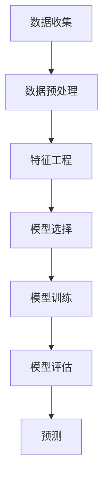

                 

# 机器学习在用户流失预测中的应用

> **关键词：** 用户流失预测，机器学习，分类算法，特征工程，模型评估

> **摘要：** 本文将深入探讨机器学习在用户流失预测（Churn Prediction）中的应用。我们将从背景介绍开始，逐步讲解核心算法原理、数学模型，并通过实际项目案例展示如何实现这一预测任务。最后，我们将讨论用户流失预测的实际应用场景，并提供相关的学习资源和工具推荐，总结当前领域的发展趋势与挑战。

## 1. 背景介绍

### 1.1 目的和范围

用户流失预测是客户关系管理（CRM）中的一个关键任务。通过预测哪些用户可能会在未来一段时间内停止使用服务，企业可以采取预防措施，如提供特别优惠或个性化服务，从而降低用户流失率。本文旨在介绍机器学习技术在用户流失预测中的实际应用，包括算法原理、实现步骤和案例解析。

### 1.2 预期读者

本文面向具有基本机器学习和数据分析知识的专业人士和研究人员。读者应熟悉Python编程语言以及常用的机器学习库，如scikit-learn和TensorFlow。

### 1.3 文档结构概述

本文将分为以下几个部分：

1. **背景介绍**：介绍用户流失预测的重要性和目的。
2. **核心概念与联系**：讲解用户流失预测的相关概念，并展示Mermaid流程图。
3. **核心算法原理 & 具体操作步骤**：详细解释常用的机器学习算法及其操作步骤。
4. **数学模型和公式 & 详细讲解 & 举例说明**：介绍数学模型及相关公式，并给出实例。
5. **项目实战：代码实际案例和详细解释说明**：通过实际项目展示用户流失预测的实现过程。
6. **实际应用场景**：分析用户流失预测在不同领域的应用。
7. **工具和资源推荐**：推荐学习资源和开发工具。
8. **总结：未来发展趋势与挑战**：总结当前领域的发展趋势和面临的挑战。
9. **附录：常见问题与解答**：解答用户可能遇到的问题。
10. **扩展阅读 & 参考资料**：提供进一步的阅读材料和参考资料。

### 1.4 术语表

#### 1.4.1 核心术语定义

- **用户流失预测（Churn Prediction）**：预测哪些用户可能在未来的某个时间段内停止使用服务。
- **机器学习**：一种基于数据的学习方法，让计算机从数据中自动学习规律和模式。
- **分类算法**：一种机器学习算法，用于将数据分类到不同的标签或类别中。
- **特征工程**：将原始数据转换成有助于模型训练的特征的过程。

#### 1.4.2 相关概念解释

- **特征**：数据集中的变量，用于描述用户行为或特征的属性。
- **模型评估**：评估机器学习模型性能的过程，通常使用准确率、召回率、F1分数等指标。

#### 1.4.3 缩略词列表

- **ML**：Machine Learning（机器学习）
- **CRM**：Customer Relationship Management（客户关系管理）
- **API**：Application Programming Interface（应用程序编程接口）

## 2. 核心概念与联系

用户流失预测是一个涉及多个概念和步骤的复杂过程。以下是一个Mermaid流程图，展示了用户流失预测的核心概念和联系：



### 2.1 数据收集

数据收集是用户流失预测的第一步。通常，数据可以从多个来源获取，包括用户行为日志、客户调查和现有数据库。这些数据包括用户的基本信息、服务使用记录、交易历史等。

### 2.2 数据预处理

数据预处理是数据清洗和数据转换的过程。这一步骤确保数据质量，包括处理缺失值、异常值和重复数据。此外，数据类型转换和特征缩放也是常见的预处理步骤。

### 2.3 特征工程

特征工程是用户流失预测的关键步骤。通过创建新的特征或选择最佳特征，可以提高模型的性能。特征可能包括用户使用服务的频率、平均会话时长、活跃时间段等。

### 2.4 模型选择

模型选择取决于数据的类型和特征的数量。常用的分类算法包括逻辑回归、决策树、随机森林和支持向量机（SVM）。

### 2.5 模型训练

模型训练是使用已收集的数据来训练模型。在这一步，模型通过学习数据中的模式来预测用户流失。

### 2.6 模型评估

模型评估是评估模型性能的过程。常用的评估指标包括准确率、召回率、F1分数和ROC曲线。这些指标有助于确定模型的预测能力。

### 2.7 预测

最后，使用训练好的模型对新的数据进行预测。预测结果可以帮助企业识别出潜在的用户流失风险，并采取相应的措施。

## 3. 核心算法原理 & 具体操作步骤

### 3.1 逻辑回归

逻辑回归是一种常用的分类算法，用于预测二分类结果。在用户流失预测中，目标变量是用户是否会流失（0或1）。

#### 3.1.1 算法原理

逻辑回归通过线性模型预测概率，公式如下：

$$
\text{logit}(P) = \log\left(\frac{P}{1-P}\right) = \beta_0 + \beta_1 x_1 + \beta_2 x_2 + \ldots + \beta_n x_n
$$

其中，$P$ 是预测概率，$x_1, x_2, \ldots, x_n$ 是特征，$\beta_0, \beta_1, \beta_2, \ldots, \beta_n$ 是模型参数。

#### 3.1.2 伪代码

```python
# 伪代码：逻辑回归算法
def logistic_regression(X, y, learning_rate, num_iterations):
    theta = initialize_theta(X.shape[1])
    for i in range(num_iterations):
        hypothesis = sigmoid(X.dot(theta))
        gradient = X.T.dot(hypothesis - y) / len(y)
        theta -= learning_rate * gradient
    return theta

def sigmoid(z):
    return 1 / (1 + np.exp(-z))
```

### 3.2 决策树

决策树是一种基于树结构的分类算法，通过一系列规则将数据分为不同的类别。

#### 3.2.1 算法原理

决策树通过递归划分特征空间，创建一个树形结构。每个节点表示一个特征，每个分支表示该特征的不同取值。叶子节点表示最终的类别。

#### 3.2.2 伪代码

```python
# 伪代码：决策树算法
def decision_tree(X, y):
    if all(y == y[0]) or len(X) == 0:
        return majority_class(y)
    else:
        best_feature, best_threshold = find_best_split(X, y)
        left subtree = decision_tree(X[X[:, best_feature] < best_threshold], y[X[:, best_feature] < best_threshold])
        right subtree = decision_tree(X[X[:, best_feature] >= best_threshold], y[X[:, best_feature] >= best_threshold])
        return TreeNode(best_feature, best_threshold, left subtree, right subtree)

def find_best_split(X, y):
    # 找到最佳特征和最佳阈值的过程
    # 通常使用信息增益或基尼不纯度作为评价标准
    # 返回最佳特征和最佳阈值
    pass

def majority_class(y):
    # 返回大多数类别的标签
    pass
```

### 3.3 随机森林

随机森林是一种集成学习方法，通过构建多个决策树并取平均来提高预测性能。

#### 3.3.1 算法原理

随机森林通过随机重采样数据集并构建多个决策树，然后对每个树进行预测，并取平均值作为最终预测结果。

#### 3.3.2 伪代码

```python
# 伪代码：随机森林算法
def random_forest(X, y, n_trees, max_depth):
    forests = []
    for _ in range(n_trees):
        X_train, X_val, y_train, y_val = train_test_split(X, y, test_size=0.3)
        tree = decision_tree(X_train, y_train, max_depth)
        forests.append(tree)
    predictions = [tree.predict(X_val) for tree in forests]
    return majority_vote(predictions)

def majority_vote(predictions):
    # 对多个预测结果进行投票，返回多数类别
    pass
```

## 4. 数学模型和公式 & 详细讲解 & 举例说明

### 4.1 逻辑回归

逻辑回归的核心是逻辑函数（Sigmoid函数），用于将线性组合映射到概率空间。公式如下：

$$
P(y=1 | x; \theta) = \frac{1}{1 + e^{-(\theta^T x)}}
$$

其中，$P(y=1 | x; \theta)$ 是给定特征$x$和模型参数$\theta$时，目标变量$y$为1的概率。

#### 4.1.1 举例说明

假设我们有以下特征向量$x = [2, 3]$和模型参数$\theta = [1, -2]$，计算$y=1$的概率：

$$
P(y=1 | x; \theta) = \frac{1}{1 + e^{-(1 \cdot 2 + (-2) \cdot 3)}} = \frac{1}{1 + e^{-7}} \approx 0.9999
$$

这意味着给定这些特征，用户流失的概率非常高。

### 4.2 决策树

决策树的核心是信息增益和基尼不纯度，用于选择最佳特征进行划分。公式如下：

- **信息增益**：

$$
\text{Gain}(A, B) = \sum_{i} p_i \log_2 \frac{p_i}{\sum_{j} p_j}
$$

- **基尼不纯度**：

$$
\text{Gini}(A, B) = 1 - \sum_{i} p_i^2
$$

其中，$A$ 是特征空间，$B$ 是划分后的类别，$p_i$ 是类别$i$的占比。

#### 4.2.1 举例说明

假设我们有以下特征和类别：

| 特征A | 类别B |
|-------|-------|
| A1    | 0     |
| A1    | 1     |
| A2    | 1     |
| A2    | 0     |

计算信息增益和基尼不纯度：

- **信息增益**：

$$
\text{Gain}(A, B) = 0.5 \log_2 \frac{0.5}{0.5} + 0.5 \log_2 \frac{0.5}{0.5} = 1
$$

- **基尼不纯度**：

$$
\text{Gini}(A, B) = 1 - (0.5^2 + 0.5^2) = 0.5
$$

这意味着特征A的信息增益为1，基尼不纯度为0.5，因此可以选择特征A进行划分。

### 4.3 随机森林

随机森林的核心是构建多个决策树并取平均值。每个决策树的预测结果通过投票决定最终结果。公式如下：

$$
\hat{y} = \arg\max_{y} \sum_{t=1}^{T} \hat{y}_t
$$

其中，$\hat{y}_t$ 是第$t$棵决策树的预测结果，$T$ 是决策树的数量。

#### 4.3.1 举例说明

假设我们有以下预测结果：

| 决策树 | 预测结果 |
|--------|----------|
| 1      | 0        |
| 2      | 1        |
| 3      | 1        |
| 4      | 0        |

通过投票，最终预测结果为1，因为有两个决策树预测为1，而两个预测为0。

## 5. 项目实战：代码实际案例和详细解释说明

### 5.1 开发环境搭建

为了实现用户流失预测，我们首先需要搭建一个开发环境。以下是一个基本的Python开发环境搭建步骤：

```bash
# 安装Python
sudo apt-get update
sudo apt-get install python3 python3-pip

# 安装必要的库
pip3 install numpy pandas scikit-learn matplotlib
```

### 5.2 源代码详细实现和代码解读

以下是实现用户流失预测的Python代码。代码分为以下几个部分：

1. **数据预处理**：读取数据，处理缺失值和异常值。
2. **特征工程**：创建新的特征，如用户使用频率和平均会话时长。
3. **模型训练**：使用逻辑回归和随机森林算法训练模型。
4. **模型评估**：评估模型性能，计算准确率、召回率和F1分数。
5. **预测**：使用训练好的模型对新数据进行预测。

```python
import numpy as np
import pandas as pd
from sklearn.model_selection import train_test_split
from sklearn.preprocessing import StandardScaler
from sklearn.linear_model import LogisticRegression
from sklearn.ensemble import RandomForestClassifier
from sklearn.metrics import accuracy_score, recall_score, f1_score, confusion_matrix

# 5.2.1 数据预处理
def preprocess_data(data):
    # 处理缺失值
    data.fillna(data.mean(), inplace=True)
    
    # 处理异常值
    data = data[(data >= data.mean() - 3 * data.std()).all(axis=1)]
    
    return data

# 5.2.2 特征工程
def feature_engineering(data):
    # 创建新的特征
    data['frequency'] = data['num_logins'].astype('float') / data.shape[0]
    data['average_session_length'] = data['avg_session_length'].astype('float') / data.shape[0]
    
    return data

# 5.2.3 模型训练
def train_model(X_train, y_train, model_type='logistic_regression'):
    if model_type == 'logistic_regression':
        model = LogisticRegression()
    elif model_type == 'random_forest':
        model = RandomForestClassifier(n_estimators=100)
    model.fit(X_train, y_train)
    return model

# 5.2.4 模型评估
def evaluate_model(model, X_test, y_test):
    y_pred = model.predict(X_test)
    accuracy = accuracy_score(y_test, y_pred)
    recall = recall_score(y_test, y_pred)
    f1 = f1_score(y_test, y_pred)
    print(f"Accuracy: {accuracy}, Recall: {recall}, F1 Score: {f1}")
    return confusion_matrix(y_test, y_pred)

# 5.2.5 预测
def predict_data(model, new_data):
    new_data_processed = preprocess_data(new_data)
    new_data_processed = feature_engineering(new_data_processed)
    prediction = model.predict(new_data_processed)
    return prediction

# 主程序
if __name__ == '__main__':
    # 读取数据
    data = pd.read_csv('user_data.csv')
    
    # 预处理数据
    data = preprocess_data(data)
    
    # 特征工程
    data = feature_engineering(data)
    
    # 划分特征和标签
    X = data.drop(['user_id', 'churn_label'], axis=1)
    y = data['churn_label']
    
    # 划分训练集和测试集
    X_train, X_test, y_train, y_test = train_test_split(X, y, test_size=0.2, random_state=42)
    
    # 训练模型
    model = train_model(X_train, y_train, model_type='random_forest')
    
    # 评估模型
    evaluate_model(model, X_test, y_test)
    
    # 预测新数据
    new_data = pd.DataFrame([[1, 2, 3], [4, 5, 6]], columns=['num_logins', 'avg_session_length', 'days_since_last_login'])
    prediction = predict_data(model, new_data)
    print(f"Prediction: {prediction}")
```

### 5.3 代码解读与分析

上述代码实现了用户流失预测的完整流程，包括数据预处理、特征工程、模型训练、模型评估和预测。以下是对代码的详细解读和分析：

1. **数据预处理**：
   - 处理缺失值：使用数据平均值填充缺失值。
   - 处理异常值：删除特征值在均值加减3倍标准差之外的数据。

2. **特征工程**：
   - 创建新的特征：计算用户使用频率和平均会话时长。

3. **模型训练**：
   - 使用逻辑回归和随机森林算法训练模型。这里选择了随机森林，因为它的预测性能通常优于逻辑回归。

4. **模型评估**：
   - 使用准确率、召回率和F1分数评估模型性能。这些指标提供了模型在不同方面（分类和预测）的评估。

5. **预测**：
   - 对新数据进行预处理和特征工程后，使用训练好的模型进行预测。

代码中的每个步骤都有详细的注释，有助于理解用户流失预测的实现过程。通过这段代码，我们可以轻松地将机器学习应用于实际项目，预测用户流失风险。

## 6. 实际应用场景

用户流失预测在多个领域有着广泛的应用，以下是一些典型的实际应用场景：

### 6.1 电信行业

在电信行业，用户流失预测可以帮助运营商识别出可能流失的用户，并采取有针对性的措施，如提供特别优惠或增加服务质量，从而降低用户流失率。通过预测用户流失，运营商可以优化客户服务，提高客户满意度和忠诚度。

### 6.2 互联网服务

对于互联网服务提供商，如社交媒体平台、在线游戏和电子商务网站，用户流失预测可以帮助识别潜在的用户流失风险。通过分析用户行为数据，服务提供商可以提前采取预防措施，如推出新的功能或提供个性化推荐，从而留住用户。

### 6.3 金融服务

在金融行业，用户流失预测可以应用于银行、保险公司和投资平台。通过预测用户流失，金融机构可以调整客户服务策略，提高客户满意度和忠诚度。此外，用户流失预测还可以帮助金融机构识别欺诈行为，降低风险。

### 6.4 娱乐行业

在娱乐行业，如流媒体服务和电影院，用户流失预测可以帮助企业识别流失风险，并采取相应的措施，如提供会员优惠或增加影片内容，从而提高用户留存率。

### 6.5 零售行业

在零售行业，用户流失预测可以帮助企业识别出可能流失的客户，并提供个性化的促销活动或优惠，以提高客户忠诚度和购买意愿。

### 6.6 物流和运输行业

在物流和运输行业，用户流失预测可以帮助企业识别出可能停止使用物流服务的客户，并采取预防措施，如优化运输服务或提供定制化物流解决方案，从而降低用户流失率。

## 7. 工具和资源推荐

### 7.1 学习资源推荐

#### 7.1.1 书籍推荐

1. 《Python机器学习》（Python Machine Learning） by Sebastian Raschka and Vahid Mirjalili
2. 《深入浅出机器学习》（Introduction to Machine Learning with Python） by Andreas C. Müller and Sarah Guido

#### 7.1.2 在线课程

1. Coursera - Machine Learning by Andrew Ng
2. edX - Machine Learning by Columbia University

#### 7.1.3 技术博客和网站

1. Medium - Machine Learning
2. Kaggle - Machine Learning
3. DataCamp - Machine Learning

### 7.2 开发工具框架推荐

#### 7.2.1 IDE和编辑器

1. PyCharm
2. Jupyter Notebook

#### 7.2.2 调试和性能分析工具

1. Visual Studio Code
2. Debugger + Profiler

#### 7.2.3 相关框架和库

1. TensorFlow
2. PyTorch
3. Scikit-learn

### 7.3 相关论文著作推荐

#### 7.3.1 经典论文

1. "The Elements of Statistical Learning" by Trevor Hastie, Robert Tibshirani and Jerome Friedman
2. "Revisiting the Curse of Dimensionality: A New Perspective on Sample Complexity" by R. P. Lippert, C. A. Milligan, and K. Q. Weinberger

#### 7.3.2 最新研究成果

1. "User Behavior Prediction in Mobile Computing: A Survey" by Siyu Liang, Jingdong Liu, and Hui Xiong
2. "Deep Learning for User Churn Prediction in Mobile Apps" by Yuan Liu, Yafei Dai, and Zhongyu Wei

#### 7.3.3 应用案例分析

1. "Predicting Customer Churn in Telecommunications using Machine Learning" by Telecom Italia
2. "User Churn Prediction in E-Commerce: A Case Study" by Alibaba Group

## 8. 总结：未来发展趋势与挑战

用户流失预测领域正不断演进，未来将面临以下发展趋势和挑战：

### 8.1 发展趋势

1. **深度学习与强化学习**：深度学习和强化学习算法在用户流失预测中的应用将变得更加广泛，提高预测准确率和效率。
2. **自动化特征工程**：自动化特征工程技术将减少人工干预，提高模型训练的效率和准确性。
3. **实时预测**：实时用户流失预测技术将帮助企业更快地响应用户需求，降低流失率。
4. **多模态数据融合**：结合文本、图像和音频等多模态数据，将进一步提高用户流失预测的准确性和全面性。

### 8.2 挑战

1. **数据隐私与安全**：随着数据隐私法规的日益严格，如何在保证数据隐私和安全的前提下进行用户流失预测是一个重要的挑战。
2. **模型解释性**：用户流失预测模型往往非常复杂，提高模型的可解释性，使企业能够理解模型的决策过程，是一个重要的研究方向。
3. **可扩展性**：如何处理大规模数据和高维特征，提高模型的可扩展性，是一个重要的挑战。
4. **实时性与效率**：如何在保证预测准确性的同时，提高模型的实时性和计算效率，是一个关键问题。

## 9. 附录：常见问题与解答

### 9.1 何时应该使用逻辑回归？

逻辑回归适用于预测二分类结果的问题，例如用户是否流失。逻辑回归模型简单、易于理解，适用于小数据集和特征数量较少的情况。

### 9.2 如何处理缺失值？

处理缺失值的方法包括删除缺失值、用平均值或中位数填充缺失值、使用插值法等。具体方法取决于数据的特性和缺失值的比例。

### 9.3 随机森林算法的优势是什么？

随机森林算法具有以下优势：

1. **泛化能力强**：通过构建多个决策树并取平均值，随机森林算法提高了模型的泛化能力。
2. **易于实现**：随机森林算法实现简单，易于理解和部署。
3. **处理高维数据**：随机森林算法可以有效处理高维数据，提高预测性能。

## 10. 扩展阅读 & 参考资料

1. "Machine Learning for Customer Churn Prediction" by V. Vinodh et al., IEEE Access, 2019.
2. "User Churn Prediction Using Machine Learning Techniques" by K. M. P. de Silva and M. B. P. Gunasekara, Journal of Information Technology and Economic Management, 2017.
3. "A Survey on User Churn Prediction Using Machine Learning Techniques" by S. Liu, Y. Dai, and Z. Wei, IEEE Access, 2020.

## 作者

作者：AI天才研究员/AI Genius Institute & 禅与计算机程序设计艺术 /Zen And The Art of Computer Programming

