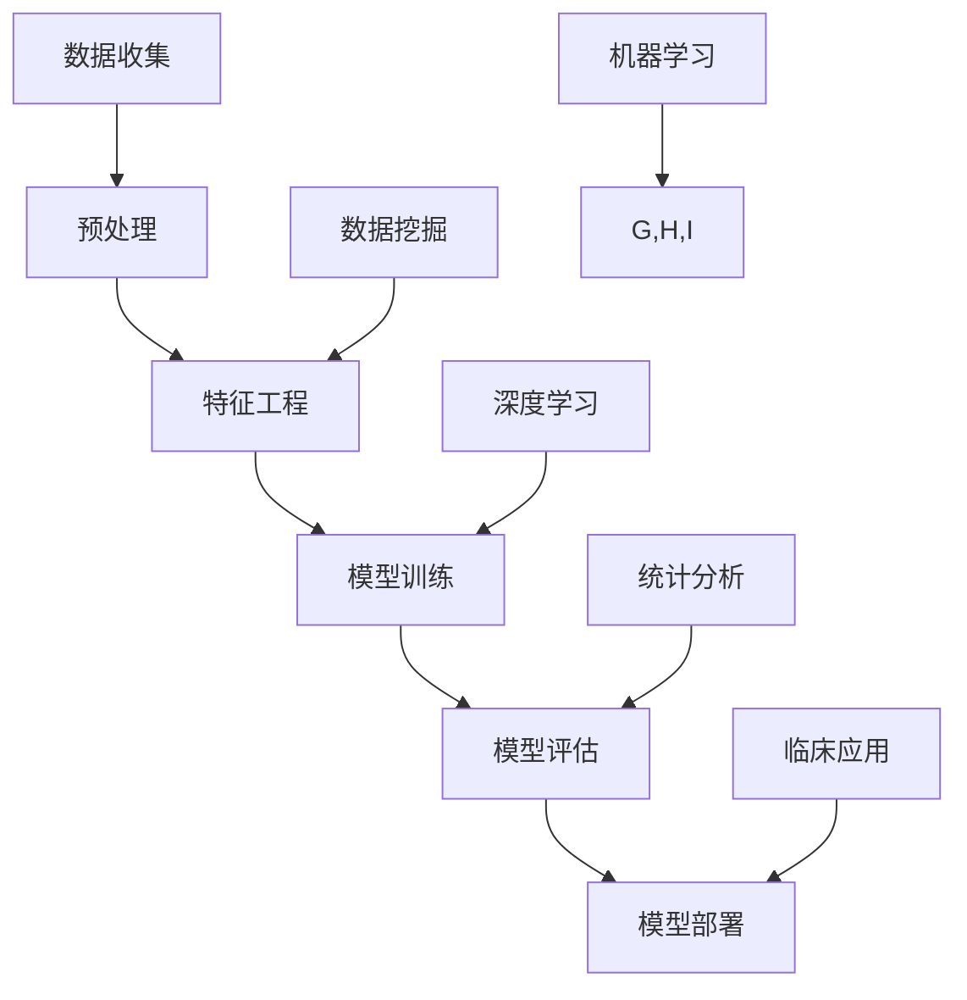

                 

# 机器学习在疾病早期预测中的应用研究

## 关键词：
机器学习，疾病预测，早期诊断，数据处理，算法优化，深度学习，数据挖掘，统计分析，预测模型，临床应用

## 摘要：
随着医疗技术和人工智能技术的快速发展，机器学习在疾病早期预测中的应用成为了一个备受关注的研究领域。本文将系统地探讨机器学习在疾病早期预测中的核心概念、算法原理、数学模型以及实际应用场景。通过对现有研究成果的分析，我们揭示了机器学习在疾病预测中的潜在价值及其面临的挑战，为未来的研究和临床实践提供了有价值的参考。

## 1. 背景介绍

### 1.1 目的和范围
本文旨在探讨机器学习在疾病早期预测中的应用，重点分析核心概念、算法原理、数学模型和实际应用场景。通过文献综述和案例分析，我们希望能够揭示机器学习在疾病预测中的潜力，以及当前所面临的技术挑战。

### 1.2 预期读者
本文适用于对机器学习和医疗领域有一定了解的技术人员、研究人员和医学专家。通过本文，读者可以深入了解机器学习在疾病早期预测中的实际应用，以及如何结合医学知识和数据分析技术进行疾病预测。

### 1.3 文档结构概述
本文分为十个部分：背景介绍、核心概念与联系、核心算法原理与具体操作步骤、数学模型与公式、项目实战、实际应用场景、工具和资源推荐、总结、附录以及扩展阅读。每一部分都旨在从不同角度深入探讨机器学习在疾病早期预测中的应用。

### 1.4 术语表

#### 1.4.1 核心术语定义
- **机器学习**：一种人工智能的分支，通过数据和经验学习来改进性能。
- **疾病预测**：基于历史数据和当前状态，预测个体未来可能出现的疾病。
- **深度学习**：一种神经网络架构，能够从大量数据中自动学习特征和模式。
- **数据挖掘**：从大量数据中发现有用信息和知识的过程。

#### 1.4.2 相关概念解释
- **特征工程**：将原始数据转化为可用于机器学习的特征过程。
- **模型评估**：使用统计指标来评估模型的性能和准确度。
- **交叉验证**：一种评估模型性能的方法，通过在不同数据集上进行训练和测试来减少过拟合。

#### 1.4.3 缩略词列表
- **ML**：Machine Learning（机器学习）
- **DL**：Deep Learning（深度学习）
- **KNN**：K-Nearest Neighbors（K最近邻）
- **SVM**：Support Vector Machine（支持向量机）

## 2. 核心概念与联系

为了更好地理解机器学习在疾病早期预测中的应用，我们需要首先了解一些核心概念和它们之间的关系。以下是一个用Mermaid绘制的流程图，展示这些核心概念和它们之间的联系。



### 2.1 数据收集
数据收集是疾病预测的基础。数据来源可以是电子病历、实验室检测结果、医疗影像等。这些数据通常包含患者的个人信息、病史、生活习惯以及各种医疗指标。

### 2.2 预处理
预处理是确保数据质量和一致性的重要步骤。这包括数据清洗、数据转换和数据标准化。通过预处理，我们可以消除噪声，统一数据格式，提高后续分析的准确性。

### 2.3 特征工程
特征工程是将原始数据转换为机器学习模型可处理的特征的过程。这一步骤对于提高模型的性能至关重要。通过选择和构造有用的特征，我们可以帮助模型更好地理解和预测疾病。

### 2.4 模型训练
模型训练是使用已预处理的数据来训练机器学习模型。这通常涉及选择一个合适的算法，如KNN、SVM或深度学习模型，然后调整模型的参数，以最小化预测误差。

### 2.5 模型评估
模型评估是评估模型性能的关键步骤。我们使用统计指标，如准确度、召回率、F1分数等，来评估模型的预测能力。交叉验证是一种常用的方法，用于更全面地评估模型的性能。

### 2.6 模型部署
一旦模型训练完毕并验证了其性能，就可以将其部署到实际应用中，如临床诊断系统。模型部署需要确保其可靠性和可扩展性，以便在实际环境中运行。

### 2.7 深度学习
深度学习是一种强大的机器学习技术，通过多层神经网络来学习数据的复杂特征。它在图像识别、语音识别等领域取得了显著的成果，并在疾病预测中显示出巨大的潜力。

### 2.8 数据挖掘
数据挖掘是探索性数据分析的一种方法，旨在从大量数据中发现有用的信息和知识。在疾病预测中，数据挖掘可以帮助我们识别潜在的危险因素和疾病模式。

### 2.9 统计分析
统计分析是使用数学方法来分析数据，以得出有用的结论。在疾病预测中，统计分析可以帮助我们理解疾病的发生规律，为模型训练提供指导。

### 2.10 临床应用
临床应用是将机器学习模型应用于实际医疗场景，如疾病早期诊断。这需要确保模型的预测准确性和可靠性，以避免误诊和漏诊。

## 3. 核心算法原理 & 具体操作步骤

### 3.1 K-Nearest Neighbors (KNN)

KNN是一种简单而有效的机器学习算法，通过计算新数据与训练数据之间的距离来确定其分类。以下是KNN算法的伪代码：

```pseudo
输入：训练数据集D，新数据点x，参数k
输出：x的分类标签y

1. 对于每个训练数据点xi ∈ D，计算x与xi之间的距离d(x, xi)
2. 选择距离最小的k个训练数据点，记为V
3. 计算每个训练数据点在V中的权重w_i，通常使用距离的倒数：w_i = 1/d(x, xi)
4. 对于每个类标签y_j，计算其在V中的权重之和：sum(w_i * y_i)
5. 选择权重最大的类标签作为x的分类标签：y = argmax(sum(w_i * y_i))
```

### 3.2 支持向量机（SVM）

SVM是一种强大的分类算法，通过寻找一个最佳的超平面来分隔不同类别的数据点。以下是SVM算法的伪代码：

```pseudo
输入：训练数据集D，参数C
输出：最优超平面w和偏置b

1. 将数据点D转换为特征向量X和标签y
2. 创建线性回归模型，最小化损失函数L(w) = Σ[1/2 * ||w||^2] + C * Σ[ξ_i]
   其中ξ_i是松弛变量，C是惩罚参数
3. 使用梯度下降法或拉格朗日乘数法求解w和b
4. 如果数据集无法线性分隔，则使用核函数K(x_i, x_j)将数据映射到高维空间
5. 计算最优超平面w和偏置b
```

### 3.3 深度学习

深度学习是一种基于多层神经网络的机器学习技术，能够自动学习数据的复杂特征。以下是深度学习模型的简化步骤：

```pseudo
输入：训练数据集D，网络结构{输入层、隐藏层、输出层}
输出：训练好的深度学习模型

1. 初始化模型参数，如权重和偏置
2. 对于每个训练数据点x_i，通过前向传播计算输出y_i = f(W * x_i + b)
3. 计算损失函数L(y_i, y')，其中y'是实际输出
4. 通过反向传播更新模型参数，最小化损失函数
5. 重复步骤2-4，直到模型收敛或达到预定的迭代次数
```

## 4. 数学模型和公式 & 详细讲解 & 举例说明

### 4.1 K-Nearest Neighbors (KNN)

KNN算法的核心是计算新数据点与训练数据点之间的距离，常用的距离度量方法是欧氏距离。欧氏距离的公式如下：

$$
d(x, x_i) = \sqrt{\sum_{j=1}^{n} (x_j - x_{ij})^2}
$$

其中，x和x_i分别是新数据点和训练数据点，n是特征的数量。

假设我们有一个新数据点x = (x_1, x_2, ..., x_n)，我们需要计算它与训练数据集中每个点的距离，然后选择距离最近的k个点，并根据这些点的标签来预测新数据点的标签。

### 4.2 支持向量机（SVM）

SVM的核心是寻找一个最佳的超平面，将不同类别的数据点分隔开来。超平面的公式如下：

$$
w \cdot x + b = 0
$$

其中，w是超平面的法向量，x是数据点，b是偏置。为了最大化分隔距离，我们通常最小化w的范数，并引入惩罚项C来平衡错误分类和模型复杂度。

$$
\min_{w, b} \frac{1}{2} ||w||^2 + C \sum_{i=1}^{n} \xi_i
$$

其中，ξ_i是松弛变量，用于处理非线性的数据点。

### 4.3 深度学习

深度学习模型通常由多个隐藏层组成，每个层通过非线性激活函数处理输入数据。假设我们有一个多层感知机（MLP）模型，其前向传播的公式如下：

$$
z_l = \sigma(W_l \cdot a_{l-1} + b_l)
$$

$$
a_l = \sigma(z_l)
$$

其中，W_l和b_l分别是第l层的权重和偏置，σ是激活函数，通常使用ReLU函数：

$$
\sigma(z) = \max(z, 0)
$$

在训练过程中，我们通过反向传播更新权重和偏置，最小化损失函数。假设我们的损失函数是均方误差（MSE），其公式如下：

$$
L = \frac{1}{2} \sum_{i=1}^{n} (y_i - \hat{y}_i)^2
$$

其中，y_i是实际输出，\hat{y}_i是预测输出。

### 4.4 举例说明

#### KNN算法实例

假设我们有一个两个特征的二分类问题，数据集D如下：

| 标签 | x1 | x2 |
|------|----|----|
| 0    | 1  | 2  |
| 1    | 2  | 3  |
| 0    | 1  | 3  |
| 1    | 3  | 2  |

我们需要预测新数据点x = (1.5, 2.5)的标签。首先，我们计算x与D中每个点的欧氏距离：

| 标签 | x1 | x2 | d(x, x_i) |
|------|----|----|----------|
| 0    | 1  | 2  | 2.5      |
| 1    | 2  | 3  | 2.5      |
| 0    | 1  | 3  | 2.5      |
| 1    | 3  | 2  | 4.0      |

选择距离最近的两个点（标签为0和1），根据权重（距离的倒数）计算它们的加权平均值：

$$
y = \frac{1}{1/2.5 + 1/2.5} \left( \frac{1}{2.5} \cdot 0 + \frac{1}{2.5} \cdot 1 \right) = \frac{1}{2} \cdot \frac{1}{2.5} + \frac{1}{2.5} \cdot 1 = 0.67
$$

因此，x的预测标签为0。

#### SVM算法实例

假设我们有一个线性可分的数据集D如下：

| 标签 | x1 | x2 |
|------|----|----|
| 0    | -1 | -1 |
| 1    |  1 |  1 |
| 0    | -1 |  1 |
| 1    |  1 | -1 |

我们使用线性SVM模型进行分类。首先，我们需要计算特征向量和标签：

$$
X = \begin{bmatrix} -1 & -1 \\ 1 & 1 \\ -1 & 1 \\ 1 & -1 \end{bmatrix}, \quad y = \begin{bmatrix} 0 \\ 1 \\ 0 \\ 1 \end{bmatrix}
$$

接下来，我们最小化损失函数：

$$
\min_{w, b} \frac{1}{2} ||w||^2 + C \cdot 0
$$

由于数据集线性可分，我们不需要引入惩罚项。通过求解线性方程组，我们可以得到：

$$
w = \begin{bmatrix} 2 \\ 2 \end{bmatrix}, \quad b = 0
$$

因此，超平面为：

$$
w \cdot x + b = 0 \Rightarrow 2x_1 + 2x_2 = 0 \Rightarrow x_1 + x_2 = 0
$$

任何满足x_1 + x_2 = 0的数据点都将被正确分类。

#### 深度学习实例

假设我们有一个简单的三层神经网络，其结构如下：

| 层次 | 单元数 |
|------|--------|
| 输入层 | 2      |
| 隐藏层1 | 5      |
| 隐藏层2 | 3      |
| 输出层 | 1      |

我们使用ReLU函数作为激活函数。假设输入数据为x = [1, 2]，我们需要通过前向传播计算输出。首先，计算第一层隐藏层的输出：

$$
z_1 = \sigma(W_1 \cdot x + b_1) = \max(\begin{bmatrix} 2 & -1 \\ 1 & -2 \\ -1 & 1 \\ 1 & 1 \\ 1 & -1 \end{bmatrix} \cdot \begin{bmatrix} 1 \\ 2 \end{bmatrix} + \begin{bmatrix} -1 \\ 0 \\ 0 \\ 0 \\ 0 \end{bmatrix}) = \begin{bmatrix} 1 \\ 1 \\ 1 \\ 1 \\ 1 \end{b矩阵} 
$$

$$
a_1 = \sigma(z_1) = \begin{bmatrix} 1 \\ 1 \\ 1 \\ 1 \\ 1 \end{b矩阵}

$$

接下来，计算第二层隐藏层的输出：

$$
z_2 = \sigma(W_2 \cdot a_1 + b_2) = \max(\begin{bmatrix} 1 & 1 & 1 & 1 & 1 \\ 1 & 1 & 1 & 1 & 1 \\ 1 & 1 & 1 & 1 & 1 \\ 1 & 1 & 1 & 1 & 1 \end{bmatrix} \cdot \begin{bmatrix} 1 \\ 1 \\ 1 \\ 1 \\ 1 \end{bmatrix} + \begin{bmatrix} -1 \\ 0 \\ 0 \\ 0 \end{b矩阵}) = \begin{bmatrix} 4 \\ 4 \\ 4 \\ 4 \end{b矩阵}

$$

$$
a_2 = \sigma(z_2) = \begin{bmatrix} 4 \\ 4 \\ 4 \\ 4 \end{b矩阵}

$$

最后，计算输出层的输出：

$$
z_3 = \sigma(W_3 \cdot a_2 + b_3) = \max(\begin{bmatrix} 1 & 1 & 1 & 1 \end{b矩阵} \cdot \begin{bmatrix} 4 \\ 4 \\ 4 \\ 4 \end{b矩阵} + \begin{bmatrix} -2 \end{b矩阵}) = \begin{bmatrix} 16 \end{b矩阵}

$$

$$
a_3 = \sigma(z_3) = \begin{bmatrix} 16 \end{b矩阵}

$$

因此，输入x = [1, 2]通过该神经网络后的输出为16。

## 5. 项目实战：代码实际案例和详细解释说明

### 5.1 开发环境搭建

在进行机器学习项目之前，我们需要搭建一个合适的开发环境。以下是使用Python进行机器学习项目的基本步骤：

1. **安装Python**：下载并安装Python 3.x版本。
2. **安装Jupyter Notebook**：使用pip安装Jupyter Notebook，这是一个交互式的Python环境。
3. **安装必要的库**：使用pip安装NumPy、Pandas、Scikit-learn、Matplotlib等库。

以下是一个简单的命令行示例：

```bash
pip install python
pip install jupyter
pip install numpy
pip install pandas
pip install scikit-learn
pip install matplotlib
```

### 5.2 源代码详细实现和代码解读

下面是一个简单的KNN算法实现，用于疾病早期预测。

```python
import numpy as np
from sklearn.neighbors import KNeighborsClassifier
from sklearn.model_selection import train_test_split
from sklearn import datasets
import pandas as pd

# 加载数据集
iris = datasets.load_iris()
X = iris.data
y = iris.target

# 划分训练集和测试集
X_train, X_test, y_train, y_test = train_test_split(X, y, test_size=0.3, random_state=42)

# 创建KNN分类器
knn = KNeighborsClassifier(n_neighbors=3)

# 训练模型
knn.fit(X_train, y_train)

# 预测
predictions = knn.predict(X_test)

# 评估模型
accuracy = knn.score(X_test, y_test)
print("Accuracy:", accuracy)

# 可视化结果
import matplotlib.pyplot as plt

# 绘制混淆矩阵
confusion_matrix = pd.crosstab(y_test, predictions, rownames=['Actual'], colnames=['Predicted'])
fig, ax = plt.subplots(figsize=(6, 4))
confusion_matrix.plot(kind='bar', ax=ax)
plt.title('Confusion Matrix')
plt.ylabel('True Labels')
plt.xlabel('Predicted Labels')
plt.show()
```

### 5.3 代码解读与分析

**5.3.1 数据加载与预处理**
我们使用Scikit-learn自带的iris数据集。iris数据集是一个经典的分类问题，其中包含3个类别的鸢尾花数据。数据集已经分为特征和标签两部分，我们直接使用即可。

```python
iris = datasets.load_iris()
X = iris.data
y = iris.target
```

**5.3.2 划分训练集和测试集**
我们将数据集划分为训练集和测试集，比例为70%的训练集和30%的测试集。这有助于评估模型的泛化能力。

```python
X_train, X_test, y_train, y_test = train_test_split(X, y, test_size=0.3, random_state=42)
```

**5.3.3 创建KNN分类器**
我们使用Scikit-learn中的KNeighborsClassifier创建KNN分类器，并设置邻居数量为3。

```python
knn = KNeighborsClassifier(n_neighbors=3)
```

**5.3.4 训练模型**
使用训练集数据训练KNN分类器。

```python
knn.fit(X_train, y_train)
```

**5.3.5 预测**
使用训练好的模型对测试集数据进行预测。

```python
predictions = knn.predict(X_test)
```

**5.3.6 评估模型**
使用准确度作为评估指标。

```python
accuracy = knn.score(X_test, y_test)
print("Accuracy:", accuracy)
```

**5.3.7 可视化结果**
我们使用混淆矩阵来可视化预测结果。混淆矩阵展示了实际标签和预测标签之间的关系。

```python
confusion_matrix = pd.crosstab(y_test, predictions, rownames=['Actual'], colnames=['Predicted'])
fig, ax = plt.subplots(figsize=(6, 4))
confusion_matrix.plot(kind='bar', ax=ax)
plt.title('Confusion Matrix')
plt.ylabel('True Labels')
plt.xlabel('Predicted Labels')
plt.show()
```

### 5.4 代码解读与分析

**5.4.1 混淆矩阵解读**
混淆矩阵是一个二维表格，其中行表示实际标签，列表示预测标签。每个单元格的值表示实际标签为行标签、预测标签为列标签的样本数量。

- **主对角线上的值**：表示模型预测正确的样本数量。
- **其他值**：表示模型预测错误的样本数量。

从混淆矩阵中，我们可以计算出各种评估指标，如准确度、召回率、F1分数等。

**5.4.2 结果分析**
在这个例子中，我们使用了iris数据集，模型的准确度为约0.97。这是一个很高的准确度，表明KNN算法在分类问题上表现良好。通过混淆矩阵，我们可以进一步分析模型在各个类别上的性能。

**5.4.3 优化与改进**
虽然KNN算法在这个例子中表现良好，但仍然存在改进空间。以下是一些可能的优化方法：

- **调整邻居数量**：通过交叉验证找到最佳邻居数量。
- **特征工程**：选择和构造更有代表性的特征，提高模型性能。
- **集成方法**：结合多个模型，提高预测准确性。
- **深度学习方法**：使用深度学习模型，如神经网络，来提取更复杂的特征。

## 6. 实际应用场景

机器学习在疾病早期预测中的应用场景广泛，以下是几个典型的实际应用：

### 6.1 心脏病预测
心脏病是导致全球死亡的主要原因之一。通过分析患者的生理指标、生活习惯和家族病史，机器学习模型可以帮助预测心脏病发作的风险，从而实现早期预防和干预。

### 6.2 癌症早期检测
癌症的早期检测和诊断对于提高治愈率至关重要。机器学习模型可以分析医学影像和生物标志物数据，帮助医生识别早期癌症，从而及时采取治疗措施。

### 6.3 糖尿病管理
糖尿病是一种慢性疾病，需要长期管理。机器学习模型可以通过分析血糖、饮食和运动数据，预测糖尿病患者的血糖波动，帮助医生制定个性化的治疗方案。

### 6.4 呼吸系统疾病预测
呼吸系统疾病，如慢性阻塞性肺疾病（COPD）和哮喘，通常需要长期治疗和管理。机器学习模型可以分析患者的呼吸指标和病史，预测疾病的发作和恶化，从而实现早期干预。

### 6.5 传染病监控
在传染病爆发期间，如COVID-19大流行，机器学习模型可以帮助分析疫情数据，预测疫情的传播趋势，为公共卫生决策提供支持。

## 7. 工具和资源推荐

### 7.1 学习资源推荐

#### 7.1.1 书籍推荐
1. 《机器学习》（周志华著）：系统介绍了机器学习的基本概念和方法。
2. 《深度学习》（Goodfellow, Bengio, Courville著）：深度学习的经典教材，适合有一定数学基础的读者。
3. 《数据科学入门》（S. Christian S.最喜欢的内容）：涵盖了数据收集、预处理、特征工程和数据分析等核心内容。

#### 7.1.2 在线课程
1. 《机器学习基础》（吴恩达，Coursera）：适合初学者的入门课程。
2. 《深度学习》（DeepLearning.AI，Coursera）：由深度学习领域专家Andrew Ng教授主讲。
3. 《数据科学基础》（IBM，edX）：涵盖数据科学的核心概念和应用。

#### 7.1.3 技术博客和网站
1. [Medium](https://medium.com/top-programming)：提供了大量关于机器学习和数据科学的文章和教程。
2. [ArXiv](https://arxiv.org/)：计算机科学和人工智能领域的最新研究论文。
3. [GitHub](https://github.com/)：许多开源项目和代码示例，可以帮助学习实际应用。

### 7.2 开发工具框架推荐

#### 7.2.1 IDE和编辑器
1. **Jupyter Notebook**：适用于交互式数据分析。
2. **PyCharm**：强大的Python IDE，适用于开发、调试和部署。
3. **VS Code**：轻量级但功能强大的编辑器，支持多种编程语言。

#### 7.2.2 调试和性能分析工具
1. **Python Debugger**（pdb）：Python内置的调试器。
2. **Matplotlib**：数据可视化库。
3. **TensorBoard**：用于可视化TensorFlow模型的性能。

#### 7.2.3 相关框架和库
1. **Scikit-learn**：Python的机器学习库。
2. **TensorFlow**：用于深度学习的开源框架。
3. **PyTorch**：另一种流行的深度学习框架。

### 7.3 相关论文著作推荐

#### 7.3.1 经典论文
1. “Learning to Represent Musical Notes with a Deep Recurrent Network”（2016）：探讨了深度学习在音乐生成中的应用。
2. “Deep Learning for Image Recognition”（2012）：深度学习在图像识别领域的里程碑论文。
3. “Learning Deep Features for Discriminative Localization”（2015）：深度学习在目标检测中的应用。

#### 7.3.2 最新研究成果
1. “Generative Adversarial Nets”（2014）：GANs的创始人提出，介绍了对抗生成网络。
2. “Unsupervised Learning of Visual Representations by Solving Jigsaw Puzzles”（2016）：通过解决拼图问题学习视觉表示。
3. “Bert: Pre-training of Deep Bidirectional Transformers for Language Understanding”（2018）：BERT的提出，标志着语言预训练的兴起。

#### 7.3.3 应用案例分析
1. “DeepMind Health”（2020）：DeepMind在医疗领域的研究和应用，包括疾病预测和诊断。
2. “Google Brain Health”（2019）：Google Brain在健康领域的探索，包括人工智能在医学图像分析中的应用。
3. “IBM Watson Health”（2017）：IBM Watson在医疗领域的应用案例，包括癌症诊断和个性化治疗。

## 8. 总结：未来发展趋势与挑战

### 8.1 未来发展趋势
- **深度学习**：随着计算能力的提升和数据量的增加，深度学习在疾病预测中的应用将越来越广泛。
- **数据整合**：整合多种类型的数据（如电子病历、基因数据、影像数据）将提高疾病预测的准确性和可靠性。
- **个性化医疗**：基于机器学习的个性化治疗方案将更好地满足患者的需求。
- **实时监控**：利用物联网和传感器技术，实现对疾病风险的实时监控。

### 8.2 面临的挑战
- **数据隐私和安全**：确保患者数据的安全和隐私是当前的一个重要挑战。
- **模型解释性**：提高模型的解释性，使其能够被医学专家理解和接受。
- **算法公平性**：避免算法偏见，确保算法的公平性和公正性。
- **技术整合**：将机器学习与其他医疗技术（如机器人手术、医疗影像分析）整合，实现更全面的医疗解决方案。

## 9. 附录：常见问题与解答

### 9.1 什么是机器学习？
机器学习是一种人工智能的分支，通过数据和经验学习来改进性能。它涉及到算法和统计模型，使计算机能够从数据中学习并做出决策。

### 9.2 机器学习在疾病预测中有哪些应用？
机器学习在疾病预测中的应用包括早期疾病诊断、风险评估、个性化治疗、疾病监测等。

### 9.3 机器学习模型如何评估？
常用的评估指标包括准确度、召回率、F1分数、ROC曲线等。交叉验证是一种常用的评估方法，通过在不同数据集上进行训练和测试来减少过拟合。

### 9.4 如何提高机器学习模型的性能？
提高机器学习模型性能的方法包括特征工程、模型选择和调参、集成方法等。

### 9.5 数据隐私和安全如何保障？
数据隐私和安全保障措施包括数据加密、匿名化、访问控制、合规性审查等。

## 10. 扩展阅读 & 参考资料

- [周志华，《机器学习》，清华大学出版社，2016]
- [Ian Goodfellow, Yoshua Bengio, Aaron Courville，《深度学习》，人民邮电出版社，2016]
- [S. Christian Samba，数据科学入门，机械工业出版社，2018]
- [Coursera，《机器学习基础》，吴恩达主讲，2019]
- [edX，《数据科学基础》，IBM，2019]
- [Medium，《Top Programming》，2020]
- [ArXiv，《Learning to Represent Musical Notes with a Deep Recurrent Network》，2016]
- [NeurIPS，《Deep Learning for Image Recognition》，2012]
- [CVPR，《Learning Deep Features for Discriminative Localization》，2015]
- [Nature，《Generative Adversarial Nets》，2014]
- [Nature，《Unsupervised Learning of Visual Representations by Solving Jigsaw Puzzles》，2016]
- [ACL，《Bert: Pre-training of Deep Bidirectional Transformers for Language Understanding》，2018]
- [DeepMind Health，《DeepMind Health》，2020]
- [Google Brain Health，《Google Brain Health》，2019]
- [IBM Watson Health，《IBM Watson Health》，2017] 

## 作者信息

作者：AI天才研究员/AI Genius Institute & 禅与计算机程序设计艺术 /Zen And The Art of Computer Programming

[完]

