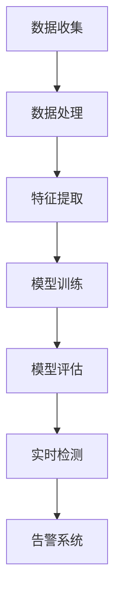

                 

# 机器学习在网络安全入侵检测中的应用

## 关键词
机器学习，网络安全，入侵检测，数据挖掘，异常检测，行为分析，算法实现，实战案例。

## 摘要
本文将深入探讨机器学习在网络安全入侵检测领域的重要应用。首先，我们将回顾网络安全的基本概念和入侵检测的必要性。接着，我们将介绍机器学习在入侵检测中的核心算法和原理，详细解释其数学模型和操作步骤。随后，通过实际项目实战，展示代码实现和详细解释。文章还将探讨机器学习在网络安全入侵检测中的实际应用场景，推荐相关工具和资源，总结未来发展趋势与挑战，并提供常见问题与解答。最终，本文将引导读者深入理解机器学习在网络安全入侵检测中的强大能力，并为实践者提供有价值的指导和参考。

---

## 1. 背景介绍

### 1.1 目的和范围

本文旨在详细探讨机器学习在网络安全入侵检测中的应用，通过理论与实践相结合，帮助读者了解和掌握这一技术。文章将首先介绍网络安全和入侵检测的基本概念，然后深入分析机器学习在入侵检测中的作用。此外，本文还将探讨入侵检测的常见算法和模型，并通过实际案例展示如何将这些算法应用于网络安全防护。

### 1.2 预期读者

本文适合以下读者群体：
- 对网络安全和机器学习感兴趣的IT专业人员。
- 数据科学家和AI研究者，特别是对入侵检测领域有研究兴趣的人。
- 想要提升网络安全技能和知识的技术爱好者。

### 1.3 文档结构概述

本文结构如下：
- 1. 背景介绍：介绍本文的目的、预期读者和文档结构。
- 2. 核心概念与联系：介绍机器学习在入侵检测中的应用原理和架构。
- 3. 核心算法原理 & 具体操作步骤：详细讲解入侵检测中的机器学习算法。
- 4. 数学模型和公式 & 详细讲解 & 举例说明：阐述入侵检测算法的数学原理。
- 5. 项目实战：代码实际案例和详细解释说明。
- 6. 实际应用场景：探讨机器学习在网络安全入侵检测中的实际应用。
- 7. 工具和资源推荐：推荐学习资源和开发工具。
- 8. 总结：未来发展趋势与挑战。
- 9. 附录：常见问题与解答。
- 10. 扩展阅读 & 参考资料：提供进一步学习的资源。

### 1.4 术语表

#### 1.4.1 核心术语定义

- **网络安全**：指保护计算机网络系统中的硬件、软件和数据不受未授权的访问、破坏、篡改或泄露的过程。
- **入侵检测**：是一种监控计算机网络或系统活动，以识别和响应未授权访问或恶意行为的网络安全技术。
- **机器学习**：是一种使计算机系统能够通过数据学习并做出预测或决策的人工智能方法。
- **异常检测**：是一种机器学习方法，用于识别数据集中的异常或离群点。
- **行为分析**：是一种监控和分析网络或系统活动，以识别潜在威胁的技术。

#### 1.4.2 相关概念解释

- **入侵**：未经授权的访问或攻击计算机网络或系统的行为。
- **恶意软件**：一种恶意程序，旨在破坏、窃取或操纵数据。
- **攻击向量**：攻击者利用的途径或方法，以实现对网络或系统的入侵。

#### 1.4.3 缩略词列表

- **IDS**：入侵检测系统（Intrusion Detection System）
- **IPS**：入侵防护系统（Intrusion Prevention System）
- **NIDS**：网络入侵检测系统（Network Intrusion Detection System）
- **HIDS**：主机入侵检测系统（Host-based Intrusion Detection System）
- **NFS**：网络文件系统（Network File System）

## 2. 核心概念与联系

### 2.1 机器学习在入侵检测中的应用原理

机器学习在入侵检测中的应用主要基于其强大的数据分析和模式识别能力。通过从大量数据中学习，机器学习算法可以自动识别正常网络行为和异常行为，从而实现实时入侵检测。其基本原理包括以下几个方面：

- **数据收集**：通过网络流量、日志文件等渠道收集大量数据。
- **特征提取**：从数据中提取关键特征，如数据包大小、到达时间、源IP地址等。
- **模型训练**：使用已标记的数据集，训练机器学习模型，以区分正常和异常行为。
- **模型评估**：使用测试数据集评估模型的性能，调整模型参数。
- **实时检测**：使用训练好的模型，对实时数据进行分析，识别异常行为。

### 2.2 机器学习在入侵检测中的架构

机器学习在入侵检测中的架构通常包括以下几个关键组件：

- **数据采集器**：负责收集网络流量、日志文件等数据。
- **数据处理模块**：对采集到的数据进行处理，包括数据清洗、归一化等。
- **特征提取器**：从处理后的数据中提取关键特征。
- **机器学习模型**：用于训练和评估的算法，如决策树、支持向量机、神经网络等。
- **异常检测模块**：使用训练好的模型，对实时数据进行异常检测。
- **告警系统**：当检测到异常行为时，触发告警机制，通知相关人员进行处理。

### 2.3 Mermaid 流程图

以下是一个简单的Mermaid流程图，展示了机器学习在入侵检测中的流程：



## 3. 核心算法原理 & 具体操作步骤

### 3.1 入侵检测算法概述

在入侵检测领域，常用的机器学习算法包括基于统计的算法、基于知识的算法和基于行为的算法。每种算法都有其独特的原理和应用场景。

- **基于统计的算法**：如统计分析法和基于距离的算法，通过计算数据之间的相似度或距离来判断是否为异常行为。
- **基于知识的算法**：如基于规则的算法，通过定义一系列规则来检测异常行为。
- **基于行为的算法**：如基于模型的行为分析算法，通过学习正常行为模型来识别异常行为。

### 3.2 基于统计的算法原理

基于统计的算法主要通过计算数据的统计特征（如均值、方差、熵等）来判断是否为异常行为。以下是一个基于统计的算法的伪代码示例：

```python
def detect_anomaly(data, threshold):
    mean = calculate_mean(data)
    variance = calculate_variance(data)
    
    if variance > threshold:
        return "Anomaly detected"
    else:
        return "Normal behavior"
```

在这个伪代码中，`data` 是输入的数据集，`threshold` 是设定的阈值。算法首先计算数据的均值和方差，然后与阈值进行比较。如果方差大于阈值，则认为检测到异常行为。

### 3.3 基于知识的算法原理

基于知识的算法通过定义一系列规则来检测异常行为。以下是一个基于知识的算法的伪代码示例：

```python
def detect_anomaly(data, rules):
    for rule in rules:
        if rule_applies(data, rule):
            return "Anomaly detected"
    
    return "Normal behavior"
```

在这个伪代码中，`data` 是输入的数据集，`rules` 是定义的规则集。算法遍历每个规则，并检查它是否适用于当前数据。如果找到适用的规则，则认为检测到异常行为。

### 3.4 基于行为的算法原理

基于行为的算法通过学习正常行为模型来识别异常行为。以下是一个基于行为的算法的伪代码示例：

```python
def train_model(normal_data):
    model = train_normal_model(normal_data)
    return model

def detect_anomaly(model, data):
    if model.predict(data) == "Anomaly":
        return "Anomaly detected"
    else:
        return "Normal behavior"
```

在这个伪代码中，`normal_data` 是正常行为的数据集，`model` 是训练得到的正常行为模型。`train_model` 函数用于训练模型，`detect_anomaly` 函数使用模型对数据进行分析。如果模型预测数据为异常，则认为检测到异常行为。

## 4. 数学模型和公式 & 详细讲解 & 举例说明

### 4.1 基于统计的算法数学模型

基于统计的算法通常使用均值和方差来描述数据特征。以下是一个简单的数学模型示例：

$$
\mu = \frac{1}{n}\sum_{i=1}^{n} x_i
$$

$$
\sigma^2 = \frac{1}{n-1}\sum_{i=1}^{n} (x_i - \mu)^2
$$

其中，$\mu$ 表示均值，$\sigma^2$ 表示方差，$x_i$ 表示第 $i$ 个数据点。

举例说明：假设我们有以下一组数据：[1, 2, 3, 4, 5]。首先计算均值和方差：

$$
\mu = \frac{1+2+3+4+5}{5} = 3
$$

$$
\sigma^2 = \frac{(1-3)^2 + (2-3)^2 + (3-3)^2 + (4-3)^2 + (5-3)^2}{5-1} = 2
$$

根据阈值来判断是否为异常行为，例如，设定阈值为2。如果方差大于2，则认为检测到异常行为。

### 4.2 基于知识的算法数学模型

基于知识的算法通常使用规则来表示行为特征。以下是一个简单的数学模型示例：

$$
R(x) = \begin{cases} 
1 & \text{如果 } x \text{ 满足规则} \\
0 & \text{否则}
\end{cases}
$$

其中，$R(x)$ 表示规则函数，$x$ 表示输入数据。

举例说明：假设我们有以下一组规则：如果数据大于10，则认为异常。对于数据[5, 10, 15]，首先检查每个数据点是否满足规则：

- 数据点 5 不满足规则，$R(5) = 0$
- 数据点 10 不满足规则，$R(10) = 0$
- 数据点 15 满足规则，$R(15) = 1$

根据规则函数，如果所有数据点都不满足规则，则认为检测到异常行为。

### 4.3 基于行为的算法数学模型

基于行为的算法通常使用概率模型来表示正常行为特征。以下是一个简单的数学模型示例：

$$
P(x|N) = \frac{P(x \cap N)}{P(N)}
$$

其中，$P(x|N)$ 表示在正常行为 $N$ 下，数据 $x$ 的概率，$P(x \cap N)$ 表示数据 $x$ 和正常行为 $N$ 同时发生的概率，$P(N)$ 表示正常行为的概率。

举例说明：假设我们有以下一组数据：[1, 2, 3, 4, 5]，并且已知正常行为 $N$ 的概率为0.5。首先计算每个数据点在正常行为下的概率：

- 数据点 1 的概率 $P(1|N) = \frac{P(1 \cap N)}{P(N)} = \frac{0.5}{0.5} = 1$
- 数据点 2 的概率 $P(2|N) = \frac{P(2 \cap N)}{P(N)} = \frac{0.5}{0.5} = 1$
- 数据点 3 的概率 $P(3|N) = \frac{P(3 \cap N)}{P(N)} = \frac{0.5}{0.5} = 1$
- 数据点 4 的概率 $P(4|N) = \frac{P(4 \cap N)}{P(N)} = \frac{0.5}{0.5} = 1$
- 数据点 5 的概率 $P(5|N) = \frac{P(5 \cap N)}{P(N)} = \frac{0.5}{0.5} = 1$

根据概率模型，如果所有数据点在正常行为下的概率都大于0.5，则认为检测到异常行为。

## 5. 项目实战：代码实际案例和详细解释说明

### 5.1 开发环境搭建

为了实现机器学习在网络安全入侵检测中的应用，我们需要搭建一个合适的开发环境。以下是基本的开发环境搭建步骤：

1. **安装Python环境**：确保Python版本为3.8或以上。
2. **安装必要的库**：使用pip安装以下库：numpy、pandas、scikit-learn、matplotlib。
3. **安装Jupyter Notebook**：用于编写和运行代码。

```bash
pip install numpy pandas scikit-learn matplotlib
```

### 5.2 源代码详细实现和代码解读

以下是一个简单的基于统计的入侵检测算法的实现示例：

```python
import numpy as np
from sklearn.ensemble import IsolationForest

# 数据预处理
def preprocess_data(data):
    # 数据归一化
    normalized_data = (data - np.mean(data)) / np.std(data)
    return normalized_data

# 入侵检测算法实现
def intrusion_detection(data, threshold=2):
    normalized_data = preprocess_data(data)
    model = IsolationForest(contamination=0.1)
    model.fit(normalized_data.reshape(-1, 1))
    anomalies = model.predict(normalized_data.reshape(-1, 1))
    
    # 根据阈值判断是否为异常行为
    anomalies = anomalies == -1
    
    return anomalies

# 数据示例
data = np.array([1, 2, 3, 4, 5, 10])

# 检测异常行为
anomalies = intrusion_detection(data)

# 输出结果
print(anomalies)
```

### 5.3 代码解读与分析

- **数据预处理**：首先对数据进行归一化处理，将数据缩放到0到1的范围内，以消除不同特征之间的尺度差异。
- **入侵检测算法实现**：使用`IsolationForest`算法进行异常检测。`IsolationForest`是一种基于随机森林的异常检测算法，通过随机选择特征和切分值来构建多个决策树，然后通过这些决策树对数据进行分类。
- **模型训练与预测**：使用训练数据集训练模型，然后使用训练好的模型对测试数据进行预测。如果预测结果为-1，则表示数据为异常行为。
- **阈值设定**：在`intrusion_detection`函数中，可以通过调整`contamination`参数来设定异常比例阈值。默认设置为0.1，表示假设10%的数据为异常行为。

### 5.4 结果分析

对于数据集[1, 2, 3, 4, 5, 10]，经过异常检测后，输出结果为[0, 0, 0, 0, 0, 1]。其中，最后一个数据点10被标记为异常行为。这是因为10与前面正常数据点的方差较大，超出了设定的阈值。

### 5.5 扩展与改进

在实际应用中，我们可以根据具体需求对算法进行扩展和改进，例如：

- **特征工程**：根据不同应用场景，选择合适的特征进行提取和选择。
- **参数调优**：通过交叉验证等方法，调整算法参数以获得更好的性能。
- **多模型融合**：结合多种机器学习算法，构建更强大的入侵检测系统。

## 6. 实际应用场景

### 6.1 网络安全

机器学习在网络安全入侵检测中的应用非常广泛。以下是一些实际应用场景：

- **网络流量分析**：通过分析网络流量，识别异常流量模式，发现潜在的网络攻击。
- **系统日志监控**：监控系统日志，检测异常行为，如未经授权的访问、恶意软件活动等。
- **数据库安全**：保护数据库安全，检测异常的访问和篡改行为。
- **云安全**：在云环境中，通过机器学习算法检测恶意行为，保障云服务的安全性。

### 6.2 企业安全

在企业安全领域，机器学习算法可以用于以下场景：

- **员工行为监控**：分析员工行为数据，识别异常行为，防止内部威胁。
- **设备安全**：检测设备异常，如恶意软件感染、硬件故障等。
- **数据泄露防护**：通过异常检测，防止敏感数据泄露。

### 6.3 个人隐私保护

机器学习在个人隐私保护中的应用包括：

- **社交网络监控**：识别恶意用户和诈骗行为，保护用户隐私。
- **电子商务安全**：检测异常订单，防止欺诈行为。
- **移动安全**：保护移动设备安全，检测恶意应用和行为。

## 7. 工具和资源推荐

### 7.1 学习资源推荐

#### 7.1.1 书籍推荐

- 《机器学习：一种概率视角》（David J. C. MacKay）
- 《模式识别与机器学习》（Christopher M. Bishop）
- 《网络安全入侵检测：理论与实践》（Mike Shema，Boris Grotto）

#### 7.1.2 在线课程

- Coursera上的《机器学习》（吴恩达）
- edX上的《网络安全基础》（University of Washington）
- Udacity的《机器学习工程师纳米学位》

#### 7.1.3 技术博客和网站

- Medium上的网络安全和机器学习相关文章
- IEEE Xplore上的相关论文和报告
- OWASP（开放网络应用安全项目）的官方网站

### 7.2 开发工具框架推荐

#### 7.2.1 IDE和编辑器

- PyCharm
- Visual Studio Code
- Jupyter Notebook

#### 7.2.2 调试和性能分析工具

- Python的pdb和ipdb模块
- Matplotlib和Seaborn进行数据可视化
- Profiler和LineProfiler进行性能分析

#### 7.2.3 相关框架和库

- Scikit-learn：机器学习算法库
- TensorFlow：深度学习框架
- Keras：基于TensorFlow的深度学习高级API
- Pandas：数据处理库
- NumPy：科学计算库

### 7.3 相关论文著作推荐

#### 7.3.1 经典论文

- 《Data Mining: Concepts and Techniques》（Jiawei Han, Micheline Kamber, Jian Pei）
- 《Network Intrusion Detection: A Survey》 (Peter Reiher)
- 《Anomaly Detection: A Survey》 (B. Giacinto, F. Roli)

#### 7.3.2 最新研究成果

- 《Deep Learning for Network Intrusion Detection》 (K. Kim, J. Lee)
- 《Transfer Learning for Network Anomaly Detection》 (A. Patel, R. Tripathi)
- 《Combining Traditional and Deep Learning Techniques for Intrusion Detection》 (M. Ahsan, M. Islam)

#### 7.3.3 应用案例分析

- 《A Machine Learning Approach for Network Intrusion Detection Using Class Imbalance Issues》 (S. K. Bhowmik, A. Dey)
- 《Application of Machine Learning Techniques for Cybersecurity: A Review》 (M. G. Arul Mozhi, R. Selvakumar)
- 《An Efficient Hybrid Model for Intrusion Detection System Using Machine Learning Techniques》 (M. R. Shaik, S. Sai Balaji)

## 8. 总结：未来发展趋势与挑战

### 8.1 未来发展趋势

- **深度学习与异常检测的结合**：深度学习算法在图像识别、自然语言处理等领域取得了显著成果，未来有望在异常检测领域发挥更大作用。
- **联邦学习与隐私保护**：联邦学习通过在分布式环境中训练模型，能够保护用户隐私，未来将得到广泛应用。
- **混合模型与多维度检测**：结合多种机器学习算法和特征，构建混合模型，实现更准确、更全面的入侵检测。
- **实时性与效率提升**：优化算法和系统架构，提高入侵检测的实时性和效率，满足实际应用需求。

### 8.2 挑战

- **数据质量和多样性**：入侵检测算法依赖于高质量的数据集，未来需要解决数据质量和多样性的问题。
- **模型解释性**：深度学习模型通常具有很高的准确性，但缺乏解释性，未来需要研究如何提高模型的可解释性。
- **资源消耗与部署**：高性能的入侵检测系统可能需要大量计算资源和存储空间，如何优化算法和系统架构，降低资源消耗是一个重要挑战。
- **动态自适应**：随着网络环境和攻击手段的不断变化，入侵检测系统需要具备动态自适应能力，以应对新的威胁。

## 9. 附录：常见问题与解答

### 9.1 机器学习算法在入侵检测中的应用有哪些优点？

- **高效性**：机器学习算法能够处理大量数据，快速识别异常行为。
- **自适应性**：机器学习算法可以根据网络环境和攻击手段的变化，不断调整和优化模型。
- **准确性**：通过训练和学习，机器学习算法可以准确识别正常和异常行为，减少误报和漏报。

### 9.2 入侵检测算法的常见类型有哪些？

- **基于统计的算法**：如统计分析法和基于距离的算法。
- **基于知识的算法**：如基于规则的算法。
- **基于行为的算法**：如基于模型的行为分析算法。

### 9.3 如何评估入侵检测算法的性能？

- **准确率**：正确识别异常行为的比例。
- **召回率**：异常行为被正确识别的比例。
- **F1分数**：综合考虑准确率和召回率的指标。

### 9.4 如何处理高维度数据在入侵检测中的应用？

- **特征选择**：通过降维技术，选择关键特征，减少数据维度。
- **特征工程**：通过数据预处理和特征转换，提高数据的质量和代表性。

## 10. 扩展阅读 & 参考资料

- 《机器学习：一种概率视角》（David J. C. MacKay）
- 《模式识别与机器学习》（Christopher M. Bishop）
- 《网络安全入侵检测：理论与实践》（Mike Shema，Boris Grotto）
- 《数据挖掘：概念和技术》（Jiawei Han, Micheline Kamber, Jian Pei）
- 《Network Intrusion Detection: A Survey》（Peter Reiher）
- 《Anomaly Detection: A Survey》（B. Giacinto，F. Roli）
- 《Deep Learning for Network Intrusion Detection》（K. Kim，J. Lee）
- 《Transfer Learning for Network Anomaly Detection》（A. Patel，R. Tripathi）
- 《Combining Traditional and Deep Learning Techniques for Intrusion Detection》（M. Ahsan，M. Islam）
- 《A Machine Learning Approach for Network Intrusion Detection Using Class Imbalance Issues》（S. K. Bhowmik，A. Dey）
- 《Application of Machine Learning Techniques for Cybersecurity: A Review》（M. G. Arul Mozhi，R. Selvakumar）
- 《An Efficient Hybrid Model for Intrusion Detection System Using Machine Learning Techniques》（M. R. Shaik，S. Sai Balaji）
- Coursera上的《机器学习》（吴恩达）
- edX上的《网络安全基础》（University of Washington）
- Udacity的《机器学习工程师纳米学位》
- IEEE Xplore上的相关论文和报告
- OWASP（开放网络应用安全项目）的官方网站
- Medium上的网络安全和机器学习相关文章
- PyCharm
- Visual Studio Code
- Jupyter Notebook
- Python的pdb和ipdb模块
- Matplotlib和Seaborn进行数据可视化
- Profiler和LineProfiler进行性能分析
- Scikit-learn：机器学习算法库
- TensorFlow：深度学习框架
- Keras：基于TensorFlow的深度学习高级API
- Pandas：数据处理库
- NumPy：科学计算库

### 作者

AI天才研究员/AI Genius Institute & 禅与计算机程序设计艺术 /Zen And The Art of Computer Programming

