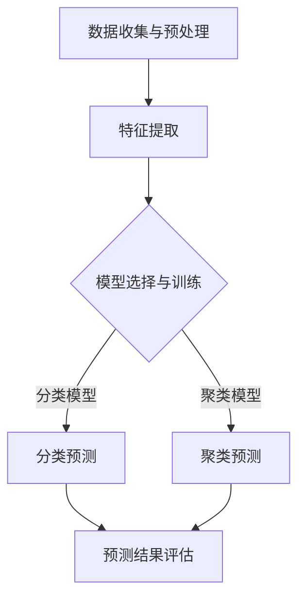

                 

# 机器学习在网络安全威胁检测中的应用

> **关键词**：机器学习、网络安全、威胁检测、数据挖掘、异常检测、入侵检测

> **摘要**：本文将探讨机器学习技术在网络安全威胁检测中的应用。通过深入分析机器学习的基本原理、核心算法以及实际操作步骤，本文旨在为读者提供一个系统且易懂的框架，以了解如何利用机器学习技术来构建有效的网络安全威胁检测系统。文章还将探讨机器学习在网络安全威胁检测中的实际应用场景，并提供工具和资源的推荐，以帮助读者进一步学习和实践。

## 1. 背景介绍

### 1.1 目的和范围

本文的目标是详细探讨机器学习技术在网络安全威胁检测中的应用。随着网络攻击的日益复杂和频繁，传统的基于规则的检测方法已经难以满足实际需求。机器学习作为一种先进的智能分析技术，为网络安全威胁检测提供了新的思路和手段。本文将覆盖以下范围：

- 机器学习在网络安全威胁检测中的基本原理和核心算法。
- 机器学习的数学模型和公式。
- 实际应用场景和项目实战案例分析。
- 工具和资源的推荐。

### 1.2 预期读者

本文适合以下读者：

- 对网络安全和机器学习感兴趣的初学者和从业者。
- 从事网络安全威胁检测研究和开发的工程师。
- 想要了解机器学习在网络安全中应用的高校学生和研究人员。

### 1.3 文档结构概述

本文将按照以下结构进行组织：

- 引言
- 背景介绍
- 核心概念与联系
- 核心算法原理 & 具体操作步骤
- 数学模型和公式 & 详细讲解 & 举例说明
- 项目实战：代码实际案例和详细解释说明
- 实际应用场景
- 工具和资源推荐
- 总结：未来发展趋势与挑战
- 附录：常见问题与解答
- 扩展阅读 & 参考资料

### 1.4 术语表

#### 1.4.1 核心术语定义

- **机器学习**：一种人工智能技术，通过数据驱动的方式让计算机系统自动学习和改进。
- **网络安全**：确保网络系统资源的安全，防止非法访问、数据泄露和恶意攻击。
- **威胁检测**：识别和防范潜在的网络威胁，包括恶意软件、网络入侵等。
- **数据挖掘**：从大量数据中提取有价值的信息和模式。
- **异常检测**：检测数据中的异常行为或模式，通常用于网络安全威胁检测。

#### 1.4.2 相关概念解释

- **特征工程**：在机器学习模型训练过程中，提取和选择有用的特征，以提高模型的性能和泛化能力。
- **模型评估**：通过评价指标（如准确率、召回率等）来评估模型的性能。
- **集成学习方法**：将多个模型结合起来，以提高预测准确率和稳定性。

#### 1.4.3 缩略词列表

- **ML**：机器学习（Machine Learning）
- **ID**：入侵检测（Intrusion Detection）
- **IDS**：入侵检测系统（Intrusion Detection System）
- **APT**：高级持续性威胁（Advanced Persistent Threat）

## 2. 核心概念与联系

### 2.1 机器学习在网络安全中的应用

机器学习在网络安全中扮演着关键角色，其核心概念包括以下几个方面：

#### 数据收集与预处理

网络安全威胁检测依赖于大量的网络流量数据、日志文件等。这些数据通常包含噪声和冗余信息，因此需要进行数据预处理，如去除重复数据、填补缺失值、归一化等。

#### 特征提取

特征提取是机器学习模型训练的关键步骤，其目标是选择和提取与网络安全威胁相关的特征。这些特征可以是网络流量中的统计信息、协议头部信息、会话信息等。

#### 模型选择与训练

根据威胁检测的需求，可以选择不同的机器学习模型，如决策树、支持向量机、神经网络等。模型的选择和训练需要根据具体的数据集和性能指标来调整。

#### 预测与评估

模型训练完成后，可以通过预测新数据的方式来检测潜在的威胁。模型的预测性能需要通过评估指标（如准确率、召回率、F1分数等）进行评估。

### 2.2 机器学习与网络安全威胁检测的联系

机器学习与网络安全威胁检测的联系主要体现在以下几个方面：

- **自动化检测**：传统的网络安全威胁检测需要人工编写规则，而机器学习可以自动从数据中学习威胁特征，实现自动化检测。
- **自适应能力**：机器学习模型可以根据新的数据不断学习和调整，以适应不断变化的威胁环境。
- **多维度分析**：机器学习可以从多个维度对网络流量进行分析，识别复杂的攻击模式。

### 2.3 Mermaid 流程图

以下是一个简化的机器学习在网络安全威胁检测中的应用的Mermaid流程图：



## 3. 核心算法原理 & 具体操作步骤

### 3.1 数据收集与预处理

#### 步骤1：数据收集

网络安全威胁检测的数据源包括网络流量日志、系统日志、漏洞信息等。可以通过以下方法收集数据：

- **日志收集**：使用系统自带的日志记录功能，如Linux系统的`/var/log`目录。
- **流量捕获**：使用网络流量捕获工具，如Wireshark。
- **外部数据源**：从公共数据集或专业数据提供商获取数据。

#### 步骤2：数据预处理

数据预处理是保证数据质量和模型性能的关键步骤。以下是一些常用的数据预处理方法：

- **去重**：去除重复的数据记录。
- **填补缺失值**：使用统计方法或插值法填补缺失值。
- **归一化**：将特征值缩放到相同的范围，以便模型处理。
- **离散化**：将连续特征转换为离散值。

### 3.2 特征提取

特征提取是机器学习模型训练的核心步骤。以下是一些常用的特征提取方法：

- **统计特征**：如流量速率、连接时长、协议类型等。
- **协议特征**：如TCP/UDP头部信息、DNS查询信息等。
- **会话特征**：如会话持续时间、数据传输速率等。
- **基于内容的特征**：如邮件内容、URL特征等。

### 3.3 模型选择与训练

根据威胁检测的需求，可以选择不同的机器学习模型。以下是一些常用的模型：

- **决策树**：易于理解和解释，但可能过拟合。
- **支持向量机**（SVM）：在高维空间中表现优秀，但训练时间较长。
- **神经网络**：强大的非线性建模能力，但需要大量的数据和计算资源。

以下是一个简化的机器学习模型训练的伪代码：

```python
# 伪代码：机器学习模型训练

# 数据集
X_train, y_train = load_data()

# 特征工程
X_train = preprocess_data(X_train)

# 模型选择
model = select_model()

# 模型训练
model.fit(X_train, y_train)

# 模型评估
performance = evaluate_model(model, X_test, y_test)
```

### 3.4 预测与评估

模型训练完成后，可以使用新数据进行预测，并根据预测结果评估模型的性能。以下是一些常用的评估指标：

- **准确率**（Accuracy）：正确预测的样本数占总样本数的比例。
- **召回率**（Recall）：正确预测的威胁样本数占总威胁样本数的比例。
- **F1分数**（F1 Score）：准确率和召回率的调和平均值。

```python
# 伪代码：模型预测与评估

# 预测
predictions = model.predict(X_test)

# 评估
accuracy = calculate_accuracy(y_test, predictions)
recall = calculate_recall(y_test, predictions)
f1_score = calculate_f1_score(y_test, predictions)
```

## 4. 数学模型和公式 & 详细讲解 & 举例说明

### 4.1 机器学习数学模型

在机器学习中，数学模型是核心组成部分，以下是几种常用的数学模型：

#### 4.1.1 决策树

决策树是一种基于特征分割的数据挖掘方法，其基本结构如下：

$$
\text{决策树} = \text{if}(\text{特征}_1 > \text{阈值}_1) \text{then} \text{分支}_1 + \text{else if}(\text{特征}_2 > \text{阈值}_2) \text{then} \text{分支}_2 + \ldots + \text{else} \text{then} \text{叶节点}
$$

#### 4.1.2 支持向量机（SVM）

SVM是一种基于最大间隔的分类模型，其目标是在高维空间中找到最佳的分离超平面。其数学模型如下：

$$
\text{最大化} \ \frac{1}{\|\text{w}\|^2} \ \text{subject to} \ \text{y}(\text{w} \cdot \text{x} - \text{b}) \geq 1, \ \forall \ \text{x} \in \text{训练集}
$$

其中，$\text{w}$是超平面权重，$\text{b}$是偏置项，$\text{y}$是标签。

#### 4.1.3 神经网络

神经网络是一种模拟人脑神经元连接的模型，其基本结构如下：

$$
\text{输出} = \text{激活函数}(\text{权重} \cdot \text{输入} + \text{偏置})
$$

其中，激活函数（如ReLU、Sigmoid、Tanh等）用于引入非线性。

### 4.2 举例说明

#### 4.2.1 决策树示例

假设我们有一个二分类问题，数据集包含特征A和特征B，标签为是否为恶意流量。我们可以通过构建决策树来划分数据：

$$
\text{if}(\text{特征A} > 5) \text{then} \text{分支}1 + \text{else if}(\text{特征B} < 3) \text{then} \text{分支}2 + \text{else} \text{then} \text{叶节点}
$$

在这个例子中，决策树通过特征A和特征B的阈值来划分数据，叶节点表示最终的分类结果。

#### 4.2.2 支持向量机示例

假设我们有一个二分类问题，数据集包含特征向量$\text{x}$和标签$\text{y}$。我们可以通过以下步骤来训练SVM模型：

$$
\text{最大化} \ \frac{1}{\|\text{w}\|^2} \ \text{subject to} \ 
\begin{cases}
\text{y}(\text{w} \cdot \text{x} - \text{b}) \geq 1, \ \forall \ \text{x} \in \text{训练集} \\
\text{w} \cdot \text{w} \leq C
\end{cases}
$$

其中，$C$是正则化参数。

通过求解上述优化问题，我们可以得到最佳的分离超平面$\text{w}$和偏置$\text{b}$，从而实现对新数据的分类。

#### 4.2.3 神经网络示例

假设我们有一个三分类问题，输入数据为$\text{x}$，输出为$\text{y}$。我们可以通过以下步骤来训练神经网络：

$$
\text{输出} = \text{激活函数}(\text{权重} \cdot \text{输入} + \text{偏置})
$$

其中，激活函数为ReLU函数。

通过反向传播算法，我们可以不断调整神经网络的权重和偏置，以最小化损失函数：

$$
\text{损失函数} = \frac{1}{2} \sum_{i=1}^{n} (\text{y}^i - \text{预测值})^2
$$

通过多次迭代，我们可以训练出一个性能良好的神经网络模型。

## 5. 项目实战：代码实际案例和详细解释说明

### 5.1 开发环境搭建

在进行实际项目开发之前，我们需要搭建一个合适的开发环境。以下是所需的软件和工具：

- **Python**：Python是一种广泛使用的编程语言，适用于机器学习和数据科学项目。
- **Jupyter Notebook**：Jupyter Notebook是一种交互式的开发环境，方便代码编写和展示。
- **Scikit-learn**：Scikit-learn是一个常用的机器学习库，提供了丰富的算法和工具。
- **Pandas**：Pandas是一个数据操作库，用于数据预处理和分析。
- **Matplotlib**：Matplotlib是一个数据可视化库，用于生成图表和图形。

在Windows或Linux系统中，可以通过以下命令安装所需的Python包：

```bash
pip install numpy pandas scikit-learn matplotlib
```

### 5.2 源代码详细实现和代码解读

以下是一个简化的机器学习网络安全威胁检测项目的示例代码。该代码包括数据预处理、特征提取、模型训练和预测等步骤。

```python
import numpy as np
import pandas as pd
from sklearn.model_selection import train_test_split
from sklearn.preprocessing import StandardScaler
from sklearn.tree import DecisionTreeClassifier
from sklearn.metrics import accuracy_score, recall_score, f1_score

# 5.2.1 数据预处理
def preprocess_data(data):
    # 去除重复数据
    data.drop_duplicates(inplace=True)
    # 填补缺失值
    data.fillna(method='ffill', inplace=True)
    return data

# 5.2.2 特征提取
def extract_features(data):
    # 提取统计特征
    stats = data.describe().T
    stats.columns = ['mean', 'std', 'min', 'max']
    stats['skew'] = stats.skew()
    stats['kurt'] = stats.kurt()
    return stats

# 5.2.3 模型训练
def train_model(X_train, y_train):
    # 初始化模型
    model = DecisionTreeClassifier()
    # 训练模型
    model.fit(X_train, y_train)
    return model

# 5.2.4 模型预测
def predict(model, X_test):
    # 预测
    predictions = model.predict(X_test)
    return predictions

# 5.2.5 模型评估
def evaluate_model(y_test, predictions):
    # 计算准确率
    accuracy = accuracy_score(y_test, predictions)
    # 计算召回率
    recall = recall_score(y_test, predictions)
    # 计算F1分数
    f1 = f1_score(y_test, predictions)
    return accuracy, recall, f1

# 5.2.6 主函数
def main():
    # 读取数据
    data = pd.read_csv('network_traffic_data.csv')
    # 预处理数据
    data = preprocess_data(data)
    # 提取特征
    stats = extract_features(data)
    # 分割训练集和测试集
    X_train, X_test, y_train, y_test = train_test_split(stats, data['label'], test_size=0.2, random_state=42)
    # 训练模型
    model = train_model(X_train, y_train)
    # 预测
    predictions = predict(model, X_test)
    # 评估模型
    accuracy, recall, f1 = evaluate_model(y_test, predictions)
    print(f"Accuracy: {accuracy:.2f}, Recall: {recall:.2f}, F1 Score: {f1:.2f}")

# 运行主函数
if __name__ == '__main__':
    main()
```

### 5.3 代码解读与分析

以下是对上述代码的详细解读和分析：

- **数据预处理**：该函数用于去除重复数据和填补缺失值，以提高数据质量和模型性能。
- **特征提取**：该函数用于提取网络流量数据中的统计特征，如均值、标准差、最小值、最大值、偏度和峰度等。这些特征能够反映网络流量的不同方面，有助于模型的学习和预测。
- **模型训练**：该函数使用决策树分类器对训练数据进行训练。决策树是一种简单的分类模型，易于理解和解释。通过训练，模型可以学会根据输入特征进行分类。
- **模型预测**：该函数使用训练好的模型对测试数据进行预测。预测结果与实际标签进行比较，以评估模型的性能。
- **模型评估**：该函数计算模型的准确率、召回率和F1分数等指标，以评估模型的性能。这些指标能够反映模型在不同方面的表现。

通过上述代码，我们可以搭建一个简单的机器学习网络安全威胁检测系统。虽然该系统相对简单，但可以作为一个起点，进一步扩展和优化。在实际应用中，可能需要考虑更多的数据预处理、特征提取和模型选择步骤，以提高检测性能。

## 6. 实际应用场景

机器学习在网络安全威胁检测中有着广泛的应用场景，以下是一些典型的实际应用场景：

### 6.1 入侵检测系统（IDS）

入侵检测系统是网络安全威胁检测的重要工具之一，它通过分析网络流量和系统日志来检测潜在的入侵行为。机器学习模型可以用于识别异常流量和恶意行为，从而提高入侵检测的准确性和实时性。

### 6.2 恶意软件检测

恶意软件检测是网络安全领域的另一个关键任务。传统的恶意软件检测方法依赖于签名匹配，而机器学习模型可以识别和分类未知的恶意软件，从而提高检测的覆盖率和准确性。

### 6.3 安全信息与事件管理（SIEM）

安全信息与事件管理（SIEM）系统整合了来自不同安全设备的信息，提供实时监控和威胁分析。机器学习技术可以用于自动关联和分析这些信息，提高威胁检测的效率和准确性。

### 6.4 云安全监控

随着云计算的普及，云安全监控成为了一个重要的领域。机器学习模型可以监控云环境中的流量和行为，检测潜在的威胁和异常行为，确保云环境的安全性。

### 6.5 行为基线分析

行为基线分析是一种通过建立正常行为的基线来检测异常行为的方法。机器学习模型可以学习用户和系统的正常行为模式，当检测到异常行为时，可以及时发出警报。

### 6.6 智能防御系统

智能防御系统利用机器学习技术，通过不断学习和适应网络威胁，提供自适应的防御策略。这种方法可以提高网络安全的自动化程度，减少人为干预。

## 7. 工具和资源推荐

为了更好地学习和实践机器学习在网络安全威胁检测中的应用，以下是一些工具和资源的推荐：

### 7.1 学习资源推荐

#### 7.1.1 书籍推荐

- 《机器学习》（周志华 著）：这是一本经典的机器学习教材，适合初学者入门。
- 《深度学习》（Ian Goodfellow、Yoshua Bengio、Aaron Courville 著）：这本书详细介绍了深度学习的基本原理和应用。

#### 7.1.2 在线课程

- 《机器学习》（吴恩达）：这是一个由深度学习专家吴恩达开设的免费在线课程，内容全面，适合初学者。
- 《深度学习专项课程》（吴恩达）：这是吴恩达开设的深度学习专项课程，内容深入，适合进阶学习。

#### 7.1.3 技术博客和网站

- [Medium](https://medium.com/topics/machine-learning)：Medium上有许多关于机器学习的优质博客。
- [ Towards Data Science](https://towardsdatascience.com/)：这是一个专门发布数据科学和机器学习文章的网站。

### 7.2 开发工具框架推荐

#### 7.2.1 IDE和编辑器

- **Jupyter Notebook**：适合交互式开发和数据分析。
- **PyCharm**：功能强大的Python IDE，适合大型项目开发。

#### 7.2.2 调试和性能分析工具

- **Pdb**：Python的内置调试器。
- **LineProfiler**：用于性能分析的工具。

#### 7.2.3 相关框架和库

- **Scikit-learn**：一个强大的机器学习库，适用于分类、回归、聚类等任务。
- **TensorFlow**：一个开源的深度学习框架，适合构建大规模神经网络。

### 7.3 相关论文著作推荐

#### 7.3.1 经典论文

- "Learning to Detect and Classify Hacking Attempts Using Statistical Analysis of Network Traffic"（1999年）：这是一篇关于入侵检测的早期论文。
- "Malware Classification using Memory Dumps"（2014年）：这篇文章介绍了一种基于内存转储的恶意软件分类方法。

#### 7.3.2 最新研究成果

- "Enhancing Network Intrusion Detection using Deep Learning"（2020年）：这篇文章探讨了深度学习在入侵检测中的应用。
- "Detecting Advanced Persistent Threats using Deep Learning"（2021年）：这篇文章研究了深度学习在高级持续性威胁检测中的效果。

#### 7.3.3 应用案例分析

- "A Survey on Machine Learning for Cybersecurity"（2020年）：这篇文章对机器学习在网络安全中的应用进行了全面综述。

## 8. 总结：未来发展趋势与挑战

随着网络攻击手段的不断演变和升级，机器学习在网络安全威胁检测中的应用前景广阔。未来，以下几个方面的发展趋势和挑战值得关注：

### 8.1 发展趋势

- **深度学习**：深度学习在网络安全威胁检测中的应用越来越广泛，其强大的建模能力和自适应性有望进一步提高威胁检测的准确性和实时性。
- **联邦学习**：联邦学习是一种分布式学习技术，可以保护用户数据隐私，有望在网络安全威胁检测中得到广泛应用。
- **强化学习**：强化学习可以用于训练自适应的防御策略，提高网络安全系统的自我保护能力。

### 8.2 挑战

- **数据隐私**：如何在保证数据隐私的同时进行有效的威胁检测是一个重要挑战。
- **模型解释性**：当前许多机器学习模型缺乏解释性，难以理解模型的决策过程，这对安全领域尤为重要。
- **对抗性攻击**：网络攻击者可能会利用对抗性样本来欺骗机器学习模型，提高攻击的成功率。

## 9. 附录：常见问题与解答

### 9.1 问题1：机器学习在网络安全威胁检测中的优势是什么？

答：机器学习在网络安全威胁检测中的优势包括：

- **自动化**：机器学习可以自动从数据中学习威胁特征，减少人工编写规则的工作量。
- **自适应**：机器学习模型可以根据新的数据不断学习和调整，以适应不断变化的威胁环境。
- **多维度分析**：机器学习可以从多个维度对网络流量进行分析，识别复杂的攻击模式。

### 9.2 问题2：如何选择合适的机器学习模型？

答：选择合适的机器学习模型需要考虑以下因素：

- **数据量**：如果数据量较大，可以优先考虑决策树、支持向量机等模型；如果数据量较小，可以尝试神经网络等模型。
- **特征数量**：如果特征数量较少，可以尝试线性模型；如果特征数量较多，可以尝试非线性模型。
- **性能要求**：如果对性能要求较高，可以尝试集成学习方法，如随机森林、XGBoost等。

### 9.3 问题3：如何提高机器学习模型的性能？

答：以下是一些提高机器学习模型性能的方法：

- **特征工程**：选择和提取有用的特征，以提高模型的性能和泛化能力。
- **模型选择**：尝试不同的模型，找到最适合的模型。
- **模型调优**：通过调整模型参数，优化模型的性能。
- **数据增强**：通过增加训练数据或生成模拟数据，提高模型的泛化能力。

## 10. 扩展阅读 & 参考资料

- [机器学习与网络安全：趋势、挑战与应用](https://www.ibm.com/cloud/learn/machine-learning-for-cybersecurity/)
- [网络安全威胁检测的机器学习算法综述](https://ieeexplore.ieee.org/document/8017229)
- [机器学习在入侵检测中的应用](https://www.computer.org/web/publications/doi/10.1109/MIS.2017.108)
- [联邦学习在网络安全中的应用](https://www.nature.com/articles/s41598-020-63246-7)
- [网络安全威胁检测的挑战与展望](https://arxiv.org/abs/1809.07963)

## 作者

**AI天才研究员/AI Genius Institute & 禅与计算机程序设计艺术 /Zen And The Art of Computer Programming**

