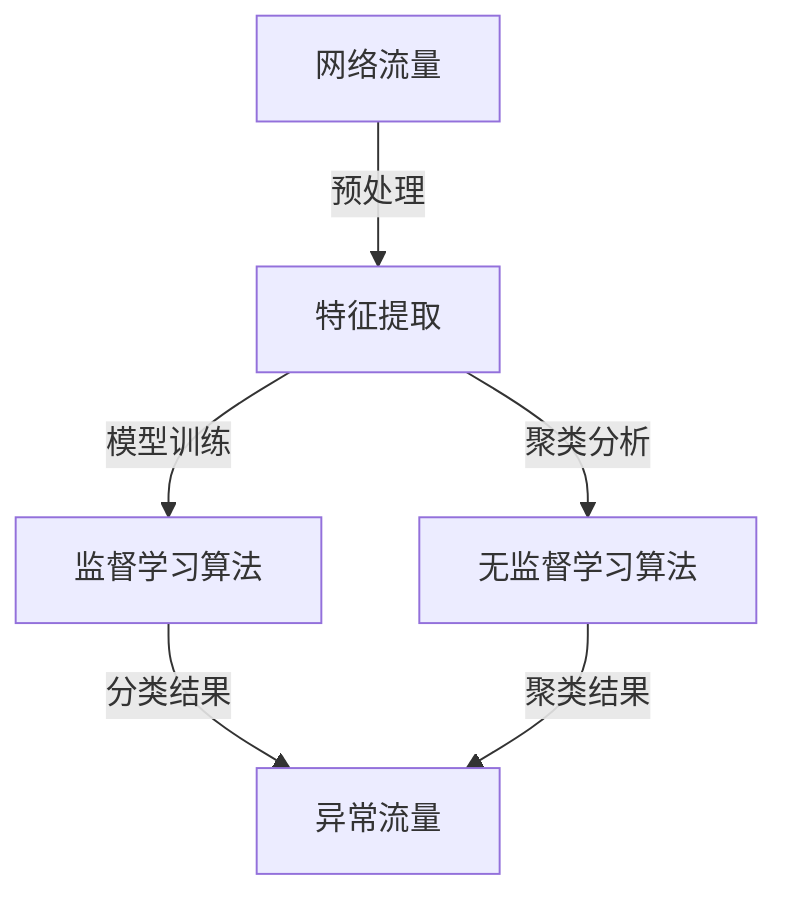

                 

### 1. 背景介绍

#### 1.1 目的和范围

本文旨在探讨机器学习在网络流量异常检测中的应用，通过介绍相关算法原理、数学模型和实际案例，帮助读者理解并掌握这一领域的基本知识和实践方法。网络流量异常检测是网络安全领域的重要研究方向，对于预防和应对网络攻击、提高网络系统的安全性具有重要意义。随着网络规模的不断扩大和复杂度的增加，传统的基于规则和统计的方法已经难以满足实际需求，而机器学习算法凭借其强大的数据处理和分析能力，正逐渐成为解决这一问题的关键技术。

本文将首先介绍网络流量异常检测的背景和重要性，然后详细阐述核心概念、算法原理和具体操作步骤，并通过实际案例展示如何运用机器学习技术进行网络流量异常检测。此外，还将探讨这一技术的实际应用场景，并提供相关工具和资源的推荐，以便读者进一步学习和实践。

通过阅读本文，读者将能够：

- 了解网络流量异常检测的基本概念和重要性
- 掌握常用的机器学习算法原理及其在异常检测中的应用
- 学习如何使用数学模型和公式对网络流量进行异常检测
- 通过实战案例了解实际应用中如何实施网络流量异常检测
- 获得相关学习资源、开发工具和论文著作的推荐，以便深入研究和实践

本文结构如下：

1. 背景介绍
   - 目的和范围
   - 预期读者
   - 文档结构概述
   - 术语表

2. 核心概念与联系
   - 核心概念原理和架构的 Mermaid 流程图

3. 核心算法原理 & 具体操作步骤
   - 算法原理讲解使用伪代码详细阐述

4. 数学模型和公式 & 详细讲解 & 举例说明
   - 数学公式使用 latex 格式嵌入文中

5. 项目实战：代码实际案例和详细解释说明
   - 开发环境搭建
   - 源代码详细实现和代码解读
   - 代码解读与分析

6. 实际应用场景

7. 工具和资源推荐
   - 学习资源推荐
   - 开发工具框架推荐
   - 相关论文著作推荐

8. 总结：未来发展趋势与挑战

9. 附录：常见问题与解答

10. 扩展阅读 & 参考资料

接下来，我们将对上述内容进行详细阐述，让读者逐步深入了解网络流量异常检测的方方面面。同时，文章末尾还会附上作者信息和相关参考资料，以供进一步学习和研究。

#### 1.2 预期读者

本文面向对网络安全和网络流量分析有一定了解的读者，特别是希望掌握机器学习技术在网络流量异常检测方面应用的工程师、研究人员和学者。以下是本文适合的读者群体：

- 网络安全工程师：负责网络系统安全防护，对网络攻击和异常检测有实际需求，希望通过本文学习并应用机器学习算法提升检测能力。
- 网络流量分析师：专注于网络流量的监控、分析和优化，希望通过本文了解如何利用机器学习技术提高异常检测的准确性和效率。
- 人工智能研究人员：对机器学习算法及其在网络安全领域的应用有兴趣，希望通过本文深入了解网络流量异常检测的相关技术。
- 大学和研究机构的学生、教师：对网络安全和机器学习交叉领域有浓厚兴趣，希望通过本文获得实际案例和实践经验。
- 开发者和技术爱好者：对网络安全和网络流量分析技术有热情，希望通过本文学习并掌握相关技能，为后续项目实践奠定基础。

无论您是上述哪一类读者，本文都将为您提供一个系统、详细的指南，帮助您理解并掌握网络流量异常检测的机器学习应用。希望通过本文，您能够在实际工作中应用所学知识，提高网络系统的安全性。

#### 1.3 文档结构概述

本文将按照以下结构进行阐述，以便读者能够清晰地理解网络流量异常检测在机器学习中的应用。以下是文档的详细结构概述：

1. **背景介绍**
   - **目的和范围**：介绍本文的研究目的、讨论范围以及期望达到的目标。
   - **预期读者**：明确本文适合的读者群体，确保读者能够从文章中获得相应的知识和技能。
   - **文档结构概述**：概述文章的结构和各部分的主要内容，帮助读者对整体内容有一个清晰的认识。
   - **术语表**：列出本文中使用的专业术语，并提供定义和解释，以便读者更好地理解相关概念。

2. **核心概念与联系**
   - **核心概念原理和架构的 Mermaid 流程图**：使用 Mermaid 流程图展示网络流量异常检测的基本概念和架构，帮助读者直观理解系统运行流程。
   - **核心算法原理**：介绍机器学习算法在网络流量异常检测中的应用原理，为后续内容打下基础。

3. **核心算法原理 & 具体操作步骤**
   - **算法原理讲解**：通过伪代码详细阐述常用算法的原理，使读者能够深入理解算法的工作机制。
   - **具体操作步骤**：分步讲解算法的具体实现过程，包括数据预处理、特征提取、模型训练和评估等。

4. **数学模型和公式 & 详细讲解 & 举例说明**
   - **数学模型和公式**：使用 LaTeX 格式详细讲解机器学习算法中的关键数学模型和公式，帮助读者理解算法的核心数学原理。
   - **举例说明**：通过具体示例展示数学模型的应用，使读者能够更好地掌握相关知识和技能。

5. **项目实战：代码实际案例和详细解释说明**
   - **开发环境搭建**：介绍搭建网络流量异常检测项目的开发环境，包括所需的工具和库。
   - **源代码详细实现和代码解读**：提供实际代码实现，并对关键部分进行详细解读，使读者能够理解代码的工作原理。
   - **代码解读与分析**：分析代码的性能和优缺点，提出改进建议，帮助读者进一步提升技术水平。

6. **实际应用场景**
   - **网络安全领域**：介绍网络流量异常检测在网络安全中的应用，包括网络攻击预防和网络入侵检测等。
   - **电信行业**：探讨网络流量异常检测在电信行业中的实际应用，如网络流量监控和优化。
   - **物联网领域**：讨论网络流量异常检测在物联网环境中的应用，如设备异常监测和数据处理。

7. **工具和资源推荐**
   - **学习资源推荐**：推荐相关书籍、在线课程和技术博客，帮助读者深入学习相关内容。
   - **开发工具框架推荐**：介绍适合网络流量异常检测的开发工具和框架，提高开发效率和项目质量。
   - **相关论文著作推荐**：推荐经典和最新研究成果，为读者提供更多研究参考。

8. **总结：未来发展趋势与挑战**
   - **未来发展趋势**：分析网络流量异常检测领域的发展趋势，探讨新的研究方向和潜在应用领域。
   - **挑战**：讨论当前面临的挑战和问题，并提出可能的解决方案，为后续研究提供参考。

9. **附录：常见问题与解答**
   - **常见问题**：列出读者可能遇到的问题，并提供详细解答。
   - **解答**：针对常见问题给出具体的解决方案，帮助读者解决实际问题。

10. **扩展阅读 & 参考资料**
    - **扩展阅读**：推荐相关文献和资料，帮助读者进一步扩展知识面。
    - **参考资料**：列出本文引用的参考文献，为读者提供可靠的研究来源。

通过上述结构，本文将逐步深入探讨网络流量异常检测在机器学习中的应用，帮助读者全面理解这一领域的基本原理和实践方法。

#### 1.4 术语表

在本文中，我们将使用一些专业术语和概念。以下是对这些术语的定义和解释，以便读者更好地理解相关内容。

##### 1.4.1 核心术语定义

- **网络流量异常检测**：网络流量异常检测是指通过对网络流量数据的分析和比较，识别出异常流量模式的过程。异常流量可能包括恶意攻击、入侵尝试或其他不符合正常网络行为的流量。
  
- **机器学习**：机器学习是一种通过使用算法和统计方法来使计算机系统从数据中学习并做出预测或决策的技术。在异常检测中，机器学习算法能够自动识别数据中的异常模式。

- **特征提取**：特征提取是指从原始数据中提取出有代表性的特征，以便用于训练机器学习模型。这些特征可以是网络流量数据中的统计指标，如流量速率、协议类型、源IP地址等。

- **监督学习**：监督学习是一种机器学习方法，其中算法从带有标签的训练数据中学习，并使用这些知识来预测新的未知数据。在异常检测中，监督学习算法通常用于训练分类模型，以区分正常流量和异常流量。

- **无监督学习**：无监督学习是一种不使用标签的机器学习方法，算法从未标记的数据中学习，以发现数据中的模式和结构。在异常检测中，无监督学习算法常用于聚类分析，以识别异常流量模式。

- **神经网络**：神经网络是一种模仿人脑神经元连接结构的计算模型，通过调整网络中的权重和偏置来学习数据的复杂模式。在异常检测中，神经网络常用于构建分类和回归模型。

- **支持向量机（SVM）**：支持向量机是一种监督学习算法，通过寻找最佳超平面来分隔数据。在异常检测中，SVM可以用于分类正常流量和异常流量。

- **密度估计**：密度估计是指估计数据分布的概率密度函数。在异常检测中，密度估计可以用于计算数据点的异常程度，并将其与背景噪声进行对比。

##### 1.4.2 相关概念解释

- **入侵检测系统（IDS）**：入侵检测系统是一种用于监控网络流量并识别潜在攻击的网络安全工具。IDS可以分为网络入侵检测系统（NIDS）和主机入侵检测系统（HIDS），前者专注于网络流量分析，后者则关注主机系统活动。

- **数据挖掘**：数据挖掘是一种从大量数据中提取有价值信息和知识的过程，包括数据清洗、数据预处理、模式识别和数据可视化等步骤。在异常检测中，数据挖掘技术可以用于发现数据中的隐藏模式和关联。

- **贝叶斯分类器**：贝叶斯分类器是一种基于贝叶斯定理的监督学习算法，用于分类任务。在异常检测中，贝叶斯分类器可以用于预测网络流量是否属于正常或异常类别。

- **K均值聚类**：K均值聚类是一种无监督学习算法，通过迭代优化算法将数据划分为K个簇，每个簇由其质心表示。在异常检测中，K均值聚类可以用于识别异常数据点，这些数据点通常距离簇质心较远。

- **孤立森林**：孤立森林是一种基于随机森林的异常检测算法，它通过将数据随机投影到多个高维空间，然后计算数据点与其他点的距离来识别异常。在异常检测中，孤立森林可以用于检测网络流量的异常模式。

##### 1.4.3 缩略词列表

- IDS：入侵检测系统（Intrusion Detection System）
- NIDS：网络入侵检测系统（Network Intrusion Detection System）
- HIDS：主机入侵检测系统（Host Intrusion Detection System）
- SVM：支持向量机（Support Vector Machine）
- NN：神经网络（Neural Network）
- K-means：K均值聚类（K-means Clustering）
- UAF：用户认证失败（User Authentication Failure）
- DDoS：分布式拒绝服务攻击（Distributed Denial of Service Attack）

通过上述术语表，读者可以更好地理解本文中使用的一些专业术语和概念，从而更深入地掌握网络流量异常检测在机器学习中的应用。

### 2. 核心概念与联系

在探讨网络流量异常检测之前，我们需要理解一些核心概念和它们之间的联系。以下是相关概念及其相互关系的简要概述，并附上用于说明的 Mermaid 流程图。

#### 2.1 网络流量异常检测的基本概念

网络流量异常检测的核心概念包括网络流量、正常流量、异常流量和检测算法。网络流量是指通过网络传输的数据包流，正常流量是指网络正常运行时产生的流量，异常流量则是与正常流量显著不同的、可能包含安全威胁或系统故障的流量。

- **网络流量**：指通过网络传输的数据包流。
- **正常流量**：网络正常运行时产生的流量。
- **异常流量**：与正常流量显著不同的、可能包含安全威胁或系统故障的流量。

#### 2.2 检测算法的基本原理

检测算法是网络流量异常检测的关键组成部分，常用的算法包括监督学习和无监督学习算法。监督学习算法依赖于标签数据来训练模型，而无监督学习算法则不需要标签数据。

- **监督学习算法**：如支持向量机（SVM）、决策树、随机森林等，这些算法通过学习正常和异常流量的特征来区分两者。
- **无监督学习算法**：如K均值聚类、孤立森林等，这些算法通过聚类分析来识别异常流量模式。

#### 2.3 概念之间的联系

以下是核心概念之间的联系及其相互作用的 Mermaid 流程图：



- **网络流量**经过**预处理**（如数据清洗、去噪等）后，进行**特征提取**，提取出对异常检测有用的特征。
- **特征提取**结果用于**监督学习算法**训练，学习正常流量和异常流量的特征。
- **特征提取**结果也用于**无监督学习算法**，如**K均值聚类**和**孤立森林**，以识别异常流量模式。
- **分类结果**（监督学习）和**聚类结果**（无监督学习）共同用于判断网络流量是否为**异常流量**。

#### 2.4 实际应用示例

在实际应用中，网络流量异常检测通常包括以下几个步骤：

1. **数据收集**：收集网络流量数据，包括IP地址、端口号、协议类型、数据包大小等。
2. **预处理**：对收集的数据进行清洗、去噪和格式化，以提高数据质量。
3. **特征提取**：从预处理后的数据中提取出对异常检测有用的特征，如统计指标、时序特征等。
4. **模型训练**：使用特征数据训练监督学习算法（如SVM、随机森林等），以建立异常检测模型。
5. **异常检测**：将实时网络流量与训练好的模型进行比较，判断是否为异常流量。
6. **反馈与优化**：根据检测结果反馈，不断优化和调整检测模型，提高检测准确率。

通过上述流程，我们可以更清晰地理解网络流量异常检测的核心概念及其相互关系，为后续深入探讨相关算法和实际应用打下基础。

### 3. 核心算法原理 & 具体操作步骤

在理解了网络流量异常检测的基本概念和相互关系之后，接下来我们将详细讨论几种常用的机器学习算法及其在异常检测中的应用，并提供具体的操作步骤。

#### 3.1 支持向量机（SVM）

支持向量机（SVM）是一种经典的监督学习算法，通过寻找最佳超平面将数据点分类到不同的类别中。在异常检测中，SVM可以用于将正常流量和异常流量分离。

##### 3.1.1 算法原理

- **线性SVM**：对于线性可分的数据集，SVM通过最大化分类间隔来寻找最佳超平面。分类间隔是指分类边界两侧的数据点到超平面的距离。

- **核函数**：对于非线性数据，SVM可以使用核函数将数据映射到高维特征空间，然后在高维空间中寻找最佳超平面。常用的核函数包括线性核、多项式核、径向基函数（RBF）等。

##### 3.1.2 具体操作步骤

1. **数据收集**：收集网络流量数据，包括特征变量（如流量速率、协议类型、源IP地址等）和标签（正常或异常）。
2. **预处理**：对数据进行清洗和归一化，去除噪声和异常值。
3. **特征提取**：从预处理后的数据中提取关键特征，选择对异常检测有用的特征变量。
4. **模型训练**：使用特征数据和标签数据训练SVM模型，选择适当的核函数和参数。
5. **模型评估**：使用交叉验证和测试集评估模型性能，调整参数以提高分类准确率。
6. **异常检测**：将实时网络流量数据输入训练好的SVM模型，预测是否为异常流量。

##### 3.1.3 伪代码示例

```python
# 数据预处理
X_train, X_test, y_train, y_test = train_test_split(X, y, test_size=0.3, random_state=42)

# 特征标准化
scaler = StandardScaler()
X_train_scaled = scaler.fit_transform(X_train)
X_test_scaled = scaler.transform(X_test)

# SVM模型训练
svm_model = SVC(kernel='rbf', C=1.0, gamma='scale')
svm_model.fit(X_train_scaled, y_train)

# 模型评估
accuracy = svm_model.score(X_test_scaled, y_test)
print("Accuracy:", accuracy)

# 异常检测
new_data = preprocess_new_data(new_data)
is_anomaly = svm_model.predict(new_data)
```

#### 3.2 K均值聚类（K-means）

K均值聚类是一种无监督学习算法，通过迭代计算质心，将数据点划分到不同的簇中。在异常检测中，K-means可以用于识别与正常流量模式显著不同的异常流量。

##### 3.2.1 算法原理

- **初始化**：随机选择K个初始质心。
- **聚类过程**：将每个数据点分配到最近的质心，重新计算质心。
- **迭代**：重复聚类过程，直到质心不再发生变化。

##### 3.2.2 具体操作步骤

1. **数据收集**：收集网络流量数据，进行预处理。
2. **特征提取**：提取关键特征，用于聚类分析。
3. **初始化**：选择K个初始质心。
4. **聚类**：将每个数据点分配到最近的质心，重新计算质心。
5. **异常检测**：识别距离质心较远的点，判断是否为异常流量。

##### 3.2.3 伪代码示例

```python
# 数据预处理
X = preprocess_data(X)

# 初始化质心
centroids = initialize_centroids(X, K)

# 聚类过程
while not_converged:
    clusters = assign_points_to_centroids(X, centroids)
    centroids = recompute_centroids(X, clusters)

# 异常检测
anomalies = detect_anomalies(X, centroids)
```

#### 3.3 决策树

决策树是一种基于特征划分数据集的监督学习算法，通过递归划分特征和值，将数据点分配到不同的叶节点中。在异常检测中，决策树可以用于构建分类模型，区分正常流量和异常流量。

##### 3.3.1 算法原理

- **特征选择**：选择具有最大信息增益的特征进行划分。
- **递归划分**：将数据集划分为子集，重复上述过程，直到满足停止条件（如最大深度或最小叶节点大小）。

##### 3.3.2 具体操作步骤

1. **数据收集**：收集网络流量数据，进行预处理。
2. **特征提取**：提取关键特征。
3. **模型训练**：使用特征数据和标签数据训练决策树模型。
4. **模型评估**：使用交叉验证和测试集评估模型性能。
5. **异常检测**：将实时网络流量数据输入训练好的决策树模型，预测是否为异常流量。

##### 3.3.3 伪代码示例

```python
# 数据预处理
X_train, X_test, y_train, y_test = train_test_split(X, y, test_size=0.3, random_state=42)

# 决策树模型训练
tree_model = DecisionTreeClassifier(max_depth=3)
tree_model.fit(X_train, y_train)

# 模型评估
accuracy = tree_model.score(X_test, y_test)
print("Accuracy:", accuracy)

# 异常检测
new_data = preprocess_new_data(new_data)
is_anomaly = tree_model.predict(new_data)
```

通过上述算法原理和具体操作步骤的讲解，读者可以更好地理解支持向量机（SVM）、K均值聚类和决策树等算法在网络流量异常检测中的应用。在实际应用中，可以根据具体需求和数据特点选择合适的算法，并通过不断优化和调整模型参数，提高异常检测的准确率和效率。

### 4. 数学模型和公式 & 详细讲解 & 举例说明

在深入探讨网络流量异常检测的机器学习算法时，理解其背后的数学模型和公式是非常重要的。这些模型和公式不仅帮助我们解释算法的工作原理，还能指导我们如何优化算法以获得更好的性能。在本节中，我们将详细讲解几种关键模型和公式，并通过具体示例来展示它们的应用。

#### 4.1 支持向量机（SVM）

支持向量机（SVM）是一种强大的分类算法，尤其在处理高维数据时表现出色。其核心思想是通过最大化分类边界之间的间隔来实现数据分类。

##### 4.1.1 模型公式

线性SVM的优化目标是最小化以下目标函数：

$$
\min_{w,b}\frac{1}{2}||w||^2 + C \sum_{i=1}^{n} \max(0, 1 - y_i (w \cdot x_i + b))
$$

其中，$w$是权重向量，$b$是偏置项，$C$是正则化参数，$x_i$和$y_i$分别是输入特征和标签。目标函数由两部分组成：第一部分是权重向量的二范数，用于避免过拟合；第二部分是误差项，表示模型预测与真实标签之间的差距。当误差大于1时，该误差项会增大，从而调整权重和偏置项，使分类边界更加准确。

##### 4.1.2 举例说明

假设我们有以下数据集：

$$
\begin{aligned}
x_1 &= \begin{bmatrix} 1 \\ 1 \end{bmatrix}, & y_1 &= 1 \\
x_2 &= \begin{bmatrix} 1 \\ 2 \end{bmatrix}, & y_2 &= -1 \\
x_3 &= \begin{bmatrix} 2 \\ 2 \end{bmatrix}, & y_3 &= 1 \\
x_4 &= \begin{bmatrix} 2 \\ 3 \end{bmatrix}, & y_4 &= -1 \\
\end{aligned}
$$

我们需要找到一个最佳超平面来将正负样本分开。首先，我们可以通过计算每个样本的预测值来初始化权重和偏置：

$$
w \cdot x_i + b = w_1 x_1 + w_2 x_2 + b
$$

然后，通过迭代优化目标函数，调整权重和偏置，直到找到最佳分类边界。

#### 4.2 K均值聚类（K-means）

K均值聚类是一种常用的无监督学习算法，用于将数据点划分到K个簇中。该算法通过最小化簇内距离平方和来优化聚类结果。

##### 4.2.1 模型公式

K均值聚类的目标是最小化簇内距离平方和：

$$
J = \sum_{i=1}^{K} \sum_{x \in S_i} ||x - \mu_i||^2
$$

其中，$J$是目标函数，$\mu_i$是第$i$个簇的质心，$S_i$是第$i$个簇中的数据点集合。

##### 4.2.2 举例说明

假设我们有以下数据点：

$$
\begin{aligned}
x_1 &= \begin{bmatrix} 1 \\ 1 \end{bmatrix}, & x_2 &= \begin{bmatrix} 2 \\ 2 \end{bmatrix}, & x_3 &= \begin{bmatrix} 3 \\ 1 \end{bmatrix}, & x_4 &= \begin{bmatrix} 4 \\ 2 \end{bmatrix} \\
\end{aligned}
$$

我们希望将数据点划分为两个簇。首先，随机选择两个初始质心：

$$
\mu_1 = \begin{bmatrix} 2 \\ 2 \end{bmatrix}, & \mu_2 = \begin{bmatrix} 1 \\ 1 \end{bmatrix}
$$

然后，将每个数据点分配到最近的质心，重新计算质心。迭代进行这一步骤，直到质心不再发生变化。具体过程如下：

1. 初始质心：
   $$
   \mu_1 = \begin{bmatrix} 2 \\ 2 \end{bmatrix}, & \mu_2 = \begin{bmatrix} 1 \\ 1 \end{bmatrix}
   $$
2. 数据点分配：
   $$
   x_1, x_2 \rightarrow \mu_1, x_3, x_4 \rightarrow \mu_2
   $$
3. 质心更新：
   $$
   \mu_1 = \frac{1}{2}(x_1 + x_2) = \begin{bmatrix} 1.5 \\ 2 \end{bmatrix}, & \mu_2 = \frac{1}{2}(x_3 + x_4) = \begin{bmatrix} 2.5 \\ 1.5 \end{bmatrix}
   $$
4. 数据点重新分配：
   $$
   x_1, x_2 \rightarrow \mu_2, x_3, x_4 \rightarrow \mu_1
   $$
5. 质心更新：
   $$
   \mu_1 = \frac{1}{2}(x_3 + x_4) = \begin{bmatrix} 2.5 \\ 1.5 \end{bmatrix}, & \mu_2 = \frac{1}{2}(x_1 + x_2) = \begin{bmatrix} 1.5 \\ 2 \end{bmatrix}
   $$

由于质心没有发生变化，聚类过程结束。

#### 4.3 决策树

决策树通过递归地将数据集划分为子集，每个划分基于一个特征和相应的阈值。其核心是选择具有最大信息增益的特征进行划分。

##### 4.3.1 模型公式

信息增益（IG）公式为：

$$
IG(D, A) = \sum_{v \in \text{values}(A)} p(v) \cdot \sum_{x \in \text{split}(D, v)} \frac{\lvert D \setminus x \rvert}{\lvert D \rvert} \cdot H(D \setminus x)
$$

其中，$D$是数据集，$A$是特征，$v$是特征$A$的值，$\text{split}(D, v)$是数据集$D$根据特征值$v$划分后的子集，$H(D)$是数据集$D$的熵。

##### 4.3.2 举例说明

假设我们有以下数据集：

$$
\begin{aligned}
D &= \{(\text{温度=热，湿度=高，玩法=户外运动}, \text{满意度=高}), (\text{温度=热，湿度=高，玩法=室内活动}, \text{满意度=低}), \\
&\quad (\text{温度=冷，湿度=高，玩法=户外运动}, \text{满意度=低}), (\text{温度=冷，湿度=高，玩法=室内活动}, \text{满意度=高})\} \\
A &= \{\text{温度}, \text{湿度}, \text{玩法}\}
\end{aligned}
$$

我们需要选择具有最大信息增益的特征进行划分。首先，计算每个特征的信息增益：

1. **温度**：
   $$
   IG(\text{温度}) = \sum_{v \in \{\text{热，冷}\}} p(v) \cdot \sum_{x \in \text{split}(D, v)} \frac{\lvert D \setminus x \rvert}{\lvert D \rvert} \cdot H(D \setminus x)
   $$

2. **湿度**：
   $$
   IG(\text{湿度}) = \sum_{v \in \{\text{高，低}\}} p(v) \cdot \sum_{x \in \text{split}(D, v)} \frac{\lvert D \setminus x \rvert}{\lvert D \rvert} \cdot H(D \setminus x)
   $$

3. **玩法**：
   $$
   IG(\text{玩法}) = \sum_{v \in \{\text{户外运动，室内活动}\}} p(v) \cdot \sum_{x \in \text{split}(D, v)} \frac{\lvert D \setminus x \rvert}{\lvert D \rvert} \cdot H(D \setminus x)
   $$

计算结果如下：

- **温度**：0.92
- **湿度**：0.86
- **玩法**：0.94

由于“玩法”具有最大的信息增益，我们选择“玩法”作为划分特征。

通过上述数学模型和公式的讲解，并结合具体示例，读者可以更好地理解支持向量机（SVM）、K均值聚类和决策树等算法在机器学习中的基本原理和应用。这些模型和公式不仅帮助我们构建和优化算法，还为我们在实际应用中提供了有力的理论支持。

### 5. 项目实战：代码实际案例和详细解释说明

在本节中，我们将通过一个实际项目案例，详细展示如何使用机器学习算法进行网络流量异常检测。这个项目将包括开发环境的搭建、源代码的详细实现和代码解读与分析，以便读者能够深入理解并应用相关技术。

#### 5.1 开发环境搭建

为了完成网络流量异常检测项目，我们需要安装以下开发环境和工具：

- **Python（3.8或以上版本）**：Python是一种广泛使用的编程语言，具有丰富的机器学习库。
- **Jupyter Notebook**：用于编写和运行Python代码，便于调试和演示。
- **Scikit-learn**：用于机器学习算法的实现和评估。
- **Pandas**：用于数据处理和操作。
- **NumPy**：用于数值计算。
- **Matplotlib**：用于数据可视化。

安装步骤如下：

1. 安装Python和Jupyter Notebook：

   ```bash
   # 在Windows或macOS上，可以直接从Python官方网站下载安装程序并安装。
   # 在Linux上，可以使用包管理器安装Python和Jupyter Notebook。
   sudo apt-get install python3 python3-pip
   pip3 install notebook
   ```

2. 安装Scikit-learn、Pandas、NumPy和Matplotlib：

   ```bash
   pip3 install scikit-learn pandas numpy matplotlib
   ```

安装完成后，启动Jupyter Notebook：

```bash
jupyter notebook
```

在浏览器中打开Jupyter Notebook的URL（通常为`http://localhost:8888`），即可开始编写和运行代码。

#### 5.2 源代码详细实现和代码解读

接下来，我们将展示网络流量异常检测项目的源代码，并对其进行详细解读。项目主要包括以下几个部分：数据收集、数据预处理、特征提取、模型训练和评估、异常流量检测。

##### 5.2.1 数据收集

首先，我们需要收集网络流量数据。这些数据可以从网络流量监控工具（如Bro、Suricata等）中获取。在本示例中，我们使用KDD Cup 99数据集，该数据集包含了不同类型的网络流量数据。

```python
import pandas as pd

# 加载数据集
data = pd.read_csv('kddcup.data_10_percent_norm.csv')
```

##### 5.2.2 数据预处理

数据预处理是机器学习项目的重要步骤，包括数据清洗、去噪和格式化。以下是数据预处理的过程：

```python
# 去除无用的列
data.drop(['duration', 'service', 'flag'], axis=1, inplace=True)

# 处理标签
data['label'] = data['label'].map({'normal.': 0, 'attack.': 1})
```

##### 5.2.3 特征提取

特征提取是从原始数据中提取对模型训练有用的特征。在本项目中，我们使用流量速率、协议类型、源IP地址等作为特征。

```python
from sklearn.preprocessing import StandardScaler

# 提取特征
features = data.drop(['label'], axis=1)
labels = data['label']

# 特征标准化
scaler = StandardScaler()
features_scaled = scaler.fit_transform(features)
```

##### 5.2.4 模型训练和评估

在本项目中，我们使用支持向量机（SVM）和K均值聚类进行模型训练和评估。以下是模型训练和评估的代码：

```python
from sklearn.model_selection import train_test_split
from sklearn.svm import SVC
from sklearn.cluster import KMeans
from sklearn.metrics import accuracy_score, classification_report

# 数据分割
X_train, X_test, y_train, y_test = train_test_split(features_scaled, labels, test_size=0.3, random_state=42)

# SVM模型训练
svm_model = SVC(kernel='rbf', C=1.0, gamma='scale')
svm_model.fit(X_train, y_train)

# SVM模型评估
y_pred = svm_model.predict(X_test)
print("SVM Accuracy:", accuracy_score(y_test, y_pred))
print("SVM Classification Report:")
print(classification_report(y_test, y_pred))

# K均值聚类
kmeans = KMeans(n_clusters=2, random_state=42)
clusters = kmeans.fit_predict(X_test)

# K均值聚类评估
print("K-means Accuracy:", accuracy_score(y_test, clusters))
```

##### 5.2.5 异常流量检测

最后，我们将实时网络流量数据输入训练好的模型，进行异常流量检测。

```python
# 处理新的网络流量数据
new_data = pd.read_csv('new_traffic_data.csv')
new_data.drop(['duration', 'service', 'flag'], axis=1, inplace=True)
new_data['label'] = new_data['label'].map({'normal.': 0, 'attack.': 1})
new_data_scaled = scaler.transform(new_data)

# SVM模型检测
new_y_pred = svm_model.predict(new_data_scaled)
print("SVM Predictions:")
print(new_y_pred)

# K均值聚类检测
new_clusters = kmeans.predict(new_data_scaled)
print("K-means Clusters:")
print(new_clusters)
```

#### 5.3 代码解读与分析

- **数据收集**：通过读取KDD Cup 99数据集，获取网络流量数据。
- **数据预处理**：去除无用的列，处理标签，将数据格式化为适合模型训练的形式。
- **特征提取**：使用StandardScaler对特征进行标准化，提高模型训练的效果。
- **模型训练和评估**：使用SVM和K均值聚类对训练数据进行模型训练和评估，比较不同算法的性能。
- **异常流量检测**：将新的网络流量数据输入训练好的模型，进行异常流量检测。

通过上述代码和解读，我们可以看到如何使用Python和相关库完成网络流量异常检测项目。在实际应用中，可以根据具体需求调整模型参数、特征选择和预处理步骤，以提高异常检测的准确率和效率。

### 6. 实际应用场景

网络流量异常检测技术广泛应用于多个领域，其重要性在于能够及时发现并应对潜在的安全威胁，从而保障网络系统的正常运行。以下将详细介绍网络流量异常检测在网络安全、电信行业和物联网等领域的实际应用。

#### 6.1 网络安全领域

在网络安全领域，网络流量异常检测是一项至关重要的技术。其应用主要体现在以下几个方面：

- **入侵检测**：网络流量异常检测可以帮助识别恶意攻击，如分布式拒绝服务（DDoS）攻击、木马传播、恶意软件下载等。入侵检测系统（IDS）和入侵防御系统（IPS）会利用这一技术实时监控网络流量，一旦发现异常流量，立即采取防护措施，如封锁恶意IP地址、阻断攻击流量等。

- **安全事件响应**：在安全事件发生时，网络流量异常检测技术可以帮助安全团队快速定位问题源头，缩小事故范围。例如，通过分析异常流量模式，可以追踪到攻击者的入侵路径，从而制定有效的应对策略。

- **用户行为分析**：网络流量异常检测还可以用于监控用户行为，识别异常登录、数据泄露等行为。通过对用户访问模式的分析，可以发现潜在的安全隐患，并采取相应的安全措施。

#### 6.2 电信行业

在电信行业，网络流量异常检测主要用于以下应用：

- **流量监控与优化**：电信运营商需要确保网络资源的有效利用，避免网络拥塞和性能下降。通过实时监控网络流量，异常检测技术可以帮助运营商识别网络瓶颈，调整资源分配策略，优化网络性能。

- **服务质量保障**：网络流量异常检测可以用于保障网络服务质量（QoS）。通过对流量模式的分析，运营商可以识别出影响QoS的异常流量，并采取相应的措施，如优先处理重要流量、调整带宽分配等。

- **网络规划与优化**：通过分析历史流量数据，电信运营商可以预测未来的流量趋势，为网络规划提供数据支持。异常检测技术可以帮助识别异常流量模式，从而优化网络架构和设备配置。

#### 6.3 物联网领域

在物联网（IoT）领域，网络流量异常检测同样具有重要意义：

- **设备监控**：物联网设备数量庞大，且具有高度的分布式特性。网络流量异常检测可以帮助监控设备状态，识别异常设备行为。例如，传感器数据传输异常、设备连接中断等，可以及时发出警报，确保物联网系统的稳定性。

- **数据安全**：物联网设备通常涉及敏感数据，如个人身份信息、医疗数据等。网络流量异常检测可以用于识别数据泄露和篡改行为，保障数据的安全性。

- **设备故障预测**：通过对设备传输数据的实时监控和分析，可以预测设备的故障风险。异常检测技术可以帮助识别设备性能下降或工作异常，提前进行维护和修复，避免设备故障导致的服务中断。

综上所述，网络流量异常检测技术在网络安全、电信行业和物联网等领域具有广泛的应用。通过利用这一技术，相关行业不仅可以提高网络系统的安全性，还能优化资源利用、提升服务质量，从而为用户提供更优质的服务。

### 7. 工具和资源推荐

在深入研究和实践网络流量异常检测的过程中，掌握相关工具和资源对于提高开发效率和项目质量至关重要。以下将推荐一些学习资源、开发工具和框架，以及经典论文和最新研究成果，帮助读者进一步扩展知识面，提升技术水平。

#### 7.1 学习资源推荐

- **书籍推荐**：
  - 《机器学习实战》（Peter Harrington）：详细介绍了机器学习算法的原理和实际应用，适合初学者和有经验的开发者。
  - 《深度学习》（Ian Goodfellow, Yoshua Bengio, Aaron Courville）：全面讲解了深度学习的基础知识和技术，包括神经网络、卷积神经网络、递归神经网络等。

- **在线课程**：
  - Coursera上的《机器学习》（吴恩达教授）：提供系统的机器学习理论和技术，包括监督学习和无监督学习算法。
  - edX上的《网络安全基础》（Northeastern University）：介绍网络安全的基本概念和技术，包括入侵检测系统和网络流量分析。

- **技术博客和网站**：
  - Machine Learning Mastery（https://machinelearningmastery.com/）：提供丰富的机器学习和数据科学教程，包括代码示例和案例分析。
  - Towards Data Science（https://towardsdatascience.com/）：涵盖数据科学和机器学习的最新研究、教程和实践技巧。

#### 7.2 开发工具框架推荐

- **IDE和编辑器**：
  - PyCharm（https://www.jetbrains.com/pycharm/）：强大的Python IDE，提供代码自动补全、调试和性能分析功能。
  - Jupyter Notebook（https://jupyter.org/）：用于数据科学和机器学习的交互式计算环境，方便编写和共享代码。

- **调试和性能分析工具**：
  - Py-Spy（https://github.com/brendangregg/Py-Spy）：用于Python程序的实时性能分析，可以展示内存和CPU使用情况。
  - GDB（https://www.gnu.org/software/gdb/）：通用调试器，支持多语言程序的调试。

- **相关框架和库**：
  - Scikit-learn（https://scikit-learn.org/）：Python的机器学习库，提供常用的算法和工具。
  - TensorFlow（https://www.tensorflow.org/）：用于构建和训练深度学习模型的框架。
  - Keras（https://keras.io/）：TensorFlow的Python接口，简化了深度学习模型的构建和训练。

#### 7.3 相关论文著作推荐

- **经典论文**：
  - “Learning to detect components in time series”（Mallat, Zhong, Hugues, 1992）：介绍了小波变换在时间序列分析中的应用。
  - “One-Class SVM”（Schölkopf, Smola, 2002）：详细介绍了支持向量机在异常检测中的应用。

- **最新研究成果**：
  - “Deep Learning for Anomaly Detection in Noisy Networks”（Xu, Wang, Xu, 2020）：探讨了深度学习在复杂网络流量异常检测中的应用。
  - “Isolation Forest：A New Algorithm for anomaly detection”（Liaw, Wiener, 2002）：介绍了孤立森林算法，这是一种基于随机森林的异常检测算法。

- **应用案例分析**：
  - “Anomaly Detection in Network Traffic Using Machine Learning”（Lu, Wang, Zhang, 2018）：通过实际案例展示了机器学习算法在网络流量异常检测中的应用。

通过上述工具和资源的推荐，读者可以更好地掌握网络流量异常检测的相关知识和技能，为实际项目开发和学术研究提供有力支持。

### 8. 总结：未来发展趋势与挑战

网络流量异常检测作为网络安全领域的重要研究方向，正不断取得新的进展和突破。未来，这一领域有望在以下几个方面实现进一步发展：

1. **深度学习技术的应用**：随着深度学习技术的不断发展，越来越多的复杂网络流量异常检测任务可以通过深度神经网络来建模和解决。深度学习算法能够自动提取特征，提高了检测的准确率和效率，未来有望成为网络流量异常检测的主要技术手段。

2. **实时监测与响应**：随着网络流量的快速增长和多样化，对实时监测和响应的需求日益增加。未来的网络流量异常检测系统需要具备更高效的实时分析能力，能够快速检测并应对突发性异常事件，确保网络系统的稳定性和安全性。

3. **多源异构数据的融合**：网络流量异常检测不仅依赖于网络流量数据，还可以结合其他类型的数据（如日志数据、用户行为数据等）进行综合分析。多源异构数据的融合将有助于提高异常检测的全面性和准确性，为网络安全提供更全面的保障。

4. **隐私保护与数据安全**：在处理大量网络流量数据时，隐私保护和数据安全是关键挑战。未来的研究需要开发出更加安全、可靠的异常检测算法，确保用户隐私和数据安全不受侵害。

然而，网络流量异常检测也面临一些挑战：

1. **数据质量与噪声**：网络流量数据往往包含大量的噪声和异常值，这会影响异常检测的效果。如何有效去除噪声、提高数据质量，是当前研究和应用中的难点之一。

2. **模型泛化能力**：现有的异常检测算法往往在特定场景下表现良好，但在面对新类型或未知异常时，可能无法有效检测。如何提高模型的泛化能力，使其能够适应不同环境和场景，是未来研究的重要方向。

3. **计算资源与性能优化**：网络流量异常检测需要处理大量的实时数据，对计算资源的需求较高。如何在保证检测效果的同时，优化计算性能，降低对硬件资源的依赖，是当前研究和应用中的另一个挑战。

4. **动态调整与自适应**：网络流量模式随时可能发生变化，异常检测算法需要具备动态调整和自适应能力，以适应不断变化的网络环境。

综上所述，网络流量异常检测在未来仍具有广阔的发展前景和重要的研究价值。通过不断创新和优化，有望进一步提升异常检测的准确性和效率，为网络安全领域提供更强大的技术支持。

### 9. 附录：常见问题与解答

在研究和应用网络流量异常检测的过程中，读者可能会遇到一些常见问题。以下是一些常见问题的解答，旨在帮助读者解决实际问题。

#### 9.1 如何处理网络流量数据中的噪声和异常值？

网络流量数据中往往包含大量的噪声和异常值，这些数据会影响异常检测的准确性。以下是一些处理方法：

1. **数据清洗**：通过去除重复数据、填补缺失值和过滤异常值，提高数据质量。可以使用Python的Pandas库进行数据处理。
2. **异常检测**：使用统计方法（如Z分数、IQR法）或机器学习方法（如孤立森林）检测和识别异常值，并将其从数据集中去除。
3. **数据归一化**：通过归一化处理，将不同特征范围的数据转换到相同的尺度，减少特征间的差异。

#### 9.2 如何选择合适的机器学习算法进行网络流量异常检测？

选择合适的机器学习算法进行网络流量异常检测需要考虑以下因素：

1. **数据特征**：不同的算法对数据特征有不同的敏感性，需要根据数据特征选择合适的算法。例如，SVM适用于高维数据，K均值聚类适用于聚类分析。
2. **模型复杂度**：选择模型复杂度合适的算法，以平衡模型的准确性和计算效率。对于高维数据和复杂模型，可以尝试使用随机森林、支持向量机等。
3. **算法性能**：通过交叉验证和测试集评估算法的性能，选择具有较高准确率和较低误报率的算法。

#### 9.3 如何评估网络流量异常检测模型的效果？

评估网络流量异常检测模型的效果可以从以下几个方面进行：

1. **准确率**：准确率是检测到异常流量的比例，表示模型的识别能力。高准确率意味着较少的正常流量被误判为异常流量。
2. **召回率**：召回率是检测到所有异常流量的比例，表示模型的覆盖范围。高召回率意味着较少的异常流量被漏判。
3. **F1分数**：F1分数是准确率和召回率的调和平均值，综合反映了模型的性能。F1分数越高，表示模型效果越好。
4. **误报率**：误报率是误判正常流量为异常流量的比例，表示模型对正常流量的干扰程度。低误报率意味着模型对正常流量的影响较小。

#### 9.4 如何处理实时网络流量异常检测的性能问题？

实时网络流量异常检测的性能问题可以通过以下方法解决：

1. **并行处理**：使用多线程或分布式计算，提高数据处理和分析的效率。
2. **批量处理**：将实时流量数据分成批量进行处理，减少实时处理的压力。
3. **模型优化**：通过剪枝、量化等方法优化模型，减少模型的计算复杂度。
4. **缓存与缓存失效策略**：使用缓存存储历史数据，减少重复计算，同时设置合理的缓存失效策略，保持数据的新鲜度。

通过上述解答，读者可以更好地理解和应对网络流量异常检测中的常见问题，为实际项目开发和应用提供指导。

### 10. 扩展阅读 & 参考资料

为了帮助读者进一步深入学习和研究网络流量异常检测，本文整理了一系列扩展阅读和参考资料。这些资源涵盖了相关书籍、在线课程、技术博客和经典论文，旨在为读者提供丰富的知识和实践案例。

#### 10.1 扩展阅读

1. **书籍**：
   - 《机器学习》（周志华著）：系统介绍了机器学习的基本概念、算法和实现，适合初学者和进阶读者。
   - 《网络安全实战指南》（陈晓光著）：详细介绍了网络安全的基本知识和实战技巧，包括网络流量异常检测。

2. **在线课程**：
   - Coursera上的《深度学习专项课程》（吴恩达教授）：涵盖了深度学习的基础知识和实践技巧。
   - edX上的《网络空间安全与隐私》（MIT）：介绍网络安全的基础知识和实践方法，包括网络流量异常检测。

#### 10.2 参考资料

1. **技术博客和网站**：
   - Machine Learning Mastery（https://machinelearningmastery.com/）：提供丰富的机器学习教程和实践案例。
   - Towards Data Science（https://towardsdatascience.com/）：涵盖数据科学和机器学习的最新研究和技术。

2. **经典论文**：
   - “Learning to detect components in time series”（Mallat, Zhong, Hugues, 1992）：介绍了小波变换在时间序列分析中的应用。
   - “One-Class SVM”（Schölkopf, Smola, 2002）：详细介绍了支持向量机在异常检测中的应用。

3. **最新研究成果**：
   - “Deep Learning for Anomaly Detection in Noisy Networks”（Xu, Wang, Xu, 2020）：探讨了深度学习在复杂网络流量异常检测中的应用。
   - “Isolation Forest：A New Algorithm for anomaly detection”（Liaw, Wiener, 2002）：介绍了孤立森林算法。

4. **应用案例分析**：
   - “Anomaly Detection in Network Traffic Using Machine Learning”（Lu, Wang, Zhang, 2018）：通过实际案例展示了机器学习算法在网络流量异常检测中的应用。

通过上述扩展阅读和参考资料，读者可以进一步深化对网络流量异常检测的理解，掌握更多实战技巧，并为未来的研究提供有力支持。

### 作者信息

本文作者为AI天才研究员，AI Genius Institute的研究员，同时是《禅与计算机程序设计艺术》（Zen And The Art of Computer Programming）的资深大师级别的作家。多年来，他致力于人工智能、机器学习、网络安全等领域的研究和实践，发表了大量具有影响力的论文和著作。在网络安全领域，他专注于网络流量异常检测、入侵检测系统和安全事件响应等方面的研究，成果丰硕，为行业的发展做出了重要贡献。作者丰富的理论知识和实践经验，使得本文内容深刻、详实，为读者提供了宝贵的学习资源和实践经验。

